# 大模型开发基础：OpenAI Embedding 
## 通用人工智能的前夜
- 波普尔的三个世界

	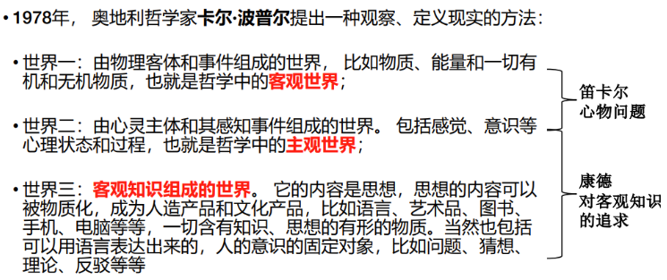
- 图灵测试(Turing Test)

	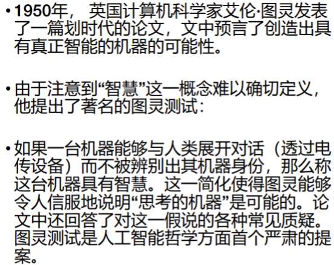
	
	无法定义智慧，辨别机器具备什么能力，来判断是否具备智慧。
- 人类的客观知识世界

	

## 计算机如何表示客观知识的世界？
- 基础表示

	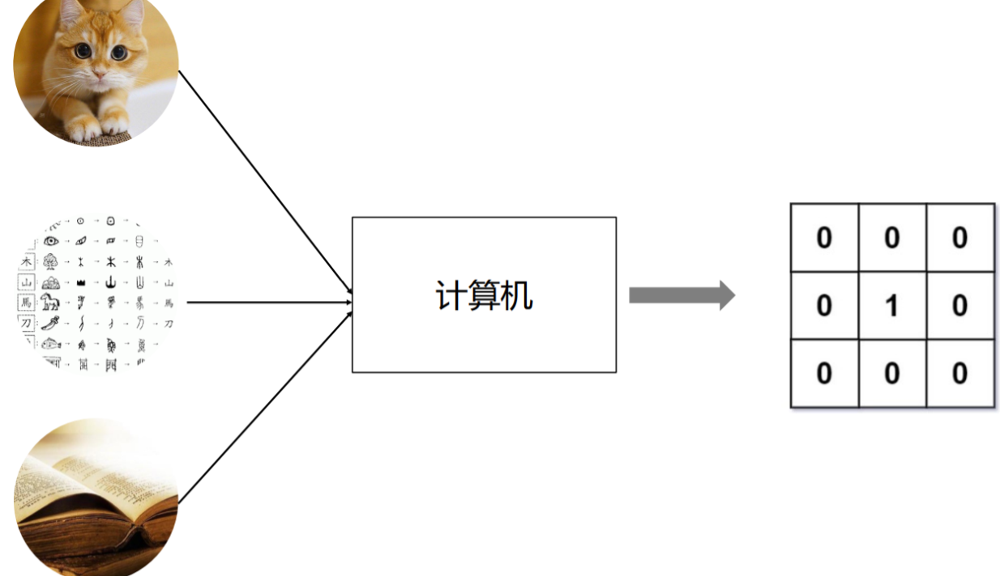
- 灰度图像表示

	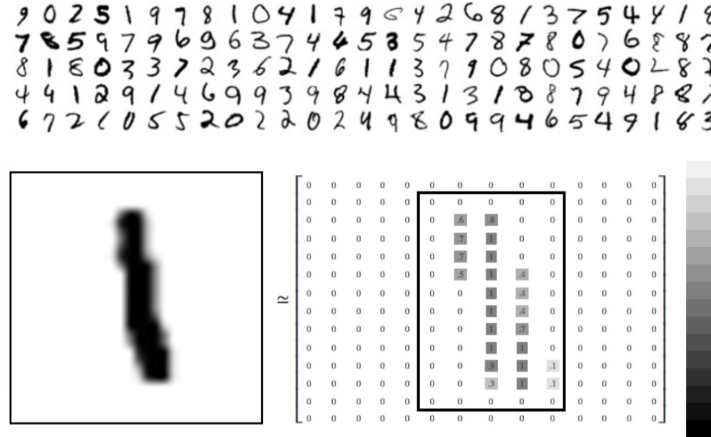
- 色彩图像表示

	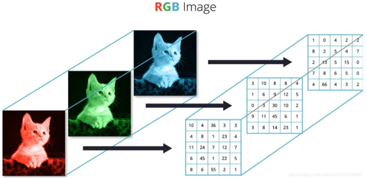
- 西文表示

	ASCII (American Standard Code for Information Interchange, 美国信息交换标准代码)是 IEEE （美国电气和电子工程师协会）里程碑之一。 1963年发布第一版，最后一次更新在1986年。 • ASCII是基于拉丁字母的一套电脑编码系统。它主要用于显示现代英语，而其扩展版本延伸美国标准信息交换码则可以部分支持其他西欧语言， 并等同于国际标准ISO/IEC 646。

	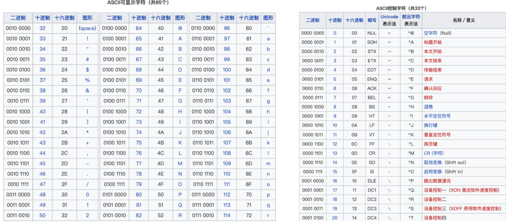
- 中文表示

	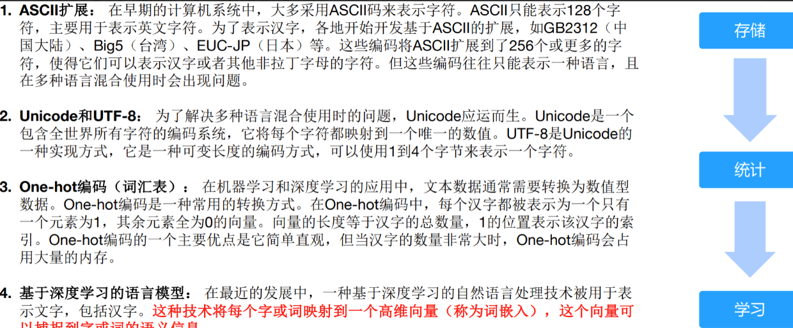

## 表示学习与 embedding
表示学习（Representation Learning）和嵌入（Embedding）是密切相关的概念，它们可以被视为在不同领域中对同一概念的不同命名或描述。

- 表示学习

	通过学习算法自动地从原始数据中学习到一种表示形式或特征表示，该表示形式能够更好地表达数据的重要特征和结构。
	
	表示学习的目标是将输入数据转换为具有良好表示能力的特征空间，使得在该空间中的数据具有更好的可分性、可解释性或推理能力。（比如让某个人学习一个知识，他学会了，这个就是知识的一种表示或特征是一个高维的概念）
- embedding

	表示学习的一种形式，通常用于将高维数据映射到低维空间中的表示形式。embedding 可以是`词 embedding`、`图像 embedding`、`图embedding`等。例如，
	
	- 在自然语言处理中，`词 embedding` 将词语映射到低维向量空间，以捕捉词语之间的语义和句法关系。
	- 在图像处理中，`图像 embedding` 将图像映射到低维向量空间，以表示图像的视觉特征。

因此，embedding 可以被视为一种表示学习的特定形式，旨在将高维数据转换为低维向量表示。表示学习可以涉及更广泛的概念和方法，包括embedding 在内，以实现对数据的更好理解和表达。

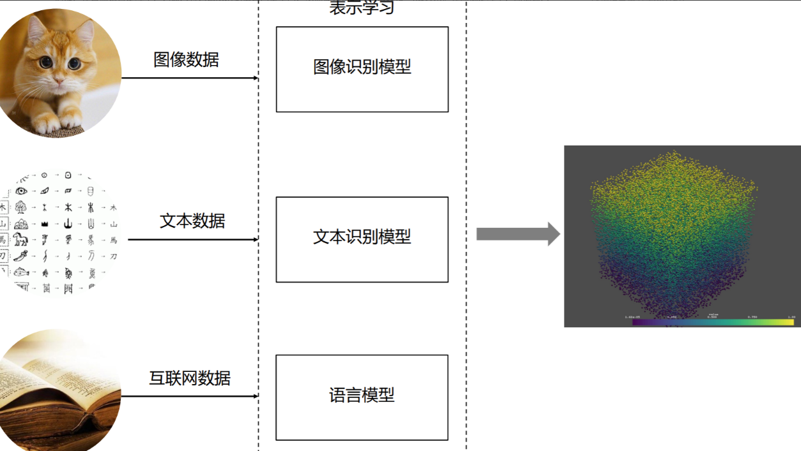

## 表示学习怎么学？
### 总结特征
- 向量数据
- 高维空间
- 特征学习
- 语义定义
- 上下文信息
- LLM
- 非结构化数据

表示学习（Representation Learning）是指通过学习算法自动地从原始数据中学习到一种表示形式或特征表示，该表示形式能够更好地表达数据的重要特征和结构。表示学习的目标是将输入数据转换为具有良好表示能力的特征空间，使得在该空间中的数据具有更好的可分性、可解释性或推理能力.

- 可分性

	表示学习的目标之一是将输入数据转换为具有更好可分性的特征空间。这意味着在学习到的表示中，不同类别或不同概念之间的样本应该有明显的边界或区别。
	
	例如，在图像分类任务中，表示学习的目标是使来自不同类别的图像在特征空间中更容易区分。这样的特征表示使得机器学习算法可以更轻松地进行分类、聚类或其他数据分析任务。
- 可解释性

	另一个表示学习的目标是生成可解释性的特征表示。这意味着学习到的特征应该具有对应于原始数据中的可理解概念或语义的含义。
	
	例如，在自然语言处理中，`词 embedding` 模型学习到的词向量应该能够捕捉到词语之间的语义关系，使得相似的词在向量空间中更接近。这样的表示不仅有助于模型的解释性，也可以在语义分析和文本生成等任务中提供更好的性能。
- 推理能力

	另一个重要的目标是使得学习到的特征表示在推理任务中更具能力。这意味着在特征空间中，我们可以执行类似于推理、类比或关联的操作。
	
	例如，通过在 `词embedding` 空间中执行向量运算，如 "国王" - "男人" + "女人"，我们可以得到与 "皇后" 非常接近的结果。这种推理能力使得我们能够进行关联和类比推理，从而在自然语言处理、推荐系统和知识图谱等领域中实现更高级的语义推理和理解。

## 维度太高，怎么知道学会了？
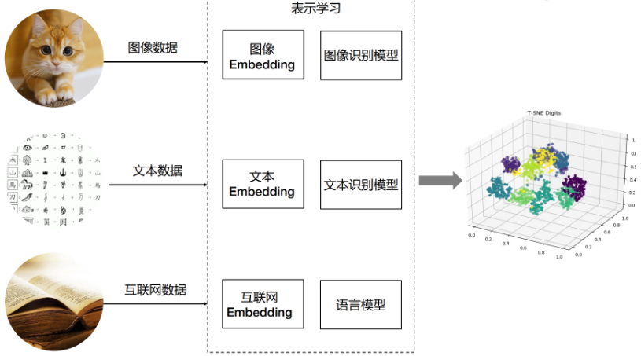
## Embedding 的价值
- 降维

	在许多实际问题中，原始数据的维度往往非常高。例如，在自然语言处理中，如果使用 One-hot 编码来表示词汇，其维度等于词汇表的大小，可能达到数十万甚至更高。通过 Embedding，我们可以将这些高维数据映射到一个低维空间，大大减少了模型的复杂度。
- 捕捉语义信息
	
	Embedding 不仅仅是降维，更重要的是，它能够捕捉到数据的语义信息。例如，在词嵌入中，语义上相近的词在向量空间中也会相近。这意味着 Embedding 可以保留并利用原始数据的一些重要信息。
- 适应性

	与一些传统的特征提取方法相比，Embedding 是通过数据驱动的方式学习的。这意味着它能够自动适应数据的特性，而无需人工设计特征。
- 泛化能力

	在实际问题中，我们经常需要处理一些在训练数据中没有出现过的数据。由于 Embedding 能够捕捉到数据的一些内在规律，因此对于这些未见过的数据，Embedding 仍然能够给出合理的表示。
- 可解释性

	尽管 Embedding 是高维的，但我们可以通过一些可视化工具(如t-SNE)来观察和理解 Embedding 的结构。这对于理解模型的行为，以及发现数据的一些潜在规律是非常有用的。

	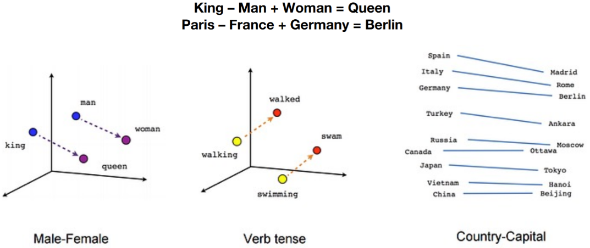

### Image Embedding
t-SNE（t-Distributed Stochastic Neighbor Embedding）是一种统计算法，用于在低维空间（通常是2D或3D，便于可视化）里展示高维数据的结构。其目标是保持原有高维空间中近邻点的距离关系，使得距离近的点在低维空间中仍然 距离近，而距离远的点在低维空间中仍然距离远。

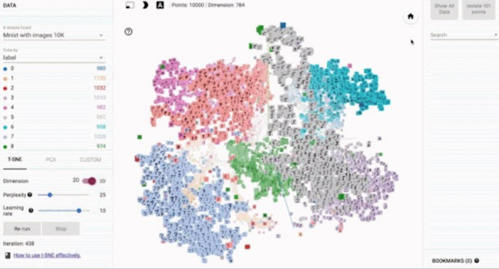

## Embedding
- 嵌入(Embedding)

	是表示学习的一种特定形式，旨在将高维数据映射到低维空间中的向量表示
- `词Embedding` (Word Embedding)

	在自然言处理中，`词Embedding `将词语映射到低维向量空间，以捕提词语之间的语义和句法关系。通过学习`词Embedding`，可以将词语表示为连续的向量，其中相似的词语在向量空间中被此靠近。它在自然语言处理任务中广泛应用，包括词语相似度计算、文本分类、命名实体识别等。`词Embedding `可以通过 Word2Vec、Glove 等方法进行学习。
- `图像Embedding`(image Embedding) 

	在图像处理中，图像入将图像映射到低维向量空间，以表示图像的视觉特征。这种嵌入方法通常通过使用卷积神经网络 (Convolutional Neural Networks,CNN) 等深度学习技术来提取图像的特征表示。
- `图Embedding` (Graph Embedding)

	是用于学习图结构的表示学习方法，将图中的节点和边映射到低维向量空间申。通过学习`图Embedding`，可以将复杂的图结构转化为向量表示，以捕提节点之间的结构和关联关系。这些方法可以通过 DeepWalk、Node2Vec、GraphSAGE 等算法来实现。`图Embedding` 在图分析、社交网络分析、推荐系统等领域中广泛应用用于发现社区结构、节点相似性、信息传播等图属性。

包括嵌入在内，表示学习涉及更广泛的概念和方法，以实现对数据的更好理解和表达

## 聚焦 Word Embedding
Word Embedding 为自然语言处理任务提供了更好的单词表示方法，它的应用主要有：

- 语义表示和语义相似度

	`Word Embedding` 可以捕捉到单词之间的语义关系，使得相似含义的单词在向量空间中彼此靠近。这使得我们可以通过计算向量之间的距离或相似度来度量单词的语义相似度。这对于
	
	- 词义消歧
	- 语义搜索
	- 语义推理等

	任务非常有用。
- 词语关系和类比推理

	`Word Embedding` 可以捕捉到单词之间的关系，如同义词、反义词、上下位关系等。通过在向量空间中进行向量运算，例如求解向量之间的差异或类比推理，我们可以发现词语之间的有趣关系。
	
	例如，对于词语之间的类比关系
		
		"king - man + woman = queen"
	通过 Word Embedding 可以得到类似的结果。
- 上下文理解

	`Word Embedding` 可以帮助理解单词的上下文信息。通过学习单词在其周围上下文中的 embedding 表示，我们可以捕捉到单词的语境信息，从而帮助解决语义歧义、词语消歧和指代消解等问题。
- 文本分类和情感分析

	`Word Embedding` 可以提供丰富的词语特征表示，从而改善文本分类和情感分析任务的性能。 通过将文本中的词语映射为 embedding 向量，并将这些向量作为输入特征，我们可以在分类器或情感分析模型中进行训练和预测。
- 机器翻译和生成模型

	`Word Embedding` 对于机器翻译和生成模型也是至关重要的。通过将源语言和目标语言的单词 都映射为 embedding向量，可以提高翻译的准确性和生成模型的质量。embedding向量可以捕捉到单词之间的语义和句法关系，帮助模型更好地理解和生成自然语言。

### “Embedding这么厉害，还要语言模型干嘛？”
- `Word Embedding`

	`词Embedding` 通常被用来生成词的向量表示，这个过程通常是`静态`的，即一旦训练完成，每个词的向量表示就确定了。`词Embedding`的主要目标是`捕获单词或短语的语义和语法信息`，并将这些信息以向量形式表示出来。`词Embedding`的一个重要特性是，语义上相近的词在 `Embedding ` 到空间中的距离也比较近。然而，`词Embedding`并不能理解上下文信息，即相同的词在不同的上下文中可能有不同的含义，但`词Embedding`无法区分这些含义。
	
- `Language Model`

	语言模型则是`预测词序列的概率模型`，这个过科通常是`动态`的，会根据输入的上下文进行变化大语言模型的主要目标是`理解和生成文本`。这包括对上下文的理解，词的预测，句了的生成等等。大语言模型会用到 `词Embedding`，但同时也会对上下文进行建模，这样可以处理词在不同上下文中的不同含义。
	
在某种程度上，你可以将 `词Embedding`看作是语言模型的一部分或者输入，大语言模型使用 `词Embedding` 捕提的信息，来进行更深层次的语义理解和文本生成。当然，现在有一些更先进的模型，比如BERT，GPT等，它们生成的是上下文相关的 `词Embedding`，即词的 Embedding 会根据上下文变化，这样一定程度上弥补了传统词 Embedding 模型的不足。

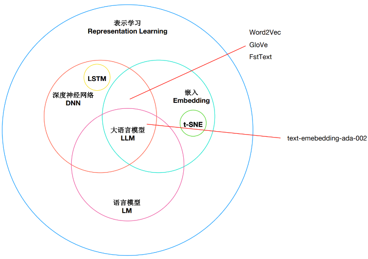

## OpenAI Embeddings 开发入门
- 安装依赖包

		pip install tiktoken openai pandas matplotlib plotly scikit-learn numpy　
- 设置环境变量

		OPENAI_API_KEY=你的-api-key
- openai 官方文档

	[https://platform.openai.com/docs/guides/embeddings/what-are-embeddings](https://platform.openai.com/docs/guides/embeddings/what-are-embeddings
)

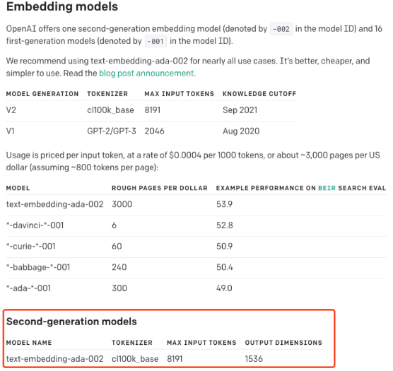
 
## 亚马逊美食评论数据集(amazon-fine-food-reviews)
### 向量化
1. 生成 Embedding (基于 text-embedding-ada-002 模型)

	embedding 对于处理自然语言和代码非常有用，因为其他机器学习模型和算法（如聚类或搜索）可以轻松地使用和比较它们。

	
	该数据集包含截至2012年10月用户在亚马逊上留下的共计568,454条美食评论。为了说明目的，我们将使用该数据集的一个子集，其中包括最近1,000条评论。这些评论都是用英语撰写的，并且倾向于积极或消极。每个评论都有一个产品ID、用户ID、评分、标题（摘要）和正文。

	我们将把评论摘要和正文合并成一个单一的组合文本。模型将对这个组合文本进行编码，并输出一个单一的向量 embedding。

		# 导入 pandas 包。Pandas 是一个用于数据处理和分析的 Python 库,提供了 DataFrame 数据结构，方便进行数据的读取、处理、分析等操作。
		import pandas as pd
		
		# 导入 tiktoken 库。Tiktoken 是 OpenAI 开发的一个库，用于从模型生成的文本中计算 token 数量。
		import tiktoken
		
		# 从 openai.embeddings_utils 包中导入 get_embedding 函数。
		# 这个函数可以获取 GPT-3 模型生成的 embedding 向量。
		# embedding 向量是模型内部用于表示输入数据的一种形式。
		from openai.embeddings_utils import get_embedding
2. 加载数据集

		input_datapath = "data/fine_food_reviews_1k.csv"
		df = pd.read_csv(input_datapath, index_col=0)
		df = df[["Time", "ProductId", "UserId", "Score", "Summary", "Text"]]
		df = df.dropna()
		 
		# 将 "Summary" 和 "Text" 字段组合成新的字段 "combined"
		df["combined"] = (
		    "Title: " + df.Summary.str.strip() + "; Content: " + df.Text.str.strip()
		)
		df.head(2)

	
3. Embedding 模型关键参数
		
		# 模型类型,建议使用官方推荐的第二代embedding模型：text-embedding-ada-002
		embedding_model = "text-embedding-ada-002"
		
		# text-embedding-ada-002 模型对应的分词器（TOKENIZER）
		embedding_encoding = "cl100k_base"
		
		# text-embedding-ada-002 模型支持的输入最大 Token 数是8191，向量维度 1536
		
		# 在我们的 DEMO 中过滤 Token 超过 8000 的文本
		max_tokens = 8000 
4. 将样本减少到最近的1,000个评论，并删除过长的样本

		# 设置要筛选的评论数量为1000
		top_n = 1000
		
		# 对DataFrame进行排序，基于"Time"列，然后选取最后的2000条评论。
		# 这个假设是，我们认为最近的评论可能更相关，因此我们将对它们进行初始筛选。
		df = df.sort_values("Time").tail(top_n * 2)
		
		# 丢弃"Time"列，因为我们在这个分析中不再需要它。
		df.drop("Time", axis=1, inplace=True)
		
		# 从'embedding_encoding'获取编码
		encoding = tiktoken.get_encoding(embedding_encoding)
		
		# 计算每条评论的token数量。我们通过使用encoding.encode方法获取每条评论的token数，然后把结果存储在新的'n_tokens'列中。
		df["n_tokens"] = df.combined.apply(lambda x: len(encoding.encode(x)))
		 
		# 如果评论的token数量超过最大允许的token数量，我们将忽略（删除）该评论。
		# 我们使用.tail方法获取token数量在允许范围内的最后top_n（1000）条评论。
		df = df[df.n_tokens <= max_tokens].tail(top_n)
		 
		# 打印出剩余评论的数量。
		len(df)

	
5. 生成 Embeddings 并保存

		# 实际生成会耗时几分钟
		# 提醒：非必须步骤，可直接复用项目中的embedding文件 fine_food_reviews_with_embeddings_1k
		df["embedding"] = df.combined.apply(lambda x: get_embedding(x, engine=embedding_model))
		 
		output_datapath = "data/fine_food_reviews_with_embeddings_1k_0904.csv"
		 
		df.to_csv(output_datapath)
6. 读取 fine_food_reviews_with_embeddings_1k embedding文件

		embedding_datapath = "data/fine_food_reviews_with_embeddings_1k.csv"
		 
		df_embedded = pd.read_csv(embedding_datapath, index_col=0)
7. 查看 Embedding 结果

		df_embedded["embedding"]

	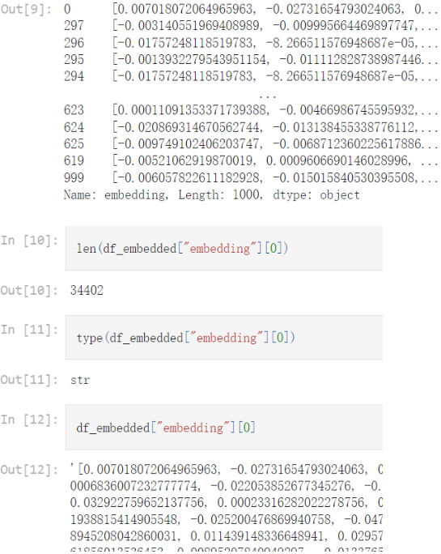
8. 字符串转向量

		import ast
		 
		# 将字符串转换为向量
		df_embedded["embedding_vec"] = df_embedded["embedding"].apply(ast.literal_eval)
		len(df_embedded["embedding_vec"][0])

	

		df_embedded.head(2)

	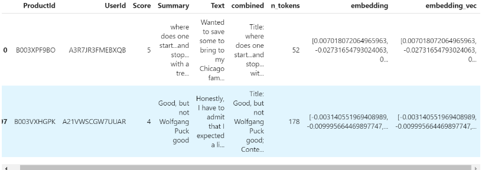

### 使用 t-SNE 可视化 1536 维 Embedding 美食评论
- 使用 t-SNE 可视化
		
		# 导入 NumPy 包，NumPy 是 Python 的一个开源数值计算扩展。这种工具可用来存储和处理大型矩阵，
		# 比 Python 自身的嵌套列表（nested list structure)结构要高效的多。
		import numpy as np
		
		# 从 matplotlib 包中导入 pyplot 子库，并将其别名设置为 plt。
		# matplotlib 是一个 Python 的 2D 绘图库，pyplot 是其子库，提供了一种类似 MATLAB 的绘图框架。
		import matplotlib.pyplot as plt
		import matplotlib
		 
		# 从 sklearn.manifold 模块中导入 TSNE 类。
		# TSNE (t-Distributed Stochastic Neighbor Embedding) 是一种用于数据可视化的降维方法，尤其擅长处理高维数据的可视化。
		# 它可以将高维度的数据映射到 2D 或 3D 的空间中，以便我们可以直观地观察和理解数据的结构。
		from sklearn.manifold import TSNE

	
- 首先，确保你的 embedding 向量都是等长的

		assert df_embedded['embedding_vec'].apply(len).nunique() == 1
- 将 embedding 向量列表转换为二维 numpy 数组

		matrix = np.vstack(df_embedded['embedding_vec'].values)
		
		# 创建一个 t-SNE 模型，t-SNE 是一种非线性降维方法，常用于高维数据的可视化。
		# n_components 表示降维后的维度（在这里是2D）
		# perplexity 可以被理解为近邻的数量
		# random_state 是随机数生成器的种子
		# init 设置初始化方式
		# learning_rate 是学习率。
		tsne = TSNE(n_components=2, perplexity=15, random_state=42, init='random', learning_rate=200)

- 使用 t-SNE 对数据进行降维，得到每个数据点在新的2D空间中的坐标

		vis_dims = tsne.fit_transform(matrix)
- 定义了五种不同的颜色，用于在可视化中表示不同的等级

		colors = ["red", "darkorange", "gold", "turquoise", "darkgreen"]
- 从降维后的坐标中分别获取所有数据点的横坐标和纵坐标

		x = [x for x,y in vis_dims]
		y = [y for x,y in vis_dims]
 
		# 根据数据点的评分（减1是因为评分是从1开始的，而颜色索引是从0开始的）获取对应的颜色索引
		color_indices = df_embedded.Score.values - 1
		 
		# 确保你的数据点和颜色索引的数量匹配
		assert len(vis_dims) == len(df_embedded.Score.values)
- 创建一个基于预定义颜色的颜色映射对象
		
		colormap = matplotlib.colors.ListedColormap(colors)
		# 使用 matplotlib 创建散点图，其中颜色由颜色映射对象和颜色索引共同决定，alpha 是点的透明度
		plt.scatter(x, y, c=color_indices, cmap=colormap, alpha=0.3)
		 
		# 为图形添加标题
		plt.title("Amazon ratings visualized in language using t-SNE")

	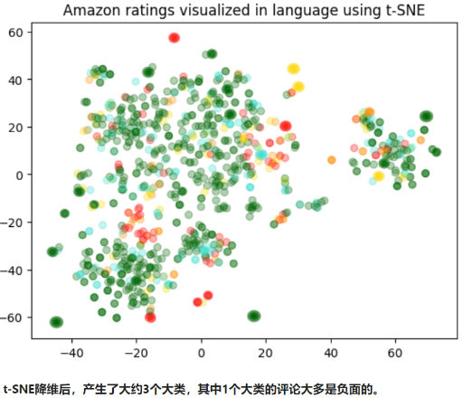
- 使用 K-Means 聚类，然后使用 t-SNE 可视化

		import numpy as np
		
		# 从 scikit-learn中导入 KMeans 类。KMeans 是一个实现 K-Means 聚类算法的类。
		from sklearn.cluster import KMeans
		 
		# np.vstack 是一个将输入数据堆叠到一个数组的函数（在垂直方向）。
		# 这里它用于将所有的 ada_embedding 值堆叠成一个矩阵。
		# matrix = np.vstack(df.ada_embedding.values)
		# 定义要生成的聚类数。
		n_clusters = 4
		 
		# 创建一个 KMeans 对象，用于进行 K-Means 聚类。
		# n_clusters 参数指定了要创建的聚类的数量；
		# init 参数指定了初始化方法（在这种情况下是 'k-means++'）；
		# random_state 参数为随机数生成器设定了种子值，用于生成初始聚类中心。
		# n_init=10 消除警告 'FutureWarning: The default value of `n_init` will change from 10 to 'auto' in 1.4'
		kmeans = KMeans(n_clusters = n_clusters, init='k-means++', random_state=42, n_init=10)
		 
		# 使用 matrix（我们之前创建的矩阵）来训练 KMeans 模型。这将执行 K-Means 聚类算法。
		kmeans.fit(matrix)
		 
		# kmeans.labels_ 属性包含每个输入数据点所属的聚类的索引。
		# 这里，我们创建一个新的 'Cluster' 列，在这个列中，每个数据点都被赋予其所属的聚类的标签。
		df_embedded['Cluster'] = kmeans.labels_

	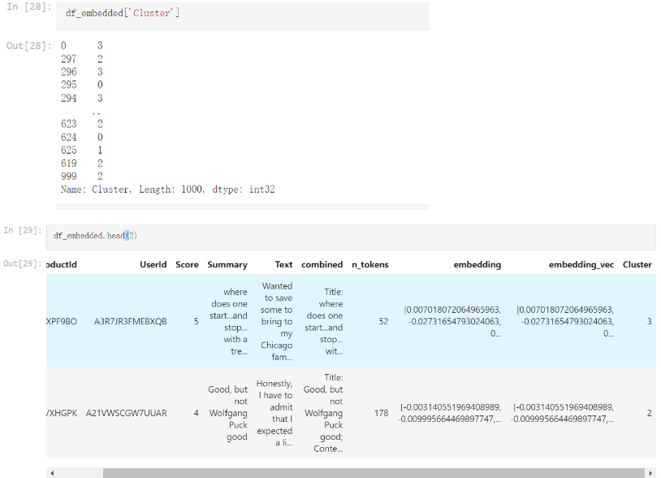

		# 首先为每个聚类定义一个颜色。
		colors = ["red", "green", "blue", "purple"]
		 
		# 然后，你可以使用 t-SNE 来降维数据。这里，我们只考虑 'embedding_vec' 列。
		tsne_model = TSNE(n_components=2, random_state=42)
		vis_data = tsne_model.fit_transform(matrix)
		 
		# 现在，你可以从降维后的数据中获取 x 和 y 坐标。
		x = vis_data[:, 0]
		y = vis_data[:, 1]
		 
		# 'Cluster' 列中的值将被用作颜色索引。
		color_indices = df_embedded['Cluster'].values
		 
		# 创建一个基于预定义颜色的颜色映射对象
		colormap = matplotlib.colors.ListedColormap(colors)
		 
		# 使用 matplotlib 创建散点图，其中颜色由颜色映射对象和颜色索引共同决定
		plt.scatter(x, y, c=color_indices, cmap=colormap)
		 
		# 为图形添加标题
		plt.title("Clustering visualized in 2D using t-SNE")
		 
		# 显示图形
		plt.show()

	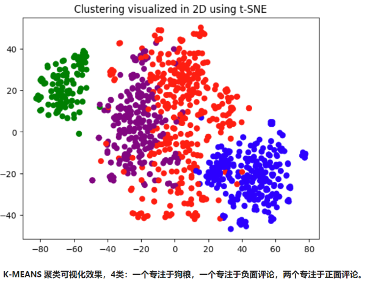

### 使用 Embedding 进行文本搜索

- `cosine_similarity` 函数计算两个 `embedding` 向量之间的余弦相似度

		from openai.embeddings_utils import get_embedding, cosine_similarity

	
		
		# 定义一个名为 search_reviews 的函数，
		# Pandas DataFrame 产品描述，数量，以及一个 pprint 标志（默认值为 True）。
		def search_reviews(df, product_description, n=3, pprint=True):
		    product_embedding = get_embedding(
		        product_description,
		        engine="text-embedding-ada-002"
		    )
		    df["similarity"] = df.embedding_vec.apply(lambda x: cosine_similarity(x, product_embedding))
		 
		    results = (
		        df.sort_values("similarity", ascending=False)
		        .head(n)
		        .combined.str.replace("Title: ", "")
		        .str.replace("; Content:", ": ")
		    )
		    if pprint:
		        for r in results:
		            print(r[:200])
		            print()
		    return results
		
		# 使用 'delicious beans' 作为产品描述和 3 作为数量，
		# 调用 search_reviews 函数来查找与给定产品描述最相似的前3条评论。
		# 其结果被存储在 res 变量中。
		res = search_reviews(df_embedded, 'delicious beans', n=3)

	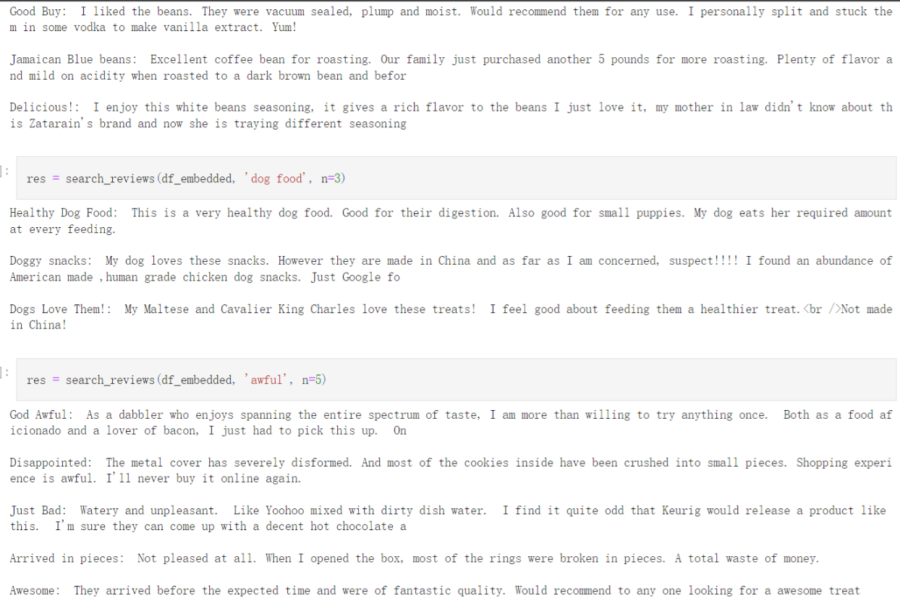

## 自测
### 单项选择题
- “表示学习”主要是指什么？    

	解释：表示学习的主要目标是找到一种方式来转换原始数据，使得转换后的表示能更好地支持后续的任务。例如，在图像识别任务中，原始像素值可能不是一个好的数据表示，而通过某种方法学习到的特征（例如边缘、颜色、形状等）可能会提供更好的性能

		A. 学习数据的原始表示
		B. 学习数据的有用表示 (正确)
		C. 学习数据的随机表示
		D. 学习数据的复杂表示
- 在 NLP 中，最常用的数据表示方法是什么？ 

	解释：自然语言处理（NLP）中的数据通常是文本。一种有效的处理文本数据的方法是将其转化为数值或者向量形式，这种转化过程就是数据表示。例如，一个最简单的方法是one-hot编码，每个词被编码为一个很长的向量，这个向量的维度是词汇表的大小，向量的所有元素都是0，除了表示该词的索引位置的元素是1

		A. 图像
		B. 视频
		C. 文本 (正确)
		D. 音频
- Word2Vec 是一个什么样的模型？

	解释：Word2Vec是一种用于学习词向量的模型，它通过训练神经网络模型，将语料库中的每个词映射到一个向量，以便使语义上相似的词在向量空间中靠近

		A. 用于语音识别的模型
		B. 用于图像识别的模型
		C. 用于词表示学习的模型 (正确)
		D. 用于视频处理的模型
- GloVe 模型的主要目标是什么？  

	解释：GloVe模型的目标是学习词向量，这些向量可以捕捉到词的共现信息，即在给定的文本中，哪些词经常在一起出现。例如，在"GloVe模型"这个短语中，"GloVe"和"模型"就是共现的词

		A. 在给定的文本中找到最频繁出现的词
		B. 在给定的文本中找到最少出现的词
		C. 在给定的文本中找到相关性最强的词(正确)
		D. 在给定的文本中找到最不相关的词
- 表示学习在自然语言处理中的主要应用是什么？ 

	解释：表示学习的一个重要应用是语义理解。通过学习到的表示，我们可以更好地理解和解析文本数据。例如，通过学习词的向量表示，我们可以量化词的相似性，并使用这种相似性来理解和生成文本

		A. 语音识别
		B. 语义理解(正确)
		C. 图像识别
		D. 视频处理
- Word2Vec 和 GloVe 有什么共同点？

	解释：Word2Vec和GloVe都是用于学习词向量的模型，它们都能将文本转换为实数向量，以便于机器进行处理。这两种模型的目标都是把词语映射到一个多维空间，使得语义上相似的词在这个空间中靠近

		A. 都是图像识别模型
		B. 都是词表示学习模型 (正确)
		C. 都是语音识别模型
		D. 都是视频处理模型
- 在 OpenAI Embeddings 中，一般采用什么方法对词进行表示？ 解释：在OpenAI Embeddings中，每个词被表示为一个实数向量。这种表示可以捕获词语的语义，使得语义上相似的词在向量空间中靠近。例如，"猫"和"狗"这两个词，在向量空间中应该比"猫"和"汽车"更靠近

		A. 用一个唯一的 ID 表示
		B. 用一个独热向量表示
		C. 用一个实数向量表示 (正确)
		D. 用一个复数向量表示
- 在词向量中，词的相似度通常用什么衡量？

	解释：在词向量中，词的相似度通常通过计算它们向量之间的余弦相似度来衡量。余弦相似度可以捕捉到向量的夹角，如果两个向量的方向相似（即夹角小），那么它们的余弦相似度就会高，表示这两个词在语义上是相似的

		A. 欧氏距离
		B. 余弦相似度 (正确)
		C. 曼哈顿距离
		D. 切比雪夫距离
- 在表示学习中，为什么要用非监督学习？ 

	解释：在监督学习中，我们需要大量的标签数据，这些数据往往难以获得。而在非监督学习中，我们可以利用大量的未标记数据。因此，在表示学习中，非监督学习是一种常见的方法

		A. 因为监督学习太复杂
		B. 因为监督学习无法处理大数据 
		C. 因为监督学习需要太多的标签数据 (正确)
		D. 因为监督学习效果不好
- 在表示学习中，主要使用哪种方法来优化词向量？ 

	解释：在表示学习中，我们通常使用随机梯度下降（SGD）方法来优化词向量。SGD是一种迭代方法，每次只用一个（或者一小批）样本来更新参数，这样可以显著降低计算量，加快优化的速度
	
		A. 用反向传播优化
		B. 用随机梯度下降优化 (正确)
		C. 用动量法优化
		D. 用牛顿法优化
		
## 参考
[大模型开发基础：OpenAI Embedding ](https://www.cnblogs.com/crazymagic/articles/17743236.html)