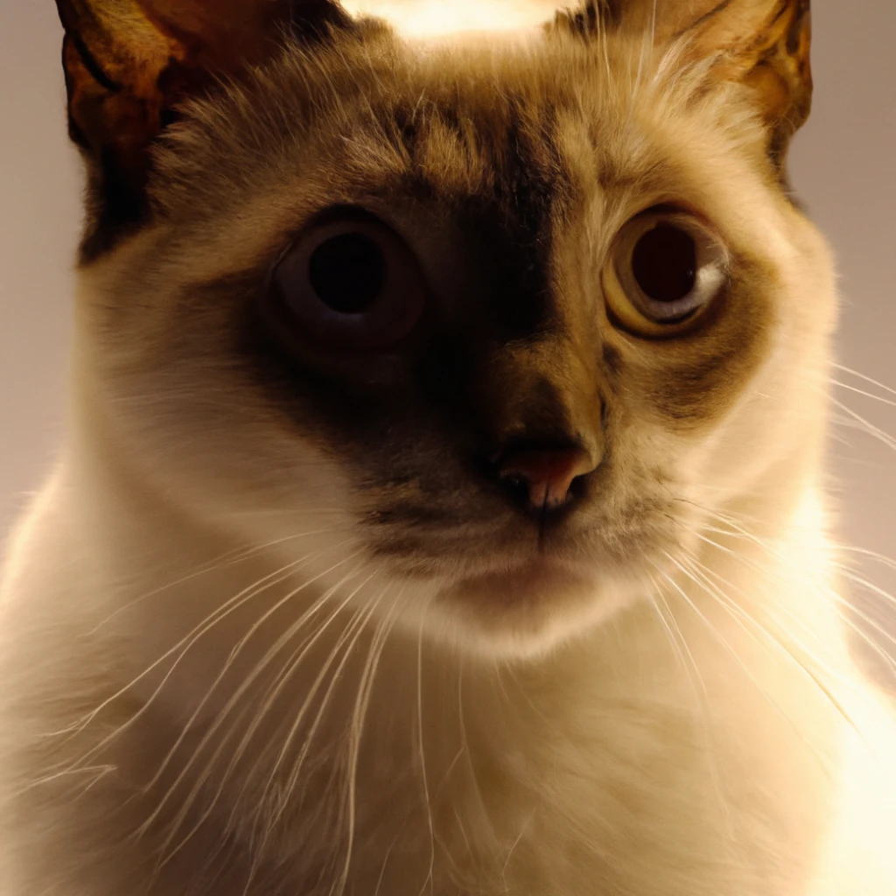
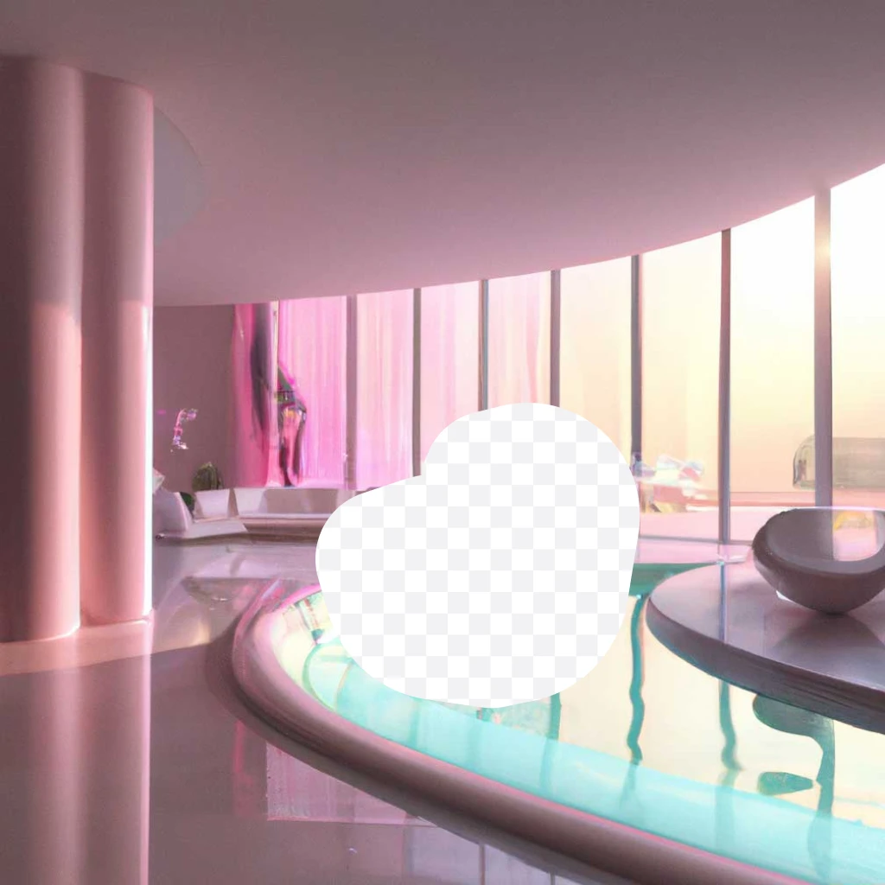
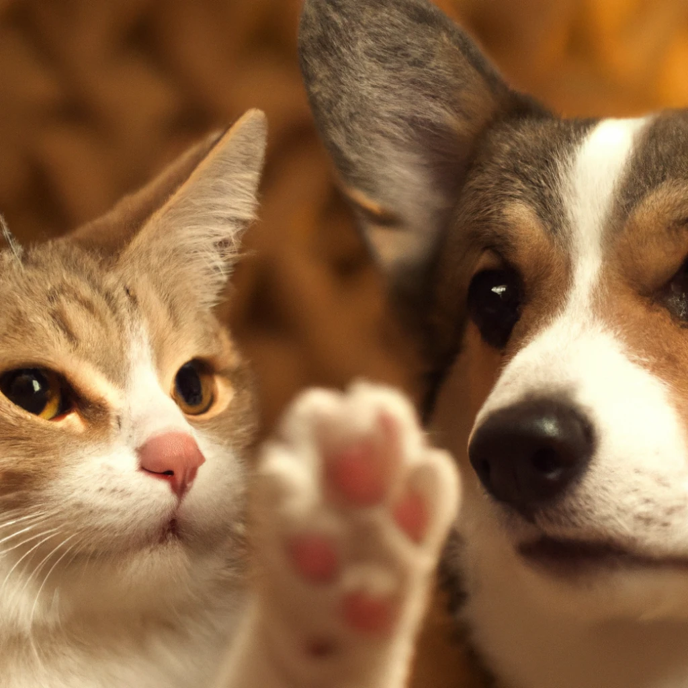
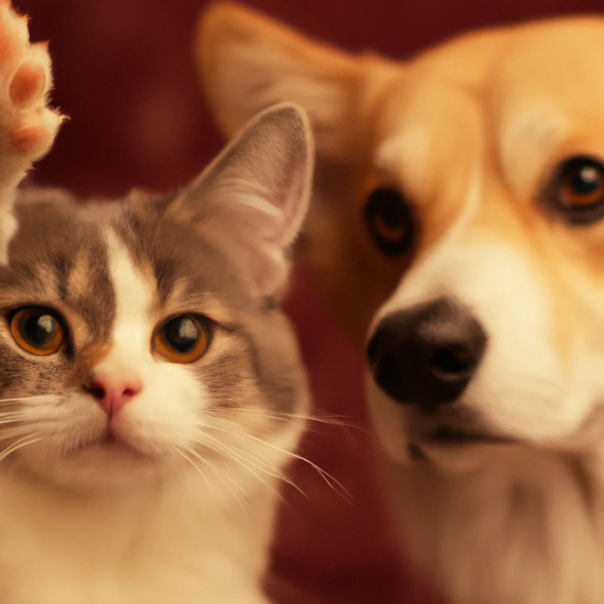

## 图像生成测试版
了解如何使用我们的 DALL·E 模型生成或处理图像
### 介绍
图片 API 提供了三种与图片交互的方法：

- 根据文本提示从头开始创建图像
- 根据新文本提示创建现有图像的编辑
- 创建现有图像的变体

本指南涵盖了使用这三个 API 端点的基础知识以及有用的代码示例。要查看它们的实际效果，请查看我们的 [DALL·E 预览应用程序](https://labs.openai.com/)。

图片 API 处于测试阶段。在此期间，API 和模型将根据您的反馈进行改进。为确保所有用户都能轻松制作原型，默认速率限制为每分钟 20 张图像，每 5 分钟 50 张。如果您想提高速率限制，请查看这篇[帮助中心文章](https://help.openai.com/en/articles/6696591)。随着我们对使用和容量要求的更多了解，我们将提高默认速率限制。

### 用法
#### Generations
[图像生成](https://beta.openai.com/docs/api-reference/images/create)端点允许您在给定文本提示的情况下创建原始图像。生成的图像的大小可以为 256x256、512x512 或 1024x1024 像素。较小的尺寸生成速度更快。您可以[使用 n](http://localhost:5000/docs/api-reference/images/create#images/create-n) 参数一次请求 1-10 张图像。

生成图像
Python

	response = openai.Image.create(
	  prompt="a white siamese cat",
	  n=1,
	  size="1024x1024"
	)
	image_url = response['data'][0]['url']
描述越详细，您就越有可能获得您或您的最终用户想要的结果。您可以探索 [DALL·E 预览应用程序](https://labs.openai.com/)中的示例以获得更多提示灵感。这是一个简单的例子：

PROMPT| GENERATION
---|---
a white siamese cat| 	
a close up, studio photographic portrait of a white siamese cat that looks curious, backlit ears|	
使用 [response_format](http://localhost:5000/docs/api-reference/images/create#images/create-response_format) 参数，每个图像都可以作为 URL 或 Base64 数据返回。URL 将在一小时后过期。

#### 编辑
[图像编辑](https://beta.openai.com/docs/api-reference/images/create-edit)端点允许您通过上传蒙版来编辑和扩展图像。遮罩的透明区域指示应编辑图像的位置，提示应描述完整的新图像，而不仅仅是擦除区域。此端点可以启用类似我们 DALL·E 预览应用程序中的[编辑器](https://labs.openai.com/editor)的体验。

编辑图像    Python

	response = openai.Image.create_edit(
	  image=open("sunlit_lounge.png", "rb"),
	  mask=open("mask.png", "rb"),
	  prompt="A sunlit indoor lounge area with a pool containing a flamingo",
	  n=1,
	  size="1024x1024"
	)
	image_url = response['data'][0]['url']
图片|面具|输出
---|---|---
||
提示：一个阳光充足的室内休息区，带有一个包含火烈鸟的游泳池

要求

- 上传的图片和遮罩必须是小于 4MB 的正方形 PNG 图片
- 并且必须具有相同的尺寸。
- 生成输出时不使用遮罩的非透明区域，因此它们不一定需要像上面的示例那样与原始图像匹配。

#### 变化
[图像变体](https://beta.openai.com/docs/api-reference/images/create-variation)端点允许您生成给定图像的变体。

生成图像变体  Python

	response = openai.Image.create_variation(
	  image=open("corgi_and_cat_paw.png", "rb"),
	  n=1,
	  size="1024x1024"
	)
	image_url = response['data'][0]['url']
图片|输出
---|---
|
	
与编辑端点类似，输入图像必须是大小小于 4MB 的方形 PNG 图像。

#### 内容审核
提示和图像根据我们的[内容政策](https://labs.openai.com/policies/content-policy)进行过滤，当提示或图像被标记时返回错误。如果您对误报或相关问题有任何反馈，请通过我们的[帮助中心](https://help.openai.com/)联系我们。

### 特定语言提示
#### Node.JS(还支持 python)
- 使用内存图像数据

	上面指南中的 Node.js 示例使用该 `fs` 模块从磁盘读取图像数据。在某些情况下，您可能会将图像数据保存在内存中。`Buffer` 下面是一个使用存储在 Node.js 对象中的图像数据的 API 调用示例：

		// 这是包含图像数据的Buffer对象
		const buffer = [your image data];
		// 设置一个以。PNG结尾的' name '，以便API知道这是一个PNG图像
		buffer.name = "image.png";
		const response = await openai.createImageVariation(
		  buffer,
		  1,
		  "1024x1024"
		);
- 使用打字稿

	如果您使用的是 TypeScript，您可能会遇到一些图像文件参数的问题。下面是通过显式转换参数来解决类型不匹配的示例：

		// 将 ReadStream 转换为' any '以满足TypeScript编译器的要求
		const response = await openai.createImageVariation(
		  fs.createReadStream("image.png") as any,
		  1,
		  "1024x1024"
		);
	这是内存中图像数据的类似示例：

		// 这是包含图像数据的Buffer对象
		const buffer: Buffer = [your image data];
		// 将缓冲区转换为' any '，以便我们可以设置' name '属性
		const file: any = buffer;
		// 设置一个以。PNG结尾的' name '，以便API知道这是一个PNG图像
		file.name = "image.png";
		const response = await openai.createImageVariation(
		  file,
		  1,
		  "1024x1024"
		);
- 错误处理

	API 请求可能会由于无效输入、速率限制或其他问题而返回错误。这些错误可以用一条try...catch语句来处理，错误的详细信息可以在 `error.responseor` 中找到 `error.message`：

		try {
		  const response = await openai.createImageVariation(
		    fs.createReadStream("image.png"),
		    1,
		    "1024x1024"
		  );
		  console.log(response.data.data[0].url);
		} catch (error) {
		  if (error.response) {
		    console.log(error.response.status);
		    console.log(error.response.data);
		  } else {
		    console.log(error.message);
		  }
		}