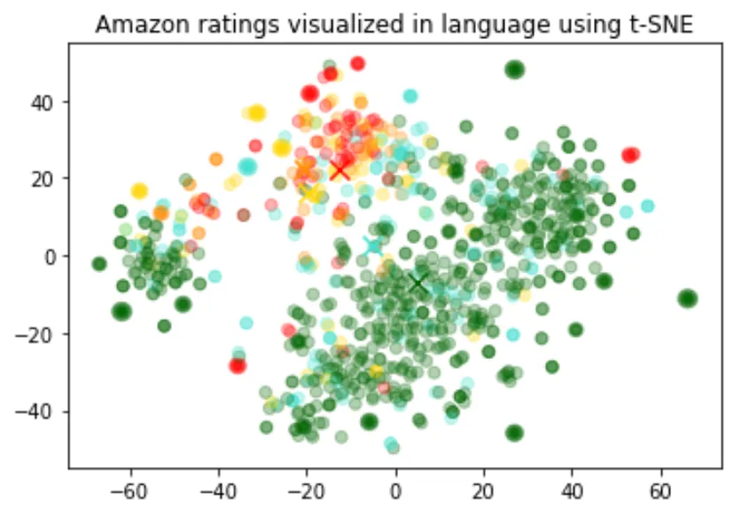

## 嵌入
### 什么是嵌入？
嵌入是一种特殊的数据表示格式，可以很容易地被机器学习模型和算法利用。

嵌入是一段文本语义的信息密集表示。

每个嵌入都是一个浮点数向量，因此向量空间中两个嵌入之间的距离与原始格式中两个输入之间的语义相似性相关。

	例如，如果两个文本相似，那么它们的向量表示也应该相似。
访问我们的[定价页面](https://openai.com/api/pricing/)以了解嵌入定价。请求根据您发送到模型的输入中的[ token ](https://beta.openai.com/tokenizer)数量计费。

要查看嵌入的实际效果，请查看我们的代码示例

- 分类
- 主题聚类
- 搜索
- 建议

### 嵌入模型的类型
目前，我们为不同的功能提供了三个嵌入模型系列：文本搜索、文本相似性和代码搜索。每个系列在一系列功能上包括多达四种型号：

- Ada (1024 维度),
- Babbage (2048 维度),
- Curie (4096 维度),
- Davinci (12288 维度).

Davinci 是最有能力的，但比其他型号更慢且更昂贵。Ada 的能力最差，但速度更快，成本更低。

这些嵌入模型是专门为擅长特定任务而创建的。

#### 相似性嵌入
这些模型擅长捕捉两段或多段文本之间的语义相似性。

用例|可用型号
---|---
聚类、回归、异常检测、可视化|text-similarity-ada-001  text-similarity-babbage-001  text-similarity-curie-001  text-similarity-davinci-001

#### 文本搜索嵌入
这些模型有助于衡量长文档是否与短搜索查询相关。有两种类型：

- 一种用于嵌入要检索的文档
- 一种用于嵌入搜索查询

用例|可用型号
---|---
搜索、上下文相关性、信息检索|text-search-ada-doc-001 text-search-ada-query-001 text-search-babbage-doc-001 text-search-babbage-query-001 text-search-curie-doc-001 text-search-curie-query-001 text-search-davinci-doc-001 text-search-davinci-query-001

#### 代码搜索嵌入
与搜索嵌入类似，有两种类型：

- 一种用于嵌入要检索的代码片段
- 另一种用于嵌入自然语言搜索查询。

用例|可用型号
---|---
代码搜索和相关性|code-search-ada-code-001 code-search-ada-text-001 code-search-babbage-code-001 code-search-babbage-text-001

使用我们的嵌入模型时，请牢记它们的[局限性和风险](https://beta.openai.com/docs/guides/embeddings/limitations-risks)。

### 如何获得嵌入
为了获得一段文本的嵌入向量，我们向 [Embeddings](https://beta.openai.com/docs/api-reference/embeddings) 端点发出请求，如以下代码片段所示：

示例：获取嵌入 curl(还支持 python)
	
	curl https://api.openai.com/v1/embeddings \
	  -H "Content-Type: application/json" \
	  -H "Authorization: Bearer $OPENAI_API_KEY" \
	  -d '{"input": "Sample document text goes here",
	       "model":"text-similarity-babbage-001"}'

您还可以参考 [Get_Embeddings.ipynb](https://github.com/openai/openai-cookbook/blob/main/examples/Get_embeddings.ipynb) 获取使用此 API 的 python notebook 示例。

请注意，我们的嵌入模型的最大输入文本长度为 2048 个[标记](https://beta.openai.com/tokenizer)（大约相当于 2-3 页文本）。在提出请求之前，您应该验证您的输入不超过此限制。

对于搜索模型，您可以通过两种方式获得嵌入。该 `<search_model>-doc` 模型用于较长的文本片段（要搜索），该< `search_model>-query` 模型用于较短的文本片段，通常是零镜头分类中的查询或类标签。

	除非您要嵌入代码，否则我们建议将\n输入中的换行符 ( ) 替换为单个空格，因为我们观察到存在换行符时效果较差。

### 用例
在这里，我们展示了一些有代表性的用例。我们将在以下示例中使用[亚马逊美食评论数据集](https://www.kaggle.com/snap/amazon-fine-food-reviews)。
#### 获取嵌入
该数据集包含截至 2012 年 10 月亚马逊用户留下的总共 568,454 条食品评论。我们将使用 1,000 条最新评论的子集用于说明目的。评论是英文的，往往是正面的或负面的。每条评论都有一个

- 产品Id
- 用户Id
- 评分
- 评论标题（摘要）
- 和评论正文（文本）。

例如：

产品Id|用户Id|评分|摘要|文本
---|---|---|---|---
B001E4KFG0|A3SGXH7AUHU8GW|5个|优质狗粮|我买了好几个活力罐头...
B00813GRG4|A1D87F6ZCVE5NK|1个|不像宣传的那样|产品到达时标记为 Jumbo Salted Peanut...

我们会将评论摘要和评论文本合并为一个组合文本。该模型将对该组合文本进行编码并输出单个向量嵌入。

获取 [dataset.ipynb](https://github.com/openai/openai-cookbook/blob/main/examples/Obtain_dataset.ipynb)

	def get_embedding(text, model="text-similarity-davinci-001"):
	   text = text.replace("\n", " ")
	   return openai.Embedding.create(input = [text], model=model)['data'][0]['embedding']
	 
	df['babbage_similarity'] = df.combined.apply(lambda x: get_embedding(x, model='text-similarity-babbage-001'))
	df['babbage_search'] = df.combined.apply(lambda x: get_embedding(x, model='text-search-babbage-doc-001'))
	df.to_csv('output/embedded_1k_reviews.csv', index=False)
要从保存的文件中加载数据，您可以运行以下命令：

	import pandas as pd
	 
	df = pd.read_csv('output/embedded_1k_reviews.csv')
	df['babbage_similarity'] = df.babbage_similarity.apply(eval).apply(np.array)
	df['babbage_search'] = df.babbage_search.apply(eval).apply(np.array)
### 二维数据可视化
[在 2d.ipynb 中可视化](https://github.com/openai/openai-cookbook/blob/main/examples/Visualizing_embeddings_in_2D.ipynb)

嵌入的大小随底层模型的复杂性而变化。为了可视化这种高维数据，我们使用 t-SNE 算法将数据转换为二维。

我们根据评论者给出的星级评分为各个评论着色：

- 1星：红色
- 2星：深橙色
- 3星：黄金
- 4星：绿松石
- 5星：深绿色

使用 t-SNE 以语言可视化的亚马逊评分

可视化似乎产生了大约 3 个集群，其中一个集群的评论大多是负面的。

	import pandas as pd
	from sklearn.manifold import TSNE
	import matplotlib.pyplot as plt
	import matplotlib
	 
	df = pd.read_csv('output/embedded_1k_reviews.csv')
	matrix = df.babbage_similarity.apply(eval).to_list()
 
	# 创建 t-SNE 模型并转换数据
	tsne = TSNE(n_components=2, perplexity=15, random_state=42, init='random', learning_rate=200)
	vis_dims = tsne.fit_transform(matrix)
	 
	colors = ["red", "darkorange", "gold", "turquiose", "darkgreen"]
	x = [x for x,y in vis_dims]
	y = [y for x,y in vis_dims]
	color_indices = df.Score.values - 1
	 
	colormap = matplotlib.colors.ListedColormap(colors)
	plt.scatter(x, y, c=color_indices, cmap=colormap, alpha=0.3)
	plt.title("Amazon ratings visualized in language using t-SNE")
	
### 嵌入作为 ML 算法的文本特征编码器
[回归.ipynb](https://github.com/openai/openai-cookbook/blob/main/examples/Regression_using_embeddings.ipynb)

嵌入可以用作机器学习模型中的通用自由文本特征编码器。如果一些相关输入是自由文本，则合并嵌入将提高任何机器学习模型的性能。嵌入也可以用作 ML 模型中的分类特征编码器。如果分类变量的名称有意义且数量众多，例如职位名称，那么这会增加最大的价值。对于此任务，相似性嵌入通常比搜索嵌入表现更好。

我们观察到，通常嵌入表示非常丰富且信息密集。

	例如，使用 SVD 或 PCA 降低输入的维度，即使降低 10%，通常也会导致特定任务的下游性能变差。
此代码将数据拆分为训练集和测试集，将由以下两个用例使用，即回归和分类。

	from sklearn.model_selection import train_test_split
	 
	X_train, X_test, y_train, y_test = train_test_split(
	    list(df.babbage_similarity.values),
	    df.Score,
	    test_size = 0.2,
	    random_state=42
	)
#### 使用嵌入特征进行回归
嵌入提供了一种预测数值的优雅方法。在此示例中，我们根据评论文本预测评论者的星级。因为嵌入中包含的语义信息很高，所以即使评论很少，预测也不错。

我们假设分数是 1 到 5 之间的连续变量，并允许算法预测任何浮点值。ML 算法最小化预测值与真实分数的距离，并实现 0.39 的平均绝对误差，这意味着平均预测偏差不到半星。

	from sklearn.ensemble import RandomForestRegressor
	 
	rfr = RandomForestRegressor(n_estimators=100)
	rfr.fit(X_train, y_train)
	preds = rfr.predict(X_test)
### 使用嵌入特征进行分类
[分类.ipynb](https://github.com/openai/openai-cookbook/blob/main/examples/Classification_using_embeddings.ipynb)

这一次，我们不再让算法预测 1 到 5 之间的任何值，而是尝试将评论的确切星数分类为 5 个桶，范围从 1 到 5 星。

训练后，该模型学习预测 1 星和 5 星评论比更细微的评论（2-4 星）更好，这可能是由于更极端的情绪表达。

	from sklearn.ensemble import RandomForestClassifier
	from sklearn.metrics import classification_report, accuracy_score
	 
	clf = RandomForestClassifier(n_estimators=100)
	clf.fit(X_train, y_train)
	preds = clf.predict(X_test)
### 零样本分类
[零样本分类.ipynb](https://github.com/openai/openai-cookbook/blob/main/examples/Zero-shot_classification_with_embeddings.ipynb)

我们可以在没有任何标记训练数据的情况下使用嵌入进行零样本分类。对于每个类，我们嵌入类名或类的简短描述。为了以零样本方式对一些新文本进行分类，我们将其嵌入与所有类嵌入进行比较，并预测具有最高相似度的类。

	from openai.embeddings_utils import cosine_similarity, get_embedding
	 
	df= df[df.Score!=3]
	df['sentiment'] = df.Score.replace({1:'negative', 2:'negative', 4:'positive', 5:'positive'})
	 
	labels = ['negative', 'positive']
	label_embeddings = [get_embedding(label, model=model) for label in labels]
	 
	def label_score(review_embedding, label_embeddings):
	   return cosine_similarity(review_embedding, label_embeddings[1]) - cosine_similarity(review_embedding, label_embeddings[0])
	 
	prediction = 'positive' if label_score('Sample Review', label_embeddings) > 0 else 'negative'
### 获取用于冷启动推荐的用户和产品嵌入
[用户和产品嵌入.ipynb](https://github.com/openai/openai-cookbook/blob/main/examples/User_and_product_embeddings.ipynb)

我们可以通过对他们的所有评论进行平均来获得用户嵌入。同样，我们可以通过对有关该产品的所有评论进行平均来获得产品嵌入。为了展示这种方法的实用性，我们使用 50k 评论的子集来覆盖每个用户和每个产品的更多评论。

我们在单独的测试集上评估这些嵌入的有用性，我们将用户和产品嵌入的相似性绘制为评分的函数。有趣的是，基于这种方法，甚至在用户收到产品之前，我们就可以比随机预测更好地预测他们是否喜欢该产品。

按得分分组的箱线图

	user_embeddings = df.groupby('UserId').babbage_similarity.apply(np.mean)
	prod_embeddings = df.groupby('ProductId').babbage_similarity.apply(np.mean)
### 聚类
[聚类.ipynb](聚类.ipynb)

聚类是理解大量文本数据的一种方式。相似性嵌入对于这项任务很有用，因为它是每个文本的语义向量表示。因此，以一种无监督的方式，聚类将揭示我们数据集中隐藏的分组。

在这个例子中，我们发现了四个不同的集群：

- 一个专注于狗食
- 一个专注于负面评论
- 两个专注于正面评论

使用 t-SNE 以 2d 语言可视化识别的集群

	import numpy as np
	from sklearn.cluster import KMeans
	 
	matrix = np.vstack(df.babbage_similarity.values)
	n_clusters = 4
	 
	kmeans = KMeans(n_clusters = n_clusters, init='k-means++', random_state=42)
	kmeans.fit(matrix)
	df['Cluster'] = kmeans.labels_
### 使用嵌入的文本搜索
[使用 embeddings.ipynb 进行语义文本搜索](https://github.com/openai/openai-cookbook/blob/main/examples/Semantic_text_search_using_embeddings.ipynb)

对于基于嵌入的搜索，我们将采用搜索模型族，因为它专门用于文档检索。在示例中，文档由 `text-search-babbage-doc-001` 模型嵌入，查询由 `text-search-babbage-query-001` 模型处理。

为了检索最相关的文档，我们使用查询的嵌入向量与每个文档之间的余弦相似度，并返回得分最高的文档。

	from openai.embeddings_utils import get_embedding, cosine_similarity
	 
	def search_reviews(df, product_description, n=3, pprint=True):
	   embedding = get_embedding(product_description, model='text-search-babbage-query-001')
	   df['similarities'] = df.babbage_search.apply(lambda x: cosine_similarity(x, embedding))
	   res = df.sort_values('similarities', ascending=False).head(n)
	   return res
	 
	res = search_reviews(df, 'delicious beans', n=3)

### 使用嵌入的代码搜索
[代码搜索.ipynb](https://github.com/openai/openai-cookbook/blob/main/examples/Code_search.ipynb)

代码搜索的工作方式类似于基于嵌入的文本搜索，但该模型专门用于使用自然语言查询搜索代码片段。

我们提供了一种从给定存储库中的所有 Python 文件中提取 Python 函数的方法。然后每个函数由代码专用 `code-search-babbage-code-001` 模型索引。

`code-search-babbage-text-001` 为了执行代码搜索，我们使用自然语言模型将查询嵌入到自然语言中。然后我们计算结果查询嵌入和每个函数嵌入之间的余弦相似度。最高的余弦相似度结果是最相关的。

	from openai.embeddings_utils import get_embedding, cosine_similarity
	 
	df['code_embedding'] = df['code'].apply(lambda x: get_embedding(x, model='code-search-babbage-code-001'))
	 
	def search_functions(df, code_query, n=3, pprint=True, n_lines=7):
	   embedding = get_embedding(code_query, model='code-search-babbage-text-001')
	   df['similarities'] = df.code_embedding.apply(lambda x: cosine_similarity(x, embedding))
	 
	   res = df.sort_values('similarities', ascending=False).head(n)
	   return res
	res = search_functions(df, 'Completions API tests', n=3)
### 使用嵌入的推荐
[推荐.ipynb](https://github.com/openai/openai-cookbook/blob/main/examples/Recommendation_using_embeddings.ipynb)

因为嵌入向量之间的距离越短表示相似度越高，嵌入可用于推荐。

下面，我们说明了一个基本的推荐系统。

它接受一个字符串列表和一个“源”字符串，计算它们的嵌入，然后返回字符串的排名，从最相似到最不相似。作为一个具体示例，下面链接的笔记本将此函数的一个版本应用于 [AG 新闻数据集](http://groups.di.unipi.it/~gulli/AG_corpus_of_news_articles.html)（采样到 2,000 篇新闻文章描述）以返回与任何给定源文章最相似的前 5 篇文章。

	def recommendations_from_strings(
	   strings: List[str],
	   index_of_source_string: int,
	   model="text-similarity-babbage-001",
	) -> List[int]:
	   """Return nearest neighbors of a given string."""
	   # get embeddings for all strings
	   embeddings = [embedding_from_string(string, model=model) for string in strings]
	   # get the embedding of the source string
	   query_embedding = embeddings[index_of_source_string]
	   # get distances between the source embedding and other embeddings (function from embeddings_utils.py)
	   distances = distances_from_embeddings(query_embedding, embeddings, distance_metric="cosine")
	   # get indices of nearest neighbors (function from embeddings_utils.py)
	   indices_of_nearest_neighbors = indices_of_nearest_neighbors_from_distances(distances)
	   return indices_of_nearest_neighbors
   
### 局限性和风险
我们的嵌入模型可能不可靠或在某些情况下会带来社会风险，并且在没有缓解措施的情况下可能会造成伤害。
#### 社会偏见
	局限性：模型对社会偏见进行编码，例如通过对某些群体的刻板印象或负面情绪。
我们通过运行 SEAT（[May et al, 2019](https://arxiv.org/abs/1903.10561)）和 Winogender（[Rudinger et al, 2018](https://arxiv.org/abs/1804.09301)）基准测试发现了模型中存在偏差的证据。这些基准一起包含 7 个测试，用于衡量模型在应用于性别名称、区域名称和某些刻板印象时是否包含隐性偏见。

例如，我们发现，与非裔美国人的名字相比，我们的模型更强烈地将 

- (a) 欧裔美国人的名字与积极情绪联系起来，以及 
- (b) 对黑人女性的负面刻板印象。

这些基准在几个方面存在局限性：

- (a) 它们可能无法推广到您的特定用例，以及 
- (b) 它们仅测试极小部分可能的社会偏见。

这些测试是初步的，我们建议针对您的特定用例运行测试。这些结果应被视为该现象存在的证据，而不是对您的用例的明确描述。请参阅我们的[使用政策](https://beta.openai.com/docs/usage-policies)以获取更多详细信息和指导。

如果您有任何问题，请联系 embeddings@openai.com ；我们很乐意就此提供建议。

### 仅限英语
	限制：对于通常在 Internet 上找到的主流英语，模型是最可靠的。我们的模型可能在区域或群体方言上表现不佳。

研究人员发现（[Blodgett & O'Connor，2017 年](https://arxiv.org/abs/1707.00061)），常见的 NLP 系统在非裔美国人英语上的表现不如在主流美国英语上的表现。我们的模型在方言或英语使用方面可能同样表现不佳，这些在互联网上表现不佳。
### 对最近发生的事件视而不见
	局限性：模型缺乏对 2020 年 8 月之后发生的事件的了解。
我们的模型在包含 8/2020 之前真实世界事件的一些信息的数据集上进行训练。如果你依赖于代表最近事件的模型，那么它们可能表现不佳。