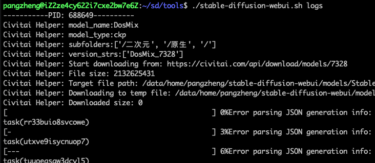
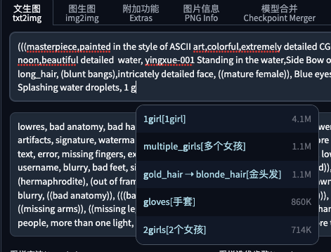
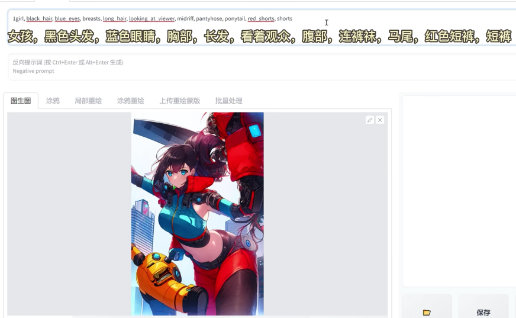
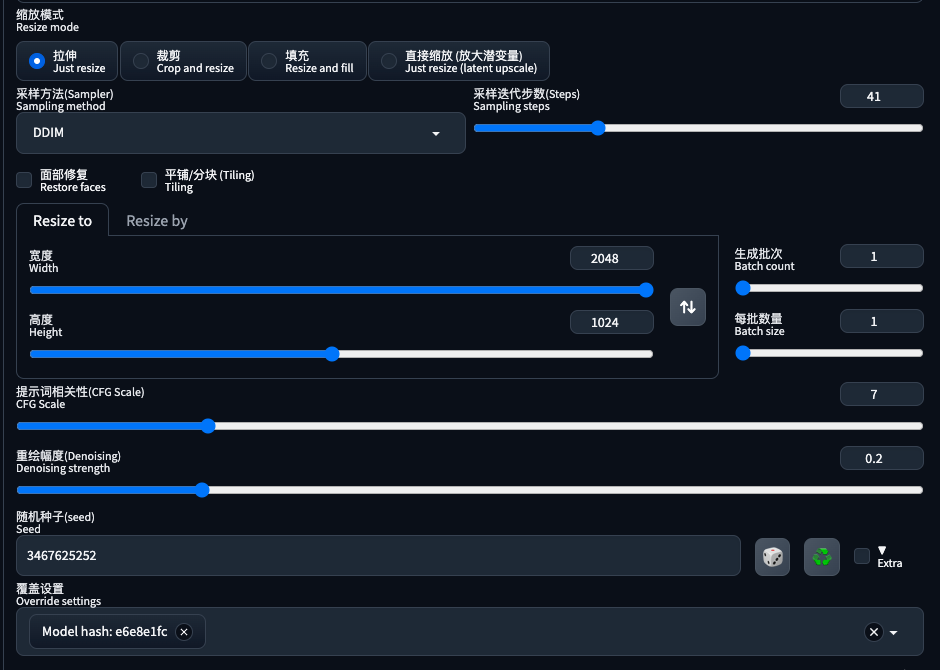
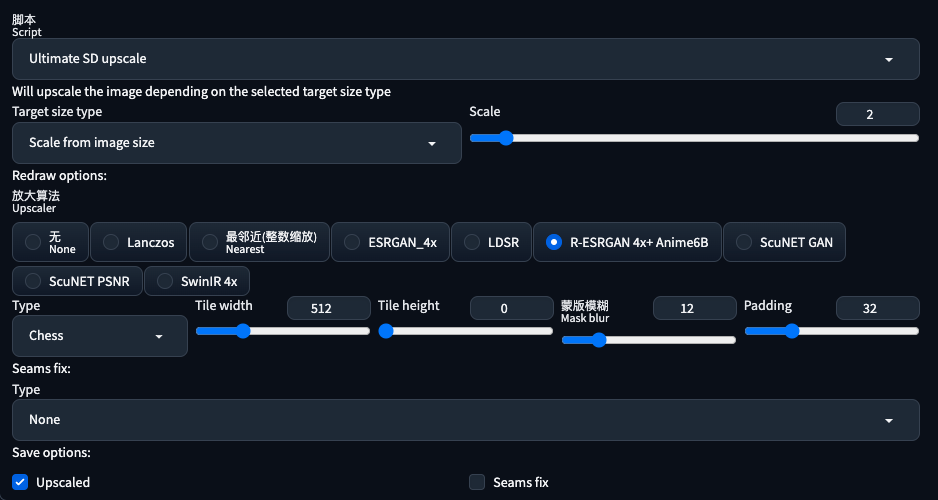
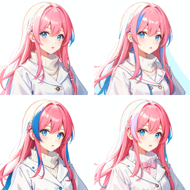
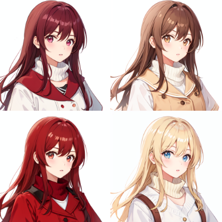
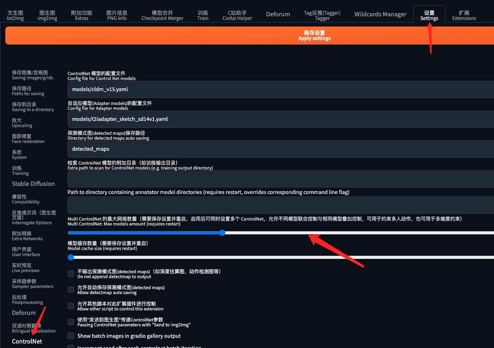
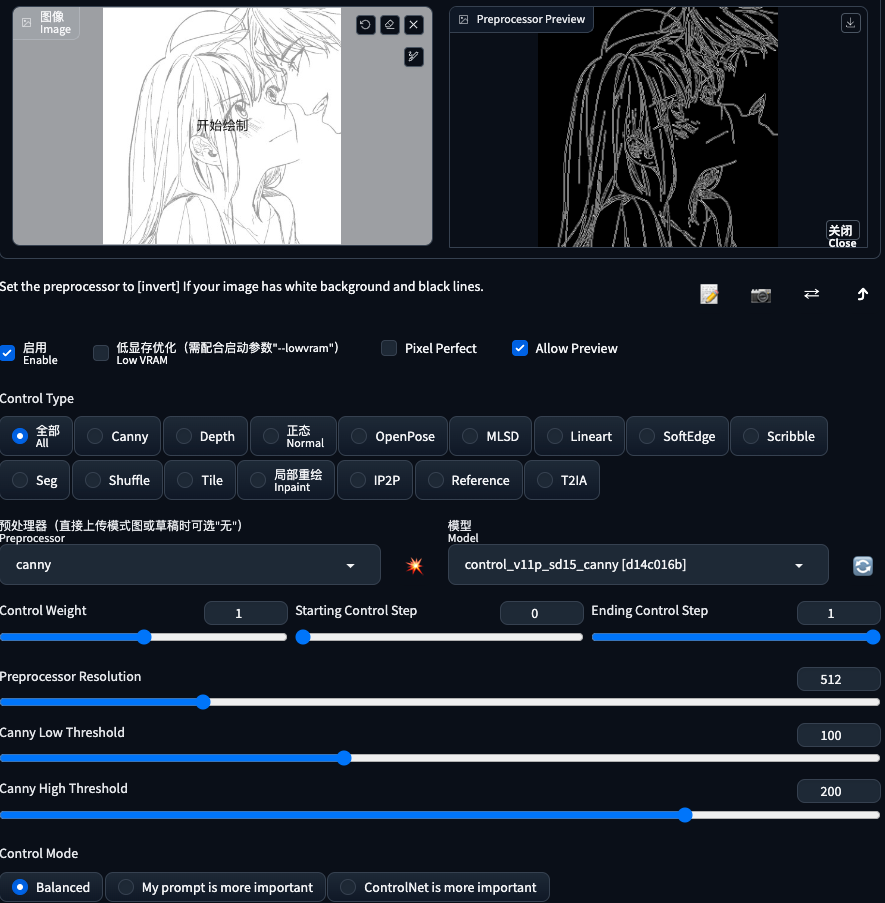
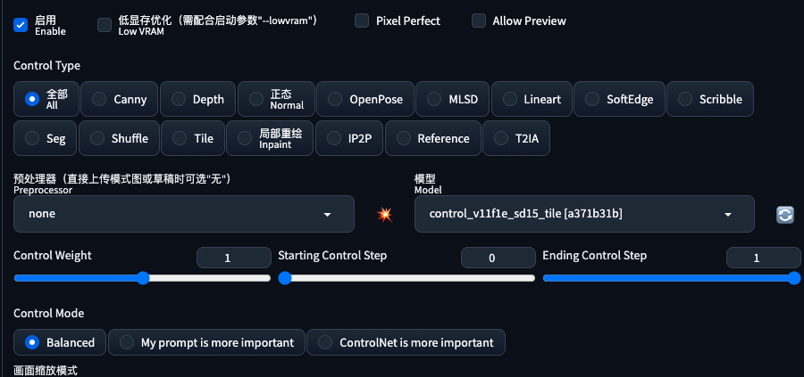

# 插件说明
## 1 Civitai-Helper
Civitai 模型管理插件，负责安装模型

- github下载地址

		https://github.com/butaixianran/Stable-Diffusion-Webui-Civitai-Helper
- civitai 下载地址

		https://civitai.com/models/16768/civitai-helper-sd-webui-civitai-extension

### 网络加速
在进阶配置好加速后，在 Civitai-Helper 界面配置加速地址

### 使用
- 扫描当前拥有模型细节

	
	
	- 参数
		- 下载最大的预览图
		- 跳过限制预览图
		- 扫描模型的类型  
- 获取模型当前模型地址

	
	
	- 参数
		- 模型类型
		- 仅查看没有信息的模型
		- 选择具体模型
		- 查看 URL  
- 下载模型

	
	
	- 参数
		- 模型 URL

			获取的是 civital 模型的首页地址即可
		- 根据 url 获取信息的按钮 
		- 模型详情相关选择
			- 模型名称
			- 模型类型
			- 存放子目录
			- 模型版本
			- 下载所有文件
		- 下载模型按钮 
- 查看模型新版本

	
	
	- 参数
		- 选择升级模型类型
		- 升级按钮
- 网络加速设置

	同上
	
### 插件使用心得
注意这里使用扫描或者下载均可能得到错误提示，但是后台依然运行，估计是页面没有写好。尤其是下载，请看日志判断，如

## 2 [中文英文对照 UI](https://www.bilibili.com/video/BV1rX4y1k7Ch/?spm_id_from=333.337.search-card.all.click&vd_source=f6f37263151dcfb42f0a8663116bb22b)

### 安装
- 安装插件1

			
	
	- 跳转 Extensions 插件安装界面
	- 选择 Install from URL

			https://github.com/dtlnor/stable-diffusion-webui-localization-zh_CN
	- 输入代码库地址
	- 点击 install
	- 提示安装完毕
	
			Use Installed tab to restart.
- 安装插件2

	
	
	- 跳转 Extensions 插件安装界面
	- 选择 Install from URL

			https://github.com/journey-ad/sd-webui-bilingual-localization
	- 输入代码库地址
	- 点击 install
	- 提示安装完毕
	
			Use Installed tab to restart.	
- 点击 Reload UI
		
### 加载界面

- 跳转 Setting 设置按钮
- 点击 Bilingual Localization
- Localization File
- 然后选择 zh_CN
- 点击 Apply settings
- 点击 Reload UI

查看结果

	
## 3 [中英文 tag 自动补齐插件](https://www.bilibili.com/video/BV1rX4y1k7Ch/?spm_id_from=333.337.search-card.all.click&vd_source=f6f37263151dcfb42f0a8663116bb22b)
### 安装

- 安装插件	
	- 跳转 Extensions 插件安装界面
	- 选择 Install from URL
	
			https://github.com/DominikDoom/a1111-sd-webui-tagcomplete.git
	- 输入代码库地址
	- 输入插件目录名
	
			tag-autocomplete
	- 点击 install
	- 提示安装完毕
		
			Use Installed tab to restart.	
	- 点击 Reload UI
- 安装对照库
	- 下载库

			https://chainstorage-gateway.solarfs.io/ipfs/bafybeig26mecexrvo7n2myv6buu2umhwwsfqwwdc72ooar7nxdbvgghb5m/?filename=%E4%B8%AD%E8%8B%B1%E6%96%87%E5%AF%B9%E5%BA%94%E6%8F%92%E4%BB%B6%E7%9B%B8%E5%85%B3
	- 找到 CN.csv
	- 下载放到刚才装好插件的目录下面

			/home/pangzheng/sd/stable-diffusion-webui/extensions/tag-autocomplete/tags

### 配置

- 设置 “设置”
- 选择 "Tag 自动填充"
- 选择 "词语翻译文件"
	- CN.csv
- 选中 "使用旧的三列翻译文件格式取代新的两列格式"
- 保存设置
- 点击 Reload UI

## 4 [Tag 反推咒语](https://www.bilibili.com/video/BV1Ks4y1J7bF/?spm_id_from=333.337.search-card.all.click&vd_source=f6f37263151dcfb42f0a8663116bb22b)

### [原生反推模型](https://www.bilibili.com/video/BV1pv4y1p7Ue/?vd_source=f6f37263151dcfb42f0a8663116bb22b)
不安装插件， webui 默认也提供了两种反推咒语

- clip
	- 对应 sd 自然语言描述模型，生成自然语句描述的句子
	- 侧重图像的内容，包括里面的对象关系

	
- deepbooru
	- 对应 novelai 等打标签模型，生成的事一个一个标签
	- 对人物的特征描述比较好，没有环境关系 

	

如果2个模型分开使用

- 那么 clip 的提示词生成的图，更注重环境
- 如果使用 deepbooru 那么不会在意环境，而在意生成的脸
- 两种模型模型同时使用，能进一步保证与之前参考图更接近，当然也可以把两张图的信息组合，比如一张获取环境，一张获取人物	
### 安装

- 安装插件	
	- 跳转 Extensions 插件安装界面
	- 选择 Available 可用
	- search 搜索 controlnet
	- 找寻插件
	- 点击 install
	- 提示安装完毕
		
			Use Installed tab to restart.	
	- 点击 Reload UI
- 安装 DeepDanbooru v3 模型(对二次元效果好，实体不好)
	- 下载模型

			https://github.com/KichangKim/DeepDanbooru/releases/download/v3-20211112-sgd-e28/deepdanbooru-v3-20211112-sgd-e28.zip
	- 解压
	- 创建目录,并将解压缩包目录中的内容放到这个目录下
		
			/home/pangzheng/sd/stable-diffusion-webui/models/deepdanbooru/deepdanbooru-v3
	- 刷新		

### 使用

- 单文件操作
	- 点击 tag 反推
	- 上传图片
	- 选择反推算法
		- 默认 wd14
		- 或者 DeepDanbooru
	- 阈值
		- 阈值主要的目的是 AI 猜测反推咒语与图片之间的关系比，可以调整比率得到更多词条，默认是大于 35% 相似度的词条就显示  
	- 手动卸载反推模型，节约内存，也可以使用最后一个按钮自动卸载
	- 增加和删除标签
		- 就是在反推的时候增加或删除对应标签
		- 注意这里多个 tag 要符合格式，要加逗号
	- tag 排序
		- 按首字母
	- 输出 tag 输出权重
	- 优化：注意点选最后一个功能，提示完成后写在内存
- 批量操作
	- 批量反推是给训练素材打标的，这样就可以让标签更精准     

## 5 [ultimate-upscale](https://www.bilibili.com/video/BV1Fh411G7mt/?spm_id_from=333.337.search-card.all.click&vd_source=f6f37263151dcfb42f0a8663116bb22b)
这个是 AI 生小图后再进行放大的脚本插件，效果极佳，步骤比之前原生放大简单

同类型插件

- Multibiffusion
	- 比  ultimate-upscale 性能要差
	- 与 ultimate-upscale 效果类似
	- 所以不再统计范畴

### 安装

- 安装插件	
	- 跳转 Extensions 插件安装界面
	- 选择 Available 可用
	- search 搜索 ultimate-upscale
	- 找寻插件
	- 点击 install
	- 提示安装完毕
		
			Use Installed tab to restart.	
	- 点击 Reload UI

### 使用
- 点击图生图
- 导入之前生成的图像原始文件，注意需要带咒语详细参数的
- 然后系统会自动读出以下参数

	
- 脚本
	- Ultimate SD upscale
- 放大大小描述

	这里描述方法有很多种，我们选择  `Scale from image size` ,因为其他需要计算，而这里只要调节比例即可，注意这里有一个使用技巧，比例并不是放大多少倍就调节多少倍，而是按每次升级2倍的比例放大，这样效果最好。
	
	- Target size type- 目标大小类型
		- Scale from image size
	- Scale-放大比例
		- 2   	  
- 放大算法
	- 真实
		- ESRGAN_4x
	- 二次元
		- R-ESRGAN 4x+ Anime6B
- 放大类型    
	- Chess
		- width 
			- 512
		- height 
			- 0 （等同宽度）
		- maskblur
			- 12
		- Padding
			- 32
- 最终参数        

	
- 运行
- 如果还需要放大，点击 `send to img2img`
- 循环

### 效果
- 放大前

	
- 放大后

	  

## 6 [Dynamic Prompt](https://www.bilibili.com/video/BV1n24y1T7jd/?spm_id_from=333.337.search-card.all.click&vd_source=f6f37263151dcfb42f0a8663116bb22b)
多种颜色想制作1次批量生成不同颜色的但每张是单色头发颜色的方法，就需要

	Dynamic Prompt

### 安装	
  	

- 安装插件	
	- 跳转 Extensions 插件安装界面
	- 选择 Available 可用
	- search 搜索 Dynamic Prompt
	- 找寻插件
	- 点击 install
	- 提示安装完毕
		
			Use Installed tab to restart.	
	- 点击 Reload UI	
	
### 使用
#### 手动混色
- 混色

	我们可以用过以下语句生成混色头发	
	
	比如替换头发颜色为
	
		 {red|white|blue|pink}hair
	
	生成为
	
		{red|white|blue|pink} hair, white background, simple background, 1girl, 
	  		 
- 分色

	与上面相同咒语加上 Dynamic Prompt

	  	

	
#### 通配符文件替换关咒语键词(例子发型)
- 到文生图
- 使用 GPT 搜索给出25种女性发型,例如

	
- 将这些发型放 `haricut_female.txt` 文件中，并放到插件通配符目录下.(当然还可以创建更多的通配符，比如发色、姿势、男装(可分上衣，裤子、女装、光影、风格、材质等)

		:~/sd/stable-diffusion-webui/extensions/sd-dynamic-prompts/wildcards$ ll
			total 12
			drwxrwxr-x  2 pangzheng pangzheng 4096 May 26 19:28 ./
			drwxrwxr-x 15 pangzheng pangzheng 4096 May 26 19:15 ../
			-rw-rw-r--  1 pangzheng pangzheng  413 May 26 19:27 haricut_female.txt
			-rw-rw-r--  1 pangzheng pangzheng  350 May 26 19:38 hair_color_colored.txt
- 插入咒语格式

	替换你的咒语对应的词，比如替换头发颜色格式为
	
		__hair_color_colored__
- 点击生成

	

## Controlnet 1.1
- [代码](https://github.com/Mikubill/sd-webui-controlnet/tree/main)
- [说明手册](https://github.com/lllyasviel/ControlNet-v1-1-nightly#model-specification)

### 安装

- 安装插件	
	- 跳转 Extensions 插件安装界面
	- 选择 Available 可用
	- search 搜索 controlnet
	- 找寻插件
	- 点击 install
	- 提示安装完毕
		
			Use Installed tab to restart.	
	- 点击 Reload UI

### 下载模型
controlnet 下完插件后，还需要下很多模型来使用，所以需要从代码库查看模型地址
#### 查看代码库 url
- 扩展
- 已安装
- 查询 controlnet 的网站，如下

	 
- 进入网址读取 Readme

		https://github.com/Mikubill/sd-webui-controlnet/blob/main/README.md
- 查询模型

		https://huggingface.co/lllyasviel/ControlNet-v1-1/tree/main
- 点击进入模型库，下载所有 pth 后缀文件
	- 放入

			/home/pangzheng/sd/stable-diffusion-webui\extensions\sd-webui-controlnet\models

		 
		
			注意这里下载的是 controlnet 1.1 版本模型，如果新版本需要按照说明下载 
	- 下载 1.1 的 14 个模型

		标准 ControlNet 命名规则 (SCNNRs) 来命名所有模型
		
		
		
			control_v11e_sd15_ip2p.pth
			control_v11e_sd15_shuffle.pth
			control_v11f1e_sd15_tile.pth
			control_v11f1p_sd15_depth.pth
			control_v11p_sd15_canny.pth
			control_v11p_sd15_inpaint.pth
			control_v11p_sd15_lineart.pth
			control_v11p_sd15_mlsd.pth
			control_v11p_sd15_normalbae.pth
			control_v11p_sd15_openpose.pth
			control_v11p_sd15_scribble.pth
			control_v11p_sd15_seg.pth
			control_v11p_sd15_softedge.pth
			control_v11p_sd15s2_lineart_anime.pth
		
		- control

			插件名字
		-  v11

			模型版本
		- p

			可生产
		- sd15

			原生模型1.5
		- sd15s2

			除了 1.5 模型，还需要带 `clip skip 2` 参数
		- ip2p..等

			下一个就是具体的控制方法	
		- pth

			模型格式

### 配置 Controlnet
#### 打开多个 Controlnet 单元
默认初始化只有一个 Controlnet 单元，但很多情况下要使用多个 Controlnet 处理单元配合使用，所以需要打开多个 Controlnet 单元
 
- 设置
- 找到 Controlnet 设置
- 找到 `Multi ControlNet 的最大网络数量`
	- 设置数量，一般设置3 
	
		
- 记录保存并重启 UI
- 查看
	
	
		 
## [Controlnet 1.1 面部识别制作表情包](https://www.bilibili.com/video/BV1nM4y1h78e/?spm_id_from=333.788&vd_source=f6f37263151dcfb42f0a8663116bb22b)
- 下载表情图片
-  将表情图片放入 Controlnet 的单张图像中
-  下面的选项选择允许预览图 `Allow Preview`
-  预处理器
	- openpose_face
- 模型
	- contorl_v11_sd15_openpose
- 点击中间爆炸，可以在预览图生成表情样子 

	
- 点击启用

	
	
	

### 注意
- 使用的时候慢
	- 看日志，是在下载模型 
- 使用的时候可能会出错
	- `ValueError: too many values to unpack (expected 3)`
	- 解决办法，重启 

## [Controlnet 1.1 线稿上色](https://www.bilibili.com/video/BV1EX4y1172X/?spm_id_from=333.788&vd_source=f6f37263151dcfb42f0a8663116bb22b)
### 上色基础准备
- sd 参数
	- 将想重新上色的图片放到 Tag 反推获取咒语
	- 删除咒语中所有的颜色提示，放入咒语
	- 调整生成的图像大小和比例与上色图相同
- Controlnet 参数
	- 将想重新上色的图片放入 Controlnet 中单张图像中
	- 启动
	- 预览
	- 控制模式
		- 平衡
		
### Canny 上色
- Controlnet 参数
	- 预处理器
		- canny
	- 模型
		- `control_v11p_sd15_canny [d14c016b]`
- 运行预览

	
- 点生成
	
	
	
### Invert + lineart 上色
- 预处理器
	- invert
- 模型
	- `control_v11p_sd15_lineart [43d4be0d]`
- 运行预览

	
- 点生成
	
	

### Invert + lineart_anime 上色
- 预处理器
	- invert
- 模型
	- `control_v11p_sd15s2_lineart_anime [3825e83e]`
- 运行预览

	
- 点生成
	
	

### lineart_anime + lineart 上色
- 预处理器
	- lineart_anime
- 模型
	- `control_v11p_sd15_lineart [43d4be0d]`
- 运行预览

	
- 点生成
	
	
		
###  lineart_anime + lineart_anime 上色
- 预处理器
	-  lineart_anime
- 模型
	- `control_v11p_sd15s2_lineart_anime [3825e83e]`
- 运行预览

	
- 点生成
	
	

### scribble_pidinet + scribble 上色
- 预处理器
	-  scribble_pidinet
- 模型
	- `control_v11p_sd15_scribble [d4ba51ff]`
- Preprocessor Resolution 增加精度，先图否则糊了
	- 1500  
- 运行预览

	
- 点生成
	
	

### 预处理器与模型的关系
- invert 
	- 使用特点
		- 强调线稿
		- 白色黑底反色官方推荐
		- 1 处理器 vs 2 模型
	- 可使用模型 
		- `control_v11p_sd15_lineart [43d4be0d]`
			- 特点
				- 有些图会崩
				- 与线图几乎一致，不丢失细节   
		- `control_v11p_sd15s2_lineart_anime [3825e83e]` 
			- 特点
				- 强调线稿
				- 官方推荐黑白线稿 ****
				- 保留线稿赛璐璐风格黑色块保留原始深度
				- 与线图几乎一致，不丢失细节
- lineart

	传说其他几个预处理器差不多，待测试
	
	- lineart_anime
		- 使用特点
			- 1 处理器 vs 2 模型
		- 可使用模型 
			- `control_v11p_sd15_lineart [43d4be0d]`
				- 特点 
					- 去掉黑色线条颜色的色彩，替换成符合模型的色彩
					- 想弱化线条感选择 ****
 			- `control_v11p_sd15s2_lineart_anime [3825e83e]`
				- 特点同上
- canny
	- 使用特点
		- 最早模型
		- 边缘检测
		- 1 处理器 vs 2 模型
		- 不丢失细节
	- 可使用模型 
		-  `control_v11p_sd15_canny [d14c016b] `
- scribble
	
	涂鸦传说其他几个预处理器差不多，待测试
	
	- scribble_pidinet
		- 使用特点
			- 1 处理器 vs 1 模型
			- 想弱化线稿，让 AI 更多自由发挥 ****
			- 颜色更好细节更好
		- 可使用模型 
			- `control_v11p_sd15_scribble [d4ba51ff]`
				- 特点 
					- 需要将 `Preprocessor Resolution` 调节到 1500，才能产生可用线稿
					
- 自由模式

	如果增加自由模式，所有模式都可以得到更加开放的结果

					
        
## [Controlnet 1.1 + Tile 放大](https://www.bilibili.com/video/BV1Vm4y1t7Z5/?spm_id_from=333.788&vd_source=f6f37263151dcfb42f0a8663116bb22b)
- sd 参数
	- tag 反推
		- 将想重新放大的图片放到 Tag 反推获取咒语
	- 文生图 
		- 将获取 tag 放入咒语 
		- 调整相同的图像尺寸比例，如测试使用的是 1024*512
		- 点击高清修复
	- Controlnet 参数
		- 要放大的图片放入 Controlnet 中单张图像中
		- 启动
		- 预处理器
			- none
		- 模型
			- `control_v11f1e_sd15_tile [a371b31b]`
		- 控制模式
			- 3种任意选择下，测试自己想要的，推荐 ControlNet is more important
- 参数
	- sd
	
		
	- Controlnet

			
- 对比
	- 原图
	
		 
	- 模式
		- 平衡

			
		- 重提示词

			
		- 重 Controlnet

			
			
			- 高清修复
				- 重绘幅度
					- 0.5
			
			 

当然还可以用多个 controlnet 单元来调节，但是我没调节出适合的
		  	
## Controlnet 1.1 

   
				

	

 
					

		

    	