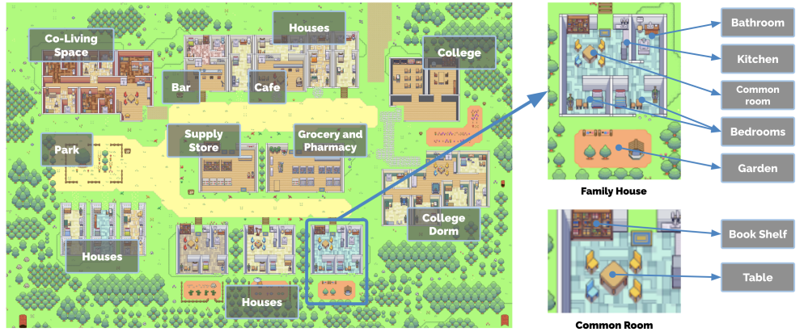
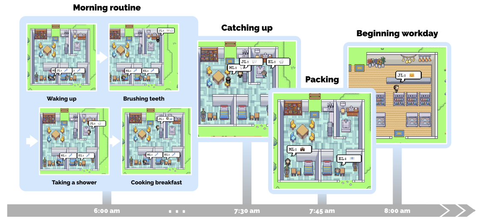
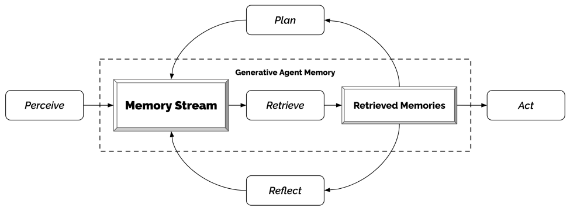
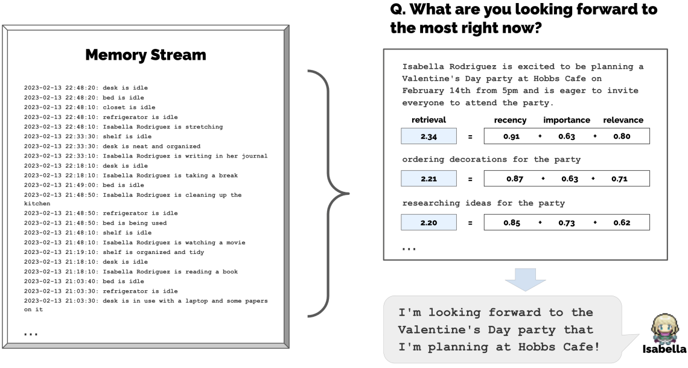
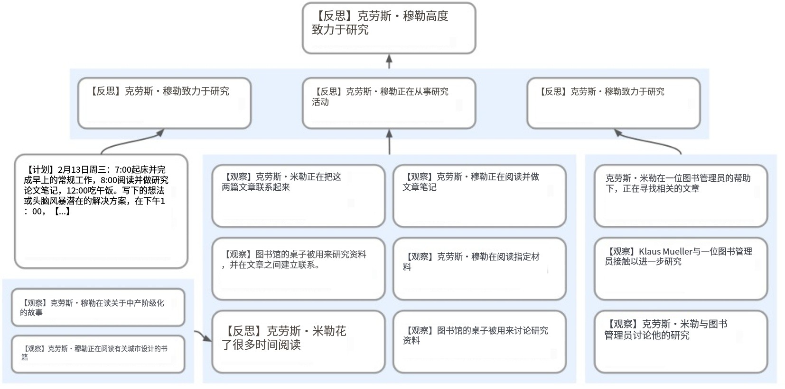
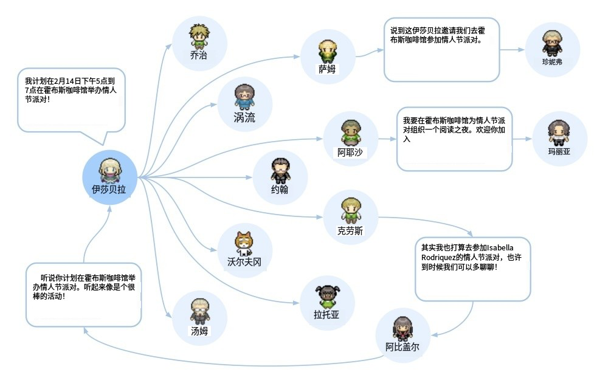

# 生成AI:人类行为的交互式拟像（论文）
## 版权要求
允许制作本作品的全部或部分数字或硬拷贝供个人或课堂使用，但不得为盈利或商业利益而制作或分发副本并且副本在第一页上带有本通知和完整的引用。作者以外的人所拥有的本作品的版权必须得到尊重。允许有署名的摘要。复制或者重新发布，在服务器上发布或重新分发到列表，需要事先特定的许可和或费用。从 permissions@acm.org 请求权限。

arXiv, April, 2023,© 2023 Copyright held by the owner/author(s). Publication rights licensed to ACM.

ACM ISBN xx-x-xxxx-xxxx-x/xx/xx. . . $15.00

https://doi.org/xx.xx/xx.xx 

## 作者信息

图1: 生成AI为交互应用程序创建可信的人类行为拟像。在这项工作中，我们通过填充一个沙盒环境来演示生成AI，让人想起模拟人生，有25个AI。用户可以作为AI进行观察和干预，他们计划自己的日子、分享新闻、建立关系和协调小组活动。
  
## 摘要
可信的人类行为AI可以增强交互式应用程序的能力，从沉浸式环境到人际交流的排练空间，再到原型工具。在本文中，我们介绍了生成AI——模拟可信的人类行为的计算软件AI。生成AI醒来，做早餐，然后去工作;艺术家作画、作家写作;他们形成观点，注意到彼此，并发起对话;他们在计划第二天的时候会回忆和反思过去的日子。

为了支持生成AI，我们描述了一种架构，它扩展了一个大型语言模型，使用自然语言存储AI体验的完整记录，随着时间的推移将这些记忆合成为更高级别的反思，并动态检索它们以计划行为。我们实例化生成AI，以填充受《模拟人生》启发的交互式沙盒环境，在那里，终端用户可以使用自然语言与一个由25个AI组成的小镇进行交互。在评估中，这些生成AI产生可信的个人和涌现的社会行为:例如，仅从单个用户指定的概念开始.如果一个AI想要举办一个情人节派对，那么在接下来的两天里，AI们会自动地向派对发出邀请，结识新朋友，邀请彼此出去约会，并协调在正确的时间一起出现在派对上。我们通过消融证明，我们的AI架构的组成部分——观察、计划和反思——每一个都对AI行为的可信度做出了关键贡献。通过将大型语言模型与计算的交互式AI融合在一起，这项工作引入了架构和交互模式，以实现对人类行为的可信模拟。

### CCS的概念
- 以人为本的计算→交互系统和工具;
- 计算方法→自然语言处理。

### 关键字
人-人工智能交互，AI，生成式人工智能，大型语言模型

ACM参考格式:

Joon Sung Park, Joseph C. O’Brien, Carrie J. Cai, Meredith Ringel Morris,Percy Liang, and Michael S. Bernstein. 2023. Generative Agents: Interactive Simulacra of Human Behavior. In . ACM, New York, NY, USA, 22 pages.

https://doi.org/xx.xx/xx.xx

## 1 介绍
如何构建一个交互式的人工社会，反映可信的人类行为?

从《模拟人生》1 等沙盒游戏到认知模型[21]和虚拟环境等应用程序[9,58]，40多年来，研究人员和从业者一直在设想计算AI可以作为人类行为的可信AI。在这些愿景中，计算驱动的AI的行为与他们过去的经验一致，并对他们的环境做出可信的反应。这种对人类行为的模拟可以让虚拟空间和社区充满现实的社会现象[26,79]，训练人们如何处理罕见但困难的人际关系情况[43,51,93]，测试社会科学理论[11,45]，为理论和可用性测试制作模型人类处理器[21,38,50]，为无处不在的计算应用[30]和社交机器人[9,13]提供支持[58,84]能够在一个开放的世界中处理复杂的人际关系。

然而，人类行为的空间是巨大而复杂的[84,108]。尽管大型语言模型[17]在单个时间点模拟可信的人类行为方面取得了惊人的进展[38,79]，但确保长期一致性的完全通用AI更适合于这样的架构:随着新的交互、冲突和事件的出现和消失，管理不断增长的记忆，同时处理多个AI之间展开的级联社会动态。成功需要一种方法，可以在很长一段时间内检索相关事件和互动，反思这些记忆以概括和得出更高层次的推论，并应用该推理来创建计划和反应，这些计划和反应在当前和AI行为的长期弧中都是有意义的。

在本文中，我们介绍了生成AI—利用生成模型来模拟可信的人类行为的AI—并证明它们产生了个体和涌现群体行为的可信拟像。生成AI对自身、其他AI及其环境进行了广泛的推断;他们根据自己的特点和经验制定日常计划，在适当的时候实施这些计划，做出反应，重新制定计划;当最终用户改变他们的环境或用自然语言命令他们时，它们就会做出反应。例如，生成AI在看到他们的早餐正在燃烧时关闭炉子，如果浴室被占用，就在外面等待，当他们遇到另一个他们想要交谈的AI时停下来聊天。充满生成主体的社会以涌现的社会动态为标志，在这种动态中，新的关系形成，信息扩散，各主体之间出现协调。

为了启用生成AI，我们描述了一个使用大型语言模型存储、合成和应用相关记忆以生成可信行为的AI体系结构。我们的体系结构包括三个主要组件。

- 第一个是记忆流，这是一个长期记忆模块，用自然语言记录AI经验的全面列表。检索模型结合了相关性、近代性和重要性，以显示为AI的即时行为提供信息所需的记录。
- 第二种是反思，随着时间的推移，它将记忆合成为更高层次的推论，使AI能够对自己和他人得出结论，从而更好地指导其行为。
- 第三种是计划，将这些结论和当前环境转化为高水平的行动计划，然后递归为行动和反应的详细行为。这些反映和计划被反馈到记忆流中，以影响AI未来的行为。

这种架构建议应用于多个领域，从角色扮演和社交原型，到虚拟世界和游戏。在社交角色扮演场景中(例如面试准备)，用户可以安全地排练困难的、充满冲突的对话。在创建社交平台原型时，设计师可以超越临时的人物角色，创建动态、复杂的互动原型。出于本文的目的，我们关注的是受模拟人生等游戏的启发，创建一个小型的交互式AI社会的能力。1 通过将我们的架构连接到 ChatGPT 大型语言模型[76]，我们在游戏环境中展示了一个由25个AI组成的小型社会。最终用户可以观察这些AI并与之交互。例如，如果终端用户或开发者想要在游戏中举办情人节派对，传统的游戏环境就需要手动编写数十个角色的行为脚本。我们证明，使用生成AI，只需简单地告诉一个AI她想举办一个聚会就足够了。尽管有许多潜在的失败点，比如

- 派对策划者必须记住告诉其他AI关于派对的情况
- 参与者必须记住邀请
- 那些记得的人必须决定实际出席，
- 以及其他可能的失败点

但在我们的环境中，AI成功了。他们散布关于派对的消息，然后出现，一个AI甚至邀请另一个AI约会去派对，所有这些都来自这个用户生成的种子建议。

我们对生成AI进行了两项评估:

- 一项是受控评估，测试AI是否在孤立状态下产生可信的个体行为;
- 另一项是端到端评估，即生成AI在两天的游戏时间内以开放式方式相互交互，以了解它们的稳定性和涌现的社会行为。

在技术评估中，我们利用方法上的机会，通过用自然语言“采访”AI来评估AI的知识和行为，以探测AI保持角色、记忆、计划、反应和准确反映的能力。我们比较了几种限制AI访问记忆、反思和计划的消融。我们观察到，这些组成部分中的每一个都是在这些面试任务中表现出色的关键。在技术和端到端评估中，对AI的记忆进行修饰或从语言模型继承过度正式的言语或行为时，最常见的错误出现在AI无法检索相关记忆。

综上所述，本文的贡献如下:

- 生成AI，可信的人类行为模拟，动态地依赖于AI不断变化的经验和环境。
- 一种新颖的架构，使生成AI能够记忆、检索、反映、与其他AI交互，并通过动态变化的环境进行计划。

	该体系结构利用了大型语言模型的强大提示功能补充了这些功能，以支持更长期的AI一致性、管理动态演化记忆的能力，以及递归地生成更多代。
- 两个评估(受控评估和端到端评估)，建立架构组件重要性的因果关系，并确定由例如不适当的记忆检索引起的故障。
- 讨论交互系统中生成AI的机会和伦理和社会风险。

	我们认为，应该调整这些AI以降低用户形成准社会关系的风险，记录以降低深度伪造和量身定制说服带来的风险，并以补充而不是取代设计过程中的人类利益相关者的方式应用。以上翻译结果来自有道神经网络翻译（YNMT）· 通用场景

## 2 .相关工作
在本节中，我们回顾了人类与人工智能交互的先前文献，并将构建可信的人类行为AI置于其准则范围内。这一议程曾被誉为交互、游戏和人工智能领域的北极星[9,58,84,85]，但由于人类行为的复杂性[16,108]，它仍然具有挑战性。我们综合了这项研究，认为大型语言模型虽然本身还不够，但在使用适当的架构时，为创建可信的AI开辟了一个新的角度。
### 2.1 人机交互
交互式人工智能系统旨在将人类的洞察力和计算工程的能力结合起来，从而增强其用户[3,29]。许多工作都在探索允许用户以交互方式指定模型行为的方法。例如，Crayons 展示了交互式机器学习的早期愿景，允许非专家用户训练分类器[29]。进一步的工作有助于阐明最终用户如何通过示例[33]和/或演示[31]向系统描述他们的分类目标。最近的工作将这些探索扩展到深度学习[62]和基于提示的创作[49,66,106]。

与此同时，持续不断的研究也推动了人机交互中基于语言和AI的交互。SHRDLU[103] 和 ELIZA[102] 等形成性工作展示了自然语言与计算系统交互的机会和风险。随着研究的进展，越来越清楚的是，自主AI可以为委托和交互提供新的隐喻[67]，但人类和AI之间的委托线仍在继续争论和完善[46,88,89]。最近，这项技术已经变得足够稳定，以至于AI可以在大型复杂的在线社交环境中通过自然语言进行交互(例如，[54])。自然语言交互提供了一种新的方式，可以扩展用户在照片编辑[2,34,64]和代码编辑[87]等领域的能力。

我们汇集了这些工作线索，以表明我们现在可以为交互系统创建AI类行为的AI，并通过自然语言与它们交互。在这样做的过程中，这项工作重新打开了研究围绕认知模型(如GOMS和KLM[21,22])、围绕原型工具[79]和围绕无处不在的计算应用[25,30,100]的基础HCI问题的大门。
### 2.2 人类行为的可信AI
先前的文献描述了可信度或可信的AI，作为一个中心设计和工程目标。可信AI的设计是为了提供一种生活的幻觉，并以他们按照自己的意志做出决定和行动的方式呈现现实主义的外表，类似于迪士尼电影中的角色[9,95]。这些AI可以填充和感知像我们所居住的开放世界环境[9,58]，并努力表现出基于与用户或其他AI的社交互动的突发行为，目的是在假设的个人和社区模拟中成为我们行为的可信AI[19,35,70]。从历史上看，这些AI是在智能游戏 npc 的背景下开发的[58,84]。如果可能的话，创造具有可信行为的 npc 可以通过促成紧急叙事[7,15,48,92]和与AI的社交互动[110]来增强玩家在游戏和互动小说中的体验。然而，更重要的是，游戏世界提供了越来越逼真的现实世界的表现，正如 Laird 和 van Lent 在 2001 年所观察到的，这些模拟世界为可信AI的开发人员提供了可访问的测试平台，以优化AI的认知能力，而无需担心在现实世界中实现机器人或从头开始创建模拟环境[58,84]。

在过去的四十年里，出现了一系列不同的方法来创建可信的AI。然而在实施中，这些方法往往简化了AI行为的环境或维度，使工作更易于管理[16,72]。基于规则的方法，如有限状态机[90,96]和行为树[40,53,81]，解释了人类编写AI行为的蛮力方法[70]。它们提供了一种创建简单AI的直接方法，这在今天仍然是最主要的方法[68,73,109]，甚至可以处理基本的社交互动，如《质量效应[12]》和《模拟人生[6]》系列等模拟游戏。尽管如此，在一个开放的世界中，手工制作能够全面处理可能交互广度的行为是站不住脚的。这意味着生成的AI行为可能不能完全代表它们相互作用的结果[69-71]，并且不能执行脚本中没有硬编码的新过程[90,96]。另一方面，用于创建可信AI的流行的基于学习的方法，如强化学习，通过让AI学习自己的行为，克服了手动创作的挑战，并在近年来在《星际争霸》中的 AlphaStar[98]和《Dota 2 b[10]》中的 OpenAI Five 等游戏中取得了超人的表现。然而，他们的成功主要发生在具有易于定义的奖励的对抗性游戏中，学习算法可以优化这些奖励。他们还没有解决在开放世界中创造可信AI的挑战[39,73,90]。

计算中的认知架构，由 Newell 开创，旨在建立基础设施，以支持一套全面的认知功能[75]，以适应其原始愿景中所持有的可信AI的包罗万象的性质。他们促成了一些最早的可信AI的例子。例如，Quakebot-SOAR b[59] 和ICARUS[24,63] 在第一人称射击游戏中生成 npc，而 TacAir-SOAR[80] 在空战训练模拟中生成飞行员。这些AI使用的架构不同( Quakebot- 和 TacAir-SOAR 依赖于 SOAR[5]，而 ICARUS 依赖于受 SOAR 和 ACT-R[5] 启发的自己的变体)，但它们具有相同的基本原理[61]。他们维持短期和长期记忆，用符号结构填充这些记忆，并在感知-计划-行动循环中运作，动态地感知环境并将其与人工制作的行动程序之一相匹配[57,96]。使用认知架构创建的AI旨在推广到大多数(如果不是全部的话)开放世界环境，并在当时表现出稳健的行为。然而，他们的行动空间仅限于手工制作的程序知识，他们没有提供一种机制，通过这种机制，AI可以被激发去寻求新的行为。因此，这些AI主要部署在非开放世界环境中，如第一人称射击游戏[24,59]或方块世界[63]。

今天，按照最初的定义创建可信的AI仍然是一个悬而未决的问题[84,108]。许多人继续前进，认为尽管现有的创造可信AI的方法可能是繁琐和有限的，但它们足以支持现有的游戏玩法和交互[23,74,108]。我们的观点是，大型语言模型提供了一个重新审视这些问题的机会，前提是我们可以设计一个有效的架构，将记忆合成为可信的行为。在本文中，我们向这种体系结构迈出了一步。
### 2.3大语言模型与人类行为
生成AI利用一个庞大的语言模型来驱动它们的行为。关键的观察结果是，大型语言模型编码了在其训练数据中表示的广泛的人类行为[14,17]。如果使用狭义定义的上下文提示，则可以使用模型生成可信的行为。最近的工作已经证明了这种方法的有效性。例如，Social Simulacra 使用一个大型语言模型来生成用户，这些用户将填充新的社会计算系统，以原型化他们的新兴社会动态[79]。该方法使用提示链[105,106]来生成简短的自然语言描述人物角色及其在原型系统中出现的行为。其他实证研究复制了现有的社会科学研究[45]、政治调查[91]，并生成了合成数据[38]。大型语言模型也被用于生成供用户参与的交互式人类行为。以游戏为例，这些模式被用于创造互动小说[36]和文本冒险游戏[20]。由于具有生成和分解动作序列的能力，大型语言模型也被用于计划机器人任务b[47]。例如，当呈现一个任务(比如捡起一个瓶子)时，会提示模型将该任务分解为更小的动作序列，比如走向瓶子所在的桌子并捡起它。

 我们假设基于上面总结的工作，大型语言模型可以成为创建可信AI的关键因素。
 
 - 现有文献在很大程度上依赖于一阶模板，即采用少量提示[37,65]或思维链提示[99]。这些模板在生成仅受AI当前环境影响的行为方面是有效的(例如，如何回应给定的帖子，机器人需要采取什么行动才能进入一个有门的房间)。
 - 然而，可信的AI不仅需要对其当前环境进行调节，还需要对大量的过去经验进行调节，使用一阶提示，这是一个很差的拟合(到目前为止，由于底层模型的上下文窗口有限，这是不可能的)。

 最近的研究试图超越一阶提示，通过使用静态知识库和信息检索方案[52]或简单的摘要方案来增强语言模型[104]。本文将这些思想扩展到创建一个AI体系结构，该体系结构处理检索，其中过去的经验在每个时间步动态更新，并与AI当前的上下文和计划混合，这些上下文和计划可能相互加强或相互矛盾。 
 
## 3 .生成AI行为与交互
为了使生成AI的启示具体化，我们将它们实例化为一个简单的沙盒世界中的角色，让人想起《模拟人生》。这款基于精灵的沙盒游戏《Smallville》让人联想到一个小镇环境。在本节中，我们将介绍《Smallville》中与生成AI的支持和交互，并描述AI在其中的行为方式。然后，在第4节中，我们将介绍为这些功能和交互提供支持的生成AI架构。在第5节中，我们描述了沙盒环境的实现以及AI如何与沙盒世界的底层引擎交互。

图2: 《Smallville》 世界中，带有标记区域。根节点描述整个世界，子节点描述区域(例如，房子、咖啡馆、商店)，叶节点描述对象(例如，桌子、书架)。AI记住一个子图反映了他们所看到的世界的一部分，在他们看到的状态下。
### 3.1 AI化身与通信、
《Smallville》有25名独特的AI。每个AI由一个简单的精灵化身表示。我们撰写了一段自然语言描述来描述每个AI的身份，包括他们的职业和与其他AI的关系，作为种子记忆。

例如，约翰林有以下描述:

John Lin is a pharmacy shopkeeper at the Willow Market and Pharmacy who loves to help people. He is always looking for ways to make the process of getting medication easier for his customers; John Lin is living with his wife, Mei Lin, who is a college professor, and son, Eddy Lin, who is a student studying music theory; John Lin loves his family very much; John Lin has known the old couple next-door, Sam Moore and Jennifer Moore, for a few years; John Lin thinks Sam Moore is a kind and nice man; John Lin knows his neighbor, Yuriko Yamamoto, well; John Lin knows of his neighbors, Tamara Taylor and Carmen Ortiz, but has not met them before; John Lin and Tom Moreno are colleagues at The Willows Market and Pharmacy; John Lin and Tom Moreno are friends and like to discuss local politics together; John Lin knows the Moreno family somewhat well — the husband Tom Moreno and the wife Jane Moreno.

#### AI自我描述
- 约翰·林(John Lin )是 Willow 市场和药房的一名药店店主，他喜欢帮助别人。
	- 他一直在寻找方法，让他的客户更容易获得药物;
	- 他的妻子林美是一名大学教授，儿子林艾迪是一名学习音乐理论的学生。
	- 约翰林非常爱他的家庭;

#### AI与邻居之间的描述
- 林约翰(John Lin)认识隔壁的老夫妇萨姆·摩尔(Sam Moore)和詹妮弗·摩尔(Jennifer Moore)好几年了;
	- 约翰林认为萨姆·摩尔(Sam Moore)是一个善良的人;
- 林约翰(John Lin)和邻居山本百合子(Yuriko Yamamoto)很熟;
- 林约翰知道他的邻居塔玛拉·泰勒和卡门·奥尔蒂斯，但以前没有见过她们;
- 约翰·林和汤姆·莫雷诺是柳树市场和药房的同事;
	- 约翰·林和汤姆·莫雷诺是朋友，喜欢一起讨论当地政治;
	- 林约翰对莫雷诺一家有些了解——丈夫汤姆·莫雷诺和妻子简·莫雷诺。

每个以分号分隔的短语在模拟开始时作为记忆输入AI的初始记忆

#### 3.1.1AI间通信
AIAI通过它们的行为与世界互动，并通过自然语言与彼此互动。在沙盒引擎的每一个时间步，AI们输出一个描述他们当前动作的自然语言语句，比如

- “伊莎贝拉·罗德里格斯在写日记”
- “伊莎贝拉·罗德里格斯在检查她的电子邮件”
- “伊莎贝拉·罗德里格斯正在和她的家人打电话”
- 或者“伊莎贝拉·罗德里格斯正在准备睡觉”。

这句话随后被转化为影响沙盒世界的具体动作。动作以一组表情符号的形式显示在沙盒界面上，这些表情符号在头顶视图中提供了动作的抽象表示。为了实现这一目标，该系统采用了一种语言模型，将动作翻译成一组表情符号，这些表情符号会出现在每个虚拟形象上方的语音气泡中。例如，“Isabella Rodriguez 正在写日记”显示为 📖✏️，而“Isabella Rodriguez正在检查她的电子邮件”显示为💻✉️。操作的完整自然语言描述可以通过点击AI头像来访问

AI以完全自然的语言相互交流。AI知道其所在区域的其他AI，生成AI架构决定它们是经过还是参与对话。以下是AI伊莎贝拉·罗德里格斯(Isabella Rodriguez)和汤姆·莫雷诺(Tom Moreno)关于即将到来的选举的谈话中的一个例子2

- 伊莎贝拉

	我还在权衡我的选择，但我一直在和萨姆·摩尔讨论选举。你对他有什么看法?
- 汤姆

	老实说，我不喜欢山姆·摩尔。我认为他脱离了社区，也没有把我们的最大利益放在心上。
	
#### 3.1.2 用户控件
运行此模拟的用户可以通过对话与AI沟通或以“内心声音”的形式向AI发出指令来操纵模拟并进行干预。

用户通过自然语言与AI通信，通过指定AI应该将其视为的角色。例如，如果用户指定自己是新闻“记者”并询问即将到来的选举，“谁在竞选公职?”， John AI回答:

	约翰:我的朋友尤丽子、汤姆和我一直在谈论即将到来的选举，并讨论候选人萨姆·摩尔。我们都同意投票给他，因为我们喜欢他的政纲。
为了直接命令其中一个AI，用户扮演AI的“内心声音”——这使得AI更有可能将语句视为指令。例如，当一个用户作为 John 的内心声音告诉 John “你将在即将到来的选举中与 Sam 竞争”时，John 决定参加选举并与他的妻子和儿子分享他的候选资格。	
### 3.2 环境交互作用
《Smallville》以一个小村庄的常见设施为特色，包括咖啡馆、酒吧、公园、学校、宿舍、房屋和商店。它还定义了使这些空间具有功能的子区域和对象，例如房子中的厨房和厨房中的炉子(图2)。作为AI的主要生活区的所有空间都有床、桌子、壁橱、架子，以及浴室和厨房3

AI们就像在一个简单的电子游戏中一样在《Smallville》中移动，进出建筑物、导航地图、接近其他AI。AI的运动是由生成AI架构和沙盒游戏引擎指导的:当模型指示AI将移动到一个位置时，我们在《Smallville》环境中计算到目的地的行走路径，AI开始移动。此外，用户还可以作为AI进入《Smallville》的沙盒世界。用户具体化的AI可以是世界上已经存在的AI，例如 Isabella 和 John，也可以是在 《Smallville》 中没有任何历史的外部访客。《Smallville》的居民对待用户控制的AI和对待彼此没有什么不同。他们认识到它的存在，开始互动并在形成对它的看法之前记住它的行为

用户和AI可以影响这个世界中物体的状态，就像在《模拟人生》等沙盒游戏中一样。例如，当AI正在睡觉时，床可以被占用，当AI用完做早餐的原料时，冰箱可以是空的。最终用户还可以通过用自然语言重写AI周围对象的状态来重塑AI在 《Smallville》 中的环境。例如，当伊莎贝拉在早上做早餐时，用户可以通过向系统输入一个命令来改变厨房炉子的状态，从“打开”到“燃烧”，系统会选择这个对象并说明它的新状态，比如:“正在燃烧”。伊莎贝拉马上就会注意到这一点，然后去关掉炉子，重新做她的早餐。同样，如果用户在伊莎贝拉进入浴室时将她的淋浴设置为“漏水”，她就会从客厅里收集工具，试图修理漏水的地方。
### 3.3 例“生命中的一天”

图3: 生成AI John Lin 生命中的一个早晨。约翰早上6点左右起床，完成早晨的例行公事，包括刷牙、洗澡和吃早餐。他和妻子梅(Mei)和儿子艾迪(Eddy)短暂地聊了几句，然后出门开始一天的工作。

从单段描述开始，AI们开始计划他们的一天。在沙盒世界中，随着时间的推移，它们的行为会随着这些AI与彼此和世界的互动、建立记忆和关系以及协调联合活动而演变。

我们通过跟踪我们的系统在AI John Lin 一天的过程中的输出来演示生成AI的行为(图3)。在 Lin 家，John 是早上7点第一个醒来的人。他刷牙、洗澡、穿衣服、吃早餐，然后在客厅的餐桌上看新闻。

- 早上8点，埃迪也跟着起床，冲下床准备上课。就在约翰要出门的时候，他追上了他。
	- 对话
		- 约翰:早上好，艾迪。你睡得好吗?
			- 艾迪:早上好，爸爸。是的，我睡得很好。
		- 约翰:那很好。你今天在忙什么?
			- 艾迪:我正在为我们班写一首新的音乐作品。这周就要交了，所以我在努力把它写完。但我玩得很开心!
		- 约翰:听起来不错!
- 艾迪离开后不久，梅醒了过来，和约翰在一起。梅问起她的儿子，约翰回忆起他们刚刚的谈话
	- 梅:艾迪已经去学校了吗?
		- 约翰:是的，他刚走。他正在为他的班级写一篇音乐作文。
	- 梅:哦，那太好了!告诉我吧。
		- 约翰:我想他真的很享受!他说他玩得很开心。
	- 梅:太好了!我为他感到骄傲。

谈话结束后，梅和约翰收拾行李。梅继续上课并写她的研究论文，而约翰在早上9点之前打开了他在柳树市场和药房的药房柜台。

### 3.4 突发社会行为
在《Smallville》中，生成AI通过相互作用交换信息，形成新的关系，协调共同的活动。延伸先前的研究[79]，这些社会行为是突发的，而不是预先编程的。
#### 3.4.1 信息扩散。
当AI注意到彼此时，它们可能会进行对话——当它们这样做时，信息可以从AI传播到AI。例如，在山姆和汤姆在杂货店的一段对话中，山姆告诉汤姆他参加了地方选举:

- 山姆:嘿，汤姆，最近怎么样?
	- 汤姆:很好，谢谢。有什么事吗?
- 山姆:嗯，我想和你谈谈。实际上，我要参加即将到来的地方选举，竞选市长。
	- 汤姆:真的吗?真是个好消息!你为什么要跑?
- 山姆:我参与地方政治已经很多年了，我真的觉得我可以为我们的社区带来改变。另外，我想把新的想法和观点带到谈判桌上。

那天晚些时候，山姆离开后，汤姆和约翰从另一个渠道听到了这个消息，他们讨论了山姆赢得选举的可能性

- 约翰:我听说萨姆·摩尔要参加地方选举。你认为他获胜的可能性大吗?
	- 汤姆:我认为他很有机会。他一直在社区里努力工作，我想他会得到很多支持。你觉得呢?
- 约翰:我觉得他参选很好。我很想知道还有谁参选，以及选举结果如何。

渐渐地，山姆的候选资格成为了镇上的话题，一些人支持他，另一些人则犹豫不决。

#### 3.4.2 关系记忆
《Smallville》 中的AI会随着时间的推移形成新的关系，并记住他们与其他AI的互动。例如，Sam 一开始并不认识 Latoya Williams。在约翰逊公园散步的时候，Sam 遇到了 Latoya，他们互相介绍了自己，Latoya 提到她正在做一个摄影项目:“我来这里是为了我正在做的一个项目拍一些照片。”在后来的互动中，Sam 与 Latoya 的互动表明了那次互动的记忆，因为他问:“嗨，Latoya。你的项目进行得怎么样了? " 她回答说:“你好，山姆。”一切都很顺利!”

在情人节那天，包括 Klaus 和 Maria 在内的五个 agent 在下午5点出现在 Hobbs Cafe，他们享受着庆祝活动(图4)。在这个场景中，最终用户只设定了 Isabella 举办派对的初衷和 Maria 对 Klaus 的迷恋:而传播消息、装饰、约对方出去、到达派对、在派对上互动的社会行为都是由 agent 架构发起的

图4:在模拟开始时，将一个AI初始化为组织情人节派对的意图。尽管在确保事件链中有许多可能的故障点——AI可能没有按照那个意图行事，可能不记得告诉其他人，可能不记得出现——情人节派对实际上确实发生了，许多AI聚集在一起并相互作用。
## 4 生成AI架构
生成AI旨在为开放世界中的行为提供一个框架:一个可以与其他AI进行交互并对环境变化做出反应的框架。

	生成AI将当前环境和过去经验作为输入，生成行为作为输出。
这种行为的基础是一种新的AI体系结构，它将大型语言模型与用于合成和检索相关信息的机制结合起来以约束语言模型的输出。没有这些机制，大型语言模型可以输出行为，但产生的AI可能不会根据AI过去的经验做出反应，可能不会做出重要的推断，也可能不会保持长期的一致性。即使使用 GPT-4 等当今性能最好的模型，长期计划和一致性方面的挑战仍然存在。因为生成AI产生大量必须保留的事件和记忆流，我们架构的一个核心挑战是确保在需要时检索和合成AI记忆中最相关的部分。

我们的体系结构的中心是记忆流，这是一个维护AI经验的全面记录的数据库。从记忆流中检索相关的记录，以计划AI的操作并对环境做出适当的反应，并且将记录递归地合成为指导行为的更高级别的观察。体系结构中的所有内容都作为自然语言描述进行记录和推理，从而允许体系结构利用大型语言模型。

我们目前的实现使用了ChatGPT 的 gpt3.5 turbo 版本[76]。我们期望生成AI的架构基础——记忆、计划和反思——随着语言模型的改进可能保持不变。较新的语言模型(例如GPT-4)将继续扩展支撑生成AI的提示符的表达能力和性能。然而，在撰写本文时，GPT-4 的API仍然是仅限邀请的，因此我们的AI使用 ChatGPT

- Perceive 感知
- Act 行为
- Plan 计划
- Reflect 反思

- Generative Agent Memory 生成AI记忆
- Memory Stream 记忆流
- Retrieve 检索
- Retrieved Memories 检索到记忆

图5:我们的生成AI架构。AI感知环境，所有感知都被保存在AI经验的综合记录中，称为记忆流。基于它们的感知，体系结构检索相关的记忆，然后使用这些检索到的操作来确定一个操作。这些检索到的记忆也被用来形成长期计划，并产生更高层次的反思，这些都被输入到记忆流中以备将来使用。

### 4.1记忆与检索
- 挑战

	创建可以模拟人类行为的生成AI需要对一系列经验进行推理，而这些经验远远超过了应该在提示符中描述的内容，因为完整的记忆流可能会分散模型的注意力，并且目前甚至无法适应有限的上下文窗口。想想伊莎贝拉的经纪人回答“你最近对什么充满激情?”这个问题。首先，为了适应语言模型有限的上下文窗口，总结了伊莎贝拉的所有经验，产生了一个没有信息的回应，伊莎贝拉讨论了诸如事件和项目的合作以及咖啡馆的清洁和组织等主题。下面描述的记忆流不是总结，而是显示相关的记忆，从而产生更有信息和具体的回应，提到伊莎贝拉对让人们感到受欢迎和包容的热情，计划活动和创造人们可以享受的氛围，比如情人节派对。
- 方法

	记忆流保存了AI经验的全面记录。它是一个记忆对象列表，其中每个对象包含一个自然语言描述、一个创建时间戳和一个最近的访问时间戳。记忆流的最基本元素是观察，这是一个由AI直接感知的事件。常见的观察包括AI自己执行的行为或者AI感知到由其他AI或非AI对象执行的行为。
	
	例如，在咖啡店工作的伊莎贝拉·罗德里格斯，随着时间的推移，可能会积累以下观察:
	
	- (1) 伊莎贝拉·罗德里格斯正在摆糕点
	- (2) 玛丽亚·洛佩兹一边喝咖啡一边为化学考试复习
	- (3) 伊莎贝拉·罗德里格斯和玛丽亚·洛佩兹正在霍布斯咖啡馆谈论计划一个情人节聚会
	- (4) 冰箱是空的

	

	 图6:记忆流包含大量与AI当前情况相关或不相关的观察结果。检索确定了这些观察的子集，这些观察应该传递给语言模型，以调整其对情况的响应

	我们的体系结构实现了一个检索功能，该功能将AI的当前状态作为输入，并返回记忆流的子集以传递给语言模型。检索函数有许多可能的实现，这取决于AI在决定如何行动时考虑的重要因素。在我们的背景下，我们关注三个主要组成部分，它们共同产生有效的结果。

	- 最近性

		给最近访问过的记忆对象分配了更高的分数，所以最近或今天早上发生的事件很可能留在AI的注意范围内。在我们的执行中，我们将近代性视为沙盒游戏小时数的指数衰减函数。我们的衰减因子是 0.99。
	- 重要性

		区分了普通记忆和核心记忆，通过给那些AI认为重要的记忆对象分配更高的分数。例如，像在自己房间吃早餐这样的平凡事件的重要性得分很低，而与另一半分手的重要性得分很高。同样，重要性分数也有许多可能的实现方式;我们发现直接要求语言模型输出整数分数是有效的。完整的提示出现在下面

		- 在 1 到 10，1 代表纯粹的平凡(例如，刷牙，整理床铺)，10 代表极端的辛酸(例如，分手，大学录取)，给下面这段记忆可能的辛酸程度打分。
		- 回忆: 在柳树市场和药房买杂货
		- 评级: <填入>

		输入 LLM 

			On the scale of 1 to 10, where 1 is purely mundane (e.g., brushing teeth, making bed) and 10 is extremely poignant (e.g., a break up, college acceptance), rate the likely poignancy of the following piece of memory. 
			Memory: buying groceries at The Willows Market and Pharmacy
			Rating: <fill in>

		这个提示返回一个整数值，2 表示“清理房间”，8 表示“邀请你的暗恋对象出去约会”。重要性评分是在创建记忆对象时生成的
	- 相关性

		为与当前情况相关的记忆对象分配更高的分数。什么是相关的取决于“与什么相关?”，因此我们将查询记忆的相关性作为条件。例如，如果查询是一个学生正在与同学讨论化学考试要学什么，那么关于早餐的记忆对象应该具有低相关性，而关于老师和作业的记忆对象应该具有高相关性。在我们的实现中，我们使用语言模型来生成每个记忆的文本描述的嵌入向量。然后，我们将相关性计算为记忆嵌入向量与查询记忆嵌入向量之间的余弦相似度
		
	为了计算最终的检索分数，我们通过最小-最大缩放将近代性、相关性和重要性分数归一化到[0,1]的范围。检索函数将所有记忆作为三个要素的加权组合进行评分:
		
	𝑠𝑐𝑜𝑟𝑒 = 𝛼 𝑟𝑒𝑐𝑒𝑛𝑐𝑦 · 𝑟𝑒𝑐𝑒𝑛𝑐𝑦 + 𝛼 𝑖𝑚𝑝𝑜𝑟𝑡𝑎𝑛𝑐𝑒 ·𝑖𝑚𝑝𝑜𝑟𝑡𝑎𝑛𝑐𝑒 +𝛼 𝑟𝑒𝑙𝑒𝑣𝑎𝑛𝑐𝑒 ·𝑟𝑒𝑙𝑒𝑣𝑎𝑛𝑐𝑒. 

	在我们的实现中，所有的 𝛼 都被设置为 1。然后，符合语言模型上下文窗口的排名最高的记忆被包含在提示符中。

### 4.2 反思
- 挑战

	生成AI，当只有原始的观察记忆时，很难进行概括或推断。考虑这样一个场景 : 
	
		用户问克劳斯·穆勒: “如果你必须在你认识的人中选择一个人共度一小时，你会选择谁?”
	由于只能使用观察性记忆，AI只需选择与克劳斯互动最频繁的人:沃尔夫冈，他大学宿舍的邻居。不幸的是，沃尔夫冈和克劳斯只是偶尔见面，并没有深入的互动。更理想的反应需要agent从克劳斯花了几个小时在研究项目上的记忆中归纳出克劳斯对研究充满热情的更高层次的反映，并且同样认识到玛丽亚在自己的研究中付出了努力(尽管是在不同的领域)，从而得出他们有共同的兴趣。在接下来的剧情中，当克劳斯被问到要和谁共度时光时，克劳斯选择了玛丽亚而不是沃尔夫冈
- 方法

	我们引入了第二种类型的记忆，我们称之为反思。反思是由主体产生的更高层次、更抽象的思想。因为它们是一种记忆，所以当检索发生时，它们与其他观察结果一起包含。反思是周期性产生在我们的实现中的，当AI感知到的最新事件的重要性得分总和超过某个阈值时，我们生成反思。在实践中，我们的AI每天大约反思两到三次

	反思的第一步是让AI确定要反思什么，通过确定根据AI最近的经历可以提出的问题。我们用AI记忆流中最近的 100 条记录，查询大型语言模型
	
	例如，
	
	- “克劳斯·穆勒正在阅读一本关于中产阶级化的书”
	- “克劳斯·穆勒正在与图书管理员谈论他的研究项目”
	- “图书馆的桌子目前无人使用”

	并提示语言模型，“仅根据上述信息，我们可以回答关于语句中主题的 3 个最突出的高级问题是什么?” 
	
	模型的反应产生了候选问题: 
	
	例如，
	
	- 克劳斯·穆勒对什么话题感兴趣?
	- 克劳斯·穆勒和玛丽亚·洛佩兹之间是什么关系?
	
	我们使用这些生成的问题作为检索的查询并收集每个问题的相关记忆(包括其他反思)。然后，我们提示语言模型提取见解并引用作为见解证据的特定记录。完整的提示如下:

		Statements about Klaus Mueller
		1.    Klaus Mueller is writing a research paper
		2.    Klaus Mueller enjoys reading a book on gentrification
		3.    Klaus Mueller is conversing with Ayesha Khan about exercising [...]
		
		关于克劳斯·穆勒的声明
		1.   克劳斯·穆勒正在写一篇研究论文
		2.  克劳斯·穆勒喜欢读一本关于中产阶级化的书
		3. 克劳斯·穆勒正在与 Ayesha Khan 谈论锻炼[…]
	从以上陈述中，你能推断出哪5个高层次的见解? 示例格式:
	
		insight (because of 1,5,3)
	这个过程产生了诸如克劳斯·穆勒致力于他对中产阶级化的研究的陈述(因为1,2,8,15)。解析语句并将其作为反思存储在记忆流中，包括指向引用的记忆对象的指针。

	反思明确地允许行为人不仅对自己的观察进行反思，而且对其他的反思进行反思:例如，上面关于克劳斯·穆勒的第二个陈述是克劳斯之前的反思而不是来自他的环境的观察。因此，AI生成反思树:树的叶子节点代表基本观察，而非叶子节点代表更抽象和更高层次的思想。

图7:克劳斯·穆勒的反思树。AI对世界的观察，在叶节点中表示，被递归地合成，从而得出克劳斯的自我概念，即他高度致力于他的研究。

### 4.3 计划和反应
- 挑战

	挑战:虽然大型语言模型可以根据情境信息生成合理的行为(例如[45,79])，但AI需要在更长的时间范围内进行计划，以确保其行动序列是连贯和可信的。如果我们用克劳斯的背景来提示一个语言模型，描述时间并问他在给定的时刻应该采取什么行动，克劳斯会在中午12点吃午饭，但在中午12点半和下午1点又吃了一次，尽管他已经吃了两次午饭。优化当前的可信度会牺牲长期的可信度。为了克服这个问题，计划是必不可少的。有了下面描述的方法，克劳斯的下午计划就不那么贪吃了:
	
	- 他中午12点在霍布斯咖啡馆吃午饭一边看书，
	- 下午1点在学校图书馆写研究论文，
	- 下午3点在公园散步休息一下
- 方法

	计划描述了AI的未来行动序列并帮助保持AI的行为随时间的推移而一致。计划包括地点、开始时间和持续时间。
	
	- 例如，克劳斯·穆勒专心于他的研究工作，而截止日期 4 即将到来，他可能会选择在他的办公桌前起草他的研究论文。
	- 例如，计划中的一个条目可能会这样写: 
		- 从 2023 年 2 月 12 日上午 9 点开始
			- 在橡树山大学宿舍(Oak Hill College Dorm)呆180分钟:
			- 克劳斯·穆勒(Klaus Mueller)的房间:办公桌、阅读并为研究论文做笔记。
	
	与反思一样，计划存储在记忆流中并包含在检索过程中。这允许AI在决定如何行动时综合考虑观察、反思和计划。如果需要，AI可以在中途改变他们的计划
	
	对于一个艺术家经纪人来说，在药店柜台坐上四个小时一动不动地计划绘画是不现实和无趣的。一个更理想的计划是让经纪人花必要的时间在其家庭工作室的四小时内收集材料，混合油漆，休息和清理。为了创建这样的计划，我们的方法从自顶向下开始，然后递归地生成更多的细节。
	
	- 第一步是制定一个计划，大致勾勒出当天的议程。为了创建初始计划，我们用AI的概要描述(例如，名字、特征和他们最近经历的总结)和他们前一天的总结来提示语言模型。下面是一个完整的示例提示符，它在底部未完成，等待语言模型完成

			Name: Eddy Lin (age: 19)
			Innate traits: friendly, outgoing, hospitable Eddy Lin is a student at Oak Hill College studying music theory and composition.  He loves to explore different musical styles and is always looking for ways to expand his knowledge.  Eddy Lin is working on a composition project for his college class.  He is also taking classes to learn more about music theory.  Eddy Lin is excited about the new composition he is working on but he wants to dedicate more hours in the day to work on it in the coming days On Tuesday February 12, Eddy 1) woke up and completed the morning routine at 7:00 am, [. . .  ] 6) got ready to sleep around 10 pm.  
			Today is Wednesday February 13.  Here is Eddy’s plan today in broad strokes: 1)
			
			// 用户个人信息简介
			姓名: Eddy Lin(年龄:19岁)
			性格特点: 友善、外向、热情好客
			// 叙述
			Eddy Lin 是橡树山学院音乐理论和作曲专业的学生。他喜欢探索不同的音乐风格，总是在寻找方法来扩展他的知识。
			Eddy Lin 在为他的大学班级写作文。他也在上课学习更多的音乐理论知识。
			Eddy Lin 对他正在写的新作文感到很兴奋，但他想在接下来的几天里花更多的时间来写。
			// 用户前一天信息简介
			昨天 2月12日星期二，Eddy Lin 1) 醒来，在早上7点完成了晨间例行程序，[…] 6)在晚上10点左右准备睡觉。
			// 今天格式
			今天是 2月13日星期三。以下是艾迪今天的大致计划: 1)
	这将生成AI一天计划的草图，分为五到八个部分:“
	
			1) wake up and complete the morning routine at 8:00 am, 2) go to Oak Hill College to take classes starting 10:00 am, [. . .  ] 5) work on his new music composition from 1:00 pm to 5:00 pm, 6) have dinner at 5:30 pm, 7) finish school assignments and go to bed by 11:00 pm.
		- 1) 早上8点起床并完成早上的例行公事
		- 2) 上午10点开始去橡树山学院上课
		- […]
		- 5) 从下午1点到5点创作他的新音乐作品
		- 6) 下午5点半吃晚饭
		- 7) 晚上11点前完成学校作业上床睡觉。

	AI将这个计划保存在记忆流中，然后递归地分解它以创建更细粒度的动作，首先是一个小时长的动作块—
	
	- Eddy 的计划是在下午 1 点到 5 点创作他的新音乐作品
	
	现在变成了
	
	- 下午 1 点 :开始为他的音乐创作集脑讨论一些想法
	- […]
	- 下午 4 点 :在复习和润色他的作文之前，休息一下，给自己补充一下创作能量。
	
	然后再递归地把它分解成 5-15 分钟的小块:例如，
	
	- 下午 4 点 :吃点零食比如一块水果，一个格兰诺拉麦片棒或者一些坚果。
	- 下午 4:05 : 绕着他的工作空间走一小会儿
	- […]
	- 下午 04:50 花几分钟清理一下他的工作场所。

	按这个方法可以调整此过程以匹配所需的粒度

### 4.3.1 反应和更新计划
生成AI在一个动作循环中运行，在每个时间步，它们感知周围的世界，这些感知到的观察结果存储在它们的记忆流中。我们用这些观察提示语言模型来决定AI是应该继续他们现有的计划，还是做出反应。例如，站在画架前画画可能会引起对画架的观察，但这不太可能引起反应。然而，如果艾迪的父亲约翰记录说他看到艾迪在房子的花园里散步，结果就不同了。提示如下，【Agent’s Summary Description】代表一个动态生成的，关于 Agent 总体目标和处置的段落摘要，见附录a:

	[Agent’s Summary Description]
	It is February 13, 2023, 4:56 pm.
	John Lin’s status: John is back home early from work.
	Observation: John saw Eddy taking a short walk around his workplace.
	Summary of relevant context from John’s memory:
	Eddy Lin is John’s Lin’s son. Eddy Lin has been working on a music composition for his class. Eddy Lin likes to walk around the garden when he is thinking about or listening to music.
	Should John react to the observation, and if so, what would be an appropriate reaction?

- AI摘要描述
	- 现在是2023年2月13日下午4:56。
	- 林约翰的状况:约翰下班早回家了。
	- 观察
		- 约翰看到艾迪在他的工作场所散步。
	- 约翰记忆中的相关背景总结:
		- 艾迪林是约翰林的儿子。艾迪·林一直在为他的班级写一首乐曲。艾迪·林喜欢在思考或听音乐的时候在花园里散步。
	- 约翰应该对观察结果做出反应吗?如果是的话，什么是合适的反应?

上下文摘要是通过两个提示生成的，这两个提示通过

- “[观察者]与[被观察实体]的关系是什么?”
- 和“[被观察实体]为[被观察实体的动作状态]”

并将它们的答案汇总在一起。

输出表明

- 约翰可以考虑询问艾迪关于他的音乐创作项目。
- 然后，我们从反应发生的时间开始重新生成AI的现有计划。
- 最后，如果动作指示AI之间的交互，我们生成它们之间的对话。

### 4.3.2 对话
AI在相互作用时进行交谈。我们通过调节AI对彼此的记忆来生成它们的对话。例如，当 John 开始与 Eddy 对话时，我们使用 John 对 Eddy 的记忆总结和当他决定询问 Eddy 关于他的作文项目时的预期反应来生成 John 的第一个话语

	[Agent’s Summary Description]
	It is February 13, 2023, 4:56 pm.
	John Lin’s status: John is back home early from work.
	Observation: John saw Eddy taking a short walk around his workplace.
	Summary of relevant context from John’s memory:
	Eddy Lin is John’s Lin’s son. Eddy Lin has been working on a music composition for his class. Eddy Lin likes to walk around the garden when he is thinking about or listening to music.
	John is asking Eddy about his music composition project. What would he say to Eddy?

- AI摘要描述
	- 现在是2023年2月13日下午4:56。
	- 林约翰的状况:约翰下班早回家了。
	- 观察
		- 约翰看到艾迪在他的工作场所散步。
	- 约翰记忆中的相关背景总结:
		- 艾迪林是约翰林的儿子。艾迪·林一直在为他的班级写一首乐曲。艾迪·林喜欢在思考或听音乐的时候在花园里散步。
	- 约翰正在向艾迪询问他的音乐创作计划。他会对艾迪说什么?

结果是:“嘿，艾迪，你们班的音乐创作项目进行得怎么样了?”从艾迪的角度来看，约翰发起的对话被视为他可能想要做出反应的事件。所以，正如 John 所做的那样，Eddy 检索并总结了他与 John 的关系的记忆，以及他可能与 John 在对话中的最后一句话有关的记忆。如果他决定回应，我们使用他的总结记忆和当前的对话历史生成Eddy 的话语:

	[Agent’s Summary Description]
	It is February 13, 2023, 4:56 pm.
	Eddy Lin’s status: Eddy is taking a short walk around his workplace.
	Observation: John is initiating a conversation with Eddy.
	Summary of relevant context from Eddy’s memory:
	Jonn Lin is Eddy Lin’s father. John Lin is caring and is interested to learn more about Eddy Lin’s school work. John Lin knows that Eddy Lin is working on a music composition.
	Here is the dialogue history:
	John: Hey Eddy, how’s the music composition project for your class coming along?
	How would Eddy respond to John?

- AI摘要描述
	- 现在是2023年2月13日下午4:56。
	- 艾迪·林的状态:艾迪正在他的工作场所散步。
	- 观察
		- 约翰开始和艾迪谈话。
	- 艾迪记忆中的相关背景总结:
		- 林约翰是林艾迪的父亲。约翰林是关心和有兴趣了解更多关于林艾迪的学校工作。林约翰知道林艾迪正在创作一首乐曲。
	- 下面是对话历史:
		- 约翰:嘿，艾迪，你们班的音乐创作项目进行得怎么样了?
	- 艾迪会如何回应约翰?

这引起了艾迪的反应:“嘿，爸爸，一切都很顺利。我一直在花园里散步，让我的头脑清醒，获得一些灵感。”该对话的延续使用相同的机制生成，直到两个AI中的一个决定结束对话。

## 5 沙箱环境实现
《Smallville》 沙盒游戏环境是使用 Phaser 网页游戏开发框架[56]构建的。视觉环境精灵，包括AI化身以及我们创作的环境地图和碰撞地图，都被导入到 Phaser 中

我们用一个服务器来补充沙盒开发框架，该服务器使生成AI可以使用沙盒信息并使生成AI能够移动和影响沙盒环境。服务器维护一个 JSON 数据结构，其中包含沙盒世界中每个AI的信息，包括它们的

- 当前位置
- 它们当前操作的描述
- 以及它们正在与之交互的沙盒对象

在每个沙盒时间步骤中，沙盒服务器解析 JSON 以获取来自生成AI的任何更改，将AI移动到新位置并更新AI与之交互的任何沙盒对象的状态

例如

- 如果AI的动作是“为客户制作浓咖啡 @ Hobbs Cafe:柜台:咖啡机
- 将咖啡机的状态从“空闲”更改为“煮咖啡”

沙盒服务器还负责将每个AI预设可视范围内的所有AI和对象发送到该AI的记忆中，以便AI能够做出适当的反应。然后，AI的输出操作更新 JSON，流程循环执行下一个时间步骤。

终端用户使用简短的自然语言描述初始化一个新的AI，就像 3.1 节中关于 Jon Lin 的段落一样。在我们的实现中，我们将这个以分号分隔的特征列表拆分为一组记忆。这些作为决定AI行为的初始记忆。这些记忆是初始的起点:随着AI在沙盒世界中获得更多的经验，随着更多的记录使记忆流饱和，AI的总结和行为将会进化。

### 5.1 从结构化的世界环境到自然语言，再回来
生成AI的架构使用自然语言进行操作。因此，我们需要一种机制将AI的推理建立在沙盒世界的基础上。为了实现这一点，我们将沙盒环境(区域和对象)表示为树形数据结构，树中的边表示沙盒世界中的包含关系。我们将这棵树转换成自然语言传递给生成AI。例如，“炉子”是“厨房”的子类，被翻译成“厨房里有一个炉子”。

AI在导航环境时构建环境的单独树表示——整个沙箱环境树的子图。我们用一个环境树来初始化每个AI，环境树捕获AI应该知道的空间和对象:他们生活区中的房间和对象，他们的工作场所以及经常访问的商店和商店。当AI在沙盒世界中导航时，它们会更新这棵树以反映新感知到的区域。AI不是无所不知的:它们的树可能在它们离开某个区域时过时，在它们重新进入该区域时更新

为了确定每个动作的适当位置，我们遍历AI存储的环境树，并将其中的一部分转换成自然语言以提示语言模型。递归地从AI环境树的根开始，我们提示模型找到最合适的区域。例如，如果艾迪的经纪人建议他在自己的工作场所散一会儿步:

	[Agent’s Summary Description]
	Eddy Lin’s bedroom: desk) that has Mei and John Lin’s
	bedroom, Eddy Lin’s bedroom, common room, kitchen, bathroom, and garden.
	Eddy Lin knows of the following areas: The Lin family’s house, Johnson Park, Harvey Oak Supply Store, The Willows Market and Pharmacy, Hobbs Cafe, The Rose and Crown Pub.
	* Prefer to stay in the current area if the activity can be done there.
	Eddy Lin is planning to take a short walk around his workspace.  Which area should Eddy Lin go to?

- AI摘要描述
	- Eddy Lin’s 的卧室:有梅和约翰·林的桌子
	- 卧室、Eddy Lin’s 的卧室、公共休息室、厨房、浴室和花园。
	- Eddy Lin 熟悉以下区域:
		- 林家的房子
		- 约翰逊公园
		- 哈维橡树用品店
		- 柳树市场和药房
		- 霍布斯咖啡馆
		- 玫瑰和皇冠酒吧
	- * 如果活动可以在当前区域进行，则宁愿留在该区域
	
	// 问题
	
	- Eddy Lin 正计划在他的工作场所散一会儿步。Eddy Lin 应该去哪个地区?

这就是林家的房子。然后我们使用相同的过程递归地确定所选区域内最合适的子区域，直到到达AI环境树的叶节点。在上面的例子中，这个遍历的结果是

- 林家的房子:
	- 花园:
		- 房子花园。

最后，我们使用传统的游戏路径算法来动画AI的运动，以便它移动到叶子节点指示的位置。

当一个AI对一个对象执行一个动作时，我们提示语言模型询问对象的状态发生了什么。例如，如果 Isabella 的生成AI输出了 “为顾客制作浓缩咖啡” 的动作，那么对语言模型的查询就会在响应中指出 Hobbs Cafe 咖啡机的状态应该从 “关闭” 变为 “煮咖啡”。

## 6 控制评价
生成AI，作为个体AI和群体AI，旨在根据其环境和经验产生可信的行为。在我们的评估中，我们研究了生成AI的能力和局限性。

- 个体AI是否正确地检索过去的经验并产生可信的计划、反应和想法来构成他们的行为?
- AI社区是否说明了信息扩散、关系形成和AI在社区不同区域之间的协调?

我们分两个阶段评估生成AI。在本节中，我们从一个更严格控制的评估开始，我们单独评估AI响应，以了解它们是否在狭义定义的上下文中产生可信的行为。然后，在我们为期两天的AI社区的端到端分析中，我们调查了它们作为一个集体的紧急行为，以及错误和边界条件。

### 6.1 评价流程
为了评估《Smallville》中的生成AI，我们利用了生成AI会对自然语言问题做出回应的事实。因此，我们“采访”AI来探索他们记住过去经验的能力，根据他们的经验计划未来的行动，对意外事件做出适当的反应并反思他们的表现以改进他们未来的行动。为了正确地回答这些问题，AI必须成功地检索和综合信息。我们的因变量是行为的可信度，这是先前关于AI(例如，[9])工作中的中心因变量。

面试包括五个问题类别，每个问题都旨在评估五个关键领域中的一个:保持自我认知、恢复记忆、制定计划、反应和反思。对于每个问题，我们会问五个问题，挑战AI在该领域的能力:

- 自我认识

	我们会问一些问题，比如 “自我介绍” 或 “大致描述一下你典型的工作日安排”，这些问题要求AI保持对他们核心特征的理解。
- 记忆

	我们提出问题，促使AI从记忆中检索特定的事件或对话，以正确回答，例如 “谁是[名字]?”或“谁在竞选市长?”
- 计划

	我们会问一些问题，要求AI检索他们的长期计划，比如“明天上午10点你会做什么?”
- 反应

	作为可信行为的基线，我们提出了假设情况，AI需要对这些情况做出可信的反应:“你的早餐烧焦了!”你会怎么做?”
- 反思

	我们提出的问题要求AI利用他们对他人和自己的更深层次的理解，这些理解是通过更高层次的推理获得的，比如“如果你和最近遇到的一个人在一起，你会和谁在一起，为什么?”
	
完整的问题清单和AI回答的样本包含在附录B中。

在两个比赛日的模拟结束后，研究人员从完整的体系结构中抽取了一些参与者，到那时，他们已经积累了大量的互动和记忆，这些互动和记忆应该会影响他们的反应。为了收集关于回答可信度的反馈，我们招募了参与者作为人类评估者，并让他们观看《Smallville》中随机选择的AI的生活回放。参与者可以访问存储在AI记忆流中的所有信息。

该研究采用了受试者内部设计，其中 100 名参与者比较了由四种不同的AI架构和同一AI的人类作者条件产生的访谈回答。实验显示了从五个问题类别中随机选择的一个问题，以及AI从每个条件生成的回答。评估者将所有条件的可信度从最可信到最不可信进行排序。

### 6.2 条件
所有条件都被用来独立回答每个面试问题。我们将生成式AI架构与使AI无法访问其记忆流中所有三种类型的记忆(观察、反思和计划)中的某些记忆以及人类生成的条件进行了比较。有三种精简的体系结构:没有观察、没有反思、没有计划的体系结构，不能访问记忆流中的任何东西，比如观察、计划和反思;没有反思，没有计划，可以访问记忆流中的观察，但无法访问计划或反思;一个没有反思的建筑，有观察和计划，但没有反思。无观察、无反思、无计划条件有效地代表了通过大型语言模型创建的AI的先前状态[11,45,79]。架构被赋予了对AI在访谈之前积累的所有记忆的同等访问权，因此这里观察到的差异可能代表了对真实差异的保守估计:实际上，经过两天模拟的精简架构不会遵循与完整架构相同的路径。我们选择以这种方式设计实验，因为对每个架构进行重新模拟会导致模拟偏离到不同的状态，从而使比较具有挑战性。

除了消融条件，我们增加了一个人类众工角色扮演条件，旨在提供一个人类基线。我们并不打算使用这个基线来获取最大的人类专家性能:相反，我们的目标是使用这个条件来确定架构是否通过了基本的行为能力水平，这样我们就不仅仅是在没有行为基础的情况下相互比较了。我们为每个AI都招募了一个独特的工作人员并让他们观看AI的沙盒生活回放并检查其记忆流。然后，我们要求工作人员扮演角色，用他们观看的AI的声音回答面试问题。为了确保人类撰写的回答在质量上至少满足基线期望，第一作者手动检查了工人对“用粗线条描述你典型的工作日时间表”这个问题的回答，以确认这些回答是用连贯的句子和AI的声音写的。四组人工生成的响应不符合这些标准，由其他工作人员重新生成。
### 6.3 人工评估员
我们要求我们的评估人员在美国，英语流利，年龄在18岁以上。他们以每小时15美元的价格获得报酬[86]并通过同意我们机构内部审查委员会批准的同意书来表示同意。我们从一个招募研究参与者的在线平台[82]中招募了100名评估者，他们的参与时间约为30分钟。他们的平均年龄得分为4.86 (SD=1.11;3=“18-24岁”，4=“25-34岁”)，  其中25人认为自己是女性，73人认为自己是男性，2人认为自己是非二元的。42名参与者拥有学士学位，5人拥有更高的学位，13人拥有大专学位，其余的人拥有高中文凭或某种高中水平的教育。73.0%的参与者为白种人，7.0%为西班牙裔，6.0%为亚洲人，10.0%为非洲裔美国人，4.0%为其他
### 6.4分析
我们的实验产生了 100 组排名数据，每个参与者根据可信度对五种情况进行排名。为了将这个排名数据转换为区间数据以进行可解释的比较，我们使用排名来计算每个条件下的 TrueSkill 评级[41]。TrueSkill 是针对多人游戏环境的 Elo  国际象棋评级系统b[28]的推广，XBox Live 已经使用它来根据竞技游戏表现对玩家进行排名。给定一组排序结果，TrueSkill 输出每个条件的平均评分值(总分)和方差(总分)。具有相同评级的条件大致应该是一种选择，在两种条件之间的比较中，每个条件都赢得一半;较高的分数表明条件优于排名较低的条件。 

另外，为了研究这一结果的统计显著性，我们对原始排名数据应用了 Kruskal-Wallis 检验[55]，这是一种非参数的单向方差分析替代方法。然后，我们进行了 Dunn 事后检验[97]，以确定两种情况之间的任何两两差异。最后，我们使用 Holm-Bonferroni 方法调整了 Dunn 检验中多重比较的p值[44]。

此外，第一作者进行了归纳分析[94]，研究了在每种情况下产生的反应之间的定性差异。我们采用定性开放编码[32]分为两个阶段。

- 在第一阶段，我们生成代码，这些代码在句子级别上紧密地表示生成的响应。
- 在第二阶段，我们合成了第一阶段的结果代码以提取更高级别的主题。我们利用这些主题来比较我们研究中产生的反应类型

### 6.5 结果
我们的研究结果表明，生成AI的完整架构在所有研究条件下产生最可信的行为。我们将完整架构的响应与下面其他条件的响应进行对比。然而，我们也报告了完整的体系结构并非没有缺陷，并说明了它的故障模式。

#### 6.5.1 完整的体系结构是最好的其他条件。

图8:生成AI的完整生成AI架构产生的行为比精简架构和人工众包工作者更可信。每一次额外的消融都会降低体系结构的性能。

如图8所示，

- 全生成AI架构产生了最可信的行为 (𝜇 = 29.89; 𝜎 = 0.72)。
- 无法获得计划的，相对最好的优化 (𝜇= 26.88;φ = 0.69)，
- 其次是无法获得没有计划或反思 (φ = 25.64;为0.68)，
- 其次是人的状况 (≥22.95;φ = 0.69)。
- 没有没有记忆，计划或反思在所有条件下表现最差(χ 1 = 21.21;φ = 0.70)。

TrueSkill 将每个条件的技能值建模为 N (𝜇, 𝜎 2 )，允许我们通过 Cohen 's d 获得效应大小的感觉。将代表先前工作的条件(没有记忆，计划或反思[11,45,79])与完整架构进行比较，产生标准化效应大小 𝑑= 8.16 或8个标准差

Kruskal-Wallis 检验证实了两种情况之间等级差异的总体统计显著性 (𝐻(4)= 150.29，𝑝< 0.001)。Dunn 事后检验证实，除了人类条件和完全消融基线这两种表现最差的条件外，所有条件之间的两两差异都是显著的 (𝑝< 0.001)。

#### 6.5.2 生成AI记得，但有修饰。
拥有完整记忆模块的生成AI能够回忆过去的经历并以一种与他们在广泛背景下的自我认知相一致的方式回答问题。例如，动画师 Abigail Chen 在回答“自我介绍”这个问题时，用一种连贯可信的方式，陈述了她的年龄、兴趣和对创意项目的热情:

	嗨，我是 Abigail。我今年25岁，对创意项目充满热情。我喜欢从事美术和动画项目，我一直在寻找结合艺术和技术的新方法。
由于无法使用她的观察记忆，阿比盖尔否认意识到拉吉夫·帕特尔，沙盒世界的熟人。然而，在记忆的帮助下，她成功地回忆起拉吉夫并描述了他:拉吉夫·帕特尔是一个不可思议的人。他对涉及诗歌和艺术的项目非常热衷。

生成AI的记忆并非没有缺陷:它们可能无法从记忆中检索到正确的实例。例如，当被问及地方选举时，拉吉夫·帕特尔回答说:“我没有密切关注这次选举，尽管他听说了萨姆的候选资格。”在某些情况下，AI会检索到不完整的记忆片段当汤姆被问及伊莎贝拉的情人节派对时，他回答说我不确定是否有情人节派对。但我确实记得，我需要在派对上与伊莎贝拉·罗德里格斯讨论即将到来的地方市长选举以及我对山姆·摩尔的看法，如果有的话!在这种情况下，汤姆找回了他和伊莎贝拉计划在派对上讨论选举的记忆，但没有找回他一开始听到派对的记忆，这导致汤姆确定他应该在派对上做什么，但不确定派对是否真的存在。

有时，AI们会在他们所知的情况下产生幻觉。很少有AI完全捏造他们的知识:他们可能不记得发生过的某些事件并以此回应，但他们不会肯定地回答他们没有经历过的事情。然而，他们仍然可能产生幻觉来修饰他们的知识。例如，伊莎贝拉知道山姆参加了地方选举，当被问及这一点时，她证实了这一点。然而，她还补充说，尽管山姆和伊莎贝拉没有讨论过这样的计划，但他明天将宣布这一消息。AI也可能根据用来产生他们的反应的语言模型中编码的世界知识来修饰他们的知识，就像Yuriko 描述她的邻居亚当·斯密(Adam Smith)时所看到的那样，亚当·斯密是一位18世纪同名经济学家撰写的《国富论》(Wealth of Nations)的邻居经济学家。

#### 6.5.3 合成需要反思。
当生成主体需要更深入地综合自身经验做出决策时，反思是一种优势。例如，当被问及她可能会给沃尔夫冈·舒尔茨送什么生日礼物时，玛丽亚·洛佩兹没有机会反思，她承认自己的不确定性并表示她不知道沃尔夫冈喜欢什么，尽管她和他有过很多互动。然而，有了反思记忆，玛丽亚自信地回答说:“既然他对数学音乐创作感兴趣，我可以给他一些相关的东西。也许是一些关于音乐创作的书或相关的东西，或者是一些他可以使用的特殊软件。”

## 7 端到端评估
我们在生成AI中观察到什么类型的突发社区行为?在扩展模拟中，它们的可信度在哪里不足?在本节中，我们将描述在《Smallville》中允许 25 个AI在两个完整的比赛日中持续相互交互的部署结果。

### 7.1紧急社会行为
为了检验AI群体中的紧急行为，我们为《Smallville》中的25个AI设计了描述性测量方法，探讨了三种形式的紧急结果:信息扩散、关系形成和AI协调
#### 7.1.1 测量
信息扩散是社会科学和行为科学(如b[27])中常见且研究得很好的现象。我们应该预料到如果有重要的信息，AI应该在他们自己之间传播。为了测试这种情况是否会发生，我们测量了游戏世界中两天内两个特定信息的传播: Sam 竞选村长和 Isabella 在 Hobbs Cafe 举办情人节派对。在模拟开始时，这两条信息仅由各自的发起者持有，Sam 代表候选人，Isabella 代表政党。

为了观察信息是否已经传播，我们在两个比赛日结束时对25个AI分别进行了采访，并问他们:“你知道有一个情人节派对吗?”和“你知道谁在竞选市长吗?”我们对AI的反应进行了分析，

- 如果他们表示了解信息，就给他们打上“是”的标签，
- 如果他们不了解信息，就给他们打上“否”的标签。

例如，塔玛拉·泰勒回答关于派对的问题时说“不，我不知道有情人节派对”，回答关于山姆的候选人资格的问题说“我不确定谁在竞选”，所以我们给她的两个回答都指定了“不”。相比之下，克劳斯·穆勒对派对的问题回答为“是的，伊莎贝拉·罗格兹邀请我参加 2月14日 在霍布斯咖啡馆举行的情人节派对”，而对山姆的候选人资格的问题回答为“我知道山姆·摩尔表示有兴趣竞选当地市长”，所以我们给他的两个回答都指定了“是”。

此外，对于每一个确认AI对信息的了解的反应，我们通过在他们的记忆流中定位提供信息的特定对话来验证AI没有产生幻觉。我们在模拟结束时报告持有信息的AI的百分比。

我们还应该期望AI在模拟过程中彼此形成联系。为了验证关系的形成，我们使用了一个类似的面试过程，我们向每个AI询问<name>? 

例如，当被问到“你知道玛丽亚·洛佩兹吗?”克劳斯回答说:“是的，我认识玛丽亚·洛佩兹。”她是橡树山学院的学生，我和她是好朋友。”

再一次，我们通过检查AI的记忆流确认他们的肯定反应不是幻觉。我们在模拟开始时和结束时各问一次这个问题，我们认为一对AI如果彼此都知道对方，就已经形成了关系。然后，为了测量关系的形成，我们使用AI的响应来形成一个无向图，其中 25 个顶点 (𝑉 ) 表示AI，边缘 (𝐸) 表示两个连接顶点之间的相互知识。基于此图，我们计算网络密度为  𝜂 = 2∗ |𝐸|/|𝑉 | (|𝑉 | − 1), ，其中(𝑉 ) 为图[1]中的顶点数， (𝐸) 为图[1]中的边数。我们报告了从模拟开始到结束的网络密度的增加。

最后，我们期望agent能够相互协调。我们以伊莎贝拉正在组织的情人节派对为背景，研究小组活动中的这种协调。为了协调行为，AI不仅要听到事件的消息，还要通过计划在正确的时间和地点出现来选择行动。我们报告得知派对消息后实际到场的AI人数。
#### 7.1.2结果
我们在所有三种情况下观察到紧急结果的证据。在为期两天的模拟中，知道 Sam 市长候选人的AI从1个(4%)增加到8个(32%)，知道 Isabella 政党的AI从1个(4%)增加到12个(48%)，完全没有用户干预。声称知道这一消息的人都没有产生幻觉。我们还观察到，在模拟过程中，AI社区形成了新的关系，网络密度从 0.167 增加到 0.74。在 453 个关于他们对其他药剂的意识的反应中，有1.3% (n=6) 被发现是幻觉。最后，我们找到了伊莎贝拉派对上AI之间合作的证据。活动的前一天，伊莎贝拉花时间邀请客人，收集材料并寻求帮助来装饰咖啡馆。在情人节那天，12个被邀请的AI中有5个出现在霍布斯咖啡馆参加派对。

我们还对被邀请参加聚会但没有参加的7名AI进行了面谈。其中三人提到了阻止他们入党的冲突。例如，拉吉夫，一个画家，解释说他太忙了:不，我不这么认为。我在集中精力准备我即将到来的演出，我真的没有时间为情人节做任何计划。其余四名经纪人在被邀请时表示有兴趣参加派对，但不打算在派对当天来。
### 7.2 边界与错误
我们对《Smallville》进行了归纳分析，以检查AI的边界条件和不稳定行为，确定了未来研究可以解决和改进的三种常见的不稳定行为模式。

- 首先我们发现，合成一个越来越大的记忆集不仅在检索最相关的信息方面提出了挑战，而且在确定执行动作的适当空间方面也提出了挑战，因为AI了解的位置越来越多。因此，一些AI选择了不太典型的地点进行行动，随着时间的推移，他们的行为可能会变得不那么可信。

	例如，在决定去哪里吃午饭时，许多人最初选择了咖啡馆。然而，当一些AI得知附近有一家酒吧时，他们选择去那里吃午饭，尽管这家酒吧本来是一天中晚些时候聚会的地方，除非镇上的人自发地养成了下午喝酒的习惯。
- 其次，我们注意到由于错误分类被认为是正确的行为而导致的不稳定行为，特别是当难以用自然语言传达的某些位置的物理规范没有渗透到AI中时。

	例如，大学宿舍有一间浴室，虽然名字是这样，但只能由一个人使用，但一些AI认为浴室是供多人使用的，因为宿舍浴室往往同时支持多人使用，当有另一个人在里面时，他们会选择进入。
	
	同样，《Smallville》中的AI可能没有意识到某些地方在某些时间关闭了，所以决定仍然进入这些地方。例如，《Smallville》 的商店都在下午5点左右关门，但偶尔会有一些AI在下午5点后进入商店，不知道商店已经关门了。这些问题可能会通过将这些规范添加到位置状态来解决，例如，将宿舍浴室描述为“单人浴室”，而不是“宿舍浴室”。
- 最后，我们观察到指令调整的可能效果[78]，它似乎引导AI的行为变得更加礼貌和合作。正如文章前面提到的，AI产生的对话可能会让人感觉过于正式，就像梅和丈夫约翰的对话一样，她经常以正式的问候开始谈话，然后礼貌地询问他的一天，最后以“和你说话很高兴”结束。此外，我们观察到指令调整似乎也使AI之间过度合作。例如，伊莎贝拉从其他经纪人那里听到了各种各样的建议和想法，包括在情人节派对上，比如举办莎士比亚朗读会或专业社交活动。尽管这些想法不符合她自己的兴趣和特点，但她很少说不。随着时间的推移，别人的这种兴趣形成了她自己的实际兴趣，当被问及她是否喜欢英国文学时，伊莎贝拉回答说:“是的，我对文学很感兴趣!”我也一直在探索促进社区创造力和创新的方法。

## 8讨论
在本节中，我们将反思生成AI的应用、未来的工作和局限性，以及伦理和社会风险。
### 8.1 生成AI的应用
生成AI具有广泛的潜在应用，超出了本工作中提出的沙盒演示。例如，社交拟像已经证明了创建无状态角色的能力，这些角色可以在社交原型的在线论坛中生成对话线程[79]。有了生成AI，我们可以填充这些论坛，以及虚拟现实元世界[77]中的行为，甚至未来的物理空间中的社交机器人[8]，如果与多模态模型配对的话。这开启了创造更强大的人类行为模拟的可能性，以测试和原型社会系统和理论，并创造新的互动体验。

另一个应用领域是在以人为中心的设计过程中，类似于认知模型的预期应用，如GOMS[50]和击键级别模型[22]。考虑一个生成AI，它根据 Mark Weiser 著名的小插图[101]中的主人公 Sal 的生活模式和与技术的互动来模拟她。在这个场景中，agent 充当 Sal 的AI，学习 Sal 可能根据自己的生活表现出的一系列貌似合理的行为和反思。AI可以编码信息，比如 Sal 什么时候醒来，她什么时候需要第一杯咖啡，以及她典型的一天是什么样子。利用这些信息，智能手机可以自动冲泡咖啡，帮助孩子们为上学做好准备，并根据 Sal 辛苦工作一天后的心情调整环境音乐和灯光。通过使用生成AI作为用户的AI，我们可以更深入地了解他们的需求和偏好，从而获得更个性化和更有效的技术体验。
### 8.2 未来的工作和限制
在这项工作中，我们提出了生成AI的第一个实例。未来的研究可以在本文提出的生成AI架构的模块上进行扩展。例如，检索模块可以通过微调组成检索功能的相关性、近时性和重要性函数来增强，以便检索给定上下文的更多相关信息。此外，还可以努力改进体系结构的性能，使其更具成本效益。目前的研究需要大量的时间和资源来模拟 25 个AI，为期两天，花费数千美元的代币信贷，需要数天才能完成。为了增强实时交互性，未来的工作可以探索并行AI。此外，随着底层模型的进步，我们期望AI的性能得到改善

本研究中对生成AI行为的评价仅限于相对较短的时间尺度，未来的研究应着眼于在较长时间内观察它们的行为，以更全面地了解它们的能力和局限性。改变和对比底层模型，以及在未来的模拟中用于AI的超参数，可以为这些因素对AI行为的影响提供有价值的见解。此外，考虑到语言模型的已知偏见，生成AI可能会输出反映偏见的行为或刻板印象。为了减轻这种情况，进一步的价值一致性工作将是必要的。此外，与许多大型语言模型一样由于数据沙漠，生成AI可能无法为某些亚种群，特别是边缘种群生成可信的行为。我们对生成AI的鲁棒性也有有限的了解。它们可能容易受到即时黑客攻击、记忆黑客攻击(一段精心设计的对话可以让AI相信过去从未发生过的事件的存在)以及幻觉等。未来的研究可以更全面地测试这些稳健性问题，随着大型语言模型对此类攻击变得更有弹性，生成AI可以采用类似的缓解措施。
### 8.3 伦理和社会影响
生成AI虽然为人机交互提供了新的可能性，但也提出了必须解决的重要伦理问题。

- 一种风险是人们与生成主体形成副社会关系，即使这种关系可能不合适。

	尽管知道生成AI是计算实体，但用户可能会将它们拟人化或将人类情感附加到它们身上[42,83]。为了降低这种风险，我们提出两个原则。

	- 首先，生成AI应该明确地披露其作为计算实体的性质。
	- 其次，生成AI的开发者必须确保AI或底层语言模型的价值是一致的，这样它们就不会做出不合适的行为，例如，回应爱的表白。
- 第二个风险是错误的影响。

	例如，如果一个无处不在的计算应用程序基于生成AI的预测对用户的目标做出了错误的推断，那么它最好的情况是产生烦恼，最坏的情况是造成彻底的伤害。在我们的生成AI实例中，我们通过关注互动式电子游戏环境来减轻这些风险，因为这种危害不太可能发生。然而，在其他应用领域，遵循人类-人工智能设计的最佳实践[4,107]来理解错误以及它们如何渗透到用户体验中是很重要的。
- 第三，生成AI可能会加剧与生成人工智能相关的现有风险，例如深度造假、错误信息生成和量身定制的说服。

	为了减轻这种风险，我们建议托管生成AI的平台维护输入和生成输出的审计日志，以便可以检测、验证和干预恶意使用。虽然日志记录不会直接阻止这种使用，这也不能阻止有动机的参与者构建他们自己的生成AI基础设施，但我们建议披露风险会减少这些参与者参与这种行为的可能性，并且自己构建这种体系结构可能需要时间(在我们的情况下，大约一年)。

- 第四个风险是过度依赖:开发人员或设计师可能会使用生成AI，从而取代人类和系统利益相关者在设计过程中的角色[79]。

	我们认为，生成AI永远不应该成为研究和设计过程中真正的人类输入的替代品。相反，在设计的早期阶段，当收集参与者可能具有挑战性，或者当用真实的人类参与者测试理论很难或有风险时，它们应该用于原型化想法。通过坚持这些原则，我们可以确保在野外部署生成AI是合乎道德和社会责任的。

## 9 结论
本文介绍了生成AI，即模拟人类行为的交互式计算AI。我们描述了一种生成AI的架构，该架构提供了一种机制，用于存储AI经验的全面记录，通过反思加深其对自身和环境的理解，并检索该信息的紧凑子集来通知AI的行动。然后，我们将生成AI作为模拟人生游戏世界中的非玩家角色并模拟他们在其中的生活，以此来展示生成AI的潜力。评估表明我们的架构创造了可信的行为。展望未来，我们建议生成AI可以在许多交互式应用中发挥作用，从设计工具到社会计算系统再到沉浸式环境

## 参考文献
-  [1] Robert Ackland, Jamsheed Shorish, Paul Thomas, and Lexing Xie. 2013。网络的密度是多少?

		http://users.cecs.anu.edu.au/~xlx/teaching/css2013/network-density.html.
- [2]Eytan Adar, Mira doncheva和Gierad Laput, 2014。命令空间:对任务、描述和特性之间的关系进行建模。第27届 ACM 用户界面软件与技术研讨会论文集(檀香山，夏威夷，美国)(UIST ' 14)。计算机协会，美国纽约，167-176。

		https://doi.org/10.1145/2642918.2647395
- [3] Saleema Amershi, Maya Cakmak, William Bradley Knox 和 Todd Kulesza, 2014。权力给人:人类在交互式机器学习中的角色。人工智能学报，35(2014)，105-120。
- [4] Saleema Amershi, Dan Weld, Mihaela Vorvoreanu, Adam Fourney, Besmira Nushi, Penny Collisson, Jina Suh, Shamsi Iqbal, Paul N Bennett, Kori Inkpen等。2019。人机交互指南。2019年计算机系统中的人为因素会议论文集。1-13。
- [5] 约翰·r·安德森，1993。心灵的法则。Lawrence Erlbaum Associates，希尔斯代尔，新泽西州
- [6] 电子艺界，2009。《模拟人生3》视频游戏。
- [7] Ruth Aylett, 1999。虚拟环境中的叙事——走向突现叙事。叙事智能: AAAI 秋季研讨会论文(技术报告FS-99-01)。AAAI出版社，83-86。
- [8] Christoph Bartneck 和 Jodi Forlizzi 2004。一个以设计为中心的社会人机交互框架。第13届IEEE机器人与人类互动通信国际研讨会论文集(RO-MAN ' 04)。591 - 594。

		https://doi.org/10.1109/ROMAN.2004.1374827
- [9] 约瑟夫·贝茨1994年。情感在可信AI中的作用。Commun。计算机学报，37(1994)，122-125。

		 https://doi.org/10.1145/176789.176803
- [10] Christopher Berner, Greg Brockman, Brooke Chan, Vicki张，Przemysław Dębiak, Christy Dennison, David Farhi, Quirin Fischer, Shariq Hashme, Chris Hesse, Rafal Józefowicz, Scott Gray, Catherine Olsson, Jakub Pachocki, Michael Petrov, Henrique P. d.O. Pinto, Jonathan Raiman, Tim Salimans, Jeremy Schlatter, Jonas Schneider, Szymon Sidor, Ilya Sutskever, Jie Tang, Filip Wolski和Susan Zhang。大规模深度强化学习的dota2。arXiv 预印本arXiv:1912.06680(2019)。
- [11] 马塞尔·宾茨和埃里克·舒尔茨，2023。运用认知心理学理解GPT-3。国家科学院学报，2023 (6)，e2218523120。
- [12] BioWare 2007. 质量效应。视频 game.BioWare。2007. 质量效应。视频游戏。
- [13] 伍迪·布莱索1986年。我有一个梦想: AAAI 主席演讲。人工智能杂志，1(1986)，57-61。
- [14] Rishi Bommasani, Drew A. Hudson, Ehsan Adeli等。2022。论基础模型的机遇与风险。arXiv: 2108.07258 (cs。LG)
- [15] 迈克尔·布伦纳，2010。通过持续的多AI计划创造动态的故事情节。第24届AAAI人工智能会议论文集。
- [16] Rodney A. Brooks, Cynthia Breazeal, Marko Marjanovic, Brian Scassellati和Matthew Williamson, 2000。齿轮计划:建造一个人形机器人。在计算隐喻，类比，和AI(人工智能讲义，1562)，克里斯托弗·尼哈尼夫(编)。施普林格出版社，柏林，52-87页。
- [17] Tom B. Brown, Benjamin Mann, Nick Ryder, Melanie Subbiah, Jared Kaplan, Prafulla Dhariwal, Arvind Neelakantan, Pranav Shyam, Girish Sastry, Amanda Askell, Sandhini Agarwal, Ariel Herbert-Voss, Gretchen Krueger, Tom Henighan, Rewon Child, Aditya Ramesh, Daniel M. Ziegler, Jeffrey Wu, Clemens Winter, Christopher Hesse, Mark Chen, Eric Sigler, Mateusz Litwin, Scott Gray, Benjamin Chess, Jack Clark, Christopher Berner, Sam McCandlish, Alec Radford, Ilya Sutskever和Dario Amodei 2020。语言模型是一次性学习者。arXiv: 2005.14165 (cs。CL)
- [18] Sébastien Bubeck, Varun Chandrasekaran, Ronen Eldan, Johannes Gehrke, Eric Horvitz, Ece Kamar, Peter Lee, Yin Tat Lee, Yuanzhi Li, Scott Lundberg, et al. 2023. 人工通用智能的火花: gpt-4 的早期实验。arXiv预印本arXiv:2303.12712(2023)。
- [19] 罗宾·伯金肖 2009 年出版。爱丽丝和凯文:《模拟人生3》中无家可归的故事。
- [20] Chris Callison-Burch, Gaurav Singh Tomar, Lara Martin, Daphne Ippolito, Suma Bailis, and David Reitter. 2022. 作为人工智能对话挑战的《龙与地下城》《2022年自然语言处理经验方法会议论文集》。计算语言学协会，阿联酋阿布扎比，9379-9393。

		https://aclanthology.org/2022.emnlpmain.637
- [21] SK Card, TP Moran和A Newell. 1983。人机交互心理学。(1983)。
- [22] Stuart K Card, Thomas P Moran和Newell Allen, 1980。交互式系统中用户表现时间的按键水平模型。Commun。Acm 23, 7(1980)， 396-410。

		https://doi.org/10.1145/358886.358895

	arXiv:
		
		https://doi.org/10.1145/358886.358895
- [23] Alex Champandard, 2012。教程演示。在IEEE计算智能与游戏会议上。
- [24] Dong kyu Choi, Tolga Konik, Negin Nejati, Chunki Park 和 Pat Langley。2021。第一人称射击游戏中的可信AI AAAI 人工智能与互动数字娱乐会议论文集，第3卷。71 - 73。
- [25] 安宁·K·戴伊，2001。理解和使用上下文。个人与普适计算5(2001)，4-7。
- [26] 凯文·迪尔和L·马丁2011。虚拟角色自主控制的游戏AI方法。《跨部门/行业培训、模拟和教育会议论文集》(I/ITSEC ' 11)。奥兰多，佛罗里达州，美国。
- [27] David Easley和Jon Kleinberg, 2010。网络、人群和市场:关于高度互联世界的推理。剑桥大学出版社。
- [28] 阿帕德·埃洛，1967年。拟议的 USCF 评级系统，其发展，理论和应用。《象棋人生》第22期，8期(1967年8月)，242-247页。
- [29] 杰瑞·艾伦和小丹·R·奥尔森2003。交互式机器学习。第八届智能用户界面国际会议论文集。ACM, 39-45。
- [30] Ethan Fast, William McGrath, Pranav Rajpurkar和Michael S Bernstein. 2016。占卜:挖掘人类行为从小说到权力互动系统。2016年CHI计算机学会计算机系统中人因会议论文集，237-247。
- [31] 丽贝卡·菲布林克和佩里·R·库克，2010。Wekinator:一个实时、交互式的音乐机器学习系统。第十一届国际音乐信息检索协会会议记录(ISMIR 2010)(乌得勒支)，卷3。Citeseer, 2 - 1。
- [32] Uwe Flick, 2009。质性研究导论。SAGE
[33] 詹姆斯·福格蒂，丹尼斯·谭，阿希什·卡普尔和西蒙·温德，2008。CueFlik:图像搜索中的交互式概念学习。在计算系统中的人为因素SIGCHI会议论文集(佛罗伦萨，意大利)(CHI ' 08)。计算机协会，纽约，纽约，美国，29-38。

		https://doi.org/10.1145/1357054.1357061
- [34] 亚当·富尔尼，理查德·曼恩和迈克尔·特里，2011。查询特征图:连接用户词汇表和系统功能。ACM用户界面软件与技术研讨会论文集(美国加州圣巴巴拉)。ACM。
- [35] 汤姆·弗朗西斯，2010。《我的世界》实验，第1天:追逐瀑布

		http://www.pcgamer.com/2010/11/20/the-minecraft-experiment-day1-chasing-waterfalls/
- [36] Jonas Freiknecht 和 Wolfgang Effelsberg, 2020。使用语言模型的交互式故事程序生成。在数字游戏基础国际会议(FDG ' 20)上。ACM，布吉巴，马耳他，8。

		https://doi.org/10.1145/3402942.3409599
- [37] 高天宇，陈丹琪。2020。使预先训练的语言模型更好。CoRR abs/2012.15723(2020)。arXiv: 2012.15723

		https://arxiv.org/abs/2012.15723
- [38] Perttu Hämäläinen, Mikke Tavast和Anton Kunnari。2023。评估生成人工智能研究数据的大型语言模型:一个案例研究。《2023年CHI计算机学会计算系统中人因会议论文集》。ACM。
- [39] Matthew Hausknecht, Prithviraj Ammanabrolu, Marc-Alexandre Cote, Xinyu Yuan. 2020。互动小说游戏:一个巨大的冒险。AAAI人工智能会议论文集，第34卷。7903 - 7910。

		https://doi.org/10.1609/aaai.v34i05.6297
- [40] 克里斯·赫克，2011年。我的《孢子》内线笔记。

		http://chrishecker.com/My_liner_notes_for_spore
- [41] ralph Herbrich, Tom Minka和thor Graepel. 2006。TrueSkill™:一个贝叶斯技能评级系统。神经信息处理系统的进展，B. Schölkopf, J. Platt和T. Hoffman(编辑)，第19卷。麻省理工学院出版社。

		https://proceedings.neurips.cc/paper_files/paper/2006/file/f44ee263952e65b3610b8ba51229d1f9-Paper.pdf
- [42] 道格拉斯·霍夫施塔特1995年出版。流动概念和创造性类比:思维基本机制的计算机模型。基本的书。
- [43] James D. Hollan, Edwin L. Hutchins和Louis Weitzman, 1984。蒸笼:交互式可检查模拟训练系统。人工智能杂志5,2(1984)，23-36。
- [44] 霍尔姆1979年出版。一个简单的顺序拒绝多重测试程序。斯堪的纳维亚统计杂志6,2 (1979)，65-70

		 https://doi.org/notspecified
- [45] 约翰·j·霍顿，2023。作为模拟经济主体的大型语言模型:我们能从硅人身上学到什么?arXiv: 2301.07543(经济学。GN)
- [46] 埃里克·霍维茨，1999。混合主动用户界面的原则。计算系统中的人为因素SIGCHI会议论文集，159-166。
- [47] 黄文龙，夏飞，Ted Xiao, Harris Chan, Jacky Liang, Pete Florence, Andy Zeng, Jonathan thompson, Igor Mordatch, Yevgen Chebotar, Pierre Sermanet, Noah Brown, Tomas Jackson, Linda Luu, Sergey Levine, carol Hausman和Brian Ichter。2022。内心独白:通过语言模型计划的具体化推理。arXiv: 2207.05608 (cs。RO)
- [48] 克里斯汀·伊比斯特和克利福德·纳斯，2000。互动角色的个性一致性:语言线索、非语言线索和用户特征。国际人机研究学报，21(2000)，65-80。
- [49] 姜ellen, Kristen Olson, Edwin Toh, Alejandra Molina, Aaron Donsbach, Michael Terry和Carrie J Cai。PromptMaker:基于提示的大型语言模型原型。2022年 CHI计算机学会计算机系统中人因会议(美国新奥尔良，LA, USA) (CHI EA ' 22)。计算机协会，美国纽约，第35条，8页。

		https://doi.org/10.1145/3491101.3503564
- [50] Bonnie E John和David E Kieras, 1996。GOMS系列用户界面分析技术:比较与对比。计算机与人机交互学报，3(1996)，320-351。
- [51] Randolph M Jones, John E Laird, Paul E Nielsen, Karen J Coulter, Patrick Kenny和Frank V Koss, 1999。用于战斗飞行模拟的自动智能飞行员。人工智能学报，1(1999)，27-42。
- [52] Omar Khattab, Keshav Santhanam, Xiang Lisa Li, David Hall, Percy Liang, Christopher Potts和Matei Zaharia。2023。演示-搜索-预测:面向知识密集型自然语言处理的组合检索和语言模型。arXiv: 2212.14024 (cs。CL)
- [53] 比约恩·纳夫拉，2011。行为树介绍。

		http://bjoernknafla.com/introduction-to-behavior-trees
- [54] Ranjay Krishna, Donsuk Lee，李飞飞，Michael S. Bernstein, 2022。社会情境人工智能可以从人类互动中学习。国家科学院学报，119,39 (2022)，e2115730119。

		https://doi.org/10.1073/pnas.2115730119

	arXiv
	
		https://www.pnas.org/doi/pdf/10.1073/pnas.2115730119
- [55] 威廉·H·克鲁斯卡尔和瓦·沃利斯，1952年。单标准方差分析中秩的使用。j·阿。中央集权。协会47,260(1952)，583-621。

		https://doi.org/10.1080/01621459.1952.10483441
- [56] Phaser Labs. no date provided. Welcome to Phaser 3. 

		https://phaser.io/phaser3. Accessed on: 2023-04-03.
- [57] 约翰·莱尔德，2001年。它知道你要做什么:给地震机器人增加预期。《2001年智能电影摄影与编辑研讨会论文集》63-69页。
- [58] 约翰·莱尔德和迈克尔·凡伦特。2001. 人机级AI的杀手级应用:互动电脑游戏AI杂志22,2(2001)，15。

		https://doi.org/10.1609/aimag.v22i2.1558
- [59] 约翰·e·莱尔德，2000。它知道你要做什么:给地震机器人增加预期。摘自AAAI 2000年春季人工智能与互动娱乐研讨会论文(技术报告SS-00-02)。AAAI出版社，41-50。
- [60] John E. Laird, 2012。Soar 认知架构。麻省理工学院出版社。
- [61] John E. Laird, Christian Lebiere, Paul S. Rosenbloom. 2017。心智的标准模型:跨越人工智能、认知科学、神经科学和机器人的通用计算框架。人工智能学报，38(2017)，13-26。
- [62] 林子贤，马子贤，李安妮，王达国，James A . Landay, Michael S . Bernstein. 2023。模型素描:早期机器学习模型设计中的中心概念。计算系统中的人为因素SIGCHI会议论文集。
- [63] 帕特·兰利，崔东奎，还有赛斯·罗杰斯。的留言. .伊卡洛斯体系结构中的交错学习、问题解决和执行。技术报告。斯坦福大学语言与信息研究中心。
[64] Jason Linder, Gierad Laput, Mira doncheva, Gregg Wilensky, Walter Chang, Aseem Agarwala和Eytan Adar, 2013。PixelTone:一个用于图像编辑的多模态界面。《计算机系统中的人为因素》(CHI’13)，第13期。计算机协会，美国纽约，2829-2830。

		https://doi.org/10.1145/2468356.2479533
- [65] 刘家昌，沈定涵，张一哲，Bill Dolan, Lawrence Carin，陈伟柱。2021。什么是 GPT-3 好的上下文例子?CoRR abs/2101.06804(2021)。arXiv: 2101.06804

		https://arxiv.org/abs/2101.06804
- [66] 刘薇薇、乔涵和莉迪亚·奇尔顿，2022。Opal:新闻插图的多模态图像生成。第35届ACM用户界面软件与技术研讨会论文集，1-17。
- [67] 帕蒂·梅斯，1995年。人工生命遇上娱乐:栩栩如生的自主AI。Commun。计算机学报38,11(1995年11月)，108-114。

		https://doi.org/10.1145/219717.219808
- [68] 乔什·麦考伊，迈克尔·马泰斯，还有诺亚·沃德普·弗鲁因。2009. Comme il fault:模拟自主角色之间社交游戏的系统。第七届数字艺术与文化国际会议论文集，87-94。
- [69] Josh McCoy, Mike Treanor, Ben Samuel, Michael Mateas和Noah WardripFruin。2011. 舞会周:社交物理作为游戏玩法第六届数字游戏基础国际会议(FDG ' 11)的会议记录。ACM，波尔多，法国，70-77。

		https://doi.org/10.1145/2159365.2159377
- [70] Josh McCoy, Mike Treanor, Ben Samuel, Anna Reed, Michael Mateas和Noah Wardrip-Fruin。2012. 毕业舞会。第7届数字游戏基础国际会议论文集(FDG ' 12)。ACM，罗利，北卡罗来纳州，美国，1-8。
	
		https://doi.org/10.1145/2282338.2282340
- [71] 奥什·麦考伊、迈克·特雷纳、本·塞缪尔、诺亚·沃德普-弗鲁因和迈克尔·马泰斯，2011。Comme il fault:创造可玩社交模式的系统摘自AAAI人工智能与互动数字娱乐会议论文集(AIIDE ' 11)。AAAI，斯坦福，CA, USA, 38-43。
- [72] Marvin Minsky and Seymour Papert, 1970。1970 - 1971年向ARPA提交的麻省理工学院人工智能研究提案草案。
- [73] 宫下正平，连心宇，曾晓，松原隆，上原国明。2017。结合强化学习和监督学习开发像人类一样的游戏AIAI。第18届IEEE/ACIS软件工程、人工智能、网络与并行/分布式计算国际会议论文集。金泽，日本，153 - 158。

		https://doi.org/10.1109/SNPD.2017.8023884
- [74] 亚历山大·纳雷耶克，2007。游戏AI已死。游戏AI万岁!智能系统学报，21(2007)，9-11。
- [75] Allen Newell, 1990。统一认知理论。哈佛大学出版社，剑桥，马萨诸塞州。以上翻译结果来自有道神经网络翻译（YNMT）· 通用场景
- [76] OpenAI。没有提供日期。引入ChatGPT。

		https://openai.com/blog/chatgpt. Accessed on: 2023-04-03.
- [77] 凯尔·奥兰多，2021年。那么，“元宇宙”究竟是什么?Ars Technica(2021年11月7日)。arXiv: 2111.04169

		https://arstechnica.com/gaming/2021/11/so-what-isthe-metaverse-exactly/
- [78] Long Ouyang, Jeff Wu, Xu Jiang, Diogo Almeida, Carroll L. Wainwright, Pamela Mishkin, Chong Zhang, Sandhini Agarwal, Katarina Slama, Alex Ray, John Schulman, Jacob Hilton, Fraser Kelton, Luke Miller, Maddie Simens, Amanda Askell, Peter Welinder, Paul Christiano, Jan Leike, and Ryan Lowe. 2022. 训练语言模型遵循人类反馈的指令。arXiv: 2203.02155 (cs。CL)
- [79] Joon Sung Park, Lindsay Popowski, Carrie J. Cai, Meredith Ringel Morris, Percy Liang, and Michael S. Bernstein. 2022. 社会拟像:为社会计算系统创建填充原型。在第35届年度ACM用户界面软件与技术研讨会(UIST ' 22) (Bend, OR, USA) (UIST ' 22)计算机协会，美国纽约。

		https://doi.org/10.1145/3526113.3545616
- [80] Richard W. Pew and Ann S. Mavor (Eds.). 1998. 人类和组织行为建模:在军事模拟中的应用。国家科学院出版社，华盛顿特区
- [81] Roberto Pillosu, 2009。用行为树协调AI:在 CryEngine 2 中同步多个AI。

		https://aiarchitect.wordpress.com/2009/10/19/coordinating-agents-with-behavior-trees-synchronizing-multiple-agents-incryengine-2/
- [82] Prolific. 2022. Prolific: Quickly找到你可以信任的研究参与者。
	
		https://www.prolific.co/
- [83] 拜伦·里夫斯和克利福德·纳斯，1996。媒体等式:人们如何对待电脑、电视和新媒体，就像对待真实的人和地方一样。剑桥大学出版社。
- [84] Mark O. Riedl, 2012。互动叙事:人工智能在电脑游戏中的新应用。第26届AAAI人工智能会议论文集(AAAI ' 12)。2160 - 2165。
- [85] Mark O. Riedl和R. Michael Young, 2005。多AI故事生成系统的客观人物可信度评价方法。第五届智能虚拟AI国际工作会议论文集(IVA ' 05)。科斯，希腊，58-70岁。

		https://doi.org/10.1007/11550617_5
- [86] 大卫·罗尔夫，2015。为15美元的工资而战:美国劳动者的合理工资。新出版社。
- [87] 荣鑫，闫世燕，Stephen Oney, Mira Dontcheva, Eytan Adar. 2016。代码:协助双峰嵌入的交互式编程。第29届用户界面软件与技术年会论文集，247-258。
- [88] 本·施奈德曼，2022年。以人为中心的人工智能。牛津大学出版社。
- [89] 本·施奈德曼和帕蒂·梅斯，1997。直接操作vs.接口AI。相互作用4,6(1997)，42-61。
- [90] Ho Chit Siu, Jaime Peña, Edenna Chen, Yutai Zhou, Victor Lopez, Kyle Palko, Kimberlee Chang, and Ross Allen. 2021. 基于学习和规则的人工智能团队在Hanabi中的评估。神经信息处理系统的进展，M. Ranzato, A. Beygelzimer, Y. Dauphin, P.S. Liang和J. Wortman Vaughan(编辑)，第34卷。柯伦联合公司，16183-16195。

		https://proceedings.neurips.cc/paper_files/paper/2021/file/86e8f7ab32cfd12577bc2619bc635690-Paper.pdf
- [91] 泰勒·索伦森，约书亚·罗宾逊，克里斯托弗·瑞廷，亚历山大·肖，凯尔·罗杰斯，亚历克西亚·德洛瑞，马哈茂德·哈利勒，南希·富尔达和大卫·温盖特。2022 无真值标签提示工程的信息论方法。计算语言学协会第60届年会论文集(卷1:长论文)。计算语言学协会。

		https://doi.org/10.18653/v1/2022.acl-long.60
- [92] William Swartout, Jonathan Gratch, Randall Hill, Eduard Hovy, Stacy Marsella, Jeff Rickel, and David Traum. 2006.走向虚拟人类。AI杂志27,1(2006)。
- [93] Milind Tambe, W Lewis Johnson, Randolph M Jones, Frank Koss, John E Laird, Paul S Rosenbloom, and Karl Schwamb. 1995.  用于交互式仿真环境的智能AI。AI杂志16,1(1995)，15。
- [94] David R. Thomas. 2006. 定性评价数据分析的一般归纳方法。评价学报，2(2006)，237-246。

		https://doi.org/10.1177/1098214005283748
- [95] Frank Thomas and Ollie Johnston. 1981. 迪士尼动画:生命的幻觉。阿比维尔出版社，纽约。
- [96] Ilshat Umarov, Mikhail Mozgovoy, and Patrick C. Rogers. 2012. 虚拟世界中可信和有效的人工智能AI:现状和未来展望。国际游戏与计算机中介模拟学报，2(2012)，37-59。
- [97] Graham Upton and Ian Cook. 2006. 统计词典(2版)。牛津大学出版社，英国牛津。
- [98] Oriol Vinyals, Igor Babuschkin, Wojciech M. Czarnecki, and et al. 2019. 使用多AI强化学习的《星际争霸2》宗师关卡。《自然》(2019)，350-354。

		https://doi.org/10.1038/s41586-019-1724-z
- [99] Jason Wei, Xuezhi Wang, Dale Schuurmans, Maarten Bosma, Brian Ichter, Fei Xia, Ed Chi, Quoc Le, and Denny Zhou. 2023. 思维链提示在大型语言模型中引出推理。arXiv: 2201.11903 (cs。CL)
- [100] Mark Weiser. 1991. 21世纪的计算机。科学美国人，3(1991)，94-104。

		https://doi.org/10.1038/scientificamerican0991-94
- [101] Mark Weiser. 1999. 21世纪的计算机。SIGMOBILE暴徒。第一版。Commun。Rev. 3,3(1999年7月)，3 - 11。

		https://doi.org/10.1145/329124.329126
- [102] Joseph Weizenbaum. 1966. ELIZA—一个用于研究人与机器之间自然语言交流的计算机程序。Commun。Acm, 1(1966)， 36-45。
- [103] Terry Winograd. 1971. 在理解自然语言的计算机程序中作为数据表示的过程。(1971)。
- [104] Jeff Wu, Long Ouyang, Daniel M. Ziegler, Nisan Stiennon, Ryan Lowe, Jan Leike, and Paul Christiano. 2021. 用人类反馈递归总结书籍。arXiv: 2109.10862 (cs。CL)
- [105] Tongshuang Wu, Ellen Jiang, Aaron Donsbach, Jeff Gray, Alejandra Molina, Michael Terry, and Carrie J Cai. 2022. PromptChainer:通过可视化编程链接大型语言模型提示符。《2022年CHI计算机科学年会:计算系统中的人的因素》。
- [106] Tongshuang Wu, Michael Terry, and Carrie J Cai. 2022. 人工智能链:通过链接大型语言模型提示符实现透明可控的人机交互。《2022年CHI计算机学会计算系统中人因会议论文集》。
- [107] Qian Yang, Aaron Steinfeld, Carolyn Rosé, and John Zimmerman. 2020. 重新审视人类与人工智能之间的互动是否、为什么以及如何难以设计。《2020年计算机系统中的人为因素会议论文集》。1-13。
- [108] Georgios N. Yannakakis. 2012. 重新审视游戏AI。第九届计算机前沿会议论文集。CHI计算机学会，意大利卡利亚里，285-292。

		https://doi.org/10.1145/2212908.2212950
- [109] Geogios N. Yannakakis. 2012. 重新审视游戏AI。第9届计算机前沿会议论文集，285-292。
- [110] Robert Zubek. 2002. 实现社会互动。在AAAI春季人工智能与互动娱乐研讨会上。AAAI出版社。

		https://www.aaai.org/Papers/Symposia/Spring/2002/SS-02-01/SS02-01-003.pdf
		
## A 架构优化
我们的许多提示都要求对AI进行简明的总结，在上面的提示中简称为[AI的摘要描述]。在我们的实现中，这个摘要包括

- AI的身份信息(例如，姓名、年龄、性格)，
- 以及对其主要动机的描述，
- 以及描述其当前职业和自我评估的陈述。

由于此信息经常在许多提示符中使用，因此我们定期对其进行合成，并将该合成作为缓存访问。为了实现这一点，我们对查询“[name]的核心特征”执行检索。然后，我们通过提示语言模型来总结检索到的记录中的描述符，例子

	How would one describe Eddy’s core characteristics given the following statements?
	- Eddy Lin is a student at the Oak Hill College studying music theory and composition
	- Eddy Lin is working on a new music composition
	[. . . ]

	考虑到以下陈述，你会如何描述艾迪的核心特征?
	- Eddy Lin是橡树山学院学习音乐理论和作曲的学生
	- 艾迪·林正在创作一部新的音乐作品
	[…]］
响应结果:

	Eddy Lin is a student at Oak Hill College studying music theory and composition. He loves to explore different musical styles and is always looking for ways to expand his knowledge
	艾迪·林是橡树山学院学习音乐理论和作曲的学生。他喜欢探索不同的音乐风格，总是在寻找方法来扩展他的知识。
我们在“[姓名]目前的日常职业”和“[姓名]对他最近生活进展的感受”这两个问题上并行地遵循同样的过程。AI的名称、年龄和特征与这三个摘要连接在一起，作为缓存的摘要。

从AI的初始版本更改，因此我们只提前生成高级计划然后及时递归地将近期的计划分解为即时的行动计划。另一种优化可能是将对话生成批处理为联合提示，而不是在AI之间来回迭代，重新计划的架构可以只使计划中严格需要调整的部分无效和更新。我们当前的架构是在实时游戏时间(游戏邦注:一秒的实时时间相当于一分钟的游戏时间)中按顺序运行的，但可以很容易地并行化，这样每个AI都可以并行运行。

## B AI面试问题
为了评估生成AI，我们进行了个人访谈，提出了25个问题，探讨了他们在五个关键领域的能力:

- 1)自我认知
- 2)记忆
- 3)计划
- 4)反应
- 5)反思

下面，我们列出了评估研究中使用的面试问题，并包括了我们的模拟AI之一克劳斯·穆勒的回答样本。

### B1 任自我认知
主体的自我认知问题考察了主体表现其性格的连贯性和一致性的能力。

- 自我介绍。

		大家好，我是克劳斯·穆勒。我今年20岁，是橡树山学院的一名学生，学习社会学。我热衷于社会正义和探索不同的观点。
		目前，我正在为一篇研究论文研究低收入社区中产阶级化的影响。
- 你的职业是什么?

		我是橡树山学院社会学专业的学生。我目前正在写一篇关于中产阶级化对低收入社区影响的研究论文。
- 你的兴趣是什么?

		我对写作和研究很感兴趣。我正在写一篇关于低收入社区中产阶级化影响的研究论文，我热衷于探索不同的视角，分析不同的观点。
- 你和谁住在一起?

		我一个人住
- 用粗线条描述你工作日的时间表。

	我典型的工作日是从早上7点起床开始的，为一天的工作做准备。在那之后，我通常去图书馆写我的研究论文，休息一下在霍布斯咖啡馆吃午饭，然后在公园散步。晚上，我经常回到图书馆，直到下午6点左右。

### B.2 记忆
主体记忆问题考察主体对过去经历的记忆能力和对相关记忆片段的检索能力。第一个和最后一个问题的方括号内的名字是从与主题AI交互的其他AI的名字中随机选择的。

- 沃尔夫冈•舒尔茨(Wolfgang Schulz)是谁?

		沃尔夫冈·舒尔茨(Wolfgang Schulz)是我最近遇到的一个人，他一直在帮我写一篇关于中产阶级化对低收入社区影响的研究论文。我们就此谈了几次，他给了我一些很好的资源，他甚至邀请我和他还有另一个朋友一起吃午饭。他似乎对这个问题很好奇，也很了解这个问题。我觉得这很有趣。
- 凯恩·马丁内斯是谁?

		抱歉，我不知道凯恩·马丁内斯是谁。你能多告诉我一些吗?
- 谁在竞选?

		我听说萨姆·摩尔正在考虑竞选当地市长。
- 有情人节派对吗?

		是的，伊莎贝拉·罗德里格斯在霍布斯咖啡馆组织了一个情人节派对。
- 谁是[阿伊莎·汗]?

		Ayesha Khan是橡树山学院的同学。她正在写关于莎士比亚戏剧中语言运用的毕业论文。我期待着与她交谈，与她以及正在做研究的沃尔夫冈和玛丽亚·洛佩兹交流心得。

### B.3计划
关于AI计划的问题考察了AI制定长期计划和短期计划并保持一致性的能力。

- 今天早上6点你将在做什么?
	
		早上6点我会起床，开始为一天做准备。我的目标是在早上7点之前完成早上的例行公事。
- 今天下午6点你在做什么?

		今天下午6点我将在图书馆写我的研究论文。
- 今天下午1点你刚做完什么?

		今天下午1点，我刚在霍布斯咖啡馆吃完午饭。
- 今天中午12点你刚做完什么?

		我今天中午12点在霍布斯咖啡馆吃午饭。
- 今天晚上10点你在做什么?

		今晚10点，我可能会为我关于低收入社区中产阶级化的研究论文做一些研究。我现在正在写论文，所以我需要确保自己跟上研究和写作的步伐。

### B.4反应
关于主体反应的问题考察了主体对突发事件的反应能力。

- 你的早餐烧焦了!你会怎么做?

		我会迅速关掉炉子，确保食物不会继续燃烧。一旦热不再是一个问题，我就可以调查发生了什么，并找出下一步该怎么做。
- 浴室有人了。你会怎么做?

		我可以再等几分钟，等里面的人洗完。如果没有，我想我必须寻找另一个选择，比如在其他地方洗澡。
- 你需要做晚餐，但冰箱是空的。你会怎么做?

		- 我首先要清理我的厨房，因为水槽里装满了脏盘子。
		- 然后，我会检查我的食品储藏室里是否有我可以用来做晚餐的食材。
		- 如果没有，我就得去杂货店买东西或点餐。
		- 一旦我有了食材，我就可以开始准备和烹饪晚餐。
- 你看到你的朋友走在街上。你会对你的朋友做什么或说什么?

		大家好!你好吗？对不起，我正在去图书馆的路上，时间不多了，但我很想休息一下，叙叙旧。
- 你看到街上有火。你会怎么做?

		如果可能的话，我会先查明火源。然后，
		
		- 我会通知有关部门
		- 消防部门或警察
		- 并向他们提供我所掌握的任何可能有所帮助的信息。

		视情况而定，我也会主动去帮助任何可能处于危险或需要帮助的人。

### B.5 反思
关于主体反思的问题探讨了主体将过去的经验综合为有意义的反思的能力，这些反思可以增强其未来的行为。在下面的问题中，方括号内的名字是那些在模拟过程中与主体AI交互最频繁的AI。

- 现在生活中最能激励你的是什么，为什么?

		现在，我特别受到我目前的研究项目和创造性写作的启发。我对地方政治，药物发展和自然界的数学模式的交集很感兴趣。此外，我对 Abigail 的艺术项目和 Jennifer Moore 对艺术和社区参与的热情着迷，特别是在它与低收入社区的中产阶级化的关系方面。
- 根据你对阿依莎·汗的了解，如果让你猜，你认为她会喜欢哪本书，为什么?

		根据我对 Ayesha 的了解，我想她可能会喜欢一本与语言和文学有关的书。既然她的毕业论文是关于莎士比亚戏剧中语言的运用，我猜她可能对一本在不同语境下探索语言的书感兴趣。或者她可能对莎士比亚的一部戏剧感兴趣或者是一本文学评论书，甚至是一本他的诗集。我想这些她都会感兴趣的。
- 如果你必须送她喜欢的生日礼物，你会送她什么?

		我想送她一件能表达我对我们关系的感激之情的礼物。也许我可以送她一些能反映我们共同兴趣的东西，比如一本书。
- 你会对(Ayesha Khan)说些什么来赞美她?

		Ayesha，你对你的研究课题的见解很吸引人。我钦佩你的创造力和决心，为你的社区带来积极的影响。你的创意写作研讨会和与沃尔夫冈在午餐时交流技巧是很棒的!看到你如此努力地工作，我很受鼓舞。
- 如果你能和最近聊过的人在一起，你会和谁在一起，为什么?

		我想花时间和 Ayesha Khan 在一起，因为我们讨论了我们目前的研究项目并分享了改进的想法。我发现她对莎士比亚语言的关注很有趣，我们甚至计划在午餐时与沃尔夫冈交流心得。

## 注脚
- 1 实验演示链接 [https://reverie.herokuapp.com/arXiv_Demo/](https://reverie.herokuapp.com/arXiv_Demo/)
- 2 我们注意到，这些AI的会话风格可能会让人感觉过于正式，这可能是底层模型中指令调整的结果。我们期望在未来的语言模型中，写作风格可以更好地控制。
- 3 这个环境设计不是我们工作的重点，所以我们是手动生成这个环境，而不是自动生成。未来的工作可以继续扩展AI环境的丰富性。
- 4 在这方面，至少与这篇论文的作者有一些相似之处。

## 翻译参考
- [Generative Agents: Interactive Simulacra of Human Behavior](https://arxiv.org/pdf/2304.03442.pdf)

## 赛道想法
- 面试
- 审讯犯人
- 定制爱情
