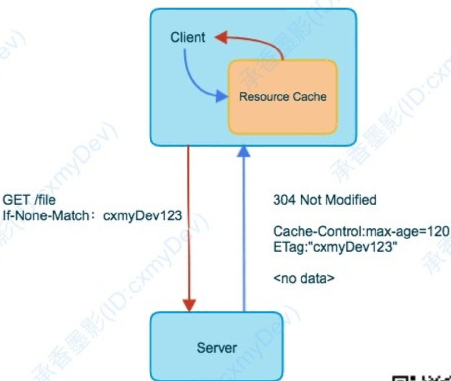
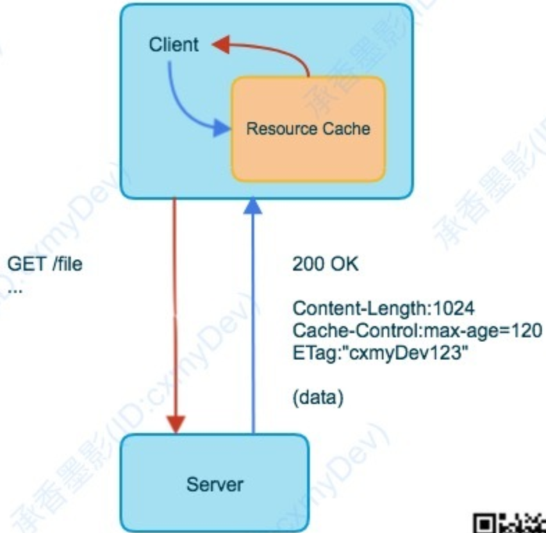

# HTTP 缓存使用
## 为什么需要缓存
缓存说白了就是为了快，无论是从磁盘到内存还是从网络到本地，都是为了在下次实用此资源的时候，能够快速响应，避免多次的 I/O 操作。

通过网络获取资源，是一件耗时的操作，较大的资源还会需要客户端和服务端之间进行多次往返通信，这不但会增加客户端响应的时间，同时还会增加网络流量。

在 HTTP 协议中，天然就有对缓存的支持，浏览器和 App 使用的开源网络库中，都是利用 HTTP 缓存来实现对资源的缓存。

	浏览器是天然支持 HTTP 缓存，开源库则需要进行一些例如存规则和缓存的资源存放路径之类的简单设定。

## 设计一个缓存策略
设计缓存的策略，首先有两个重要的指标需要考虑。

1. 缓存失效

	既然缓存主要是针对数据的复用，那就需要有一个条件来判定当前缓存的数据，是否依然有效。总是不能一次缓存，终身使用。
	
	还需要在缓存失效之后，重新获取新的数据并进行缓存。这个前提就是，缓存都需要有一个失效的策略。
2. 减少读取

	虽然缓存会有失效策略，但是这只是客户端单方面认为失效，此时应该再去服务端重新获取一遍数据。可有些情况下，其实资源可能依然有效，并没有发生变动。那就需要有一个策略，让服务端通知客户端，当前缓存依然有效，可以继续使用。这样在减少传输流量之外，也可以加快相应时间，提高效率。

## HTTP 缓存
HTTP 缓存主要是通过请求和响应报文头中的对应 Header 信息，来控制缓存的策略。

这里主要涉及两个 Header：

- `Cache-Control`

	设定缓存策略，是否使用缓存，超时时间是多少。
- `ETag`

	当前返回数据的验证令牌，可能是 Hash 值也可能是其他指纹，主要用于在下次请求的时候携带上，让服务端依此判断当前数据是否有更改。

服务端在返回响应数据的时候，会在报文头中，增加用于描述当前响应的内容类型、数据长度、缓存策略`Cache-Control`、验证令牌 `ETag` 等信息

上图就表示了一次请求响应的事务，客户端请求一个文件的时候，服务端返回了一个 200 的状态码，表示响应正常，响应的数据长度为 1024 个字节，建议客户端将此资源缓存最多 120 秒，并且提供了一个指纹令牌`“cxmyDev123”`，用来作为当前数据的唯一标识。

## ETag 数据令牌
`Cache-Control` 中设定的 `max-age` 很好理解，就是设定缓存超时的时间，HTTP 缓存是限定一个超时的秒数，来确定缓存失效的时间。

	早期还会用 `expires` 来决定超时的日期，但已废弃，如果和 Cache-Control 同时存在，以 Cache-Control 为准。

在此时间间隔范围内，客户端不会再向服务端发送新的请求。当资源距离上一次缓存的时间间隔，大于 120 秒后，客户端才会再次向服务端发送请求。

假如没有数据令牌的情况下，大概步骤应该是这样的：

1. 客户端会首先找到本地缓存，然后发现它已经失效，无法再次使用。
2. 客户端再次向服务端发出新的请求，并获取完整的数据再次进行缓存。之后再刷新该缓存的超时时间。

这是一件效率非常低的事情，服务端并无法确定所持有的源资源什么时候会失效，所以提供的 `max-age` 值，只是一个参考值，是需要取平衡的，太短会导致请求频繁，太长又会导致无法及时刷新客户端资源。而此时再次请求的时候，是存在一定的概率，客户端缓存的数据和服务端上持有的数据是一致的，我们就不需要再次对此数据资源进行二次缓存，直接使用客户端之前缓存的数据即可，同时还需要刷新缓存超时时间。

这正是数据验证令牌 `ETag` 想要解决的问题，服务端生成并返回的这个数据指纹令牌，通常就是返回数据的 Hash 值或者其他数据指纹，客户端无需关心它的生成规则，只需要知道它是当前数据的一个唯一标识。

客户端需要在下次请求时将其通过 If-None-Match 这个请求报文头，将此验证令牌发送至服务端，如果数据令牌指纹和服务端当前的数据一致，则标识资源未发生新的变化。就会返回一个 304 的状态码，表示可以继续使用客户端本地缓存的数据，并刷新超时时间。注意当响应码为 304 的时候，它是不包含数据内容的。

通常此缓存操作对我们都是透明的，它是浏览器和开源网络库的基本实现，我们无需自己去判断 max-age 和 ETag 的值，这一步我们只需要确定服务端对此有支持即可。

	这里只是提到了 If-None-Match，它标识比较 ETag 是否不一致，除此之外，还有一些其他的相关报文头，例如 If-Match，有兴趣可以查阅相关资料。

## Cache-Control
前面举的例子中，只为 Cache-Control 设定了一个 max-age，但是其实还有一些更丰富的配置。

从缓存性能最优化的角度来看，最佳的缓存是无需与服务端通信的缓存，可以通过缓存来消灭网络延迟以及数据请求，从而来提高用户的体验。

Cache-Control 是在 HTTP/1.1 中被定义的，它可以用于取代之前的缓存策略，现在所有的浏览器都支持 Cache-Control ，它已经成为一种通用的标准。

Cache-Control 还有一些更灵活的配置，用来对缓存做一些更细致的操作。

1. `no-cache` 和 `no-store`

	这两个参数都表示每一次请求，都需要真实的发送一个网络请求。它们之间的区别在于，
	
	- `no-cache`

		 不是真的不缓存数据，它只是要求每次都确认资源是否过期，也就是它会利用数据令牌 `ETag` 来一定程度的减小传输的流量。
	
	-  `no-store` 

		完全是要求客户端，每次都重新请求数据并下载最新的数据，不做任何缓存处理。这种不缓存的策略，也包括中间连接的代理、网关 等中间传输的通道，也一并不对数据进行缓存，每次都从源服务器上获取数据。

2. `public` 和 `private`
	- `public`

		一种默认的策略，表示当前缓存是开放的，任何请求响应的中间环节，都可以对其进行缓存，如果不显式指定，则当前为 `public` 缓存。
	- `private`

		则表示当前响应是针对单个用户的，并非通用数据，因此不建议任何中间缓存对其进行缓存。例如：浏览器就是一个比较私人的缓存源，它会缓存 “private” 的缓存，而 CDN 则不会。
		
## 最佳的缓存策略树
前面提到，缓存的核心目的就是为了快，下次使用的时候可以快速复用。所以在理想情况下，我们应该将响应数据尽可能多的缓存，尽可能的缓存足够长的时间，并且为每个资源提供单独的数据验证令牌，以便在时间过期之后快速校验。

但是任何事情都是要取其平衡点的，不存在什么最佳缓存策略，并非所有响应资源都需要加缓存，这就需要根据业务场景来设定。

这里给出一个增加 HTTP 缓存的通用策略树，你在对响应增加缓存的时候，可以参考它来执行。		