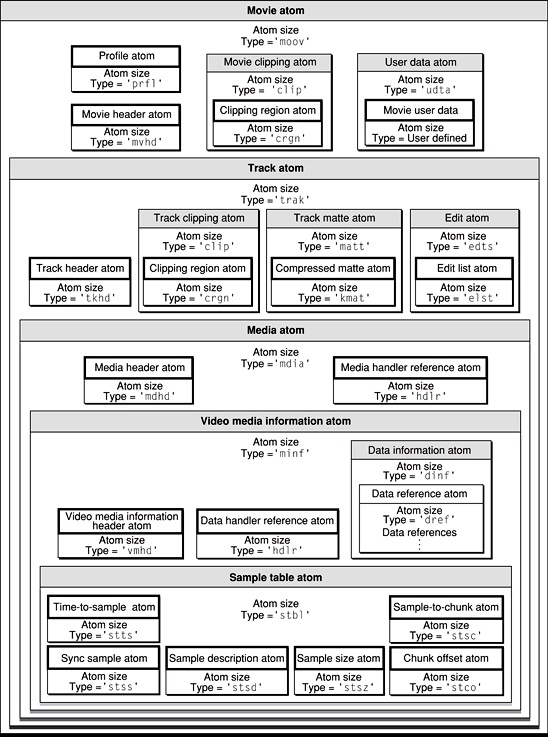
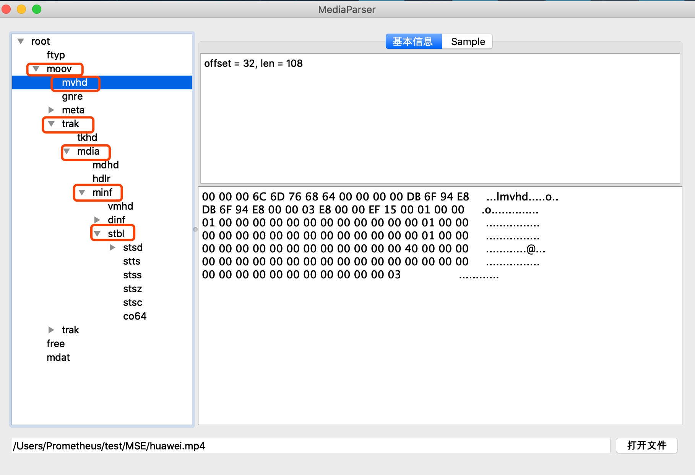

## 理解 MPEG 的 MOOV
在 MP4 格式中，保存数据（及元数据）的单元称为“Box”，也有人称其为“Atom”，后者实际上是 QuickTime 中的称呼。 moov 是 MP4 里 box 其中一种
## 定义
moov  也被叫做 Movie ，它里面定义视频的时间尺度，时长，显示特性，以及含有用于在电影每个轨道信息。moov  的最佳位置取决于所选的传输方式。
## 视频传输
在 Adobe Flash Player 中可以使用四种不同的方法来进行视频传递：

- 渐进式下载

	渐进式下载方法将视频下载并缓存在用户的计算机上。在开始播放之前，需要很短的时间来缓冲和缓存媒体文件的开头。Flash Player 可以根据接收数据的速率和视频的总长度来计算适当的缓冲时间。缓存视频后，随后的观看不需要任何缓冲。通常下载视频都是通过标准 HTTP 协议 CDN 来进行传送。在这种情况下，Flash Player 将与 CDN 的服务器建立 HTTP 连接以下载内容。
- RTMP Streaming

	RTMP 流传输方法可根据需要实时请求传输视频内容。这些数据在看完后会将其丢弃。用户体验与渐进式下载几乎相同，但还有一些主要区别：

	- 观众不必等待视频下载就可以进行视频的快进或者回退
	- 视频不会缓存在用户计算机上，因此无法离线观看
	- Flash Player可以通过Adobe Flash Media Server支持的RTMP或RTMPE协议传送流视频。
- HTTP 动态流

	Flash Player 10.1 引入了对 HTTP Dynamic Streaming 的支持，通过常见的 HTTP 服务器，实现自适应码率，和版权内容的保护支持。它使用标准的 MPEG-4 媒体格式（也称为MP4），HTTP Dynamic Streaming 和 RTMP Streaming共享一些功能：
	
	- 它支持实时和按需下载
	- 它可以根据观看者的连接速度和处理能力来调整视频质量
	- 观众不必等待视频下载就可以进行视频的快进
	- 支持实时 DVR 功能，可以暂停和回退

	像标准渐进式交付一样，内容会缓存在计算机上。如果需要内容保护，则可以与 Adobe Flash Access 集成。
- 通过 RTMFP 进行 P2P

	Flash Player 10.1 和更高版本中使用实时媒体流协议（RTMFP）支持 P2P。这使 Flash Player 客户端可以通过直接连接而不是通过服务器来共享视频，音频和数据。这样就可以通过多播实现高容量交付，并为 VoIP，视频会议和多人游戏等应用提供超低延迟通信。

	注意：实时流媒体不使用 moov ；因此，本文将不涉及实时流。

无论选择哪种方法，观看者的体验都非常相似。您的选择决定了您的预算，比如你需要什么样的 Flash Player 版本以及内容保护级别。在解释容器结构的详细信息时，你可以看到 moov  在每种交付方式中的处理方式都不同。

## MPEG-4 Streaming 打包
为了能够播放 MPEG-4（MP4）文件，该文件必须包装在一种特定的容器中，该容器遵循 MPEG-4 Part 12（ISO / IEC 14496-12）规范。流打包是制作多路复用媒体文件的过程。也称为 muxing，此过程将多个元素组合在一起，从而可以控制分发传递过程到单个文件中。这些元素中的一些以自包含信息。 是一个基本数据单元，其中包含一个 Header 和一个数据字段。该 Header 包含引用元数据，该元数据描述了如何查找，处理和访问数据字段的内容，其中可能包括（但不限于）以下内容：

- Video frames 视频帧信息
- Audio samples 音频采样
- interleaving AV data 交织AV数据
- Captioning data 字幕数据
- Chapter index 章节索引
- Title
- Poster
- User data (用户定义数据)
- 各种技术 meatdata ：编解码器，刻度尺，版本，首选播放速率，首选播放音量，电影时长等。

在符合 MPEG-4 的容器中，每部电影都包含一个 moov 。通常，电影原子包含一个 movie header （一个 mvhd ），它定义整个电影的刻度值和持续时间信息，以及其显示的特性。movie  还为电影中的每个轨道包含一个轨道 （trak ）。每个 trak  都包含一个或多个 media （一个mdia原子）以及定义其他轨道和电影特性。

## 基本 moov  结构
- 结构图

	

- 类 mp4info 工具 [MediaParser](https://github.com/ksvc/MediaParser)

	

在这种树状层次结构中，moov  充当视频数据的索引。MPEG-4 多路复用器在这里存储有关文件的信息，以让用户能够播放和清理文件。直到播放器可以访问该索引，文件才会开始播放。

除非另有说明，否则在描述文件的所有信息均已生成之后，moov 通常以点播内容存储在文件的末尾。根据所选择的按需交付方式的类型（渐进式下载，流式传输或本地回放），该位置将需要移动到文件的末尾或开头。

- 交付方式是渐进式下载或流式传输（RTMP或HTTP）

	必须将 moov  移动到文件的开头。这样可以确保首先下载所需的电影信息，从而使播放立即开始。
- 本地播放

	moov  位于文件的末尾，它将在开始播放之前先强制下载整个文件。如果文件打算在本地播放，则moov  的位置不会影响开始时间，因为整个文件都可以立即播放。

moov  的位置是通过“渐进式下载”、“快速启动”、“使用流模式” 或类似选项之类的设置在各种软件包中指定的。

- [MP4creator](https://link.zhihu.com/?target=http%3A//mp4creator.sourceforge.net/) 或 [icParsley](https://link.zhihu.com/?target=http%3A//icparsley.sourceforge.net/) 之类的软件能够分析 moov  在编码文件中的位置（图1和2）？？？。
- 还有一些工具可以通过对压缩的 MPEG-4（MP4）文件进行后期处理，将 moov  重新定位到文件结构的开头。一种这样的工具是前面提到的 MP4Creator，另一种是 MP4 FastStart。但是，处理 moov  位置的最佳方法是在编码过程的压缩和混合部分设置它。这最小化了 moov  无意间被放置在末端的可能性。

### moov 位置的重要性
将 moov 放置在文件结构的开头可加快回放体验，并访问数据有效负载以供客户端播放器解码和呈现。对于渐进式传送尤其如此，在这种情况下，必须在开始播放之前接收 moov 数据。

但是，在开始时具有 moov 的另一个重要原因与 RTMP Streaming 中的文件，服务器和 CDN 关系有关。当用户通过 RTMP 请求视频资源的时候，Flash Media Server 会检查该资源在本地缓存中的可用性。如果 FMS 不在本地找到资源，则它会在利用 HTTP 缓存层次结构的同时通过本地服务请求资源。

这是关键点：最初，Flash Media Serve 在文件的开头请求一个“范围”以获取目录。如果 FMS 看到 metadata 存储在文件末尾，则它会在文件末尾请求存储元数据的范围，然后再次从头开始请求文件。由于范围请求不可缓存，并且因为它们可以重叠，来回请求的此过程可能会导致重新缓冲。如果用户是从头到尾随机观看视频或小段观看而不是整个视频，则尤其如此，因为它永远不会被完全缓存。因此，建议始终以 moov 开头编码或合并文件，以避免由 moov 子位置引起的重新缓冲。

### edts 处理问题
edts 位于 MP4 容器层次结构中的 moov 的 trak 中, 负责跟踪媒体的时间和持续时间。Flash Player 体系结构旨在忽略 edts 的存在。但是，包含无效或损坏数据的 edts 可能会干扰 HTTP 封包后流的平稳切换。因此，在打包用于 HTTP 动态流的文件之前，修复或删除无效的 edts 很重要。

可以使用诸如 FLVCheck 进行文件一致性检查，MP4Creator 进行结构分析以及 icParsley 删除元数据之类的工具从文件中消除损坏的 edts （参见图3和4）。

以下字符串表示负责去除原子的icParsley命令：

	icParsley.exe filename.mp4 –manualRemove “moov.trak.edts” –manualRemove “moov[2].trak.edts” –overWrite
	
参数说明
	
- `–manualRemove`

	是一个命令的启动，该命令启动特定原子edts的删除，该原子分层地位于moov原子内的trak原子内。如果文件包含多个Trak原子，例如音频和视频媒体元素，则将曲目号添加到“
	
	- `moov.trak.edts`
	
		如上所示。默认情况下，icParsley会从第一个moov原子轨道中删除该原子。依次添加下一个轨道号或您选择的轨道号，会强制icParsley接下来继续执行该原子号	
	- `moov[2].trak.edts`
	
		要编辑所有轨道号，请对每个轨道重复此命令。添加命令字符串
	- `overWrite`

		覆盖原始的处理文件

## 参考
[mp4_movie_](https://www.adobe.com/devnet/video/articles/mp4_movie_.html)
	
