# Babylon.js Editor
## 入门
### 下载
Babylon.js 编辑器可用作使用 Electron 的桌面应用程序。当有可用更新（新功能、错误修复）时，您会收到通知，并且编辑器会为您下载新的安装程序。

该编辑器支持 Windows、macOS 和 Linux，可通过其网站下载：[http://editor.babylonjs.com/](http://editor.babylonjs.com/)
### 外部教程
一些外部教程可用：

[@Limes2018](https://gist.github.com/flushpot1125) 介绍的 [Babylon.JS 编辑器 v4](https://www.crossroad-tech.com/entry/babylonjs-editor-v4-introduction-en)
### 外部示例
Github 上提供了一些项目示例：

[@Limes2018将 WebXR 与 Babylon.JS Editor v4](https://github.com/flushpot1125/WebXR_VRController_Editor_template)结合使用
### 按键快捷方式
- 全局
	- Ctrl+s或Command+s：保存项目。
	- Ctrl+f或Command+f：在当前场景中查找节点或运行命令
	- Ctrl+r或Command+r：在集成浏览器中运行应用程序/游戏
	- Ctrl+b或Command+b：构建项目（使用 WebPack，这可能需要一段时间）
	- Ctrl+g或Command+g：生成项目（生成当前项目的所有输出（脚本、场景文件等））
	- Ctrl+Shift+r或Command+Shift+r：构建并运行应用程序/游戏
	- Ctrl+z或Command+z：撤消操作
	- Ctrl+y或Command+Shift+z：重做动作
- 预览中
	- f: 聚焦选中的节点
	- t: 启用/禁用位置 Gizmo
	- r: 启用/禁用旋转小工具
	- w: 启用/禁用缩放 Gizmo
	- i：切换隔离模式。隔离模式用于通过隔离网格来帮助调试网格。只需在编辑器中选择一个网格，然后键入i. escape退出隔离模式。
	- suppr.: 移除选中的节点
	- Ctrl+c或Command+c：复制选定的节点
	- Ctrl+v或Command+v：过去以前复制的节点。在网格的情况下，将创建一个新实例而不是网格的真实克隆。

## Workspace(工作区)
### 创建一个工作区
#### 创建一个空的工作区
使用编辑器，第一步包括创建一个新的工作区。工作区将允许管理基于工作区的设置和多个项目。重要的是要了解编辑器在没有工作空间的情况下无法工作，因为它允许将场景与代码链接，在正确的位置导出最终场景等。

编辑器启动后，会出现一个欢迎页面并允许：

- 打开现有工作区
- 打开最近的项目（包含最近打开的 3 个工作区）
- 创建一个新的工作区。

让我们创建一个新的 Empty 工作区。这将要求：
	
- 本地网络服务器的端口。

	可以选择任何端口，游戏将在 http://localhost:PORT/index.html
- 使用 Webpack 观看项目

	使用编辑器制作的项目使用 Babylon.JS 的最新 ES6 模块。工作区带有使用 Webpack 构建最终 dist 文件的默认配置。可以自定义此配置。启用此选项将使编辑器自动为我们查看项目的源文件。当我们不需要打开任何代码编辑器或终端而只需使用编辑器时，这尤其有用。

最后，让我们选择并清空创建工作空间的文件夹，编辑器将加载新创建的工作空间：

#### 了解工作区的首次启动
默认情况下，新创建的工作区仅包含基本文件（资产、源文件等）。但是，为了能够构建项目并编译源文件，必须使用 npm 安装依赖项。

在第一次启动工作区时，编辑器将安装依赖项（TypeScript、WebPack、Babylon.JS 等），然后构建项目（使用 WebPack）。根据运行编辑器的机器，这可能需要一段时间。

了解工作空间架构

工作空间的体系结构遵循 Web 项目的基础：

- package.json 描述工作空间并枚举其依赖项
- webpack.config.js 描述构建器的配置（这里使用 WebPack）
- tsconfig.json 描述 TypeScript 配置
- src 文件夹包含所有 TypeScript 文件。换句话说，此文件夹包含应用程序的所有源
- projects 文件夹包含工作区中所有可用项目的列表
- scenes 文件夹包含编辑器导出的所有最终场景（及其文件）。换句话说，这些导出的场景将是运行使用编辑器制作的应用程序/游戏时加载的场景。

##### 了解 package.json
该 package.json 文件是项目的主要入口点。它包含所有依赖项的列表和项目的预定义脚本列表。

当然，所有这些依赖项和脚本都可以 `修改/定制/删除` 以满足项目的要求。例如，有一个多人游戏，socket.io 可以将包（这只是一个示例）添加到依赖项中，并且 "webserver可以修改 " 脚本以运行自定义网络服务器，而不是使用简单的 http-server 命令。

只有脚本是强制性的 "build"，并且必须在 package.json 文件中可用。此外，如果项目是完全定制的，它必须保持其构建项目事件的工作。
##### 了解 webpack.config.js
除了 pacakge.json 文件之外，还可以自定义 Webpack 配置文件以包含项目所需的任何内容。默认情况下，它只是将项目打包到一个文件中（"bundle.js"），准备好被 index.html 文件导入/调用。

它是免费的，根据用户的喜好，使用 Webpack 插件（包括自定义插件），如开发服务器（更多信息在这里：[https://webpack.js.org/configuration/dev-server/](https://webpack.js.org/configuration/dev-server/) ）。

事实上，该webpack.config.js文件必须同时支持“构建”和“监视”模式，因为编辑器允许自动构建/监视项目，而不是我们自己输入命令。当然，如果需要使用自定义命令，我们可以自己处理构建和监视命令。例如：

	npm run watch
或者

	npm run build

### 创建和理解项目
- 将项目添加到工作区

	默认情况下，新创建的工作区包含一个项目。每个工作区都可以管理多个项目，例如，拆分游戏的关卡。

	新创建的项目始终是空的，并准备好接收新资产等。
- 创建一个新项目

	要在工作区中创建新项目，只需转到 `File` 工具栏中的菜单并选择 `Add New Project...`.

	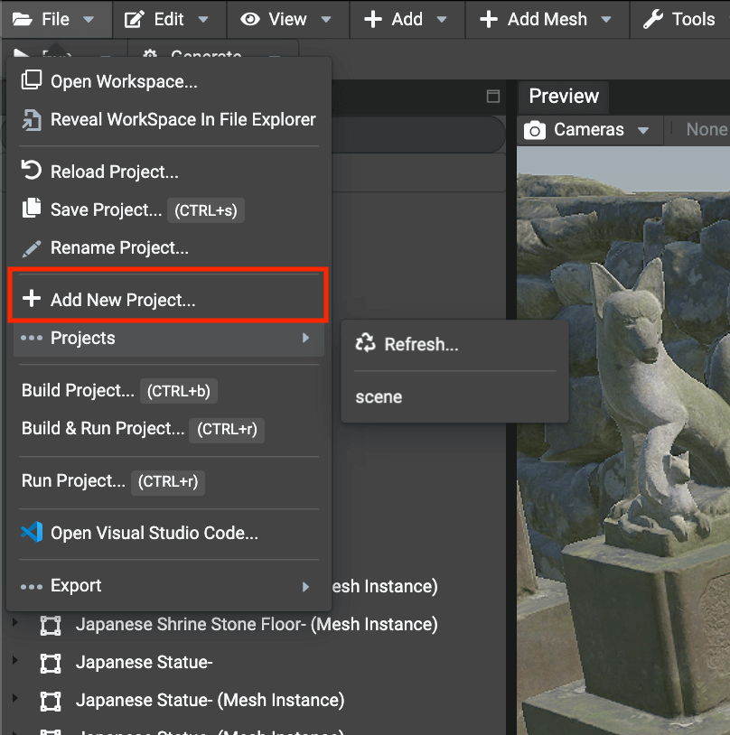
- 单击后，会出现一个弹出窗口，询问项目名称。单击按钮 Finish 后，将在文件系统上创建新项目。
- 然后，编辑器将要求加载继续处理当前项目或加载新项目。

### 重命名项目
- 重命名项目

	要重命名项目，只需转到 `File ` 工具栏中的菜单，选择 `Rename Project...` 并提供项目的新名称：

	
	接受后，将重命名以下文件夹：

	- workspacePath/projects/oldname -> workspacePath/projects/newname
	- workspacePath/scenes/oldname -> workspacePath/scenes/newname
	- workspacePath/src/scenes/oldname -> workspacePath/src/scenes/newname

	如果文件夹已经存在（换句话说，如果项目已经存在），则中止操作。
- 重命名源中的导入

	重命名项目后，必须更新代码中设置的路径。

	例如，一个名为重命名为 scene1 的场景，scene2 必须更新以下导入：
	
		import { runScene } from "./scenes/scene1";
	应重命名为：
	
		import { runScene } from "./scenes/scene2";
	对所有其他不再有效的导入执行相同的操作。完成后，webpack 构建将有效并且项目将开始工作。
- 重命名源中加载程序中的路径

	与 TypeScript 导入一样，代码中加载的场景的路径必须更新其路径。

	例如
	
		const rootUrl = "./scenes/scene1/";
		
		SceneLoader.Append(rootUrl, "scene.babylon", this.scene, () => {
			...
		});	
	应重命名为：
	
		const rootUrl = "./scenes/scene2/";
		
		SceneLoader.Append(rootUrl, "scene.babylon", this.scene, () => {
			...
		});	

## 在 Babylon.JS 编辑器中运行工作区(workspace)和项目(project)
描述如何在 Babylon.js 编辑器中运行/调试工作区/项目。
### 运行/播放工作区
- 运行一个工作区

	安装所有依赖项并构建游戏后，可以使用 2 种方法运行游戏：
	
	- 在集成浏览器中：只需打开一个新窗口，其中呈现应用程序/游戏
	- 在用户的默认浏览器中：将启动本地网络服务器并打开用户的默认浏览器（例如 FireFox）。

	对于开发者来说，在用户的默认浏览器中运行游戏将允许轻松打开开发工具（使用 F12）并调试游戏。

	默认情况下，编辑器将打开集成浏览器。要在编辑器中绘制选项，只需单击工具栏中右键点击的 `Play` 按钮并选择 `Play in my browser`：
	
	
	
	如果是自定义网络服务器（例如使用 Webpack 的开发服务器或具有自定义 API 的完全处理的网络服务器等），我们将不得不手动打开指向所需 Url 的浏览器。

	事实上，当点击按钮 `Play` 时，编辑器将启动一个基本的网络服务器（只提供文件）来运行项目。
	
	启动基本网络服务器后，预览会加载 `Url`  http://localhost:port/index.html。这意味着，在完全定制的网络服务器/环境的情况下，不应再使用预览功能，因为项目设置为在完全定制的环境中运行。

- 运行项目

	从 Babylon.JS Editor v4.0.0-rc.3 开始，可以直接播放正在编辑器中编辑的场景。这意味着在编辑器中的场景可以直接播放，包括附加在场景中的所有脚本。这对于测试场景本身并查看脚本/组件是否按预期工作特别有用。
- 播放场景

	在工具栏的中间，有 2 个按钮：

	- 播放/停止（左侧）生成场景并在编辑器的预览面板中播放场景。
	- 重新启动（在右侧），它只是重新加载要播放的场景。
	
	
	
	单击播放按钮后，预览面板中正在编辑的场景消失，让测试场景可见。一旦要测试的场景是加载器，您就可以播放场景并查看所有脚本是否按预期工作。
- 调试场景

	编辑器中的所有模板都提供了直接在 VSCode 中调试 TypeScript 代码的方法。只需键入 F5 并放置断点或“调试器”；在你的代码中。

		注意：在运行场景之前键入 F5，因为远程调试器（有时）无法附加动态创建的进程来运行场景。

	将 VScode 附加到编辑器后，让我们运行场景并使用您喜欢的快捷方式和调试工具调试您的代码：
	
	

## Babylon.js 编辑器资产
描述如何在 Babylon.js 编辑器中管理资产。
### 资产介绍
从 Babylon.JS Editor v4.1.0 开始，通过引入一个新面板“资产浏览器”来改进资产管理。现在，所有资产都可以跨项目共享，并且现在可以像在其他著名的 3D 编辑器中一样进行浏览。

资产浏览器可以浏览两种主要的资产类型：

- 源代码目录-src

	其中包含项目的所有 TypeScript、Json 等文件
- 资产目录-assets

	其中包含所有场景资产（纹理、网格、材质、声音等）。

为了快速识别资产，在标题上应用了不同的颜色：

- 黄色表示网格资产
- 绿色代表材料资产
- 蓝色代表粒子系统资产

#### 使用资产浏览器
资产浏览器面板由 2 个可调整大小的窗格组成：

- 左窗格：目录树，就像我们在任何文件资源管理器中一样
- 右窗格：所选目录的内容（文件和子目录）

每次在树（左窗格）中选择一个目录时，右窗格都会更新以显示其内容。

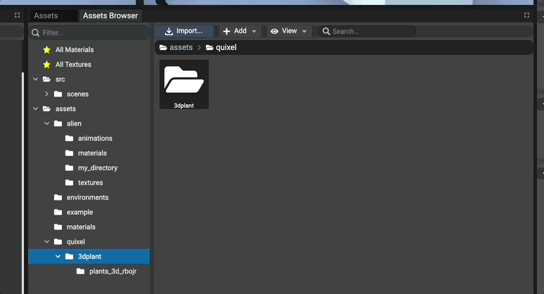

右窗格还包含一堆打开的文件夹。该栈用于获知当前浏览的路径，可以点击快速访问栈中可用的指定目录。

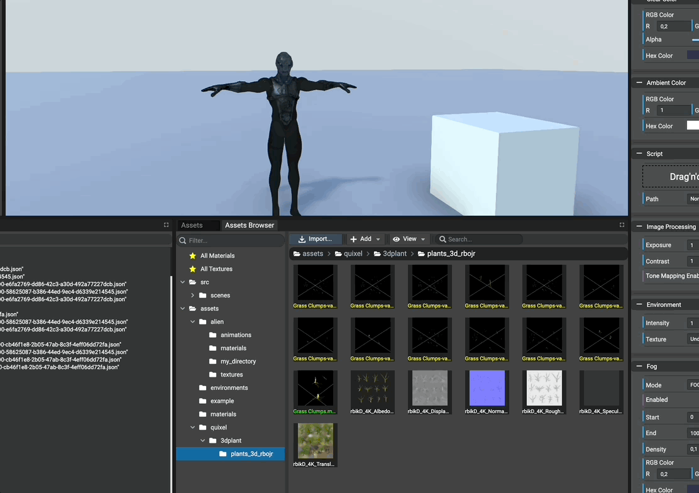

#### 使用收藏夹
在目录树的顶部，有 2 个收藏夹快捷方式可用：

- All Materials：显示当前场景中已实例化（使用）的所有可用材质资源的列表。
- All Textures：对于材质，显示当前场景中已实例化（使用）的所有可用纹理资产的列表。

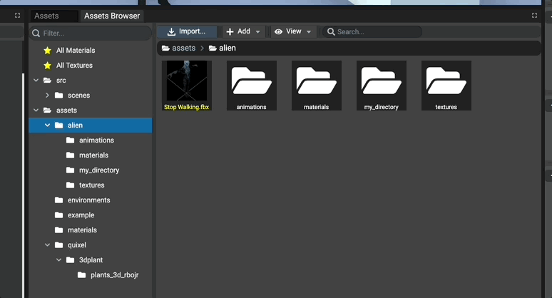

#### 创建一个新文件夹
可以随时创建新文件夹。只需右键单击面板中的空白区域，选择 `New Directory...` 并键入要创建的文件夹的名称。接受后，将在当前浏览的文件夹中创建一个新文件夹。

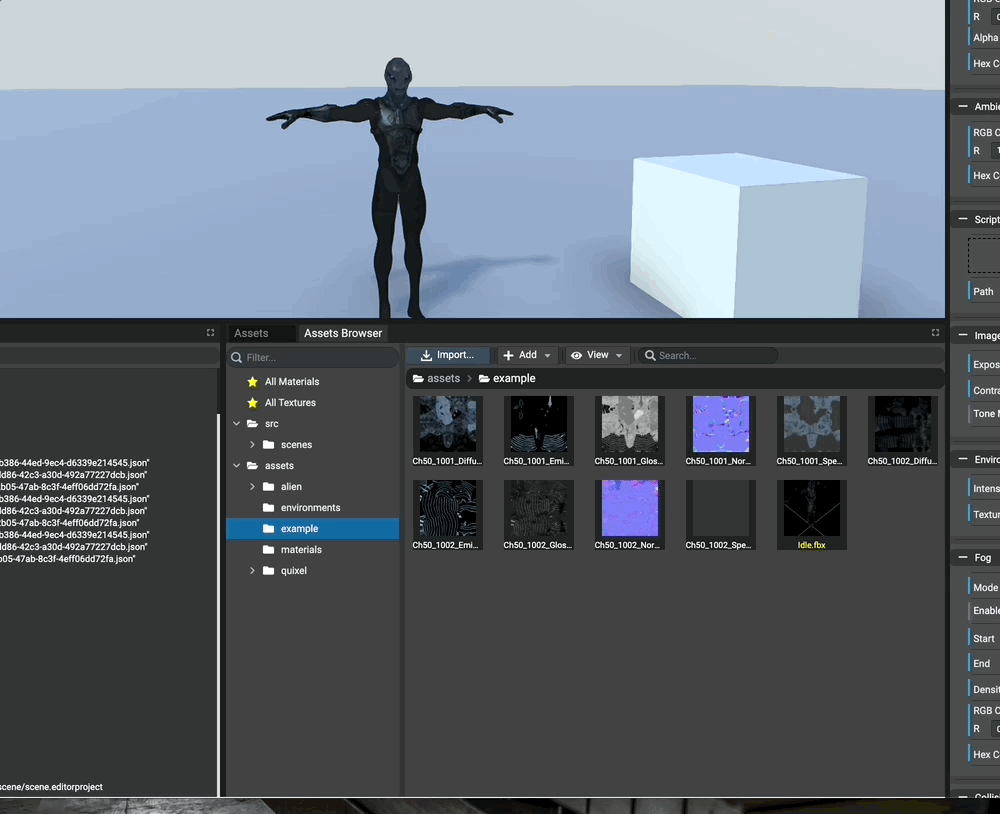
#### 选择文件
与任何其他文件浏览器一样，可以使用以下任一方式选择多个文件：

- CTRL or Command + Click 选择多个单独的文件
- Shift + Click选择一系列文件

注意：矩形选择尚不可用，仍处于 WIP 中。

#### 移动文件
选择文件后，可以将它们拖放到任何文件夹中。移动后，编辑器会自动更新移动文件的所有链接（材质、纹理、声音等）。

在保存项目之前，编辑器会创建一个名为的临时文件 `links.json`，位于 `${workspacePath}/projects/links.json`. 此 json 文件存储每个移动文件的最后移动操作，以便如果项目在保存之前已关闭，则检索链接资产（如材质纹理）的真实路径。

树中也支持拖放

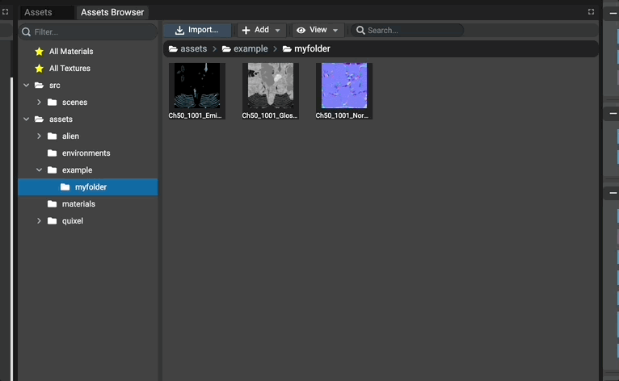

### 添加文件
要添加文件，只需浏览所需的文件夹并单击 `Import...` 资产浏览器工具栏中的按钮。将打开一个对话框以选择要添加的文件。选择并验证后，所有选定的资产将被复制到当前浏览的文件夹中。

每次添加文件时，如果其类型被识别和支持，则将计算其缩略图。

#### 支持的网格格式
- .babylon
- .fbx
- .gltf
- .glb
- .obj
- .stl

#### 支持的纹理格式
- .png
- .jpg
- .bmp
- .basis
- .dds (cube texture)
- .env (cube texture)

#### 支持的声音格式
- .mp3
- .ogg
- .wav

### 添加网格(3D模型)资产
#### 向场景中添加网格
要将新网格（或网格层次结构，取决于源文件的性质）添加到场景中，只需将源文件拖放到预览面板上即可。网格将添加到已删除源文件的位置。

向场景添加网格时，所有骨架、几何体和材质都将在场景中加载和实例化。

由于材质被打包到源文件中，因此对于资产中尚不存在的每种材质，都将创建为 `.material` 文件。

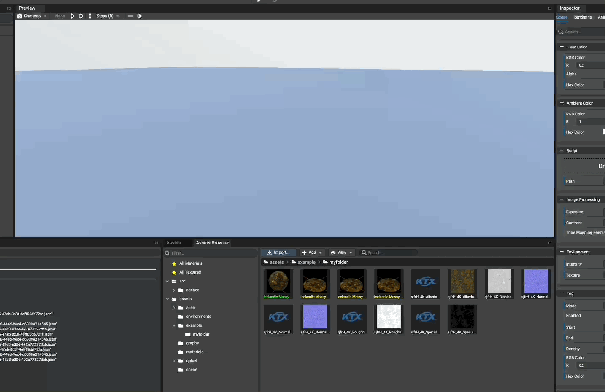

#### 更新现有网格
即使网格是使用旧版本的源文件创建的，也可以更新网格。在资源中更新源网格文件（.babylon、.fbx 等）后，右键点击所选已有材质的网格文件选择 `Update References`

网格可以通过以下方式更新：

- 选择要更新的组件（几何体、材料、骨架）
- 强制更新所有组件（几何体、材料、骨架)

### 检查网格
任何时候，双击一个 mesh 文件在资产浏览器中都会创建一个新窗口（或 MacOS 上的选项卡式窗口）来检查网格源文件。

加载后，Babylon.JS 检查器似乎会检查源文件中可用的网格。您可以参考[检查器文档](https://doc.babylonjs.com/toolsAndResources/tools/inspector%5D)来了解如何使用 Babylon.JS 检查器。

### 手动清洁资产
为了让用户管理自己的资产，编辑器在用户提出要求之前，永远不会删除无用的资产。这意味着，在更新网格时，旧的材质和纹理仍然可以在资源面板中使用。如果您确定不再需要旧材料，请不要忘记清除未使用的资源（例如未使用的材料和未使用的纹理）以保持项目清晰。
### 添加材料资产
#### 介绍
材料被视为资产，Assets Browser 一旦创建就可以在面板中使用。

要创建材质，请使用资产浏览器面板工具栏 `Add -> Materials -> ...`。

常用材料 Standard，PBR 以及 [材料库](https://doc.babylonjs.com/toolsAndResources/assetLibraries/materialsLibrary)Node 中的大多数可用材料均受支持。将材料添加到资产后，会自动创建其预览（缩略图）。

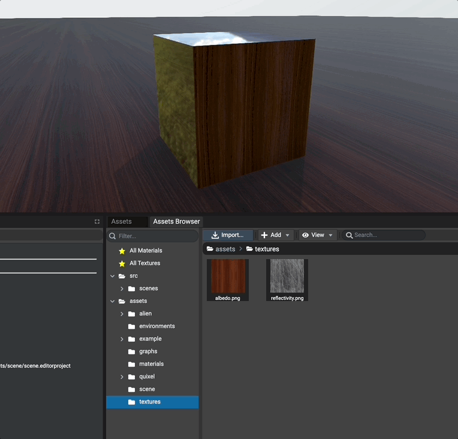	
### 指定材质
要将材质分配给网格，只需将材质资源从资源浏览器拖放到预览面板或检查器中的网格上。

删除材质资源后，如果之前未实例化材质，编辑器将自动创建其实例。如果材质已经实例化，则使用现有参考在网格上指定。

- 示例将材质资源拖放到网格中的网格上 `Preview Panel`

	
- 示例在图表或场景中选择一个网格，然后在检查器的字段中拖放一个材质资源Material

	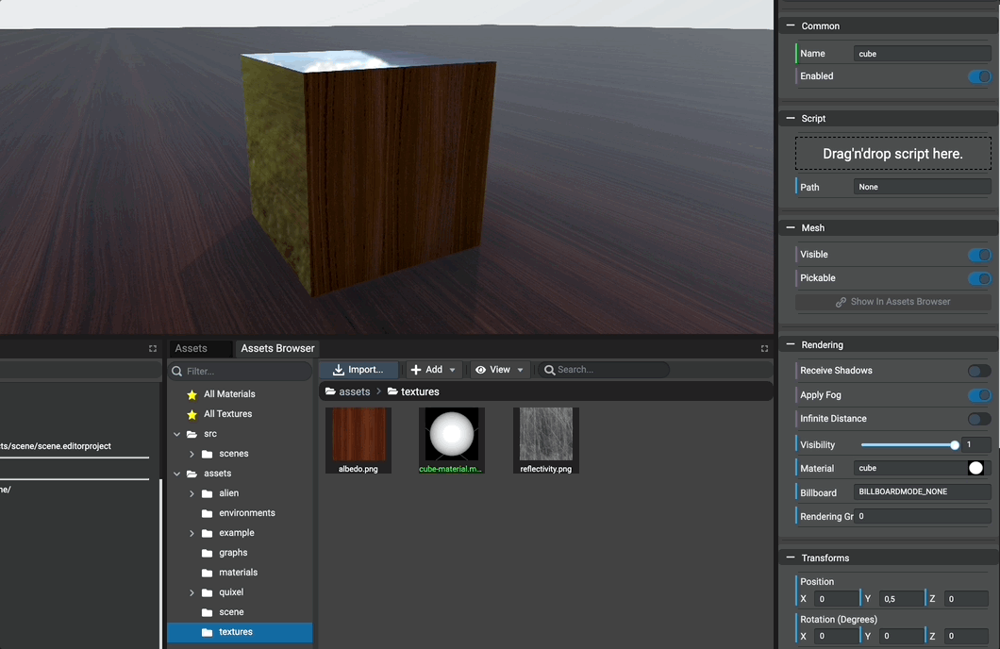

### 编辑材质
要编辑材料，只需单击 `Assets Browser` 面板或 `Assets` 面板中的材料。单击后，检查器将更新以显示材料的可编辑属性。

如果材质尚未实例化，请先在网格上指定材质。否则，检查器将不会被实例化，因为找不到材料的实例。

#### 刷新缩略图
为了在编辑器中保存表演，材料缩略图不会永久更新。例如，如果一个或多个纹理资源已更改，则无需更新缩略图。

要更新材料的缩略图，只需在资产浏览器中选择材料，右键点击然后选择 `Refresh Preview`。
### 添加纹理资产	
#### 在材质上应用纹理
资产浏览器中可用的纹理可以使用并应用于材质。默认情况下，资源浏览器中可用的纹理不会在场景中实例化。

为了在场景中实例化纹理并在材质上使用它们，只需将检查器中的纹理资源拖放到列表框上即可。

在检查器中，所有与纹理相关的列表框（例如场景检查器中的“环境纹理”）都支持从资源浏览器拖放。

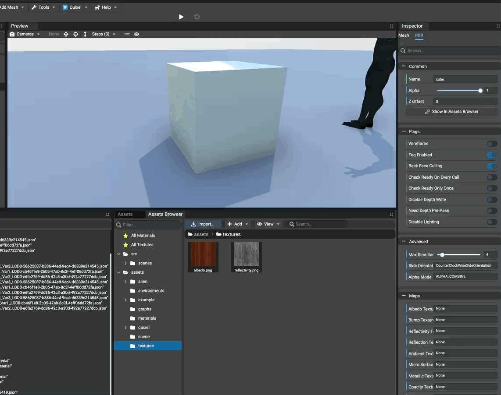
#### 克隆纹理
可以使用 Assets 面板创建同一纹理文件的多个实例。

一旦纹理被实例化，它就会出现在资源面板中。只需右键单击纹理并选择 `Clone...`。输入要创建的纹理实例的名称，最后创建一个共享相同纹理文件的新实例，并在资产面板中可用。

至于资产浏览器面板，资产面板中的纹理可以拖放

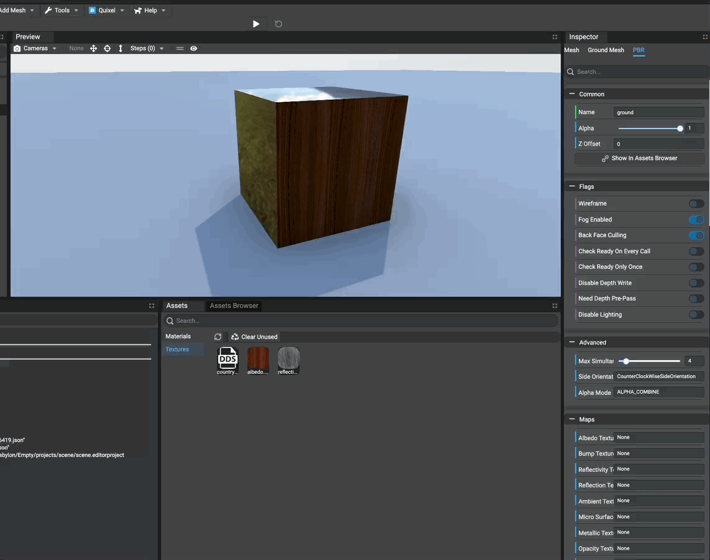
#### 编辑纹理
`Assets Browser` 要编辑纹理，只需在面板或面板中单击它 `Assets`。单击纹理后，检查器将更新以显示单击纹理的可编辑属性。

在资源浏览器中，如果纹理文件有多个实例，则会出现一个菜单来选择要在检查器中编辑的纹理实例

## 在 Babylon.JS 编辑器中使用脚本
描述如何使用 Babylon.js 编辑器在场景中的节点上创建、编辑和附加脚本。
### 附加脚本
- 介绍

	编辑器允许在没有任何代码行的情况下创建和编辑场景。无论如何，场景中的每个对象都可以通过开发人员添加可以使用 TypeScript 创建的行为来进行自定义。这些行为可以附加到对象上，并且会在游戏运行时唤醒。
	
	例如，行为可以是：
	
	- 我有一个摄像头，我想在点击时根据摄像头的方向发射一个球
	- 我有一个对象，我希望它在鼠标悬停时放大
	- 等等等等
	
	编辑器提供了一种创建、管理这些脚本并将其附加到场景中所有可用对象的方法。要自定义脚本，脚本可以导出属性（数字、字符串、布尔值、向量、key等），这些属性可以直接在编辑器中进行编辑。
	
	脚本可以附加到：
	
	- Mesh
	- Mesh Instance
	- Light
	- Camera
	- Transform Node
	
	注意：所有脚本都是使用 TypeScript 编写的
	
	注意：编辑器已针对 Visual Studio Code 进行了优化
- 添加新脚本

	创建工作区后，在 `Assets Browser` 面板树中，一个名为的文件夹 src 可用，并从该 src 文件夹开始浏览项目中的所有可用脚本。
	
	在资产浏览器面板中，只需浏览 src 文件夹单击 `Add -> TypeScript File...` 并为其命名。完成后，已从模板创建脚本，现在可以附加。
	
	注意：当没有提供.ts扩展名时，会自动添加扩展名。例如，新增代码
	
	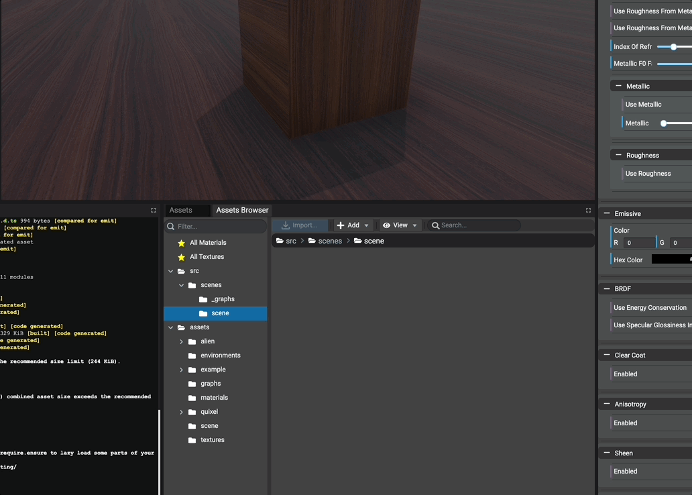

### 附加脚本
我们命名了我们的脚本 `cube.ts`，它将附加到本教程场景中的立方体上。要附加脚本，只需选择多维数据集并转到 Script 编辑器检查器中的部分。我们现在可以选择要附加的脚本，让我们选择 `cube.ts`.

注意：检查器还支持拖放脚本资产。

注意：只能将一个脚本附加到一个对象，但一个脚本可以附加到场景中的多个对象

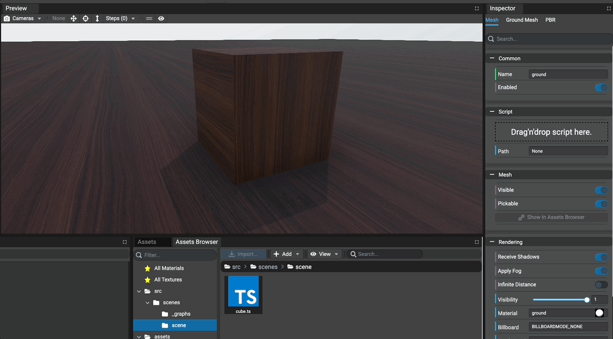

- 在VSCode中打开项目，专注于脚本

	为了帮助在我们的工作区中定位项目和脚本，我们可以 Visual Studio Code 直接从编辑器中打开。此外，编辑器可以直接打开脚本。

	要打开 Visual Studio Code，只需 `File -> Open Visual Studio Code` 在工具栏中选择。
要打开脚本，只需double-click在资产浏览器面板中打开所需的脚本。

	
- 了解脚本

	脚本用于专门化一个对象。这意味着它将附加到场景中的现有对象（例如此处的网格）。每个脚本都会收到通知：

	- 何时开始：表示所有资源都已加载并且游戏准备就绪。onStart 这是脚本中命名的函数。
	- 每一帧：每次 Babylon.JS 渲染一帧时，在渲染帧之前立即调用脚本？onUpdate 这是脚本中命名的函数。

	默认情况下，脚本被命名 MyScript 并且可以重命名。此外，默认情况下，脚本扩展 Node 了 Babylon.JS 的类。在这里，我们将脚本附加到一个立方体，它是一个网格。让我们扩展 Mesh 而不是 Node 这样我们将 Mesh 在键入时自动完成这些：
	
	
- 在编辑器中自定义脚本

	通过设置自定义属性，可以直接在编辑器中自定义脚本。可用的属性类型有：
	
	- number
	- string
	- boolean
	- vector (2d, 3d and 4d)
	- key map

	要设置在编辑器中可见的属性，只需 `@visibleInInspector` 在脚本中装饰它。此处有关装饰器的更多信息：[https ://www.typescriptlang.org/docs/handbook/decorators.html#decorators](https://www.typescriptlang.org/docs/handbook/decorators.html#decorators)

	这些装饰器在文件中可用 `src/scenes/decorators.ts`。`src/scenes/tools.ts` 从 v4.0.0-rc.2 开始不推荐使用其中的装饰器，并且肯定会在 v4.1.0 版本中删除。

	`@visibleInInspector` 装饰器具有给定的参数：

	- 属性类型（数字、字符串、布尔值等）
	- 要在编辑器中显示的属性的名称
	- 属性的默认值
	
	在属性被修饰并保存脚本时，检查器会自动更新并显示新修饰的属性。
	
	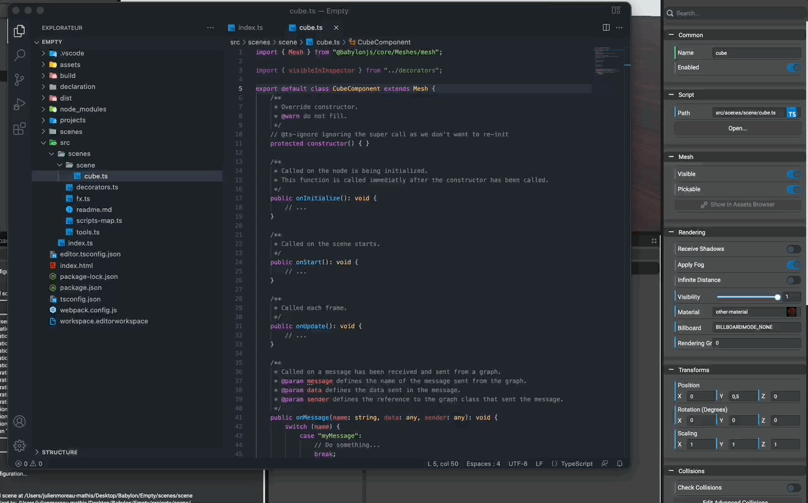
- 使用附加的脚本旋转立方体

	默认情况下，所有 TypeScript 文件都使用 WebPack 打包，包括附加到对象的脚本。这意味着我们必须观察（或构建）项目才能看到运行游戏时的效果。

	有2种方式观看项目：

	- 使用编辑器自动观看
	- 使用运行 package.json 文件或项目中可用脚本的命令行进行观看。

	作为开发人员，使用命令行，只需在工作区的根文件夹中打开一个终端并键入：
	
		npm run watch
	这将监视所有 TypeScript 文件并重新打包 dist 文件。

	使用编辑器，只需打开首选项，转到该 Workspace 部分并启用自动监视（如果未启用）：
	
	
	现在，让我们使用自定义属性旋转立方体 `_speed` 并运行游戏。在本教程中，onStart 不使用该功能。当这些功能之一不使用时，可以将其删除。

	播放场景后，每个装饰属性都支持实时更新。换句话说，每次在检查器中修改修饰属性值时，正在播放的场景中的链接元素都会更新其修饰属性。
	
	
- 管理脚本

	管理脚本必须使用 `Assets Browser` 面板完成，这一点很重要：

	- Moving
	- Removing
	- Renaming

	在编辑器中执行此操作允许自动重新配置具有附加脚本的对象。例如，移动脚本时，所有路径都将在内部更新。

	注意：一旦脚本被移动等，不要忘记更新脚本中的相对导入以抑制编译错误。

### 暴露属性
- 介绍

	脚本属性可以在编辑器中公开和修改。使用 `@visibleInInspector` 装饰器，这些要公开的属性可以在 Inspector.

	支持的属性类型有：

	- number
	- string
	- boolean
	- Vector2
	- Vector3
	- Vector4
	- Color3
	- Color4
	- Texture
	- KeyMap

	注：该 KeyMap 类型在 inspector 中绘制一个按钮等待用户在键盘上按下一个键

	公开属性的常见配置是其类型、名称和默认值。带有名为 Speedor 类型 number 且具有默认值的修饰属性的示例 0.04：
	
		@visibleInInspector("number", "Speed", 0.04)
		private _speed: number;	
	这些公开属性的目标主要是让一个脚本附加到多个节点，每个节点可以有自己的脚本配置。例如，使用该 Speed 属性，两个节点可以附加相同的脚本，但不会以相同的速度旋转。
- 导入装饰器

	装饰器在位于  `decorators.ts`  的文件中可用 `src/scenes/`。任何附加的脚本都可以导入这个文件并使用 `@visibleInInspector` 装饰器。无法在编辑器中自定义未附加到任何节点的脚本
	
		@visibleInInspector("number", "Speed", 0.04)
		private _speed: number;
- 了解装饰器选项

	除了类型、名称和默认值之外，装饰器还有一个 options 参数用于自定义编辑器中的属性。所有字段都是可选的：

	- min：定义可以在编辑器字段中设置的最小值。仅适用于数字和向量。
	- max：定义可以在编辑器字段中设置的最大值。仅适用于数字和向量。
	- step : 定义当用户使用鼠标在编辑器中修改属性时应用于属性的步骤。

	注意：如果同时提供min和max选项，则数字字段将变为滑块。

	在此示例中，检查器中将显示 3 个具有不同选项的属性。

		@visibleInInspector("number", "Speed", 0.04, { min: 0, max: 1, step: 0.01 })
		private _speed: number = 0.04;
		
		@visibleInInspector("number", "Speed 2", 0.04, { min: 0, step: 0.01 })
		private _speed2: number = 0.04;
		
		@visibleInInspector("Vector3", "Gravity", Vector3.Zero(), { min: 0 })
		private _gravity2: Vector3 = Vector3.Zero();
	一旦脚本被保存并附加到至少一个节点，检查器将根据它们的属性和选项显示公开的属性。如果检查器已经专注于附加了已编辑脚本的节点，则检查器将自动更新。
	
	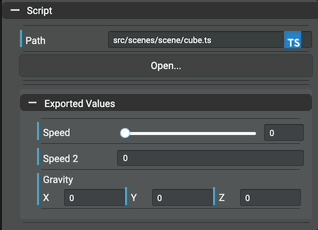	
	作为一个完整的例子，一个使用 Speed 修饰属性在网格上应用旋转的脚本
	
		import { Mesh } from "@babylonjs/core/Meshes/mesh";
	
		import { visibleInInspector } from "../decorators";
		
		export default class MyMeshComponent extends Mesh {
		    @visibleInInspector("number", "Speed", 0.04, { min: 0, max: 1, step: 0.01 })
		    private _speed: number = 1;
		
		    /**
		     * 调用每一帧
		     */
		    public onUpdate(): void {
		        this.rotation.y += 0.04 * this._speed;
		    }
		}

### 获取组件
- 介绍

	可以直接通过装饰属性来获取场景中组件的引用。编辑器提供的 api 会自动解析引用。这允许在声明属性时直接获取组件引用，并避免使用诸如 `scene.getMeshByName(...)etc` 之类的函数。
- 可用的装饰器
	- 从子级
	 
		要获得对附加了脚本的当前节点的子节点的引用，可以使用 `@fromChildren` 装饰器来装饰脚本类中的属性。装饰器的参数是要获取的孩子的名字。
		
			@fromChildren("light")
			private _light: PointLight;
		此参数是可选的。如果未定义，则使用属性的名称。例如：
		
			@fromChildren()
			private _light: PointLight; // 子级的名称必须在编辑器中命名为“_light”。
	- 从场景

		与 `@fromChildren` 相比，可以通过使用装饰器遍历整个场景来检索组件引用 。`@fromScene` 这个装饰器的工作方式类似于 `@fromChildren` 参数是要检索的节点名称的装饰器。该参数也是可选的。
		
			import { Mesh } from "@babylonjs/core/Meshes/mesh";
			import { DirectionalLight } from "@babylonjs/core/Lights/directionalLight";
			import { fromScene } from "../decorators";
			
			export default class MyMeshComponent extends Mesh {
			    @fromScene("sun")
			    private _sun: DirectionalLight;
			
			    public onStart(): void {
			        this._sun.intensity = 10;
			    }
			}
	- 从粒子系统
	
		在 Babylon.JS 中，粒子系统不是节点。要检索粒子系统，不能使用 `@fromChildren` 和 `@fromScene` 装饰器。为了检索粒子系统，有一个名为 `@fromParticleSystems`.

		至于其他 `@from{X}` 装饰器，这个装饰器的参数就是粒子系统的名称。如果未提供，则使用属性的名称
		
			import { Mesh } from "@babylonjs/core/Meshes/mesh";
			import { ParticleSystem } from "@babylonjs/core/Particles/particleSystem";
			
			import { fromParticleSystems } from "../decorators";
			
			export default class MyMeshComponent extends Mesh {
			    @fromParticleSystems("rain")
			    private _rain: ParticleSystem;
			
			    public onStart(): void {
			        this._rain.start();
			    }
			}
	- 从动画组

		对于粒子系统，动画组不是节点。要检索对动画组的引用，只需使用 `@fromAnimationGroups` 装饰器装饰属性。
		
		这个装饰器的参数是动画组的名称。如果未提供，则使用属性的名称。
		
			import { Mesh } from "@babylonjs/core/Meshes/mesh";
			import { AnimationGroup } from "@babylonjs/core/Animations/animationGroup";
			
			import { fromAnimationGroups } from "../decorators";
			
			export default class MyMeshComponent extends Mesh {
			    @fromAnimationGroups("walk")
			    private _walk: AnimationGroup;
			
			    public onStart(): void {
			        this._walk.play(true);
			    }
			}						
	- 从声音

		至于动画组，声音不是节点。要检索对声音的引用，只需使用 `@fromSounds` 装饰器装饰属性。
		
		为了检索参考，必须将声音加载到项目中，或者附加到节点（空间化）或加载为 2D 声音。
		
		
		这个装饰器的参数是声音的名称。在 Babylon.JS 中，声音的名称是加载声音时提供的路径。例如 `assets/sounds/mySound.mp3`.

		为了获得声音的名称，`Assets Browser` 面板通过右键点击声音文件提供了一个帮助程序。只需 Copy Path 在上下文菜单中单击，即可将声音名称添加到剪贴板，然后将其粘贴到参数的代码编辑器中。
		
		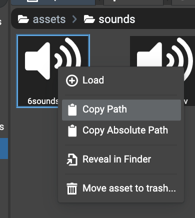
		
		引用到代码
		
			import { Mesh } from "@babylonjs/core/Meshes/mesh";
			import { Sound } from "@babylonjs/core/Audio/sound";
			
			import { fromSounds } from "../decorators";
			
			export default class MyMeshComponent extends Mesh {
			    @fromSounds("sounds/6sounds.mp3")
			    private _sound: Sound;
			
			    public onStart(): void {
			        this._sound.play();
			    }
			}

### 监听事件
- 介绍

	Editor api 提供了一些工具，如装饰器，以帮助在全局和节点上监听事件。换句话说，例如在指针事件上，api 可以侦听事件并选择选定的网格以通知装饰方法。
	
	例如， 监听指针事件指针点击当前网格有这个脚本附加:
	
		import { Mesh } from "@babylonjs/core/Meshes/mesh";
		import { Vector3 } from "@babylonjs/core/Maths/math.vector";
		import { PointerEventTypes, PointerInfo } from "@babylonjs/core/Events/pointerEvents";
		
		import { onPointerEvent } from "../decorators";
		
		export default class MyMeshComponent extends Mesh {
		    private _physicsEnabled: boolean = true;
		
		    ...
		
		    @onPointerEvent(PointerEventTypes.POINTERTAP, true)
		    protected _tapped(info: PointerInfo): void {
		        if (!this._physicsEnabled) {
		            return;
		        }
		
		        const force = this.getDirection(new Vector3(0, 0, 1));
		        this.applyImpulse(force, this.getAbsolutePosition());
		    }
		
		    ...
		}
- 可用的装饰器
	- 指针事件

		要监听指针事件，`@onPointerEvent` 可以使用装饰器来装饰要调用的方法。这个装饰器有 2 个参数：
		
		- 指针事件类型（`PointerEventTypesfrom @babylonjs/core/Events/pointerEvents`）。
		- 一个布尔值，指示是否仅在选择网格时才调用该方法。
		
		第二个布尔参数默认设置为 `true`。这意味着它必须设置为 `false` 才能全局监听指针事件。
		
			@onPointerEvent(PointerEventTypes.POINTERTAP, false)
			protected _tapped(info: PointerInfo): void {
			    // 在用户单击画布上的任何地方时调用。
			}
			
			@onPointerEvent(PointerEventTypes.POINTERTAP, true)
			protected _tapped(info: PointerInfo): void {
			    // 在用户单击网格时调用。
			}
		方法签名可以定义 `PointerInfo` 包含所有指针事件信息的引用，例如我们使用 `scene.onPointerObservable.add((info) => { ... })`.

		注意：仅当包含网格的场景在游戏/应用程序中实例化时才会调用该方法
	- 关于键盘事件

		至于 `@onPointerEvent` 装饰器，`@onKeyboardEvent` 装饰器可以用来装饰脚本中的方法。这个装饰器有 2 个参数：

		- 要监听的键盘的键（作为数字或字符串）。
		- 要监听的键盘事件的类型（向上键或向下键）。

		注意：键盘事件总是全局监听

		- 监听 z键的示例
		
				@onKeyboardEvent("z", KeyboardEventTypes.KEYUP)
				protected _keyup(info: KeyboardInfo): void {
				    console.log(info.event.key);
				}	
		- 可以同时监听多个键，当任何指定的键被触发时，装饰方法将被调用

				@onKeyboardEvent(["z", "q", "s", "d"], KeyboardEventTypes.KEYUP)
				protected _keyup(info: KeyboardInfo): void {
				    console.log(info.event.key);
				}	
		- 不推荐使用键代码而不是键值，但仍受支持。

				@onKeyboardEvent(32 /* or [32, 53] for multiple keys */, KeyboardEventTypes.KEYUP)
				protected _keyup(info: KeyboardInfo): void {
				    console.log(info.event.keyCode);
				}		
## 在 Babylon.JS 编辑器中附加物理属性
描述如何使用 Babylon.js 编辑器在场景中的网格上创建和编辑物理。
### 介绍
编辑器允许使用检查器为场景中的网格设置和编辑物理冒名顶替。支持所有物理引擎：

- CannonJS
- OimoJS
- AmmoJS

默认情况下，物理在项目中启用并且使用CannonJS.

### 设置物理
通过在场景中选择一个网格或网格实例（基本上是任何扩展的对象 `AbstractMesh`），检查器将被更新以显示对象的属性。对于网格和网格实例，一些属性侧重于位于名为 `Physics` 的文件夹中的物理场。默认情况下，所有未配置的网格都没有冒名顶替者 ( NoImpostor)。

目前，可用的冒名顶替者是：

- BoxImpostor
- SphereImpostor
- CylinderImpostor

通过选择一个新的冒名顶替者，该工具将被更新以显示以下常见属性：

- Mass
- Restitution
- Friction

此处提供了所有这些选项的[文档](https://doc.babylonjs.com/divingDeeper/physics/usingPhysicsEngine#options)。

一旦配置了这些属性，物理场就不能在编辑器中预览。要预览结果，只需运行项目以查看物理效果并在需要时通过单击工具栏中的`Play` 按钮来调整属性。

在下面的示例中，盒子和地面已经设置了一个冒名顶替者 `BoxImpostor`，盒子的质量为 1，地面的质量为 0（以保持静止）。

### 改变重力
在场景图中选择场景时，有 2 个可编辑的重力属性：

- 碰撞重力
- 物理重力

根据想要的效果，两个重力值可以是不同的。在 Physics 场景检查器的文件夹中，可以自定义物理引擎应用的重力：

### 选择物理引擎
使用检查器，场景的属性允许更改项目应该使用的物理引擎。默认情况下，CannonJS 使用并且可以被 OimoJS 和 AmmoJS 替换。无需重置或重新定义已经存在的冒名顶替者即可更改物理引擎。

一旦选择了所需的物理引擎，项目也必须更新。事实上，默认情况下，项目模板使用文件 CannonJS 中导入库的位置 index.html。例如，在使用OimoJS 的情况下，此导入必须替换为导入的那个 OimoJS。默认模板如下所示：

	<!DOCTYPE html>
	<html xmlns="http://www.w3.org/1999/xhtml">
	
	    <head>
	        <meta http-equiv="Content-Type" content="text/html; charset=utf-8" />
	        <title>Babylon.js Generated Template</title>
	
	        <!-- Loads the game -->
	        
	
	        <!-- Loads the physics engine "CannonJS" -->
	        
	
	        ...
	    </head>
	
	    <body>
	        ...
	    </body>
	
	</html>
换句话说，对于这个例子，CannonJS 应该替换导入以 `Oimo.js` 从 CDN 或任何其他相应文件中加载文件 `node_modules`：

	
或使用AmmoJS

	
这给出了，例如AmmoJS：

	<!DOCTYPE html>
	<html xmlns="http://www.w3.org/1999/xhtml">
	
	    <head>
	        <meta http-equiv="Content-Type" content="text/html; charset=utf-8" />
	        <title>Babylon.js Generated Template</title>
	
	        <!-- 载入游戏 -->
	        
	
	        <!-- 载入物理引擎 "AmmoJS" -->
	        
	
	        ...
	    </head>
	
	    <body>
	        ...
	    </body>
	
	</html>

## 在 Babylon.JS 编辑器中配置碰撞
描述如何使用 Babylon.js 编辑器在场景中的网格上创建和编辑碰撞。
### 基础碰撞
- 设置基本碰撞

	使用检查器，可以为每个对象自定义碰撞属性：

	- meshes：设置编辑后的网格是否检查碰撞。
	- cameras：设置编辑后的相机是否检查网格上的碰撞以及是否应应用重力。
	- scene：设置场景中是否启用碰撞并配置重力值。
- 在场景中启用碰撞

	要在场景中启用碰撞，只需 Scene 在图中选择：
	
	
- 并在检查器中滚动以找到名为的部分Collisions

	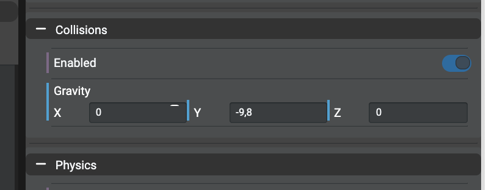
- 要启用碰撞，只需选中 Enabled 复选框并提供当前场景所需的重力值

#### 为相机启用碰撞
默认情况下，相机不需要检查碰撞。如果您的相机不检查碰撞，只需在图表中选择所需的相机并在检查器中滚动以找到名为Collisions.

注意：根据所选摄像机的类型，不会显示所有属性。例如，该 `Apply Gravity` 选项将不会显示在 `Arc Rotate Camera` 因为它没有意义。

- FreeCamera

	类型 `FreeCamera` 的相机是项目中最常见的相机类型。要启用碰撞，只需选中 `Check Collisions` 复选框并配置椭球值。对于椭球体，请查看[以下文档](https://doc.babylonjs.com/divingDeeper/cameras/camera_collisions#2-define-an-ellipsoid)，以便根据编辑器中正在编辑的当前场景的性质了解和设置所需的值。

	如果启用该属性 `Apply Gravity`，它将应用先前在场景中设置的重力，并且只能通过取消选中该属性来禁用。

	
- Arc Rotate Camera

	相对于 FreeCamera，Arc Rotate Camera 可以使用复选框启用它们的碰撞 Enabled。与FreeCamera，椭球属性被 `Collisions Radius` 属性所取代。检查[以下文档](https://doc.babylonjs.com/divingDeeper/cameras/camera_collisions#4-object-vs-object-collision)以了解和设置碰撞半径的所需值
	
	
	
#### 在代码中使用“.moveWithCollisions”方法
Babylon.JS API 提供了一个以类命名的 `.moveWithCollisions` Mesh方法。此方法适用于没有任何额外配置的相机。它将检查在场景中启用了碰撞的所有网格上的碰撞。
### 高级碰撞
#### 设置高级碰撞
`.moveWithCollisions` 即使对于使用该方法的相机和网格，检查复杂对象上的碰撞也会对性能产生很大影响。编辑器提供了一个工具，可以轻松地在场景中的任何网格对象上设置碰撞形状，以节省性能。
#### 介绍
- 基本碰撞

	默认情况下，Babylon.JS 将使用一种复杂的算法检查碰撞，该算法检查相机附近每个网格的每个三角形的碰撞，或者随着碰撞移动的网格。有时（通常）检查边界框上的碰撞就足够了。

	该方法将包括：
	
	- 通过代码创建一个新的立方体网格或球体网格（命名为 collider）
	- 将碰撞器添加为网格的子对象
	- 将网格的边界框属性应用于碰撞器
	- 禁用网格上的碰撞并启用碰撞器上的碰撞。
	
	这样，碰撞器将始终扩展网格的变换，并且相机将仅检查立方体或球体碰撞器上的碰撞，而不是检查每个三角形的整个网格上的碰撞。
- 高级碰撞

	让我们想象一个更复杂的场景，其中盒子和球体碰撞是不够的：楼梯。在这种情况下，只有“每个三角形” 的碰撞才能以自然的方式上楼。
	
	如果楼梯 3d 模型过于复杂，并且为了节省性能，解决方案是为楼梯提供（或动态生成）较低详细的 3d 模型。
	
	该方法包括创建由艺术家或使用 Babylon.JS 的 [Auto-LOD 简化工具](https://doc.babylonjs.com/divingDeeper/mesh/simplifyingMeshes) 制作的源网格（而不是立方体或球体）的较低级别细节对象并对其设置 `Basic Collisions`.
	
	这里的问题是生成较低级别的细节需要时间成本，并且使用简化方法简化网格是异步的。
- 挽救编辑

	编辑器提供了一个工具来生成每个网格的 colliders 以节省时间和性能。

#### 编辑高级碰撞
要编辑高级碰撞，请在图表中选择一个网格，在检查器中滚动以找到该部分的  `Collisions`，然后单击按钮 `Edit Advanced Collisions...`。单击后，检查器上会打开一个新工具，显示对象碰撞的当前状态。

- 了解工具

	打开后，该工具会显示对象碰撞的当前阶段（此处None）。要选择对撞机类型，只需打开列表框并选择所需的对撞机类型。每次更改碰撞器类型时，网格的碰撞组件都会在预览中更新并显示为红色。

	注意：对于具有实例的网格，每次更改碰撞器类型时，都会更新所有实例以引入新的碰撞器组件。
- 立方体对撞机

	碰撞器是性能最高的 Cube 碰撞器，它只允许在网格的边界框上检查碰撞。
	
	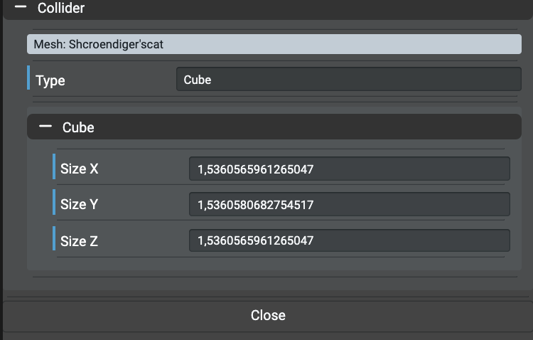
	换句话说，想象一下下面的模型会有碰撞检查，就像它是一个立方体而不是一个复杂的网格
	
	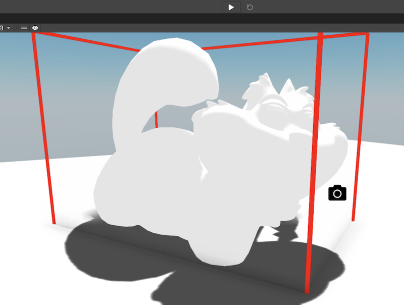
- 球体对撞机

	与 Cube 碰撞器一样，Sphere 碰撞器将允许检查网格边界球上的碰撞，而不是网格的边界框。在某些情况下，该对撞机可能很有用，尤其是在移动平台是球体的情况下。
- LOD 碰撞器

	以特定场景示例（楼梯）为例，该工具允许根据少数属性创建自动 LOD。它使用 `QuadraticErrorSimplificationBabylon.JS` 中的实现，并允许预先生成将被保存的较低级别的细节以及场景的其余部分。换句话说，不需要额外的工作。

	要了解属性，请查看属性的和质量属性的 [ 文档 ](https://doc.babylonjs.com/divingDeeper/mesh/simplifyingMeshes#usage---simplifying-a-mesh)。

	作为信息，该工具显示基本顶点数与 LOD 顶点数。这有助于了解网格已经简化了多少。注意不要简化太多，以保持网格的整体拓扑结构，例如楼梯。

	在大多数情况下，将质量设置为“0.01”适用于顶点数可以从77 424变为 882 的情况。
	
	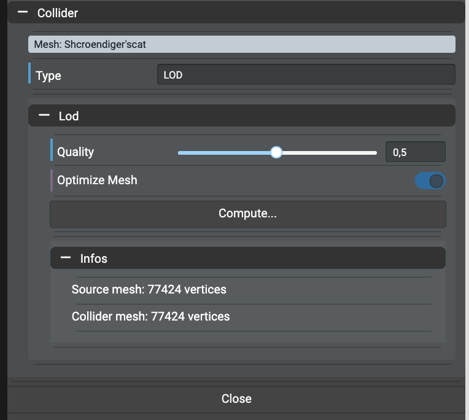	
	
	设置属性后，只需单击 `Compute...` 按钮生成 LOD，就会出现一个叠加层，通知算法正在运行。完成后，该 Infos 部分会更新以显示新的顶点计数值，并且预览中的碰撞器网格也会更新
	
	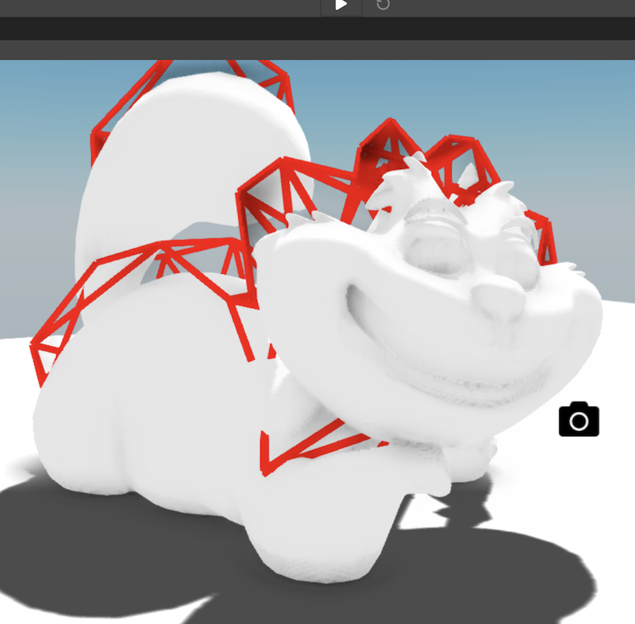		

## Babylon.js 编辑器故障排除
描述如何处理 Babylon.js 编辑器可能发生的错误/问题	
### 模糊的 Babylon.js 编辑器 UI
Babylon.JS 编辑器基于 Electron 框架。在 Win32 系统上，已经注意到在特定配置下，编辑器的整体 UI 可能会变得模糊。

这可以通过将视频卡的驱动程序更新到最新版本来解决。

如果是 RTX NVidia 显卡，请尝试安装 Studio 驱动程序版本而不是那个Game。

如果是其他 NVidia 显卡，请尝试在显示设置中运行 NVidia Control Panel 并选择。No Scaling

- 参考

	链接问题：[https ://github.com/BabylonJS/Editor/issues/266](https ://github.com/BabylonJS/Editor/issues/266)

### 启动
已经注意到，有时编辑器无法启动（或至少出现 WebGL 错误）然后无法使用。这个问题主要出现在使用英特尔高清显卡的设备上。

- 英特尔高清显卡

	有 2 个选项可以解决启动问题
- 更改 Windows 设置
	- 打开 Windows 设置并搜索Graphics Settings.
	- 在中，在下拉列表中Graphics Performance Preference选择，然后浏览到，您现在应该会看到它已添加到列表中。Desktop AppBabylonJSEditor.exe
	- 单击Babylon JS Editor列表中的 ，然后单击Options。
	- 将您的偏好设置为High Performance Mode。
	- 关闭并重新打开编辑器。
- 更新 Intel UHD 驱动程序

	安装通用 Intel DCH 图形驱动程序（Driver Support Assistant推荐）。阅读警告，但简而言之：您的默认驱动程序通常由制造商定制，但这个通用驱动程序不是。显然，你冒着搞砸事情的风险。

- 参考

	链接问题：[https ://github.com/BabylonJS/Editor/issues/278](https://github.com/BabylonJS/Editor/issues/278)			
## 参考
- [Babylon.js Editor](https://doc.babylonjs.com/extensions/editor)