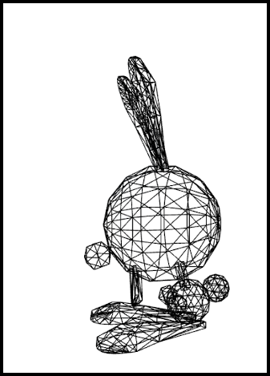
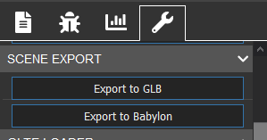
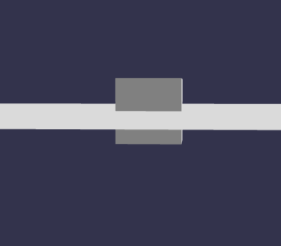
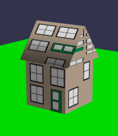
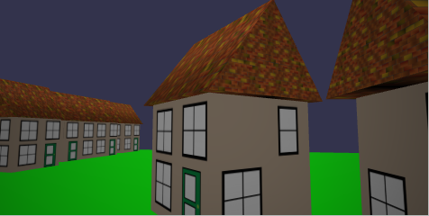

# babylon 官方入门教学(入门1-2)
## 入门 - 第 1 章 入门
第一步将向您介绍使用 Babylon.js 创建场景、编写简单模型并将其导出的基础知识。不仅可以使用 Babylon.js 创建模型，在其他软件中创建的一系列模型类型也可以导入到 Babylon.js。

我们将向您展示

- 如何将模型导入场景
- 在 Web 上显示
- 并从中创建 Web 应用程序。

从这个取代通常的“Hello World”介绍开始，我们将逐步构建一个简单的世界。在旅程的最后，我们将创建一个展示 Babylon.js 功能的小村庄。

每个页面上的示例也使用我们的交互式 Playground 呈现，您可以在其中立即编写、查看和试验代码。

可以将格式正确并在 Playground 中工作的代码复制并粘贴到 HTML 模板中，并用作您的第一个 Web 应用程序。

### 第1章 第一个场景
#### 第一个场景和模型
无论您是创建一个完整的世界还是只是将一个模型放入网页中，您都需要一个包含

- 该世界模型的[场景](https://doc.babylonjs.com/divingDeeper/scene)
- 一台[摄像机](https://doc.babylonjs.com/divingDeeper/cameras)来查看它
- 一盏[灯](https://doc.babylonjs.com/divingDeeper/lights)照亮它
- 当然，至少还有一个可视对象作为模型。

所有模型，无论是一个盒子还是一个复杂的角色，都是由三角形或面的[网格](https://doc.babylonjs.com/divingDeeper/mesh)制成的

显示网格三角形的线框视图

可以使用代码直接在 Babylon.js 中创建大量网格，或者从使用其他软件创建的网格中导入为模型。让我们使用 Playground 从一个[盒子](https://playground.babylonjs.com/#KBS9I5)开始。

可以在 Playground 中查看这些页面上的示例，这是在网络上试用 Babylon.js 的地方，方法是单击它们的标题。要编辑代码，请打开显示网格三角形的线框视图

#### 向你的第一个世界问好
所有使用 Babylon.js 引擎的项目都需要一个添加了相机和灯光的场景。然后我们可以创建我们的盒子。

等等……你问的 Babylon.js 引擎是什么？很好的问题。下面看到的引擎变量是负责与 WebGL、Audio 等低级 API 接口的类。创建巴比伦场景（将视觉呈现到屏幕的上下文）的构造函数需要引擎转化这些低级 API 到对话级 API。这就是创建场景时需要引擎变量的原因。

您可以在[此处](https://doc.babylonjs.com/typedoc/classes/babylon.engine)阅读有关引擎类的更多信息。

	const scene = new BABYLON.Scene(engine);
	
	const camera = new BABYLON.ArcRotateCamera("camera", -Math.PI / 2, Math.PI / 2.5, 3, new BABYLON.Vector3(0, 0, 0), scene);
	camera.attachControl(canvas, true);
	
	const light = new BABYLON.HemisphericLight("light", new BABYLON.Vector3(0, 1, 0), scene);
	
	const box = BABYLON.MeshBuilder.CreateBox("box", {}, scene);
像大多数使用 `MeshBuilder` 创建的网格一样，创建的盒子的中心位于原点，需要三个参数。它们是

- 名称"字符串"
- 选项"JavaScript 对象"
- 场景

通过将选项保留为空对象如果没有属性，宽度、高度和深度默认为单位大小之一。

为了在 Playground 中可用，我们需要将它们放在一个名为 `createScene` 的函数中，该函数必须返回一个场景。Playground 应用程序负责其余的工作。

	const createScene = () => {
	    const scene = new BABYLON.Scene(engine);
	
	    const camera = new BABYLON.ArcRotateCamera("camera", -Math.PI / 2, Math.PI / 2.5, 3, new BABYLON.Vector3(0, 0, 0));
	    camera.attachControl(canvas, true);
	
	    const light = new BABYLON.HemisphericLight("light", new BABYLON.Vector3(0, 1, 0));
	
	    const box = BABYLON.MeshBuilder.CreateBox("box", {});
	
	    return scene;
	}
由于此时只有一个场景，您可能会注意到此参数可以从相机、灯光和盒子中删除，因为默认情况下将它们放置在当前场景中。

创建我们的盒子后，我们可以通过选择 Inspector 从Playground内保存或导出场景

然后是工具并选择要导出的类型，.babylon格式或GLB格式

现在我们有了一个文件，我们可以用它来演示如何在网页中查看它

#### 网页上的第一个模型
如果文件类型是 Babylon.js 识别的文件类型，那么您可以使用 Babylon.js [查看器](https://doc.babylonjs.com/extensions/babylonViewer) 通过  `<babylon>` 元素在网页上显示您的场景或模型。合适的文件类型示例是

- .babylon
- .gltf
- glb

推荐使用 `.glb`。无论场景是使用 Babylon.js 构建还是使用您最喜欢的设计软件创建，都没有区别。 `<babylon>` 元素将调整大小以适合其容器。

为了使用查看器，您需要将其代码添加到 HTML 页面的 `
添加后，您将  `<babylon>` 元素放置在适当的容器中，并将其模型属性指向文件源

	<babylon model="Path to File"></babylon>

[例子网站](https://doc.babylonjs.com/webpages/page1.html)

代码在 demo/index.html

#### 使用模型
此页面上的 Playground 包含可以定位、旋转和缩放的模型（在此示例中为房屋）。一旦介绍了基础知识（例如导入模型并将您的项目放在网页上），我们将向您详细介绍如何使用 Babylon.js 完成此操作。
#### 导入场景或模型
当您将模型添加到场景中时，您正在通过浏览器加载它。您可能已经知道，从网站加载任何内容都是异步函数。因此，在对模型进行任何操作之前，首先必须确保它们已成功加载。您可以使用 `SceneLoader` 的 `ImportMeshAsync` 方法执行此操作，可以按如下方式完成：

	BABYLON.SceneLoader.ImportMeshAsync(model_name, folder_path, file_name, scene);
场景参数是可选的，默认为当前场景。第一个参数可以是三种类型中的任何一种，具体取决于您是要加载所有模型、一个模型还是模型列表。

	BABYLON.SceneLoader.ImportMeshAsync("", "/relative path/", "myFile"); //空字符串加载所有网格
	BABYLON.SceneLoader.ImportMeshAsync("model1", "/relative path/", "myFile"); //模型名称加载一个模型
	BABYLON.SceneLoader.ImportMeshAsync(["model1", "model2"], "/relative path/", "myFile"); //模型名称数组
请注意，上面的任何调用都只会加载模型；但是，您将无法以任何方式操纵它们。在内部，设置并返回了一个 `Promise` 对象，但上面的代码对该 Promise 的结果没有任何作用。这方面的示例在以下两个 Playground 中，它们仅导入命名模型。

- [加载一个模型](https://playground.babylonjs.com/#YNEAUL#11)

		const createScene = function () {
		    
		    const scene = new BABYLON.Scene(engine);
		
		    const camera = new BABYLON.ArcRotateCamera("camera", -Math.PI / 2, Math.PI / 2.5, 15, new BABYLON.Vector3(0, 0, 0));
		    camera.attachControl(canvas, true);
		    const light = new BABYLON.HemisphericLight("light", new BABYLON.Vector3(1, 1, 0));
		
		    BABYLON.SceneLoader.ImportMeshAsync("semi_house", "https://assets.babylonjs.com/meshes/", "both_houses_scene.babylon");
		
		    return scene;
		};
- [同时加载多个模型](https://playground.babylonjs.com/#YNEAUL#12)

		const createScene = function () {
		    
		    const scene = new BABYLON.Scene(engine);
		
		    const camera = new BABYLON.ArcRotateCamera("camera", -Math.PI / 2, Math.PI / 2.5, 15, new BABYLON.Vector3(0, 0, 0));
		    camera.attachControl(canvas, true);
		    const light = new BABYLON.HemisphericLight("light", new BABYLON.Vector3(1, 1, 0)); 
		
		    BABYLON.SceneLoader.ImportMeshAsync(["ground", "semi_house"], "https://assets.babylonjs.com/meshes/", "both_houses_scene.babylon");
		
		    return scene;
		};

因此，为了对结果进行操作并操作对象，我们在 `Promise` 之后使用 `then` 方法调用带有 `Promise` 结果的函数。结果是一个对象，其中包含属性网格，其中包含所有加载的模型。我们可以使用这个数组或它们的名称来操作每个网格

	BABYLON.SceneLoader.ImportMeshAsync("", "/relative path/", "myFile").then((result) => {
	    result.meshes[1].position.x = 20;
	    const myMesh1 = scene.getMeshByName("myMesh_1");
	    myMesh1.rotation.y = Math.PI / 2;
	});

- 比如下例子[改变所有模型位置](https://playground.babylonjs.com/#YNEAUL#13)

		const createScene = function () {
		    
		    const scene = new BABYLON.Scene(engine);
		
		    const camera = new BABYLON.ArcRotateCamera("camera", -Math.PI / 2, Math.PI / 2.5, 15, new BABYLON.Vector3(0, 0, 0));
		    camera.attachControl(canvas, true);
		    const light = new BABYLON.HemisphericLight("light", new BABYLON.Vector3(1, 1, 0));
		  
		
		    BABYLON.SceneLoader.ImportMeshAsync("", "https://assets.babylonjs.com/meshes/", "both_houses_scene.babylon").then((result) => {
		        const house1 = scene.getMeshByName("detached_house");
		        house1.position.y = 2; // 房子1向上移动2格
		        // house1.position.x = 3; // 房子1向右移动3格
		        const house2 = result.meshes[2];
		        house2.position.y = 1; // 房子2向上移动1格
		    });
		
		    return scene;
		};	

在 playground 上拥有一个工作场景是一回事，但您最终会希望您的游戏或应用程序在您自己的网站上运行。在下一节中，我们将提供一个 HTML 模板来执行此操作

- 警告

	一个明显的声明 - 不同的文件类型以不同的方式导出模型。
	
	一个不太明显的声明 - 导入 Babylon.js 时可能会更改不同的文件类型。
	
	您需要了解您使用的类型如何影响结果。在此阶段不适合详细介绍，但以下示例说明了为什么这很重要。

- 某些软件会保存所有带有 `rotationQuaternion` 集的网格，然后您不能使用旋转方法，除非您先添加：

		myMesh.rotationQuaternion = null; //任何版本的 babylon
		
		myMesh.rotation = BABYLON.Vector3.Zero(); // babylon 版本大于 4.00
- 以下两种类型从完全相同的场景中导出并导入到 Babylon.js 中：
	- `.babylon` 模型存储为一个网格，即每个房屋主体和屋顶形成一个房屋。
	
			detached_house
			ground
			semi_house
	- `.glb` 添加了一个 `_root_` 节点来保存所有模型和模型部件，这些模型和模型部件存储为子网格

			_root_
			    detached_house
			        detached_house primitive0
			        detached_house primitive1
			    ground
			    semi_house
			        semi_house primitive0
			        semi_house primitive1
			  
#### 设置您的第一个 Web 应用程序
您会看到，playground 上任何代码所需的模板是

	var createScene = function () {
	  var scene = new BABYLON.Scene(engine);
	
	  //添加一个相机到场景，并将其附加到画布上
	  //添加灯光到场景
	
	  / /你的代码
	
	  return scene;
	};
通过在您自己的项目中遵循这种格式，您可以使用以下模板将其快速放入您自己的 HTML 页面中

	<!DOCTYPE html>
	<html xmlns="http://www.w3.org/1999/xhtml">
	  <head>
	    <meta http-equiv="Content-Type" content="text/html; charset=utf-8" />
	    <title>Babylon Template</title>
	
	    
	    
	    // 载入类库，注意这个教学某些库版本可能已经陈旧
	    
	    // 允许将模型导入场景
	    
	    // 允许使用触屏
	    
	  </head>
	
	  <body>
	    <canvas id="renderCanvas" touch-action="none"></canvas>
	    <!-- touch-action="none" for best results from PEP -->
	
	    
	  </body>
	</html>
	
#### 例子
- 导入模型设置

	下面将一个盒子模型加载到应用程序中。

	[上面的第一个应用程序](https://doc.babylonjs.com/webpages/app1.html)

	加载模型的示例设置
	
		<!DOCTYPE html>
		<html xmlns="http://www.w3.org/1999/xhtml">
		  <head>
		    <meta http-equiv="Content-Type" content="text/html; charset=utf-8" />
		    <title>Babylon Template</title>
		
		    
		
		    
		    
		    
		  </head>
		
		  <body>
		    <canvas id="renderCanvas" touch-action="none"></canvas>
		    <!-- touch-action="none" for best results from PEP -->
		
		    
		  </body>
		</html>
		
- 编码模型设置

	下面在应用程序中创建一个盒子模型。

	[第一个编码的应用程序](https://doc.babylonjs.com/webpages/app2.html)
	
	编码模型的示例设置
	
		<!DOCTYPE html>
		<html xmlns="http://www.w3.org/1999/xhtml">
		  <head>
		    <meta http-equiv="Content-Type" content="text/html; charset=utf-8" />
		    <title>Babylon Template</title>
		
		    
		
		    
		    
		    
		  </head>
		
		  <body>
		    <canvas id="renderCanvas" touch-action="none"></canvas>
		    <!-- touch-action="none" for best results from PEP -->
		
		    
		  </body>
		</html>

### 第 2 章 - 建造村庄
#### 从一到多
现在迈出了一大步，因为我们把这个简单的盒子变成了一两个房子。由于房屋不漂浮，我们将创建一些地面，然后看看我们如何定位、旋转和重新调整房屋大小并将其放置在地面上。由于空白盒子看起来就像一个空白盒子，我们将添加纹理以使其具有窗户和门的外观。为了不淋雨，让我们添加一个屋顶网格并将两个网格合并在一起。当然，几所房子并不能构成一个村庄，因此我们将了解如何根据需要多次复制网格。由于建筑商是嘈杂的工人，我们将展示如何包含声音，然后立即将它们静音，因为除了您想要使用的声音会分散注意力。
#### 地面
- 为世界接地

	目前我们有一个漂浮在太空中的盒子。为了让场景更像世界，让我们添加地面并将我们的盒子想象成地面上的建筑物。

	添加地面很简单
	
		const ground = BABYLON.MeshBuilder.CreateGround("ground", {width:10, height:10});
	由于我们需要创建一个足够大的地面来放置一些建筑物（盒子），因此 options 参数设置了两个属性，x 方向的宽度和 z 方向的高度。（是的，我们同意，因为 y 是垂直的，所以将属性设置为宽度和深度会更有意义。）

	- [添加地面](https://playground.babylonjs.com/#KBS9I5#67)

			const createScene =  () => {
			    const scene = new BABYLON.Scene(engine);
			
			    /**** 设置相机和灯光*****/
			    const camera = new BABYLON.ArcRotateCamera("camera", -Math.PI / 2, Math.PI / 2.5, 10, new BABYLON.Vector3(0, 0, 0));
			    camera.attachControl(canvas, true);
			    const light = new BABYLON.HemisphericLight("light", new BABYLON.Vector3(1, 1, 0));
			
			    const box = BABYLON.MeshBuilder.CreateBox("box", {});
			    const ground = BABYLON.MeshBuilder.CreateGround("ground", {width:10, height:10});
			
			    return scene;
			}
	
		需要立即注意的是，地面穿过盒子的中间。这是因为当它们被创建时，网格被定位在原点
	
		
	- 设置盒子位置

			box.position.y = 0.5;  //盒子创建的默认大小，所以高度为1
	- [调整完](https://playground.babylonjs.com/#KBS9I5#66)

#### 添加声音
将声音添加到您的世界非常容易。对于连续的声音，我们使用

	const sound = new BABYLON.Sound("name", "url to sound file", scene, null, { loop: true, autoplay: true });

- [添加完声音](https://playground.babylonjs.com/#SFCC74#3)

		var createScene = function () {
		    const scene = new BABYLON.Scene(engine);
		
		    /**** 设置相机和灯光 *****/
		    const camera = new BABYLON.ArcRotateCamera("camera", -Math.PI / 2, Math.PI / 2.5, 10, new BABYLON.Vector3(0, 0, 0));
		    camera.attachControl(canvas, true);
		    const light = new BABYLON.HemisphericLight("light", new BABYLON.Vector3(1, 1, 0));
		
		    // 一旦准备好，加载声音并自动循环播放
		    const music = new BABYLON.Sound("cello", "sounds/cellolong.wav", scene, null, { loop: true, autoplay: true });
		
		    const box = BABYLON.MeshBuilder.CreateBox("box", {});
		    box.position.y = 0.5;
		    const ground = BABYLON.MeshBuilder.CreateGround("ground", {width:10, height:10});
		
		    return scene;
		};

	使用后播放声音
	
		const sound = new BABYLON.Sound("sound", "url to sound file", scene);
		//在播放声音文件之前，要留出时间来加载它
		sound.play();
	为了考虑加载时间，在下面的示例中，setInterval用于每 3 秒播放一次声音

- [每 3 秒播放一次](https://playground.babylonjs.com/#SFCC74#4)

		var createScene = function () {
		    const scene = new BABYLON.Scene(engine);
		
		    /**** 设置相机和灯光  *****/
		    const camera = new BABYLON.ArcRotateCamera("camera", -Math.PI / 2, Math.PI / 2.5, 10, new BABYLON.Vector3(0, 0, 0));
		    camera.attachControl(canvas, true);
		    const light = new BABYLON.HemisphericLight("light", new BABYLON.Vector3(1, 1, 0));
		
		    // 加载声音，给它加载的时间，每3秒播放一次
		   const bounce = new BABYLON.Sound("bounce", "sounds/bounce.wav", scene);
		   setInterval(() => bounce.play(), 3000);
		
		    const box = BABYLON.MeshBuilder.CreateBox("box", {});
		    box.position.y = 0.5;
		    const ground = BABYLON.MeshBuilder.CreateGround("ground", {width:10, height:10});
		
		        return scene;
		};

	由于您可能更喜欢在工作时听自己的音乐，并且经常重复的声音会让人讨厌，所以上面的操场示例是入门中唯一加载声音的示例。
	
	现在回到创造我们的世界和发展我们的建筑。建筑物的大小、位置和方向各不相同，这对于我们正在创造的世界来说也是如此。
	
#### 网格放置
- 放置和缩放网格
	- 尺寸

		某些网格（例如长方体）具有可以设置为在创建过程中更改的属性。
		
			const box = BABYLON.MeshBuilder.CreateBox("box", {width: 2, height: 1.5, depth: 3})
		创建后，对于没有大小调整选项的网格，大小的更改是通过缩放网格来实现的。
		
			const box = BABYLON.MeshBuilder.CreateBox("box", {}); //单位立方体
			box.scaling.x = 2;
			box.scaling.y = 1.5;
			box.scaling.z = 3;	
		或者
		
			const box = BABYLON.MeshBuilder.CreateBox("box", {}); //单位立方体
			box.scaling = new BABYLON.Vector3(2, 1.5, 3);		
		如您所见，从上面的代码中，缩放是一个具有 x、y 和 z 属性的向量对象。

		以上三组代码都会产生相同大小的盒子
	- 位置

		对于大多数网格，[位置](https://doc.babylonjs.com/divingDeeper/mesh/transforms/center_origin/position)属性将网格的中心放置在该位置。位置也是一个向量对象，具有 x、y 和 z 属性，因此下面的两组代码将框定位在同一个位置
		
			box.position.x = -2;
			box.position.y = 4.2;
			box.position.z = 0.1;
		或者
		
			box.position = new BABYLON.Vector3(-2, 4.2, 0.1);
		我们现在可以使用位置来将三种不同尺寸的盒子放置在一个 Playground 中。在每种情况下，盒子的高度都是 1.5，因此对于每个盒子 `position.y = 0.75` 将其放置在地面上。
		
		- [网格定义 demo](https://playground.babylonjs.com/#KBS9I5#68)
		
				const createScene =  () => {
				    const scene = new BABYLON.Scene(engine);
				
				    /**** 设置相机和灯光 *****/
				    const camera = new BABYLON.ArcRotateCamera("camera", -Math.PI / 2, Math.PI / 2.5, 10, new BABYLON.Vector3(0, 0, 0));
				    camera.attachControl(canvas, true);
				    const light = new BABYLON.HemisphericLight("light", new BABYLON.Vector3(1, 1, 0));
				
				    // 创建网格1，设置长宽高，以及位置
				    const box1 = BABYLON.MeshBuilder.CreateBox("box1", {width: 2, height: 1.5, depth: 3});
				    box1.position.y = 0.75;
				
				   // 创建网格2第二种写法
				    const box2 = BABYLON.MeshBuilder.CreateBox("box2", {});
				    box2.scaling.x = 2;
				    box2.scaling.y = 1.5;
				    box2.scaling.z = 3;
				    // 位置缩写
				    box2.position = new BABYLON.Vector3(-3, 0.75, 0);
				   
				    // 创建网格2第三种写法
				    const box3 = BABYLON.MeshBuilder.CreateBox("box3", {});
				    // 缩放缩写
				    box3.scaling = new BABYLON.Vector3(2, 1.5, 3);
				    box3.position.x  = 3;
				    box3.position.y  = 0.75;
				    box3.position.z  = 0;
				
				    // 创建地面
				    const ground = BABYLON.MeshBuilder.CreateGround("ground", {width:10, height:10});
				
				    return scene;
				}	
	- 方向

		至于缩放和定位，网格的[旋转](https://doc.babylonjs.com/divingDeeper/mesh/transforms/center_origin/rotation)属性是具有 x、y 和 z 属性的矢量对象。然而，在构建我们的第一个世界时，我们只会考虑围绕一个轴旋转，因为设置围绕所有三个轴的旋转可能会令人惊讶地令人困惑。

		旋转以弧度表示。如果您更喜欢在度数下工作，Babylon.js 提供了一个转换工具。这两行代码都将产生相同的旋转 45 度。
		
			box.rotation.y = Math.PI / 4;
		另一种写法	
			
			box.rotation.y = BABYLON.Tools.ToRadians(45);
		- [旋转例子](https://playground.babylonjs.com/#KBS9I5#69)

				const createScene =  () => {
				    const scene = new BABYLON.Scene(engine);
				
				    /**** 设置相机和灯光 *****/
				    const camera = new BABYLON.ArcRotateCamera("camera", -Math.PI / 2, Math.PI / 2.5, 10, new BABYLON.Vector3(0, 0, 0));
				    camera.attachControl(canvas, true);
				    const light = new BABYLON.HemisphericLight("light", new BABYLON.Vector3(1, 1, 0));
				
				    // 创建盒子
				    const box = BABYLON.MeshBuilder.CreateBox("box", {});
				    // 创建位置
				    box.position.y = 0.5;
				
				    //创建角度
				    box.rotation.y = Math.PI / 4;
				    
				    // 设置地面
				    const ground = BABYLON.MeshBuilder.CreateGround("ground", {width:10, height:10});
				
				    return scene;
				}
		
		我们现在可以更改网格的大小、位置和方向，为作为建筑物的盒子添加更多变化。在我们在场景中放置更多盒子之前，让我们看看是否可以让它们更像建筑。

#### 基本房屋
- 一个基本的房子

	添加一个屋顶会使我们的盒子更像房子。我们需要一个原柱状的形状。幸运的是，我们可以使用 `CreateCylinder` 做到这一点。使用它时，您需要说明圆柱体圆周周围的点数，对于棱镜，我们可以使用三个点。
	
		const roof = BABYLON.MeshBuilder.CreateCylinder("roof", {diameter: 1.3, height: 1.2, tessellation: 3});
		roof.scaling.x = 0.75;
		roof.rotation.z = Math.PI / 2;
		roof.position.y = 1.22;
	由于圆柱体是垂直创建的，我们需要将其旋转到水平位置并在一个方向上按比例缩小，以使屋顶的高度小于其宽度
	
	- [创建一个屋顶](https://playground.babylonjs.com/#KBS9I5#70)

			const createScene =  () => {
			    const scene = new BABYLON.Scene(engine);
			
			    /**** 设置相机和灯光 *****/
			    const camera = new BABYLON.ArcRotateCamera("camera", -Math.PI / 2, Math.PI / 2.5, 10, new BABYLON.Vector3(0, 0, 0));
			    camera.attachControl(canvas, true);
			    const light = new BABYLON.HemisphericLight("light", new BABYLON.Vector3(1, 1, 0));
			
			    //设置 Box
			    const box = BABYLON.MeshBuilder.CreateBox("box", {});
			    box.position.y = 0.5;
			    
			    // 设置屋顶，diameter，设置圆柱直径，height，设置圆柱的高度，tessellation，设置圆形设置多少个角，设置3就是3角平面，4就是4角平面
			    const roof = BABYLON.MeshBuilder.CreateCylinder("roof", {diameter: 1.3, height: 1.2, tessellation: 3});
			    roof.scaling.x = 0.75;
			    roof.rotation.z = Math.PI / 2;
			    roof.position.y = 1.22;
			    
			    // 设置地面
			    const ground = BABYLON.MeshBuilder.CreateGround("ground", {width:10, height:10});
			
			    return scene;
			}

#### 添加纹理
为了给我们的网格添加颜色和纹理，我们对它们应用了一种材质。基本材料是这样创建的标准材料

	const material = new BABYLON.StandardMaterial("name", scene);
让我们将草地的地面颜色设为绿色

	const groundMat = new BABYLON.StandardMaterial("groundMat");
	groundMat.diffuseColor = new BABYLON.Color3(0, 1, 0);
	ground.material = groundMat; //放置地面的材质属性
由于只有一个场景，我们可以删除该参数并让它默认为当前场景。

设置颜色需要三个参数，红色、绿色、蓝色（r、g、b），每个 0 - 1（包括）

- （0、0、0）为黑色
- （1、1、1）为白色。

对于这些颜色，您可以使用	

	new BABYLON.Color3.Red();
	new BABYLON.Color3.Green();
	new BABYLON.Color3.Blue();
	new BABYLON.Color3.Black();
	new BABYLON.Color3.White();
	new BABYLON.Color3.Purple();
	new BABYLON.Color3.Magenta();
	new BABYLON.Color3.Yellow();
	new BABYLON.Color3.Gray(),
	new BABYLON.Color3.Teal();
现在盒子和屋顶的一些纹理

	//屋顶纹理
	const roofMat = new BABYLON.StandardMaterial("roofMat");
	roofMat.diffuseTexture = new BABYLON.Texture("https://assets.babylonjs.com/environments/roof.jpg", scene);
	// 屋子纹理
	const boxMat = new BABYLON.StandardMaterial("boxMat");
	boxMat.diffuseTexture = new BABYLON.Texture("https://www.babylonjs-playground.com/textures/floor.png");
纹理的第一个参数是要使用的图像的相对或绝对 url。像往常一样，场景参数是可选的，默认为当前场景。

最后当然设置他们的材料属性

	roof.material = roofMat;
	box.material = boxMat;

- [设置模型材质例子](https://playground.babylonjs.com/#KBS9I5#71)
		
		const createScene =  () => {
		    const scene = new BABYLON.Scene(engine);
		
		    /**** 设置相机和灯光 *****/
		    const camera = new BABYLON.ArcRotateCamera("camera", -Math.PI / 2, Math.PI / 2.5, 10, new BABYLON.Vector3(0, 0, 0));
		    camera.attachControl(canvas, true);
		    const light = new BABYLON.HemisphericLight("light", new BABYLON.Vector3(1, 1, 0));
		
		    /**** 设置材质 *****/
		    //颜色
		    const groundMat = new BABYLON.StandardMaterial("groundMat");
		    groundMat.diffuseColor = new BABYLON.Color3(0, 1, 0)
		
		    //设置纹理
		    //屋顶
		    const roofMat = new BABYLON.StandardMaterial("roofMat");
		    roofMat.diffuseTexture = new BABYLON.Texture("https://assets.babylonjs.com/environments/roof.jpg");
		    //屋子
		    const boxMat = new BABYLON.StandardMaterial("boxMat");
		    boxMat.diffuseTexture = new BABYLON.Texture("https://www.babylonjs-playground.com/textures/floor.png")
		
		    /**** 世界的对象*****/
		    // 创建屋子
		    const box = BABYLON.MeshBuilder.CreateBox("box", {});
		    // 设置纹理
		    box.material = boxMat;
		    // 设置高度
		    box.position.y = 0.5;
		    
		    // 创建屋顶
		    const roof = BABYLON.MeshBuilder.CreateCylinder("roof", {diameter: 1.3, height: 1.2, tessellation: 3});
		    // 设置纹理
		    roof.material = roofMat;
		    // 设置大小
		    roof.scaling.x = 0.75;
		    // 设置方向
		    roof.rotation.z = Math.PI / 2;
		    // 设置高度
		    roof.position.y = 1.22;
		    
		    // 设置地面
		    const ground = BABYLON.MeshBuilder.CreateGround("ground", {width:10, height:10});
		    // 设置纹理
		    ground.material = groundMat;
		
		    return scene;
		}
		

没有门窗的石墙对于房子来说并不是一个有趣的外观。此外，当您仔细观察时，您会发现每一面都使用相同的图像，并且在某些面上它是旋转的。

#### 面材
- 房屋每一面的材料

	在一个框的选项属性中，一个是 `faceUV` 和 `Vector4s` 数组。我们可以使用它来获取图像的一部分区域以应用于盒子的一个面。

	在 `faceUV` 阵列中，面编号为 
	
	- 0 表示背面
	- 1 个正面
	- 2 个右侧
	- 3 个左侧
	- 4 个顶部
	- 5 个底部
- 独立式住宅示例

	我们将从这张图片开始
	
	
	
	其中依次包含房屋正面、右侧、背面和左侧的相同大小的图像。
	
	每个图像的宽度是整个图像宽度的 0.25。

	为了指定要使用的图像部分，我们需要给出了两个坐标，一个用于左下角-前面2个数字，一个用于右上角后面2个数字。
	
	对于整个图像，我们将使用 (0, 0) 和 (1, 1)，对于部分图像，坐标值将是 0 和 1 之间的分数。

	我们使用 4 维向量（左下 x、左下 y、右上 x、右上 y）而不是使用两组坐标

	将侧面与部分图像匹配给出
	
	- 正面，1，（0.0，0.0，0.25，1.0）
	- 右侧，2，（0.25，0，0.5，1.0）
	- 背面，0，（0.5，0.0，0.75，1.0）
	- 左侧，3，（ 0.75, 0, 1.0, 1.0)

	因为看不到顶部和底部，我们将使用默认值。

	我们使用
	
		faceUV = [];
		faceUV[0] = new BABYLON.Vector4(0.5, 0.0, 0.75, 1.0); //背面
		faceUV[1] = new BABYLON.Vector4(0.0, 0.0, 0.25, 1.0); //正面
		faceUV[2] = new BABYLON.Vector4(0.25, 0, 0.5, 1.0); //右面
		faceUV[3] = new BABYLON.Vector4(0.75, 0, 1.0, 1.0); //左面
	除非我们设置另一个选项属性 `wrap = true` ，否则其中一些部分图像仍会旋转。我们像这样创建盒子
	
		const box = BABYLON.MeshBuilder.CreateBox("box", {faceUV: faceUV, wrap: true});
	- [向单个对象添加材料](https://playground.babylonjs.com/#KBS9I5#72)

			const createScene =  () => {
			    const scene = new BABYLON.Scene(engine);
			
			    /**** 设置相机和灯光 *****/
			    const camera = new BABYLON.ArcRotateCamera("camera", -Math.PI / 2, Math.PI / 2.5, 10, new BABYLON.Vector3(0, 0, 0));
			    camera.attachControl(canvas, true);
			    const light = new BABYLON.HemisphericLight("light", new BABYLON.Vector3(1, 1, 0));
			
			    /**** 设置材质 *****/
			    //地面材质颜色
			    const groundMat = new BABYLON.StandardMaterial("groundMat");
			    groundMat.diffuseColor = new BABYLON.Color3(0, 1, 0)
			
			    //贴图
			    const roofMat = new BABYLON.StandardMaterial("roofMat");
			    roofMat.diffuseTexture = new BABYLON.Texture("https://assets.babylonjs.com/environments/roof.jpg");
			    const boxMat = new BABYLON.StandardMaterial("boxMat");
			    boxMat.diffuseTexture = new BABYLON.Texture("https://assets.babylonjs.com/environments/cubehouse.png")
			
			
			    //选项参数设置不同的图像在每一边
			    const faceUV = [];
			    faceUV[0] = new BABYLON.Vector4(0.5, 0.0, 0.75, 1.0); //后面
			    faceUV[1] = new BABYLON.Vector4(0.0, 0.0, 0.25, 1.0); //正面
			    faceUV[2] = new BABYLON.Vector4(0.25, 0, 0.5, 1.0); //右面
			    faceUV[3] = new BABYLON.Vector4(0.75, 0, 1.0, 1.0); //左面
			    // 前4和后5没有看到，所以没有设置
			    
			
			    /**** 设置世界对象 *****/
			    // 设置房子
			    const box = BABYLON.MeshBuilder.CreateBox("box", {faceUV: faceUV, wrap: true});
			    box.material = boxMat;
			    box.position.y = 0.5;
			    
			    // 设置房顶
			    const roof = BABYLON.MeshBuilder.CreateCylinder("roof", {diameter: 1.3, height: 1.2, tessellation: 3});
			    roof.material = roofMat;
			    roof.scaling.x = 0.75;
			    roof.rotation.z = Math.PI / 2;
			    roof.position.y = 1.22;
			    
			    // 设置地面
			    const ground = BABYLON.MeshBuilder.CreateGround("ground", {width:10, height:10});
			    ground.material = groundMat;
			
			    return scene;
			}
- [半独立式住宅示例](https://playground.babylonjs.com/#KBS9I5#73)

	在这种情况下，房子是两倍宽，图像的一部分也是如此
	
	
	房子的正面和背面（图像的最左侧和右侧）是一侧（中间图像）宽度的两倍，我们可以使用两次。
	
	- 代码

			const createScene =  () => {
			    const scene = new BABYLON.Scene(engine);
			
			    /**** 设置相机和灯光 *****/
			    const camera = new BABYLON.ArcRotateCamera("camera", -Math.PI / 2, Math.PI / 2.5, 10, new BABYLON.Vector3(0, 0, 0));
			    camera.attachControl(canvas, true);
			    const light = new BABYLON.HemisphericLight("light", new BABYLON.Vector3(1, 1, 0));
			
			    /**** 材质 *****/
			    //颜色
			    const groundMat = new BABYLON.StandardMaterial("groundMat");
			    groundMat.diffuseColor = new BABYLON.Color3(0, 1, 0)
			
			    //材质
			    const roofMat = new BABYLON.StandardMaterial("roofMat");
			    roofMat.diffuseTexture = new BABYLON.Texture("https://assets.babylonjs.com/environments/roof.jpg");
			    const boxMat = new BABYLON.StandardMaterial("boxMat");
			    boxMat.diffuseTexture = new BABYLON.Texture("https://assets.babylonjs.com/environments/semihouse.png")
			
			
			    //选项参数设置不同的图像在每一边
			    const faceUV = [];
			    faceUV[0] = new BABYLON.Vector4(0.6, 0.0, 1.0, 1.0); //rear face
			    faceUV[1] = new BABYLON.Vector4(0.0, 0.0, 0.4, 1.0); //front face
			    faceUV[2] = new BABYLON.Vector4(0.4, 0, 0.6, 1.0); //right side
			    faceUV[3] = new BABYLON.Vector4(0.4, 0, 0.6, 1.0); //left side
			    // 前4和后5没有看到，所以没有设置
			    
			
			    /**** 世界对象 *****/
			    const box = BABYLON.MeshBuilder.CreateBox("box", {width: 2, faceUV: faceUV, wrap: true});
			    box.material = boxMat;
			    box.position.y = 0.5;
			    const roof = BABYLON.MeshBuilder.CreateCylinder("roof", {diameter: 1.3, height: 1.2, tessellation: 3});
			    roof.material = roofMat;
			    roof.scaling.x = 0.75;
			    roof.scaling.y = 2;
			    roof.rotation.z = Math.PI / 2;
			    roof.position.y = 1.22;
			    const ground = BABYLON.MeshBuilder.CreateGround("ground", {width:10, height:10});
			    ground.material = groundMat;
			
			    return scene;
			}
- 继续

	在创建了我们的独立式和半独立式房屋后，我们希望它们的许多副本构成我们的世界。我们可以分别制作盒子和屋顶的副本，但如果我们可以将盒子和屋顶组合成一个网格，一个房子会更容易。在我们这样做之前，让我们整理一下代码，以便我们可以专注于我们正在添加的新代码。为此，我们将现有代码放入函数中。
	
	- [整合例子](https://playground.babylonjs.com/#KBS9I5#74)

			/******设置场景*********/
			const createScene =  () => {
			    const scene = new BABYLON.Scene(engine);
			
			    /**** 设置摄像机和灯光 *****/
			    const camera = new BABYLON.ArcRotateCamera("camera", -Math.PI / 2, Math.PI / 2.5, 10, new BABYLON.Vector3(0, 0, 0));
			    camera.attachControl(canvas, true);
			    const light = new BABYLON.HemisphericLight("light", new BABYLON.Vector3(1, 1, 0));
			
			    const ground = buildGround();
			    const box = buildBox();
			    const roof = buildRoof();
			    
			    return scene;
			}
			
			/******设置地面*********/
			const buildGround = () => {
			    //color
			    const groundMat = new BABYLON.StandardMaterial("groundMat");
			    groundMat.diffuseColor = new BABYLON.Color3(0, 1, 0);
			
			    const ground = BABYLON.MeshBuilder.CreateGround("ground", {width:10, height:10});
			    ground.material = groundMat;
			}
			
			/******设置房子*********/
			const buildBox = () => {
			    //材质
			    const boxMat = new BABYLON.StandardMaterial("boxMat");
			    boxMat.diffuseTexture = new BABYLON.Texture("https://assets.babylonjs.com/environments/cubehouse.png")
			
			
			    //选项参数设置不同的图像在每一边
			    const faceUV = [];
			    faceUV[0] = new BABYLON.Vector4(0.5, 0.0, 0.75, 1.0); //rear face
			    faceUV[1] = new BABYLON.Vector4(0.0, 0.0, 0.25, 1.0); //front face
			    faceUV[2] = new BABYLON.Vector4(0.25, 0, 0.5, 1.0); //right side
			    faceUV[3] = new BABYLON.Vector4(0.75, 0, 1.0, 1.0); //left side
			    // top 4 and bottom 5 not seen so not set
			
			
			    /**** 世界对象 *****/
			    const box = BABYLON.MeshBuilder.CreateBox("box", {faceUV: faceUV, wrap: true});
			    box.material = boxMat;
			    box.position.y = 0.5;
			
			    return box;
			}
			
			/******设置房顶*********/
			const buildRoof = () => {
			    //设置材质
			    const roofMat = new BABYLON.StandardMaterial("roofMat");
			    roofMat.diffuseTexture = new BABYLON.Texture("https://assets.babylonjs.com/environments/roof.jpg");
			
			    const roof = BABYLON.MeshBuilder.CreateCylinder("roof", {diameter: 1.3, height: 1.2, tessellation: 3});
			    roof.material = roofMat;
			    roof.scaling.x = 0.75;
			    roof.rotation.z = Math.PI / 2;
			    roof.position.y = 1.22;
			
			    return roof;
			}

#### 组合网格
- 使用合并网格组合网格

	这是组合两个或多个网格的直接方式。
	
		const combined = BABYLON.Mesh.MergeMeshes(Array_of_Meshes_to_Combine)
	例子中，这将是
	
		const house = BABYLON.Mesh.MergeMeshes([box, roof])

	- [合并后例子](https://playground.babylonjs.com/#KBS9I5#75) 
			
			// 设置场景
			const createScene =  () => {
			    const scene = new BABYLON.Scene(engine);
			
			    /**** 设置摄像机和灯光*****/
			    const camera = new BABYLON.ArcRotateCamera("camera", -Math.PI / 2, Math.PI / 2.5, 10, new BABYLON.Vector3(0, 0, 0));
			    camera.attachControl(canvas, true);
			    const light = new BABYLON.HemisphericLight("light", new BABYLON.Vector3(1, 1, 0));
			
			    // 设置地面
			    const ground = buildGround();
			    // 设置房子
			    const box = buildBox();
			    // 设置屋顶
			    const roof = buildRoof();
			    
			    // 创建网格合并
			    const house = BABYLON.Mesh.MergeMeshes([box, roof]);
			    
			    return scene;
			}
			
			/******设置地面***********/
			const buildGround = () => {
			    //设置颜色
			    const groundMat = new BABYLON.StandardMaterial("groundMat");
			    groundMat.diffuseColor = new BABYLON.Color3(0, 1, 0);
			
			    const ground = BABYLON.MeshBuilder.CreateGround("ground", {width:10, height:10});
			    ground.material = groundMat;
			}
			
			// 设置房间
			const buildBox = () => {
			    //设置贴图
			    const boxMat = new BABYLON.StandardMaterial("boxMat");
			    boxMat.diffuseTexture = new BABYLON.Texture("https://assets.babylonjs.com/environments/cubehouse.png")
			
			
			    //选项参数设置不同的图像在每一边
			    const faceUV = [];
			    faceUV[0] = new BABYLON.Vector4(0.5, 0.0, 0.75, 1.0); //rear face
			    faceUV[1] = new BABYLON.Vector4(0.0, 0.0, 0.25, 1.0); //front face
			    faceUV[2] = new BABYLON.Vector4(0.25, 0, 0.5, 1.0); //right side
			    faceUV[3] = new BABYLON.Vector4(0.75, 0, 1.0, 1.0); //left side
			    // 前4和后5没有看到，所以没有设置
			
			
			    /**** 世界对象 *****/
			    const box = BABYLON.MeshBuilder.CreateBox("box", {faceUV: faceUV, wrap: true});
			    box.material = boxMat;
			    box.position.y = 0.5;
			
			    return box;
			}
			// 设置房顶
			const buildRoof = () => {
			    //设置材质
			    const roofMat = new BABYLON.StandardMaterial("roofMat");
			    roofMat.diffuseTexture = new BABYLON.Texture("https://assets.babylonjs.com/environments/roof.jpg");
			
			    // 设置屋顶
			    const roof = BABYLON.MeshBuilder.CreateCylinder("roof", {diameter: 1.3, height: 1.2, tessellation: 3});
			    roof.material = roofMat;
			    roof.scaling.x = 0.75;
			    roof.rotation.z = Math.PI / 2;
			    roof.position.y = 1.22;
			
			    return roof;
			}
	
	
	我们注意到的第一件事是，整个房子只覆盖了一种使用的材料。幸运的是，这可以使用 `MergeMes​​hes` 的 `multiMultiMaterial` 参数进行纠正，不幸的是，这是一长串列表中的最后一个参数。代码现在看起来像

		const house = BABYLON.Mesh.MergeMeshes([box, roof], true, false, null, false, true);
	在此阶段，重要的是要注意
	
	- 第二个参数为 true 处理原始网格
	- 最后一个参数为 true 允许将原始材料单独应用于与原始网格匹配的部分。

	最后
			
	- [正确的例子](https://playground.babylonjs.com/#KBS9I5#76)

			// 创建场景
			const createScene =  () => {
			    const scene = new BABYLON.Scene(engine);
			
			    /**** 设置相机和灯光 *****/
			    const camera = new BABYLON.ArcRotateCamera("camera", -Math.PI / 2, Math.PI / 2.5, 10, new BABYLON.Vector3(0, 0, 0));
			    // 设置控制
			    camera.attachControl(canvas, true);
			    const light = new BABYLON.HemisphericLight("light", new BABYLON.Vector3(1, 1, 0));
			
			    // 使用方法
			    const ground = buildGround();
			    const box = buildBox();
			    const roof = buildRoof();
			    
			    // 设置房屋合并新方法	
			    const house = BABYLON.Mesh.MergeMeshes([box, roof], true, false, null, false, true);
			    
			    return scene;
			}
			
			/******设置地面***********/
			const buildGround = () => {
			    //设置颜色
			    const groundMat = new BABYLON.StandardMaterial("groundMat");
			    groundMat.diffuseColor = new BABYLON.Color3(0, 1, 0);
			
			    const ground = BABYLON.MeshBuilder.CreateGround("ground", {width:10, height:10});
			    ground.material = groundMat;
			}
			
			// 设置屋子
			const buildBox = () => {
			    // 设置材质
			    const boxMat = new BABYLON.StandardMaterial("roofMat");
			    boxMat.diffuseTexture = new BABYLON.Texture("https://assets.babylonjs.com/environments/cubehouse.png")
			
			
			    // 选项参数设置不同的图像在每一边
			    const faceUV = [];
			    faceUV[0] = new BABYLON.Vector4(0.5, 0.0, 0.75, 1.0); //rear face
			    faceUV[1] = new BABYLON.Vector4(0.0, 0.0, 0.25, 1.0); //front face
			    faceUV[2] = new BABYLON.Vector4(0.25, 0, 0.5, 1.0); //right side
			    faceUV[3] = new BABYLON.Vector4(0.75, 0, 1.0, 1.0); //left side
			    // 前4和后5没有看到，所以没有设置
			
			
			    /**** 世界对象 *****/
			    const box = BABYLON.MeshBuilder.CreateBox("box", {faceUV: faceUV, wrap: true});
			    box.material = boxMat;
			    box.position.y = 0.5;
			
			    return box;
			}
			
			// 设置房顶
			const buildRoof = () => {
			    //设置材质
			    const roofMat = new BABYLON.StandardMaterial("roofMat");
			    roofMat.diffuseTexture = new BABYLON.Texture("https://assets.babylonjs.com/environments/roof.jpg");
			
			    const roof = BABYLON.MeshBuilder.CreateCylinder("roof", {diameter: 1.3, height: 1.2, tessellation: 3});
			    roof.material = roofMat;
			    roof.scaling.x = 0.75;
			    roof.rotation.z = Math.PI / 2;
			    roof.position.y = 1.22;
			
			    return roof;
			}
	在考虑如何制作我们的房子的多个副本之前，我们将首先：了解[导出模型](https://doc.babylonjs.com/extensions/glTFExporter)的基础知识；如何导入使用 Babylon.js 或其他软件制作的模型；以及如何在您自己的网站上显示您的场景或模型。

#### 制作副本
- 复制网格

	复制网格的两种主要方法是克隆它或创建它的实例。克隆为您提供了网格的独立副本，而实例仍然链接到原始的材质。您不能更改网格实例的材质。网格章节中还提供了创建副本的高级方法

	克隆房子使用
	
		clonedHouse = house.clone("clonedHouse")
	例如，它是
	
		instanceHouse = house.createInstance("instanceHouse")
	因为此时在我们的世界中，所有房屋都将使用与 `createInstance` 相同的材料。

	在我们这样做之前，我们结合建筑功能来生产宽度为 1 或 2 的房屋，分别为独立式或半独立式房屋
	
	- [扩展房屋模型](https://playground.babylonjs.com/#KBS9I5#77)
	
			// 创建场景
			const createScene =  () => {
			    const scene = new BABYLON.Scene(engine);
			
			    /**** 设置灯光和相机 *****/
			    const camera = new BABYLON.ArcRotateCamera("camera", -Math.PI / 2, Math.PI / 2.5, 10, new BABYLON.Vector3(0, 0, 0));
			    camera.attachControl(canvas, true);
			    const light = new BABYLON.HemisphericLight("light", new BABYLON.Vector3(1, 1, 0));
			    
			    const ground = buildGround();
			    //  1或2号房子的宽度
			    const house = buildHouse(2); 
			    
			    return scene;
			}
			
			/******创建地面***********/
			const buildGround = () => {
			    //设置颜色
			    const groundMat = new BABYLON.StandardMaterial("groundMat");
			    groundMat.diffuseColor = new BABYLON.Color3(0, 1, 0);
			
			    const ground = BABYLON.MeshBuilder.CreateGround("ground", {width:10, height:10});
			    ground.material = groundMat;
			}
			
			// 设置房子绑定
			const buildHouse = (width) => {
			    const box = buildBox(width);
			    const roof = buildRoof(width);
			
			    return BABYLON.Mesh.MergeMeshes([box, roof], true, false, null, false, true);
			}
			//设置房子主体
			const buildBox = (width) => {
			    //设置贴图
			    const boxMat = new BABYLON.StandardMaterial("boxMat");
			    if (width == 2) {
			       boxMat.diffuseTexture = new BABYLON.Texture("https://assets.babylonjs.com/environments/semihouse.png") 
			    }
			    else {
			        boxMat.diffuseTexture = new BABYLON.Texture("https://assets.babylonjs.com/environments/cubehouse.png");   
			    }
			
			    //选项参数设置不同的图像在每一边
			    const faceUV = [];
			    //设置贴图模式2
			    if (width == 2) {
			        faceUV[0] = new BABYLON.Vector4(0.6, 0.0, 1.0, 1.0); //rear face
			        faceUV[1] = new BABYLON.Vector4(0.0, 0.0, 0.4, 1.0); //front face
			        faceUV[2] = new BABYLON.Vector4(0.4, 0, 0.6, 1.0); //right side
			        faceUV[3] = new BABYLON.Vector4(0.4, 0, 0.6, 1.0); //left side
			    }
			    //设置贴图模式1
			    else {
			        faceUV[0] = new BABYLON.Vector4(0.5, 0.0, 0.75, 1.0); //rear face
			        faceUV[1] = new BABYLON.Vector4(0.0, 0.0, 0.25, 1.0); //front face
			        faceUV[2] = new BABYLON.Vector4(0.25, 0, 0.5, 1.0); //right side
			        faceUV[3] = new BABYLON.Vector4(0.75, 0, 1.0, 1.0); //left side
			    }
			    //前4和后5没有看到，所以没有设置
			
			    /**** 创建世界对象 *****/
			    const box = BABYLON.MeshBuilder.CreateBox("box", {width: width, faceUV: faceUV, wrap: true});
			    box.material = boxMat;
			    box.position.y = 0.5;
			
			    return box;
			}
			
			// 设置屋顶
			const buildRoof = (width) => {
			    //设置贴图
			    const roofMat = new BABYLON.StandardMaterial("roofMat");
			    roofMat.diffuseTexture = new BABYLON.Texture("https://assets.babylonjs.com/environments/roof.jpg");
			
			    const roof = BABYLON.MeshBuilder.CreateCylinder("roof", {diameter: 1.3, height: 1.2, tessellation: 3});
			    roof.material = roofMat;
			    roof.scaling.x = 0.75;
			    roof.scaling.y = width;
			    roof.rotation.z = Math.PI / 2;
			    roof.position.y = 1.22;
			
			    return roof;
			}

	我们现在扩大地面并稍微增加相机半径以适应几个房子并能够查看它们。
	
	- 首先，我们为每种类型建造一个房屋并定位它们。
	- 之后，我们将为剩余的房屋创建这些实例。
	- 在确定其他房屋的类型、位置和方向后
	- 我们将使用循环来创建它们。

	代码
	
		const houses = [];
		
		for (let i = 0; i < places.length; i++) {
		    if (places[i][0] === 1) {
		        houses[i] = detached_house.createInstance("house" + i);
		    }
		    else {
		        houses[i] = semi_house.createInstance("house" + i);
		    }
		    houses[i].rotation.y = places[i][1];
		    houses[i].position.x = places[i][2];
		    houses[i].position.z = places[i][3];
		}
	- [创建多房屋实例](https://playground.babylonjs.com/#KBS9I5#78)

			// 创建场景
			const createScene =  () => {
			    const scene = new BABYLON.Scene(engine);
			
			    /**** 设置相机和灯光 *****/
			    const camera = new BABYLON.ArcRotateCamera("camera", -Math.PI / 2, Math.PI / 2.5, 15, new BABYLON.Vector3(0, 0, 0));
			    camera.attachControl(canvas, true);
			    const light = new BABYLON.HemisphericLight("light", new BABYLON.Vector3(1, 1, 0));
			    
			    // 调用地面
			    const ground = buildGround();
			    // 设置房屋类型1
			    const detached_house = buildHouse(1);
			    detached_house.rotation.y = -Math.PI / 16;
			    detached_house.position.x = -6.8;
			    detached_house.position.z = 2.5;
			    // 设置房屋类型2
			    const semi_house = buildHouse(2);
			    semi_house .rotation.y = -Math.PI / 16;
			    semi_house.position.x = -4.5;
			    semi_house.position.z = 3;
			    
			    //每个条目都是一个数组， [房屋类型, 房屋朝向, 房屋位置]
			    const places = []; 
			    places.push([1, -Math.PI / 16, -6.8, 2.5 ]);
			    places.push([2, -Math.PI / 16, -4.5, 3 ]);
			    places.push([2, -Math.PI / 16, -1.5, 4 ]);
			    places.push([2, -Math.PI / 3, 1.5, 6 ]);
			    places.push([2, 15 * Math.PI / 16, -6.4, -1.5 ]);
			    places.push([1, 15 * Math.PI / 16, -4.1, -1 ]);
			    places.push([2, 15 * Math.PI / 16, -2.1, -0.5 ]);
			    places.push([1, 5 * Math.PI / 4, 0, -1 ]);
			    places.push([1, Math.PI + Math.PI / 2.5, 0.5, -3 ]);
			    places.push([2, Math.PI + Math.PI / 2.1, 0.75, -5 ]);
			    places.push([1, Math.PI + Math.PI / 2.25, 0.75, -7 ]);
			    places.push([2, Math.PI / 1.9, 4.75, -1 ]);
			    places.push([1, Math.PI / 1.95, 4.5, -3 ]);
			    places.push([2, Math.PI / 1.9, 4.75, -5 ]);
			    places.push([1, Math.PI / 1.9, 4.75, -7 ]);
			    places.push([2, -Math.PI / 3, 5.25, 2 ]);
			    places.push([1, -Math.PI / 3, 6, 4 ]);
			
			    //从构建的前两个实例创建实例
			    const houses = [];
			    
			    for (let i = 0; i < places.length; i++) {
			        if (places[i][0] === 1) {
			            houses[i] = detached_house.createInstance("house" + i);
			        }
			        else {
			            houses[i] = semi_house.createInstance("house" + i);
			        }
			        houses[i].rotation.y = places[i][1];
			        houses[i].position.x = places[i][2];
			        houses[i].position.z = places[i][3];
			    }
			    
			    return scene;
			}
			
			/******创建地面函数***********/
			const buildGround = () => {
			    //color
			    const groundMat = new BABYLON.StandardMaterial("groundMat");
			    groundMat.diffuseColor = new BABYLON.Color3(0, 1, 0);
			
			    const ground = BABYLON.MeshBuilder.CreateGround("ground", {width:15, height:16});
			    ground.material = groundMat;
			}
			
			// 创建组合房屋函数
			const buildHouse = (width) => {
			    const box = buildBox(width);
			    const roof = buildRoof(width);
			
			    return BABYLON.Mesh.MergeMeshes([box, roof], true, false, null, false, true);
			}
			
			// 创建房屋主体函数
			const buildBox = (width) => {
			    //贴图
			    const boxMat = new BABYLON.StandardMaterial("boxMat");
			    if (width == 2) {
			       boxMat.diffuseTexture = new BABYLON.Texture("https://assets.babylonjs.com/environments/semihouse.png") 
			    }
			    else {
			        boxMat.diffuseTexture = new BABYLON.Texture("https://assets.babylonjs.com/environments/cubehouse.png");   
			    }
			
			    //选项参数设置不同的图像在每一边
			    const faceUV = [];
			    if (width == 2) {
			        faceUV[0] = new BABYLON.Vector4(0.6, 0.0, 1.0, 1.0); //rear face
			        faceUV[1] = new BABYLON.Vector4(0.0, 0.0, 0.4, 1.0); //front face
			        faceUV[2] = new BABYLON.Vector4(0.4, 0, 0.6, 1.0); //right side
			        faceUV[3] = new BABYLON.Vector4(0.4, 0, 0.6, 1.0); //left side
			    }
			    else {
			        faceUV[0] = new BABYLON.Vector4(0.5, 0.0, 0.75, 1.0); //rear face
			        faceUV[1] = new BABYLON.Vector4(0.0, 0.0, 0.25, 1.0); //front face
			        faceUV[2] = new BABYLON.Vector4(0.25, 0, 0.5, 1.0); //right side
			        faceUV[3] = new BABYLON.Vector4(0.75, 0, 1.0, 1.0); //left side
			    }
			    //前4和后5没有看到，所以没有设置
			
			    /**** 创建世界对象 *****/
			    const box = BABYLON.MeshBuilder.CreateBox("box", {width: width, faceUV: faceUV, wrap: true});
			    box.material = boxMat;
			    box.position.y = 0.5;
			
			    return box;
			}
			
			// 创建屋顶函数
			const buildRoof = (width) => {
			    //设置贴图
			    const roofMat = new BABYLON.StandardMaterial("roofMat");
			    roofMat.diffuseTexture = new BABYLON.Texture("https://assets.babylonjs.com/environments/roof.jpg");
			
			    const roof = BABYLON.MeshBuilder.CreateCylinder("roof", {diameter: 1.3, height: 1.2, tessellation: 3});
			    roof.material = roofMat;
			    roof.scaling.x = 0.75;
			    roof.scaling.y = width;
			    roof.rotation.z = Math.PI / 2;
			    roof.position.y = 1.22;
			
			    return roof;
			}
	和以前一样，为了保留 playground 编辑器的上部以供更新的代码使用，我们将把这些房屋的建造放入一个函数中。
	
	- [包装函数](https://playground.babylonjs.com/#KBS9I5#79)

			const createScene =  () => {
			    const scene = new BABYLON.Scene(engine);
			
			    /**** 设置灯光和相机*****/
			    const camera = new BABYLON.ArcRotateCamera("camera", -Math.PI / 2, Math.PI / 2.5, 15, new BABYLON.Vector3(0, 0, 0));
			    camera.attachControl(canvas, true);
			    const light = new BABYLON.HemisphericLight("light", new BABYLON.Vector3(1, 1, 0));
			    
			    // 调用建筑函数
			    buildDwellings();
			    
			    return scene;
			}
			
			/******建筑函数***********/
			const buildDwellings = () => {
			    const ground = buildGround();
			
			    const detached_house = buildHouse(1);
			    detached_house.rotation.y = -Math.PI / 16;
			    detached_house.position.x = -6.8;
			    detached_house.position.z = 2.5;
			
			    const semi_house = buildHouse(2);
			    semi_house .rotation.y = -Math.PI / 16;
			    semi_house.position.x = -4.5;
			    semi_house.position.z = 3;
			
			    const places = []; //每个条目都是一个数组 [房屋类型, 房屋方向, 房屋坐标]
			    places.push([1, -Math.PI / 16, -6.8, 2.5 ]);
			    places.push([2, -Math.PI / 16, -4.5, 3 ]);
			    places.push([2, -Math.PI / 16, -1.5, 4 ]);
			    places.push([2, -Math.PI / 3, 1.5, 6 ]);
			    places.push([2, 15 * Math.PI / 16, -6.4, -1.5 ]);
			    places.push([1, 15 * Math.PI / 16, -4.1, -1 ]);
			    places.push([2, 15 * Math.PI / 16, -2.1, -0.5 ]);
			    places.push([1, 5 * Math.PI / 4, 0, -1 ]);
			    places.push([1, Math.PI + Math.PI / 2.5, 0.5, -3 ]);
			    places.push([2, Math.PI + Math.PI / 2.1, 0.75, -5 ]);
			    places.push([1, Math.PI + Math.PI / 2.25, 0.75, -7 ]);
			    places.push([2, Math.PI / 1.9, 4.75, -1 ]);
			    places.push([1, Math.PI / 1.95, 4.5, -3 ]);
			    places.push([2, Math.PI / 1.9, 4.75, -5 ]);
			    places.push([1, Math.PI / 1.9, 4.75, -7 ]);
			    places.push([2, -Math.PI / 3, 5.25, 2 ]);
			    places.push([1, -Math.PI / 3, 6, 4 ]);
			
			    //从构建的前两个实例创建实例
			    const houses = [];
			    for (let i = 0; i < places.length; i++) {
			        if (places[i][0] === 1) {
			            houses[i] = detached_house.createInstance("house" + i);
			        }
			        else {
			            houses[i] = semi_house.createInstance("house" + i);
			        }
			        houses[i].rotation.y = places[i][1];
			        houses[i].position.x = places[i][2];
			        houses[i].position.z = places[i][3];
			    }
			}
			
			// 创建地面函数
			const buildGround = () => {
			    //color
			    const groundMat = new BABYLON.StandardMaterial("groundMat");
			    groundMat.diffuseColor = new BABYLON.Color3(0, 1, 0);
			
			    const ground = BABYLON.MeshBuilder.CreateGround("ground", {width:15, height:16});
			    ground.material = groundMat;
			}
			
			 // 组合房屋
			const buildHouse = (width) => {
			    const box = buildBox(width);
			    const roof = buildRoof(width);
			
			    return BABYLON.Mesh.MergeMeshes([box, roof], true, false, null, false, true);
			}
			//主体
			const buildBox = (width) => {
			    //材质
			    const boxMat = new BABYLON.StandardMaterial("boxMat");
			    if (width == 2) {
			       boxMat.diffuseTexture = new BABYLON.Texture("https://assets.babylonjs.com/environments/semihouse.png") 
			    }
			    else {
			        boxMat.diffuseTexture = new BABYLON.Texture("https://assets.babylonjs.com/environments/cubehouse.png");   
			    }
			
			    //选项参数设置不同的图像在每一边
			    const faceUV = [];
			    if (width == 2) {
			        faceUV[0] = new BABYLON.Vector4(0.6, 0.0, 1.0, 1.0); //rear face
			        faceUV[1] = new BABYLON.Vector4(0.0, 0.0, 0.4, 1.0); //front face
			        faceUV[2] = new BABYLON.Vector4(0.4, 0, 0.6, 1.0); //right side
			        faceUV[3] = new BABYLON.Vector4(0.4, 0, 0.6, 1.0); //left side
			    }
			    else {
			        faceUV[0] = new BABYLON.Vector4(0.5, 0.0, 0.75, 1.0); //rear face
			        faceUV[1] = new BABYLON.Vector4(0.0, 0.0, 0.25, 1.0); //front face
			        faceUV[2] = new BABYLON.Vector4(0.25, 0, 0.5, 1.0); //right side
			        faceUV[3] = new BABYLON.Vector4(0.75, 0, 1.0, 1.0); //left side
			    }
			    // 前4和后5没有看到，所以没有设置
			
			    /**** 创建主体对象 *****/
			    const box = BABYLON.MeshBuilder.CreateBox("box", {width: width, faceUV: faceUV, wrap: true});
			    box.material = boxMat;
			    box.position.y = 0.5;
			
			    return box;
			}
			
			//设置屋顶
			const buildRoof = (width) => {
			    //设置贴图
			    const roofMat = new BABYLON.StandardMaterial("roofMat");
			    roofMat.diffuseTexture = new BABYLON.Texture("https://assets.babylonjs.com/environments/roof.jpg");
			
			    const roof = BABYLON.MeshBuilder.CreateCylinder("roof", {diameter: 1.3, height: 1.2, tessellation: 3});
			    roof.material = roofMat;
			    roof.scaling.x = 0.75;
			    roof.scaling.y = width;
			    roof.rotation.z = Math.PI / 2;
			    roof.position.y = 1.22;
			
			    return roof;
			}
			
	现在，我们正在构建的世界稍微复杂一些，让我们获取村庄的文件并重新访问，将其作为我们想要增强的网站的一部分进行查看。
	
	- [模型作为 GLB 后导入代码](https://playground.babylonjs.com/#KBS9I5#80)

			const createScene = () => {
			    
			    // 环境设置
			    const scene = new BABYLON.Scene(engine);
			
			    const camera = new BABYLON.ArcRotateCamera("camera", -Math.PI / 2, Math.PI / 2.5, 15, new BABYLON.Vector3(0, 0, 0));
			    camera.attachControl(canvas, true);
			    const light = new BABYLON.HemisphericLight("light", new BABYLON.Vector3(1, 1, 0)); 
			    
			    // glb 导入
			    BABYLON.SceneLoader.ImportMeshAsync("", "https://assets.babylonjs.com/meshes/", "village.glb");
			
			    return scene;
			};

#### 查看器
- 更改查看者的相机

	当我们将村庄作为模型放入查看器时会发生什么？

	[示例查看器](https://doc.babylonjs.com/webpages/page2.html) -使用默认查看器的村庄。
	
	
	
	我们看到地面在闪烁。这是为什么？这是因为默认情况下，查看器已经添加了一个地面，并且它们在重叠的地方“争夺”至高无上。

	我们如何克服这一点？我们在 `<babylon>` 元素中使用 `extends` 属性并将其设置为最小。
	
		<babylon extends="minimal" model="path to model file"></babylon>
	这将删除默认地面以及其他方面，例如 Babylon.js 链接和全屏图标
	
	[示例查看器](https://doc.babylonjs.com/webpages/page3.html) -使用最小查看器的村庄。
	
		
	
	移除默认接地已停止闪烁。但是，默认查看器会计算模型的范围并相应地调整相机。通过使用最小的相机只是默认靠近模型村的中心。

	当你想让相机离得更远时，你必须用一些代码弄脏你的手，当然你可以根据需要复制和粘贴。

	要移动相机，我们必须调整它的半径属性。这必须在加载模型之前完成。一旦模型加载到查看器中，属性就无法更改。我们需要从 `<babylon>` 元素中删除模型属性，以防止在更改相机半径之前加载模型。`<babylon>` 元素还必须有一个 `id` ，该 `id` 由将改变相机属性的脚本引用。
	
		<babylon id="myViewer" extends="minimal"></babylon>
	以下代码设置相机半径（在本例中为俯角），然后使用加载模型
	
		
	[示例查看器](https://doc.babylonjs.com/webpages/page4.html) - 村庄调整相机
	
	当您开发网页游戏或应用程序时，您可能需要比 Viewer 所能提供的更大的灵活性。让我们再看看如何使用 HTML 模板。
	
#### Web 应用布局
- 改变 Web 应用程序布局

	虽然您可能希望您的游戏或应用程序占据大部分页面，但您可能需要一些空间来作为示例说明。只需将 `<canvas>` 元素放在 `
` 中，然后根据需要排列元素。
	
		

		        <canvas id="renderCanvas" touch-action="none"></canvas> <!-- touch-action="none" for best results from PEP -->
		

		

		     
		    <h2>Instructions</h2>
		     
		    Instructions Instructions Instructions Instructions Instructions 
		    Instructions Instructions Instructions Instructions Instructions 
		

	附加样式
	
			
	导入模型村的[示例](https://doc.babylonjs.com/webpages/app3.html)应用程序和说明

	你当然仍然可以完全用代码构建你的场景

	从代码构建村庄的[示例](https://doc.babylonjs.com/webpages/app4.html)应用程序和说明

	

	
		
		

	
	

	
		
	

					
			

	

			
	

## 参考
[入门](https://doc.babylonjs.com/start)