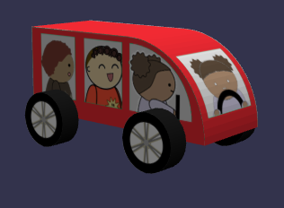
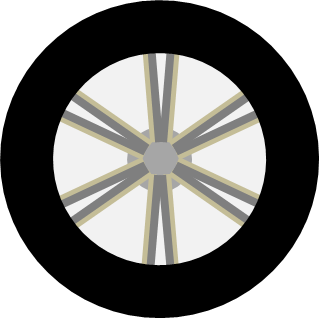
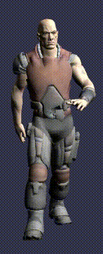
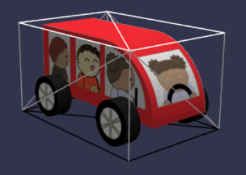

# babylon 官方入门教学(入门3-4)
## 第 3 章 - 乡村动画
### 网格父级
- 父级和子级

	我们将添加一辆穿过村庄的非常简单的汽车。

	无论多么简单的汽车都需要轮子，我们必须将车体和轮子结合起来。
	
	
	
	使用合并网格来组合它们会导致轮子无法旋转。相反，我们将车身设置为每个车轮的父级。

	在构建我们的简单汽车之前，让我们先了解一下设置父级的方法以及这意味着什么。
	
		meshChild.parent = meshParent
	
	- 对父级的位置、缩放和旋转的任何使用也将应用于子级。
	- 设置子级的位置在父级空间中完成，
	- 设置子级的旋转和缩放发生在子级的本地空间中。

	您可以在以下 Playground 中更改值以查看对父级和子级的影响
	
	- [父子级关系](https://playground.babylonjs.com/#GMEI6U)
			
			// 创建场景
			const createScene =  () => {
			    const scene = new BABYLON.Scene(engine);
			    
			    const camera = new BABYLON.ArcRotateCamera("camera", -Math.PI / 2.2, Math.PI / 2.5, 15, new BABYLON.Vector3(0, 0, 0));
			    camera.attachControl(canvas, true);
			
			    const light = new BABYLON.HemisphericLight("light", new BABYLON.Vector3(0, 1, 0));
			
			    // 创建颜色
			    const faceColors = [];
				faceColors[0] = BABYLON.Color3.Blue();
				faceColors[1] = BABYLON.Color3.Teal()
				faceColors[2] = BABYLON.Color3.Red();
				faceColors[3] = BABYLON.Color3.Purple();
				faceColors[4] = BABYLON.Color3.Green();
				faceColors[5] = BABYLON.Color3.Yellow();
			 
			 	// 创建父级盒子
			    	const boxParent = BABYLON.MeshBuilder.CreateBox("Box", {faceColors:faceColors});
			   	// 创建子级盒子
			   	const boxChild = BABYLON.MeshBuilder.CreateBox("Box", {size: 0.5, faceColors:faceColors});
			    
			    // 设置父子级关系
			    boxChild.setParent(boxParent);
			    
			    // 设置子级位置
			    boxChild.position.x = 0;
			    boxChild.position.y = 2;
			    boxChild.position.z = 0;
			
			    // 设置子级朝向
			    boxChild.rotation.x = Math.PI / 4;
			    boxChild.rotation.y = Math.PI / 4;
			    boxChild.rotation.z = Math.PI / 4;
			    
			    // 设置父级位置				
			    boxParent.position.x = 2;
			    boxParent.position.y = 0;
			    boxParent.position.z = 0;
			    
			    // 设置父级朝向
			    boxParent.rotation.x = 0;
			    boxParent.rotation.y = 0;
			    boxParent.rotation.z = -Math.PI / 4;
			    
			    
			    const boxChildAxes = localAxes(1, scene);
			    boxChildAxes.parent = boxChild; 
			    showAxis(6, scene);
			    return scene;
			}
			
			/***********创建并绘制坐标轴**************************************/
			const showAxis = (size, scene) => {
				const makeTextPlane = (text, color, size) => {
					const dynamicTexture = new BABYLON.DynamicTexture("DynamicTexture", 50, scene, true);
					dynamicTexture.hasAlpha = true;
					dynamicTexture.drawText(text, 5, 40, "bold 36px Arial", color , "transparent", true);
					const plane = new BABYLON.Mesh.CreatePlane("TextPlane", size, scene, true);
					plane.material = new BABYLON.StandardMaterial("TextPlaneMaterial", scene);
					plane.material.backFaceCulling = false;
					plane.material.specularColor = new BABYLON.Color3(0, 0, 0);
					plane.material.diffuseTexture = dynamicTexture;
					return plane;
			    };
			      
			      // 设置 x 坐标轴
				const axisX = BABYLON.Mesh.CreateLines("axisX", [ 
					new BABYLON.Vector3.Zero(), new BABYLON.Vector3(size, 0, 0), new BABYLON.Vector3(size * 0.95, 0.05 * size, 0), 
					new BABYLON.Vector3(size, 0, 0), new BABYLON.Vector3(size * 0.95, -0.05 * size, 0)
				]);
				// 设置 x 轴颜色
				axisX.color = new BABYLON.Color3(1, 0, 0);
				const xChar = makeTextPlane("X", "red", size / 10);
				xChar.position = new BABYLON.Vector3(0.9 * size, -0.05 * size, 0);
			
			    // 设置 y 轴坐标
			    const axisY = BABYLON.Mesh.CreateLines("axisY", [
			        new BABYLON.Vector3.Zero(), new BABYLON.Vector3(0, size, 0), new BABYLON.Vector3( -0.05 * size, size * 0.95, 0), 
			        new BABYLON.Vector3(0, size, 0), new BABYLON.Vector3( 0.05 * size, size * 0.95, 0)
			    ]);
			    // 设置 y 轴颜色
			    axisY.color = new BABYLON.Color3(0, 1, 0);
			    const yChar = makeTextPlane("Y", "green", size / 10);
			    yChar.position = new BABYLON.Vector3(0, 0.9 * size, -0.05 * size);
			    
			     // 设置 z 坐标轴
			    const axisZ = BABYLON.Mesh.CreateLines("axisZ", [
			        new BABYLON.Vector3.Zero(), new BABYLON.Vector3(0, 0, size), new BABYLON.Vector3( 0 , -0.05 * size, size * 0.95),
			        new BABYLON.Vector3(0, 0, size), new BABYLON.Vector3( 0, 0.05 * size, size * 0.95)
			    ]); 
			    // 设置 z 轴颜色
			    axisZ.color = new BABYLON.Color3(0, 0, 1);
			    const zChar = makeTextPlane("Z", "blue", size / 10);
			    zChar.position = new BABYLON.Vector3(0, 0.05 * size, 0.9 * size);
			};
			  
			/*********************************************************************/
			
			/*******************************局部的轴****************************/
			localAxes = (size, scene) => {
			
			     // 设置 x 坐标轴
			    const local_axisX = BABYLON.Mesh.CreateLines("local_axisX", [
			        new BABYLON.Vector3.Zero(), new BABYLON.Vector3(size, 0, 0), new BABYLON.Vector3(size * 0.95, 0.05 * size, 0),
			        new BABYLON.Vector3(size, 0, 0), new BABYLON.Vector3(size * 0.95, -0.05 * size, 0)
			    ], scene);
			     // 设置 x 轴颜色
			    local_axisX.color = new BABYLON.Color3(1, 0, 0);
			     
			     // 设置 y 坐标轴
			    local_axisY = BABYLON.Mesh.CreateLines("local_axisY", [
			        new BABYLON.Vector3.Zero(), new BABYLON.Vector3(0, size, 0), new BABYLON.Vector3(-0.05 * size, size * 0.95, 0),
			        new BABYLON.Vector3(0, size, 0), new BABYLON.Vector3(0.05 * size, size * 0.95, 0)
			    ], scene);
			     // 设置 x 轴颜色 
			    local_axisY.color = new BABYLON.Color3(0, 1, 0);
			
			    // 设置 z 坐标轴
			    const local_axisZ = BABYLON.Mesh.CreateLines("local_axisZ", [
			        new BABYLON.Vector3.Zero(), new BABYLON.Vector3(0, 0, size), new BABYLON.Vector3(0, -0.05 * size, size * 0.95),
			        new BABYLON.Vector3(0, 0, size), new BABYLON.Vector3(0, 0.05 * size, size * 0.95)
			    ], scene);
			    // 设置 z 轴颜色
			    local_axisZ.color = new BABYLON.Color3(0, 0, 1);
			
			   
			    const local_origin = new BABYLON.TransformNode("local_origin");
			
			    local_axisX.parent = local_origin;
			    local_axisY.parent = local_origin;
			    local_axisZ.parent = local_origin;
			
			    return local_origin;
			}
			/*******************************End Local Axes****************************/

### 挤出多边形
- 建造汽车

	这辆车将是一辆非常简单的车。身体将使用 `extrudePolygon` 方法构建。这是可以使用 `MeshBuilder` 构建的另一种形状。形状的轮廓在 XZ 平面中绘制，点按逆时针顺序排列，拉伸在 Y 方向。多边形的原点是底部平面上的零点。

	汽车的轮廓由一组 vector3 点组成，这些点形成一条水平基线，前部四分之一圆，然后是水平基线。垂直背面将由 `extrudePolygon` 方法形成，因为它会自动连接第一个点和最后一个点
	
		//基础车体
		const outline = [
		    new BABYLON.Vector3(-0.3, 0, -0.1),
		    new BABYLON.Vector3(0.2, 0, -0.1),
		]
		
		// 弯曲的车头
		for (let i = 0; i < 20; i++) {
		    outline.push(new BABYLON.Vector3(0.2 * Math.cos(i * Math.PI / 40), 0, 0.2 * Math.sin(i * Math.PI / 40) - 0.1));
		}
		
		// 车头
		outline.push(new BABYLON.Vector3(0, 0, 0.1));
		outline.push(new BABYLON.Vector3(-0.3, 0, 0.1));
	这些以及沿 Y 方向挤压的深度，为汽车提供了形状
	
		const car = BABYLON.MeshBuilder.ExtrudePolygon("car", {shape: outline, depth: 0.2});
	注意：`extrudePolygon` 和 [PolygonMeshBuilder](https://doc.babylonjs.com/divingDeeper/mesh/creation/param/polyMeshBuilder) 都使用  `earcut` 切片算法。

	Playground 已经定义了 `earcut`，但如果您在自己的文件系统上遵循本教程，则需要通过 [cdn](https://unpkg.com/earcut@latest/dist/earcut.min.js) 或 [npm](https://github.com/mapbox/earcut#install) 下载 `earcut` 算法。

	如果您使用的是 `TypeScript`，那么您可以将`earcut `算法作为 [extudePolygon](https://doc.babylonjs.com/typedoc/classes/babylon.meshbuilder#extrudepolygon) 函数的 `earcutInjection` 参数注入。
	
	- [制作车体代码](https://doc.babylonjs.com/typedoc/classes/babylon.meshbuilder#extrudepolygon)

			const createScene =  () => {
			    const scene = new BABYLON.Scene(engine);
			
			    const camera = new BABYLON.ArcRotateCamera("camera", -Math.PI / 2, Math.PI / 2.5, 3, new BABYLON.Vector3(0, 0, 0));
			    camera.attachControl(canvas, true);
			    const light = new BABYLON.HemisphericLight("light", new BABYLON.Vector3(0, 1, 0));
			    
			    //基础
			    const outline = [
			        new BABYLON.Vector3(-0.3, 0, -0.1),
			        new BABYLON.Vector3(0.2, 0, -0.1),
			    ]
			
			    //弯曲车头
			    for (let i = 0; i < 20; i++) {
			        outline.push(new BABYLON.Vector3(0.2 * Math.cos(i * Math.PI / 40), 0, 0.2 * Math.sin(i * Math.PI / 40) - 0.1));
			    }
			
			    //顶部
			    outline.push(new BABYLON.Vector3(0, 0, 0.1));
			    outline.push(new BABYLON.Vector3(-0.3, 0, 0.1));
			
			    //后自动形成
			
			    const car = BABYLON.MeshBuilder.ExtrudePolygon("car", {shape: outline, depth: 0.2});
			
			    return scene;
			}
	
		- 我们从一个圆柱体形成右后位置的轮子，并将它作为一个子级添加到汽车中。
		- 然后为右前轮、左后轮和左前轮制作副本。

			这次使用 `clone` 而不是 `createInstance`，因为我们可以克隆一个克隆。当我们克隆一个轮子时，它的父级将成为克隆的父级。
			
				// 创建车后右轮
				const wheelRB = BABYLON.MeshBuilder.CreateCylinder("wheelRB", {diameter: 0.125, height: 0.05})
				wheelRB.parent = car;
				wheelRB.position.z = -0.1;
				wheelRB.position.x = -0.2;
				wheelRB.position.y = 0.035;
				
				//复制右后轮为右前轮
				const wheelRF = wheelRB.clone("wheelRF");
				wheelRF.position.x = 0.1;
				
				// 复制右后轮为左后轮
				const wheelLB = wheelRB.clone("wheelLB");
				wheelLB.position.y = -0.2 - 0.035;
				
				// 复制右后轮为左前轮
				const wheelLF = wheelRF.clone("wheelLF");
				wheelLF.position.y = -0.2 - 0.035;
	- [制作车轮代码](https://playground.babylonjs.com/#KDPAQ9#11)
			
			//  创建场景函数
			const createScene =  () => {
			    const scene = new BABYLON.Scene(engine);
			
			    const camera = new BABYLON.ArcRotateCamera("camera", -Math.PI / 2, Math.PI / 2.5, 3, new BABYLON.Vector3(0, 0, 0));
			    camera.attachControl(canvas, true);
			    const light = new BABYLON.HemisphericLight("light", new BABYLON.Vector3(0, 1, 0));
			    
			    //调用构建车体
			    const car = buildCar();
			
			    // 构建车轮	
			    const wheelRB = BABYLON.MeshBuilder.CreateCylinder("wheelRB", {diameter: 0.125, height: 0.05})
			    // 设置父子关系
			    wheelRB.parent = car;
			    wheelRB.position.z = -0.1;
			    wheelRB.position.x = -0.2;
			    wheelRB.position.y = 0.035;
			
			    wheelRF = wheelRB.clone("wheelRF");
			    wheelRF.position.x = 0.1;
			
			    wheelLB = wheelRB.clone("wheelLB");
			    wheelLB.position.y = -0.2 - 0.035;
			
			    wheelLF = wheelRF.clone("wheelLF");
			    wheelLF.position.y = -0.2 - 0.035;
			
			    return scene;
			}
			
			// 构建车体
			const buildCar = () => {
			    
			    //基础车体
			    const outline = [
			        new BABYLON.Vector3(-0.3, 0, -0.1),
			        new BABYLON.Vector3(0.2, 0, -0.1),
			    ]
			
			    //车头
			    for (let i = 0; i < 20; i++) {
			        outline.push(new BABYLON.Vector3(0.2 * Math.cos(i * Math.PI / 40), 0, 0.2 * Math.sin(i * Math.PI / 40) - 0.1));
			    }
			
			    //车顶
			    outline.push(new BABYLON.Vector3(0, 0, 0.1));
			    outline.push(new BABYLON.Vector3(-0.3, 0, 0.1));
			
			    //后自动形成
			
			    const car = BABYLON.MeshBuilder.ExtrudePolygon("car", {shape: outline, depth: 0.2});
			    return car;
			}

#### 汽车材料
- 汽车材质

	就像我们在盒子的不同面上使用不同的图像一样，挤出的多边形和圆柱体也可以使用类似的图像。

	- 车身

			
		
		对于车身多边形
	
		- 面 0 是顶部
		- 面 2 是底部
	- 轮子

		
	
		对于轮子圆柱体
		
		- 面 0 是底部
		- 面 2 是顶部
		- 面 1 是连接底部和顶部的边

	请记住，目前车身及其车轮是平躺制造的

	车身的顶部和底部使用左上角（几乎）四分之一的图像。
	
	边缘部分穿过底部，绕过前面，穿过顶部和身体后部使用图像的下半部分。

	- 车身底部如您所料，由左下角坐标 (0, 0.5) 到右上角坐标 (0.38, 1) 给出；

			faceUV[0] = new BABYLON.Vector4(0, 0.5, 0.38, 1);
	- 车身顶部使用相同的图像，但需要翻转以适应汽车的另一侧。

			faceUV[2] = new BABYLON.Vector4(0.38, 1, 0, 0.5);
	- 边从 (0, 0) 到 (1, 0.5)

			faceUV[1] = new BABYLON.Vector4(0, 0, 1, 0.5);
	- [添加材质的车体](https://playground.babylonjs.com/#KDPAQ9#12)

			// 创建场景函数
			const createScene =  () => {
			    const scene = new BABYLON.Scene(engine);
			
			    const camera = new BABYLON.ArcRotateCamera("camera", -Math.PI / 2, Math.PI / 2.5, 3, new BABYLON.Vector3(0, 0, 0));
			    camera.attachControl(canvas, true);
			    const light = new BABYLON.HemisphericLight("light", new BABYLON.Vector3(0, 1, 0));
			    
			    //基础
			    const outline = [
			        new BABYLON.Vector3(-0.3, 0, -0.1),
			        new BABYLON.Vector3(0.2, 0, -0.1),
			    ]
			
			    //车头
			    for (let i = 0; i < 20; i++) {
			        outline.push(new BABYLON.Vector3(0.2 * Math.cos(i * Math.PI / 40), 0, 0.2 * Math.sin(i * Math.PI / 40) - 0.1));
			    }
			
			    //车顶
			    outline.push(new BABYLON.Vector3(0, 0, 0.1));
			    outline.push(new BABYLON.Vector3(-0.3, 0, 0.1));
			
			    //后自动形成
			
			    //UVs 面
			    const faceUV = [];
			    faceUV[0] = new BABYLON.Vector4(0, 0.5, 0.38, 1);
			    faceUV[1] = new BABYLON.Vector4(0, 0, 1, 0.5);
			    faceUV[2] = new BABYLON.Vector4(0.38, 1, 0, 0.5);
			
			    //材质
			    //材质命名
			    const carMat = new BABYLON.StandardMaterial("carMat");
			    //贴图文件设置
			    carMat.diffuseTexture = new BABYLON.Texture("https://assets.babylonjs.com/environments/car.png");
			    
			    // 材质合并
			    const car = BABYLON.MeshBuilder.ExtrudePolygon("car", {shape: outline, depth: 0.2, faceUV: faceUV, wrap: true});
			    car.material = carMat;
			
			    return scene;
			}
	
	轮子由于其对称性而更加笔直，它使用整个图像作为顶部和底部，并且只为边缘拾取一个黑色像素。
	
		wheelUV[0] = new BABYLON.Vector4(0, 0, 1, 1);
		wheelUV[1] = new BABYLON.Vector4(0, 0.5, 0, 0.5);
		wheelUV[2] = new BABYLON.Vector4(0, 0, 1, 1);
	
	
	
	将它们放在一起并将成品车直立旋转
	
	- [贴图后全车代码](https://playground.babylonjs.com/#KDPAQ9#13)

			// 创建场景
			const createScene =  () => {
			    const scene = new BABYLON.Scene(engine);
			
			    const camera = new BABYLON.ArcRotateCamera("camera", -Math.PI / 2, Math.PI / 2.5, 3, new BABYLON.Vector3(0, 0, 0));
			    camera.attachControl(canvas, true);
			    const light = new BABYLON.HemisphericLight("light", new BABYLON.Vector3(0, 1, 0));
			    
			    // 调用车模，并转动车体到正位
			    const car = buildCar();
			    car.rotation.x = -Math.PI / 2;
			
			    return scene;
			}
			
			// 创建车模函数
			const buildCar = () => {
			    
			    //基础
			    const outline = [
			        new BABYLON.Vector3(-0.3, 0, -0.1),
			        new BABYLON.Vector3(0.2, 0, -0.1),
			    ]
			
			    //车头设计
			    for (let i = 0; i < 20; i++) {
			        outline.push(new BABYLON.Vector3(0.2 * Math.cos(i * Math.PI / 40), 0, 0.2 * Math.sin(i * Math.PI / 40) - 0.1));
			    }
			
			    //车顶
			    outline.push(new BABYLON.Vector3(0, 0, 0.1));
			    outline.push(new BABYLON.Vector3(-0.3, 0, 0.1));
			
			    //后自动形成
			
			    //车体贴图位置设置
			    const faceUV = [];
			    faceUV[0] = new BABYLON.Vector4(0, 0.5, 0.38, 1);
			    faceUV[1] = new BABYLON.Vector4(0, 0, 1, 0.5);
			    faceUV[2] = new BABYLON.Vector4(0.38, 1, 0, 0.5);
			
			    //车体材质
			    const carMat = new BABYLON.StandardMaterial("carMat");
			    carMat.diffuseTexture = new BABYLON.Texture("https://assets.babylonjs.com/environments/car.png");
			
			    // 车体贴图	
			    const car = BABYLON.MeshBuilder.ExtrudePolygon("car", {shape: outline, depth: 0.2, faceUV: faceUV, wrap: true});
			    car.material = carMat;
			
			    // 车轮贴图面位置设置
			    const wheelUV = [];
			    wheelUV[0] = new BABYLON.Vector4(0, 0, 1, 1);
			    wheelUV[1] = new BABYLON.Vector4(0, 0.5, 0, 0.5);
			    wheelUV[2] = new BABYLON.Vector4(0, 0, 1, 1);
			    
			    //车轮材质
			    const wheelMat = new BABYLON.StandardMaterial("wheelMat");
			    wheelMat.diffuseTexture = new BABYLON.Texture("https://assets.babylonjs.com/environments/wheel.png");
			
			    // 设置右后轮
			    const wheelRB = BABYLON.MeshBuilder.CreateCylinder("wheelRB", {diameter: 0.125, height: 0.05, faceUV: wheelUV})
			    wheelRB.material = wheelMat;
			    wheelRB.parent = car;
			    wheelRB.position.z = -0.1;
			    wheelRB.position.x = -0.2;
			    wheelRB.position.y = 0.035;
			
			    // 克隆复制右后轮为右前轮
			    wheelRF = wheelRB.clone("wheelRF");
			    wheelRF.position.x = 0.1;
			   // 克隆左后轮
			    wheelLB = wheelRB.clone("wheelLB");
			    wheelLB.position.y = -0.2 - 0.035;
			    // 克隆左前轮
			    wheelLF = wheelRF.clone("wheelLF");
			    wheelLF.position.y = -0.2 - 0.035;
			
			    return car;
			} 

#### 车轮动画
- 动画基础

	我们将从一个轮子开始并围绕它的轴旋转它。请记住，为了使汽车保持直立，我们将其围绕 x 轴旋转，因此轴沿圆柱体的 y 轴。

	我们需要创建一个新的动画对象
	
		const animWheel = new BABYLON.Animation("wheelAnimation", "rotation.y", 30, BABYLON.Animation.ANIMATIONTYPE_FLOAT, BABYLON.Animation.ANIMATIONLOOPMODE_CYCLE);
	它具有参数 
	
	- 名称
	- 动画属性
	- 每秒动画帧数
	- 动画类型属性
	- 循环模式，在本例中为重复动画。

	我们使用关键帧数组来跟踪这一点，我们在其中设置属性的值以按帧号设置动画
	
		const wheelKeys = []; 
	
		// 在动画在第 0 帧，rotation.y  = 0
		wheelKeys.push({
		    frame: 0,
		    value: 0
		});
		
		//在动画第 30 帧，(动画 fps = 30，也就是1秒后)旋转的值。对于一个完整的 rotation.y=2
		wheelKeys.push({
		    frame: 30,
		    value: 2 * Math.PI
		});
	最后，我们将关键帧数组链接到动画，将动画链接到网格并开始它。
	
		//设置车轮动画 keys
		animWheel.setKeys(wheelKeys);
		
		// 将此动画链接到右后轮
		wheelRB.animations = [];
		wheelRB.animations.push(animWheel);
		
		// 开始动画-对象进行动画，第一帧，最后一帧，如果为真循环
		scene.beginAnimation(wheelRB, 0, 30, true);
	- [车轮动画代码](https://playground.babylonjs.com/#KDPAQ9#14)
			
			// 创建场景
			const createScene =  () => {
			    const scene = new BABYLON.Scene(engine);
			
			    const camera = new BABYLON.ArcRotateCamera("camera", -Math.PI / 2, Math.PI / 2.5, 1.5, new BABYLON.Vector3(0, 0, 0));
			    camera.attachControl(canvas, true);
			    const light = new BABYLON.HemisphericLight("light", new BABYLON.Vector3(0, 1, 0));
			    
			    //车轮 UVs 面设置
			    const wheelUV = [];
			    wheelUV[0] = new BABYLON.Vector4(0, 0, 1, 1);
			    wheelUV[1] = new BABYLON.Vector4(0, 0.5, 0, 0.5);
			    wheelUV[2] = new BABYLON.Vector4(0, 0, 1, 1);
			
			    // 车轮材质设置
			    const wheelMat = new BABYLON.StandardMaterial("wheelMat");
			    wheelMat.diffuseTexture = new BABYLON.Texture("https://assets.babylonjs.com/environments/wheel.png");
			
			    // 车轮材质赋予面设置
			    wheelRB = BABYLON.MeshBuilder.CreateCylinder("wheelRB", {diameter: 0.125, height: 0.05, faceUV: wheelUV})
			    wheelRB.material = wheelMat;;
			
			    //创建车轮动画
			    const animWheel = new BABYLON.Animation("wheelAnimation", "rotation.y", 30, BABYLON.Animation.ANIMATIONTYPE_FLOAT, BABYLON.Animation.ANIMATIONLOOPMODE_CYCLE);
			
			    // 设置变量数组
			    const wheelKeys = []; 
			
			    // 向数组插入开始帧动作，在动画在第 0 帧，rotation.y  = 0
			    wheelKeys.push({
			        frame: 0,
			        value: 0
			    });
			
			    //向数组插入结束帧动作，在动画第 30 帧，(动画 fps = 30，也就是1秒后)旋转的值。对于一个完整的 rotation.y=2
			    wheelKeys.push({
			        frame: 30,
			        value: 2 * Math.PI
			    });
			
			    //插入获取动画动作数组
			    animWheel.setKeys(wheelKeys);
			
			    //将此动画链接到一个轮子上
			    wheelRB.animations = [];
			    wheelRB.animations.push(animWheel);
			    // 开始动画
			    scene.beginAnimation(wheelRB, 0, 30, true);
			
			    return scene;
			}
			
	由于所有轮子都旋转相同，我们可以为所有轮子使用相同的动画。
	
		scene.beginAnimation(wheelRF, 0, 30, true);
		scene.beginAnimation(wheelLB, 0, 30, true);
		scene.beginAnimation(wheelLF, 0, 30, true);
	为了确保在以后的 Playgrounds 中新代码不会被大量先前的代码所淹没，我们将把汽车保存为模型并将其作为项目导入和动画。
	
	- [最终导入模型后，车子行驶的模型](https://playground.babylonjs.com/#KDPAQ9#15)
	
			// 创建场景
			const createScene = () => {
			    
			    const scene = new BABYLON.Scene(engine);
			
			    const camera = new BABYLON.ArcRotateCamera("camera", -Math.PI / 2, Math.PI / 2.5, 2, new BABYLON.Vector3(0, 0, 0));
			    camera.attachControl(canvas, true);
			    const light = new BABYLON.HemisphericLight("light", new BABYLON.Vector3(1, 1, 0));
			    
			    // 导入模型和动画，注意这里载入的是 car.babylon 所以车轮是动的，因为带入了动画数据
			    BABYLON.SceneLoader.ImportMeshAsync("", "https://assets.babylonjs.com/meshes/", "car.babylon").then(() =>  {
			      
			      // 创建 车轮模型
			      const wheelRB = scene.getMeshByName("wheelRB");
			      const wheelRF = scene.getMeshByName("wheelRF");
			      const wheelLB = scene.getMeshByName("wheelLB");
			      const wheelLF = scene.getMeshByName("wheelLF");
			      console.log(wheelRB.animations)
			      
			      // 赋予车轮动画
			      scene.beginAnimation(wheelRB, 0, 30, true);
			      scene.beginAnimation(wheelRF, 0, 30, true);
			      scene.beginAnimation(wheelLB, 0, 30, true);
			      scene.beginAnimation(wheelLF, 0, 30, true);
			    });
			
			    return scene;
			};

#### 汽车动画
- 为村里的汽车制作动画

	与我们动画车轮的方式类似，我们现在动画汽车以直线行驶超过 5 秒，停止 2 秒。然后重复。
		
		// 设置汽车动画
		const animCar = new BABYLON.Animation("carAnimation", "position.x", 30, BABYLON.Animation.ANIMATIONTYPE_FLOAT, BABYLON.Animation.ANIMATIONLOOPMODE_CYCLE);
		
		// 设置播放动画帧数着
		const carKeys = []; 
		
		// 设置 0 帧
		carKeys.push({
		    frame: 0,
		    value: -4
		});
		
		// 设置 150 帧，每秒 30 帧就是5秒
		carKeys.push({
		    frame: 150,
		    value: 4
		});
		
		// 设置 210 帧，减去前面的 150 帧就是 60 帧，正好是2秒
		carKeys.push({
		    frame: 210,
		    value: 4
		});
		
		// 设置播放动作到动画
		animCar.setKeys(carKeys);
		
		// 设置动画
		car.animations = [];
		car.animations.push(animCar);
		
		// 开始动画
		scene.beginAnimation(car, 0, 210, true);
	- [汽车前进简单动画](https://playground.babylonjs.com/#KDPAQ9#16)
	
			// 设置场景
			const createScene = () => {
			    
			    const scene = new BABYLON.Scene(engine);
			
			    const camera = new BABYLON.ArcRotateCamera("camera", -Math.PI / 2, Math.PI / 2.5, 2, new BABYLON.Vector3(0, 0, 0));
			    camera.attachControl(canvas, true);
			    const light = new BABYLON.HemisphericLight("light", new BABYLON.Vector3(1, 1, 0));
			
			    // 载入汽车模型
			    BABYLON.SceneLoader.ImportMeshAsync("", "https://assets.babylonjs.com/meshes/", "car.babylon").then(() =>  {
			      //创建汽车模型
			      const car = scene.getMeshByName("car");
			      // 创建汽车动画
			      const animCar = new BABYLON.Animation("carAnimation", "position.x", 30, BABYLON.Animation.ANIMATIONTYPE_FLOAT, BABYLON.Animation.ANIMATIONLOOPMODE_CYCLE);
			
			      // 动画帧动作数组
			      const carKeys = []; 
			
			      // 0 帧动作
			      carKeys.push({
			        frame: 0,
			        value: -4
			      });
			
			      // 150 帧动作
			      carKeys.push({
			        frame: 150,
			        value: 4
			      });
			      
			      //动作数组插入动画
			      animCar.setKeys(carKeys);
			
			      //汽车动画数组
			      car.animations = [];
			      // 插入
			      car.animations.push(animCar);
			      // 动画开始
			      scene.beginAnimation(car, 0, 150, true);
			      
			      //车轮动画
			      const wheelRB = scene.getMeshByName("wheelRB");
			      const wheelRF = scene.getMeshByName("wheelRF");
			      const wheelLB = scene.getMeshByName("wheelLB");
			      const wheelLF = scene.getMeshByName("wheelLF");
			      
			      scene.beginAnimation(wheelRB, 0, 30, true);
			      scene.beginAnimation(wheelRF, 0, 30, true);
			      scene.beginAnimation(wheelLB, 0, 30, true);
			      scene.beginAnimation(wheelLF, 0, 30, true);
			    });
			
			    return scene;
			};
	调整了汽车的位置和路线后，它会经过我们拥有的村屋
	
	- [汽车添加到村庄](https://playground.babylonjs.com/#KDPAQ9#17) -- 官方 demo 版本有问题，但修改后依然无法恢复轮胎旋转待处理

			// 创建场景
			const createScene = function () {
			    
			    const scene = new BABYLON.Scene(engine);
			
			    const camera = new BABYLON.ArcRotateCamera("camera", -Math.PI / 2, Math.PI / 2.5, 15, new BABYLON.Vector3(0, 0, 0));
			    camera.attachControl(canvas, true);
			    const light = new BABYLON.HemisphericLight("light", new BABYLON.Vector3(1, 1, 0)); 
			
			    // 载入村庄模型
			    BABYLON.SceneLoader.ImportMeshAsync("", "https://assets.babylonjs.com/meshes/", "village.glb");
			    // 载入汽车模型
			    BABYLON.SceneLoader.ImportMeshAsync("", "https://assets.babylonjs.com/meshes/", "car.glb").then(() => {
			        // 设置 maesh 明为 car 的模型为 car
			        const car = scene.getMeshByName("car");
			        // 旋转车身
			        car.rotation = new BABYLON.Vector3(Math.PI / 2, 0, -Math.PI / 2);
			        // 设置位置
			        car.position.y = 0.16;
			        car.position.x = -3;
			        car.position.z = 8;
				  
				  // 创建动画
			        const animCar = new BABYLON.Animation("carAnimation", "position.z", 30, BABYLON.Animation.ANIMATIONTYPE_FLOAT, BABYLON.Animation.ANIMATIONLOOPMODE_CYCLE);
			
			        // 设置动画动作数组
			        const carKeys = []; 
			        // 插入0 帧动作
			        carKeys.push({
			            frame: 0,
			            value: 8
			        });
				  // 插入150 帧动作
			        carKeys.push({
			            frame: 150,
			            value: -7
			        });
			        // 插入200 帧动作
			        carKeys.push({
			            frame: 200,
			            value: -7
			        });
			        
			        // 动作插入动画
			        animCar.setKeys(carKeys);
			 
			 	  // 设置车子动画
			        car.animations = [];
			        car.animations.push(animCar);
			        // 播放车子动画
			        scene.beginAnimation(car, 0, 200, true);
			      
			      
			        //// 设置车轮动画
			        //获取模型 mesh 名为车轮
			        const wheelRB = scene.getMeshByName("wheelRB");
			        const wheelRF = scene.getMeshByName("wheelRF");
			        const wheelLB = scene.getMeshByName("wheelLB");
			        const wheelLF = scene.getMeshByName("wheelLF");
			        
			        //创建车轮动画
			        const animWheel = new BABYLON.Animation("wheelAnimation", "rotation.y", 30, BABYLON.Animation.ANIMATIONTYPE_FLOAT, BABYLON.Animation.ANIMATIONLOOPMODE_CYCLE);
			        
			        // 设置变量数组
				  const wheelKeys = []; 
				
				  // 向数组插入开始帧动作，在动画在第 0 帧，rotation.y  = 0
				  wheelKeys.push({
				      frame: 0,
				      value: 0
				  });
				
				  //向数组插入结束帧动作，在动画第 30 帧，(动画 fps = 30，也就是1秒后)旋转的值。对于一个完整的 rotation.y=2
				  wheelKeys.push({
				      frame: 30,
				      value: 2 * Math.PI
				  });
				
				  //插入获取动画动作数组
				  animWheel.setKeys(wheelKeys);

				  //将此动画链接到四个轮子上
				  wheelRB.animations = [];
				  wheelRB.animations.push(animWheel);
				  
				  wheelRF.animations = [];
				  wheelRF.animations.push(animWheel);
				  
				  wheelLB.animations = [];
				  wheelLB.animations.push(animWheel);
				  
				  wheelLF.animations = [];
				  wheelLF.animations.push(animWheel);
			        
			        // 设置车轮动画
			        scene.beginAnimation(wheelRB, 0, 30, true);
			        scene.beginAnimation(wheelRF, 0, 30, true);
			        scene.beginAnimation(wheelLB, 0, 30, true);
			        scene.beginAnimation(wheelLF, 0, 30, true);
			    });
			
			    return scene;
			};
			
#### 角色动画
- 行走的身影

	有时，将模型添加到场景中的最简单方法是从其他地方获取模型。这可能是您在最喜欢的模型构建软件中创建的，也可能是您购买的。

	Dude 模型是使用自己的骨架动画构建的模型
	
	
	导入后，角色及其骨架将从结果对象的网格和骨架属性中获得。
	
		// 导入模型
		BABYLON.SceneLoader.ImportMeshAsync("mesh name", "path to model", "model file", scene).then((result) => {
		    var dude = result.meshes[0];
		    dude.scaling = new BABYLON.Vector3(0.25, 0.25, 0.25);
		                
		    scene.beginAnimation(result.skeletons[0], 0, 100, true, 1.0);
		});						
	- [加载角色骨架](https://playground.babylonjs.com/#SFW46K#1)

			// 创建场景
			const createScene = function () {
			    const scene = new BABYLON.Scene(engine);
			
			    const camera = new BABYLON.ArcRotateCamera("camera", -Math.PI / 2, Math.PI / 2.5, 50, new BABYLON.Vector3(0, 0, 0));
			    camera.attachControl(canvas, true);
			    const light = new BABYLON.HemisphericLight("light", new BABYLON.Vector3(1, 1, 0));
			
			    // 加载骨架模型
			    BABYLON.SceneLoader.ImportMeshAsync("him", "/scenes/Dude/", "Dude.babylon", scene).then((result) => {
			        var dude = result.meshes[0];
			        dude.scaling = new BABYLON.Vector3(0.25, 0.25, 0.25);
			        // 播放动画        
			        scene.beginAnimation(result.skeletons[0], 0, 100, true, 1.0);
			    });
			
			    return scene;
			
			};
	目前这个角色被设置在一个位置，我们希望他在村子里走来走去。这次我们不会为角色创建另一个动画对象，而是在渲染每一帧之前更改其位置和方向。

####  在村子里走走
- 在村子里走走

	网格有一个有用的属性 `movePOV`，它允许我们相对于其视点移动网格。通常，新创建的网格将被视为面向负 z 方向，这是其视点的方向。要将网格沿其视点方向向前移动 6 个单位，请使用

		mesh.movePOV(0, 0, 6)
	参数依次是向右、向上和向前移动的距离，通常是网格局部空间中的负 x 轴、正 y 轴和负 z 轴。

	在 Babylon.js 中，您可以编写将在渲染下一帧之前执行的代码，使用
	
		scene.onBeforeRenderObservable.add(() => {
		    //执行代码
		});
	通过这种方式，对象的属性可以逐个渲染帧改变。

	让我们以球体围绕三角形边缘移动的简单情况为例。我们希望
	
	- 球体看起来沿着一侧滑动
	- 转动以沿着下一侧滑动
	- 然后转动并沿着最后一侧滑动
	- 然后重复。

	这也是一个介绍您可以创建的两种类型的网格的机会
	
	- 一个球体
	- 和一系列线

	以球体绕等腰直角三角形滑动为例。	

		//创建球体
		const sphere = BABYLON.MeshBuilder.CreateSphere("sphere", {diameter: 0.25});
		
		//数组中行序列的结束点 
		//Y分量可以是非零的
		const points = [];
		points.push(new BABYLON.Vector3(2, 0, 2));
		points.push(new BABYLON.Vector3(2, 0, -2));
		points.push(new BABYLON.Vector3(-2, 0, -2));
		
		//关闭三角形;
		points.push(points[0]); 
		
		//创建线
		BABYLON.MeshBuilder.CreateLines("triangle", {points: points})
	您还可以看到另一种旋转方法 rotate。此方法将网格围绕给定轴旋转给定的弧度角。它添加到当前旋转
	
		mesh.rotate(axis, angle, BABYLON.Space.LOCAL);
	为了在每个渲染帧之前生成动画，球体将移动 0.05 的距离。当它行进的距离大于 4 时，球体会转弯，大于 8 时会再次转弯，当大于周长时，它将重置并重新开始。

	我们使用属性 `turn` 和 `distance` 设置了一个跟踪对象数组。在行进给定的总距离后，球体将旋转给定的转角值。
	
		const slide = function (turn, dist) { //覆盖区域后敷转
		    this.turn = turn;
		    this.dist = dist;
		}
		// 创建跟踪数组
		const track = [];
		track.push(new slide(Math.PI / 2, 4));  //首边长4
		track.push(new slide(3 * Math.PI / 4, 8)); //第二边结束时的距离为4 + 4
		track.push(new slide(3 * Math.PI / 4, 8 + 4 * Math.sqrt(2))); //所有三条边的距离为4 + 4 + 4 * sqrt(2)
	每当达到所需的距离时，就会转一圈，并将数组索引指针 p 增加 1。模运算符%用于在数组末尾将指针重置为零。
	
		if (distance > track[p].dist) {        
		    sphere.rotate(BABYLON.Axis.Y, track[p].turn, BABYLON.Space.LOCAL);
		    p +=1;
		    p %= track.length;
		}
	为了防止浮点错误累积，每当索引指针重置为 0 时，球体的位置和旋转也会被重置
	
		if (p === 0) {
		    distance = 0;
		    sphere.position = new BABYLON.Vector3(2, 0, 2); //重置为初始条件
		    sphere.rotation = BABYLON.Vector3.Zero();//防止误差积累
		}
	
	- [动画路径](https://playground.babylonjs.com/#N9IZ8M#1)

			// 创建场景函数
			const createScene = function () {
			    
			    const scene = new BABYLON.Scene(engine);
			
			    const camera = new BABYLON.ArcRotateCamera("camera", -Math.PI / 1.5, Math.PI / 5, 15, new BABYLON.Vector3(0, 0, 0));
			    camera.attachControl(canvas, true);
			    const light = new BABYLON.HemisphericLight("light", new BABYLON.Vector3(1, 1, 0));
			    
			    //创建一个球
			    const sphere = BABYLON.MeshBuilder.CreateSphere("sphere", {diameter: 0.25});
			    sphere.position = new BABYLON.Vector3(2, 0, 2);
			
			    // 画线形成一个三角形
			    const points = [];
			    points.push(new BABYLON.Vector3(2, 0, 2));
			    points.push(new BABYLON.Vector3(2, 0, -2));
			    points.push(new BABYLON.Vector3(-2, 0, -2));
			    points.push(points[0]); //close the triangle;
			
			    // 创建三角形
			    BABYLON.MeshBuilder.CreateLines("triangle", {points: points})
			
			    // 覆盖区域后敷转
			    const slide = function (turn, dist) { 
			        this.turn = turn;
			        this.dist = dist;
			    }
			    
			    // 跟踪数组
			    const track = [];
			    track.push(new slide(Math.PI / 2, 4));
			    track.push(new slide(3 * Math.PI / 4, 8));
			    track.push(new slide(3 * Math.PI / 4, 8 + 4 * Math.sqrt(2)));
			
			    let distance = 0;
			    let step = 0.05;
			    let p = 0;
			
			    scene.onBeforeRenderObservable.add(() => {
					sphere.movePOV(0, 0, step);
			        distance += step;
			              
			        if (distance > track[p].dist) {        
			            sphere.rotate(BABYLON.Axis.Y, track[p].turn, BABYLON.Space.LOCAL);
			            p +=1;
			            p %= track.length;
			            if (p === 0) {
			                distance = 0;
			                //重置初始条件
			                sphere.position = new BABYLON.Vector3(2, 0, 2); 
			                / /防止误差积累
			                sphere.rotation = BABYLON.Vector3.Zero();
			            }
			        }
			    });
			    
			    return scene;
			};
	稍微复杂一点，并在转弯和距离上使用一些反复试验，我们可以为村庄周围的角色实现更复杂的步行。使用度数并将其转换为旋转方法的弧度的一个原因是，通过增加一或两个度数更容易进行调整。

	由于从 `.babylon` 文件导入的角色 `dude` 已使用 `rotationQuaternion` 而不是旋转来设置其旋转，因此我们使用 `rotate` 方法来重置角色方向。
	
		dude.position = new BABYLON.Vector3(-6, 0, 0);
		dude.rotate(BABYLON.Axis.Y, BABYLON.Tools.ToRadians(-95), BABYLON.Space.LOCAL);
		// 使用 clone，使变量是独立的，而不是链接副本
		const startRotation = dude.rotationQuaternion.clone(); 
		
		if (p === 0) {
		    distance = 0;
		    dude.position = new BABYLON.Vector3(-6, 0, 0);
		    dude.rotationQuaternion = startRotation.clone();
		}
	
	- [步行小镇](https://playground.babylonjs.com/#KBS9I5#81)

			// 创建场景函数
			const createScene = function () {
			    
			    const scene = new BABYLON.Scene(engine);
			
			    const camera = new BABYLON.ArcRotateCamera("camera", -Math.PI / 1.5, Math.PI / 2.2, 15, new BABYLON.Vector3(0, 0, 0));
			    camera.attachControl(canvas, true);
			    const light = new BABYLON.HemisphericLight("light", new BABYLON.Vector3(1, 1, 0));
			    
			    // 加载小镇
			    BABYLON.SceneLoader.ImportMeshAsync("", "https://assets.babylonjs.com/meshes/", "village.glb");
			    
			    // 创建行走函数
			    const walk = function (turn, dist) {
			        this.turn = turn;
			        this.dist = dist;
			    }
			    
			    //创建跟踪数组
			    const track = [];
			    track.push(new walk(86, 7));
			    track.push(new walk(-85, 14.8));
			    track.push(new walk(-93, 16.5));
			    track.push(new walk(48, 25.5));
			    track.push(new walk(-112, 30.5));
			    track.push(new walk(-72, 33.2));
			    track.push(new walk(42, 37.5));
			    track.push(new walk(-98, 45.2));
			    track.push(new walk(0, 47))
			
			    // Dude 人模型加载
			    BABYLON.SceneLoader.ImportMeshAsync("him", "/scenes/Dude/", "Dude.babylon", scene).then((result) => {
			        var dude = result.meshes[0];
			        
			        // 创建大小
			        dude.scaling = new BABYLON.Vector3(0.008, 0.008, 0.008);
			        
			        // 创建坐标   
			        dude.position = new BABYLON.Vector3(-6, 0, 0);
			        // 创建朝向
			        dude.rotate(BABYLON.Axis.Y, BABYLON.Tools.ToRadians(-95), BABYLON.Space.LOCAL);
			        // 行进方向
			        const startRotation = dude.rotationQuaternion.clone();    
			       
			        // 动画播放    
			        scene.beginAnimation(result.skeletons[0], 0, 100, true, 1.0);
			
			        let distance = 0;
			        let step = 0.015;
			        let p = 0;
			
			        scene.onBeforeRenderObservable.add(() => {
					    dude.movePOV(0, 0, step);
			            distance += step;
			              
			            if (distance > track[p].dist) {
			                    
			                dude.rotate(BABYLON.Axis.Y, BABYLON.Tools.ToRadians(track[p].turn), BABYLON.Space.LOCAL);
			                p +=1;
			                p %= track.length; 
			                if (p === 0) {
			                    distance = 0;
			                    dude.position = new BABYLON.Vector3(-6, 0, 0);
			                    dude.rotationQuaternion = startRotation.clone();
			                }
			            }
						
			        })
			    });
			    
			    return scene;
			};

## 第 4 章 - 避免碰撞
### 路上的颠簸
或者更确切地说是一种避免的方式。这次只是一个快速的步骤。我们的角色在村子里晃来晃去，我们希望他避免被路过的汽车撞到。我们设置了一个危险区域，当汽车进入危险区域时，让角色停下来。除非他当然已经在危险区域，在这种情况下，他最好继续前进。
### 避免车祸
查看两个网格是否接触的最简单方法是使用 `intersectsMesh` 方法，如

	mesh1.intersectMesh(mesh2);
如果框边界网格 1 与框边界网格 2 重叠，这将是正确的。每个网格都有一个内置的边界框，它靠近网格的表面，用于检查网格的交叉点。

- dude

	
- car

	

由于角色的步行和汽车的旅程不是同时进行的，因此它们有时会在同一个地方。然而，无法预测角色在村子里长途跋涉，而汽车在短途旅行中可能会相交。为了演示 `intersectsMesh` 方法，我们将让角色在汽车的停止位置前后行走。

在我们的例子中，如果汽车处于“命中”区域而角色不在，我们希望角色停止移动。毕竟，如果他们都在危险区域，角色停下来是很危险的。在我们的例子中，由于Dude 的构造方式，我们需要使用它的一个孩子来检查交叉点。基本上， Dude 只是头部、躯干、腿和手臂的一个保持器节点，并且在这种情况下它的边界太小而无法有效。

- [基本碰撞检测](https://playground.babylonjs.com/#KBS9I5#83)

			// 创建场景
			const createScene = function () {
			    
			    const scene = new BABYLON.Scene(engine);
			
			    const camera = new BABYLON.ArcRotateCamera("camera", -Math.PI / 2.2, Math.PI / 2.2, 15, new BABYLON.Vector3(0, 0, 0));
			    camera.attachControl(canvas, true);
			    const light = new BABYLON.HemisphericLight("light", new BABYLON.Vector3(1, 1, 0));
			    
			    // 创建碰撞盒子材质
			    const wireMat = new BABYLON.StandardMaterial("wireMat");
			    wireMat.wireframe = true;
			
			    // 创建碰撞盒子
			    const hitBox = BABYLON.MeshBuilder.CreateBox("carbox", {width: 0.5, height: 0.6, depth: 4.5});
			    hitBox.material = wireMat;
			    hitBox.position.x = 3.1;
			    hitBox.position.y = 0.3;
			    hitBox.position.z = -5;
			
			    let carReady = false;
			    
			    // 加载汽车模型
			    BABYLON.SceneLoader.ImportMeshAsync("", "https://assets.babylonjs.com/meshes/", "car.glb").then(() => {
			        const car = scene.getMeshByName("car");    
			        carReady = true;
			        car.rotation = new BABYLON.Vector3(Math.PI / 2, 0, -Math.PI / 2);
			        car.position.y = 0.16;
			        car.position.x = -3;
			        car.position.z = 8;
			
			        // 设置汽车动画
			        const animCar = new BABYLON.Animation("carAnimation", "position.z", 30, BABYLON.Animation.ANIMATIONTYPE_FLOAT, BABYLON.Animation.ANIMATIONLOOPMODE_CYCLE);
			
				  // 设置汽车动画动作
			        const carKeys = []; 
			
			        carKeys.push({
			            frame: 0,
			            value: 8
			        });
			
			
			        carKeys.push({
			            frame: 150,
			            value: -7
			        });
			
			        carKeys.push({
			            frame: 200,
			            value: -7
			        });
			        // 加载动作到动画
			        animCar.setKeys(carKeys);
			        // 绑定动作到模型
			        car.animations = [];
			        car.animations.push(animCar);
			        // 汽车动画播放
			        scene.beginAnimation(car, 0, 200, true);
			      
			        //车轮对象模型读取
			        const wheelRB = scene.getMeshByName("wheelRB");
			        const wheelRF = scene.getMeshByName("wheelRF");
			        const wheelLB = scene.getMeshByName("wheelLB");
			        const wheelLF = scene.getMeshByName("wheelLF");
			      
			        // 车轮对象动画播放
			        scene.beginAnimation(wheelRB, 0, 30, true);
			        scene.beginAnimation(wheelRF, 0, 30, true);
			        scene.beginAnimation(wheelLB, 0, 30, true);
			        scene.beginAnimation(wheelLF, 0, 30, true);
			    });
			    
			    // 加载小镇模型
			    BABYLON.SceneLoader.ImportMeshAsync("", "https://assets.babylonjs.com/meshes/", "village.glb");
			    
			    // 设置行走函数
			    const walk = function (turn, dist) {
			        this.turn = turn;
			        this.dist = dist;
			    }
			    
			    // 设置跟踪数组
			    const track = [];
			    track.push(new walk(180, 2.5));
			    track.push(new walk(0, 5));
			
			    // 加载人物模型
			    BABYLON.SceneLoader.ImportMeshAsync("him", "/scenes/Dude/", "Dude.babylon", scene).then((result) => {
			        var dude = result.meshes[0];
			        // 设置人物大小
			        dude.scaling = new BABYLON.Vector3(0.008, 0.008, 0.008);
			        
			        // 设置人物出生位置   
			        dude.position = new BABYLON.Vector3(1.5, 0, -6.9);
			        
			        // 设置人物朝向
			        dude.rotate(BABYLON.Axis.Y, BABYLON.Tools.ToRadians(-90), BABYLON.Space.LOCAL);
			        // 设置人物行进方向
			        const startRotation = dude.rotationQuaternion.clone();    
			        // 开始动画    
			        scene.beginAnimation(result.skeletons[0], 0, 100, true, 1.0);
			
			        let distance = 0;
			        let step = 0.015;
			        let p = 0;
			
			        // 设置碰撞？
			        scene.onBeforeRenderObservable.add(() => {
			            if (carReady) {
			                if (!dude.getChildren()[1].intersectsMesh(hitBox) && scene.getMeshByName("car").intersectsMesh(hitBox)) {
			                    return;
			                }
			                
			            }
			            // 人物行进停止
					dude.movePOV(0, 0, step);
			            distance += step;
			              
			            if (distance > track[p].dist) {
			                    
			                dude.rotate(BABYLON.Axis.Y, BABYLON.Tools.ToRadians(track[p].turn), BABYLON.Space.LOCAL);
			                p +=1;
			                p %= track.length; 
			                if (p === 0) {
			                    distance = 0;
			                    dude.position = new BABYLON.Vector3(1.5, 0, -6.9);
			                    dude.rotationQuaternion = startRotation.clone();
			                }
			            }
						
			        })
			    });
			    
			    return scene;
			};
- [基本隐藏碰撞框](https://playground.babylonjs.com/#KBS9I5#84)
			
			// 创建场景函数
			const createScene = function () {
			    
			    const scene = new BABYLON.Scene(engine);
			
			    const camera = new BABYLON.ArcRotateCamera("camera", -Math.PI / 2.2, Math.PI / 2.2, 15, new BABYLON.Vector3(0, 0, 0));
			    camera.attachControl(canvas, true);
			    const light = new BABYLON.HemisphericLight("light", new BABYLON.Vector3(1, 1, 0));
			
			    // 创建碰撞材质
			    const wireMat = new BABYLON.StandardMaterial("wireMat");
			    // 隐藏设置,注意这个方法暂时没有办法替换 glb 已有模型的材质
			    wireMat.alpha = 0;
			
			    // 创建碰撞盒子
			    const hitBox = BABYLON.MeshBuilder.CreateBox("carbox", {width: 0.5, height: 0.6, depth: 4.5});
			    hitBox.material = wireMat;
			    hitBox.position.x = 3.1;
			    hitBox.position.y = 0.3;
			    hitBox.position.z = -5;
			
			    let carReady = false;
			    
			    // 加载汽车模型
			    BABYLON.SceneLoader.ImportMeshAsync("", "https://assets.babylonjs.com/meshes/", "car.glb").then(() => {
			        const car = scene.getMeshByName("car");    
			        carReady = true;
			        car.rotation = new BABYLON.Vector3(Math.PI / 2, 0, -Math.PI / 2);
			        car.position.y = 0.16;
			        car.position.x = -3;
			        car.position.z = 8;
			   
			        // 汽车动画
			        const animCar = new BABYLON.Animation("carAnimation", "position.z", 30, BABYLON.Animation.ANIMATIONTYPE_FLOAT, BABYLON.Animation.ANIMATIONLOOPMODE_CYCLE);
			
			        const carKeys = []; 
			
			        carKeys.push({
			            frame: 0,
			            value: 8
			        });
			
			
			        carKeys.push({
			            frame: 150,
			            value: -7
			        });
			
			        carKeys.push({
			            frame: 200,
			            value: -7
			        });
			
			        animCar.setKeys(carKeys);
			
			        car.animations = [];
			        car.animations.push(animCar);
			
			        scene.beginAnimation(car, 0, 200, true);
			      
			        //车轮动画
			        const wheelRB = scene.getMeshByName("wheelRB");
			        const wheelRF = scene.getMeshByName("wheelRF");
			        const wheelLB = scene.getMeshByName("wheelLB");
			        const wheelLF = scene.getMeshByName("wheelLF");
			      
			        scene.beginAnimation(wheelRB, 0, 30, true);
			        scene.beginAnimation(wheelRF, 0, 30, true);
			        scene.beginAnimation(wheelLB, 0, 30, true);
			        scene.beginAnimation(wheelLF, 0, 30, true);
			    });
			    
			    // 加载小镇模型
			    BABYLON.SceneLoader.ImportMeshAsync("", "https://assets.babylonjs.com/meshes/", "village.glb");
			    
			    const walk = function (turn, dist) {
			        this.turn = turn;
			        this.dist = dist;
			    }
			    
			    const track = [];
			    track.push(new walk(180, 2.5));
			    track.push(new walk(0, 5));
			
			    // 加载 Dude 模型
			    BABYLON.SceneLoader.ImportMeshAsync("him", "/scenes/Dude/", "Dude.babylon", scene).then((result) => {
			        var dude = result.meshes[0];
			        dude.scaling = new BABYLON.Vector3(0.008, 0.008, 0.008);
			        
			            
			        dude.position = new BABYLON.Vector3(1.5, 0, -6.9);
			        dude.rotate(BABYLON.Axis.Y, BABYLON.Tools.ToRadians(-90), BABYLON.Space.LOCAL);
			        const startRotation = dude.rotationQuaternion.clone();    
			            
			        scene.beginAnimation(result.skeletons[0], 0, 100, true, 1.0);
			
			        let distance = 0;
			        let step = 0.015;
			        let p = 0;
			
			        scene.onBeforeRenderObservable.add(() => {
			            if (carReady) {
			                if (!dude.getChildren()[1].intersectsMesh(hitBox) && scene.getMeshByName("car").intersectsMesh(hitBox)) {
			                    return;
			                }
			                
			            }
					    dude.movePOV(0, 0, step);
			            distance += step;
			              
			            if (distance > track[p].dist) {
			                    
			                dude.rotate(BABYLON.Axis.Y, BABYLON.Tools.ToRadians(track[p].turn), BABYLON.Space.LOCAL);
			                p +=1;
			                p %= track.length; 
			                if (p === 0) {
			                    distance = 0;
			                    dude.position = new BABYLON.Vector3(1.5, 0, -6.9);
			                    dude.rotationQuaternion = startRotation.clone();
			                }
			            }
						
			        })
			    });
			    
			    return scene;
			};	

	

			
				
	

		

	

	
					
			