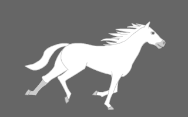

# babylon 官方深度教学-动画-动画简介
## 动画
动画是使您的游戏或应用程序栩栩如生的原因。在 BABYLON.js 中有两种主要的动画制作方法。您可以在渲染周期中更改场景中对象的属性。我们将在描述 Animation 方法后看一下。
## 动画导论
然而，动画的实现必须考虑所需的动作、时间、产生所需流动性所需的帧数和序列中的关键点。为了帮助理解 Babylon.js 是如何处理动画的，动画是如何实现的。

动画是由一系列图像、帧产生的，它们一个接一个地显示。该帧序列可以是单独的图纸，也可以是定格动画，逐帧轻微移动的模型照片

在设计阶段，创作者需要考虑一个序列应该花费多长时间以及它需要有多平滑。运动越流畅，需要的帧数就越多。一旦知道帧数，就可以找到每秒的动画帧数。还知道对象的开始位置和结束位置以及需要多少帧将确定对象每帧的移动。

在 Babylon.js 中，与定格动画一样，必须逐个移动单个对象。虽然我们可以在 Babylon.js 中将整个成品作为动画来讨论，但 Animation 也是一个特定对象，它详细说明了转换、计时和循环，然后可以将其应用于任何网格、相机或灯光。在此数据中添加了关键帧处的值，Babylon.js 从中计算要在帧之间发生的转换。
## 动画文档中使用的术语
以下术语在关于动画的 How_To 中具有给定的含义。

- Performer(表演者) - 是可以动画的项目，例如可以是网格、灯光或相机。
- Frame(帧) - 动画帧而不是场景的渲染帧。
- Animation(动画) - 类似于戏剧或电影剧本，但仅适用于表演者的一个属性。它包括
	- 要更改的属性，例如位置、强度或旋转
	- 以每秒帧数为单位的属性变化率，
	- 正在更改的属性的类型，例如向量、浮点数或矩阵，
	- 循环条件，
	- 关键帧处属性的关键值。
- Scripted Performer(脚本表演者) - 表演者加上表演者要执行的所有动画。
- Performance(表演) - 脚本执行者和执行者按照脚本执行的操作。在 Babylon.js 中，这是动画对象。
- Clip(剪辑) - 表演的可见结果。在实践中，有两种类型的剪辑： 
	- 游戏剪辑

		在游戏剪辑中，用户可以根据场景中使用的相机类型来移动相机。除非它可能会引起任何混淆，否则在编写动画时将在整个文档中使用术语剪辑。
	- 电影剪辑。
	
		在影片剪辑中，用户无法控制摄像机，并且根据剪辑创建者设置的摄像机动画观看剪辑。
- Cartoon(卡通)-以定时间隔播放的一系列剪辑。