# babylon官方手册-引导学习-开发故事1-从 Playground 到生产
一系列关于游戏和应用程序的教程，描述了它们是如何实现的
## 开发故事简介
欢迎来到开发故事！这些是以项目为中心的叙述性复述 Babylon.js 团队和社区成员如何创造各种体验。这些故事专门用于“铺平道路”，让读者快速了解技术和最佳实践，然后他们可以在自己的项目中重用这些技术和最佳实践。简而言之，这些故事旨在为有任务的读者提供示例。我们无法告诉您如何做，但如果您想知道我们将如何做，那么您来对地方了
## 从 Playground 到生产
### 高级概述
曾几何时，我在 Babylon.js Playground 中摆弄了一个想法，我想，“我喜欢这个！这很有趣。我想做更多的东西，但我不想要它永远活在 Playground 中。我如何将我的 Playground 原型变成独立的生产软件？ 

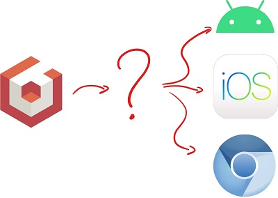

因此，我访问了 Babylon.js 文档站点并阅读了一篇题为 “从 Playground 到生产：Fruit Fallin' ”的文章。在阅读了那篇文章（并在[论坛](https://forum.babylonjs.com/)上提出了任何问题）之后，我确切地知道该做什么以及我预计需要多长时间。

1. 在我的 GitHub 帐户上，我从 [Babylon.js NPM 包模板](https://github.com/BabylonJS/npm-package-template)创建了一个新存储库，将我的 Playground 代码移动到该存储库中，并确认它有效。半小时内，我的 Playground 代码就在我自己的仓库中运行了。
- 然后，我从 Babylon.js [资产主机](https://github.com/BabylonJS/asset-host-template) 模板创建了一个新的存储库，将我一直在进行原型设计的资产放在那里，然后将原型代码中的链接更改为指向我的本地资产主机。`十五分钟后，我的整个原型——源代码和资产——都在我自己的存储库中运行。`
- 现在，随着一切都转移到开发基础设施中，我开始着手将我的原型变成真正的生产代码和资产。`我进行了重构和修改，以摆脱特定于 Playground 的做法，并将我的存储库转换为高效的开发环境，在其中我可以在整个开发过程中添加功能、获取依赖项、试验、协作和迭代`。
- 一旦我准备好分享一些东西，我想使用 [GitHub Pages](https://pages.github.com/) 来托管它，这样我就可以从朋友和同事那里获得反馈。因为 Babylon.js 模板存储库的设置使这一切变得容易，`所以我花了五分钟（如果那样的话）将我的体验发布到我可以链接到的 GitHub 托管网站`。
- 接下来，我将我的游戏代码作为 [NPM 包](https://www.npmjs.com/)上传，这样我只需拉下一个包即可轻松地将其重新添加到其他项目（网站、NPM 应用程序等）。同样，Babylon.js 模板存储库的设置使这一切变得容易： `在十分钟内，我就有了新的 NPM 包`。
- 我想将我的应用发布为手机游戏并在 Google Play 和 App Store 上架，所以我决定使用 [Ionic](https://ionicframework.com/)。我所要做的就是创建一个新的 Ionic 应用程序，将我的新 NPM 包添加为依赖项，然后调用我的代码并告诉它在应用程序中的显示位置。`大约一个小时后，我的代码被构建到一个原生应用程序中，准备好用于移动设备或作为 PWA`

这就是我创建 [Fruit Fallin'](https://syntheticmagus.github.io/fruit-falling-source/) 的方式，这是一个 Babylon.js 应用程序，灵感来自 Flash 鼎盛时期的浏览器游戏。虽然我碰巧在制作一个简单的游戏，但同样的过程可以用于更复杂的体验、商业场景......从高层次上讲，上面描述的过程可以用来将任何 Babylon.js 想法从 Playground 带到生产使用 Babylon.js 模板存储库、NPM 和 Ionic。

对于不太高级的外观，让我们更一步一步地完成整个过程

### 整个过程的更一步一步的旅程
- 将 Playground 代码移动到开发存储库中

	开发生产代码的第一步是将开发从[我的 Playground](https://playground.babylonjs.com/#G4VPXM#1) 转移到专用存储库中。Babylon.js NPM 包模板是 [Template Repository Workflow](https://doc.babylonjs.com/toolsAndResources/templateRepositories#the-template-repository-workflow) 的一个组件，在设计时考虑到了这一点，特别是在从 Babylon.js Typescript Playground 迁移代码时，所以我决定使用它。
	
	1. 我登录了我的 [GitHub](https://github.com/) 帐户

		
	- 在 Babylon.js [NPM 包模板](https://github.com/BabylonJS/npm-package-template) 的页面上，我单击“使用此模板”按钮开始一个新的 repo

		
	- 我选择了我的存储库名称，选择将其公开（对于非开源，我会选择私有），然后创建存储库。

		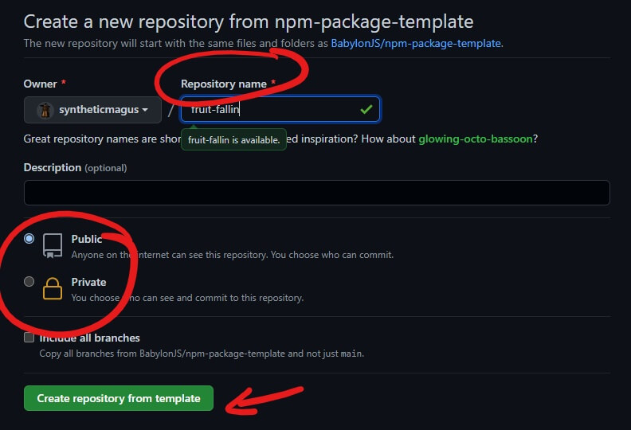
	- 在一个支持 [Git](https://git-scm.com/book/en/v2/Git-Basics-Getting-a-Git-Repository) 的终端（在我的例子中，Windows 上的 Git Bash）中，我导航到我希望我的新存储库所在的位置并创建了我的本地克隆。

		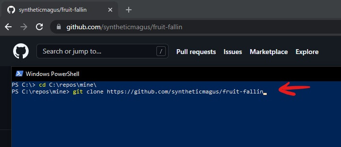
	- 在启用 NPM 的终端中，我导航到我的新仓库并运行

			npm install
	- 这为仓库中的所有包安装了所有 NPM 依赖项。

		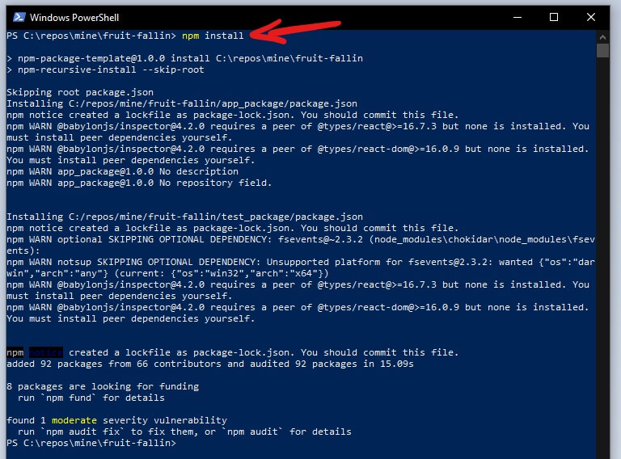
	- 仍然在启用 NPM 的终端的根目录中，我运行

			npm run dev
		这启动了以“监视”模式构建和服务 repo 的过程。片刻之后，默认的 NPM 包模板测试应用程序在 [http://127.0.0.1:8080](http://127.0.0.1:8080/) 的新浏览器选项卡中启动
		
		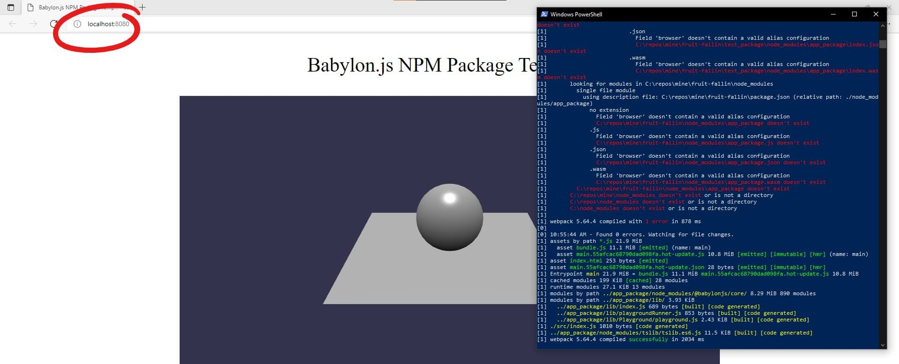
	- 然后回到我一直在做原型设计的 [Babylon.js Typescript Playground](https://playground.babylonjs.com/#G4VPXM#1) 并复制了所有代码

		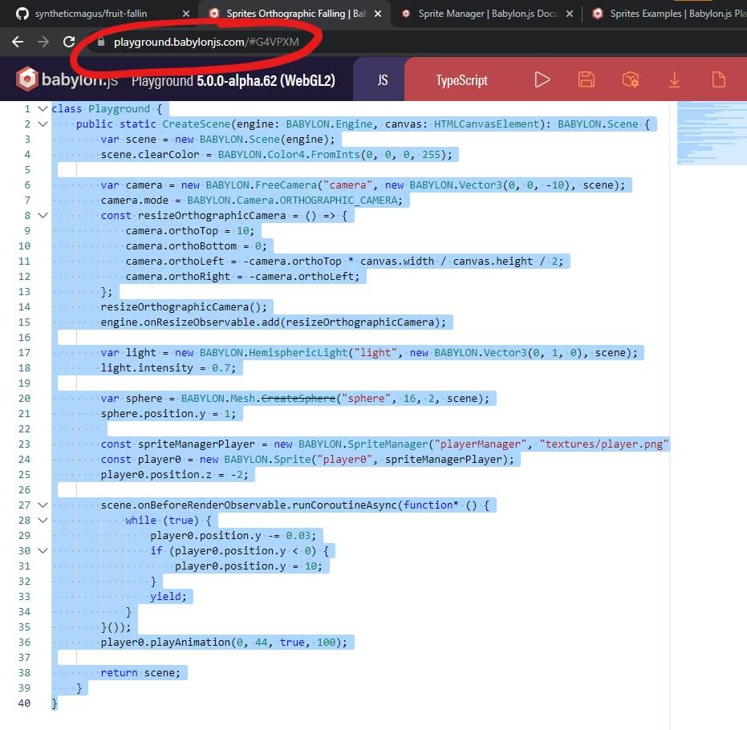
		
		注意：这个“复制”过程确实希望原始代码在 TypeScript Playground 中。来自 JavaScript Playground 的代码需要移植到 TypeScript（通常不是很困难），然后才能继续进入模板存储库工作流程。这种代码迁移不是这个开发故事的一部分，但它应该相当简单，并且总是可以在 [论坛](https://forum.babylonjs.com/c/questions) 上获得帮助
	- 在 Visual Studio Code（我首选的代码编辑器）中，我打开了我的新 repo 的根目录，然后打开文件 `app_package/src/Playground/playground.ts` 并将Playground 类替换为我复制的 Web 类。

		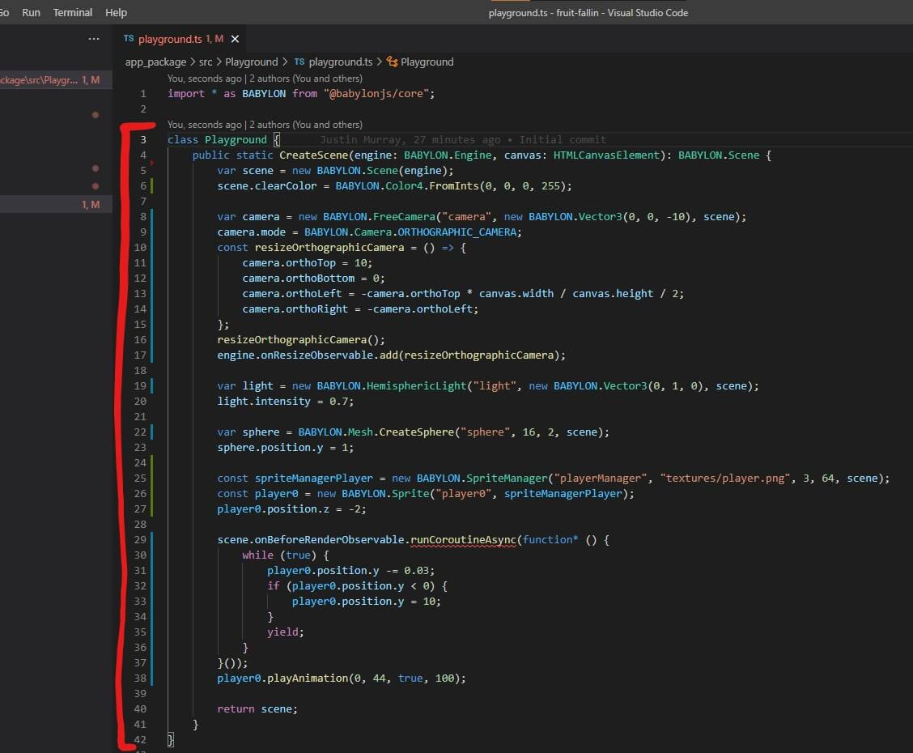
	- 虽然 NPM 包模板旨在使从 Web Playground 复制粘贴代码并使其立即工作变得尽可能容易，但有时需要进行一些调整。就我而言，我使用的协程功能仅在预览分支中可用，因此我必须更新我 `app_package/package.json` 所依赖的 babylon 版本。

		
	- 在进行更改并运行之后

			npm update
	- 我能够第一次看到我的代码在本地运行		

		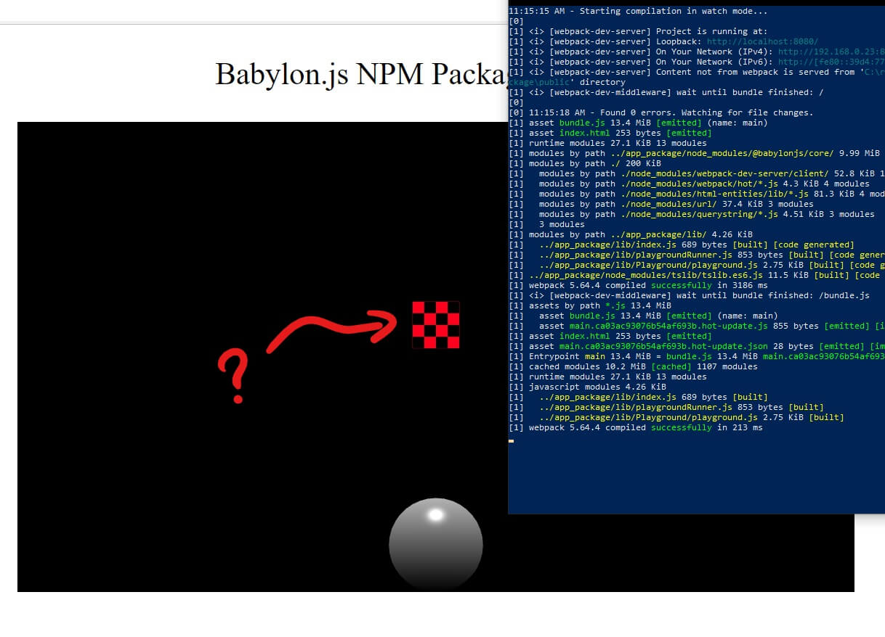
	- 还需要进行一项更改！由于我的代码托管在 Playground 上，因此它使用的是 Playground 相对 "textures/player.png" URL；但是，一旦该代码在本地运行，它就无法构建一个完整的 URL 来查找该资产。切换到我自己的资产托管是稍后的步骤，所以我真的不需要解决这个问题；但是，由于可以通过切换到 [RawGit](https://stackoverflow.com/questions/39065921/what-do-raw-githubusercontent-com-urls-represent) URL 来使其正常工作 player.png（目前仍然有效），因此我决定无论如何都要修复它。

		
	- 保存更改后，我所要做的就是保存文件并等待浏览器中的测试应用程序自动刷新

		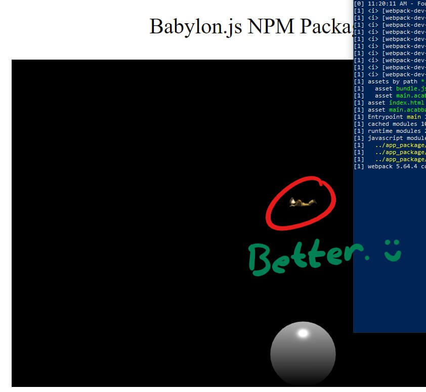
		
	而且，就这样，我将我的原型代码从 Playground 移到了一个独立的存储库中，以便继续开发。然而，我仍然从互联网上提取资产，随着我继续开发我的应用程序，这些资产将难以控制和更新。是时候为资产创建一个对开发更友好的环境了！

### 创建资产主机存储库
Sprite 我在学习如何使用精灵时使用的是作为 babylon 默认资产的一部分提供的。虽然我一直都知道我想替换它，但我首先想用它来引导和测试我的资产托管开发方法。

1. 基本上重复上一节中从模板创建新存储库的步骤，我从 [Asset Host Template](https://github.com/BabylonJS/asset-host-template) 创建了一个新的资产主机，将其克隆下来，并安装了 NPM 依赖项。
- 和以前一样可以运行了

		npm run dev
- 在我的新资产主机 repo 的根目录中。默认情况下，这会启动一个服务器来为我的 repodocs文件夹中的资产提供服务，地址为 http://127.0.0.1:8181。

	
- 为了仔细检查我的服务器是否正常工作，我打开 [http://127.0.0.1:8181/example.txt](http://127.0.0.1:8181/example.txt) 并看到了文本

	
- 接下来，我下载了 [player.png](https://github.com/BabylonJS/Babylon.js/tree/master/packages/tools/playground/public/textures/player.png) 的副本 并将其放在docs文件夹中。同样，我使用浏览器通过检查是否可以在 [http://127.0.0.1:8181/player.png](http://127.0.0.1:8181/player.png) 看到图像来测试它是否有效。资产主机模板附带的开发服务器会自动提供文件 docs夹中放置的新文件，因此无需重新启动服务器。

	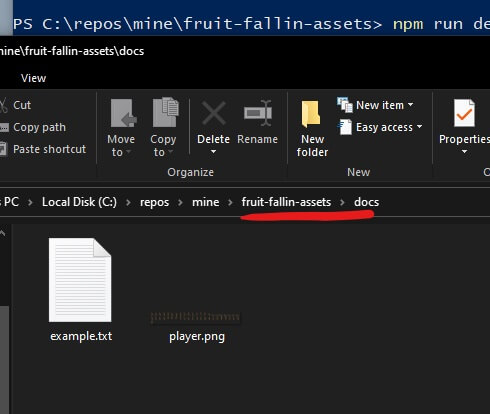
- 回到我的源存储库中的 Playground.ts，从我自己的资产主机消耗精灵剩下的就是将spriteUrl分配行更改为,保存文件，然后等待测试应用重新加载

		const spriteUrl: string = "http://127.0.0.1:8181/player.png";
- 当然，一旦发生重新加载，我意识到我将无法看到结果，因为我的资产主机中的精灵看起来与从 Internet 中提取的相同。然后，为了更加确定，我在资产主机中更改 `player.png` 为 `player_2.png` ，然后清除浏览器的文件缓存（因此它不会加载 的缓存版本 `player.png`）并刷新测试应用程序。在确认测试应用程序找不到`player.png` 后，我再次更改代码以查找 `player_2.png` 并保存文件。当应用程序自动重新加载时，它又找到了精灵。

	有了这个，我的整个原型，包括代码和资产，都在我自己的存储库本地运行，在那里我可以快速迭代并经常提交，因为我继续...

	
	
### 开发体验
编码教程和实施是梦寐以求的东西，大多数阅读它们的人几乎立刻就睡着了。这不是一个编码教程，所以我不会花太多时间来描述 `Fruit Fallin'` 的实现细节。但是，我将介绍一些我认为对帮助我让 `Fruit Fallin'` 以我想要的方式工作特别重要的笔记。

1. playground.ts 我尽可能快地拆开并删除。

	Babylon.js Playground 是试验、原型和重现 bug 的绝佳场所。然而，为了在这些方面表现出色，Playgrund 做出了许多实施决策，这些决策并不能很好地转化为生产软件开发。单文件开发、`kitchen-sink` 依赖包含和 BABYLON 导入就是这方面的突出例子。
	
	
	在其初始状态下，NPM 包模板 repo 有意模拟这些模式，playground.ts 以尽可能轻松地从基于 Playground 的原型设计过渡到基于 repo 的开发。该转换的第一步是简单地将 Playground 代码复制到 playground.ts 上面讨论的内容中，然后使其进入工作状态。然而，一旦完成，我认为第二步应该始终将所有内容重构playground.ts 为更健壮的代码结构（多个文件、类型等）。由于代码已经处于工作状态，我将功能逐步移到单独的文件中（相机创建到新的相机类型，将对象放入新的类等），每一步都证明我没有破坏我的代码。然后，一旦所有功能都移出 playground.ts，我只是从我的存储库中删除了该文件和包含它的文件夹
- 我从 NPM 包模板存储库中清除了未使用的依赖项。

	这是我建议将您的新存储库从 Playground 实践转移到生产中的另一个步骤。为了能够支持从 Playground 复制粘贴的代码，NPM 包模板 `app_package` 默认包含许多依赖项，其中只有一部分可能被任何特定代码库使用。幸运的是，这里很容易摆脱不必要的导入；我所要做的就是打开 `app_package/package.json` 并删除对我没有使用的任何 NPM 包的引用——在这种情况下，大部分是它们。
	
	
- 为了确保我在预期的情况下进行渲染，我 `index.js` 在 `test_package`.

	NPM 包模板中包含的测试应用程序具有极其简单和通用的外观：它基本上只是 `HTMLCanvasElement` 空白页面中的一小部分。然而，并非所有 Web 应用程序都是为通用画布设计的，因此在许多情况下，向测试应用程序添加功能以更好地反映应用程序将运行的真实环境（全屏功能、用于输入数据的网站表单）可能会有所帮助， ETC。）。就我而言，Fruit Fallin'的设计主要考虑了移动触摸屏，因此我希望我的画布具有更接近游戏最终应该运行的纵横比。
	
	
- 我使用Scenes 作为我的游戏逻辑的组织单位,

	大多数交互式应用程序都有多种操作“模式”，Fruit Fallin' 尤其有两种：游戏和标题/菜单/选项/信用。虽然对于如何最好地分离不同模式的关注点没有真正的规则，但我发现将它们作为单独的 babylon Scene 对象很有用。具体来说，我 Scene为不同的“模式”（例如 [标题屏幕](https://github.com/syntheticmagus/fruit-falling-source/blob/278fe61755d7f16b1d5f0726f1e72c670883df06/app_package/src/titleScene.ts) 和 [游戏玩法](https://github.com/syntheticmagus/fruit-falling-source/blob/278fe61755d7f16b1d5f0726f1e72c670883df06/app_package/src/gameScene.ts)）创建了具有我想要的行为的新子类。这让我很容易通过简单地处理一种场景并创建另一种场景的新实例来在模式之间转换，从而保持逻辑和资源的清洁和分离。

	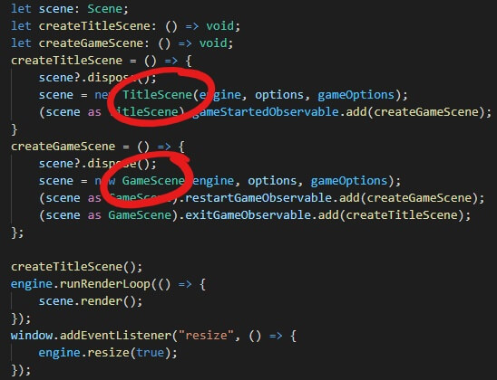
- 我编写了一个固定的可观察帧率来简化 [协程驱动](https://doc.babylonjs.com/divingDeeper/events/coroutines) 的动画和游戏逻辑，而不会受到帧率变化的影响。

	依赖帧率的逻辑是危险的，因为你不能依赖帧率。例如，如果您编写精灵动画以提高设备帧率，并让它们在 30 FPS 设备上看起来正确，那么这些动画在 60 FPS 设备上看起来快得离谱。另一方面，游戏逻辑中的某些事物（例如精灵动画）非常自然地适合基于帧的逻辑，因为它们以离散增量发生。我想利用这种自然的协同作用，但我不希望我的逻辑容易受到帧率变化的影响；所以，借用物理模拟实践，我的解决方案是让一个简单的 [固定帧率](https://github.com/syntheticmagus/fruit-falling-source/blob/278fe61755d7f16b1d5f0726f1e72c670883df06/app_package/src/fixedFramerateObservable.ts) 可观察 它驱动每秒有保证的“更新”数量。如果设备的渲染速度快于所需的帧速率，则此` observable `将“跳过”帧，直到经过足够的时间；如果设备的渲染速度低于所需的帧速率，则该 `observable` 将在其拥有的帧上“加倍”，以便每次始终调用相同数量的“更新”。这个技巧允许我编写 依赖于帧的[逻辑](https://github.com/syntheticmagus/fruit-falling-source/blob/278fe61755d7f16b1d5f0726f1e72c670883df06/app_package/src/drop.ts#L89-L94) ，而不会变得脆弱地依赖于帧速率。
	
	
	
	拥有这种可靠地使用基于帧的逻辑的能力，我可以将协程用于各种事情，从游戏流程到程序动画。对 `Fruit Fallin` 中协程使用的完整概述 超出了本文的范围，但也许最有趣的例子是 [面部动画是如何完全使用协程完成的](https://github.com/syntheticmagus/fruit-falling-source/blob/main/app_package/src/rainbowButton.ts#L102-L183)。
- 我让消费应用程序（在这个 repo 中，测试应用程序）负责指定游戏使用的所有资产的位置。

	正如在[模板存储库工作流程](https://doc.babylonjs.com/toolsAndResources/templateRepositories#the-template-repository-workflow)上的 babylon 文档中所讨论的 ，部署巴比伦体验的最大挑战之一是分配资产。最好将此问题与代码中实际使用资产完全分开，这样即使资产分布不同，也可以在多种情况下使用相同的体验代码。
	
	出于这个原因，我对自己的规则是，在任何地方都不应该有硬编码的资产 URL app_package。相反，所有资源位置都应该通过消费体验传递，无论是`test_package` 生产运输工具还是一些生产运输工具。这样一来 `app_package` 只要给定了正确的资产位置，就可以将代码编写为“正常工作”，并且所有任何消费体验都必须做集成它只是告诉 `app_package`  正确的 URL 使用。
	
	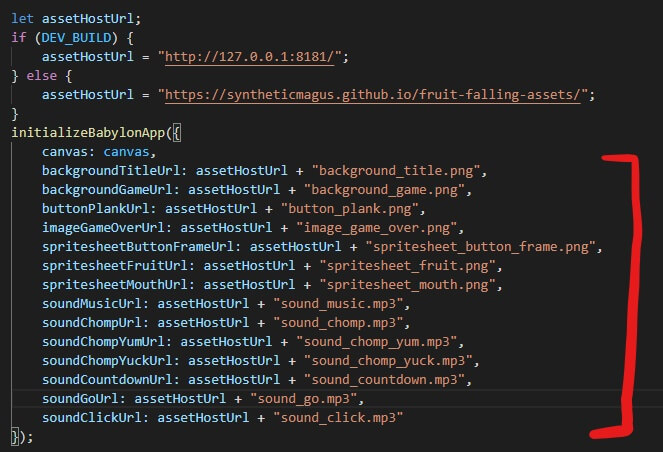
	
	我还应该简要提及我是如何为游戏创建资产的。同样，这不是实现概述；但是对于那些好奇的人，这里是我用来制作 `Fruit Fallin'` 的各种工具。
	
	- 美术

		我在一个古老的三星 Tab A 9.7（我认为是 2015 年）上使用 [FlipaClip](https://www.flipaclip.org/) 手工绘制了所有背景、按钮和所有动画组件 。使用 [FFmpeg](https://ffmpeg.org/) 批量裁剪动画帧，使用 [Leshy SpriteSheet Tool](https://www.leshylabs.com/apps/sstool/) 组合成精灵表，并在必要时使用 [GIMP](https://www.gimp.org/) 进行细化（微调不透明度等） 。
	- 音乐
	
		我使用 [MPC Beats](https://www.akaipro.com/mpc-software) 制作了在游戏过程中播放的歌曲。
	- 音效

		我制作的几乎所有音效都是通过向麦克风自己模拟发出的声音，然后在 [Audacity](https://www.audacityteam.org/) 中摆弄录音以获得我想要的声音。例外是在比赛开始时的倒计时期间播放的音调，这些音调是由 Audacity 中的音高产生的。
	- 其他

		剩下的少数元素，如文本，都是使用 [Babylon 的内置 GUI](https://doc.babylonjs.com/divingDeeper/gui/gui) 生成的。唯一的例外是动画按钮的颜色，这是使用 babylon 生成的平面几何图形和无光照 PBR 材质完成的。
		
### 在 GitHub 页面上发布测试应用程序
一旦我有 `Fruit Fallin'` 工作，我立即想与一些朋友分享它以获得他们的反馈。有很多公共和私有的方法我可以做到这一点，但是因为我不关心保持原型私有，到目前为止最简单的选择是使用 [GitHub Pages](https://pages.github.com/)，一个简单的基于 GitHub 的公共托管服务，模板存储库创建非常容易使用。

1. GitHub Pages 本质上允许您从存储库中的某些指定文件夹提供静态站点，其中之一就是 `docs` 文件夹。这就是资产主机模板 `docs` 首先从文件夹中提供资产的原因。正因为如此， 获取 GitHub Pages 来托管您的资产非常容易。首先，我将更改推送到我的 GitHub 存储库，然后在浏览器中打开该存储库。

		
- 在那个 repo 的浏览器站点上，我打开了 `Settings`选项卡，然后向下滚动并单击` Pages`

	
-  我选择了主分支作为我的来源，然后选择 `docs`了作为服务的文件夹。完成后，因为我的资产已经在 docs 文件夹中，我立即为我的资产拥有了一个公共 Web 主机。

	
- 接下来，我想让测试应用程序根据它是托管在本地开发服务器还是托管在 GitHub Pages 上来改变其行为。如果它是本地的，我希望它仍然从我的本地资产主机 127.0.0.1:8181 中提取资产，以便我可以保持我的开发工作流程。但是，如果该站点位于 GitHub Pages 上，我希望它从 Web 主机中提取。幸运的是，测试应用程序包含一种机制，可以很容易地确定这一点。我所要做的就是检查 `DEV_BUILD` 变量并据此更改 URL 前缀。

	
- NPM 包模板的设置方式，DEV_BUILD 无论何时在本地运行时使用

		npm run dev
- 但是，GitHub Pages 不能（也不应该）以这种方式运行。相反，我需要将我的测试应用程序构建到一个静态站点并将其放入 `docs` 文件夹中。这也内置在 NPM 包模板中；要构建 `test_package`（包括其依赖项 `app_package`）并将构建输出放在 `docs` 准备部署到 GitHub Pages 的文件夹中，我从 repo 的根目录运行以下命令。

		npm run build
- 接下来我 `git status` 只是为了确认文件 `docs` 夹中的文件确实发生了变化

			
- 完成后，剩下的就是提交构建的站点，将其推送到 GitHub，然后以与资产托管站点相同的方式打开 GitHub 页面

	
	
几秒钟后，我的网站上线了，GitHub 给了我一个链接，我可以用它来分享Fruit Fallin'的第一个 Web 可访问版本！

### 部署为 NPM 包
GitHub Pages 的速度和便利性非常好，但这并不是最终目标。一旦我得到了一些反馈并准备好继续前进，接下来我需要将我的 `app_package` 代码带入一个真正的运输工具中。继续 [模板存储库工作流程](https://doc.babylonjs.com/toolsAndResources/templateRepositories#the-template-repository-workflow)，我决定将我 `app_package` 的作为 NPM 包上传，以便它可以轻松集成到各种不同的运输解决方案中。

1. 由于 `app_packageNPM 包模板` 中的已经构建为 NPM 包，因此发布它就像发布任何其他 NPM 包一样容易。就个人而言，我之前从未发布过 NPM 包，所以我花了很长时间才弄清楚我可以通过打开终端并输入来[在终端中登录 NPM](https://medium.com/@bretcameron/how-to-publish-your-first-npm-package-b224296fc57b)

		npm login
- 因为我不需要 [私下发布我的 NPM 包](https://docs.npmjs.com/creating-and-publishing-private-packages)，所以我唯一需要做的另一件事是查看`package.json` 文件 `app_package` 以确保它包含我的新 NPM 包的正确信息——最重要的是包名称

	
- 发布

	这样一来，我的应用程序代码就可以在 NPM 上使用，随时可以集成到我选择的任何运输应用程序中

		cd app_package
		npm publish --access public
		
### 与 Ionic 一起投入生产
因为 `Fruit Fallin'` 在设计时考虑到了移动触摸屏界面，所以我决定将其嵌入到可以上传到应用商店的 Android 和 iOS 应用程序中。环顾四周后，我决定使用 Ionic 作为我的生产平台，因为

- （1）它是开源的
- （2）它可以像我刚刚创建的那样非常容易地使用 NPM 包，并且
- （3）它可以让我以来自同一运输工具的机器人 Android 和 iOS 以及 Web 和 PWA 为目标。

这不是 Ionic 教程，了解 Ionic 的最佳方式是查阅他们自己的[文档](https://ionicframework.com/docs/intro/cli)；但作为快速上手，这就是我为使用 Ionic 为 Web 和 Android 构建 Fruit Fallin' 并在 Windows 上开发所做的工作

1. 安装包

		npm install -g @ionic/cli
- 导航到我希望 Ionic 应用程序代码所在的文件夹后，我运行

		ionic start
- 我拒绝使用 `App Creation Wizard`，选择了一个 React 前端，为我的项目命名，并选择了一个空白的应用程序模板。

	
- 为了检查到目前为止一切是否正常，我运行了以下命令来查看默认的 Ionic Web 应用程序：

		cd fruit-fallin
		ionic serve
- 下一步是将这个默认应用程序构建到 Android 应用程序中。为此，我选择使用 Ionic 与 [Capacitor](https://capacitorjs.com/) 的内置集成

		ionic capacitor add android
- 一般来说，Ionic 具有出色的终端输出，可以为您提供有关如何使用自身的很好的建议。就我而言，我收到一条消息说同步失败，因为 `build` 目录丢失。为了解决这个问题，我所要做的就是手动构建和同步。

		ionic build
		ionic capacitor sync android
- 我添加 Android 的第一个命令在我的 Ionic 应用程序的根目录中创建了一个名为 `android`. 
	- 此文件夹是一个 Android Studio 项目。
	- Ionic 的 CLI 提供了许多不同的方法来尝试在此文件夹上自动调用 Android Studio，但我选择不使用这些方法。
	- 我的一般经验是 Android Studio 是一种奇怪的鸟，所以我通常更喜欢通过在 Android Studio 中打开该文件夹作为项目来直接使用它

		
- 使用 Android Studio 超出了本文的范围，但是一旦打开该项目就可以像任何其他项目一样在真实或虚拟设备上构建和运行

	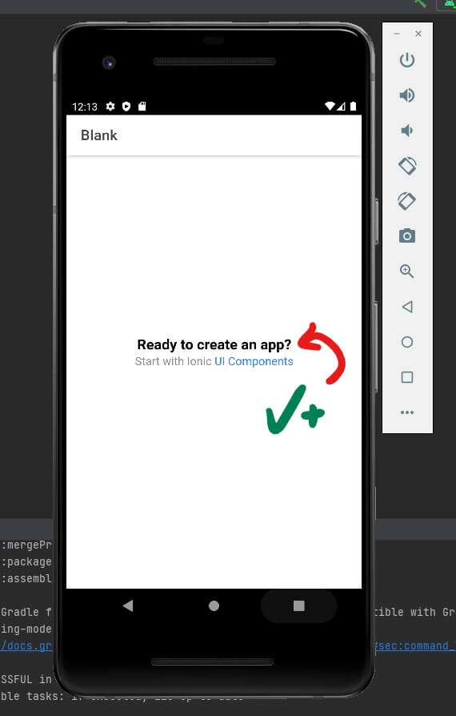
- 完成后，是时候更改应用程序的内容以使用我的 NPM 包了。在根目录中支持 NPM 的终端中，我添加了依赖项。

		npm install fruit-fallin
- 安装引入了 `Fruit Fallin'` 代码的依赖项，但需要以不同的方式添加资产。从技术上讲，我可以继续让 Ionic 应用程序从不同的位置提取资产，但因为我希望应用程序是独立的，所以我只是将我的资产放在 `public/assets` 目录中的一个新文件夹中

	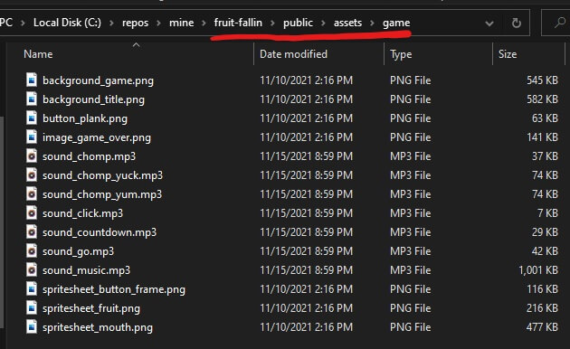			
- 现在我所要做的就是调用我引入的 NPM 依赖项，并告诉它在哪里可以找到我刚刚添加的资产。我不是 React.js 专家，这也不是 React.js 教程，但在朋友和同事的帮助下，我能够创建一个简单的重写 `Home.tsx`，显示全屏画布并将其作为参数传递到我的 `Fruit Fallin'` 初始化代码。

		import { IonContent, IonPage } from '@ionic/react';
		import { Component, createRef, RefObject } from 'react';
		import { initializeBabylonApp } from 'fruit-fallin';
		import './Home.css';
		
		class BabylonGame extends Component {
		  private _canvas: RefObject<HTMLCanvasElement>;
		
		  constructor (props: any) {
		    super(props);
		    this._canvas = createRef();
		  }
		
		  public componentDidMount() {
		    // Crude workaround for a loading timing issue
		    setTimeout(() => {
		      const babylonOptions = {
		        canvas: this._canvas.current!,
		        backgroundTitleUrl: "assets/game/background_title.jpg",
		        backgroundGameUrl: "assets/game/background_game.jpg",
		        buttonPlankUrl: "assets/game/button_plank.jpg",
		        imageGameOverUrl: "assets/game/image_game_over.jpg",
		        spritesheetButtonFrameUrl: "assets/game/spritesheet_button_frame.jpg",
		        spritesheetFruitUrl: "assets/game/spritesheet_fruit.jpg",
		        spritesheetMouthUrl: "assets/game/spritesheet_mouth.jpg",
		        soundMusicUrl: "assets/game/sound_music.mp3",
		        soundChompUrl: "assets/game/sound_chomp.mp3",
		        soundChompYumUrl: "assets/game/sound_chomp_yum.mp3",
		        soundChompYuckUrl: "assets/game/sound_chomp_yuck.mp3",
		        soundCountdownUrl: "assets/game/sound_countdown.mp3",
		        soundGoUrl: "assets/game/sound_go.mp3",
		        soundClickUrl: "assets/game/sound_click.mp3",
		      };
		      initializeBabylonApp(babylonOptions);
		    }, 200);
		  }
		
		  public render() {
		      return <canvas id="babylonCanvas" width={window.innerWidth} height={window.innerHeight} style={{width: "100%", height: "100%"}} className="center" ref={this._canvas}></canvas>;
		  }
		}
		
		const Home: React.FC = () => {
		  return (
		    <IonPage>
		      <IonContent>
		        <BabylonGame></BabylonGame>
		      </IonContent>
		    </IonPage>
		  );
		};
		
		export default Home;

- 为了测试这是否有效，我首先在浏览器中再次测试
		
		ionic serve

	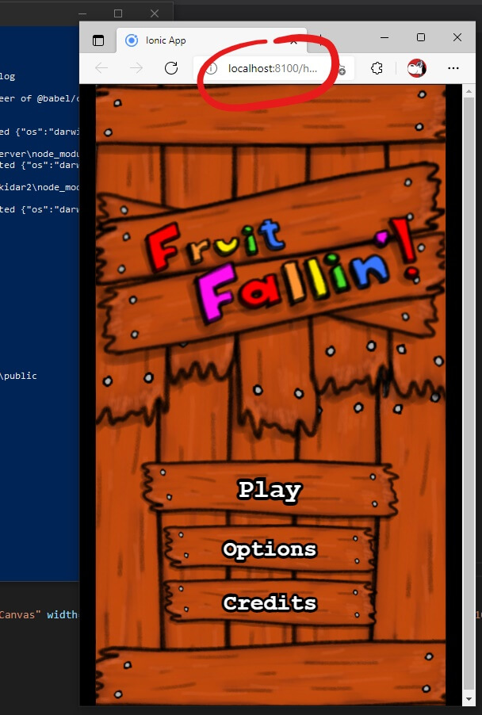	
- 如果我使用 Ionic 以 Web 或 WPA 为目标，这将非常接近最终状态。但是，由于我想去 Android，所以还有一些步骤。
- 显式构建可能是不必要的，但我这样做只是为了确定。然后同步复制到新构建以及资产，更新 Android 项目。请注意，我在执行此操作之前关闭了 `Android Studio`，以帮助确保 `Ionic CLI` 和 `Android Studio` 在同时访问相同文件时不会相互混淆。

		ionic build
		ionic capacitor sync android
- 最后，我再次在android  `Android Studio` 中打开该文件夹，构建项目，并将其部署到我的 Android 虚拟设备中。

	
	
就是这样！这就是我所需要的。我的巴比伦体验现在可以从同一个代码库部署到 Web、PWA、Android 和 iOS；此外，我现在有了一个利用模板存储库工作流程的过程，可以将几乎所有项目从 Playground 带到生产中沿着相同的路径。

## 参考
- [Playground to Production - Fruit Fallin'](https://doc.babylonjs.com/guidedLearning/devStories/fruitFalling)