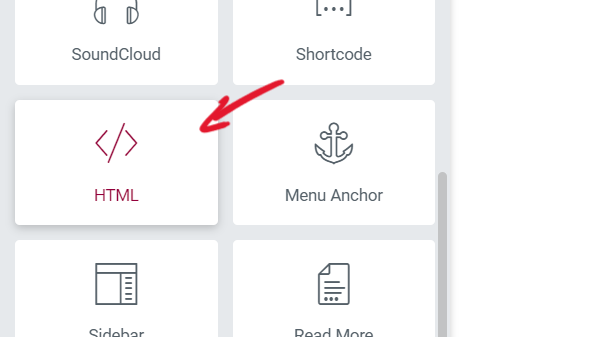
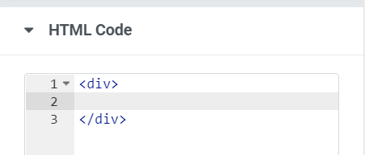
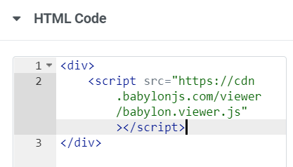
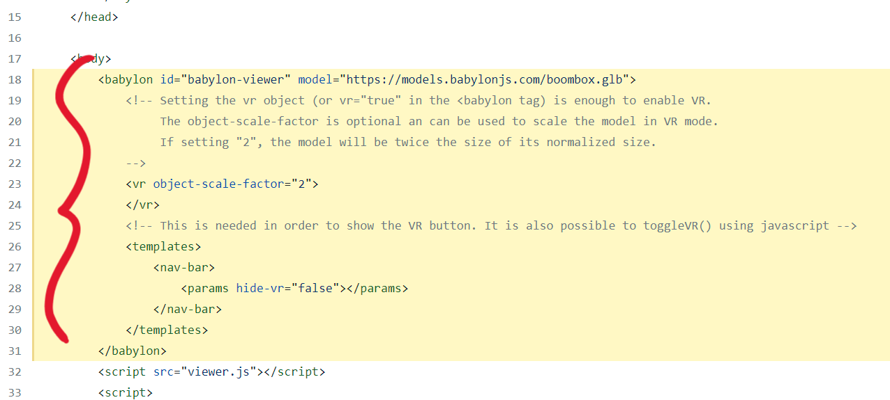
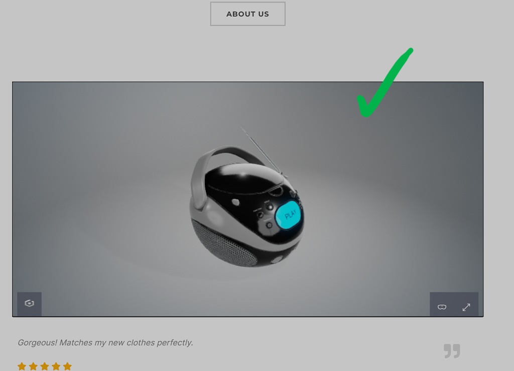
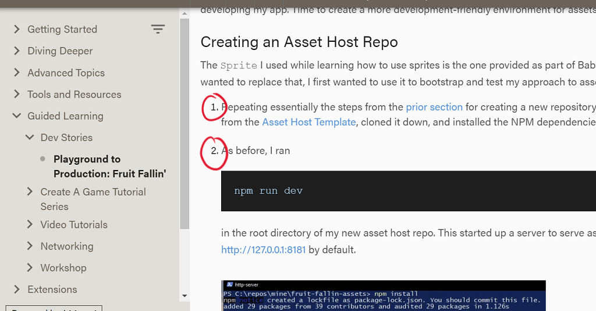
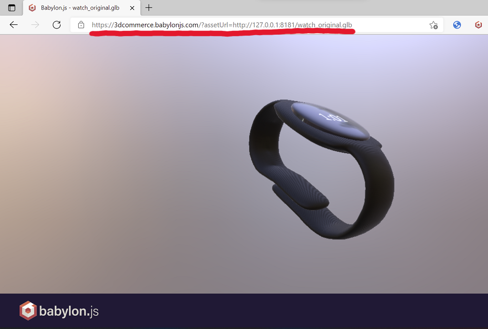
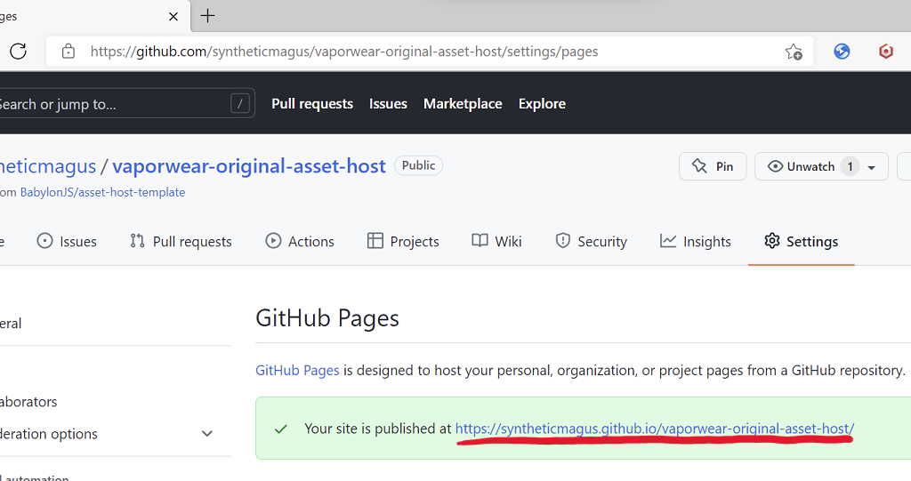
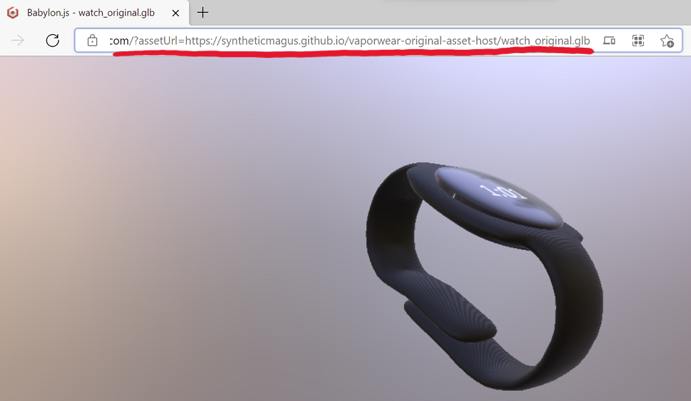
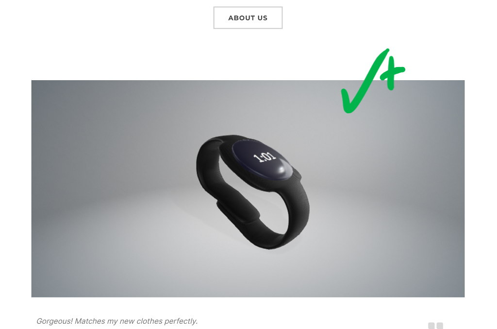

# babylon官方手册-引导学习-开发故事2-电子商务的 3D - WordPress 中的查看器
## 电子商务的 3D - WordPress 中的查看器
原始 Vaporwear 站点（[源代码](https://github.com/syntheticmagus/vaporwear-original-asset-host/tree/main/wp_sites_sources/vaporwear)、 [演示](https://syntheticmagus.github.io/vaporwear-original-asset-host/vaporwear_wp_original.mp4)）、带有 3D 的 Vaporwear 站点（[源代码](https://github.com/syntheticmagus/vaporwear-original-asset-host/tree/main/wp_sites_sources/vaporwear_viewer)、 [演示](https://syntheticmagus.github.io/vaporwear-original-asset-host/vaporwear_wp_with_viewer.mp4)）、 [资产主机](https://github.com/syntheticmagus/vaporwear-original-asset-host/)

关于演示的注意事项：对于大多数开发故事，我们尝试让开发故事中的实际可用产品可供读者直接探索。然而，这个开发故事中的网站是使用 WordPress 构建的，托管起来很复杂（有时成本很高），所以很遗憾，我们无法让这些网站无限期地运行。相反，demo 上面的链接会将您定向到显示正在运行的网站的视频，而 `source` 链接会转到包含 WordPress 网站原始文件的压缩文件。

### 高级概述
曾几何时，一个名叫艾伦的人拥有一家名为 Vaporwear 的公司，该公司生产和销售虚构的智能手表。为了实现规模化，Vaporwear 公司通过使用常用工具（在本例中为 WordPress）构建的传统电子商务网站销售其大部分产品。然而，Allan 最近听说 [将 3D 添加到电子商务网站可以对客户产生什么奇妙的影响](https://www.zdnet.com/article/2021-is-the-year-that-3d-and-augmented-reality-for-commerce-cashes-in/)；由于他的制造合作伙伴为他提供了最新款 Vaporwear 智能手表的简单 3D 模型，艾伦问自己：“我怎样才能快速轻松地将 3D 添加到我现有的电子商务网站？ ”

所以 Allan 做了一些研究，[发现 Babylon.js 通过将 Khronos 3D Commerce 一致性渲染作为核心产品](https://doc.babylonjs.com/divingDeeper/3D_commerce_certif)，专门迎合电子商务场景 。（此认证可确保 3D 渲染保持一致，从而使模型始终以网站所有者和客户期望的方式呈现。）此外，Babylon.js 提供了一个 [查看器](https://doc.babylonjs.com/extensions/babylonViewer) ，可以轻松地将 3D 添加到仅使用 HTML 样式的现有网站代码。所以艾伦咨询了他的网络开发人员巴纳巴斯，他们两人想出了如何在大约一个小时内将 3D 添加到 Vaporwear 电子商务网站。

1. 首先，他们会花大约十分钟的时间将默认查看器添加到他们的 WordPress 网站中。
- 接下来，他们最多花费半小时使用来自 [Babylon 模板存储库](https://doc.babylonjs.com/toolsAndResources/templateRepositories#the-template-repository-workflow) 工作流的资产主机在线托管他们的 3D 模型 。
- 最后，他们重新配置了默认查看器以显示他们的 Vaporwear 3D 模型，禁用他们不需要的功能并确保查看器使用符合 Khronos 3D Commerce 的渲染。在 [Babylon.js 论坛](https://forum.babylonjs.com/questions) 上的社区的一点帮助下，他们花了大约 20 分钟来按照他们想要的方式进行配置

这就是 Allan 和 Barnabas 在大约一个小时内将 3D 添加到现有 Vaporwear 电子商务网站的方式。虽然他们的网站使用 WordPress，但可以使用相同的基本过程将 3D 添加到构建在各种平台上的网站；所需要的只是添加脚本和一些 HTML 样式代码的能力。

### 整个过程的更一步一步的旅程
#### 将巴比伦查看器添加到现有站点
尽管 Barnabas 对 WordPress 非常有经验，但他之前从未向现有网站添加 3D，所以他想做的第一件事就是确保他至少可以在网站上获得 3D 渲染。在 Babylon.js 文档中找到 [查看器](https://doc.babylonjs.com/extensions/babylonViewer/viewerExamples#basic-usage) 示例 后，Barnabas 决定从那里获取代码并将其直接添加到他的 WordPress 站点。

1. 首先，他选择了 3D 内容应该放在他的 WordPress 网站页面上的哪个位置。

	
- 然后他添加了一个新的部分......

		
- ...使它全宽...

	
- ...并在新部分中添加了一个 HTML 块。

	
- 接下来，为了准备添加他自己的 HTML，Barnabas 添加了一个新的 HTML `div` 来帮助保持清晰的分组

	
- 在其中div，他添加了他在 [Babylon Viewer 文档](https://doc.babylonjs.com/extensions/babylonViewer#display-3d-models-on-your-webpage) script 中找到的标签来导入 Viewer，这样他就可以在他的页面上使用它

	
- 紧接着，他从“基本用法”[查看器示例](https://github.com/BabylonJS/Babylon.js/tree/master/packages/tools/viewer/public/basicExample.html#L18-L31) babylon 中复制粘贴了标签代码 。

	
- 将该代码粘贴到他的 HTML 块中后，他所要做的就是告诉 WordPress 更新页面......

	
- ..然后在编辑模式之外查看页面以查看结果,而且，就这样，Vaporwear 主页上出现了 3D 模型渲染！现在让它成为正确的3D 模型.....

	

### 创建资产主机存储库
WordPress 为媒体文件提供了一些开箱即用的支持，但它往往是定制的，并且主要关注图像和视频。Barnabas 曾短暂考虑过尝试解决这种情况，但最终他决定让 WordPress 专注于传统媒体并使用 babylon 推荐的“资产托管”存储库之一来服务他的 3D 模型会更简单。

1. 为了创建资产主机本身，他遵循了他在 Babylon.js 文档中找到的[开发故事的“创建资产主机回购”](https://doc.babylonjs.com/guidedLearning/devStories/fruitFalling#creating-an-asset-host-repo)部分的前两个步骤。

	
- 创建资产主机后，他将 3D 模型的副本放入docs文件夹中

	
- 为了仔细检查他的资产主机是否正确地为模型提供服务（并查看 Babylon.js 中的模型渲染），他决定在符合 [3D Commerce 版本的 Babylon.js 沙箱](https://3dcommerce.babylonjs.com/) 中从他的资产主机服务器渲染模型. 他在 [Dev Story](https://doc.babylonjs.com/guidedLearning/devStories/vaporwearViewer#creating-an-asset-host-repo) 中看到，Babylon.js 沙箱有一个 `assetUrl` 参数，可以提供该参数以使其自动加载资产，因此他在本地资产主机上使用他的模型进行了尝试。

		https://3dcommerce.babylonjs.com/?assetUrl=http://127.0.0.1:8181/watch_original.glb
	
		
- 完成这项工作后，他需要发布资产主机，以便能够从任何地方访问模型，因此他按照[水果坠落的开发故事](https://doc.babylonjs.com/guidedLearning/devStories/fruitFalling#publishing-the-test-app-on-github-pages)的 [“发布”部分的步骤 1、2 和 3](https://doc.babylonjs.com/guidedLearning/devStories/fruitFalling#publishing-the-test-app-on-github-pages) 将其推送到 GitHub Pages 。

	
	
	
- 一旦 GitHub Pages 确认他的资产托管人是在线的，他就抓住了直播网站的链接......

	
- ..并使用它（附加了他的模型名称）创建了一个新的沙箱链接，以从他自己的资产主机加载他的模型

		https://3dcommerce.babylonjs.com/?assetUrl=https://syntheticmagus.github.io/vaporwear-original-asset-host/watch_original.glb
		
- 最后，在他的模型托管并可以从 Web 访问之后，是时候在 Vaporwear WordPress 网站上呈现它了。

### 配置 babylon 查看器
1. 严格来说，只是让模型在 Vaporwear 网站的 Babylon Viewer 中呈现就像更改为模型提供的 URL 一样简单

	
- 然而，Barnabas 知道 Babylon Viewer 是 [高度可配置的](https://doc.babylonjs.com/extensions/babylonViewer/configuringViewer)，因此他决定对其外观进行一些调整，使其看起来正好适合 Vaporwear。首先，他从添加 VR 支持的示例中删除了剩余代码。（他还清理了许多他不再需要的复制评论。）由于 Vaporwear 网站的目标是一个非常简洁的呈现，接近极简主义，他决定也从导航栏中删除徽标和全屏 UI

	
- 最后，他想确保模型是使用经过 Khronos 3D Commerce 认证的设置渲染的，这样他就可以确保它看起来与他之前在沙盒中看到的完全一样。Babylon Viewer 使用 3d-commerce-certified从 Babylon 5.0 开始可用的标志来支持这一点。然而，由于 Barnabas 在发布 5.0 之前就这样做了，他需要切换到使用“预览”CDN 中的查看器脚本，以便获得最新的热门功能。

	
- 然后他在 WordPress 中更新了页面，切换到查看而不是编辑，然后……

	
	
3D 产品渲染的加入为 Vaporwear 电子商务网站增添了全新的特色，为他们已有的设计注入了新的活力。然而，随着 Vaporwear 业务的日益成功，Allan 和 Barnabas 已经在讨论将网站升级到一个新的、更现代的技术堆栈。在看到原始 Vaporwear 网站上的 Babylon Viewer 后，他们开始想知道拥有一个将 3D 作为旗舰功能内置到网站设计中的电子商务网站会是什么样子。艾伦花了一点时间浏览 [论坛](https://forum.babylonjs.com/c/demos) 寻找想法，在那里他找到了一个社区制作的 [实用程序](https://doc.babylonjs.com/guidedLearning/devStories/showroomCamera) 这让他非常兴奋，以至于他决定将其作为他和 Barnabas 所能想到的最流畅、最复杂的查看器/配置器体验的支柱。

但这是[另一个开发故事](https://doc.babylonjs.com/guidedLearning/devStories/vaporwearConfigurator)的主题。

	
## 参考
[3D for E-Commerce - Viewer in WordPress](https://doc.babylonjs.com/guidedLearning/devStories/vaporwearViewer)
			
	

		
	
	

