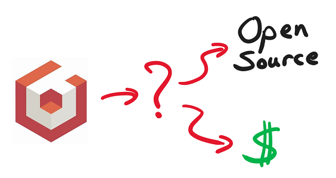
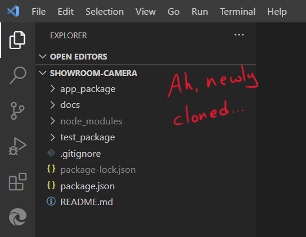
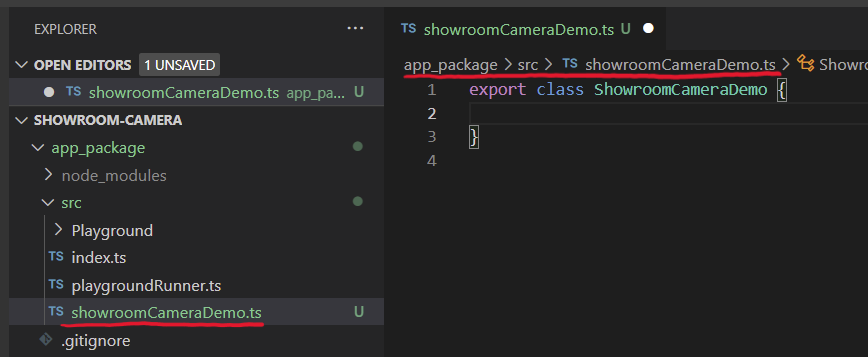
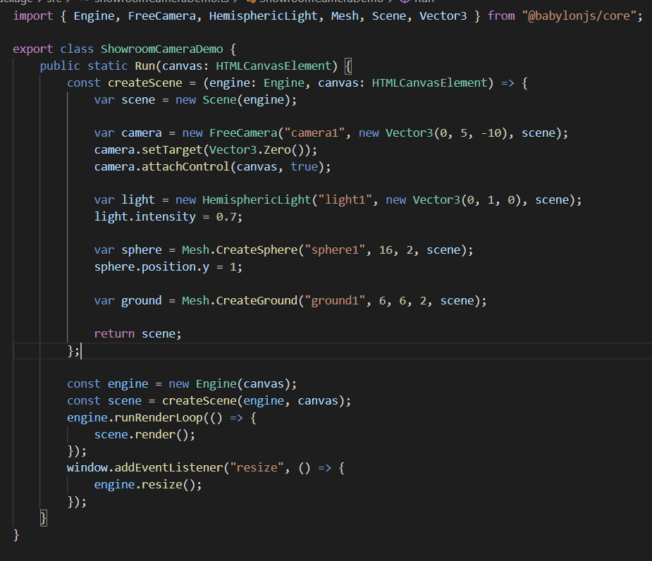
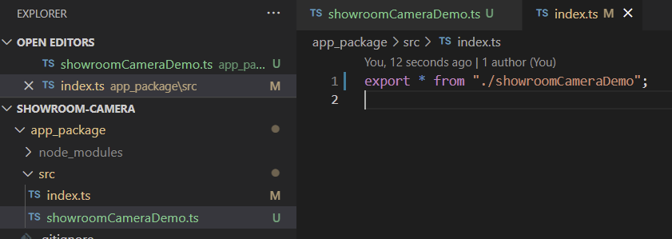
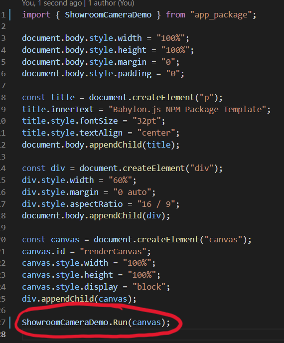
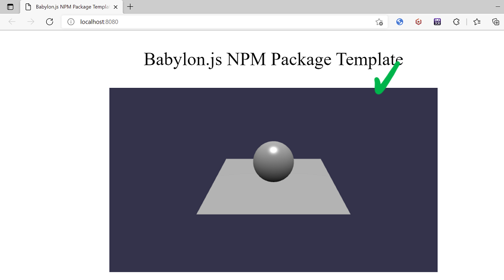
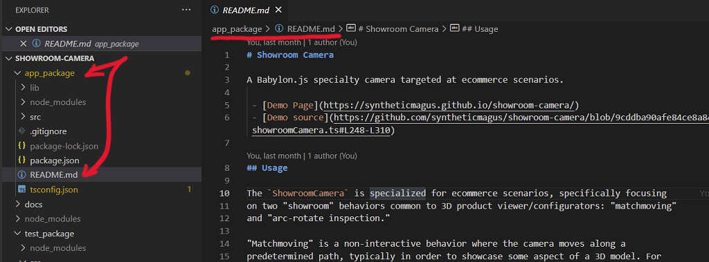
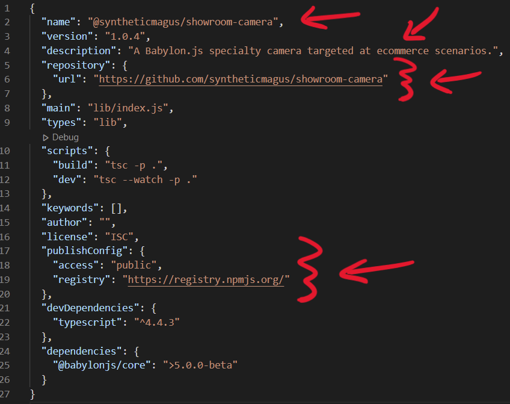
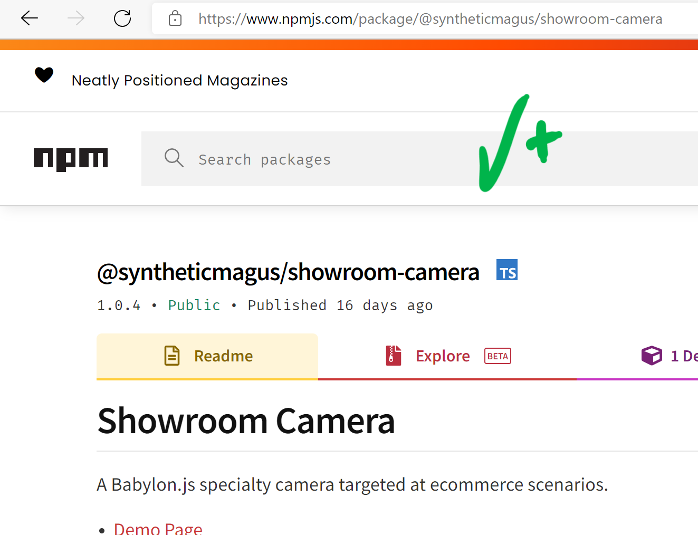

# babylon官方手册-引导学习-开发故事3-Babylon Utilities-Showroom Camera 
## 高级概述
曾几何时，我在研究电子商务网站中 3D 的使用时，开始注意到一个模式：虽然被渲染的 3D 模型通常是多种多样且令人兴奋的，但这些体验中的摄像机运动往往非常非常简单化。想知道这一点，我推测简单的原因（每种体验通常只有弧形旋转或静止相机行为）是因为编写相机控制代码是一种小众专业，并不是每个 3D 电子商务网站都有投资它的资源。这让我想知道是否有一些共同的行为基础可以封装在 Babylon Utility 中，许多电子商务网站可以使用它来使他们的 3D 相机更令人兴奋。在确定有这样一个子集之后，我终于遇到了最大的问题：我将如何开发一个巴比伦实用程序，以便它可以分发，甚至可能出售，以供其他人在他们自己的项目中使用？

商业 3D 引擎倾向于为这个问题提供商业解决方案；例如，Unity Asset Store 就是 Unity 的解决方案。作为一个完全免费的开源引擎，Babylon.js 没有那种基础设施。然而，我很快发现，通过利用其他现有的开源基础设施（特别是围绕 NPM 构建的），我可以实现完全相同的目标，我可以提供甚至出售其他开发人员快速轻松地添加我的 babylon 的能力实用到自己的项目中。

1. 首先，我创建了我的新存储库，利用 [模板存储库工作流](https://doc.babylonjs.com/toolsAndResources/templateRepositories#the-template-repository-workflow) 使以后重新分发变得容易。
- 接下来我实现了新的实用相机本身。
- 为了让其他人能够使用我的新 babylon 实用程序，我将它作为 NPM 包上传到主要的公共 NPM 注册表。
- 为了向其他人出售使用我的新 babylon 实用程序的能力，我将其作为 NPM 包上传到 [PrivJs](https://privjs.com/)，这是一个商业 NPM 注册表，可以轻松购买和出售托管在那里的 NPM 包的访问权限。

	
	
这就是我创建 Showroom Camera 的方式，这是一个 Babylon 实用程序，它添加了一个专门的摄像头来满足电子商务场景的特定需求，并使其可供其他开发人员从免费和/或商业 NPM 注册中心使用。这种实用程序的实际使用就像获取 NPM 依赖一样简单；Vaporwear 公司在[另一个开发故事中](https://doc.babylonjs.com/guidedLearning/devStories/vaporwearConfigurator)说明了这一点 。 这个开发故事是关于创建陈列室相机 babylon 实用程序的，所以关于这个主题，让我们回到开头并继续......	

## 整个过程的更一步一步的旅程
### 创建存储库
设置存储库以开发 Babylon Utility 与 [Fruit Fallin' Dev Story](https://doc.babylonjs.com/guidedLearning/devStories/fruitFalling#moving-playground-code-into-a-development-repo) 中描述的过程非常相似，但有一些关键差异值得详细说明。

1. 首先，我按照 [Fruit Fallin Dev Story 第一部分](https://doc.babylonjs.com/guidedLearning/devStories/fruitFalling#moving-playground-code-into-a-development-repo) 的前六个步骤创建并克隆了一个新的 NPM 包模板存储库 。

	
- 在那之后，我偏离了那个开发故事，因为我没有移植最初在 Playground 中的代码,与引导 NPM 包模板存储库时的典型情况一样，我的首要任务是摆脱 `playground.ts` 并为 `app_package.` 但是，由于这次我创建的是 Babylon Utility 而不是独立体验，因此我没有创建入口点，而是创建了一个包含演示/测试场景的类。

	
- 在这个场景中，我将所有代码和基础设施从 `playground.ts` 和 `PlaygroundRunner.ts`（我进行了一些轻微的重构）中移出，再次是为了能够删除这些文件，因为它们不是我的 Babylon Utility 的一部分

	
- 为了完成这个过程，我更改了 index.ts 中的导出...

	
- ...并修改了 `test_package` 调用我的演示场景而不是删除的 ` playgroundRunner.ts` 入口点

	
- 最后，我运行了测试应用程序 ( `npm run dev` ) 并检查以确保我的重构没有改变任何行为
	
	
	
同样，此设置只是为了让我的存储库准备好开发 Babylon Utility，而不是独立体验或 Playground 端口。随着基础设施的清洁和建立，我准备添加 `showroomCamera.ts` 并开始实现我打算作为实用程序导出的 `ShowroomCamera` 类

#### 实施ShowroomCamera
开发故事不是编码教程，对 `ShowroomCamera` 实现的详细概述超出了本叙述的范围。Showroom Camera 的 [README](https://github.com/syntheticmagus/showroom-camera/blob/main/app_package/README.md) 中描述了功能的详细信息， 而[代码](https://github.com/syntheticmagus/showroom-camera)本身可能最好地描述了实现的细节 。（当然， [论坛](https://forum.babylonjs.com/questions) 上随时欢迎任何和所有问题！）那么，本节将仅限于对一些更重要的实现部分的一些高级瞥见。

1.  `ShowroomCamera`  有两种行为：
	- 它可以像一个 ArcRotateCamera 
	
		因为在 “arc-rotate” 状态下的目标是表现得像一个 `ArcRotateCamera`（这是 Babylon.js 社区最喜欢的相机），所以我决定在这种模式下做的最好的事情就是让 `ShowroomCamera`  和 `ArcRotateCamera`一样. 更准确地说， `ShowroomCamera` 包含一个 `ArcRotateCamera`. 这样，当 `ShowroomCamera` 进入“弧形旋转”状态时，它所要做的就是正确定位 `ArcRotateCamera`，然后启用它。
	- 或者它可以像一个遵循预定路径的 `“Matchmoving”` 轨道摄像机（例如，围绕一个 3D 模型运行以从各个方面展示它）。

		`“Matchmoving”`即 `ShowroomCamera ` 的第二个行为，是通过简单地使用 `TransformNode` 跟随用户提供的第二个摄像头来实现的。其中三个方面值得注意。
		
		- 匹配移动是使用第二个摄像机完成的（而不是仅仅移动 `ArcRotateCamera` ），以便 `ArcRotateCamera` 可以保持自由定位。`ArcRotateCameras` 预先打包了许多非常自定义的行为，因此我们不尝试预测这些行为在给定情况下会做什么（并且冒着严重依赖 Babylon.js 的实现细节的风险），我们只需当 `ArcRotateCamera` 使用, 我们不想要混合行为。
		- 选择让第二个摄像头跟随一个 `TransformNode` 是出于灵活性的考虑。`ShowroomCamera` 不在乎如何 `TransformNode` 移动；它所做的只是使用它`TransformNode` 作为它应该匹配移动的路径的定义，然后继续。这允许用户以 `TransformNode` 他们想要的任何方式移动：该 [演示](https://syntheticmagus.github.io/showroom-camera/) 具有使用协程制作的程序动画，而 [另一个开发故事](https://doc.babylonjs.com/guidedLearning/devStories/vaporwearConfigurator) 则大量使用了 `ShowroomCamera` 使用 3D 艺术家制作的动画来控制匹配移动的能力。
		- 请注意，第二个摄像头遵循提供的 `TransformNode`；`TransformNode` 它实际上是逐帧复制其位置和方向，而不是例如 `TransformNode` 将其设置为其父级。这样做部分是为了避免混淆层次结构——在同一场景中 `ShowroomCamera` 可能会在不同时间匹配移动许多不同的东西——但这样做也是为了解决用手习惯的困难。例如，当使用  `TransformNodes`  由动画驱动并从 Blender 制作的 glTF 导入时， `TransformNodes`  相机应该跟随的方向可能与周围场景不同，这可能会导致作为其中一部分的相机出现奇怪的行为直接层次结构。为了避免这种情况，`ShowroomCamera` 简单地遵循  `TransformNodes`  世界空间的绝对位置和方向。
	- 最后一个关键特性 `ShowroomCamera` 是能够使用程序动画在“弧形旋转”和“匹配移动”行为之间无缝过渡。这些程序动画使用协程在许多帧上传播插值，因为它们逐渐将相机从一个状态移动到下一个状态。到目前为止，这是代码中最复杂的部分，也是 `ShowroomCamera` 将其变成 Babylon Utility 的主要动机。
	- 上一节中添加的 `ShowroomCameraDemo.Run(...)` 功能有两个作用。在开发过程中，此功能本质上用作测试工具，可以添加和更改用途以测试新功能和 API。开发后，此功能作为演示继续存在，说明 `ShowroomCamera` 可以做什么以及如何使用它。对于具有更复杂测试/演示需求的大型项目，正式的测试可以达到相同的目的。

#### 上传到 npmjs.com 上共享
在获得我想要的特性和 API 后，将其 `ShowroomCamera` 发布以通过 NPM 共享就像在 [第一个展示这点的开发故事](https://doc.babylonjs.com/guidedLearning/devStories/fruitFalling#deploying-as-an-npm-package)中一样容易。然而，`Showroom Camera` 和 `Fruit Fallin'` 之间存在一些值得注意的差异，因为后者作为 Babylon Utility，旨在供其他开发人员使用，而不仅仅是自己的工具。

1.  添加了一个自述文件

	请注意，这不是 NPM 包模板存储库根目录中的 README；该自述文件不会被发布，因为只有 `app_package` 文件夹被发布。因此，NPM 发布的重要 README 位于 `app_package` ，而不是根目录。
	
	
- 我更新了 `package.json`  文件（同样是 `app_package` 中的那个），确保设置了 `name、description、repository`和 `publishConfig`. 我还修改了依赖项的语法， 以使  `@babylonjs/core` 依赖于的项目更容易解析 `ShowroomCamera` 版本，`@babylonjs/core` 这些项目可能已经有了自己的依赖项。

	
- 发布

		npm publish
		
			

#### 上传到 PrivJs.com 上出售
Babylon Utilities 与在 Unity Asset Store 等地方买卖的产品种类有很多内在相似之处。出售访问权限并不是默认 NPM 注册表的真正用途。但是，市场上有[几种](https://privjs.com/) [替代方案](https://basetools.io/) 允许开发人员购买和出售 NPM 包的访问权限。我个人决定尝试 [PrivJs](https://privjs.com/)，我惊喜地发现这个过程非常简单。

1. 在注册了 PrivJs 帐户后，我查看了他们提供的在其注册表上发布 NPM 包的说明。

	
- 我在 PrivJs 上 发布的内容与在 npmjs.com 上发布的[内容相同](https://doc.babylonjs.com/guidedLearning/devStories/showroomCamera#uploading-to-share-on-npmjs.com)，`publishConfig` 只是我稍作改动

	作为旁注，我还必须更新我的版本，因为我已经在 npmjs.com 和 PrivJs 上发布了，它知道 npmjs.com，不会接受版本冲突的包。
	
		
- 重新登陆 privjs

		npm login --registry https://r.privjs.com
	
- 发布

		npm publish
- 在 PrivJs 上发布您的包后，您可以登录以将您的选项配置为卖家。就个人而言，我在定价方面做得很差，所以不清楚我是否会从中获利。

		
	
请记住，像 PrivJs 这样的 NPM 包市场比像 npmjs.com 这样的 FOSS 注册中心要新得多，因此用于商业分发 Babylon Utilities 的基础设施不会像免费分发的基础设施那样成熟。但是，选项就在那里，而且它们很容易利用；因此，无论您是想出售您的 Babylon Utilities 还是免费赠送，希望这个过程对您和我一样简单！

至于使用这些 Babylon Utilities，这也应该与使用相关注册表中的任何其他 NPM 包一样简单。事实上，我认识一些人已经这样做了——一些想象中的人为一家想象中的公司工作——但这​​是 [另一个开发故事](https://doc.babylonjs.com/guidedLearning/devStories/vaporwearConfigurator)的主题。	 
		
	

		

