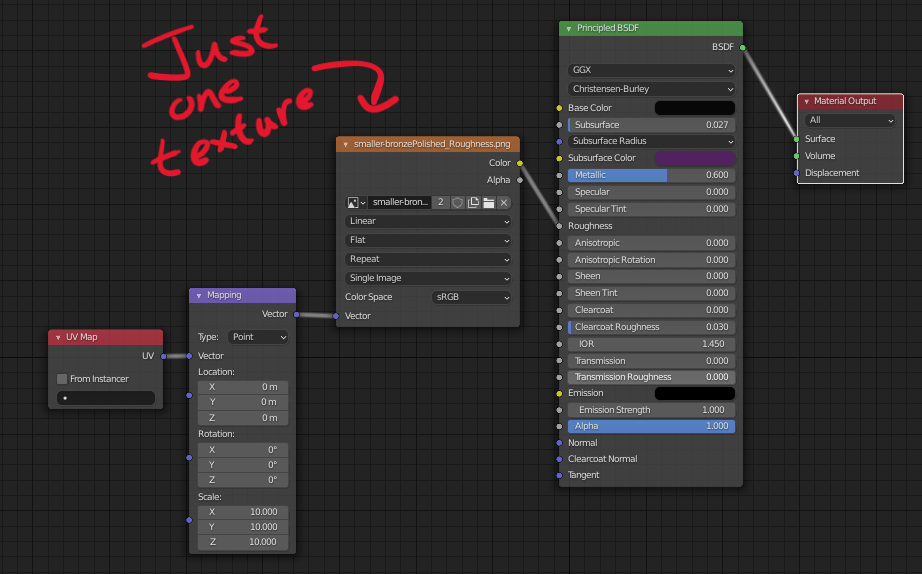
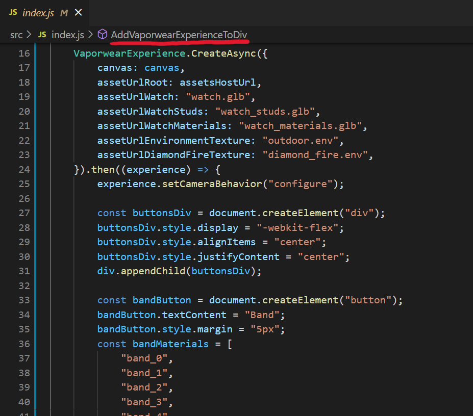
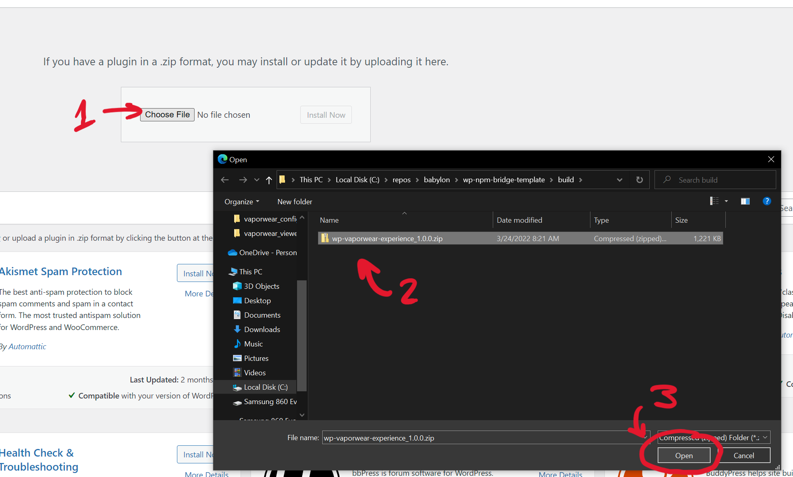

# babylon官方手册-引导学习-开发故事4-电子商务的 3D-定制体验
## 高级概述
在 [他们现有的电子商务网站中添加了简单的 3D ](https://doc.babylonjs.com/guidedLearning/devStories/vaporwearViewer) 并亲眼目睹了由此 [带来的客户体验的巨大提升](https://www.zdnet.com/article/2021-is-the-year-that-3d-and-augmented-reality-for-commerce-cashes-in/)之后，艾伦和巴纳巴斯（分别是 Vaporwear 智能手表公司的所有者和网站管理员）感到很兴奋。

公司正在成长，他们正在寻找方法来改进和区分他们的电子商务业务，他们知道他们几乎没有触及他们可以在 Web 上使用 3D 所做的事情的皮毛。在 Babylon.js [论坛](https://forum.babylonjs.com/c/demos) 上寻找灵感 ，Allan 找到了 Babylon Utility 允许无缝集成几种不同的相机行为，以获得“陈列室”体验。Allan 和 Barnabas 已经在讨论对他们的网站进行重大更新，以配合 Vaporwear 最新的虚构智能手表的发布。考虑到所有这些新机会，他们开始互相询问，`“以 3D 作为核心设计的一部分构建的电子商务网站会是什么样子，我们将如何创建它？ ”`

当然，这不是一个小目标，他们并没有期望他们能够在大约一个小时内将巴比伦查看器添加到他们现有的站点中。这个新的 Vaporwear 网站将从头开始构建，完全符合他们的业务所需：在定制的现代 Web 前端中的定制 3D 体验中的定制 3D 资产。创建这样一个网站需要 Vaporwear 长期员工所没有的专业知识，因此他们决定与三名自由职业者签约，组建一个团队来创建这个新网站。

- 卡洛斯，艺术家，他将创造 3D 视觉效果。
- 巴比伦的开发者 Diane 将 Carlos 的视觉效果打造为 3D 体验。
- Edie 是前端开发人员，他将借鉴 Diane 的 3D 体验并围绕它构建最终的 Vaporwear 网站。

在组建这个团队时，艾伦和巴纳巴斯知道雇佣合适的人是确保项目成功的最重要的事情，所以他们没有试图偷工减料：最好花钱去做不如花钱再做一次。此外，虽然三名团队成员不需要同时专注于 Vaporwear 网站，但艾伦和巴纳巴斯并没有犯错误，他们试图分批雇佣他们。找到合适的人最重要的后续行动是让这些人互相交谈，以便可以协调期望，就移交达成一致，并且 - 当在开发过程中不可避免地需要进一步讨论时 - 建立简单和熟悉的沟通。

因此，为了启动这个项目，Allan 在一次会议上召集了整个团队，他和 Barnabas 在会上阐述了他们对新 Vaporwear 网站的愿景。

- 该站点将被构建为包含查看和配置的单个页面。
- 当网站加载时，用户首先看到的是手表的整体视图，徽标逐渐淡入。
- 当用户滚动浏览网站并显示有关手表的信息时，3D 手表将转换为不同的状态以展示各种重要功能：表扣、表盘和整体设计。
- 当用户滚动到页面底部时，按钮会出现，手表渲染会无缝地成为一种交互式配置体验，用户可以在其中更改表带、面部等。
- 如果用户在配置后向上滚动页面，配置选项将保留。
- ...所有这些都应该在没有加载屏幕的情况下完成。

团队中的专家提出了他们的想法，提出了建议并讨论了挑战，很快他们就确定了网站的设计：简而言之，他们解决了[这个问题](https://syntheticmagus.github.io/vaporwear-react-site-deployment/)。

设计到位后，高层的前进道路就很清晰了。在整个开发过程中，他们五个人都可以互相联系（电子邮件等）来回答问题和解决困惑，但并不是所有的人都会一直积极地在 Vaporwear 网站上工作。Edie 的大部分工作将在她从 Diane 获得 3D 体验后开始，而 Diane 的大部分工作都依赖于 Carlos 的 3D 模型。因此，随着团队的集结和计划，新 Vaporwear 网站上的第一部分实际工作就是 [艺术](https://doc.babylonjs.com/guidedLearning/devStories/vaporwearConfigurator/art)。

## 第 1 章 - 艺术
### 简介：卡洛斯
首先，Carlos（3D 艺术家）花了很多时间与 Diane（Babylon 开发人员）交谈，以确保他们就艺术应该具有的功能达成一致。两人都认为视觉效果应尽可能由艺术直接决定；换句话说，艺术决策应该尽可能地由艺术工具中的艺术家做出，而不是由编程工具中的程序员做出。因此，他们最终决定应从艺术资产中控制以下主要组件：

- 主要手表资产本身的外观和行为。
- 所有配置选项的外观。
- 尽可能多地移动摄像机。
	- 在非交互式 `“matchmoving”` 状态下，相机的完整运动应该在艺术中指定。
	- 在交互式 `“弧形旋转”` 状态下，相机的关键参数如起始位置和焦点应在 art.
- “热点”的位置和可见性——可能被 2D UI（标签等）标记/跟踪的 3D 场景元素。
	- 热点的位置总是由艺术指定。
	- 在非交互式“匹配移动”状态下，由于相机位置的确定性，热点的可见性可以完全由艺术指定。
	- 在相机可能不可预测地移动的交互式 `“弧形旋转”` 状态下，艺术将指定关键参数，然后交互式体验可以使用这些参数来决定热点是否可见。

该功能列表也作为一个相当不错的路线图翻了一番。所以，有了一个适当的计划，卡洛斯开始创造......

### 主要手表资产
开发故事不是实施指南或教程，因此 Carlos 如何对主要手表资产进行建模的精确细节超出了本文的范围。相反，本节将提供有关 Carlos 在创建主要 Vaporwear 手表资产时所做的关键决策和实施选择的高级观点。

1. 文件大小

	Vaporwear 网站的设计规定，3D 渲染应该是网站启动时用户首先看到的内容。要做到这一点，第一次渲染中使用的 3D 模型必须很小；否则下载速度不够快，无法及时启动网站。因此，文件大小（作为下载时间的决定因素）成为主要手表资产的主要关注点。
	
	这是决定主要资产（这是初始渲染所需的全部）和附加资产（[配置选项](https://doc.babylonjs.com/guidedLearning/devStories/vaporwearConfigurator/art#configuration-options)）的主要动机等）应打包为单独的文件，可以在不同时间下载。这样，较大的资产（复杂的材料等）可以包含在辅助文件中，同时仍允许主资产文件保持尽可能小。
	
	
- 动画

	在网站的不同部分，手表应该采用两种不同的姿势：
	
	- “包裹”起来就像戴在手腕上
	- 平放“平躺”就像放在桌子上一样

	要在它们之间转换，手表需要动画。虽然他可以使用 glTF 支持的任何动画机制（他与 Diane 达成一致的文件格式），但他选择简单地装配手表并为其设置两个动画：一个“上升”，一个“下降” . 他甚至为动画添加了一点旋转，只是为了风格。
	
	
- 材料

	虽然主要资产的一个关键目标是通过将大部分材料留到稍后在另一个文件中下载来保持较小，但主要资产仍然需要包含它需要渲染的最少数量的材料。Carlos 特别注意确保包含在主要资产中的材料尽可能小，同时仍然看起来不错。
	
	
- Watch Face

	手表的表面应该是动态的，显示实际时间，Diane 告诉团队她会使用 Babylon 的 GUI 纹理在代码中处理这个问题。Carlos 仍然需要为表盘提供材质，但其中的纹理（特别是自发光纹理）将被 Diane 在运行时生成的 GUI 纹理简单地替换。因此，他可以使提供的表盘纹理变得尽可能小和无用，因为无论如何它永远不会在渲染中看到。
	
	
	
在处理主要资产时，Carlos 会定期检查资产是否会按照他在最终体验中的预期呈现方式。（他选择的工具 Blender 中提供的各种预览通常与 3D Commerce 认证的渲染器不同。）

他发现查看模型实际渲染方式的 `最佳方法`

- 是将其导出到 GLB`
- 然后拖动并将 GLB（连同他预期的IBL 照明）放入 Babylon 的 3D Commerce 认证版本的 Sandbox 中。

这不仅会以标准方式渲染模型，而且实际上会使用 Babylon.js 渲染它，这意味着在该沙盒中渲染模型的代码与在 Vaporwear 网站上的真实体验中渲染模型的代码相同。因此，通过使用该沙盒查看他的模型，他可以确定他以与客户最终看到的相同方式查看模型（动画和所有内容）

### 配置选项
Vaporwear 智能手表的配置选项基本上是客户可以定制的所有方式，因此 Carlos 必须与 Vaporwear 的 Allan 密切合作，以确保所有选项都可表示且看起来正确。可用选项如下：

1. 用户可以从多种类型的表带中进行选择。
- 用户可以从表盘的几种色调/饰面中进行选择。
- 用户可以选择在手表上添加四个宝石“饰钉”。
- 如果用户添加了螺柱，他们可以从多种颜色的宝石中进行选择。
- 如果用户添加了螺柱，他们可以从几种不同的金属中选择边框。

从艺术的角度来看，这些选项归结为两个基本操作：

- 向场景中添加单独的几何体（如果用户选择添加螺柱）。
- 在场景中交换几何体上的材质。

Allan 还告诉 Carlos，Vaporwear 可能会在以后添加新的螺柱配置或者新类型的表带等，他应该考虑到这一点来设计他的艺术方法。出于这个原因，Carlos 决定在自己的文件中添加额外的“螺柱”几何图形，然后再添加一个基本上只包含材料的文件；这样，以后只需继续制作第一批资产时建立的模式，就可以添加更多的附加几何图形或附加材料文件。

### “螺柱”加法几何
创建“螺柱”资产非常简单，只有一些值得注意的“技巧”。

1. 动画

	“studs”资产将与主资产分开导入，但在视觉上它需要附加到主资产，包括在制作动画时。为了完成这项工作（Diane 不必稍后在代码中更改一堆偏移，这将涉及做出艺术决策），所有 Carlos 需要做的就是在没有动画时将螺柱建模在相对于手表位置的正确位置应用. 因为 Carlos 最初对手表进行了平面建模，然后对其进行了装配并从那里进行动画处理，这意味着他需要在手表平面时将螺柱建模在相对于手表的正确位置。只要他的偏移正确，Diane 以后要做的就是将螺柱连接到手表骨架的正确骨骼上，并且螺柱应该正确定位自己并随着手表骨架的动画而动画。

	
- 实例化

	四个“螺柱”是相同的，这为 Carlos 提供了一个机会来稍微提升资产的最终渲染性能。 [实例化](https://doc.babylonjs.com/divingDeeper/mesh/copies/instances) 是一种允许渲染器非常有效地渲染相同网格的多个副本的技术，并且在 Blender 中，通过简单地 [创建链接对象](https://doc.babylonjs.com/divingDeeper/mesh/copies/instances#blender) 很容易指定实例化，因此 Carlos 使用螺柱来帮助它们更有效地渲染。
	
	
- 材料

	与主要资产一样，创建 “studs” 资产是为了包含特定的几何图形，而不是材料集合，因此 Carlos 在其中只包含了它使用的每种材料中的一种——一种宝石材料，一种表圈材料——用作几何体的默认材质。附加材料将用于材料交换配置，因此它们将与其他附加材料一起包含在专用附加材料文件中。
	
同样，Carlos 确定其模型将如何渲染的最佳方式是将其导出到 GLB 并在 Babylon 3D Commerce 认证的 Sandbox 中查看。他甚至可以使用 [Inspector](https://doc.babylonjs.com/toolsAndResources/tools/inspector) 修改宝石材料，以预览其他材料的外观。

### 附加材料文件
材料通常是决定渲染模型外观的最重要因素。它们通常也是迄今为止 3D 资产文件大小中最大的部分。Vaporwear 想要作为配置选项的几种材料，特别是表带，质量非常高，因此非常大。因为这些材料被捆绑到一个单独的文件中，所以它们不会延迟体验，因为它们可以在后台异步下载。即便如此，Carlos 仍然注意文件大小，并在不牺牲视觉质量的情况下使用他可以使用的技巧来最小化兆字节。

1. 几何

	保持文件较小的最简单的步骤是确保材料文件中的几何最小。几何不是那个文件的重点——它有几何的唯一原因是材料可以继续下去——所以卡洛斯把几何保持在简约的单四边形平面上。这对文件大小没有太大 影响，因为几何图形通常比纹理要小得多，但最好不要浪费空间。
- PBR 参数

	当这些纹理可以被设置参数有效地替换时，一个更有影响力的措施是排除某些纹理。例如，Vaporwear 想要用于表带的一些材料最初带有 PBR 纹理，实际上都是一种纯色。Carlos 只需将他的材质设置为使用常量值而不是纹理，就能够完全排除此类纹理。他再次向 Vaporwear 确认这样做不会对渲染产生负面影响，但在每种情况下他们都无法辨别出差异。
	
	
- 纹理分辨率

	Carlos 用来管理文件大小的最后一个也是最强大的技巧是更改 PBR 纹理的分辨率。他必须小心这样做，因为这很容易 通过丢失细节来降低视觉质量。然而，许多材质从未被期望从非常近的地方观察，最终 Carlos 能够将每种材质纹理的分辨率至少降低一定数量。
	
	
- （附录：另一个值得尝试的技巧是使用 JPEG 而不是 PNG 作为纹理文件。这是一个必须谨慎使用的技巧，因为 JPEG 压缩有时会以有问题的方式降低纹理的质量；但是当它起作用时，尤其是在较大的纹理上，它可以提供显着的尺寸优势。这是作为附录提到的，因为 Carlos 可能应该与他的其他优化技术一起尝试它，但他没有，因为碰巧，他根本没有想到它。）

即使使用了所有这些技巧，附加材料文件最终仍高达 15 兆字节，太大而无法在 Web 体验的前台加载，但对于在后台加载是可以接受的。和以前一样，Carlos 使用 Babylon 的 3D Commerce 认证沙盒仔细检查了材料的渲染方式。材料做完了，他现在已经完成了所有可以看的美术作品；接下来他需要决定如何看待艺术。

### 相机运动
新的 Vaporwear 体验需要两种类型的摄像机运动：

- 与“轨道上”摄像机相媲美的非交互式“匹配移动”摄像机运动；
- 和交互式“弧形旋转”相机运动，允许用户随意从不同角度查看模型。

尽管这两种类型的运动需要不同的参数，但对于 Carlos 来说，两者都相对容易在 Blender 中进行设置。

1. 要创建 `“matchmoving”` 摄像机运动，Carlos 所要做的就是在他的场景中添加一个空变换（有时称为“null”）并创建一个动画，以他希望摄像机移动的方式移动它。他甚至发现他可以将 Blender 相机附加到移动节点上，让他直接看到运动，并且该相机将作为他需要的空变换简单地导出到 glTF。Vaporwear 体验包含四种不同的“匹配移动”摄像机运动状态，因此 Carlos 最终得到了四个命名为空的变换，每个变换都有一个移动它的动画。	

	
- 为“arc-rotate”相机状态创建参数并不那么精确——该状态下的相机是交互式的，所以它的运动不能完全由艺术指定——所以 Carlos 必须决定的是相机及其焦点。对于后者，他创建了另一个名为空变换来标记他希望相机绕其运行的点；至于起始位置，他实际上希望它与 `“matchmoving”` 相机运动之一的起始位置相同，因此为 `“matchmoving”` 状态提供位置的相同空变换也用于指定起始位置对于“弧形旋转”状态。

	
	
重要的一点是，这些摄像机运动是作为主要资产 GLB 的一部分导出的，而不是附加的几何图形或材质 GLB。这是必要的，因为在体验设计中，只要看到手表，相机就会开始移动，因此需要将相机移动动画作为主要资产的一部分。值得庆幸的是，这种数据的文件大小很小，因此将相机运动空变换和动画添加到主要资产不是问题。

### 热点
热点是 3D 场景中可以跟踪的兴趣点，以便 2D UI（标记、标签等）可以连接到 3D 场景中的特定位置。

Vaporwear 网站的设计具有三个热点，

- 其中两个在 `“matchmoving”` 状态下可见
- 一个在 `“arc-rotate”` 状态下可见。

将这些 3D 兴趣点转变为 2D 热点的实际跟踪是 Diane 用 babylon 代码完成的；Carlos 所要做的就是指定这些热点在哪里以及何时应该可见。

1. 指定热点的位置很容易：对于三个热点中的每一个，Carlos 只需创建一个命名为空的变换来标记兴趣点。

	
- 在 `“matchmoving”` 状态下指定热点的可见性也很简单。因为相机的运动完全由这些状态下的动画决定，所以 Carlos 还可以使用动画来描述每个热点何时可见。

	在每个热点下，他添加了另一个命名为空的变换，然后创建了一个动画来沿 X 轴移动该变换以指示可见性。
	
	- 如果空变换的局部位置的 X 值为 0，那么热点不应该是可见的；
	- 如果 X 值为 1，那么热点应该是可见的。

	因此，只要热点动画与摄像机移动动画同步，Diane 只需检查可见性指示器的本地位置即可确定热点是否可见。
	
		
- 必须以不同的方式指定处于“弧形旋转”状态的热点的可见性，因为该状态下的相机运动将由用户驱动，而不是由动画驱动。Carlos 和 Diane 考虑了几种不同的方式来表征可见性，他们最终决定使用阈值点积来描述热点在其中可见的“锥体”：
	- 如果从热点到热点的方向之间的点积相机和空的 X 轴低于某个阈值，热点将被视为不可见。
	- 再一次，Carlos 添加了一个命名的空变换，其父节点是热点本身，并使用该变换的局部 X 位置来指定点积阈值。
	
	
	
与摄像机运动一样，这些热点参数被添加到主资产文件中：它们非常小，可能在体验的早期就需要。随着这些热点的加入，Carlos 现在拥有了 Vaporwear 体验所需的所有艺术功能；最后一次在 Babylon 的 3D Commerce 认证沙盒中检查了所有三个 GLB 都包含了他们应该拥有的所有东西（并且只有他们应该拥有的东西）并按照他想要的方式呈现后，Carlos 将 GLBs 传递给 Diane 以合并到 [3D新 Vaporwear 网站的一部分](https://doc.babylonjs.com/guidedLearning/devStories/vaporwearConfigurator/3d)。

## 第 2 章 - 3D
### 简介：黛安
作为将 Carlos 的艺术与 Edie 的 Web 前端连接起来的“桥梁”，Diane 在构建 3D Vaporwear 体验时的首要任务是与她的两位同事建立“合同”：

- 她与 Carlos 一起研究艺术将为她提供哪些功能。 她与 Carlos 的对话在[前一章](https://doc.babylonjs.com/guidedLearning/devStories/vaporwearConfigurator/art)中有所描述；
- 她与 Edie 讨论了前端想要3D 体验需要消耗哪些 API，而她的 3D 体验需要提供。Edie 总结了自己的要求说：“我不是 3D 专家，我不应该为了整合你的体验。我可以使用你制作的任何类似 Web 的 API，但是我不需要知道你是怎么做到的。”

因此，Diane 的目标是利用 Carlos 在艺术领域提供的功能，添加交互性，然后将整个体验封装到一个无需 3D 艺术或编程知识即可使用的包中。为此，她决定使用 Babylon 的 Template Repository Workflow 来构建她的体验 ，以便她的体验将自动构建为 NPM 包，这反过来又便于 Edie 稍后将其添加到她的前端。

### 设置存储库
Diane 将她的项目开发结构建模为《 [Fruit Fallin'](https://doc.babylonjs.com/guidedLearning/devStories/fruitFalling)》游戏，因为这两个项目都试图将巴比伦的体验封装到 NPM 包中，以便在单独的“运输工具”中消费。

1. 因此，她首先创建了一个 NPM 包 repo 和一个资产托管 repo，如 Fruit Fallin' Dev Story 的 [第一](https://doc.babylonjs.com/guidedLearning/devStories/fruitFalling#moving-playground-code-into-a-development-repo) 和 [第二](https://doc.babylonjs.com/guidedLearning/devStories/fruitFalling#creating-an-asset-host-repo) 部分所述（尽管她没有 Playground 可以迁移，因此她创建 NPM 包的过程repo 与Fruit Fallin 的方法不同，类似于 [Showroom Camera repo](https://doc.babylonjs.com/guidedLearning/devStories/showroomCamera#creating-the-repository) 的不同。）

	
- 她一有 Carlos 的艺术资产可用就将其添加到她的资产托管存储库中。

	
- 通常此时，Diane 会尝试使用 [gltfpack](https://www.npmjs.com/package/gltfpack) 等面向开发的工具来压缩 3D 资产的文件大小， 以利用 [KTX2](http://github.khronos.org/KTX-Specification/#basisu_gd) 和 [Draco](https://google.github.io/draco/) 压缩等技术。然而，在这种特殊情况下，这不会有帮助。Carlos 的艺术已经非常轻几何（并且包括网格优化可能不考虑的特定节点结构），使得 Draco 压缩不是主要因素，并且在材质中大量使用详细的法线贴图将发挥 KTX2 的弱点。她很高兴自己熟悉这些工具，但对于这种特殊情况，她决定不使用它们。
- Diane 选择使用她的 NPM 包 `repotest_package` 作为测试环境，该环境后来兼作演示页面（类似于 `test_package` 在 `Fruit Fallin` 和 `Showroom Camera `中的使用）。因为 3D Vaporwear 体验应该占据最终站点中的整个网页（有时会叠加元素），所以 Diane 将她`test_package` 的  `index.js` 更改为更接近于这种用法。

	

	现在设置了存储库，可以开始研究 Vaporwear 3D 体验的真实功能。

	注意：因为开发故事不打算作为编码教程，所以以下部分掩盖了实现细节，以便以非常快的速度移动。有关如何完成任何特定功能的具体信息，可以直接在代码中检查实现，并且在[论坛](https://forum.babylonjs.com/c/questions)上总是非常欢迎具体问题。
	
### 实现手表
Vaporwear 3D 体验（是销售手表的电子商务网站的一部分）最重要的部分当然是手表本身的模型。因此，Diane 选择在拥有手表模型后立即解决的第一件事就是获得导入和可见的模型。

1. 让手表显示的第一步是下载它。			

	
- 当 Babylon 导入包含动画的 glTF 时，它会自动开始播放它找到的第一个动画。由于 Diane 知道她最终将需要使用所有动画，因此她继续缓存对所有动画的引用，并确保它们以正确的状态开始。

		
	
	Carlos 在交付艺术作品时向她提供了动画的名称以及其他细节；但是，她也可以通过将 GLB 拖入 Babylon 的 [3D Commerce 认证沙盒](https://3dcommerce.babylonjs.com/?assetUrl=https://syntheticmagus.github.io/vaporwear-assets/watch.glb) 中来查看和测试它们。
- 为了避免等到以后再担心相机，Diane 刚 ArcRotateCamera 开始使用。有了这一点，再加上对场景的一些小调整，比如将透明颜色设置为白色，黛安就有了最基本的手表渲染版本。

	
- 但是，这并不是使用 3D Commerce 认证的设置进行渲染的。为了解决这个问题，Diane 只需要添加 [Babylon 文档](https://doc.babylonjs.com/divingDeeper/3D_commerce_certif#certified-viewer-version-based-on-babylonjs-engine)中描述的两个代码片段。

	
- 现在手表呈现默认状态，下一步是启用其他状态。Vaporwear 网站的设计要求 3D 体验在网站的不同部分有五种不同的行为，因此 Diane 将这个概念形式化为状态枚举，其中 Showroom（体验的主要逻辑容器）改变了手表的行为（状态改变时激活正确的动画等）。

	
- 为了能够测试这种行为，Diane 添加了一个 `createDebugUI` 函数 `Showroom`，允许使用 Babylon GUI 界面控制应用程序

		
- 最后，Diane 使用 Babylon 的 GUI 和一个简单的协程机制添加了动态表盘来更新文本。

	

此时，Diane 仅使用 Carlos 提供的主要资产文件中可用的内容，让手表按应有的方式（无相机移动）进行渲染。要使用其他两个文件

- `“studs”`文件
- 和 `“materials”` 文件

#### 启用配置
关于 Vaporwear 3D 体验的配置最棘手的部分是加载资产。Carlos 曾警告 Diane，特别是材质文件会很大，按照 3D 艺术标准，15 兆字节并没有 那么大，但在加载如此大的资源时仍然需要一些小心和技巧，而不会导致严重的性能问题或需要加载屏幕。最后，Diane 选择了一个两步技巧来加载配置资产，之后启用它们就非常简单了。

1. Diane 加载技巧的第一部分是延迟加载配置资产，直到体验首次进入其“配置”状态。由于 Carlos 将主要资产构建为自给自足，因此体验实际上并不需要配置资产，直到配置点。然而，将这些资产加载到 Babylon 场景中仍然会导致明显的性能问题（主要是帧率下降或“卡顿”），因此黛安必须谨慎选择何时加载，这样“卡顿”就不会那么明显。

	Vaporwear 体验设计的一个怪癖是，在 5 个状态中的 4 个状态（除了配置之外的每个状态）中，相机总是在移动，因此任何帧率问题都会非常明显。因此，黛安不希望在第一次体验中相机保持静止之前进行实际加载，这就像体验首次进入用户将控制相机的“配置”状态一样。因为相机不会自行移动，所以帧率“卡顿”不应该像在体验中的任何其他时间那样明显或有问题。
	
	因此，为了隐藏加载中的“障碍”，Diane 引入了一种机制，使加载配置资产成为首次进入“配置”状态的最后一步。不会自行移动，帧速率“搭便车”不应该像在体验中的任何其他时间那样明显或有问题。因此，为了隐藏加载中的“障碍”，Diane 引入了一种机制，使加载配置资产成为首次进入“配置”状态的最后一步。不会自行移动，帧速率“搭便车”不应该像在体验中的任何其他时间那样明显或有问题。因此，为了隐藏加载中的“障碍”，Diane 引入了一种机制，使加载配置资产成为首次进入“配置”状态的最后一步。
	
	
- 但是，这种方法的副作用是第一次进入“配置”状态会稍微延迟；虽然这比可见的帧率下降要好，但 Diane 仍然希望尽可能缩短此延迟。这导致了她加载配置资产的两步技巧的第二部分：使用 `JavaScriptfetch`方法预取它们。这实际上不会使下载的资产直接可供 babylon 使用，因为它不会调用任何 babylon  API。但是，它会导致浏览器继续下载文件并将它们存储在缓存中；这样，当 babylon 后来对这些相同的文件（在某些情况下为 15 Mb）发出 Web 请求时，这些请求将是 15 Mb 的缓存命中而不是 15 Mb 的网络下载。

	
- 除了加载之外，启用配置的唯一稍微复杂的部分是确保导入的“螺柱”网格连接到正确的骨骼。
	- 在咨询了 Carlos（他帮助地将正确的骨头命名为“Bone”）之后，Diane 简单地将她的手表抽象缓存从对那块骨头的引用中提取出来……
	
		
	- ...并提供一种[简单的方法](https://doc.babylonjs.com/divingDeeper/mesh/bonesSkeletons#attaching-a-mesh-to-a-specific-bone)将“螺柱”连接到它	

		
- 根据需要加载和设置所有资产后，启用配置只是启用/禁用“螺柱”几何图形的问题......

	
- ..并在命名网格上设置命名材质，Diane 选择将其公开为一个简单的辅助函数，如果以后添加更多材质，则不需要扩展。

	
- 最后，Diane 将 GUI 元素添加到测试 UI 以允许她测试新的配置选项

	

### 实现相机
完成 Vaporwear 3D 体验所需的最后一个功能是相机。Babylon Utility 中相机行为的大部分复杂性都内置在 [Showroom Camera](https://doc.babylonjs.com/guidedLearning/devStories/showroomCamera) ，控制相机的细节已经内置到 Carlos 的主要资产文件中。真正剩下的就是把各个部分连接起来，但这仍然是一个包含几个步骤的过程。

1. 首先，Diane 需要将 Babylon Utility 的`Showroom Camera` 添加为 NPM 依赖项，以便她可以使用它。

	
-  `ArcRotateCamera` 

	她用 `ShowroomCamera.` 给那个相机一个单一的弧形旋转状态会导致它的行为完全像一个 `ArcRotateCamera`.
	
	
- 然而，为了获得完整且正确的相机行为，Diane 需要为每种不同的行为创建相机状态。由于体验中有五种不同的相机行为，她需要五种不同的状态：
	- 四个 `TransformNode` 来自主要手表资产的 `matchmoving` specific s，
	- 然后是一个使用“整体”`matchmoving` 状态的起始位置的弧形旋转状态。

		
			
	这就是黛安开箱即用的方法，但它立即……并没有像她想象的那样奏效。稍后，她发现...
- ... Carlos 的艺术资产的细微差别是它们是在 Blender 中创建的；虽然 Babylon 的相机默认朝 Z 正方向看，但 Blender 的默认情况下朝 Y 负方向看。

	Carlos 已经设置了他的相机变换节点以适用于他正在使用的工具，但是当相机设置为跟随 Babylon 的相同节点时，结果是相机朝向错误的方向。Diane 意识到，这只是让两个工具一起工作时总是发生的那种轻微的自然问题。
	
	虽然她考虑要求 Carlos 改变艺术以符合 Babylon 的惯例，但对他来说，反而，做一些在他自己的工具中没有意义的事情似乎是不合逻辑的。

	
- 解决了这个问题，剩下的就是将相机设置为在陈列室改变状态时转换到正确的状态......

	
- ...并创建一种机制来跟踪和报告“热点”位置。对于匹配移动状态“热点”，这很简单：将热点 `TransformNodes` 的位置重新投影到屏幕上，并根据动画控制的“热点可见性” `TransformNode` 的位置报告可见性：

	
	
	对于弧形旋转状态“热点”，它稍微有点棘手——可见性必须由针对“热点可见性” `TransformNode` 位置阈值的点积确定，如 [Carlos 章节的相关部分所述](https://doc.babylonjs.com/guidedLearning/devStories/vaporwearConfigurator/art#hotspots)——但是数学是一样的
	
	
	
	对于所有三个“热点”，Diane 选择将结果简单地公开为公共状态，并在状态发生变化时通知那些感兴趣的人
	
		
- 而且，就这样，Vaporwear 3D 体验功能齐全
	
	
	
### 前端消费封装
最后，是时候准备将 Vaporwear 3D 体验移交给 Edie 以集成到新站点中了。为此，Diane 需要做的就是将 3D 体验封装在一个类似 Web 的 API 中，该 API 公开了调用所有功能的简单方法。她已经添加了一个带有两个函数的 `vaporwearExperience.ts` 文件, 

- `CreateAsync` 
-  `createDebugUI`

她一直在从 `test_package` 站点调用，如 `Fruit Fallin' Dev Story` 中的模式所示，所以她决定通过添加来扩展它其余功能的调用机制。

1. 对于大多数功能，Diane 决定只使用基于字符串的调用，因为它很简单。

	
- 对于“热点”，Diane 选择模仿 `addEventListener DOM` 中的模式。这需要对内部报告“热点”状态的方式进行一些小的调整，但并不多，而且它还提供了一个方便的位置，可以在加载配置选项时添加事件通知。（Edie 请求了第二个事件，以便在加载所需资产之前隐藏配置选项。）

	
- 相机参数设置实际上并不是 Diane 交付给 Edie 的 NPM 包的第一个版本的一部分；相反，它们是后来应要求添加的，因为 Edie 希望通过按钮控制缩放，以便保留鼠标滚轮用于滚动页面。

	
- 最后，是时候让 Edie 将 Vaporwear 3D 体验集成到她的前端了。根据 Edie 的要求，Diane 通过将体验发布为 [私有 NPM 包](https://docs.npmjs.com/creating-and-publishing-private-packages) 来做到这一点，这将使 Edie 可以轻松地在她的 React 应用程序中依赖它 。

	
	
至此，Diane 在 Vaporwear 3D 体验方面的工作就完成了。在 Edie 整合新体验的同时，她仍然可以回答 Edie 的问题和现场请求；而且，如上所述，Edie 确实提出了 Diane 在后续版本中添加的一些具体要求。Vaporwear 体验作为 NPM 包发布的事实使得处理这个更新过程变得很容易——发布和更新与任何其他 NPM 包相同——不久之后，Edie 能够分享回给 Diane 和 Carlos 的链接显示 了正在运行的全新 [Vaporwear 电子商务网站](https://doc.babylonjs.com/guidedLearning/devStories/vaporwearConfigurator/frontend) 。	
## 第 3 章 - 前端
### 简介：伊迪
根据 Vaporwear 的 Allan 和 Barnabas 的声明，他们想要一个“定制的、现代的 Web 前端”，Edie 很快就决定使用 React.js 构建他们的新网站。事实上，虽然设计的 3D 部分是 Edie 从未遇到过的类型和范围，但网站本身根本不需要复杂：根据她与 Diane 的讨论，网站的 3D 部分将显示为一组文件和一个私有 NPM 包。总的来说，这听起来很简单，并且可以与典型的 React.js 开发工作流完美配合。
### 设置站点
新 Vaporwear 网站的“网站”部分似乎不需要任何特别的东西——如果有的话，它是现代单页应用程序的一个相当简单的例子——所以 Edie 能够设置一个粗略的草稿甚至在收到 3D 组件之前，通过非常密切地遵循 [React.js 自己的教程](https://reactjs.org/tutorial/tutorial.html)。

1. 安装 react 组建
	
		npx create-react-app vaporwear-react-site
- 使用来自 Vaporwear 的 Allan 提供的文件中的徽标，Edie 为简单的页眉和页脚栏创建了组件

	
- 同样，她添加了标题和“署名”组件的快速草稿，后者将包含艾伦要求的特定文本标注。

	 
- 由于她还没有 3D 组件，并且不确定它们会采用什么形式，因此她决定暂时不为此创建组件，而是使用占位符来保留它的位置。

		
- 在草稿网站正常运行的情况下，她可以 使用 [gh-pages](https://www.freecodecamp.org/news/deploy-a-react-app-to-github-pages/) NPM 包轻松地在 [GitHub](https://syntheticmagus.github.io/vaporwear-react-site-draft/) 页面上托管该网站， 以便人们在阅读它作为某种文档叙述的一部分时可以看到它正在运行。不过，这是一个承包项目，她绝对不会那样做	
	

当然，这只是网站的粗略草图，不包括任何 3D 元素。它展示了所有主要的概念和组件，但很乏味；Edie 自己也很想知道，一旦她能够整合 3D 体验，它会变得多么活跃。

### 整合 3D 体验
1. 当 3D 体验准备就绪时，它以私有 NPM 包和少量 3D 艺术文件的形式出现。关于这些文件，Diane 曾说过，“只需将它们放在可访问的地方并告诉如何找到它们即可”，因此 Edie 开始将所有文件放入她的应用程序 `public` 文件夹中。		
	
- 接下来，她安装了私有 Vaporwear Experience NPM 包

		npm install @syntheticmagus/vaporwear-experience
- ...并创建了一个组件来容纳上述体验

	
- 从 Edie 的角度来看，Babylon Experience 组件的核心是 `HTMLCanvasElement3D`  体验将在其上显示。此画布只能在站点底部的“配置”模式下进行交互，但在整个站点的背景中可见，因此 Edie 将其画布设置为具有固定定位的全页宽度和高度。

	
- 有了可用的画布和 3D 资产，Edie 能够创建一个 `VaporwearExperience` 并第一次在她的草稿站点中看到 3D 渲染

	
- 她添加了一个事件监听器来处理“热点”位置的更新......

	
	
	
- ...将应用程序状态与滚动位置挂钩..

	
- ...并创建了自定义 UI 以在配置状态下启用配置

	
- 其他元素需要调整以适应新行为，并且随着网站的成熟，某些视觉选择也会发生变化。然而很快，所有请求的功能都启用了，并且所有请求的文本都已添加（至少 Vaporwear 公司没有忘记提供它），并且 App.js 的最终迭代甚至比以前更加精简在草案中。

			 
- 因此，终于，新的 Vaporwear 电子商务网站已准备好部署 在 Vaporwear 公司的生产质量服务器上，这些服务器绝对与 [GitHub Pages](https://syntheticmagus.github.io/vaporwear-react-site-deployment/) 没有任何关系。

		
	
该网站已完成；合同结束了。Carlos、Diane 和 Edie 都决定保持联系并希望再次合作，Allan 对新的 3D 驱动的 Vaporwear 网站感到无比激动。巴纳巴斯也很高兴，虽然伊迪的印象是，当他看到新站点时， 巴纳巴斯确实对[旧站点](https://doc.babylonjs.com/guidedLearning/devStories/vaporwearConfigurator/wordpress)感到有些遗憾。	

## 奖励章节 - WordPress
关于演示的注意事项：对于大多数开发故事，我们尝试使开发故事中的实际可用产品可供读者直接探索。然而，这个开发故事中的网站是使用 WordPress 构建的，托管起来很复杂（有时成本很高），所以很遗憾，我们无法无限期地保持它的运行。取而代之的是，demo上面的链接会将您引导至显示该网站正在运行的视频，而该 source 链接将指向一个包含 WordPress 网站原始文件的压缩文件。
### 简介：巴拿巴
Barnabas 是一个多愁善感的人，他并不为此感到羞耻：他确实为基于 WordPress 的旧 Vaporwear 网站感到有些遗憾，因为新的 React.js 网站的 3D 体验要复杂得多。但更实际的是，他也知道切换站点的过程需要一点时间，所以即使在新站点“完成”后，旧站点至少还能再运行一两个月。考虑到这一点，Barnabas 向 Allan 提出了一个想法：如果他们可以采用为新 React.js 站点开发的相同 3D 体验并将其合并到他们的旧 WordPress 站点中会怎样？“艾伦告诉他 "去吧，”
### 在 WordPress 中使用 NPM 包
Diane 已将新的 Vaporwear 3D 体验构建到 NPM 包中，这使得添加到大多数现代 Web 工作流程中变得非常容易。然而，在 WordPress 中使用 NPM 包有点棘手：WordPress 并非旨在与现代 Web 工作流程一起使用，并且基于 PHP，自然不适合与 JavaScript 开发实践一起使用。在寻找一种将基于 NPM 的功能引入 WordPress 站点的好方法之后，Barnabas 发现了一个 [WordPress NPM 桥接模板](https://github.com/syntheticmagus/wp-npm-bridge-template) ，它提供了一种简单的方法来获取基于 NPM 的 JavaScript 代码并将其捆绑到自定义 [WordPress 插件](https://en.wikipedia.org/wiki/WordPress#Plugins)中。

1. 首先，Barnabas 使用[开发故事](https://doc.babylonjs.com/guidedLearning/devStories/fruitFalling#a-more-step-by-step-journey-through-the-process)中描述 的相同方法 从 [WordPress NPM 桥模板](https://github.com/syntheticmagus/wp-npm-bridge-template)创建了一个新的存储库，用于启动 babylon 的模板存储库工作流。

	
- Barnabas 的计划是创建一个插件，让他可以使用自定义 短代码插入新的 [Vaporwear 3D 体验](https://wordpress.com/support/shortcodes/)。他从模板制作的新仓库展示了如何做到这一点的示例；要开始，他必须修改 [插件 PHP 文件](https://github.com/syntheticmagus/wp-npm-bridge-template/blob/9f8810bb8f6357d9af1c3d5bc6ae326bd26b7419/wp/wp-npm-bridge-template/wp-npm-bridge-template.php) 以删除默认值。	
	
		
- 由于他基本上更改了所有内容的名称，因此他也需要修改 `package.json` 文件

	
- 这个简单的版本并没有真正做任何有意义的事情，但他确实想检查它是否有效。因此，他建造了他迄今为止所拥有的……

		npm run build
	- ...将其添加到旧的 Vaporwear WordPress 网站...		
			
	- ...并尝试使用新的vaporwear-experience简码

		
	- 成功

			
		
### 创建 VaporwearExperience WordPress 插件
1. 在插件仓库的根目录下，Barnabas 添加了 Diane 的 3D Vaporwear 体验 NPM 包。

	
- 接下来，他替换了他的“你好，世界！” 在他的 PHP 文件中调用自定义函数的代码

	
- 最后，他定义了他从 index.js 中的 PHP 文件调用的自定义函数。他的实现基于 Edie 将相同的 NPM 包集成到新的 Vaporwear 站点，当然他没有使用 React.js 来制作 UI。他也不想在体验中使用 `“matchmoving”` 状态，因为 WordPress 网站的设计并没有真正适合它们，所以他直接跳到配置状态。	

	
- 为简单起见，他重用了他从原始 [Babylon Viewer 集成](https://doc.babylonjs.com/guidedLearning/devStories/vaporwearViewer)中创建的资产主机来托管其余资产

	
- 然后他构建了插件......

		npm run build
- ...卸载旧版本并用新版本替换它..

				

	
- 完成

	

最后，总结了全新改进的 Vaporwear 电子商务体验的故事，该体验从头开始构建，并考虑了 3D。Allan 和 Barnabas 不仅能够创建一个具有 3D 查看器/配置器作为旗舰功能的全新站点，而且他们甚至能够采用相同的配置器并在另一个站点中使用它。

Barnabas 很高兴,新站点正在被采用，甚至旧站点也得到了显着改进,他将 新 WordPress 功能的简[短屏幕截图](https://syntheticmagus.github.io/vaporwear-original-asset-host/vaporwear_wp_with_configurator.mp4)发送给了 Allan。不过，艾伦并没有立即看到它。他再次出现在 [论坛](https://forum.babylonjs.com/c/demos/) 上 ，查看社区演示并想知道 3D 是否可以为他的电子商务业务做更多的事情		
		

			
						

				
	
	
		

			
				

		

	
	

