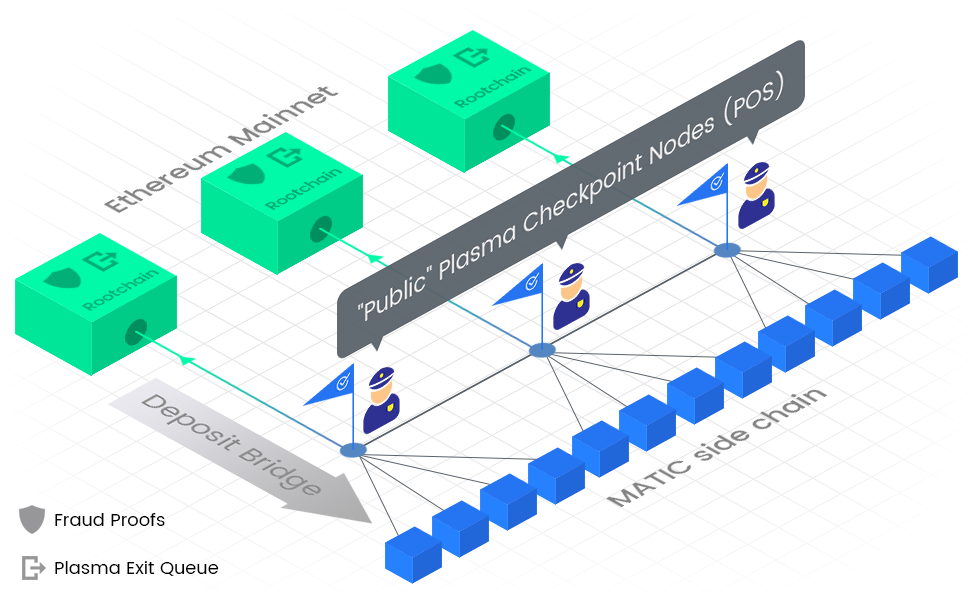

# Polygon 简介
## MATIC 2022年4月1号 币价 1.587
- [gas price](https://polygonscan.com/gastracker)
	- 30-50 Gwei

1559 是一个tx 做多件事

- erc 1559？
	- [单笔交易](https://polygonscan.com/tx/0xe97d926a4f3ae4e0495a634a70c401fda8c849e0c494a5040b84498483dea4d5)
		- gas 消耗
			- 134,103
		- 交易价格
		
				0.004148349036559395 MATIC ($0.01)
## 交易查询
- erc 721
	- [一次铸造多个铸币](https://polygonscan.com/tx/0xf1f90301f2340518ae7f170b24d3629bb5342d374cac7dcbe4fe03a402286a83)
		- gas 消耗 
			- 523,168	
		- 价格

				0.015834456365885184 MATIC($0.03) 
	- [单笔交易](https://polygonscan.com/tx/0x7149acd26883d13f569520d640c97061f4244ae7fe2cd96574fcc567d6870c56)
		- gas 消耗
			- 62,457 
		- 价格
		
				0.001877578403268705 MATIC ($0.00)
- erc 1155
	- [铸造](https://polygonscan.com/tx/0x477125b8a0ced46ce5c689b69358e0cc42a17761c530b1fa76f4fbff973cd2ad)
		- gas 消耗
			-  84,949,023
		- 价格
				
				0.160051396500394983 MATIC($0.25)
	- [交易](https://polygonscan.com/tx/0xb24c79d67e3f1a7ea5c03e5fbb180e0cd60f2f036e32bf506a600efddbf21dcb)
		- gas 消耗
			- 89,592
		- 价格

				0.005966827199820816 MATIC ($0.01)  			
				
## 什么是 Polygon
Polygon 是公共区块链的扩展解决方案。基于 Plasma 框架 (Plasma MoreVP) 的改编实现 - 基于帐户的实现（[在此处](https://ethresear.ch/t/account-based-plasma-morevp/5480)阅读更多内容），Polygon 支持所有现有的以太坊工具以及更快和更便宜的交易。

Polygon是第 2 层扩展解决方案，它通过利用侧链进行链下计算来实现扩展，同时使用 Plasma 框架和分散的权益证明 (PoS) 验证器网络确保资产安全。

[Polygon](https://polygon.technology/) 致力于解决可扩展性和可用性问题，同时不影响去中心化并利用现有的开发者社区和生态系统。Polygon 是一种适用于现有平台的离线/侧链扩展解决方案，可为 DApp 和用户功能提供可扩展性和卓越的用户体验。

### 主要特点和亮点#
- 可扩展性：Polygon 侧链上的快速、低成本和安全的交易，最终在主链和以太坊上实现，作为第一个兼容的第 1 层基础链。
- 高吞吐量：在内部测试网的单个侧链上实现了高达 10,000 TPS；要添加多个链以进行水平缩放。
- 用户体验：流畅的用户体验和从主链到 polygon 链的开发者抽象；支持 WalletConnect 的原生移动应用和 SDK。
- 安全性：polygon 链运营商（矿工？）本身就是 PoS 系统中的质押者。
- 公共侧链：polygon 侧链本质上是公共的（相对于单个 DApp 链），无需许可且能够支持多种协议。
- Polygon 系统经过精心设计，可支持支持 EVM 的 Polygon 侧链上的任意状态转换。

### polygon 上的交互类型
- [polygon pos 链](https://docs.polygon.technology/docs/develop/getting-started)
- [以太坊+  pos 桥的 polygon ](https://docs.polygon.technology/docs/develop/ethereum-polygon/pos/getting-started)
- [以太坊+ Plasma 桥的 polygon](https://docs.polygon.technology/docs/develop/ethereum-polygon/plasma/getting-started)

### 部署智能合约
- 部署合约在 polygon 上
	- [使用 Alchemy](https://docs.polygon.technology/docs/develop/alchemy)
	- [使用 Chainstack](https://docs.polygon.technology/docs/develop/chainstack)
	- [使用 QuickNode](https://docs.polygon.technology/docs/develop/quicknode)
	- [使用 Remix](https://docs.polygon.technology/docs/develop/remix)
	- [使用 Truffle](https://docs.polygon.technology/docs/develop/truffle)
	- [使用 Hardhat](https://docs.polygon.technology/docs/develop/hardhat)
- 将 Web3 RPC-URL 配置为 [https://rpc-mumbai.matic.today](https://rpc-mumbai.matic.today/)，其他一切都保持不变

### 什么是区块链？
简而言之，区块链是一个共享的、不可变的分类帐，用于记录交易、跟踪资产和建立信任。前往 [Blockchain Basics](https://docs.polygon.technology/docs/home/blockchain-basics/blockchain) 阅读更多内容。

🎥[你的第一个 DApp](https://www.youtube.com/watch?v=rzvk2kdjr2I)

### 什么是侧链？
将侧链视为“父”区块链的克隆，支持资产与主链之间的转移。它只是父链的替代品，它使用自己的创建块机制（共识机制）创建一个新的区块链。将侧链连接到父链涉及设置在链之间移动资产的方法。

📄[侧链和子链](https://hackernoon.com/what-are-sidechains-and-childchains-7202cc9e5994)

### 什么是Plasma？
Plasma 是二级链的框架，它将尽可能少地与主链进行通信和交互。子链是以太坊（或任何区块链）的扩展解决方案。它是以太坊的第 2 层解决方案，为构建安全、可扩展和快速的“链下”去中心化应用程序提供了框架。

📄[阅读更多关于 Plasma 的信息](https://docs.polygon.technology/docs/home/blockchain-basics/sidechain)

## Polygon 架构
Polygon Network 是一个区块链应用平台，提供混合权益证明和支持 Plasma 的侧链。

在架构上，Polygon 的美妙之处在于其优雅的设计，它具有一个通用的验证层，与不同的执行环境（如 Plasma 启用的链、成熟的 EVM 侧链）以及未来的其他第 2 层方法（如 Optimistic Rollups）分离。

目前，开发人员可以将 Plasma 用于已编写 Plasma 谓词的特定状态转换，例如 ERC20、ERC721、资产交换或其他自定义谓词。对于任意状态转换，他们可以使用 PoS或两者！Polygon 的混合结构使这成为可能。

为了在我们的平台上启用 PoS 机制，在以太坊上部署了一组质押管理合约，以及一组运行 Heimdall 和 Bor 节点的激励验证者。以太坊是 Polygon 支持的第一个基础链，但 Polygon 打算根据社区建议和共识为其他基础链提供支持，以实现可互操作的去中心化第 2 层区块链平台。

Polygon 具有三层架构：

- 以太坊上的 Staking 和 Plasma 智能合约
- Heimdall（权益证明层）
- Bor（区块生产者层）

### Polygon 智能合约（在以太坊上）
Polygon 在以太坊上维护了一组智能合约，它们处理以下内容：

- 权益证明层的权益管理
- 授权管理，包括验证者共享
- MoreVP 的 Plasma 合约，包括侧链状态的检查点/快照

### Heimdall（Proof-of-Stake 验证器层）
Heimdall 是 PoS 验证节点，它与以太坊上的 Staking 合约协同工作，以在 Polygon 上启用 PoS 机制。我们通过在 Tendermint 共识引擎之上构建并更改签名方案和各种数据结构来实现这一点。它负责区块验证、区块生产者委员会选择、在我们的架构中将侧链区块的表示检查点到以太坊以及各种其他职责。

Heimdall 层将 Bor 产生的块聚合成一个 merkle 树，并定期将 merkle 根发布到根链。这种定期出版被称为 checkpoints。对于 Bor 上的每几个块，验证器（在 Heimdall 层上）：

- 验证自上一个检查点以来的所有块
- 创建块哈希的默克尔树
- 将默克尔根发布到主链

检查点之所以重要，有两个原因：

- 在根链上提供最终确定性
- 在提取资产时提供燃烧证明

该过程的鸟瞰图可以解释为：

- 从池中选择一个活跃的验证者子集作为一个跨度的块生产者。每个跨度的选择也将得到至少 2/3 的权力的同意。这些块生产者负责创建块并将其广播到网络的其余部分。
- 检查点包括在任何给定时间间隔内创建的所有块的根。所有节点都验证相同并将其签名附加到它。
- 从验证者集中选出的提议者负责收集特定检查点的所有签名并将其提交到主链上。
- 创建区块和提出检查点的责任取决于验证者在整个池中的股权比例。

### Bor（区块生产者层）
Bor 是 Polygon 区块生产者层 - 负责将交易聚合成区块的实体。

区块生产者通过 Heimdall 上的委员会选择定期改组，持续时间称为 `span` Polygon 中的 a。块在 Bor 节点生成，侧链 VM 与 EVM 兼容。在 Bor 上产生的块也由 Heimdall 节点定期验证，并且由 Bor 上一组块的 Merkle 树哈希组成的检查点定期提交给以太坊。

📜资源#

- 📎 [Bor 架构](https://forum.matic.network/t/matic-system-overview-bor/126)：https://forum.matic.network/t/matic-system-overview-bor/126 
- 📎 [Heimdall 架构](https://forum.matic.network/t/matic-system-overview-heimdall/125)：https://forum.matic.network/t/matic-system-overview-heimdall/125 
- 📎 [检查点机制](https://forum.matic.network/t/checkpoint-mechanism-on-heimdall/127)：https ://forum.matic.network/t/checkpoint-mechanism-on-heimdall/127

## 安全模型
Matic 为应用开发人员提供了三种类型的安全模型来构建他们的 DApp：

- 权益证明安全性
- Plasma安全
- 混合（Plasma + PoS）

以下是 Polygon 提供的每种安全模型的描述，以及每个带有示例 DApp 的开发人员工作流程。

### 基于权益证明(POS)的安全性
权益证明的安全性由建立在 Tendermint 之上的 Heimdall & Bor 层提供。只有当 ⅔ 的验证者在其上签名时，检查点才会提交到根链。

为了在我们的平台上启用 PoS 机制，我们在以太坊上使用了

- 一组质押管理合约
- 以及一组运行 Heimdall 和 Bor 节点的激励验证者。

它们实现了以下功能：

- 任何人都可以在以太坊智能合约上质押 MATIC 代币并作为验证者加入系统
- 通过验证 Polygon 上的状态转换获得质押奖励
- 对双重签名、验证者停机等活动启用惩罚/削减。

PoS 机制还可以缓解侧链在 Plasma 方面的数据不可用问题。

我们有一个快速终结层，通过检查点定期确定侧链状态。快速确定性有助于我们巩固侧链状态。EVM 兼容链具有较少的验证器和更快的块时间和高吞吐量。它选择可扩展性而不是高度去中心化。Heimdall 确保最终状态提交是防弹的(bulletproof)，并通过大型验证器集传递，因此高度分散。

#### 对于开发人员
作为 DApp 开发人员，要构建 PoS 安全性，该过程就像获取您的智能合约并将其部署在 Polygon 上一样简单。这是可能的，因为基于帐户的架构支持 EVM 兼容的侧链。
### 基于 Plasma 的安全性
Polygon 针对各种攻击场景提供 Plasma 保证。考虑的两个主要情况是：

- 链算子（或 Polygon 中的 Heimdall 层）已损坏
- 用户已损坏

无论哪种情况，如果用户在 Plasma 链上的资产受到威胁，他们就需要开始大规模退出。Polygon 提供了可以利用的根链智能合约的结构。（有关此构造和所考虑的攻击向量的更多详细信息和技术规范，请阅读[此处](https://ethresear.ch/t/account-based-plasma-morevp/5480)）。

实际上，Polygon 的 Plasma 提供的安全性合约搭载了以太坊的安全性。只有当以太坊失败时，用户的资金才会面临风险。简单来说，plasma 链与主链共识机制一样安全。（这可以推断为 plasma 链可以使用非常简单的共识机制并且仍然是安全的。）

#### 对于开发人员
作为 DApp 开发人员，如果您想在 Polygon 上构建并具有 Plasma 安全保证，您需要为您的智能合约编写自定义谓词。这基本上意味着编写处理由 Polygon plasma 造设置的争议条件的外部合同。

### 混合模式的安全性
除了可以在 Polygon 上部署的 DApp 中实现的纯 Plasma 安全性和纯权益证明(pos)安全性之外，开发人员还可以遵循一种混合方法——这意味着在 DApp 的某些特定工作流程上同时拥有 Plasma 和权益证明(pos)保证。

通过一个示例可以更好地理解这种方法：

考虑一个具有一组描述游戏逻辑的智能合约的游戏 DApp。假设游戏使用自己的 erc20 代币奖励玩家。现在，

- 定义游戏逻辑的智能合约可以直接部署在 Polygon 侧链上 ,通过权益证明保证合约的安全性
- 而 erc20 代币转移可以通过嵌入 Polygon 根链合约的 Plasma 担保和欺诈证明来保护

