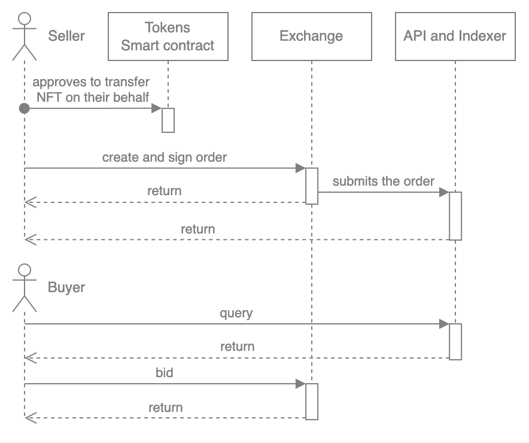

## Rarible 协议(以太坊)
### 概述
Rarible Protocol Ethereum 是一套在以太坊区块链网络中查询、发行和交易 NFT 的工具。它由智能合约、索引器、API 和 SDK 组成。

主要特点：

- 去中心化交易所
- 开源索引器
- 铸造单个 (ERC-721) 和多个 (ERC-1155) 代币，包括惰性铸造
- 分摊费用的能力
- 版税支持
- 公共秩序书

### 智能合约
以太坊的 Rarible 智能合约存储在以太坊区块链上。它们将在满足预定条件时运行。

要查看有关[智能合约](https://docs.rarible.org/ethereum/smart-contracts/smart-contracts/)及其代码的更多详细信息，请查看智能合约页面或[协议合约](https://github.com/rarible/protocol-contracts) github 。
### API 参考
使用这些基本 URL 访问不同以太坊网络上的 API：

基本网址|网络|链号
---|---|---
https://ethereum-api.rarible.org/v0.1/doc|主网|1
https://ethereum-api-staging.rarible.org/v0.1/doc| Rinkeby |4
https://ethereum-api-dev.rarible.org/v0.1/doc| Ropsten ||3
https://ethereum-api-e2e.rarible.org/v0.1/doc|	——|——

请参阅页面API 和[索引器](https://docs.rarible.org/ethereum/api/ethereum-api-indexer/) 以了解如何使用 API。

有关更多信息，请参阅 GitHub 上的 [Ethereum Indexer](https://github.com/rarible/ethereum-indexer) 和 [Ethereum OpenAPI](https://github.com/rarible/ethereum-openapi) 存储库。
### 开发工具包
Rarible 协议 Ethereum SDK 可以帮助与您的应用程序和 Rarible 协议进行交互。

主要特点：

- 创建 Mint 和 Lazy Minting ERC-721 和 ERC-1155 代币
- 创建卖单
- 创建并接受投标
- 购买代币
- 转移代币
- 销毁代币

有关使用 Rarible 协议以太坊 SDK 的更多信息，请参阅GitHub上的[以太坊 SDK](https://github.com/rarible/protocol-ethereum-sdk)页面

### 以太坊智能合约概述
#### Rarible 以太坊智能合约包括
- [Exchange V2](https://github.com/rarible/protocol-contracts/tree/master/exchange-v2)

	ExchangeV2 是一个智能合约，用于在以太坊区块链（或兼容 EVM）中代表的任何资产的去中心化交换。
- [Tokens, TokenFactories](https://github.com/rarible/protocol-contracts/tree/master/tokens)

	代币合约和代币工厂
- [RoyaltiesRegistry](https://github.com/rarible/protocol-contracts/tree/master/royalties-registry)

	NFT 中嵌入的版税
- [RoyaltiesProviders](https://github.com/rarible/protocol-contracts/tree/master/royalties)

	从单个合同中获得的佣金
- [TransferProxy](https://github.com/rarible/protocol-contracts/tree/master/transfer-proxy)

	根据类型进行代币交换
- [Betting](https://github.com/rarible/protocol-contracts/tree/master/staking)

	代币存款以换取积分。这使得积极参与解决 DAO 问题成为可能
- [Auctions](https://github.com/rarible/protocol-contracts/tree/RPC-107-Auction/auction)

	固定出价拍卖
- OnChainOrders

	将很快添加到 ExchangeV2

#### 详细分析
##### [Exchange V2](https://github.com/rarible/protocol-contracts/tree/master/exchange-v2)
- 概述
	
	ExchangeV2 是一个智能合约，用于在以太坊区块链（或兼容 EVM）中代表的任何资产的去中心化交换。要进行交换，需要两个订单
	
	- 销售订单,由卖家创建。
	- 采购订单,买方出价。
	
	如果上述两个订单匹配，则发生交换。
	
	
	
	创建和执行订单的一般过程如下
	
	- 卖方操作
		- 卖方确认交换合约可以处置其资产/代币
		- 卖家创建并签署订单。指定他们希望收到的资产类型和数量作为回报
		- 卖方将订单发送给索引器
	- 买方操作
		- 买家发送索引器请求以获取特定项目或集合的订单
		- 买方创建出价
		- 匹配订单
			- 如果订单和出价匹配，则进行交换
			- 如果订单和出价不匹配，则卖方可以接受或不接受出价。
				- 如果它接受，则进行交换
				- 如果不接受，拒绝交易
					
##### 合约服务操作 ，匹配订单
ExchangeV2 的主要功能是 matchOrders。此函数获取订单的两侧并尝试匹配它们。撮合订单流程可以分为几个阶段：
	
- 订单验证

	检查订单参数是否有效以及调用方是否有权执行订单
- 资产匹配

	从左右顺序匹配中检查资产，然后提取匹配的资产。
- 计算填充

	检查并找出应填充的确切值。订单也可以部分匹配。如果一方不想完全填写其他订单，就会发生这种情况。
- 订单执行、转移

	执行资产转移，必要时保存订单填写。
	

	
图上合约说明
	
- 订单验证
	- 检查订单的开始/结束日期。
	- 检查此订单的接收者是否为空或接收者是否与 order.taker 相同。
	- 检查订单是否由其创建者签名或订单创建者执行交易。
	- 如果订单的创建者是合约，则执行 ERC-1271 检查。

	目前仅支持区块链网络外的订单。这部分智能合约可以轻松更新以支持链上订单簿。
- 资产匹配
	
	主要目标是检查 `makeAsset`（左）是否与 `takeAsset`（右）匹配，反之亦然。

	- `makeAsset` 就是你卖的东西
		- 采购订单是您为卖方的 NFT 支付的费用。它可以是 ERC-20、ERC-721、ERC-1155 或任何使用资产映射接口的自定义资源
		- 销售订单是您销售的 NFT
	- `takeAsset` 是你接受的回报
		- 采购订单是您要购买的 NFT
		- 销售订单是您愿意接受的
	
	无需更新智能合约即可添加新资产类型。您可以使用自定义 `IAssetMatcher` 来实现。

	- 可能的改进
		- 支持参数化资产。例如，用户可以下订单用 10 ETH 换取流行收藏中的任何 NFT
		- 支持 NFT 包
- 计算成交和订单执行

	订单填充存储在智能合约中，是指订单的一部分。填充存储在映射槽内，其键使用以下字段计算：
	
	- 制作者
	- 制作资产类型
	- 采取资产类型
	- 盐

	仅汇率不同的填充订单存储在一个映射槽中。

	此外，可以扩展已满订单：用户可以使用相同的盐签署新订单。例如，他们可以增加 `make.value` 和 `take.value`。

	- 下单汇率优先

		如果汇率不同，但可以成交（比如左边的订单是10X -> 100Y，右边的订单是100Y -> 5X），那么左边的部分决定了交易所速度。
	- 舍入误差

		数学运算计算填充量。当进行四舍五入且误差超过0.1%时，会发出四舍五入错误，订单将不被执行。
- 转移执行

	使用传输管理器进行传输

	- `SimpleTransferManager`

		将资产从制造者转移到接受者，反之亦然。
	- `RaribleTransferManager`

		是一个复杂的版本。它考虑了协议佣金、版税等。

		计划扩展 `RaribleTransferManager `以支持更多版税计划并添加新功能。例如，用户费用或多个订单收件人。这部分算法可以使用` ITransferExecutor `进行扩展。它将添加新的执行器以支持新的资产类型。例如，可以添加执行器来处理包。
	- 可能的改进
		- 包支持
		- 支持随机框

##### SDK 客户端操作	
- 卖出和出价
	- 卖单

		要创建卖出订单，请使用 rarible 的 Ethereum SDK
		
		- 检查交换合约是否可以处置资产、代币。如有必要，请调用 `setApprovalForAll`。
		- 创建签名
			- [加密签名顺序](https://github.com/rarible/ethereum-sdk/blob/master/packages/sdk/src/order/encode-data.ts)
			- [签署订单](https://github.com/rarible/ethereum-sdk/blob/master/packages/sdk/src/order/sign-order.ts)
		- 将签名的订单发送到 API

		卖订单例子，[在 SDK 中卖的示例](https://github.com/rarible/ethereum-sdk#create-sell-order)
	- 投标

		要进行购买或接受出价，请调用[合约](https://github.com/rarible/protocol-contracts/blob/master/exchange-v2/contracts/ExchangeV2Core.sol) `matchOrders` 函数。
		
		- matchOrders 函数有参数：
			- 左序
			- 左订单签名
			- 正确的顺序
			- 正确的订单签名
		买订单例子,[在 SDK 中买的示例]()https://github.com/rarible/ethereum-sdk#create-bid
- 订单更新和取消
	- 更新
	
		要更新订单
		
		- 做出改变
		- 向 API 发送请求（请参阅 [Sell Order](https://docs.rarible.org/ethereum/smart-contracts/exchangev2-sell-bid/#sell-order)）。

		新订单检查：开始、结束、接受、制造和价值字段。价格只能降低。您需要取消订单并创建新订单以提高价格。因为如果用户已经以较低的价格签署了一条消息，那么有人可以保存这条消息和签名。您不能在不联系合同的情况下取消它。
	- 取消

		要取消订单，请调用 ExchangeV2 合约中的 `cancel ` 方法。

			function cancel(LibOrder.Order memory order) public {
				 require(_msgSender() == order.maker, "not a maker");
				 bytes32 orderKeyHash = LibOrder.hashKey(order);
				 fills[orderKeyHash] = UINT256_MAX;
				 emit Cancel(orderKeyHash);
			}
		匹配此类订单时将返回错误。

		订单制作者只能调用这个函数。它标记无法执行的订单。
- [Tokens, TokenFactories](https://github.com/rarible/protocol-contracts/tree/master/tokens)

	代币和代币工厂
	
	- 代币

		Rarible Protocol Ethereum 支持两种类型的代币
		
		- [ERC-721](https://eips.ethereum.org/EIPS/eip-721) 是不可互换代币的标准接口。这种类型的代币是独一无二的，其价值可能与来自同一智能合约的另一个代币的价值不同。
		- [ERC-1155](https://eips.ethereum.org/EIPS/eip-1155) 是用于管理多种类型代币的合约的标准接口。一个部署的合约可以包括可互换代币、不可互换代币或其他配置的任意组合。

		代币铸造方式，可以按如下方式铸造两种类型的代币：
		
		- 使用合约在区块链网络中进行定期铸造。
		- 惰性铸造

			代币的铸造发生在区块链网络之外。当代币被购买或转移时，购买方进入区块链并支付天然气费用。
			
		用户可以在不同的智能合约中创建代币。代币还支持保存有关版税的信息和所有创作者的信息。
	- 代币工厂

		要创建 ERC-721 和 ERC-1155 智能合约，请使用我们的代币工厂。[地址](https://docs.rarible.org/ethereum/contract-addresses/)可在合同地址页面上找到。

		使用代币工厂，您可以创建以下类型的智能合约
		
		- 公共 ERC-721 和 ERC-1155
		- 私有 ERC-721 和 ERC-1155

		代币工厂创建[信标代理服务器](https://docs.openzeppelin.com/contracts/3.x/api/proxy#BeaconProxy)。当所有代币合约更新时，Rarible 协议可以自动更新这些合约
	- 铸币厂

		Minting 正在使用 `mintAndTransfer` ERC-721 和 ERC-1155 合约的功能。
		
		- ERC-721 该函数具有以下签名 `mintAndTransfer(LibERC721LazyMint.Mint721Data memory data, address to).`

				struct Mint721Data {
				        uint tokenId;
				        string tokenURI;
				        address[] creators;
				        LibPart.Part[] royalties;
				        bytes[] signatures;
				}
			- tokenId		//ERC-721 标准的 tokenId
			- tokenURI		//代币 URI 的后缀。前缀通常是ipfs:/
			- creators 		//作者地址数组
			- 版税			//版税数组
			- 签名			//签名数组.每个创作者都必须有一个签名。唯一的例外是创建者发送 Mint 交易时。
		- ERC-1155 该函数具有以下签名：`mintAndTransfer(LibERC1155LazyMint.Mint1155Data memory data, address to, uint256 _amount).`

				struct Mint1155Data {
				        uint tokenId;
				        string tokenURI;
				        uint supply;
				        address[] creators;
				        LibPart.Part[] royalties;
				        bytes[] signatures;
				}

			- tokenId		//ERC-1155 标准的tokenId
			- tokenURI		//代币 URI 的后缀。前缀通常是ipfs:/
			- supply			//用于铸造的代币总数
			- creators		//作者地址数组
			- 版税			//版税数组
			- 签名			//签名数组。每个创作者都必须有一个签名。唯一的例外是创建者发送 Mint 交易时
	- 惰性铸币

		ERC-721 和 ERC-1155 支持惰性铸币。

		
	
		创建懒惰铸币流程
		
		- 生成代币 ID。
		- 创建一个创建者必须签名的 Lazy Minting 请求正文。
		- 创建者对提供的数据进行签名。
		- 在请求正文中添加签名
		- 将数据发送到 API

		请参阅使用 API 创建 Lazy Minting 的[示例](https://docs.rarible.org/ethereum/api/create-lazy-minting/)。

		有关 Lazy Minting 的更多信息，请参阅 [SDK](https://github.com/rarible/ethereum-sdk) 页面
	- 转移

		该函数将代币从发送者转移到新的所有者。
		
		- 参数
			- `owner:Address`		//资产所有者的地址
			- `asset: Asset`			//资产类型
		- 该函数检查资产类型并执行以下功能之一
			- `transferErc721`

					export async function transferErc721(
					    ethereum: Ethereum,
					    send: SendFunction,
					    contract: Address,
					    from: Address,
					    to: Address,
					    tokenId: string
				- contract: Address			//合约地址 ERC-721
				- from: Address				//ERC-721 代币所有者的地址
				- to: Address				//新所有者的地址
				- tokenId: 字符串 | string[] 	//用于传输的代币 ID
			- `transferErc1155`
			 
					export async function transferErc1155(
					    ethereum: Ethereum,
					    send: SendFunction,
					    contract: Address,
					    from: Address,
					    to: Address,
					    tokenId: string | string[],
					    tokenAmount: string | string[]
				- contract: Address				//合约地址 ERC-1155
				- from: Address					//ERC-1155 代币所有者的地址
				- to: Address					//新所有者的地址
				- tokenId: 字符串 | string[] 		//用于传输的代币 ID 或代币数组
				- tokenAmount: 字符串 | string[]	// 用于传输的 ERC-1155 代币数量或一组代币
	- 烧伤

		要刻录代币，请调用函数

			const hash = await sdk.nft.burn({
			    contract: contractAddress,
			    tokenId: toBigNumber(tokenId),
			})
		- contract	//智能合约地址
		- tokenId	//代币标识符
- [RoyaltiesRegistry](https://github.com/rarible/protocol-contracts/tree/master/royalties-registry)
	- 版税v2 
	
		Rarible 定义了一个接口来查询合同的版税。这是在标准的 [Rarible token contracts](https://github.com/rarible/protocol-contracts/blob/master/tokens/contracts/erc-721/ERC721Lazy.sol#L12)上实现的。它公开 `getRoyalties` 方法，该方法需要一个 ID 作为输入（通常是 tokenId）并返回一组帐户和基点。
	
			function getRaribleV2Royalties(uint256 id) override external view returns (LibPart.Part[] memory) {
			        return royalties[id];
			}
	- 版税V1
	
		交换合同通过 [RoyaltiesRegistry](https://github.com/rarible/protocol-contracts/blob/master/royalties-registry/contracts/RoyaltiesRegistry.sol#L63) 间接地与 Rarible 的版税实施互动。Registry 检查 NFT 合约是否支持预期的接口，如果是则查询 Rarible 版税数组。这允许 Rarible 支持不同收藏的不同版税标准。
	
		Rarible 协议支持链上版税。这些在 ExchangeV1 合约中由版税数组处理，这是执行 mint 函数所必需的。
		
		这个元组由两个变量组成，`fees.recipient` 和 `fees.value`。
		
		- `Fees.recipient`		//指的是物品所有者（默认情况下）或收取版税的地址。
		- `Fees.value`			//版税百分比。默认情况下，该值在 Rarible 上为 1000，即 10% 的版税。这是使用基点完成的。[此处](https://corporatefinanceinstitute.com/resources/knowledge/finance/basis-point-beep/)找到有关基点的更多.
		
		您可以在下方找到 ExchangeV1 中处理链上版税的代码块。
		
			contract HasSecondarySaleFees is ERC165 {
			    event SecondarySaleFees(uint256 tokenId, address[] recipients, uint[] bps);
			    /*
			     * bytes4(keccak256('getFeeBps(uint256)')) == 0x0ebd4c7f
			     * bytes4(keccak256('getFeeRecipients(uint256)')) == 0xb9c4d9fb
			     *
			     * => 0x0ebd4c7f ^ 0xb9c4d9fb == 0xb7799584
			     */
			    bytes4 private constant _INTERFACE_ID_FEES = 0xb7799584;
			    constructor() public {
			        _registerInterface(_INTERFACE_ID_FEES);
			    }
			    function getFeeRecipients(uint256 id) public view returns (address payable[] memory);
			    function getFeeBps(uint256 id) public view returns (uint[] memory);
			}
	- 例子

		[设置外部收藏的版税](https://docs.rarible.org/use-cases/royalties-on-a-external-collection/)
- [RoyaltiesProviders](https://github.com/rarible/protocol-contracts/tree/master/royalties)

	从单个合同中获得的佣金
- [TransferProxy](https://github.com/rarible/protocol-contracts/tree/master/transfer-proxy)

	根据类型进行代币交换
- [Betting](https://github.com/rarible/protocol-contracts/tree/master/staking)

	代币存款以换取积分。这使得积极参与解决 DAO 问题成为可能
- [Auctions](https://github.com/rarible/protocol-contracts/tree/RPC-107-Auction/auction)

	固定出价拍卖
- OnChainOrders

	将很快添加到 ExchangeV2
- [Fees](https://docs.rarible.org/ethereum/smart-contracts/fees/)

	[RaribleTransferManager](https://github.com/rarible/protocol-contracts/blob/master/exchange-v2/contracts/RaribleTransferManager.md) 支持以下类型的费用
	
	- 协议费用			//在交易双方收取。
	- 原产地费用			//为每个订单设置。两个订单可能会有所不同。
	- 版税				//作品的作者将获得每笔销售的一部分。
	
	算法，资产的转移发生在 `doTransfers` 以下参数用作参数：
	
	- `LibAsset.AssetType makeMatch`		//`AssetType` 制造方订单
	- `LibAsset.AssetType takeMatch`			//`AssetType` 在接受方订单上
	- `LibFill.FillResult fill`					//双方将通过匹配传递的值
	- `LibOrder.Order leftOrder`				//左订单数据
	- `LibOrder.Order rightOrder`				//正确的订单数据

	在此方法中，执行以下操作。

	- 如何计算交易的佣金方？
	- 使用 `LibFeeSide.getFeeSide`. 它接受 `assetClasses` 双方的参数（例如，`ETH`和 `ERC20`）。
	- `LibFeeSide.getFeeSide` 试图确定支付费用的一方

	
	
	- 如果交易的任何一方都有 ETH，则使用它。
	- 如果没有 ETH，我们检查是否有 ERC-20 并使用它。
	- 如果没有 ERC-20，请检查是否有 ERC-1155 并使用它。
	- 否则，将不收取任何费用。（例如，如果交易中涉及两个 ERC-721）

	转移

	1. 如果制造方支付费用
		- 呼吁 `doTransfersWithFees` 制造方
		- 呼吁 `transferPayouts` 接收方
	- 如果接受方支付费用
		- 呼吁 `doTransfersWithFees` 接受
		- 呼吁 `transferPayouts` 制造方
	- 如果未定义支付费用的一方
		- 呼吁 `transferPayouts` 双方

	在计算资产总额时

	- 在填写的金额之上添加协议费用。
	- 发送买家订单的费用也加在上面。

	买家付款
	
	- 如果买家使用 ERC-20 代币付款，必须批准计算出的代币数量。
	- 如果买家使用 ETH，必须将计算出的金额与交易一起发送给 ETH。

	有关费用的更多信息，请参阅 GitHub 上的 [RaribleTransferManager](https://github.com/rarible/protocol-contracts/blob/master/exchange-v2/contracts/RaribleTransferManager.md)页面。