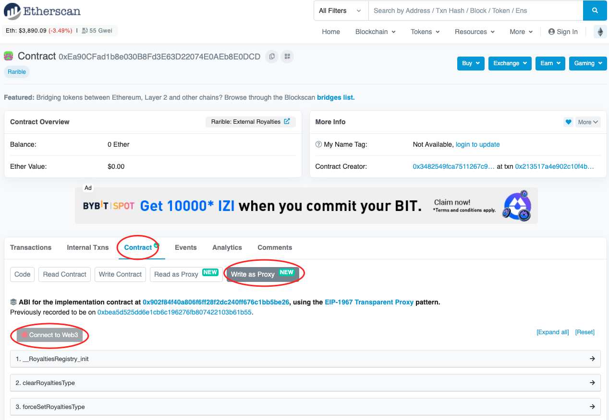

# Rarible
## 概述
Rarible Protocol 是一种在多个区块链上查询、发行和交易 NFT 的工具

- [以太坊](https://docs.rarible.org/ethereum/ethereum-overview/)
- [Flow](https://docs.rarible.org/flow/flow-overview/) (WIP)
- [Tezos](https://docs.rarible.org/tezos/tezos-overview/)
- Polygon（WIP，即将推出）
- 其他区块链（告诉我们你想要什么区块链）

## 入门
- [安装并使用](https://docs.rarible.org/overview/union-sdk/)协议 SDK
- [使用协议](https://docs.rarible.org/overview/api-reference/) API

查看[示例](https://docs.rarible.org/getting-started/protocol-example/)应用程序以快速入门

## 协议特点
- [查询](https://github.com/rarible/sdk#querying) NFT 信息
- [铸造](https://github.com/rarible/sdk#mint)（发行，创建）NFT
- 交易 NFT（[卖出](https://github.com/rarible/sdk#sell)、[出价](https://github.com/rarible/sdk#bid)、[拍卖](https://github.com/rarible/sdk#auction)）
- 转移
- 销毁

## 架构
- 架构图

	

	协议基于区块链层（为每个支持的区块链编写的智能合约）。这些智能合约允许用户铸造和交换代币。在合约之上，我们构建了索引器来索引区块链状态的一部分。这使我们可以查询有关 NFT 的数据。

	然后，编写 SDK 以与智能合约进行交互。所有这些组件都是为支持的每个区块链编写的，并用于 [Union](https://github.com/rarible/union-service) 服务和 [Union SDK](https://github.com/rarible/sdk)。应用程序需要集成 Union 服务和 Union SDK 才能以相同的方式与所有区块链进行交互。

## 为什么要建立在 Rarible 协议上？
Rarible 追求的目标是为所有 NFT 创造一个高度流动的环境的一个强大的链上协议，专为 NFT 存在于连接的空间中而设计。具有专门团队的单独计划将使来自多个前端（如店面或钱包）的协议直接交互，提供额外的分销渠道并增强流动性。它还将推动新 NFT 交易机制的发现。

Rarible 为所有人设计的 NFT 协议，由社区拥有和管理。在这方面，该倡议中的一个特殊位置是为 Rarible 原生治理代币 $RARI 保留的，作为未来 NFT 生态系统的基本构建块。

- 整个 Rarible 生态系统的供求关系

	Rarible 是最大的 NFT 市场之一，总生命周期交易量超过 6400 万美元，每月有 5.7 万协议用户，流畅的用户体验以及跨行业的各种用例。您可以使用 Rarible 的共享订单簿。
- 为您完成的先进而强大的技术

	从头开始创建技术既复杂又耗时。Rarible 提供了对团队过去 1.5 年开发的工具的访问权限，其中包含所有创建的 NFT 的广泛功能和数据。
- 货币化
	
	Rarible 协议支持任意前端费用：您还可以通过您的创作获利。
- 去中心化自治组织（DAO）

	Rareible 正稳步朝着成为一个完全去中心化的自治组织的方向发展。DAO 将为创作者提供多种获得资金和曝光的机会。它将激励人们在协议之上进行构建，我们希望 DAO 奖励早期的构建者。

## 协议示范
从 [Rarible 协议 SDK](https://github.com/rarible/sdk) 开始。

此外，您可以创建一个[协议示例应用程序](https://github.com/rarible/example)以快速启动。

在本例中，您可以：

- 配置 Rarible SDK
- 创建 Lazy mint NFT 项目
- 创建卖单
- 购买（购买物品）一个订单
- 从您当前的钱包中获取您的 NFT

此外，您可以尝试 [scaffold-eth Rarible Starter App](https://github.com/ipatka/scaffold-eth/tree/rarible-starter-app)。

## NFT 购买流程示例
1. 在应用点击购买 NFT。
2. 前端调用 Union SDK 中的 Buy 函数。
3. Union SDK 调用所需网络的 SDK 中的 Buy 函数。
4. SDK 准备交易并将其发送到底层区块链。
5. Indexer 在内部侦听购买、传输事件、更新 NFT 状态。
6. Indexer 将事件传输到 Union。
7. Union 将有关事件的信息发送到应用程序的后端。	


## Picnic 展示
使用 Rarible 来帮助在 [Picnic] 展示中识别来自创作者和收藏家的 NFT。[Rarible API] 提供了一些很好的端点来获取必要的数据。

- 按所有者获取代币

	通过拥有的代币进行分页
	
	
		import axios from 'axios';
		
		// 获取收藏家拥有的代币. * 
		@param {string} owner - 所有者地址 (0x...) * 
		@param {object} opts - 选项 * 
		@param {string} opts.continuation - 可连续 ID * 
		@param {integer} opts.size - 大小要获取的代币（默认值：100）. * 
		@return // 
		
		const fetchOwnedTokens = async (owner, opts = {}) => { const { continuation, size = 100 } = opts;
		
		try { const result = await axios.get('https://api.rarible.com/protocol/v0.1/ethereum/nft/items/byOwner', { params: { owner, continuation }, }); const { data } = result;
		
		// 分页结果
		let hist = [];
		if (data.continuation && data.items.length === size) {
		  hist = await getOwnedTokens(owner, { ...opts, continuation: data.continuation });
		}
		
		// 返货所有历史结果
		return [...data.items, ...hist];
		} catch (err) { console.error(err); return []; } };
	该 `byOwner` 端点不会返回代币的元数据。可以尝试直接从区块链查询此信息或使用其他 API 来收集代币元数据信息。

	可以使用 `getItemMetaByIdRarible` API 端点来获取代币元数据。请注意，您必须为每个代币发出一个请求。

```	
	import axios from 'axios';

	/* * 从代币 ID 获取代币元数据* 
	@param {string} id - 代币 ID，格式为 
		as CONTRACT_ADDRESS:TOKEN_ID (e.g. 0x1:1001) * 
	@return {object} / 
	
	const fetchTokenMetadata = async id => { const { data } = await		
	axios.get(https://api.rarible.com/protocol/v0.1/ethereum/nft/items/@{id}/meta); if (!data?.name) { throw new Error('Invalid NFT data', { id, data }); } return data; };		
```

- cocoNFT
	- 域名注册地址：

		cocoNFT 通过构建一个 onRamp 来帮助新创建者进入 NFT 空间，通过社交媒体登录可以轻松管理您的钱包。

		cocoNFT 使用以下智能合约功能：
		
		- 惰性铸造

			cocoNFT 使用惰性铸造，因此创建者无需为铸造付费，使新手可以轻松进行加密。他们计划通过 Rarible Protocol Exchange 和索引器使用支持在我们网站上直接结账的功能，我相信它可以显示用户的 Lazy Minted NFT。
		- 交换
		- 索引器
	- cocoNFT 将如何改变事情：
	
		在协议上，我们开发了代码来处理我们需要 Rarible 协议完成的许多功能。而不是等待协议更新。由于我们在构建时发现了很多框架，因此我们会使用诸如 [starter app](https://github.com/austintgriffith/scaffold-eth/tree/rarible-starter-app) 之类的东西来快速启动我们的开发过程。
	
		关于数据库端，cocoNFT 建议了解您如何构建数据库。
	- 团队执行相同操作的分步说明

		在部署到主网之前始终在测试网上进行测试。Ropsten 推荐使用 Rarible API。

		1. Fork [Rarible 协议](https://github.com/rarible/protocol-contracts)（最好探索和熟悉）
		- 第二步

			确定您将使用哪种 NFT 代币类型 721 或 1155 并在代币文件夹中进行任何必要的修改：

				https://github.com/rarible/protocol-contracts/tree/master/tokens
		- 第三步

			更新迁移文件以传入您计划部署的合约所需的任何参数：
			
				https://github.com/rarible/protocol-contracts/tree/master/tokens/migrations

				注意：初始部署仅需要迁移文件 1-4，如果您不想为两者部署合同，则仅需要 721 的 #2 和 1155 的 #3。
		- 记下合约的地址。这些是可升级的合约，以便您将调用定向到代理地址。
		- 测试某些功能，例如 `name()` 或 `symbol()` 在您的终端中以确保其正常工作
		- 开始使用 Rarible 的 API 进行延迟铸造和订单创建以构建您的市场

				https://api-reference.rarible.com/#operation/upsertOrder

		cocoNFT 的 API 和 SDK 正在开发中。
- MintGate
	- 域名注册地址：

		MintGate 决定通过在 Rarible 协议上建立他们的市场来集成 Rarible 协议，以便为他们不断增长的创作者和影响者社区提供最佳体验。

		MintGate 中 Rarible 协议的用法是：
		
		- Lazy Minting
		- Exchange
		- Indexer

		我们从 Rarible 分叉了 1155 份合约以创建一个自定义合约来铸币，该合约具有所有相同的功能以遵守版税。我们正在使用该合约以及 Rarible 通过 API 提供的交换合约 + 索引器。
		
		下面列出了我们如何分叉合约的步骤。
		
		- 我们使用[入门应用程序](https://github.com/austintgriffith/scaffold-eth/tree/rarible-starter-app)和[Eugene 的示例项目](https://github.com/rarible/protocol-example)作为模板来创建已签名的销售订单以提交给交易所。
		- 我们使用索引器拉取已创建的销售订单数据用于购买和信息显示，这些数据都包含在 Rarible API 中。
	- MintGate 将如何改变事情：

		Mintgate 会根据经验做出不同的一件事就是尽快优先考虑 Rarible 市场订单创建功能，而不是只专注于懒惰的铸造。

		Mintgate 希望 Rarible 能够完成 API 的 SDK 替代方案，因为它们时不时会失败，当没有销售订单或创建惰性铸币时，这可能会导致用户混淆和错误。使用 SDK 有望证明更可靠。

	- MintGate 如何开始在 Rarible 协议上构建的分步说明
		- Fork [Rarible 协议](https://github.com/rarible/protocol-contracts)最好探索和熟悉
		- 确定您将使用哪种 NFT 代币类型 721 或 1155 并在代币文件夹中进行任何必要的修改

				https://github.com/rarible/protocol-contracts/tree/master/tokens
		- 更新迁移文件以传入您计划部署的合约所需的任何参数

				https://github.com/rarible/protocol-contracts/tree/master/tokens/migrations

				注意：初始部署只需要迁移文件 1-4，如果你不想同时部署合同，721 只需要 #2，1155 只需要 #3
		- 记下合约的地址。这些是可升级的合约，因此您将调用定向到代理地址。
		- 测试某些功能，例如 `name()` 或 `symbol()` 在您的终端中以确保其正常工作
		- 开始使用 Rarible 的 API 进行延迟铸造和订单创建以构建您的市场：
		
				https://api-reference.rarible.com/#operation/upsertOrder

	用于代币门控的 MintGate API 可用。可以在此处找到完整的文档和说明： [MintGate Docs](https://mintgate.gitbook.io/mintgate-docs/)
- Rarible SDK 无代码插件

	该插件由 [EzCode](https://ezcode.co/) 开发。

	您现在可以使用 Rarible 协议 SDK 并构建您自己的 NFT 市场而无需深入了解如何编码。我们已将 SDK 集成到 Bubble.io 的无代码插件中

	您无需任何编程技能即可使用 SDK 完全无需代码即可构建您自己的 NFT 市场。我们已将 SDK 集成到最大的无代码平台 [Bubble.io](https://bubble.io/) 的无代码插件中。

	- [插件链接](https://bubble.io/plugin/rarible-sdk---nft-marketplace-1627909974342x941739732723564500)
	- [文档链接](https://rarible.docs.ezcodeplugins.com/)
	- [插件使用示例](https://rarible-demo.bubbleapps.io/version-test)

	API 支持的功能

	1. 获取项目元数据
	- 获取物品数据
	- 通过钱包获取订单
	- 按哈希获取订单
	- 获得 NFT 所有权
	- 获取 NFT 订单活动
	- 按项目获取订单活动
	- 按所有者、创建者、收藏获取所有 NFT 项目
	
	SDK支持的功能，支持 ERC721 和 ERC1155
	
	- 铸币
	- 惰性铸币（买方支付费用）
	- 设置外部收藏的版税
	- 自定义原产地费用
	- 创建订单（卖出、买入）
	- 购买
	- 接受投标
	- 将 NFT 转移到其他钱包地址
	- 取消订单
	- 销毁

	对于任何插件相关的问题论坛一个单独的线程[在这里](https://forum.bubble.io/t/free-plugin-rarible-sdk-nft-marketplace-by-ezcode/172519)。

	如何使用
	
	1. 将元素 Rarible SDK 放置在页面上
	2. 确保它是可见的（不在弹出窗口或隐藏组中）
	3. 在插件元素字段“环境”中选择网络

	使用此插件构建的 NFT 市场：- [one2all](https://one2all.io/)
- 区块链设置收藏的版税
	1. 在新选项卡中打开版税[合约](https://etherscan.io/address/0xEa90CFad1b8e030B8Fd3E63D22074E0AEb8E0DCD#writeProxyContract)
	- 活动合同选项卡。确保在顶部附近选择了 `Write as Proxy`。
	- 单击连接到 Web3。

		
	- 展开 `setRoyaltiesByToken` 函数以设置整个集合的版税。
		1. 现在需要在 ` token (address)` 字段中输入收集地址
		- 然后是版税元组。
		
		下面是元组的一个例子。

		元组的
		
		- 第一部分必须是您希望收到版税的地址。
		- 第二部分是作为基点的百分比，即：1000 = 10% 版税。

			下面是一个元组示例，它为用户`( 0x6C1AaC9EAd0a2c0D328309fbb2cf940F49d26126 ) ` 集合中的项目提供 1% 的版税。
			
			最大版税值为 10000 (100%)。
		
				[["0x6C1AaC9EAd0a2c0D328309fbb2cf940F49d26126", 100]]
			在下面的屏幕截图中，您可以看到在集合
			
			`( 0x4008c2482357632b06526b492c143f4e73ff1b0d ) `上用户 `( 0x6C1AaC9EAd0a2c0D328309fbb2cf940F269d2 )` 26 1 0
		
			
		- 单击“写入”按钮,这将显示您连接的钱包并要求您支付汽油费以执行交易。

	现在已经设置了版税，版税将在该系列中的每一次销售中支付。

	以下是购买交易的示例，并附有每笔费用的注释：
	
	


## 参考
[Rarible Protocol-eth](https://docs.rarible.org/)

		
	
	