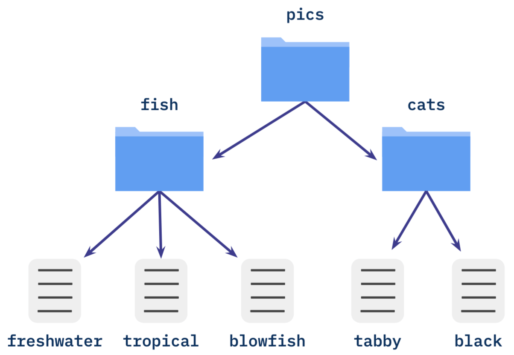
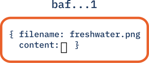
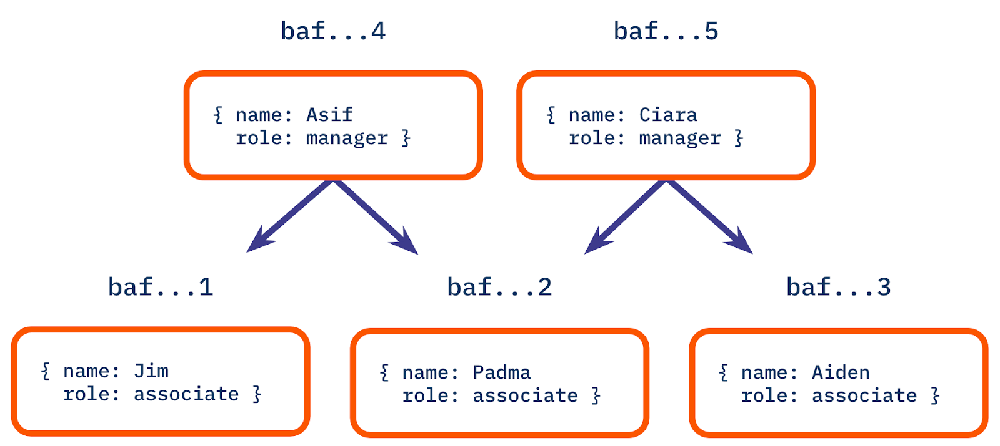

# Merkle DAG：分布式网络的结构化数据
了解我们如何使用 CID 为分布式 Web 创建内容可寻址的数据结构！
## 数据有结构！ 1
在我们的 [去中心化 Web 内容寻址](https://proto.school/content-addressing) 教程中，我们讨论了内容标识符或 CID 的概念。（如果您还没有复习该课程，我们强烈建议您这样做，因为本教程建立在它介绍的概念之上！）CID 的功能类似于数据 blob 的指纹，主要由加密哈希组成数据本身。我们可以使用此标识符作为唯一且简洁的名称来指向该数据。由于名称是唯一的，我们可以将其用作链接，将基于位置的标识符（如 URL）替换为基于数据本身内容的标识符。

但是，链接不仅仅用于识别特定内容；它们是表示、组织和遍历结构化信息的基本工具。在我们日常生活中的各种对象和系统中——电话簿、参考书目、思维导图、分类法等等——我们发现具有结构的数据，而链接构成了该结构的关键部分。
### 数据结构
无论您是否是程序员，您都被结构化数据所包围。列表、字典和目录都可以帮助我们组织信息并考虑各种数据之间的关系。

在一定程度的细节上，开始有必要正式描述我们使用的数据的属性，从而产生具体的规范，适当地称为 `数据结构`！来自维基百科：

- 在计算机科学中，数据结构是一种能够实现高效访问和修改的数据组织、管理和存储格式。更准确地说，数据结构是数据值、它们之间的关系以及可以应用于数据的函数或操作的集合。
在编程中，数据结构无处不在。将数据组织成变量以便在程序中使用它们的方式涉及从数十个到数百万个数据结构。如果您是开发人员，您可能熟悉常见的数据结构，如数组、对象、图形等。这些结构通常链接在一起：例如，在称为链表的常见数据结构中，每个项目表示在哪里查找计算机内存中的下一项。

在去中心化的网络上，我们直接从平行节点而不是中央机构访问数据。在一个孤立的环境中，例如您自己的笔记本电脑，您可以高度信任您在内存或磁盘上使用的数据结构。但是，在去中心化系统中，您在平行节点之间的信任度较低，甚至可能为零。为了适应这种环境，我们需要一种有效的方法将数据结构链接在一起，同时仍然保留我们验证其完整性的能力（CID 的一个重要属性）。继续前面的示例，如果我们正在遍历从分布式网络获得的链表，我们不希望坏人能够在未被发现的情况下在中间插入项目。

在本教程中，我们将探讨这个概念，学习如何开发满足这些需求的专用数据结构，称为 Merkle DAG。正如我们将看到的，这种结构为可信赖的、分布式的互连数据网络提供了基础。

## 正确结构化数据的优势 2
我们在构建数据时所做的选择会产生重要影响。以照片库为例，每张图片都描绘了几年来不同的人物、地点和事件。我们可以用多种方式构建这些数据——我们甚至可以选择根本不构建它！——每一种选择都会对我们与图书馆的互动产生重大影响。

结构可以作为数据的索引，影响我们在照片库中定位和检索特定图片的速度。通过使我们能够对相关对象进行分组，结构也可以为数据添加语义。

	pics
	├── cats
	│   ├── 2018-02-23-tabby.png
	│   └── 2019-12-16-black.png
	└── fish
	    ├── 2017-03-05-freshwater.png
	    ├── 2018-04-14-tropical.png
	    └── 2020-10-02-blowfish.png
上面的目录列表为我们提供了一个小而具体的示例。在这个例子中，我们有一个名为“pics”的根目录，它包含我们的整个照片集。在这个目录中，我们将照片分为两个子目录，“猫”和“鱼”，以根据主题分隔照片。在这些子目录中，我们按拍摄日期组织了照片，这反映在它们的文件名中。此处的结构有助于描述各个文件，让我们知道，例如，“2018-04-14-tropical”在某种程度上与术语“fish”和“pics”相关，而“pics”更像是包含此单个文件的集合的一般描述。该结构还有助于我们识别数据中的共性：“

没有单一的最佳方式来构建一个人的数据；每一个选择都伴随着重大的权衡。我们的数据集变得越大，根据我们打算使用和访问它的方式调整其结构就越重要。在我们的示例中，照片是根据动物类型组织的，这使得查找特定动物的照片变得非常容易。但是，要在所有文件中找到时间戳最早的图片文件就比较困难了，需要遍历所有的目录。如果我们的目录包含数千张照片，那将变得非常乏味。如果我们改为根据每张照片的拍摄日期来组织它们的层次结构，情况就会相反。

结构为我们的数据赋予意义和组织，而 CID 让我们在分布式网络中安全、可验证且无需协调地引用数据。在接下来的课程中，我们将了解如何构建内容可寻址的数据结构，让我们具备这两种能力！

## 有向无环图 (DAG) 3
在我们可以创建内容可寻址数据结构之前，我们必须以一种使我们能够准确无误地谈论它们的方式来定义这些结构。为此，我们转向图表。

图是一种数学抽象，用于表示对象集合之间的关系。通常使用术语节点来指代图中的对象，使用术语 `节点` 来指代对象之间的关系。最常见的是，图形用于表示对象之间的成对关系。

	例如，图表可用于绘制连接成对城市的道路，或学校学生之间的友谊。
我们在上一课中介绍的示例文件层次结构也形成了一个图（目录和文件充当我们的节点，目录与其包含的文件之间的关系为我们提供了边）。我们在下图中再次描绘了它：

给定一个图，我们可以想象从一个节点开始，沿着它的边移动到另一个节点。例如，我们可以从上图中的根目录“pics”开始，逐步深入到层次结构中以到达所需的文件。
### 有向图
如果每条边都具有某种方向感，则该图称为有向图。例如在上图中，边表示包含：一个目录包含一个文件，但一个文件不包含它的目录。节点之间的关系只在一个方向上正确关联，这个方向用单向箭头表示。祖先、后代、父母和孩子等系谱学术语 经常用于指代有向图中的节点。例如，在我们的图中，对应于“cats”目录的节点可以说是它包含的两个文件节点的父节点。

- 没有父节点的节点通常称为根节点
- 而没有子节点的节点称为叶节点。
- 具有父节点和子节点的节点称为中间节点，因为它们位于图的根和叶之间。使用术语非叶来指代中间节点和根节点也很常见。

### 非循环图
如果图中没有循环，则该图称为无环图 - 即，给定图中的任何节点，没有办法沿着图的边缘从该节点导航回其自身。在像我们的文件层次结构这样的有向图中，我们只能从父节点移动到子节点。
### 有向无环图
一个既有向又无环的图被称为有向无环图。事实证明，这些是一种非常普遍的研究结构——如此普遍，事实上，首字母缩略词 DAG 经常被用来指代它们！尤其是分层数据非常自然地通过 DAG 表示。

## 引入 Merkle DAG 4 
当我们在计算机上表示图形时，我们没有画箭头的奢侈；我们必须通过提供其节点和边缘的具体表示来编码我们的数据结构。由于 CID 可以唯一标识一个节点，我们可以使用它们来表示从一个节点到另一个节点的边。通过这样做，我们创建了一种特殊的 DAG，称为 Merkle DAG，以纪念首先描述此类结构的研究人员。（任何以这种方式使用内容寻址的图形表示都必然是 DAG，我们很快就会看到）。

让我们看看如何构建 Merkle DAG，再次以我们的文件目录为例。第一步是对我们图的叶节点进行编码——在本例中是我们的图像文件——并给它们每个一个 CID。

对于这个例子，我们将这些节点的表示简化为两个属性：

- 文件的名称
- 以及与文件内容对应的数据

这些属性捆绑在一起，构成了我们节点的数据，在下面的橙色框中表示。

	叶节点的图形表示。 节点的内容包括相应文件的名称 “freshwater.png”，以及文件的内容，在此图像中表示为淡水鱼表情符号。 该节点标有“baf...1”的 CID。
节点上方的标签是唯一 CID 的简化表示，它是通过我们的加密哈希算法传递节点本身的数据而得出的。（要深入了解 CID 的格式，请访问我们的 [CID 教程剖析](https://proto.school/anatomy-of-a-cid)。）请注意，此标签不是节点本身的一部分。

我们可以通过首先创建其叶节点来开始构建我们的 Merkle DAG——我们层次结构中的每个文件都有一个节点——用其唯一的 CID 标记每个节点：

	此图像描绘了示例层次结构中每个文件的叶节点。 节点分别对应 “freshwater.png”、“tropical.png”、“blowfish.png”、“tabby.png”和“black.png”，分别标记为“baf...1”到“baf” ...5"。

我们中间节点的节点结构——我们层次结构的子目录——必须有点不同。这些节点中的每一个还将包含一个名称，对应于目录的名称；但是目录节点的“内容”是它包含的文件和目录的列表，而不是任何特定文件的内容。我们可以将其表示为 CID 列表，每个 CID 都链接到图中的另一个节点。这个列表连同目录的名称，构成了这些节点的数据，从这些数据中我们可以再次推导出一个 CID，如下所示：

	显示“猫”目录的 Merkle DAG。 “cats”的节点标记为“baf...7”； 它嵌入了对应于猫图像的节点的 CID（“baf...4”代表“tabby.png”，“baf...5”代表“black.png”）。 单头箭头从“猫”节点绘制到子节点。
在此图中，“cats” 子目录表示为一个非常小的 DAG。具有 CID“baf...7”的节点链接到构成其子节点的节点“baf...4”和“baf...5”，方法是将它们的 CID 嵌入到它自己的表示中。

现在我们已经为图中的两种类型的节点派生了表示，我们可以继续自下而上地构建图：

	示例层次结构的完整 Merkle DAG。 “fish”文件夹的节点标记为“baf...6”，“cats”文件夹的节点标记为“baf...7”，“pics”文件夹的节点标记为“baf. ..8"。 所有节点都按照前面图像中的描述绘制。
在 Merkle DAG 中，每个节点的 CID 都取决于它的每个后代；如果其中任何一个不同，它们自己的标签也会不同。

	例如，如果一只虎斑猫的图片以某种方式进行了 Photoshop，那么它在图中的相应节点将收到不同的 CID。因为子节点的 CID 是其父节点数据的一部分，所以该父节点（在本例中为“cats”目录）本身会更改，从而导致它也接收到新的 CID。反过来，“pics”目录的节点的 CID 也会改变。

这意味着我们  DAG 始终必须自下而上构建：在确定其子节点的 CID 之前，无法创建父节点。

通常，对 Merkle DAG 中节点的任何更改都会传播到更改节点的每个祖先。但是，在 DAG 的一个分支中进行的更改不会强制更改其他分支中节点的 CID；节点的 CID 仅响应其自身数据或其后代数据的变化而变化。

	例如，更改“blowfish.png”不需要更改 baf...1、baf...2、baf...4、baf...5 或 baf...7。
请注意，由嵌入其子节点 CID 的节点组成的结构必然不能包含循环。用于构建 CID 的加密函数以及我们的 Merkle DAG 使得无法通过图表描述“自我参照”路径。

	这是一个重要的安全保证：如果我们遍历 Merkle DAG，我们可以确定我们不会陷入无限循环。
现在我们已经了解了如何使用 CID 创建结构化数据，让我们检查一下我们可以依赖的 Merkle DAG 的一些属性！

## Merkle DAG：可验证性 5 
因为我们使用加密强度哈希算法来创建 CID，它们提供了高度的可验证性：使用内容地址检索数据的个人始终可以自己计算 CID，以确保他们得到他们想要的东西。这提供了永久性（内容地址背后的数据永远不会改变）和防止恶意操纵（不良行为者无法在您意识到这不是您请求的文件的情况下诱骗您下载错误的文件）。

在 Merkle DAG 中，每个节点的 CID 又取决于其每个子节点的 CID。因此，根节点的 CID 不仅可以唯一标识该节点，还可以唯一标识以它为根的整个DAG！因此，我们可以将 CID 的所有出色的安全性、完整性和持久性保证扩展到我们的数据结构本身，而不仅仅是它包含的数据！

您是否曾经在某些编辑过程中对文件目录进行了临时备份，然后在几个月后找到这两个目录并想知道它们的内容是否仍然相同？您可以为每个副本计算一个 Merkle DAG，而不是费力地比较文件：如果根目录的 CID 匹配，您就会知道您可以安全地删除一个并释放硬盘上的一些空间！
### 任何节点都可以是根节点
DAG 可以看作递归数据结构，每个 DAG 由更小的 DAG 组成。在我们的示例中，

- CID“baf...8” 标识了一个 DAG
- 但 CID“baf...6”也是如此 - 它只是标识了一个较小的 DAG，即由“baf...8”标识的 DAG 的子图”。

给定正确的上下文，相应的节点都是根节点。

这是一个非常强大和有用的属性。如果我们正在检索结构为 DAG 的内容，则不必检索整个 DAG：我们可以选择检索一个子图，由它自己的顶级节点的 CID 标识（该子图的顶级节点将成为它的根节点）。如果我们想与其他人共享该子图，则不必包括我们最初从中检索数据的更大图的上下文——我们只需发送子图的 CID。而且，如果我们想将该子图作为与我们最初发现它的那个不同的更大 DAG 的一部分嵌入，我们可以自由地这样做，因为 DAG 的 CID，即其根节点的 CID，取决于根节点的后代而不是它的祖先。

最后一点值得更加强调：使用 Merkle DAG，我们可以将同一个 DAG 无缝嵌入到多个其他更大的 DAG 中！这使得大规模的、相互关联的 DAG 编织成为可能，它们在彼此之上构建并相互借鉴。
### 确保根节点存在
有时，我们的数据不会立即呈现单个根节点：这实际上并不是 DAG 的严格要求。例如，考虑以下员工层次结构，其中有两个没有任何上级的经理和一个有两个经理的员工：

	
	具有五个节点的 Merkle DAG。 三个叶节点描述了助理级员工 Jim、Padma 和 Aiden，标记为“baf...1”到“baf...3”。 两个非叶节点描述了管理器：Asif（“baf...4”），管理 Jim 和 Padma； 和管理 Padma 和 Aiden 的 Ciara（“baf...5”）。 经理的节点嵌入了他们管理的员工的 CID。

图中没有一个节点充当所有五个节点的根节点，因此不可能使用 baf...1-5 中的任何一个来共享或检索整个 DAG。然而，这并不能阻止我们制作一个！我们可以通过创建一个附加节点来创建一个新的 DAG，该附加节点将“Asif”和“Ciara”节点作为自己的子节点，并将其用作根节点。

或者，我们可能希望有两个单独的数据结构，其中“Asif”或“Ciara”是各自的根节点（Padma 的节点，有两个经理，将包含在这两个 DAG 中。）重要的区别是这将产生两个独立的 Merkle DAG，因为您不能仅从两个根之一导航到该数据集中的所有节点（DAG 中的链接是定向的，没有从“Padma”到“Ciara”的链接，因此您可以不要从“Asif”的根节点到达“Ciara”或“Aiden”）。
## Merkle DAG：可分配性
Merkle DAG 继承了CID 的可分配性。为 DAG 使用内容寻址对其分发有几个有趣的影响。

- 首先，任何拥有 DAG 的人都能够充当该 DAG 的提供者。
- 第二个是当我们检索编码为 DAG 的数据时，比如文件目录，我们可以利用这一事实并行检索节点的所有子节点，可能来自许多不同的提供者！
- 三是文件服务器不局限于集中式数据中心，让我们的数据覆盖范围更广。
- 最后，因为 DAG 中的每个节点都有自己的 CID，所以它所代表的 DAG 可以独立于它本身嵌入的任何 DAG 来共享和检索。

### 案例研究：分发大型数据集
例如，考虑一个大型、流行的科学数据集的分布。今天，在定位寻址网络上：

- 共享文件的研究人员负责维护文件服务器及其相关费用
- 同一台服务器可能用于响应世界各地的请求
- 数据本身可以整体分布，作为单个文件存档
- 很难找到相同数据的替代提供者
- 数据很可能是大块的，必须从单个提供商串行下载
- 其他人很难共享基于原始数据构建的数据集

Merkle DAG 帮助我们缓解所有这些问题。通过将数据集分发为内容寻址的 DAG：

- 任何想要的人都可以帮助分发文件
- 来自世界各地的节点都可以参与服务数据
- DAG 的每个部分都有自己的 CID，可以独立分发
- 很容易找到相同数据的替代提供者
- 构成 DAG 的节点很小，可以从许多不同的供应商处并行下载
- 包含原始数据集的较大数据集可以简单地将原始数据集链接为较大 DAG 的子数据集

所有这些都有助于促进对这一重要数据的可扩展和冗余访问。

## Merkle DAG：去重 7
Merkle DAG 提供了一种实现重复数据删除的直接方法，通过将冗余部分编码为链接来有效地存储数据。这可以发生在小规模和大规模上。

对于小规模数据复制的示例，请考虑跟踪目录中文件随时间变化的用例（这通常称为版本控制）。我们可以对该目录进行的一项更改是删除“fish”目录，将其替换为名为“dogs”的目录。这些更改会生成一个新的 DAG，代表目录的更新状态。但是，表示“cats”目录及其文件的所有节点对于两个 DAG 都是通用的。因此，我们可以重用它们，如下图所示，其中橙色节点表示仅在原始 DAG 中使用的节点，绿色节点表示两者共有的节点，蓝色节点表示新状态所需的额外节点.

	来自第 4 课的完整 Merkle DAG，具有三个新节点：“baf...9”，一个代表名为“shiba.png”的图像的叶节点； 一个中间节点“baf...10”，代表一个名为“dogs”的目录，其中有“baf...9”作为子目录； 和“baf...11”，表示添加“dogs”并删除“fish”后的“pics”目录，以及“baf...7”（猫目录）和“baf...10” “作为子目录。 仅在原始 DAG 中出现的节点（“baf...1,2,3,6,8”）为橙色。 两个 DAG 中的节点（“baf...4,5,7”）都显示为绿色。 新节点为蓝色。
这意味着我们实际上可以存储“pics”目录的两个版本，而不会占用存储单个版本所需空间的两倍！Git 是一种常见的版本控制系统，它以非常相似的方式使用 Merkle DAG 来跟踪软件项目中源代码的更改！

当您将此概念扩展到更大范围时，重复数据删除会产生更大的不同。例如，考虑浏览网页的用例！当一个人使用浏览器访问网页时，浏览器必须首先下载与该页面相关的任何资源，包括图像、文本和样式标记。您可能已经注意到，许多网页实际上看起来非常相似，只是使用了一个共同主题的略有不同的变体。通常，这里有很多冗余——主题大多相同，只是在描述它们的数据中有所调整。

在位置寻址网络上，尽管共享大量相同数据，但这些主题中的每一个都经常被完全重新下载，因为没有简单的方法来识别这种冗余。相比之下，如果使用 Merkle DAG 来分发主题，它们将共享一个可识别的公共核心，该核心从一个主题到下一个主题保持不变，因此浏览器可以足够智能，避免多次下载该组件。每当用户访问使用主题变体的新网站时，浏览器只需要下载其 DAG 中与不同部分对应的节点，之前已经下载了其余部分！对于 Internet 上使用极其广泛的资源（想想 WordPress 主题、Bootstrap CSS 库或常见的 JavaScript 库），

内容寻址使我们能够形成某种全球分布式文件系统。使用 Merkle DAG，您可以“存储”一个庞大的数据集，而无需真正存储它：只要您有互联网连接，您就可以在任何给定时间点检索您需要的片段。事实上，没有人需要存储整个数据集！CID 允许我们跨计算机无缝链接和构建数据集合，帮助每个人更有效地使用存储空间（尽管应该注意的是，我们也经常希望复制数据以实现冗余）。

我们也不受 DAG 粒度的限制：与其使用对应于整个文件的大节点，我们还可以将文件分成多个块并从中创建一个 DAG！当我们这样做时，我们通常可以找到对相似文件的内容进行重复数据删除的方法！

## Merkle DAG 作为构建块 8
Merkle DAG 为我们提供了一种在分布式网络上建模和共享数据的灵活方式。这是一项基本功能——事实上，Merkle DAG 是许多不同项目的基本构建块：Git 等版本控制系统、以太坊等区块链、IPFS 等去中心化网络协议以及 Filecoin 等分布式存储网络都使用 Merkle DAG 用于存储和通信数据！

这种广泛使用说明了使用 Merkle DAG 作为不同项目之间通信的共同基础的潜在能力。为了实现这一目标，一个名为[星际关联数据 (IPLD)](https://ipld.io/)的项目正在开发一个基于 Merkle-DAG 的数据格式及其正式描述的生态系统，以支持广泛的数据交换。就像 CID 提供了一种用于引用内容寻址数据的通用语言一样，IPLD 将通用格式定义为用于构建和通信内容寻址数据结构的正式模式。

可以解析 IPLD 数据和 CID 的系统可以引用来自其他系统的内容：例如，我们可以有一个引用 IPFS 中数据 blob 的 Filecoin 交易，或者一个引用特定 Git 提交的基于区块链的智能合约！CID 使我们能够为每条数据提供唯一的全球地址；Merkle DAG 和 IPLD 为我们提供了一种遍历和理解数据结构的方法。它们共同构成了一个由相互关联和相互理解的数据生态系统组成的全球网络的基础

