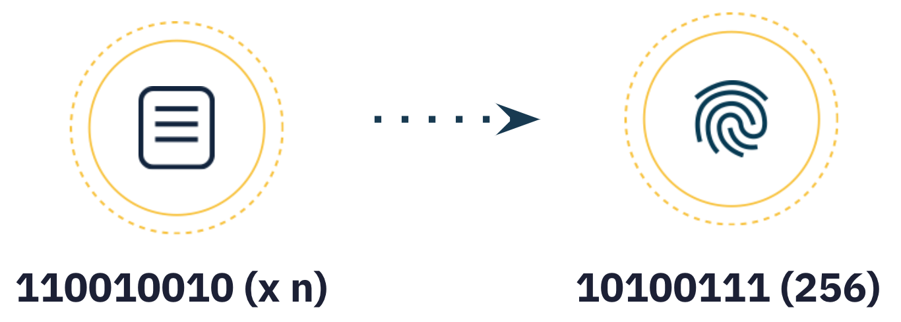
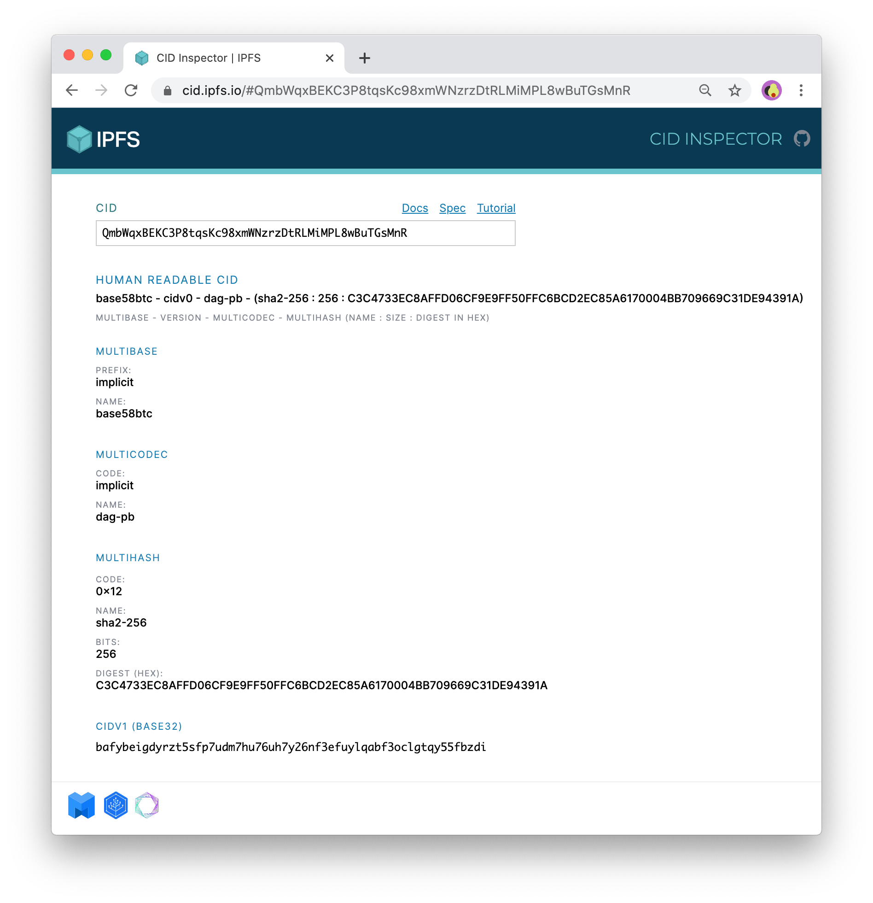

# CID 剖析
探索 CID（内容标识符）的来龙去脉，这是用于指向存储在分布式信息系统（包括 IPFS、IPLD、libp2p 和 Filecoin）上的数据的唯一标签。
## 什么是 CID？ 1
当我们在去中心化网络上与同行交换数据时，我们依靠`内容寻址`（而不是中心化网络的`位置寻址`）`来安全地定位和识别数据`。如果您还没有这样做，请查看我们的去中心化 Web 内容寻址教程，了解重要的去中心化 Web 概念的基础知识，例如内容寻址、加密哈希、内容标识符 (CID) 以及与同行共享。在本教程中，我们将深入剖析 CID，这些 CID 由 [Multiformats](https://multiformats.io/) 项目定义的各种自描述值构成。

起源于 IPFS 的 [CID 规范](https://github.com/multiformats/cid)现在以 Multiformats 存在并支持广泛的项目，包括 IPFS、IPLD、libp2p 和 Filecoin。尽管我们将在整个课程中分享一些 IPFS 示例，但本教程是关于 CID 本身的剖析，这些分布式信息系统中的每一个都将其用作引用内容的核心标识符。

内容标识符或 `CID` 是一种自描述的内容寻址标识符。它并不表示内容存储在哪里，而是根据内容本身形成一种地址。CID 中的字符数取决于底层内容的加密哈希，而不是内容本身的大小。由于 IPFS 中的大多数内容都使用 `sha2-256` 进行哈希处理 ，因此您遇到的大多数 CID 都将具有相同的大小（256 位，相当于 32 字节）。这使它们更易于管理，尤其是在处理多个内容时。

例如，如果我们在 IPFS 网络上存储土豚的图像，它的 CID 将如下所示： 

[QmcRD4wkPPi6dig81r5sLj9Zm1gDCL4zgpEj9CfuRrGbzF](https://ipfs.io/ipfs/QmcRD4wkPPi6dig81r5sLj9Zm1gDCL4zgpEj9CfuRrGbzF)

创建 CID 的第一步是转换输入数据，使用加密算法将任意大小的输入（数据或文件）映射到固定大小的输出。这种转换称为加密散列摘要或简称为散列。

`使用的加密算法` 必须生成具有以下特征的散列：

- 确定性

	相同的输入应该始终产生相同的哈希值。
- 不相关

	输入的一个小变化应该会产生一个完全不同的散列。
- 单向

	从散列重建数据应该是不可行的。
- 唯一

	只有一个文件可以产生一个特定的哈希值
	
请注意，如果我们更改土豚图像中的单个像素，我们的加密算法将为该图像生成完全不同的哈希值。当我们使用内容地址获取数据时，我们可以保证看到该数据的预期版本。这与集中式网络上的位置寻址截然不同，在集中式网络上，给定地址 (URL) 的内容会随着时间而改变。

加密散列并不是 IPFS 独有的，并且有许多散列算法，如 `sha2-256、blake2b、sha3-256` 和 `sha3-512`、不再安全 `sha1` 和 `md5`等。IPFS 默认使用 `sha2-256`，尽管 CID 几乎支持任何强加密散列算法。

## 多重哈希 2
有时，哈希算法可能被证明是不安全的，这意味着它不再符合我们之前定义的特征。这已经发生在 `sha1`. 随着时间的推移，其他算法可能被证明不足以在 IPFS 和其他分布式信息系统中进行内容寻址。出于这个原因，为了支持多种加密算法，我们需要能够知道使用了哪种算法来生成特定内容的哈希值。

那么我们该怎么做呢？为了支持多种哈希算法，我们使用 `multihash`。
### 多重哈希格式
[多重哈希](https://multiformats.io/multihash/) 是一种自描述哈希，它本身包含描述其长度和生成它的加密算法的元数据。多格式 CID 是面向未来的，因为它们使用 multihash 来 `支持多种哈希算法`，而不是依赖于特定的算法。

多重哈希遵循 `TLV` 模式 ( `type-length-value`)。本质上，“原始散列”以 `type` 应用的散列算法和 `length` 散列的前缀为前缀。

- `type`

	用于生成散列的密码算法的标识符（例如标识符 `sha2-256` 将是 `18` - `0x12`十六进制） - 请参阅[多编解码器表](https://github.com/multiformats/multicodec/blob/master/table.csv)以获取所有标识符
- `length`

	散列的实际长度 `sha2-256`（使用它是256位，相当于 32 字节）
- `value`

	 实际`哈希值`

为了将 CID 表示为紧凑的字符串而不是普通二进制（一系列 `1s` 和 `0s`），我们可以使用 `base encoding`。首次创建 IPFS 时，它使用`base58btc` 编码来创建如下所示的 CID：

	QmY7Yh4UquoXHLPFo2XbhXkhBvFoPwmQUSa92pxnxjQuPU
Multihash 格式和 `base58btc` 编码启用了 CID 的第一个版本，现在称为版本 0 (`CIDv0`)，其初始 `Qm...` 字符仍然很容易识别。

然而，随着时间的推移，人们开始怀疑这种多重哈希格式是否足够：

- 我们如何知道使用什么方法对数据进行编码？
- 我们如何知道使用什么方法来创建 CID 的字符串表示形式？我们会一直使用吗 `base58btc`？

为了解决这些问题，有必要进化到下一版本的 CID。在接下来的课程中，我们将探讨添加到规范中以引导我们使用当前 CID 版本的内容：`CIDv1`.

## CIDv1：多编解码器前缀 3
`CIDv0` 使用 multihash 来支持多个哈希函数。这意味着我们可以使用不同的散列算法成功地为特定内容生成一个散列，然后能够使用这个散列来识别内容。

但是当我们试图读取数据本身时，我们如何知道所使用的编码方法呢？它可以使用 CBOR、Protobuf、纯 JSON 等进行编码。为了解决这个问题，CIDv1 引入了另一个前缀来唯一标识所使用的编码方法。
### 多编解码器前缀
多编解码器前缀指示对数据使用了哪种编码。

Multicodec 支持许多不同类型的编码，并且每种都有自己的短编解码器标识符，如[完整表](https://github.com/multiformats/multicodec/blob/master/table.csv)所示。

在上面的示例中，我们看到了如何在我们的 CID 中表示使用 `dag-pb` 编解码器编码的数据。 `dag-pb` 是许多不同类型的 [IPLD](https://ipld.io/)（星际关联数据）编解码器中的一种。因为 IPFS 始终为其数据使用其中一种 IPLD 格式，所以 `IPFS CID 中的多编解码器前缀将始终是 IPLD 编解码器`。

然而，重要的是要注意 multicodec 不仅被 IPFS 和 IPLD 使用。与 multihash 和其他一些自描述协议一起，它是 [Multiformats](https://multiformats.io/) 项目的一部分，该项目从 IPFS 中分离出来，现在支持各种其他项目和协议，包括我们在这里学习的 [CID 规范](https://github.com/multiformats/cid)。

## CIDv1：版本前缀 4
现在我们已经添加了一个多编解码器，我们的版本 1 CID 包含以下字段：

	<multicodec><multihash-algorithm><multihash-length><multihash-hash>
但是，如果你还记得之前的课程，Version 0 CIDs 只包含部分 `<multihash-*>`，那么我们如何区分不同版本的 CIDs？你猜对了，更多的前缀！

所以现在我们的 CID 看起来像这样：

	<cid-version><multicodec><multihash>
代表 `<cid-version>` CID 的版本（0 或 1）。

	注意，只有 CIDv1 包含版本前缀， CIDv0 没有

## CIDv1：多基前缀 5
所以现在我们的二进制 CIDv1（0 和 1）为我们提供了以下信息：

	<cid-version><multicodec><multihash>
由于二进制 CID 不是很人性化，我们可以将这些二进制 CID 表示为字符串形式（以文本表示的二进制数据）。例子：

	bafybeigdyrzt5sfp7udm7hu76uh7y26nf3efuylqabf3oclgtqy55fbzdi
在二进制和字符串格式之间转换数据需要基本编码，因此在使用字符串 CID 时，重要的是我们知道应用于二进制数据的基本编码类型。
### 但是我们如何识别呢？
在 `CIDv0` 中，哈希总是用 `base58btc` . 总是。这意味着我们可以安全地解释 `CIDv0` 哈希，假设它们使用 `base58btc`. 然而，由于环境限制（例如 DNS 名称），我们还需要支持其他基本编码的能力。为此，您猜对了，我们可以添加另一个前缀！
### 多基前缀
[Multibase](https://github.com/multiformats/multibase) 前缀表示在字符串和二进制格式之间转换 CID 时使用的基本编码，`仅用于 CID 的字符串形式`：

让我们检查两个字符串形式的 CID 示例：

- 我们知道第一个是 `CIDv0` 因为它以 `Qm..` 开头.。所有以 `Qm..` 开头的哈希值都可以安全地解释为 `base58btc` 版本 0 的 CID。
- 第二个示例以 `b` 开头，这是 `base32` 的基本编码前缀标识符，大多数 IPFS 实现默认使用它。

`multibase` 有关标识符的完整列表，请参阅[此表](https://github.com/multiformats/multibase/blob/master/multibase.csv)。

## 一个哈希，多个 CID 版本 6
您可以将任何 IPFS CID 粘贴到方便的 [CID 检查器](http://cid.ipfs.io/) 中，以可视化其所有前缀及其代表的内容。

在最后一课中，我们将使用 CIDv0 和 CIDv1 格式查看此工具的一些结果。

### 示例 1：CIDv1
[bafybeigdyrzt5sfp7udm7hu76uh7y26nf3efuylqabf3oclgtqy55fbzdi](https://cid.ipfs.io/#bafybeigdyrzt5sfp7udm7hu76uh7y26nf3efuylqabf3oclgtqy55fbzdi)

查看 CID Inspector 工具的结果，我们可以看到该工具能够为我们解析的几个部分：

- Human Readable CID

	分解了 CID 的每个部分，以便我们人类轻松阅读
- Multibase:code

	是基的标识符，在本例中 `b` 为base32.
- Multicodec:code

	是编解码器的标识符，在本例中 `0x70` 为 `dag-pb` 的 IPLD 格式
- Multihash

	将多重散列分解为使用的
	
	- 散列算法（18是 `sha2-256` 的代码）
	- 散列长度（256 位，相当于 32 字节）
	- 和内容散列本身（摘要十六进制）。
从“人类可读 CID”细分中，我们可以看到在添加适当的 CIDv1 前缀之前，内容的原始哈希是 `C3C4733EC8AFFD06CF9E9FF50FFC6BCD2EC85A6170004BB709669C31DE94391A`.

### 示例 2：CIDv0
[QmbWqxBEKC3P8tqsKc98xmWNzrzDtRLMiMPL8wBuTGsMnR](https://cid.ipfs.io/#QmbWqxBEKC3P8tqsKc98xmWNzrzDtRLMiMPL8wBuTGsMnR)

这个版本 0 CID 显示了一些不同的结果： `multicodec` 和 `multibase` 都被列为“隐式”（因为根本没有）。由于版本 0 CID 没有这些前缀，因此它们总是分别被假定为 `base58btc` 和`dag-pb`。

 CIDV1 在我们看到的 `Base32` 标签下 `bafybeigdyrzt5sfp7udm7hu76uh7y26nf3efuylqabf3oclgtqy55fbzdi`，它与第一个示例中的 CID 相同！CID Inspector 为我们提供了从 CIDv0 到 CIDv1 的转换。

另请注意 “人类可读 CID” 的结尾（前缀后的部分）在此 CIDv0 示例中与 CIDv1 示例中的完全相同：
	
	C3C4733EC8AFFD06CF9E9FF50FFC6BCD2EC85A6170004BB709669C31DE94391A。
为什么？这两个 CID 指向相同的内容 。基本上，它是 CID 规范的两个不同版本中表示的相同哈希 `(C3C4733EC8AFFD06CF9E9FF50FFC6BCD2EC85A6170004BB709669C31DE94391A )`。

### 转换 CID 版本
您可以将任何 `CIDv0` 转换为 `CIDv1`，因为隐式前缀在 `v0` 中变得显式 `v1`。但是由于 `CIDv1` 支持多种编解码器和多种基数而  `CIDv0`  不支持，因此并非所有都 `CIDv1` 可以转换为 `CIDv0`. 

事实上，只有 `CIDv1` 同时具有以下属性的才可以转换为 `CIDv0`：

- multibase = base58btc
- multicodec = dag-pb
- multihash-algorithm = sha2-256
- multihash-length = 32（32字节，相当于256位）

为了验证这一理论，您可以在此处查看我们心爱的土豚图像，该图像托管在 IPFS 网络上：[https://ipfs.io/ipfs/QmcRD4wkPPi6dig81r5sLj9Zm1gDCL4zgpEj9CfuRrGbzF](https://ipfs.io/ipfs/QmcRD4wkPPi6dig81r5sLj9Zm1gDCL4zgpEj9CfuRrGbzF)

- 在浏览器中打开链接并复制 URL 末尾的 CID (`QmcRD4wkPPi6dig81r5sLj9Zm1gDCL4zgpEj9CfuRrGbzF`)
- 在新的浏览器窗口中，将其粘贴到 `CID Inspector` 工具中，找到屏幕底部显示的等效 CIDv1 值
- 回到你的选项卡，将原始 URL 中 CIDv0 替换为转换后的 CIDv1 并刷新页面

你应该看到我们土豚的相同图像。

