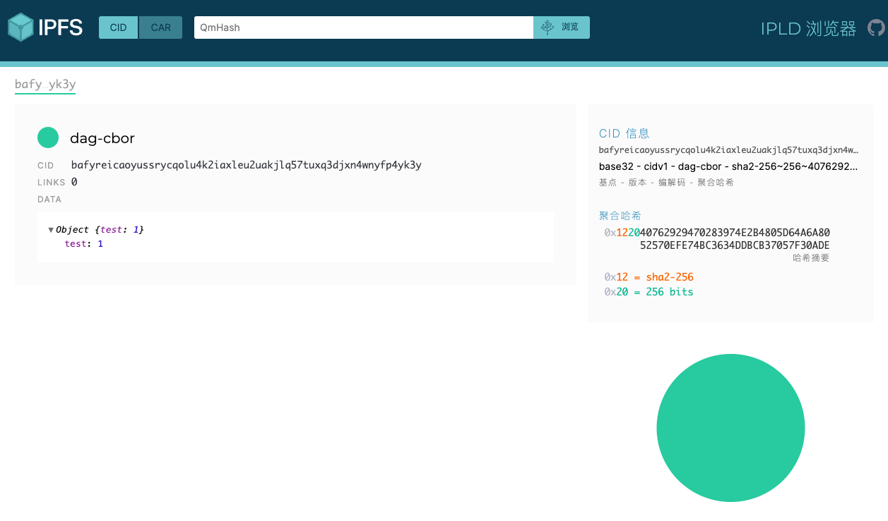
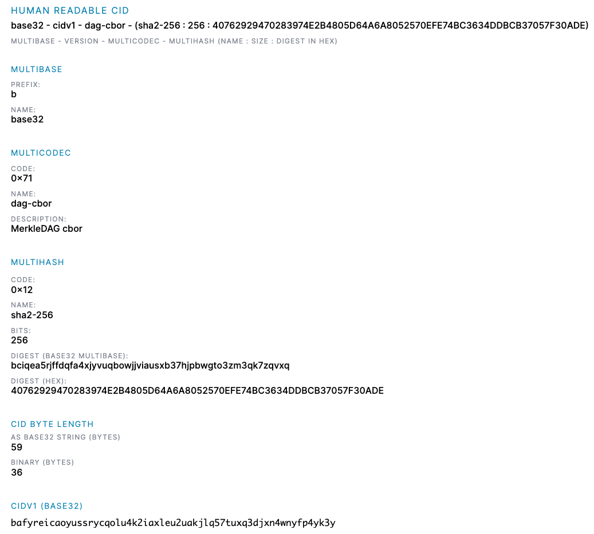
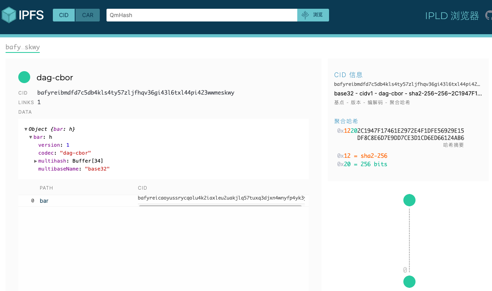
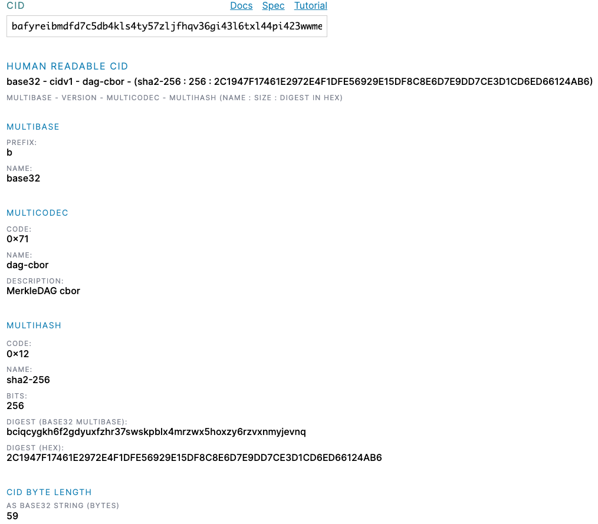

# 基础-具有内容寻址的 P2P 数据链接 
使用 IPFS DAG API 和 CID 在对等托管的数据集之间存储、获取和创建可验证的链接。这是和朋友的图表！
## 创建一个节点并返回一个内容标识符（CID）1
- 有用的概念

	CID - 内容标识符。IPFS 中从其内容派生的数据块的唯一地址。

在本教程中，我们将探索 [IPFS DAG API](https://github.com/ipfs/js-ipfs/blob/master/docs/core-api/DAG.md)，它允许我们将数据对象存储在 IPFS 中。（你可以在 IPFS 中存储更多令人兴奋的东西，比如你最喜欢的猫 GIF，但你需要为此使用不同的 API。）

您可以通过将数据对象传递到方法中来创建新节点 [ipfs.dag.put](https://github.com/ipfs/js-ipfs/blob/master/docs/core-api/DAG.md#ipfsdagputdagnode-options)，该方法会为新创建的节点返回内容标识符 (CID)。

	ipfs.dag.put({ hello: 'world' })
CID 是 IPFS 中从其内容派生的数据块的地址。每次有人将相同的 `{ hello: 'world' }` 数据放入 IPFS 时，他们都会取回与您获得的相同的 CID。如果他们改为输入 `{ hell0: 'w0rld' }`，CID 将不同。

注意：在我们的课程中，我们将使用如下所示的代码编辑器。`run` 在为您预先填充的函数中输入您的解决方案代码，确保在该函数中返回请求的值。

- [demo](https://proto.school/basics/01)
	
	用于 `ipfs.dag.put` 为数据创建节点{ test: 1 }。返回新节点的 CID。
	
	- 编码
		
			/* globals ipfs */
			
			const run = async () => {
			  let cid = await ipfs.dag.put({ test: 1 })
			  return cid
			}
			
			return run
	- [在 IPLD 游览器查看 DAG 解析](https://explore.ipld.io/#/explore/bafyreicaoyussrycqolu4k2iaxleu2uakjlq57tuxq3djxn4wnyfp4yk3y)
	
		
	- [在 IPLD INSPECTOR 查看 CID 解析](https://cid.ipfs.tech/#bafyreicaoyussrycqolu4k2iaxleu2uakjlq57tuxq3djxn4wnyfp4yk3y)
	
		
	
## 创建一个链接到旧节点的新节点 2
- 有用的概念
	- CID - 内容标识符。IPFS 中从其内容派生的数据块的唯一地址。
	- DAG - 有向无环图。IPFS 中的块形成一个图形，因为它们可以通过其 CID 指向其他块。这些链接只能指向一个方向（有向），并且在整个图中没有循环或循环（非循环）。

[有向无环图(DAG)](https://en.wikipedia.org/wiki/Directed_acyclic_graph) 的一个重要特征是能够将它们链接在一起。

在 IPFS DAG 存储中表达链接的方式是使用 CID 另一个节点的。

例如，一个节点可能有一个名为 `foo` 的链接指向另一个先前保存为 的 CID 实例 `barCid`，如下所示：

	{
	  foo: barCid
	}
当我们给一个字段一个名称并使其值成为一个 CID 的链接时，如上所示，我们称之为`命名链接`。

我们可以像添加任何其他数据一样向 IPFS 添加命名链接：

	await ipfs.dag.put({ foo: barCid })	

- [demo](https://proto.school/basics/02)

	创建一个名为的命名链接 `bar`，它指向我们在第一课中创建的节点。将其放入 IPFS 并返回其 CID。

	编辑器预先填充了用于创建我们要链接到的节点的代码
	
	- 编码

			/* globals ipfs */
			
			const run = async () => {
			  let cid = await ipfs.dag.put({ test: 1 })
			  let cid2 = await ipfs.dag.put({ bar: cid })
			  return cid2
			}
			
			return run
	- [在 IPLD 游览器查看 DAG 解析](https://explore.ipld.io/#/explore/bafyreibmdfd7c5db4kls4ty57zljfhqv36gi43l6txl44pi423wwmeskwy)

		
	- [在 IPLD INSPECTOR 查看 CID 解析](https://cid.ipfs.io/#bafyreibmdfd7c5db4kls4ty57zljfhqv36gi43l6txl44pi423wwmeskwy)

		

### 使用链接读取嵌套数据 3
您可以使用路径查询从深度嵌套的对象中读取数据。

	let cid = await ipfs.dag.put({
	  my: {
	    deep: {
	      obj: 'is cool'
	    }
	  }
	})

	console.log(await ipfs.dag.get(cid, {
	  path: '/my/deep/obj'
	}))
	// prints { value: 'is cool', remainderPath: '' }

[ipfs.dag.get](https://github.com/ipfs/js-ipfs/blob/master/docs/core-api/DAG.md#ipfsdaggetcid-options) 允许使用 IPFS 路径进行查询并返回我们称为节点的解码块。返回值是一个对象，其中包含查询值和任何未解析的剩余路径。

这个 API 的妙处在于它还可以遍历链接。

	let cid = await ipfs.dag.put({ foo: 'bar' })
	let cid2 = await ipfs.dag.put({
	  my: {
	    other: cid
	  }
	})
	
	console.log(await ipfs.dag.get(cid2, {
	  path: '/my/other/foo'
	}))
	// prints { value: 'bar', remainderPath: '' }
明白了！注意上面这个方法返回的不是值本身，而是一个包含 `value` 属性的对象。`value` 在承诺完成之前，您无法访问该属性，这个问题可以通过两种方式解决：

	// 选项1:用圆括号括起 await 语句以完成承诺
	return (await ipfs.dag.get(cid2, {
	  path: '/my/other/foo'
	})).value
	
	// 选项2:将结果保存到一个变量，然后访问它的值
	let node = await ipfs.dag.get(cid2, {
	  path: '/my/other/foo'
	})
	return node.value

- [demo](https://proto.school/basics/03)

	使用 `ipfs.dag.get` 通过遍历上一个挑战中放入的对象的链接返回 `test` 的值。(提示:确保只有在 `promise` 完成后才访问`value`属性。)
	
	- 代码

			/* globals ipfs */
			
			const run = async () => {
			  // 写入
			  let cid = await ipfs.dag.put({ test: 1 })
			  let cid2 = await ipfs.dag.put({ bar: cid })
			  
			  // 读出
			  let node = await ipfs.dag.get(cid2, {
			    path: '/bar/test'
			  })
			  return node.value
			}
			
			return run

	
