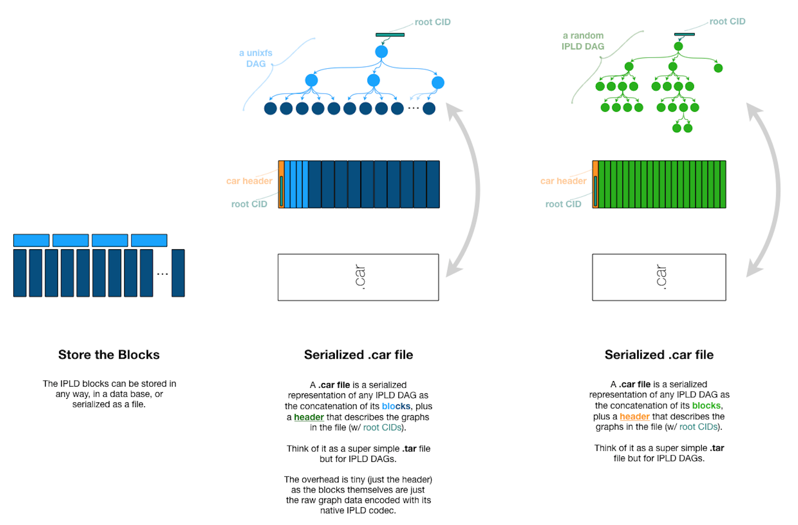

# 规范:内容可寻址档案(CAR / .car)v1
## 概述
CAR格式（Content Addressable aRchives）可用于将 IPLD 块数据形式的内容可寻址对象存储为字节序列；通常在具有文件扩展名的文件中 `.car`。

CAR 格式旨在作为任何 IPLD DAG（图形）的序列化表示，作为其块的串联，加上描述文件中图形的标题（通过根 CID）。CAR 中的块组成连贯 DAG 的要求并不严格，因此 CAR 格式也可以用来存储任意 IPLD 块。

除了二进制块数据之外，CAR 格式的存储开销还包括：

- 编码为 [DAG-CBOR](https://ipld.io/specs/codecs/dag-cbor/) 的标头块，包含格式版本和根 CID 数组
- 其二进制数据之前的每个块的 CID
- 每个块（包括标头块）的前缀压缩整数，指示该块的总长度，包括编码 CID 的长度

此图显示 IPLD 块、它们的根 CID 和标头如何组合形成 CAR。

- 存储块(Store the Blocks)

	IPLD 块可以在任何方式存储在数据库或序列化文件中
- 序列化 car 文件1

	car 文件是任何 IPLD DAG 的串行表示，作为其块的串联，加上描述文件中图形的头(`w/root CIDs`)
	
		对于 IPLD DAG 来说可以将其视为一个超级简单的 .tar 文件

	开销很小(只有标头)，因为块本身只是用其原生 IPLD 编辑器编码的原始图形数据
- 序列化 car 文件2

	car 文件是任何 IPLD DAG 的串行表示，作为其块的串联。加上描述文件中的图形标题(w/root CID)
	
		对于 IPLD DAG 来说可以将其视为一个超级简单的 .tar 文件
	
Certified ARchive 这个名称以前也被用来指代 [CAR 格式](https://github.com/ipfs/archive-format)

## 格式说明
CAR 格式包含一系列以长度为前缀的 IPLD 块数据，

- 其中 CAR 中的第一个块是编码为 CBOR 的标头
- 其余块构成 CAR 的数据组件，并且每个块都附加了它们的 CID 前缀。

CAR 中每个块的长度前缀被编码为 `varint` —— 一个无符号的 [LEB128](https://en.wikipedia.org/wiki/LEB128) 整数。该整数指定该块条目的剩余字节数——不包括用于对整数进行编码的字节，但包括非标头块的 CID。

	|--------- Header --------| |---------------------------------- Data -----------------------------------|
	
	[ varint | DAG-CBOR block ] [ varint | CID | block ] [ varint | CID | block ] [ varint | CID | block ] …

### 标头
CAR 格式的第一个字节包含一个 `varint`，这个无符号整数指定包含 Header 块的 `varint` 本身之外的字节数。这个标头块是一个字节数组` DAG-CBOR`（CBOR，CID 的标签为 42）编码的对象，其中包含版本号和根数组。作为 IPLD 模式：

	type CarHeader struct {
	  version Int
	  roots [&Any]
	}
### 约束条件
- version 的值始终为 1。本规范的未来迭代可能会用于 `version` 引入格式的变体。
- 该 roots 数组必须包含一个或多个CID，每个 CID 都应出现在 CAR 其余部分的某处。

（注意事项：请参阅未解决问题下的[根数](https://ipld.io/specs/transport/car/carv1/#number-of-roots)和 [根 CID 块的存在](https://ipld.io/specs/transport/car/carv1/#root-cid-block-existence)。）

### 数据
紧接着 Header 块，一个或多个 IPLD 块被连接起来形成CAR 格式的数据部分。（注意：请参阅未解决问题下的[零块](https://ipld.io/specs/transport/car/carv1/#zero-blocks)。）每个块都通过以下值的串联编码为一个部分：

- 本节中组合的 CID 和数据的字节长度，编码为 `varint`
- 本节中块的 CID，以 CID 的原始字节形式编码
- 数据块的二进制数据

### 长度
每个 Section 都以无符号整数[LEB128](https://en.wikipedia.org/wiki/LEB128)的 varint 表示形式开头，指示包含该部分其余部分的字节数。
### 客户识别码
在长度之后，块的 CID 以原始字节形式包含在内。读取 Section 的解码器必须根据 CID 字节编码规则对 CID 进行解码，该编码规则不提供稳定的长度。有关 CID 编码的详细信息，请参阅 [https://github.com/multiformats/cid](https://github.com/multiformats/cid) 。目前支持 CIDv0 和 CIDv1。（注意：请参阅未解决问题下的[CID 版本](https://ipld.io/specs/transport/car/carv1/#cid-version)。）

- CID 字节解码总结

	有关完整详细信息，请参阅 [CID 规范](https://github.com/multiformats/cid)。

	- CIDv0 

		由第一个字节指示，`0x12` 后跟 `0x20` 指定 32 字节 ( `0x20`) 长度的 SHA2-256 (`0x12` ) 摘要)。
	- CIDv1
	
		找不到 `0x12, 0x20` 表示 CIDv1，它通过读取解码：

		- 作为无符号 `varint` 的版本（应该是1）
		- 作为无符号 `varint` 的编解码器（根据 [多编解码器表](https://github.com/multiformats/multicodec/blob/master/table.csv) 有效）
		- [multihash](https://github.com/multiformats/multihash) 的原始字节

			读取 multihash 需要部分解码以确定长度：

				| hash function code (varint) | digest size (varint) | digest |
			multihash 的前两个字节是 `varint`，其中第二个 `varint` 是一个无符号整数，指示 multihash 剩余部分的长度。因此，手动解码需要读取两次 `varint`，然后将这些 `varint` 的字节以及第二个 `varint` 指示的字节数复制到字节数组中。

### 数据
在长度前缀和 CID 之后，Section 的其余部分包含 IPLD 块的原始字节数据。编码块可以是 CID 中编解码器指定的任何 IPLD 块格式。典型的编解码器将是 

- [DAG-PB](https://ipld.io/specs/codecs/dag-pb/)
- [DAG-CBOR](https://ipld.io/specs/codecs/dag-cbor/)
- [RAW](https://github.com/ipld/specs/issues/223)

## 其他注意事项
### 决定论
本规范不涵盖确定性 CAR 创建。然而，从给定的图形中确定性地生成 CAR 是可能的，并且依赖于格式的某些用途，最著名的是 [Filecoin](https://filecoin-project.github.io/specs)。具体来说，Filecoin 确定性 car 文件目前被实现定义为包含所有 DAG 形成块，按第一次看到的顺序，作为从单个根开始的深度优先 DAG 遍历的结果。

可以应用用于生成 CAR 格式的附加规则，以确保始终从相同的数据生成相同的 CAR。这种确定性的负担主要放在选择器上，因此应用于给定图的给定选择器将始终以相同的顺序产生块，而不管实现如何。

严格的确定性可能还需要注意标头中数组的排序 `roots` 以及 CID 版本的考虑（见[下文](https://ipld.io/specs/transport/car/carv1/#cid-version)）和避免重复块（见[下文](https://ipld.io/specs/transport/car/carv1/#cid-version)） 。

所有这些考虑都留给了 CAR 格式的用户，并且应该记录在那里，因为该规范本身并不支持确定性。
### 表现
有关性能的一些注意事项：

- 流式传输

	CAR 格式非常适合通过流式读取转储块，因为可以首先加载标头，并且正在进行的解析需要最少的状态。
- 单个块读取

	由于 CAR 格式不包含索引信息，读取需要部分扫描以发现所需块的位置或者必须维护和引用外部索引以查找和部分读取该数据。有关索引，请参见下文。
- DAG 遍历

	没有外部索引，如果不将所有块转储到更方便的数据存储中或通过部分扫描以根据需要找到每个块，则不可能遍历由“根”CID 指定的 DAG，这可能效率太低要实用。
- 修改

	CAR 可以在初始写入后附加，因为标头中没有关于总长度的限制。如果 CAR 旨在包含连贯的 DAG 数据，则必须小心附加。
	
### 安全性和可验证性
CAR 的标头指定的根必须出现在其数据部分的某个位置，但是不要求根定义整个 DAG，也不要求 CAR 中的所有块都必须是标头中根 CID 描述的 DAG 的一部分。因此，不得单独使用词根来确定或区分 CAR 的内容。

除了 IPLD 块格式及其 CID 之外，CAR 格式不包含任何内部方法来验证或区分内容。如果存在这样的要求，则必须在外部执行，例如创建整个 CAR 的摘要。
### 索引和寻求阅读
CAR 格式不包含内部索引，任何索引都必须存储在 CAR 外部。然而，这样的索引是可能的，并且使搜​​索读取变得实用。存储字节偏移量（Section 开始或块数据开始）和长度（Section 或块数据）的索引，由 CID 键控，将通过查找偏移量和读取块数据来启用单个块读取。此处未指定任何此类索引的格式，并留给 CAR 格式解析实现。
### 填充
CAR 格式不包含指定的填充方式来实现特定的总存档大小或块数据的内部字节偏移对齐。因为不要求每个块都是 CAR 的根之一下的连贯 DAG 的一部分，所以可以使用虚拟块条目来实现填充。这样的填充还应该考虑到长度前缀 varint 的大小和一个部分的 CID。所有部分都必须有效，并且虚拟条目仍应解码为有效的 IPLD 块。
## 实现
- go
	- [https://github.com/ipld/go-car](https://github.com/ipld/go-car)

		在 Filecoin 中用于创世块共享。支持通过数据存储的 DAG 遍历创建：

			WriteCar(ctx context.Context, ds format.DAGService, roots []cid.Cid, w io.Writer) (error)
		并通过操作写入数据存储 `Put(block)`：

			LoadCar(s Store, r io.Reader) (*CarHeader, error)
- JavaScript
	- [https://github.com/ipld/js-car](https://github.com/ipld/js-car)

		@ipld/car 通过其不同类上的工厂方法使用。每个类代表一组离散的功能，例如写入或读取 .car 文件：

			import fs from 'fs'
			import { Readable } from 'stream'
			import { CarReader, CarWriter } from '@ipld/car'
			import * as raw from 'multiformats/codecs/raw'
			import { CID } from 'multiformats/cid'
			import { sha256 } from 'multiformats/hashes/sha2'
			
			async function example () {
			  const bytes = new TextEncoder().encode('random meaningless bytes')
			  const hash = await sha256.digest(raw.encode(bytes))
			  const cid = CID.create(1, raw.code, hash)
			  const { writer, out } = await CarWriter.create([cid])
			  Readable.from(out).pipe(fs.createWriteStream('example.car'))
			
			  await writer.put({ cid, bytes })
			  await writer.close()
			
			  const inStream = fs.createReadStream('example.car')
			  const reader = await CarReader.fromIterable(inStream)
			  const roots = await reader.getRoots()
			  const got = await reader.get(roots[0])
			
			  console.log('Retrieved [%s] from example.car with CID [%s]',
			    new TextDecoder().decode(got.bytes),
			    roots[0].toString())
	}

## 未解决的项目
### 根数
关于 rootsHeader 块的属性：

- 当前的 Go 实现在创建 CAR 时假定至少有一个 CID
- 当前的 Go 实现在读取 CAR 时至少需要一个 CID
- 当前的 JavaScript 实现允许零个或多个根
- 当前在 Filecoin 中使用 CAR 格式需要一个 CID

roots 数组应该如何约束尚未解决。`建议在此版本的 CAR 格式中仅使用单个根 CID`。

对于难以包含根 CID 但需要安全地位于“至少一个”建议范围内的用例，一种解决方法是使用空 CID：（零长度“身份”多重哈希与“原始”编解码器 `\x01\x55\x00\x00`). 由于此版本 CAR 规范的当前实现不检查根 CID 是否存在（请参阅根 [CID 块存在](https://ipld.io/specs/transport/car/carv1/#root-cid-block-existence)），因此就 CAR 实现而言，这将是安全的。但是，不能保证使用 CAR 文件的应用程序会正确使用（忽略）这个空的根 CID。

### 零块
一个有效的 CAR 是否必须至少包含一个块或者空 CAR 是否是一种有效的格式并且应该被编码器和解码器接受，目前还没有解决。
### 根 CID 块存在
一个实现是否必须验证存在于 Header 的根数组中的 CID 是否也作为一个块出现在存档中尚未解决。虽然预计会出现这种情况，但编码器和解码器是否必须验证存档中根块的存在尚未解决。

此版本的 CAR 规范的当前实现不检查 CAR 主体中是否存在根块。
### 客户端版本
CID 版本 0 和 1 格式是否在根数组和每个块部分的开头都有效尚未解决。当前的实现不检查根数组中的 CID 版本，并且两个 CID 版本在每个块部分中也是可接受的。关于此规范的讨论建议将整个格式（不在块内）使用的 CID 限制为 CIDv1 —— 如果编码器提供 CIDv0 则需要转换，并且要求 CAR 的读取器确保 CIDv1 是唯一可用的块密钥。
### 重复块
当前未指定单个 CAR 中重复块的可能性（例如用于填充）。=
## 测试工具
为了帮助实现确认符合本规范，可以使用以下测试装置：

- [carv1-basic](https://ipld.io/specs/transport/car/fixture/carv1-basic/) - 具有链接原始、DAG-PB 和 DAG-CBOR 块的基本 CAR

## 参考
https://ipld.io/specs/transport/car/