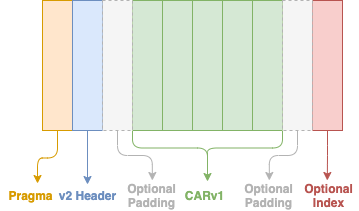

# 规范：Content Addressable aRchives (CAR / .car) v2
## 概括
CARv2 是对 [CARv1](https://ipld.io/specs/transport/car/carv1/) 格式的最小升级，其主要目的是在格式内添加可选索引以快速随机访问块。

CARv2 通过使用包含 pragma 和标头的前缀以及包含可选索引数据的后缀包装正确形成的 CARv1 来使用 CARv1。一旦使用 CARv2 解析规则确定了 CARv1 字节的偏移量和长度。虽然不一定是理想的，但可以使用现有的 CARv1 解码器来读取根和 `CID:Bytes` 对。同样，CARv1 编码器可用于编码此数据，以便由 CARv2 编码器进行包装，因为有效载荷是相同的格式。
## 格式说明
CARv2 包括：

- 将数据标识为 CARv2 格式的 11 字节编译指示。
- 描述 CARv2 的一些特征以及数据有效载荷和索引有效载荷在 CARv2 中的位置的标头。
- 标准 CARv1 数据有效载荷，包括标准 CARv1 标头和根以及对序列 `CID:Bytes`。
- 一个可选的索引有效负载，它可能是许多受支持的索引格式之一，允许在数据有效负载中快速查找块。

CARv2格式可以说明如下：

图:内容可寻址 aRchive v2 部分

	| 11-byte fixed pragma | 40-byte header | optional padding | CARv1 data payload | optional padding | optional index payload |

## 语用
选择 CARv2 版本 pragma（或 [魔术字节](https://en.wikipedia.org/wiki/List_of_file_signatures)）是为了与现有的 CARv1 解析器兼容。CARv1 以 [DAG-CBOR](https://ipld.io/specs/codecs/dag-cbor/) 块开头，以 varint 为前缀，其中该块包含版本和根数组：

	type CarV1Header struct {
	  version Int # 1
	  roots [&Any]
	}
要引入现有解析器可以安全拒绝为“不受支持的版本”的新版本，我们必须使用新版本复制此标头的最小形式。

因此，CARv2 头部是一个固定的 11 字节序列：`0x0aa16776657273696f6e02`.

这些字节解码如下：

一个前导 `0x0a`，它被翻译成一个 `uint(10)`（或 `varint(10)`）指示后面跟着的 DAG-CBOR 头块的长度。剩余的 10 个字节是一个映射的标准 CBOR 编码，其中包含一个 `version` 值为的字段 2。例如

	type CarV2Header struct {
	  version Int # 2
	}
这10个字节在CBOR中解析如下：

	a1                                                # map(1)
	  67                                              #   string(7)
	    76657273696f6e                                #     "version"
	  02                                              #   uint(2)
现有的 CARv1 解析器应该安全地读取这个 pragma 并拒绝字节流作为 CAR 格式的不受支持的版本。

这个 11 字节的字符串保持固定，可以使用简单的字节比较进行匹配，并且不需要 varint 或 CBOR 解码，因为它不会因 CARv2 格式而变化。
## 标头
在 11 字节 pragma 之后，CARv2 是一个 40 字节的固定长度序列，分为以下部分：

- 特征

	一个 128 位（16 字节）的位域，用于描述所附数据的某些特征。
- 数据偏移量

	一个 64 位（8 字节）无符号小端整数，指示从 CARv2 开头到 CARv1 数据有效载荷的第一个字节的字节偏移量。
- 数据大小

	一个 64 位（8 字节）无符号小端整数，指示 CARv1 数据有效载荷的字节长度。
- 索引偏移量

	一个 64 位（8 字节）无符号小端整数，指示从 CARv2 的开头到索引有效负载的第一个字节的字节偏移量。该值可能0表示缺少索引数据。

## 特征
CARv2 标头中包含的特征位字段可用于指示特定 CARv2 的某些特征。默认情况下，位域中的所有位都将被取消设置 (0 )，并且仅在它们用于表示非默认特征的情况下 设置 (1)。

特征位字段中的第一个（即最左边的位）值指定索引是否表示出现在数据有效载荷中的部分的完整目录，称为 `fully-indexed` 特征。设置此特性时 ( 1)，索引必须包含部分 CID 的完整目录，无论它们是否是身份 CID。

未使用特征位字段的提示，应取消设置所有位 ( 0)。本规范的未来迭代可能会引入特征指标，例如：

- DAG 遍历排序

	无、深度优先、广度优先或通过 [IPLD 选择器](https://ipld.io/specs/selectors/)。
- 去重状态

## CARv1 数据载荷
CARv1 数据有效载荷从 CARv2 标头指示的“数据偏移量”开始。重要的是解码器遵守此偏移量而不是假设数据有效负载紧接在标头之后开始，以便在本规范的未来修订中允许标头后面的附加数据，如特征字段所示。

CARv1 数据有效载荷在标头中“数据大小”字段指示的字节数之后结束。这很重要，因为 CARv1 解析器除了遇到字节流的末尾之外无法确定范围。因此，CARv2 解码器可能会遵从 CARv1 解码器来加载 `CID:Bytes` 序列有效载荷和“根”数组，但必须能够向其提供严格从“数据偏移量”开始并在“数据大小”字节之后结束的字节流抵消。

数据有效载荷是一个完整的、独立的 CARv1。因此，它必须包含一个有效的 CARv1 标头，包括一个根数组和一个 `version` 值严格为的字段1，后跟一系列数据块。因此，从 CARv2 到 CARv1 的转换只需要提取数据有效载荷而无需进一步修改。

有关 CARv1 格式的详细信息，请参阅 [CARv1 规范](https://ipld.io/specs/transport/car/carv1/)。
## 索引负载
CARv2 索引有效载荷在 CARv1 数据有效载荷之后，但可能会根据特征字段的指示通过填充或附加数据进行偏移。如果存在索引，则索引有效负载从“索引偏移量”开始，它必须在 CARv2 数据有效负载结束之后，并继续直到 CARv2 字节流结束（其长度未在标头中编码）。

CARv2 标头中的“索引偏移”值 0 表示此 CARv2 中没有索引，不应尝试读取它。
## 索引格式
CARv2 索引本身是一种灵活的格式，允许根据特定应用程序或数据集的适用性（生成速度、使用性能、大小等）使用不同的索引布局。支持的索引格式将在下面的本规范中详细说明。

目前，一旦从 CARv2 中读取，索引数据会提供哈希摘要字节到块位置的映射，以字节偏移量从 CARv1 数据有效负载的开头（而不是 CARv2 的开头）开始。该索引仅使用散列摘要——它不使用 CID 的完整字节，也不使用任何多散列前缀字节。未来的索引格式可能会在索引中引入替代映射方案或附加数据。

CARv2 索引的第一个字节（在“索引偏移”位置）包含一个无符号 [LEB128](https://en.wikipedia.org/wiki/LEB128) 整数（“varint”），指示索引格式类型为多编解码器代码。其余字节遵循该索引格式类型的编码规则。

由于索引仅包含哈希摘要字节，因此必须通过检查数据有效负载中块条目的初始字节来导出块的 CID 中包含的其他详细信息和块字节的长度。

除非设置了特征，否则索引 `不应包含身份哈希 CIDfully-indexed`。假设将 CARv2 用作块存储将通过从 CID 中提取数据立即返回身份 CID 数据，因此不需要为此类条目提供索引。然而，当 `fully-indexed` 特征被设置时，blockstore 应该将具有标识 CID 的块保存到 CARv2 数据有效载荷中并对其进行索引。
## 格式 0x0400：索引排序
“Index offset” 字节位置处的无符号 varint0x0400 指示 CAR 的剩余字节应解释为 “IndexSorted” 格式。

IndexSorted 按两个维度对哈希摘要进行排序：

- 首先放入摘要长度为 的桶中，从最小到最大，
- 然后在这些桶中按简单的字节顺序排序。这样，在 CAR 中定位哈希摘要需要首先找到与请求的哈希摘要长度匹配的桶，然后在该桶内搜索有序的摘要列表以找到匹配的条目。

- IndexSorted 可能包含一个或多个按长度分组的摘要桶。
- 桶按摘要长度排序并连接在一起形成索引。
- 每个桶的前缀是：
	- 编码为 32 位无符号小端整数的 “宽度”，指示散列摘要组合的公共字节长度及其在该桶中的偏移量；其次是
	- 一个编码为 64 位无符号小端整数的“计数”，它确定哈希摘要（及其偏移量）桶的总数。

由于 CID 的这种摘要长度的共性，预计单个桶的 32 字节哈希摘要的常见情况。

各个索引条目是哈希摘要和一个附加的 64 位无符号小端整数的串联，指示块从 CARv1 数据有效载荷开始的偏移量。`CID:Bytes` 偏移量定位在 CARv1 有效负载中为该对添加前缀的 varint 的第一个字节。有关块编码的详细信息，请参阅 [CARv1 规范中的数据部分](https://ipld.io/specs/transport/car/carv1/#data)。

例如，包含 32 字节散列摘要的桶将具有“宽度”，40 因为桶中的每个条目都是 32 字节摘要和 8 字节偏移值的串联。桶内的哈希摘要长度是通过 8 从桶的“宽度”中减去而得出的。

因此，每个桶都采用以下形式：

	| width (uint32) | count (uint64) | digest1 | digest1 offset (uint64) | digest2 | digest2 offset (uint64) ...

## 格式0x0401：MultihashIndexSorted
“索引偏移”字节位置处的无符号 `varint0x0401` 指示 CAR 的剩余字节应解释为 “MultihashIndexSorted” 格式。

MultihashIndexSorted 通过存储一个额外的维度建立在 IndexSorted 之上：计算摘要的哈希函数，又名 multihash 代码。

更准确地说，MultihashIndexSorted 按三个维度对哈希摘要进行排序：

- 首先放入多哈希代码的桶中，从最小到最大，然后放入摘要长度的桶中，从最小到最大，最后在通过简单的字节排序排序的那些桶中。

这样，在 CAR 中定位一个 multihash 需要首先找到与请求的 multihash 代码匹配的桶，然后是请求的 multihash 摘要的长度，最后在该桶内搜索摘要的有序列表以找到匹配的条目。

- MultihashIndexSorted 可能包含一个或多个多哈希代码分组的摘要桶。
- 多哈希码分组桶还可以包含一个或多个长度分组桶。
- 桶按多重哈希码排序，然后按摘要长度排序，并连接在一起形成索引。
- 每个桶的前缀是：
	- 编码为 64 位无符号小端整数的“多重哈希码”，指示此桶中摘要的公共多重哈希码；其次是
	- 与 IndexSorted 相同的长度分组桶结构。

各个索引条目也与 IndexSorted 条目相同。因此，每个桶都采用以下形式：

	| multihash-code (uint64) | width (uint32) | count (uint64) | digest1 | digest1 offset (uint64) | digest2 | digest2 offset (uint64) ...

## 实现
在撰写本文时，有两个正在进行的实现：

- [https://github.com/ipld/go-car](https://github.com/ipld/go-car)
- [https://github.com/ipld/js-car/pull/30](https://github.com/ipld/js-car/pull/30) 
	- js-car 的只读实现

## 测试工具
为了帮助实现确认符合本规范，可以使用以下测试装置：

- [carv2-basic](https://ipld.io/specs/transport/car/fixture/carv2-basic/) - 具有链接原始和 DAG-PB 块的基本 CAR