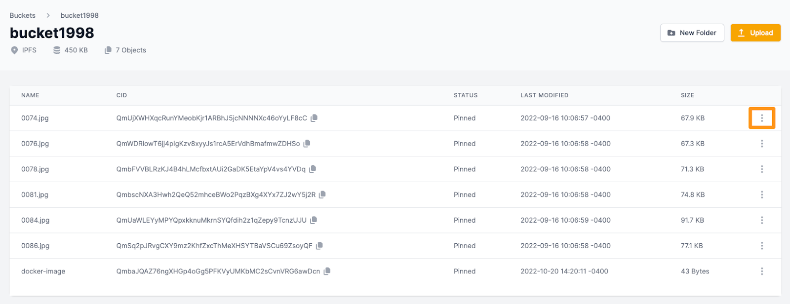

# IPFS 专用网关入门
	了解如何开始使用 IPFS 专用网关。
## 什么是 IPFS 专用网关？
IPFS 网关是一个 IPFS 对等体，它接受对 IPFS CID 的 HTTP 请求。专用网关为用户提供了一种访问 IPFS 内容的便捷方式，而无需自己运行 IPFS 节点。网关充当用户的 Web 浏览器或应用程序与 IPFS 网络之间的中介，代表用户检索和提供内容。

要深入了解 IPFS 网关及其工作原理，以及在 Filebase 上使用 IPFS 网关的完整演练，请在此处查看我们的文档：

- [ipfs 网关](https://docs.filebase.com/ipfs/ipfs-gateways)

使用 `付费 IPFS 订阅计划的 Filebase 用户` 可以访问 Filebase IPFS 专用网关。专用网关具有多项优势，例如：

- 提高性能和检索时间。
- 通过专用网关访问内容时没有速率限制。
- 通过专用网关的范围功能限制网关可以提供的内容（白名单）。
- 设置可用于网站或应用程序托管的网关的 Root CID。

## 创建网关
导航到Filebase Web 控制台上的网关页面，选择右上角的“创建网关”按钮。

## public、Private 和 Scoped 之间有什么区别？
- 公共

	网关可以为任何公共 CID 提供服务，即使是那些没有被 Filebase 固定的。公共网关非常适合广泛的数据访问，但可能会产生更高的带宽使用费。
- 私有

	网关只能为 Filebase 固定的 CID 提供服务。私有网关不限于用户已上传到其 Filebase 帐户的 CID - Filebase 固定的任何内容都可以通过私有网关提供服务。
- 作用域

	网关绑定到一个桶，只能提供来自该特定桶的内容。未存储在指定存储桶中的内容的任何 CID 都将返回 404 Not Found 消息。范围网关非常适合将内容列入白名单和控制网关使用。

## “带宽”是什么意思？
带宽是指显示或下载您或您的用户通过专用网关访问的内容所需的数据量。无论是图像、视频、音频还是任何其他类型的文件，构成内容的数据都会从 IPFS 节点传输到您的设备，而这些数据的数量决定了带宽。

Filebase 仅对传出数据传输（出口）的带宽收费。上传带宽（入口）始终免费。
## 如何使用网关
IPFS 专用网关可用于以与公共网关相同的方式检索和访问 IPFS 内容，例如使用以下格式：

	https://my-gateway.myfilebase.com/ipfs/IPFS_CID
Filebase IPFS 专用网关也可用于通过设置将由网关提供服务的根 CID 来服务特定 CID，而无需在 URL 中指定 CID。

要配置它，请导航到桶菜单，然后选择一个 IPFS 存储桶。进入存储桶后，通过选择右侧的三个菜单点来选择要设置为根文件的文件。

选择“设置为根”。

然后选择您要使用的专用网关。

现在，当您打开网关时，您将看到您设置为根文件的文件，而不是默认的错误消息。

## 在哪里可以使用 IPFS 专用网关 URL？
IPFS 专用网关 URL 可用于代替任何 IPFS 本机 URL（ `ipfs://` ）或任何 IPFS 公共网关 URL（例如 `https://ipfs.io/ipfs`）。这意味着专用网关可用于以下工作流程：

- 托管照片、视频、文档、证书或其他数字文件等数字资产。
- 引用元数据文件或智能合约中的 NFT 资产。
- 共享文件和文件夹。
- 托管去中心化应用程序。
- 托管静态网站。
- 共享代码库或软件包。
- 共享电子书、PDF 或视频等公共资源。