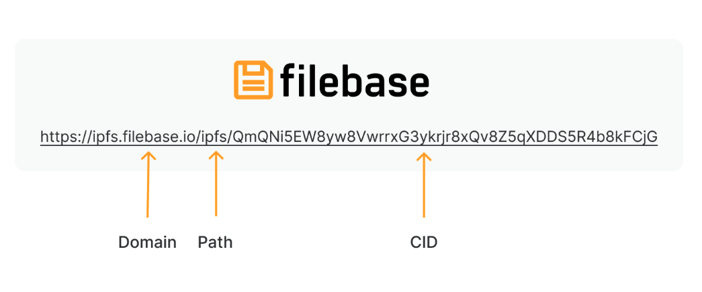
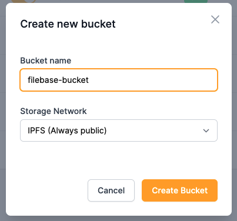
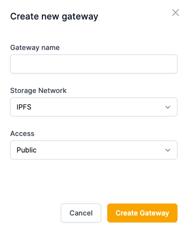
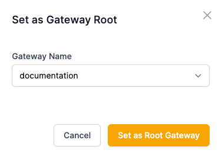
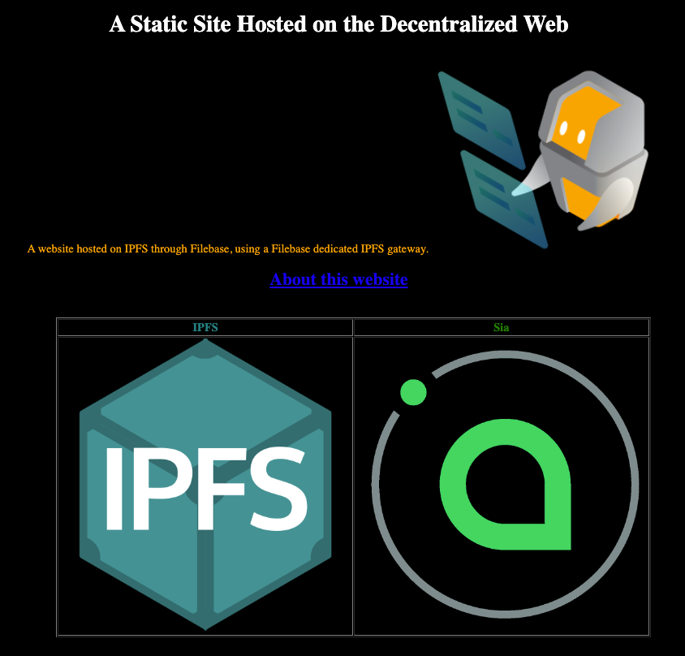
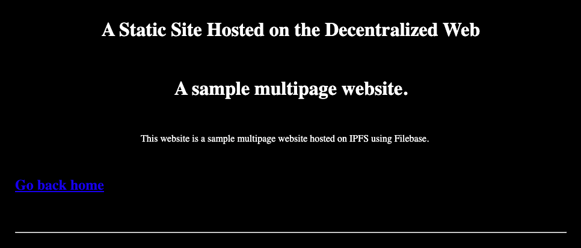

# IPFS 专用网关：托管多页面网站
	了解如何使用 IPFS 专用网关托管多页网站。
Filebase IPFS 专用网关可以配置为在网关的根部为单个 IPFS CID 提供服务。这意味着不需要在网关 URL 中指定 IPFS CID，默认情况下 URL 将托管配置的 CID。

例如，当使用 IPFS 网关时，格式通常如下：

使用具有根 CID 的专用网关时，路径和 CID 字段不需要返回根 CID。通过 Filebase 的专用网关将使用以下域结构：

	https://gatewayname.myfilebase.com
如果设置了根 CID，则可以共享此单个 URL 以分发存储的 CID 的内容。

1. 首先创建一个名为“我的网站”的新文件夹并创建文件.index.html

	该文件是一个基本的 HTML 文件，用作您网站的主页。更改和编辑此文件以反映您网站的内容，并相应地设置样式。要了解有关 HTML 和 CSS 样式的更多信息，请参阅。

		<!DOCTYPE html>
		<html>
		<head>
		<title>A Static Site Hosted on the Decentralized Web</title>
		</head>
		<body style="background-color:black;">
		<h1 align="center" style="color:white;"> A Static Site Hosted on the Decentralized Web</h1>
		

		A website hosted on IPFS through Filebase, using a Filebase dedicated IPFS gateway.
		
		<h2 style="color:orange;" align="center"><a href="about.html">About this website</a></h2>
		

		<ul align="center">
		<li>
		<li>
		<table border align="center">
		<tr> <th style="color:teal;">IPFS</th> <th style="color:green;">Sia</th>
		</tr>
		<tr><td>  </td> <td> </td></tr>
		</table>
		</body>
		</html>
2. 然后，创建第二个名为. 插入以下内容：about.html

		<!DOCTYPE html>
		<html>
		<body style="background-color:black;">
		<h1 align="center" style="color:white;"> A Static Site Hosted on the Decentralized Web</h1>
		<head>
		<meta charset="utf-8" />
		<title>About | Sample Multipage Website</title>
		<meta
		name="description"
		content="A sample multipage website."
		/>
		<meta name="author" content="The Filebase team." />
		</head>
		<body>
		<h1 align="center" style="color:white;"> A sample multipage website.</h1>
		
 This website is a sample multipage website hosted on IPFS using Filebase.
		

		<h2><a href="index.html">Go back home</a></h2>
		<footer>
		

		</footer>
		</body>
		</html>

3. 此示例还使用了 3 个图像文件，因此我们将把它们保存在保存我们的和文件的同一文件夹中。index.html about.html
您希望与您的网站一起使用的任何文件，例如图像文件或脚本文件，都保存在此文件夹中。
目前，该目录应如下所示：

	- My Website
		- about.html
		- index.html
		- image1.png
		- image2.png
		- image3.png
4. 然后，导航到 Filebase Web 仪表板。在 IPFS 网络上创建一个新的桶。

	
5. 选择您的存储桶，然后选择“上传”>“文件夹”。

	
6. 选择包含您的 index.html 文件和任何其他网站资产的网站文件夹，并将其上传到您的存储桶。

	
7. 接下来，导航到网关页面 Filebase Web 控制台上的

		Filebase IPFS 专用网关是一项仅对付费用户可用的功能。免费套餐的用户无法使用它们。
8. 选择右上角的“创建网关”按钮。

	
9. 将打开一个新窗口，提示您提供网关名称并选择网关的访问级别。

		网关名称受与存储桶名称相同的命名限制。所有网关名称必须是小写字母，介于 3-63 个字符之间，并且必须是唯一的。
		
10. 选择“公共”，然后选择“创建网关”。
11. 接下来，单击菜单中的“Buckets”选项以打开 Buckets 仪表板。
12. 选择您将网站文件夹上传到的 IPFS 存储桶。
13. 选择文件夹的附加选项菜单。

	
14. 从选项列表中选择“设置为根目录”。

	
15. 然后选择您之前创建的专用网关，然后选择“设置为根网关”。

	
16. 现在，当您打开专用网关时，无需在 URL 中指定文件夹的 IPFS CID 即可查看您的网站：

	
17. 当您点击“关于本网站”时，它会将您带到 about.html 页面。

	

	如果单击“返回主页”，您将返回到 index.html 页面。从这里，您可以创建任意数量的页面并自定义它们以适合您的项目