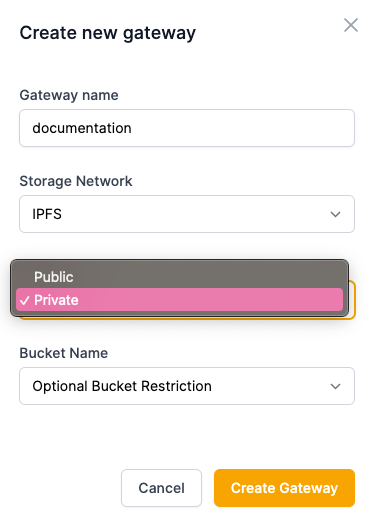
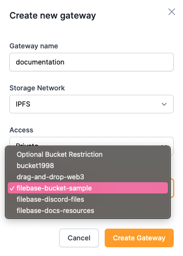
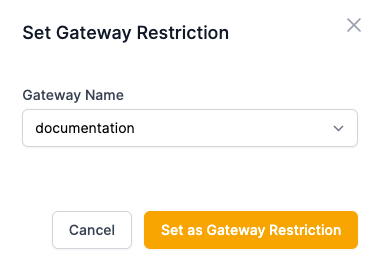

# IPFS 专用网关：白名单内容
	了解如何使用 Filebase 的 IPFS 专用网关将内容列入白名单。
## 通过作用域 IPFS 网关将内容列入白名单
Filebase 的 IPFS 专用网关产品允许将网关限定范围或限制为仅服务存储在特定 IPFS 存储桶中的内容。通过将 IPFS 网关限定为仅从单个存储桶中检索 CID，该网关可用于提供列入白名单的内容。通过范围内的 IPFS 网关将内容列入白名单的好处包括：

- 控制通过网关提供哪些内容的能力。
- 确认您的专用网关的带宽未用于提供您尚未上传或固定的内容。
- 项目内容的唯一品牌 IPFS URL。
- 不同网关基于桶关联服务不同内容的能力。

IPFS 上的所有 CID 都是公开的，无论它们是否存储在与范围内的 IPFS 网关关联的存储桶中。CID 仍然可以通过公共 IPFS 网关访问，例如 Filebase 公共网关。

1. 导航到 Filebase Web 控制台上的网关
2. 选择右上角的“创建网关”按钮。

	
3. 将打开一个新窗口，提示您提供网关名称并选择网关的访问级别。

		网关名称受与存储桶名称相同的命名限制。所有网关名称必须是小写字母，介于 3-63 个字符之间，并且必须是唯一的。
	
4. 要创建范围网关，请选择“私有”。

	
5. 然后，从下拉菜单中选择要服务的作用域网关的存储桶名称。

	Scoped 网关仅提供位于它们被限制的存储桶中的内容。

		如果网关被配置为服务于根 CID，则它也不能被配置为仅限于一个桶。必须清除根 CID 配置才能配置存储桶限制。
	
6. 如果之前创建网关设置过桶限制，可以通过导航桶菜单并为您想要限制网关的存储桶选择三个菜单点来设置限制。

	然后选择“设置限制”。
	
	
7. 出现提示时，选择要配置为使用所选存储桶的网关。

	
8. 现在，此网关将仅服务于存储在其关联桶中的 CID。

	例如，网址：[https://documentation.myfilebase.com/ipfs/Qmecp7G61NuqwkxMv3mrjaLMCPdf4igYA6EtqK9GFRJJWz](https://documentation.myfilebase.com/ipfs/Qmecp7G61NuqwkxMv3mrjaLMCPdf4igYA6EtqK9GFRJJWz)
	
	返回以下网页：
	
	

	访问未存储在网关关联存储桶中的 CID 将返回以下网页：
	
	