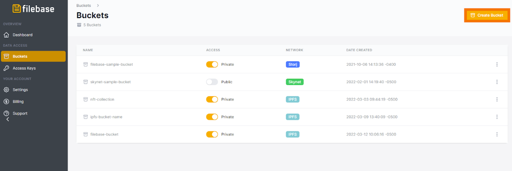
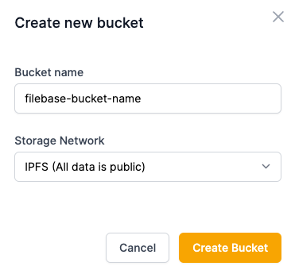

# 适用于 JavaScript 的 AWS 开发工具包
	了解如何使用适用于 JavaScript 的 AWS 开发工具包将文件和文件夹固定到 IPFS。
## 什么是 AWS 开发工具包 - JavaScript？
AWS SDK（软件开发工具包）通过支持和提供与 S3 兼容服务一起使用的代码对象，帮助简化编码和应用程​​序开发。有多种不同的 AWS 开发工具包，每种都适用于不同的编码语言。本指南涵盖 AWS 开发工具包 - JavaScript。

适用于 JavaScript 的 AWS 开发工具包支持三种运行时：

- JavaScript
- node.js
- 用于移动开发的 React Native

AWS SDK - JavaScript 还支持跨运行时。Cross-runtime 是一个服务客户端包，可以在浏览器、Node.js 和 React-Native 上运行，无需更改任何代码。

## 什么是 .car 文件？
.car 文件是一种包含多个文件的压缩存档文件，类似于 ZIP 文件。.car 文件由 FileCoin 和 IPFS 网络使用，它们利用元数据字段将每个文件的 IPFS CID 包含在存档中。

阅读下文以了解如何使用适用于 JavaScript 的 AWS 开发工具包将文件和文件夹固定到 IPFS。

- 先决条件：
	- 下载并安装 AWS CLI。
	- 配置 AWS CLI 以与您的 Filebase 帐户一起使用。
	- 下载安装适用于 Javascript 的 AWS 开发工具包。
	- 注册一个免费的 Filebase 帐户。
	- 拥有您的文件库访问权限和密钥。了解如何查看您的访问密钥。

## 将单个文件固定到 IPFS
1. 单击菜单中的“Buckets”选项以打开 Buckets 仪表板。

	
2. 进入 Buckets 仪表板后，单击右上角的“Create Bucket”选项创建一个新的 bucket。

	
3. 输入存储桶名称并选择您的存储网络。

	
4. 使用以下适用于 JavaScript 的 AWS 开发工具包代码创建一个新文件：

	以下代码示例将 IPFS 文件上传到提供的存储桶名称。替换代码中的以下值以匹配您的配置：

	- `accessKeyId` ：文件库访问密钥
	- `secretAccessKey` : 文件库密钥
	- `Bucket` ：您的文件库存储桶名称
	- `Key` : 要上传到IPFS的对象的本地路径

code

		const AWS = require('aws-sdk');
		const fs = require('fs');
		
		const s3 = new AWS.S3({
		    accessKeyId: 'Filebase-Access-Key',
		    secretAccessKey: 'Filebase-Secret-Key',
		    endpoint: 'https://s3.filebase.com',
		    region: 'us-east-1',
		    signatureVersion: 'v4',
		});
		
		fs.readFile('image.png', (err, data) => {
		    if (err) {
		        console.error(err);
		        return;
		    }
		    
		    const params = {
		        Bucket: 'my-ipfs-bucket',
		        Key: 'ipfs-file.png',
		        Body: data,
			Metadata: { import: "car" }
		    };
		    
		    const request = s3.putObject(params);
		    request.on('httpHeaders', (statusCode, headers) => {
		        console.log(`CID: ${headers['x-amz-meta-cid']}`);
		    });
		    request.send();
		});

## 使用适用于 JavaScript 的 AWS 开发工具包将文件夹固定到 IPFS
1. 使用以下命令下载 ipfs-car 包：

		git clone https://github.com/web3-storage/ipfs-car
2. 安装 ipfs-car 包：

		npx ipfs-car
3. 接下来，使用 ipfs-car 将一个文件夹的文件打包成一个.car文件。

	这已通过包含 10,000 个或更多文件的 .car 档案进行了测试。根据您所需的工作流程，使用以下任一命令：

	- 将 .car 文件写入当前工作目录

			ipfs-car --pack path/to/file/or/dir
	- 将 .car 文件写入具有指定名称的特定目录

			ipfs-car --pack path/to/files --output path/to/write/ipfs-car.car
4. 使用以下适用于 JavaScript 的 AWS 开发工具包代码创建一个新文件：

	以下代码示例将 IPFS 文件上传到提供的存储桶名称。替换代码中的以下值以匹配您的配置：

	- `accessKeyId` ：文件库访问密钥
	- `secretAccessKey` : 文件库密钥
	- `Bucket` ：您的文件库存储桶名称
	- `Key` : 要上传到IPFS的对象的本地路径

AWS SDK v2：

	const AWS = require('aws-sdk');
	const fs = require('fs');
	
	const s3 = new AWS.S3({
	    accessKeyId: 'Filebase-Access-Key',
	    secretAccessKey: 'Filebase-Secret-Key',
	    endpoint: 'https://s3.filebase.com',
	    region: 'us-east-1',
	    signatureVersion: 'v4',
	});
	
	fs.readFile('ipfs-car.car', (err, data) => {
	    if (err) {
	        console.error(err);
	        return;
	    }
	    
	    const params = {
	        Bucket: 'my-ipfs-bucket',
	        Key: 'ipfs-car.car',
	        Body: data,
		Metadata: { import: "car" }
	    };
	    
	    const request = s3.putObject(params);
	    request.on('httpHeaders', (statusCode, headers) => {
	        console.log(`CID: ${headers['x-amz-meta-cid']}`);
	    });
	    request.send();
	});

AWS SDK v3：

	const command = new PutObjectCommand({...});
	
	command.middlewareStack.add(
	  (next) => async (args) => {
	    // Check if request is incoming as middleware works both ways
	    const response = await next(args);
	    if (!response.response.statusCode) return response;
	
	    // Get cid from headers
	    const cid = response.response.headers["x-amz-meta-cid"];
	    console.log(cid);
	    return response;
	  },
	  {
	    step: "build",
	    name: "addCidToOutput",
	  },
	);
	
	const res = await client.send(command);