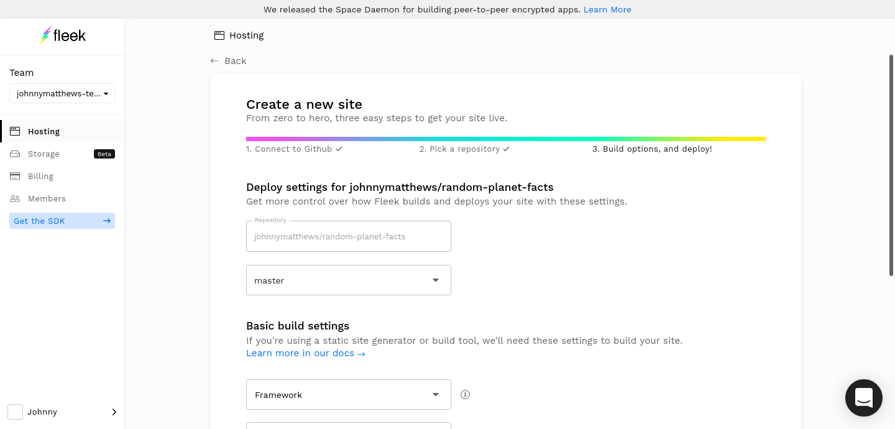

# 介绍 Fleek
我们在本教程系列中介绍的大部分步骤都是相当手动的。如果有一项服务可以为您完成所有繁忙的工作，这样您就可以专注于在 IPFS 上托管出色的网站，那不是很好吗？这就是 Fleek 的用武之地！

Fleek 是一项服务，可让您在 IPFS 上托管网站，而无需在您的计算机上安装任何东西或处理命令行。

我们已经知道 IPFS 上的文件和文件夹是按内容寻址的，这意味着您可以使用其内容的哈希值找到它们。如果内容发生变化，则哈希值也会发生变化。正如我们在之前的课程中看到的那样，在更新网站时这可能是一个问题。对 HTML 文件的单个字符更改将创建一个全新的哈希值！

Fleek 提供了一个简单的工作流程。一旦您将更改推送到 git，Fleek 就会构建、pin和更新您的站点。该服务还与 React、Next.js、Gatsby、Jekyll、Hugo 和[许多其他流行的开发框架很好地集成](https://docs.fleek.co/hosting/site-deployment/#common-frameworks) （打开新窗口）. 您还可以通过 Fleek 管理您的域并以与传统 Web 开发类似的方法监控您的站点。

如果你想在 IPFS 上托管一个快速的网站，Fleek 是一个不错的选择！有关更多信息，请查看 [Fleek.co](https://fleek.co/) （打开新窗口）和他们的文档 （打开新窗口）.

## 托管网站
如果您从未使用过像 Fleek 这样的服务或者只是需要复习一下，本快速指南将介绍如何将网站添加到 GitHub 存储库并将该存储库链接到您的 Fleek 帐户。

我们将重新使用在上一个教程中创建的 Random Planet Facts 网站。如果您一直在学习本系列教程，那么您应该已经准备好开始这个项目了！如果你不这样做，只需在这里[下载项目.zip](https://github.com/johnnymatthews/random-planet-facts/archive/master.zip) （打开新窗口）或者克隆这个[存储库](https://github.com/johnnymatthews/random-planet-facts) （打开新窗口）.
### 上传到 GitHub
如果您克隆了上面的 Random Planet Facts 存储库，则无需遵循此部分。

1. 登录 [GitHub](https://github.com/) （打开新窗口）.
2. 创建一个新的存储库并上传 Random Planet Facts 项目。
3. 您的项目存储库应如下所示：

	

### 将存储库添加到 Fleek
1. 前往 [Fleek.co](https://fleek.co/) （打开新窗口）并使用您的 GitHub 帐户登录。您可能需要允许 Fleek 访问您的 GitHub 配置文件。
2. 登录后，单击添加新站点。
3. 选择 Connect with GitHub 并找到您要在 IPFS 上托管的站点。
4. 保留所有选项的默认设置。因为我们不是在处理一个特殊的框架或一个有很多分支的存储库，所以我们不需要在这里改变任何东西。

	
5. 单击部署站点。Fleek 会将您的站点添加到构建队列中。完成后，您可以单击 IPFS 上的验证来查看您的站点！

	

### 域名
Fleek 允许您在 IPFS 上使用您的站点配置您的域名！不再与 DNSlink 或 IPNS 争论不休。您甚至可以直接通过 Fleek 购买域名。单击添加或购买域开始。查看 Fleek 文档以获取有关如何链接域的[更多信息](https://docs.fleek.co/domain-management/overview/) →（打开新窗口）

