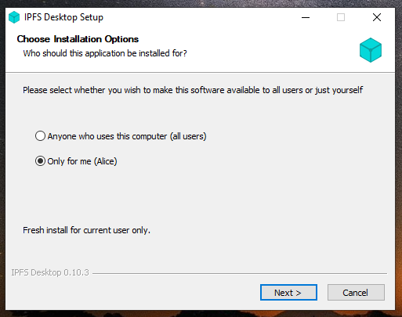
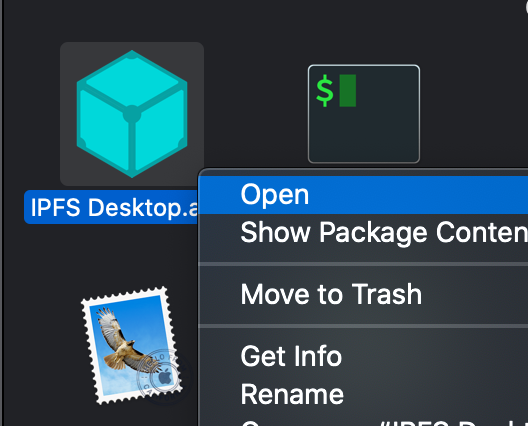
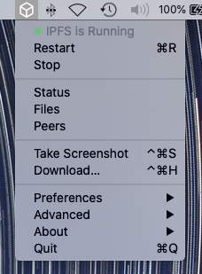
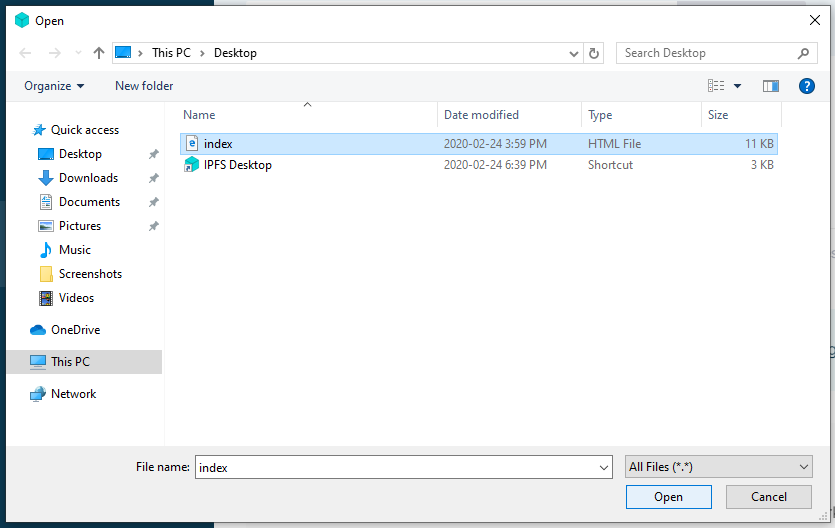
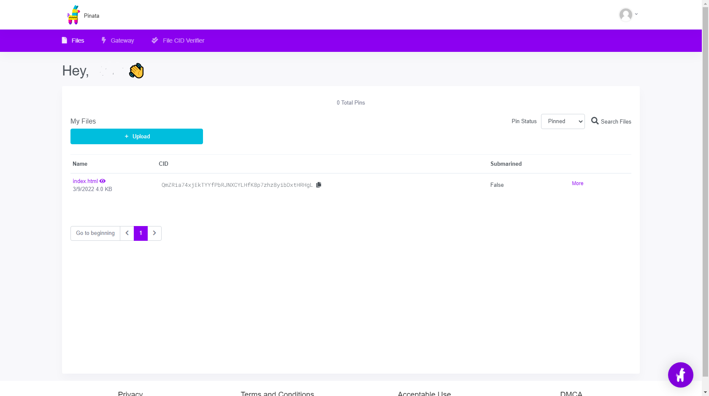

# 在 IPFS 上托管一个单页网站
在本教程中，我们将在 IPFS 上托管一个简单的单页网站并链接一个域名。这是一系列教程的第一步，旨在教授 Web 开发人员如何使用 IPFS 构建网站和应用程序。

如果您正在寻找 [单页应用程序 (SPA)](https://en.wikipedia.org/wiki/Single-page_application) 支持，请参阅 [重定向和自定义 404](https://docs.ipfs.tech/how-to/websites-on-ipfs/redirects-and-custom-404s/)。
## 安装 IPFS 桌面
IPFS 桌面应用程序是使用 IPFS 快速启动和运行的最简单方法。IPFS 桌面的安装步骤因操作系统而异。按照适用于您的系统的说明进行操作。

- [Windows](https://docs.ipfs.tech/how-to/websites-on-ipfs/single-page-website/#windows)
- [macOS](https://docs.ipfs.tech/how-to/websites-on-ipfs/single-page-website/#macos)
- [Linux](https://docs.ipfs.tech/how-to/websites-on-ipfs/single-page-website/#linux)

已经下载？你可以 [跳过这一步](https://docs.ipfs.tech/how-to/websites-on-ipfs/single-page-website/#add-your-site)

### Windows
1. `.exe` 从IPFS 桌面[下载页面](https://github.com/ipfs/ipfs-desktop/releases)下载最新的可用文件

	
2. 运行该 `.exe` 文件以开始安装。

	
3. 选择是要为您自己还是计算机上的所有用户安装应用程序。单击下一步：

	
4. 选择应用程序的安装位置。默认位置通常没问题。单击下一步：

	
5. 等待安装完成，然后单击完成：

	
6.  您现在可以在状态栏中找到 IPFS 图标：

	

IPFS 桌面应用程序已完成安装。您现在可以开始[添加您的站点](https://docs.ipfs.tech/how-to/websites-on-ipfs/single-page-website/#add-your-site)了。

### MacOS
1. `.dmg` 从IPFS 桌面下载页面下载最新的可用文件 （打开新窗口）:

	
2. 打开 `ipfs-desktop.dmg` 文件。
3. 将 IPFS 图标拖到 Applications 文件夹中：

	
4. 打开您的应用程序文件夹并打开 IPFS 桌面应用程序。
5. 你可能会收到一条警告说 `IPFS Desktop.app can't be opened`。单击在 Finder 中显示：

	
6. 在您的应用程序文件夹中找到 `IPFS Desktop.app`。
7. 按住 `control` 键，点击 `IPFS Desktop.app`，然后点击 `Open`：

	
8. 在新窗口中点击打开：

	
9. 您现在可以在状态栏中找到 IPFS 图标：

	
10. IPFS 桌面应用程序已完成安装。您现在可以开始[添加您的站点了](https://docs.ipfs.tech/how-to/websites-on-ipfs/single-page-website/#add-your-site)。

### Linux
1. `.deb` 从IPFS 桌面[下载页面](https://github.com/ipfs/ipfs-desktop/releases)下载最新的可用文件 （打开新窗口）:
2. `.deb` 在软件安装程序中打开包：

	
3. 点击安装，等待安装完成：

	
4. 单击应用程序或按键盘上的 Windows 键。
5. 搜索IPFS并选择IPFS 桌面：

	
6. 您现在可以在状态栏中找到 IPFS 图标：

	

IPFS 桌面应用程序已完成安装。您现在可以开始[添加您的站点](https://docs.ipfs.tech/how-to/websites-on-ipfs/single-page-website/#add-your-site)了。

## 添加您的网站
下一步是使用刚刚安装的 IPFS 桌面应用程序将您的站点导入 IPFS。我们将使用的网站非常简单。它的目的是显示随机行星相关的事实。每次刷新页面时，都会显示一个新事实。该网站创造性地称为 `Random Planet Facts`。

1. 创建一个名为的文件 `index.html`并粘贴以下代码：

		<!DOCTYPE html>
		<html lang="en">
		  <head>
		    <meta charset="utf-8" />
		    <title>Random Planet Facts</title>
		    <meta
		      name="description"
		      content="Get a random fact about a planet in our solar system."
		    />
		    <meta name="author" content="The IPFS Docs team." />
		    
		  </head>
		  <body onload="main()">
		    <h1>Random Planet Facts</h1>
		    

		    
		  </body>
		</html>
2. 打开 IPFS 桌面并转到“文件”页面。
3. 单击添加→文件。
4. 导航到您的 `index.html` 文件并选择打开。

	

5. 单击三点菜单 `index.html` 并选择共享链接。
6. 单击复制将文件的 URL 复制到剪贴板。

	
7. 打开浏览器并粘贴您刚刚复制的 URL。

您的浏览器应该会在几分钟内加载该网站！第一次这可能需要几分钟时间。您可以在网站加载时移至下一部分。

## pinning 文件
IPFS 节点将它们存储的数据视为缓存，这意味着不能保证数据将继续存储。pinning 文件告诉 IPFS 节点将数据视为必不可少的，而不是将其丢弃。您应该pinning 任何您认为重要的内容，以确保长期保留数据。IPFS Desktop 允许您直接从“文件”选项卡 pinning 文件。

但是，如果您希望您的 IPFS 数据在本地 IPFS 节点离线时仍可访问，您可能需要使用其他选项，如协作集群或 pinning 服务。
### 协作集群
IPFS 协作集群是一组 IPFS 节点，它们协作 pinning 由一个或多个受信任的对等方添加到 IPFS 集群的所有内容。您可以从 [ipfscluster.io](https://ipfscluster.io/documentation/collaborative/setup/) 了解有关协作集群的更多信息，包括如何自己设置集群（打开新窗口）
### pinning 服务
确保保留重要数据的一种简单方法是使用 pinning 服务。这些服务运行大量 IPFS 节点，并将为您 pinning 数据！这样，您就不必运行和维护自己的 IPFS 节点。查看[持久性页面](https://docs.ipfs.tech/concepts/persistence/)以获取有关 pinning 服务的更多信息。在本教程中，我们将使用 [Pinata](https://pinata.cloud/)因为它免费为新用户提供 1GB 的存储空间，并且界面非常简单：

1. 转到 [Pinata.cloud](https://pinata.cloud/)并注册或登录。
2. 选择`上传`并单击`浏览`。
3. 导航到您的 `index.html` 文件并单击`打开`。
4. 单击`上传`。
5. 您应该能够看到您的 `index.html` 文件已 pinning：

	
6. 单击您的 `index.html` 文件以通过 Pinata 网关打开您的网站。

	

## 设置域
这部分是完全可选的。

如果您可以访问 Namecheap、Google Domains、GoDaddy 或任何其他域名服务等域名服务，则可以按照这些步骤操作。如果您没有要分配的域名，则可以阅读本节。我们将在后面的部分深入探讨使用分散式命名服务，例如以太坊命名服务 (ENS)。

我们使用了 Namecheap，但所有域名服务的流程都非常相似。

1. 登录您的域名提供商。
2. 转到域管理窗口并找到要分配给网站的域。
3. 查找更改重定向设置的位置。
4. 在新标签页中，打开 [Pinata](https://pinata.cloud/) （打开新窗口），登录并复制您网站的IPFS 哈希。
5. 在您的域名提供商 `重定向设置` 部分，粘贴您刚刚复制的 `IPFS 哈希链接`。

	
6. 保存您的更改。

	域名服务更新速度相当慢。您应该能够在几个小时内访问您的域并查看您 pinning 的网站。

	

## 接下来
该项目旨在让您快速启动和运行，但我们可以在这里进行许多改进。

您可能已经注意到，在访问 [randomplanetfacts.xyz](http://randomplanetfacts.xyz/)，您的浏览器重定向到 [gateway.pinata.cloud/ipfs/QmW7S5HR...](https://gateway.pinata.cloud/ipfs/QmW7S5HRLkP4XtPNyT1vQSjP3eRdtZaVtF6FAPvUfduMjA) （打开新窗口）. 这对用户体验不利，并且可能导致安全证书和其他网站验证方法出现问题。此外，这个网站非常简单。没有图像、外部样式表或 javascript 文件。如果您有兴趣使用 IPFS 构建更复杂的站点并正确保护它，[请通过在 IPFS 上托管多页面网站来继续本教程系列](https://docs.ipfs.tech/how-to/websites-on-ipfs/multipage-website/)。