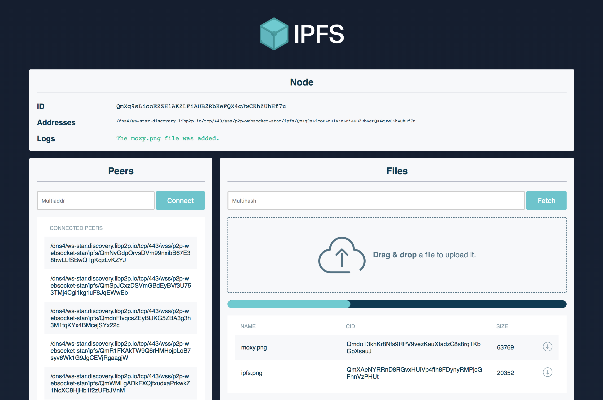
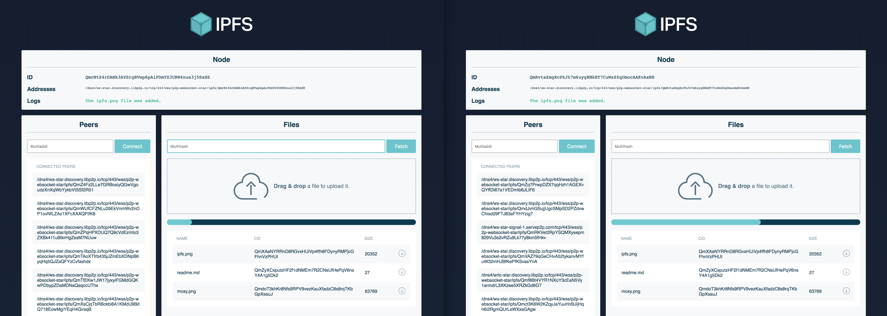

# 观察 peers
IPFS 中包含一组有用的命令，可帮助观察网络。

查看您与谁有直接联系：

	ipfs swarm peers
手动连接到特定的对等点。如果下面的对等点不起作用，请从 `ipfs swarm peers` 的输出中选择一个。

	> ipfs swarm connect /dnsaddr/bootstrap.libp2p.io/p2p/QmNnooDu7bfjPFoTZYxMNLWUQJyrVwtbZg5gBMjTezGAJN
在网络上搜索给定的对等点：

	> ipfs dht findpeer QmNnooDu7bfjPFoTZYxMNLWUQJyrVwtbZg5gBMjTezGAJN
	
# 在节点之间交换文件
本教程旨在创建一个带有 IPFS 节点的简单应用程序，该节点使用 WebRTC 拨号到其他实例，同时使用 WebSockets 作为传输从浏览器 IPFS 节点拨号和传输文件。

由于 `js-ipfs@0.41.x` 目前不支持 DHT 节点发现，您从中获取数据的节点应该在浏览器节点的范围内（本地或公共 IP）。话虽这么说，我们在本教程中解释了如何规避这些警告，一旦它们被修复，我们将在此处更新所有内容。

	┌──────────────┐                ┌──────────────┐
	│   Browser    │ libp2p(WebRTC) │   Browser    │
	│              │◀──────────────▶│              │
	└──────────────┘                └──────────────┘
	       ▲                                  ▲
	       │WebSockets              WebSockets│
	       │        ┌──────────────┐          │
	       │        │   Desktop    │          │
	       └───────▶│   Terminal   │◀─────────┘
	                └──────────────┘
这是我们要做的：

1. 在你的机器上安装一个 IPFS 节点。
2. 让你的守护进程监听 WebSockets。
3. 启动 `libp2p-webrtc-star` 信令服务器。
4. 启动应用程序。
5. 使用 WebSocket 连接到节点。
6. 在所有节点之间传输文件！

在本教程结束时，您应该看到如下所示的内容：

显示本教程最终产品的 Web 浏览器。

### 先决条件
您必须安装以下内容：

- [node.js](https://nodejs.org/en/)
- [NPM](https://www.npmjs.com/)
- [bundle-js](https://www.npmjs.com/package/bundle-js)
- [IPFS](https://docs.ipfs.tech/install/)

### 1 设置
在开始之前，您需要下载 JS-IPFS 项目存储库、安装依赖项并构建项目。

1. 下载项目存储库：

		git clone https://github.com/ipfs/js-ipfs.git
2. 移动到 `js-ipfs` 文件夹并安装依赖项：

		cd js-ipfs
		npm install
3. 构建项目：

		npm run bundle

### 2 让你的守护进程监听 WebSockets
现在您需要编辑您的 config 文件，即您刚刚设置的文件 `{js}ipfs init`。它应该在`~/.jsipfs/config` 或`~/.ipfs/config` 中，具体取决于您使用的是 JS 还是 Go。

注意：` js-ipfs` 默认设置一个 websocket 监听器，所以如果你使用 JS 实现，你可以跳过这个，只启动守护进程。

由于默认情况下当前未启用 websockets 支持，因此您需要手动添加 WebSockets 地址。查看您的配置文件以找到以下 Addresses 部分：

	"Addresses": {
	  "Swarm": [
	    "/ip4/0.0.0.0/tcp/4002"
	  ],
	  "API": "/ip4/127.0.0.1/tcp/5002",
	  "Gateway": "/ip4/127.0.0.1/tcp/9090"
	}
将 `/ip4/127.0.0.1/tcp/4003/ws` 条目添加到您的 Swarm 数组。现在它应该是这样的：

	"Addresses": {
	  "Swarm": [
	    "/ip4/0.0.0.0/tcp/4002",
	    "/ip4/127.0.0.1/tcp/4003/ws"
	  ],
	  "API": "/ip4/127.0.0.1/tcp/5002",
	  "Gateway": "/ip4/127.0.0.1/tcp/9090"
	}
保存文件，它应该能够在 Websockets 上侦听。我们已准备好启动守护进程。

	> ipfs daemon
	# or
	> jsipfs daemon
您应该在输出中看到 Websocket 地址：

	Initializing daemon...
	Swarm listening on /ip4/127.0.0.1/tcp/4001
	Swarm listening on /ip4/127.0.0.1/tcp/4003/ws
	Swarm listening on /ip4/192.168.10.38/tcp/4001
	Swarm listening on /ip4/192.168.10.38/tcp/4003/ws
	API server listening on /ip4/127.0.0.1/tcp/5001
	Gateway (readonly) server listening on /ip4/0.0.0.0/tcp/8080
	Daemon is ready
勾选 `/ws` 第 5 行，表示正在监听。

### 3 启动应用程序
确保你在 `js-ipfs/examples/exchange-files-in-browser`.

我们需要捆绑依赖项才能运行该应用程序。我们开始做吧：

	> npm run bundle
	...
	> npm start
如果一切顺利，你应该看到类似这样的东西：

	Starting up http-server, serving public
	Available on:
	  http://127.0.0.1:12345
	  http://192.168.2.92:12345
	Hit CTRL-C to stop the server
现在在现代浏览器中访问 http://127.0.0.1:12345 就可以了！

### 4. 使用 WebSockets 拨号到一个节点（你的桌面）
确保你有一个守护进程在运行。如果不这样做，请运行：

	> ipfs daemon
	# or
	> jsipfs daemon
打开另一个终端窗口以找到它正在侦听的 websocket 地址：

	> ipfs id
	# or
	> jsipfs id
它应该看起来像这样 `/ip4/127.0.0.1/tcp/4003/ws/ipfs/<your_peer_id>`：

- 复制并粘贴 `multiaddr` 以连接到该对等点：

	
- 检查您是否已连接：

	

由于 WebCrypto 的限制，它仅适用于本地主机环境，除非该页面通过 HTTPS 加载或者页面由本地主机提供：[ibp2p/js-libp2p-crypto#105](https://github.com/libp2p/js-libp2p-crypto/issues/105)（打开新窗口）

### 5. 在所有节点之间传输文件！
现在您可以通过 CLI 添加文件：

	> ipfs add <file>
	# or
	> jsipfs add <file>
复制并粘贴 multihash 并在浏览器中获取文件！

您还可以打开两个浏览器选项卡，将文件拖放到其中一个中，然后在另一个中获取它们！

但本教程最酷的地方在于 `pubsub！` 您可以打开两个选项卡，它们将通过以 URL 命名的工作区共享文件。尝试使用以下 URL 打开两个选项卡：

	http://127.0.0.1:12345/#file-exchange
	# 你可以用你喜欢的任何东西来代替“file-exchange”，只要确保两个选项卡在同一个工作区中。
现在，您在一个选项卡中上传的每个文件都会出现在另一个选项卡中！您甚至可以在该工作区中打开一个新选项卡，它会同步之前添加的文件！

## 去生产？
此示例使用公共 webrtc-star 服务器。这些服务器应该用于实验和演示，它们不得用于生产，因为不能保证可用性。
### 使用您自己的 `libp2p-webrtc-star` 信令服务器
该服务器允许两个浏览器节点通过进行初始握手和网络介绍来相互交谈。

首先全局安装 `libp2p-webrtc-star` 模块：

	> npm install -g libp2p-webrtc-star
这会给你 `webrtc-star` 命令。使用它来启动信令服务器：
	
	> webrtc-star
默认情况下，它将侦听端口 13579 上的所有传入连接。使用 `--host`和/或`--port` 选项覆盖它。即，以下 

	multiaddr: /ip4/127.0.0.1/tcp/13579/wss/p2p-webrtc-star。
你应该在 IPFS 配置群地址中添加你的信令服务器，这样你就可以通过它监听新的连接。	