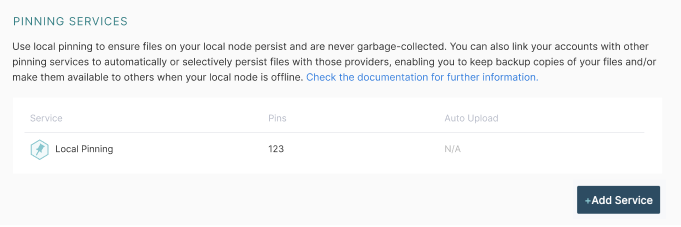
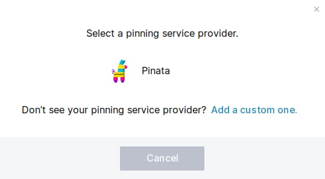
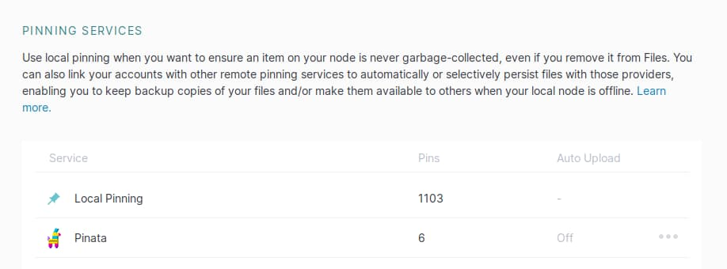

# 使用远程 pinning 服务
根据您使用 IPFS 的方式，您可能会发现使用远程 pinning 服务代替或补充将文件 pinning 在本地 IPFS 节点上会很有帮助。无论是远程发生还是本地发生，在 IPFS 中 pinning 一个项目都会将其标识为您始终希望保持可用的东西，从而使其免于 IPFS 对不常用项目进行的例行垃圾收集，以便有效地管理存储空间。了解有关本地 pinning 的[更多信息](https://docs.ipfs.tech/how-to/pin-files/) →

如果您只有一个始终在运行的本地 IPFS 节点，则可能只需要本地 pinning 就可以确保您的重要项目持久化并且永远不会被垃圾收集。但是，在以下情况下，使用远程 pinning 服务（或创建您自己的pinning服务）可能对您有用：

- 您的本地节点并不总是在线，但您需要项目始终可用。
- 您希望在其他地方保留本地节点文件的持久备份。
- 您的本地节点上没有所需的所有磁盘空间。
- 您运行多个 IPFS 节点，并希望将其中一个节点用作“个人 pinning 服务”作为永久存储的首选位置。

有许多商业 pinning 服务可以让您轻松购买重要文件的 pinning 容量，其中一些包括 Pinata、Temporal、Crust、Infura 等。这些第三方服务中的每一个都有自己独特的用于 pinning 文件和管理这些 pinning 的界面；这可能包括 GUI、API、CLI 命令或其他工具。

但是，如果您选择的 pinning 服务支持与供应商无关的IPFS pinning 服务 API，则无需学习新命令或工具 （打开新窗口）规格。IPFS 本身通过命令行支持这些服务：`ipfs pin remote --help`.

截至 2021 年 1 月，Pinata （打开新窗口）支持 [IPFS Pinning Service API](https://ipfs.github.io/pinning-services-api-spec/) 端点 （打开新窗口），更多 `pinning` 服务即将推出！[了解如何创建自己的 pinning service](https://docs.ipfs.tech/how-to/work-with-pinning-services/#create-your-own-pinning-service) →

## 使用现有的 pinning 服务
有两种方法可以将现有的 pinning 服务添加到您的 IPFS 安装中：

- [IPFS 桌面或 IPFS Web UI](https://docs.ipfs.tech/how-to/work-with-pinning-services/#ipfs-desktop-or-ipfs-web-ui)
- [IPFS命令行](https://docs.ipfs.tech/how-to/work-with-pinning-services/#ipfs-cli)

要直接在 IPFS 中添加和使用远程 pinning 服务，您首先需要拥有该服务的帐户。

### IPFS 桌面或 IPFS Web UI
您可以将您最喜欢的 pinning 服务直接添加到 IPFS 桌面/Web UI，使您能够以与添加或删除本地 pinning 相同的方式从文件屏幕 pinning 和取消 pinning 项目。

- 添加新的 pinning 服务

	要添加新的 pinning 服务，请打开 IPFS 桌面或 Web UI，导航到“设置”屏幕的 “pinningServices” 部分，然后单击“Add Service”按钮：

	

	然后，从弹出的模式中选择您选择的 pinning 服务。如果您要添加的 pinning 服务未在该模式中列出，请不要担心 — 您可以通过单击添加自定义链接来添加任何支持 IPFS pinning服务 API 的远程pinning服务。

	

	在下一个屏幕中，系统会要求您提供一些其他详细信息：

	  
	

	- 此服务的昵称。例如，如果您想从同一服务添加两个帐户，这会很有帮助。
	- 您服务的 API 端点的 URL 。 注意：此字段仅在您选择了自定义 pinning 服务时才会出现！
	- 您的秘密访问 token 。这是 pinning 服务提供给您的唯一 token ——查看其文档以获取更多信息。 为了说明，下面的示例显示了应该从[pinata.cloud/keys](https://pinata.cloud/keys)

	

	点击保存后，您会看到新的 pinning 服务已添加到设置屏幕的 pinning 服务部分。

	

- 使用 pinning 服务

	现在您已完成设置，您可以直接从“文件”屏幕将文件 pinning 或取消 pinning 到新的 pinning 服务。只需右键单击任何文件或单击文件列表中的三点操作图标，然后选择`set pinning`：
	
	

### IPFS 命令行
命令行用户受益于 `ipfs pin remote` 命令，它简化了远程 pinning 操作。内置 pinning 服务 API 客户端在后台执行所有必要的远程调用。

- 添加新的 pinning 服务

	要添加新的 pinning 服务，请使用以下命令：

		$ ipfs pin remote service add nickname https://my-pin-service.example.com/api-endpoint myAccessToken

	- `nickname` 是此 pinning 服务的特定实例的唯一名称。例如，如果您想从同一服务添加两个帐户，这会很有帮助。
	- `https://my-pin-service.example.com/api-endpoint` 是 pinning 服务提供给您的端点。查看服务的文档以获取更多信息。
	- `myAccessToken` 是 pinning 服务提供给您的唯一秘密令牌。查看服务的文档以获取更多信息。
- 使用 pinning 服务

	以下是一些可帮助您入门的 CLI 命令。在所有示例中，替换 `nickname` 为您在添加 pinning 服务时为其提供的唯一名称。

	- 要将 CID pinning 在人类可读的名称下：

			$ ipfs pin remote add --service=nickname --name=war-and-peace.txt bafybeib32tuqzs2wrc52rdt56cz73sqe3qu2deqdudssspnu4gbezmhig4
	- 列出成功的引脚：

			$ ipfs pin remote ls --service=nickname
	- 列出所有“待定”引脚：

			$ ipfs pin remote ls --service=nickname --status=queued,pinning,failed
	- 有关更多命令和一般帮助：

			$ ipfs pin remote --help

## 创建自己的 pinning 服务
显然，您不限于预先批准的服务的静态列表。任何与 [IPFS Pinning Service API](https://ipfs.github.io/pinning-services-api-spec) 兼容的远程 Pinning 服务 （打开新窗口）可以添加为自定义 pinning 服务——这也意味着您可以创建自己的 pinning 服务！这可能在以下情况下有用：

- 将您自己的 IPFS 节点之一指定为个人 pinning 服务，作为永久存储的首选位置。
- 为您的朋友或公司运行私人 pinning 服务。
- 开始您自己的商业 pinning 服务。

如上所述，您的服务必须使用  [IPFS Pinning Service API](https://ipfs.github.io/pinning-services-api-spec)  （打开新窗口）为了与 `ipfs pin remote` 命令背后的客户端互操作。

提示

- 如果您有兴趣为自己的个人或共享用途创建自己的 pinning 服务，您可以从 [OpenAPI 规范生成客户端和服务器](https://github.com/ipfs/pinning-services-api-spec#code-generation) （打开新窗口），减少开发时间或重用现有解决方案（打开新窗口）
- 您可能还希望在 [pinning 服务 API 规范 GitHub](https://github.com/ipfs/pinning-services-api-spec) 存储库中继续阅读有关 API 如何发展的详细信息 （打开新窗口），并参与其进一步发展的讨论！

如果你想让每个 IPFS 用户都可以使用你的自定义 pinning 服务，我们欢迎你提交。一旦您准备好向公众敞开大门，就可以针对 [IPFS Web UI GitHub 存储库](https://github.com/ipfs-shipyard/ipfs-webui) 进行 PR （打开新窗口）为了将其添加到桌面/Web UI 设置屏幕中显示的默认 pinning 服务列表中，核心维护者之一将与您联系。