# Pinata 团队的建议和解答
## 通用建议
### 如何创建 Pinata API 密钥
- 1 - 登录 Pinata.cloud

	访问 [Pinata.cloud](https://app.pinata.cloud/) 并使用您现有的凭据登录或创建一个新帐户！

	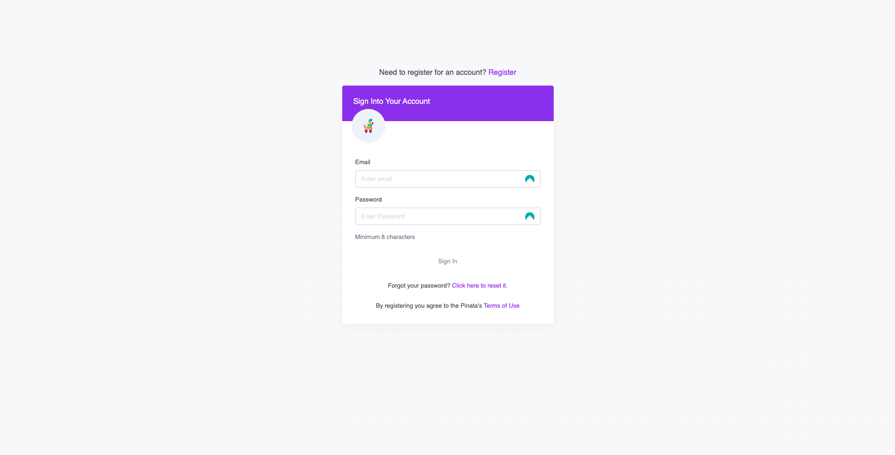
- 2 - 访问 API 密钥页面

	单击右上角的配置文件按钮展开菜单，然后单击“API 密钥”

	
- 3 - 创建 API 密钥

	单击显示“新密钥”的蓝色按钮

	
	然后选择您希望 API 密钥拥有的权限级别。如果您自己使用此密钥，只需单击顶部的“管理员”开关即可确保您拥有可能需要的权限。如果您将此密钥提供给其他人，最好查看您可以允许和限制的选项。完成后，在底部为其命名，然后单击“创建密钥”

	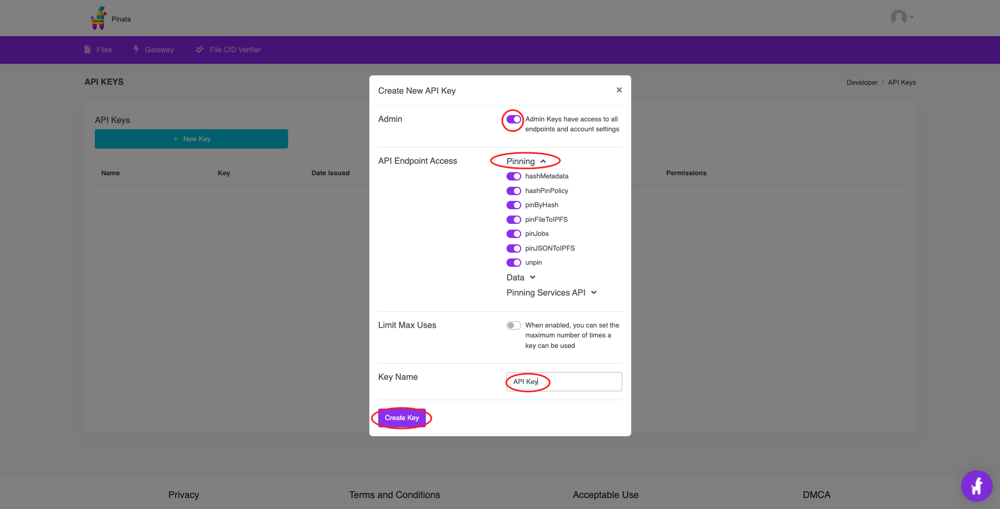
	创建密钥后，它将显示所有值。密钥、密钥和 JWT。单击“全部复制”按钮并将它们粘贴到安全的地方，以免它们被带走！ （当然截图下面的键已经失效了）

	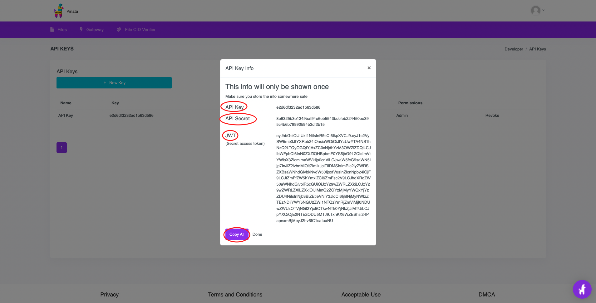
	如果您需要删除密钥，只需再次访问密钥页面，然后单击要删除的密钥的“撤销”即可！
	
	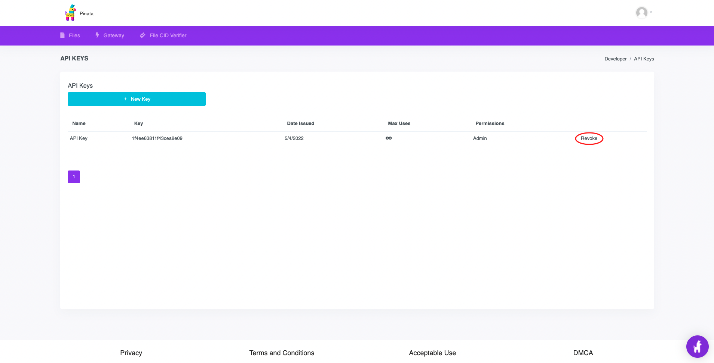
- 结论

	Pinata API 密钥将允许您访问 Pinata api 并将您的 Pinata 帐户用于其他第三方应用程序。如需进一步参考，请访问我们的[文档](https://docs.pinata.cloud/)，并随时通过我们网站右下角的支持聊天气泡向我们提问！
	
### 如何通过 Pinata 使用 IPFS 桌面
在本文中，我们将向您展示如何使用 IPFS 桌面应用程序将内容固定到您自己的本地 IPFS 节点和 Pinata！

1. 安装IPFS桌面

	您可以从此处的链接[下载](https://docs.ipfs.io/install/ipfs-desktop/) IPFS 桌面客户端。按照您使用的机器的说明进行操作。安装并打开后，它应该看起来像这样：

	
2. 将文件固定到 IPFS
	
	单击 IPFS 桌面中的“文件”选项卡。从这里您将看到您通过 IPFS 桌面固定的任何文件。要上传，请单击右上角的“导入”。

	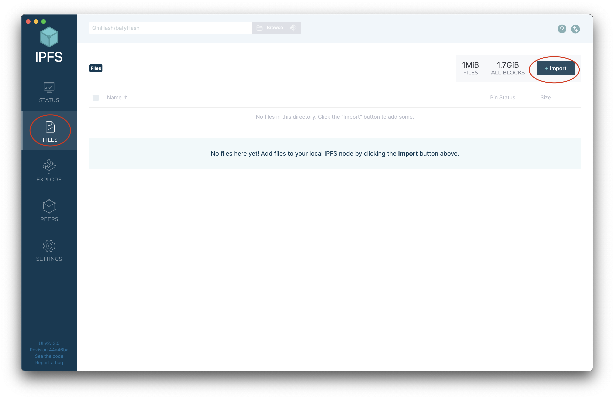

	您可以导入本地文件、文件夹，也可以导入现有的 IPFS CID。

	🗂 文件夹请注意！！ 🗂
	
	将大文件夹添加到 IPFS 桌面时，请确保一次性添加所有文件夹。如果您将项目分块添加到文件夹中，IPFS 将取消固定原始文件夹，然后重新固定新文件夹。如果你这样做太多次，会导致本地固定出现问题，我们将无法通过 CID 固定。如果您有一个非常大的图像文件夹并且 IPFS 桌面很难导入它，那么您可能需要考虑将文件夹拆分并单独上传每个文件夹，然后映射到元数据中的多个图像文件夹 CID。

	选择文件并完成上传后，您应该会看到文件出现在文件管理器中，并带有上传时生成的 CID。

	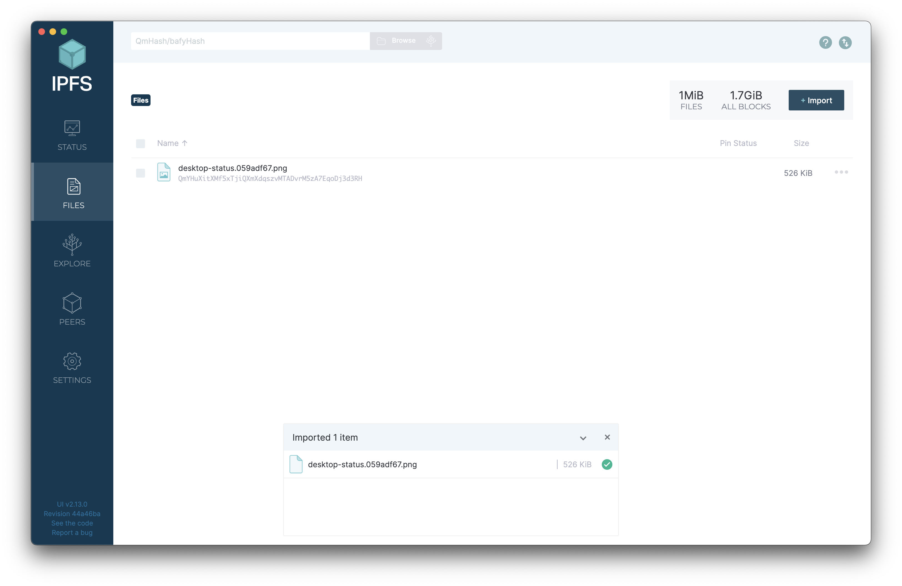
	
	如果您没有在服务选项卡中启用自动上传，您可以在此处手动固定它们！只需单击右侧的选项按钮，然后选择“设置固定”。

	从此模式中，您需要选择“本地节点”。

	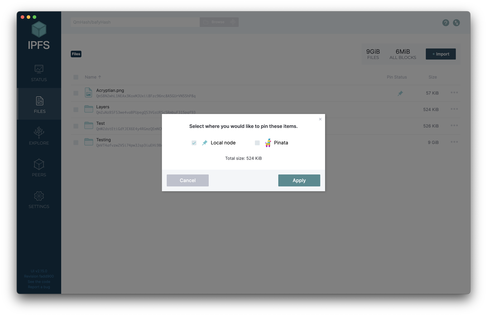
	
	执行此操作后，您将看到一个固定状态，显示它已固定到您的本地节点。
	
	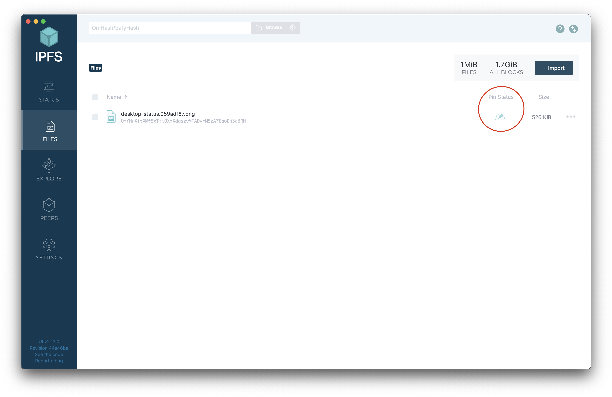
3. 将文件固定到 Pinata

	🚨 在那儿停下来！🚨

	在我们继续之前，了解为了使用这种方法上传，IPFS 桌面应用程序在固定到 Pinata 时必须保持打开状态是至关重要的。 IPFS 桌面应用程序在您的机器上运行本地 IPFS 节点，从其他节点发送和接收数据。当您将文件或文件夹从您的机器托管到节点时，Pinata 必须从您的节点找到所有数据。如果应用程序在固定到 Pinata 时关闭，上传将不会成功。确保应用程序保持打开、运行状态，并且机器保持开启状态，互联网连接不会中断！

	- 从 IPFS 桌面应用程序，复制文件的 CID

		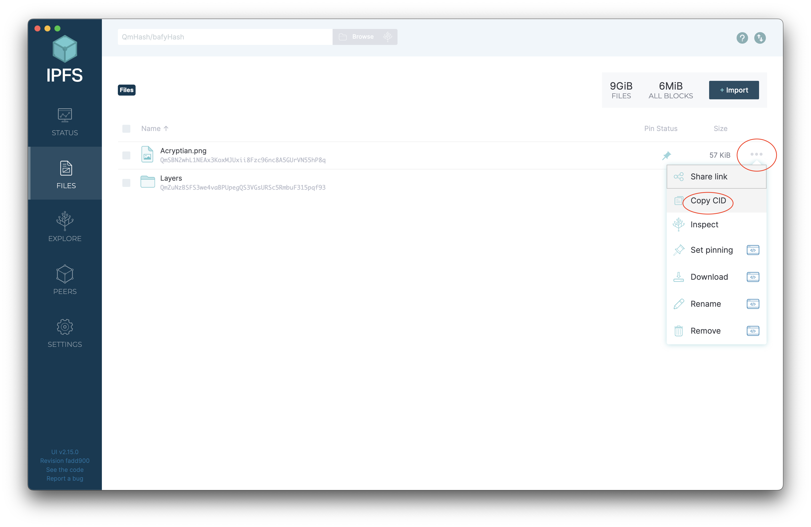
	- 登录您的 Pinata 帐户，单击“上传”按钮，然后选择“CID”

		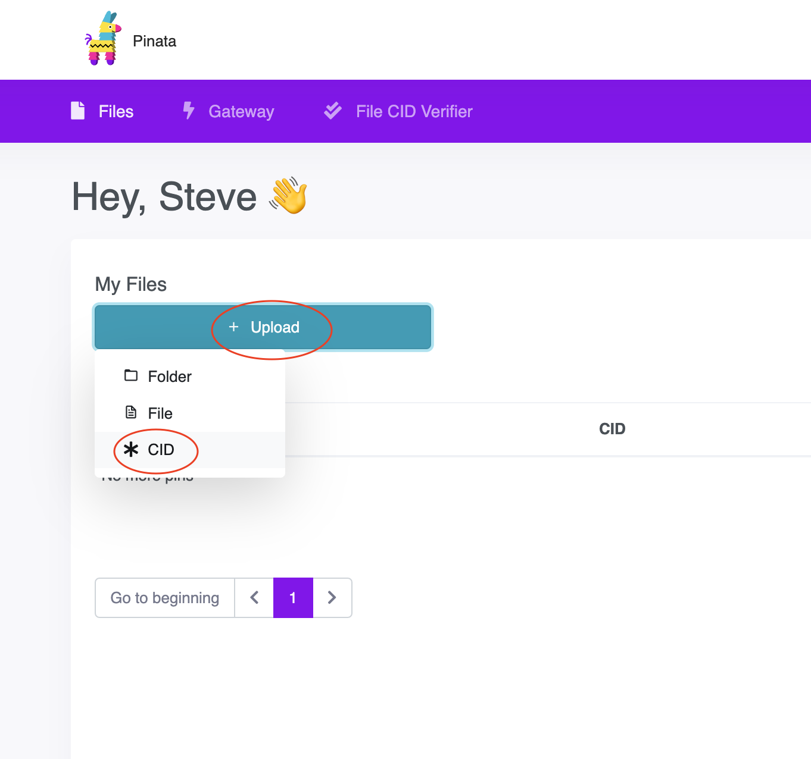
	- 从您在 IPFS 桌面上的文件中粘贴 CID，并为其指定一个您希望在 Pinata 中引用的名称。然后单击“搜索并固定”。

		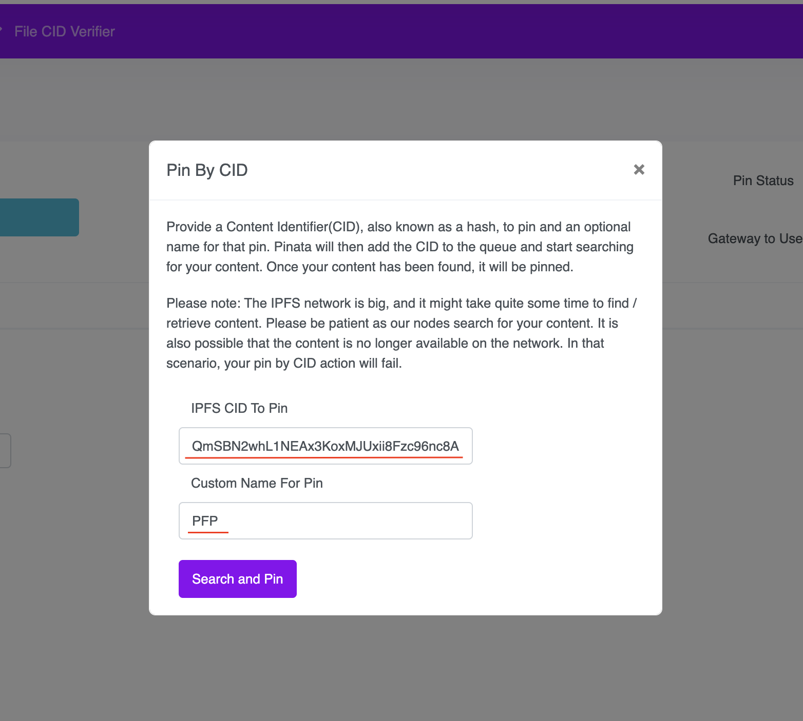
	- 完成此操作并刷新页面后，您将看到“按 CID 队列固定”，您可以在其中检查固定状态

		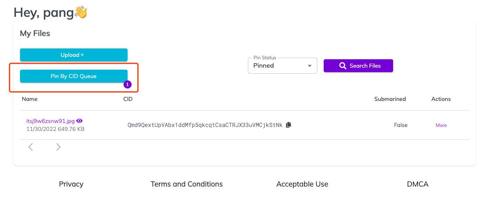
	- 从这里您可以看到固定状态

		
	
	固定有几种不同的状态。以下是每一个的意思：

	状态|详情
	---|---
	Prechecking(预检)|Pinata 在搜索之前会预先检查 CID，确保它是有效的 CID。例如如果你输入随机词而不是有效的 CID，它将无法通过预检查
	Searching(搜索中)|Pinata 目前正在寻找 IPFS 上的 CID 内容。 
 如果您的 Pin 作业一直停留在搜索状态，这通常意味着我们无法找到 CID。您需要确保它已如步骤 2 中所示正确固定，以及任何可能阻止数据离开您的计算机的防火墙或防病毒软件。
	Retrieving(检索)|Pinata 已找到 CID，目前正在将内容固定到 Pinata IPFS 节点 
 这是一个好兆头！这意味着如果 IPFS 桌面应用程序保持运行，您的内容是可访问的并且将完成。请注意，速度可能因文件数量、您的互联网上传速度和 IPFS 网络而异。通过 CID 固定可能需要几分钟到一整天的时间。
	Expired(已到期)|Pinata 正在检索文件，但连接中断了。
 当您的计算机进入睡眠状态、IPFS 桌面应用程序关闭或您的互联网连接停止时，就会发生这种情况。由于您的计算机是仅有的具有内容的 IPFS 节点之一，因此 Pinata 主要是从中提取内容。
	over_max_size|Pinata 将文件/文件夹识别为超过 [25GB 上传限制](https://docs.pinata.cloud/rate-limits#upload-size-limits)，请发送电子邮件至 [team@pinata.cloud](team@pinata.cloud) 以获取自定义解决方案

	为确保您的 pin 确实在检索，请检查 IPFS Desktop 中的状态页面。从那里您将看到节点的传入和传出流量图！当你通过 CID 固定时，Pinata 的节点将蜂拥而至你的本地节点，导致传出流量激增。如果您没有看到传出流量，则说明出了点问题，您可能需要重做上述步骤！

	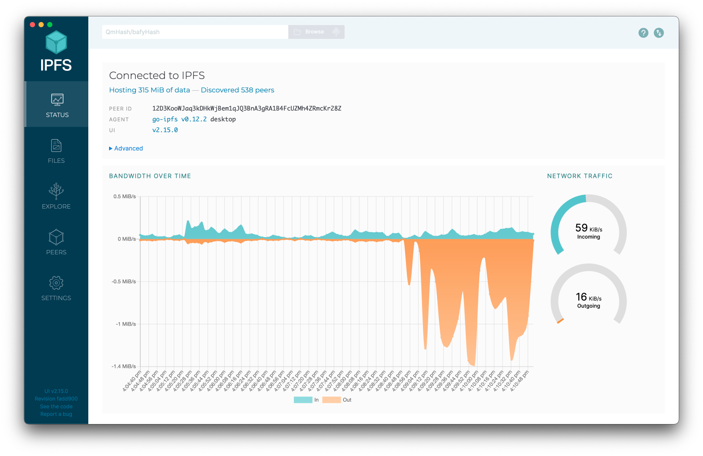
	固定完成后，作业将从队列中消失，文件将显示在您的文件管理器中！

	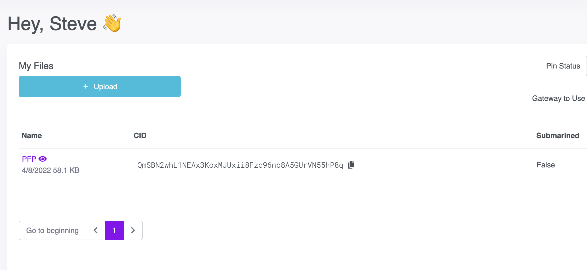
4. 大文件夹

	如果您要上传一个大文件夹，保持 IPFS 桌面应用程序运行非常重要。 由于文件夹中会有很多文件，Pinata 需要更长的时间才能找到每个文件并将其固定到您的帐户。 如果 IPFS 桌面应用程序关闭，该节点将停止广播数据，并且会中断 Pinata 与您的 IPFS 桌面节点之间的连接。 如果发生这种情况，您可以查看 Pinata 帐户上的 Pin by CID 队列，它可能会显示“已过期”。 只需重新启动 IPFS 桌面应用程序，确保文件夹已固定，然后重新固定。 确保您的计算机没有睡着或失去互联网连接以完成该过程。 如果文件夹超过 25GB，您需要发送电子邮件至 team@pinata.cloud 以获得自定义解决方案，因为我们的上传限制是每个文件/文件夹 25GB。	
	
### 如何通过运行本地 IPFS 节点命令行上传大文件夹
1.  - 先决条件：

	本指南中提供的说明必须通过所谓的“命令行”运行。

	- 要在 Windows 中打开它，请查看：[https://www.howtogeek.com/235101/10-ways-to-open-the-command-prompt-in-windows-10/](https://www.howtogeek.com/235101/10-ways-to-open-the-command-prompt-in-windows-10/)
	- 要在 macOS 中打开它，请查看：[https://www.howtogeek.com/682770/how-to-open-the-terminal-on-a-mac/](https://www.howtogeek.com/682770/how-to-open-the-terminal-on-a-mac/)

	打开命令行应用程序后，您可以开始输入上面链接的安装文档中提供的命令。
2. - IPFS 安装：

	打开命令行应用程序后，您需要做的第一件事就是访问位于此处的 ipfs 官方分发页面：[https://docs.ipfs.io/install/command-line/#official-distributions](https://docs.ipfs.io/install/command-line/#official-distributions) .在此页面上，您需要滚动到您的操作系统并按照有关如何将 IPFS 安装到您的计算机的说明进行操作。

		请确保您安装了 ipfs v0.11.0 或更高版本。
3.  - 运行 IPFS

	成功安装 IPFS 后，您将需要通过在命令行中键入 `ipfs daemon` 来运行它。

	你应该看到类似这样的东西出现：

	

	如果你看到这个，恭喜你，你的计算机上正在运行 IPFS！

	* 请注意，有时您可能会在命令行窗口中看到与网络相关的错误消息。只要您的 IPFS 守护程序仍在运行，就不必担心这些消息。
4. - 将您的内容添加到 IPFS

	IPFS 运行后，下一步就是将文件夹添加到本地运行的 IPFS 节点。为此，您需要为命令行应用程序打开一个新选项卡或窗口。我们需要在新窗口中运行我们以后的命令，因为我们需要让 ipfs 守护进程在您原来的命令行窗口中运行。

	- 在 MacOS Windows 上，您可以通过在键盘上键入 Ctrl + Win + T 来执行此操作
	- 在 MacOS 上，您可以通过键入 ⌘ + n 来执行此操作

	在新的终端窗口中，您需要导航到文件夹在本地文件系统中的存储位置。

	您可以使用 cd 命令执行此操作。

	- 要导航到计算机上的文件夹位置，请键入：

			cd nameOfTargetFolder
	- 要在您的计算机中向上导航一个级别，请键入：

			cd ..
	- 要列出您所在的当前文件夹的内容，您可以键入：

			ls

	您的目标位置将是包含您要上传到 Pinata 的文件文件夹的文件夹。因此，如果您的文件夹名为 `exampleFolder` 并且存储在您的 `Documents` 文件夹中，您需要确保您位于 `Documents` 文件夹中，而不是在 `exampleFolder` 文件夹中。要确认这一点，如果您运行 `ls` 命令，您应该会看到结果中列出了` exampleFolder`。

	到达目标位置后，您需要在命令行中键入以下命令：

		ipfs add --recursive --progress ./exampleFolder/ 
	从这里你的文件夹应该开始被添加到 IPFS。如果您有一个相对较大的文件夹，这可能需要一些时间。当事情停止添加并且上传达到 100% 时，您就会知道一旦完成。您应该收到如下所示的内容：

	
	注意到我们收到的最底部的 CID 了吗？旁边有 `exampleFolder` 名称的那个？这就是你想要抓住的。
5.  - 确保您的内容可在 IFPS 网络上检索。
- 5.1.  - 在你做任何其他事情之前，你需要检查你的文件夹是否太大以至于 IPFS 无法正确传输。为此，需要运行以下命令：

		ipfs block stat CID 

	其中 CID 是文件夹的根 CID。如果此大小超过 1000000，您的内容将无法被发现！

	- 如果您遇到此问题，您可能没有运行 go-ipfs v0.11.0 或更高版本。请在命令行中使用命令 `ipfs version` 进行检查：
		- 如果您看到小于 11 的任何内容，则需要升级到 ipfs v0.11.0。
		- 启用此功能后，您需要在再次添加文件夹之前重新启动节点！
		- 启用此功能并重新添加内容后，您应该会收到一个新的 CID。
		- 运行 `ipfs block stat CID` 来仔细检查这里的结果是否小于 1000000。
- 5.2 - 现在您已经将您的内容添加到您的节点并且我们知道它符合 IPFS 文件夹限制，让我们仔细检查并确保公共 ipfs 网络可以找到它。为此，我们建议访问：

	[https://ipfs.io/api/v0/object/stat?arg=CID](https://ipfs.io/api/v0/object/stat?arg=CID)（将 CID 替换为您文件夹的 CID）

	如果这返回一些文本告诉您有关您的上传，而不是错误，那么您可以继续下一步！

	如果您收到超时错误，这意味着您的本地节点可能在防火墙后面有连接问题。要解决这些问题，我们建议您在此处查看本指南：[https://docs.ipfs.io/how-to/nat-configuration/#nat-configuration](https://docs.ipfs.io/how-to/nat-configuration/#nat-configuration)
6. - 让 Pinata 检索您的内容

	现在您已经将内容添加到本地 IPFS 节点，是时候让 Pinata 获取它了！

	转到 [https://app.pinata.cloud/pinmanager](https://app.pinata.cloud/pinmanager) 并单击上传按钮和“CID”：

	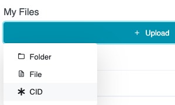
	在这里，输入您的 CID 及其名称。

	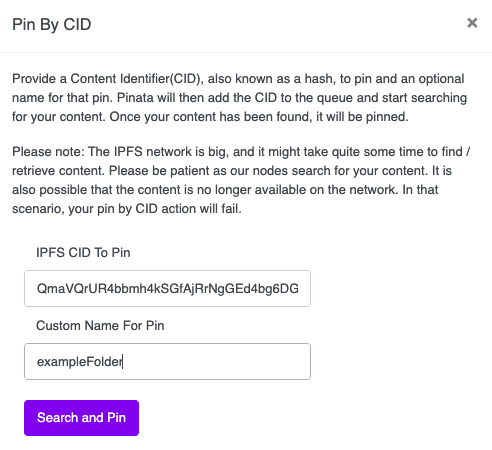
	
	完成后点击“搜索并固定”
7. - 等待成功！

	当 Pinata 正在网络中搜索您的内容时，请耐心等待。 如果您的文件夹很大，检索可能需要很长时间。 此外，如果您的网络连接速度较慢，这也可能会减慢检索时间。

	通过每隔一段时间刷新 pin 管理器，您就会知道检索已完成。 一旦您的 CID 出现在固定列表中，您的内容就已成功固定到 Pinata！

### 取消固定文件意味着什么
在 IPFS 上取消固定文件和垃圾收集过程

在 IPFS 的世界里，文件被固定在存储节点上。 这可确保文件始终可访问。 如果文件未固定，它将在称为垃圾收集的过程中被清除。 此过程会从 IPFS 存储节点中删除所有未固定的内容。

当您在 Pinata 帐户上取消固定文件时，它会被放入一个队列中以供垃圾收集处理。 此过程不是即时的，因此您可能仍会看到您的文件可通过 IPFS 网关访问。 即使此过程完成后，其他人也可能已将您的文件固定到另一个 IPFS 节点。 如果是这种情况，您的文件仍然可以访问。 但是，如果发生这种情况，该文件将不会归属于您在 Pinata 上的帐户，也不会计入您的存储费用。

如果您正在寻找有关如何取消固定帐户文件的信息，可以在此处[查看指南](https://knowledge.pinata.cloud/en/articles/5506008-how-to-remove-files-on-pinata)。
### 如何删除 Pinata 上的文件
如果您需要删除文件，有两种选择：

- 通过用户界面删除它们

	在[此处](https://app.pinata.cloud/)登录您的 Pinata 帐户。登录后，您应该会自动进入包含所有文件的页面。如果单击文件右侧的“更多”按钮，您将看到删除文件的选项：

	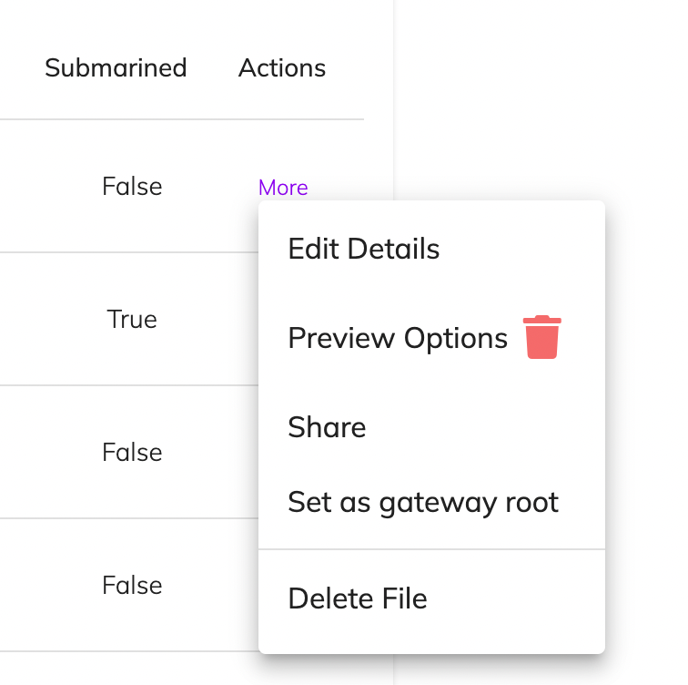

	单击“删除文件”，文件将被删除。我们的数据库中仍然会有关于该文件的元数据记录，以便您可以参考已删除（取消固定）的文件。但是，一旦我们的 IPFS 节点运行垃圾收集，您将无法访问该文件。在[此处](https://knowledge.pinata.cloud/en/articles/5506024-what-does-unpinning-a-file-mean)阅读有关 IPFS 上未固定文件的更多信息。

	目前，我们没有用于取消固定文件的批量选项。如果可能，我们建议为此使用 API。
- 通过 API 删除

	如果您是技术人员并且可以使用代码，您可能希望使用我们的 API 来删除您的文件。这也是批量删除文件的好方法。首先，我们将介绍单独删除一个文件，然后我们将讨论如何批量执行此操作。

	删除单个文件就像知道该文件的 IPFS CID 一样简单。以下是通过 API 删除文件的文档：

	[https://docs.pinata.cloud/pinata-api/pinning/remove-files-unpin](https://docs.pinata.cloud/pinata-api/pinning/remove-files-unpin)

	如果您想批量删除文件，则需要执行两个步骤。

	- 首先，您需要根据一些识别标准查询要删除的图钉。
	- 接下来，您将需要遍历这些文件并单独取消固定每个文件。

	查询引脚意味着使用 `pinList` 端点。这是记录在这里：

	[https://docs.pinata.cloud/pinata-api/data/query-files](https://docs.pinata.cloud/pinata-api/data/query-files)

	当您有要取消固定的引脚列表时，您可以遍历它们并调用取消固定端点。请记住 Pinata 的 API 是有速率限制的。
	
		您需要在请求之间添加半秒到整秒的延迟。

## 专用网关
### 专用网关
对于那些在检索内容时需要更快速度或更高速率限制的用户，Pinata 允许我们野餐计划中的用户创建专用网关。

- 专用网关有什么好处？
	- 通过我们遍布全球的 200 多个边缘缓存位置提供无与伦比的速度
	- 请求内容没有速率限制

	以下是通过公共网关的内容示例：
	
	[https://gateway.pinata.cloud/ipfs/QmahdJBPpwwheQMvKHnJEgs1NvnsFccxfPvcRUt9uKBsnk](https://gateway.pinata.cloud/ipfs/QmahdJBPpwwheQMvKHnJEgs1NvnsFccxfPvcRUt9uKBsnk)
	这是专用网关的示例
	
	[https://kyletut.com/ipfs/QmahdJBPpwwheQMvKHnJEgs1NvnsFccxfPvcRUt9uKBsnk](https://kyletut.com/ipfs/QmahdJBPpwwheQMvKHnJEgs1NvnsFccxfPvcRUt9uKBsnk)
	
	要开始，您需要[注册野餐计划](https://pinata.cloud/billing)。从那里，应该会自动为您创建一个专用网关，您可以在[“网关”选项卡](https://app.pinata.cloud/gateway)上看到它。
- 创建一个额外的网关

	在网关页面上，只需单击创建网关：

	系统将提示您通过易于使用的向导创建网关。为您的网关提供一个名称，然后选择您的网关是开放的还是受限的。
- 开放(open)与限制(Restricted)

	开放网关和受限网关有什么区别？在这两种情况下，任何拥有链接的人都可以访问网关提供的内容。但是，受限网关只会提供固定在您帐户上的内容。

	- 开放网关将（假设它可以在 IPFS 网络上找到内容）提供任何内容，即使它没有固定到您的帐户。这对于广泛的可访问性非常有用，但会导致更高的使用成本。
	- 受限网关意味着您只需为传送内容付费。
- 什么是带宽？

	带宽是代表您或您的用户正在通过专用网关查看的项目的数据。通过网关显示或通过网关下载的每个图像、视频、音频和任何其他类型的文件都是由数据组成的。该数据从 IPFS 节点发送到您的计算机。此数据的大小是带宽。

	您可以通过转到网关页面并单击网关的子域链接来跟踪已设置的任何网关的带宽。
- 我如何使用我的网关
	
	要通过您的网关查看内容，请获取您要查看的文件的 CID，并将其添加到您的网关 URL，如下所示：

		https://<你的网关子域>.mypinata.cloud/ipfs/<你的 CID>
	就那么简单！
- 如何转换其他网关 URL 以使用我的网关？

	在许多情况下，项目会直接将整个网关 URL 放在链上（例如铸造 NFT 时）。

	如果您发现自己从可能提供网关 URL 的位置阅读，Pinata 创建了 [ipfs-gateway-tools](https://github.com/PinataCloud/ipfs-gateway-tools) 工具包来帮助您。

	该工具包可以轻松地将任何标准 IPFS 网关 URL 以及格式为 `ipfs://<CID>` 的 URI 转换为使用您的网关的 URL。
- 添加自定义域

	Pinata 还允许您为专用网关创建自定义域。只需单击网关页面表中网关行右侧的菜单按钮，然后单击添加自定义域。您需要拥有要使用的域。当您输入域时，系统会提示您通过注册商输入 DNS 信息。
- 我们需要您的反馈！

	有什么建议吗？有投诉吗？对文档中的某些内容感到困惑？只是想打个招呼？

	我们想让 Pinata 成为最好的产品。这涉及倾听我们的用户并满足他们的需求。

	请发送电子邮件至 team@pinata.cloud，我们将看看如何提供帮助。

### 为什么在尝试查看文件夹时出现 504 错误？
IPFS 是一个强大的文件存储系统，但它并非没有局限性。最近几个月，许多个人和项目开始存储包含数千（有时数万）个文件的文件夹。当尝试通过网关查看这些文件夹的内容时，他们对为什么无法加载内容感到困惑。

简单的答案是 IPFS 网关没有内置分页。这意味着当您尝试查看其中包含 10,000 个文件的文件夹时，网关和浏览器会尝试一次加载所有这些文件。正如您可以想象的那样，这对于浏览器来说可能是压倒性的。

- 你如何解决它？
	
	好吧，你不能。但你可以绕过它。您文件夹中的每个文件仍然可以访问，因此您应该使用指向您的文件夹目录的链接，并在末尾附加文件名。假设您的文件夹 CID 是“MY_FOLDER_CID”。假设您有一个名为“1.json”的文件。您可以通过以下方式加载该文件：

		GATEWAY_URL/ipfs/MY_FOLDER_CID/1.json
	这仍然是一种访问 IPFS 上文件夹内文件的内容可寻址方式。如果文件夹的内容发生变化，则文件夹 CID 会发生变化，因此文件的路径也会发生变化。您使用此方法具有相同的可验证性保证。
- 如果我需要文件夹内的 CID 怎么办？

	为了获取所有子文件 CID，您需要运行自己的本地 IPFS 节点。您需要将该文件夹添加到您的 IPFS 节点，然后从命令行运行以下命令：

		ipfs dag get <FOLDER CID>
		
### 为您的网关设置自定义域
Pinata 的每个专用 IPFS 网关都带有添加自定义域的选项。自定义域允许您的网关位于网络上的 URL，例如 `alice.com`，而不是 `alice.mypinata.cloud`。让我们来看看如何将自定义域添加到现有网关。

- 购买域名

	您必须拥有或有权访问您希望与 Pinata 网关一起使用的域的 DNS 记录。

	如果您还没有可用于网关的自定义域，则需要购买一个。有许多可用的域注册商。事实上，有太多的注册商，我们试图推荐任何特定的注册商都是愚蠢的。

	如果您不确定去哪里查找，只需在谷歌上搜索“域名注册商”即可为您指明正确的方向。
- 在 Pinata 上设置域

	在您的网关上设置自定义域是一个两步过程。
	
	- 第一步是通过 Pinata 配置它
		- 拥有域后，您可以通过 Pinata 界面开始配置它的过程。登录到您的 Pinata 帐户后，单击“网关”选项卡。

			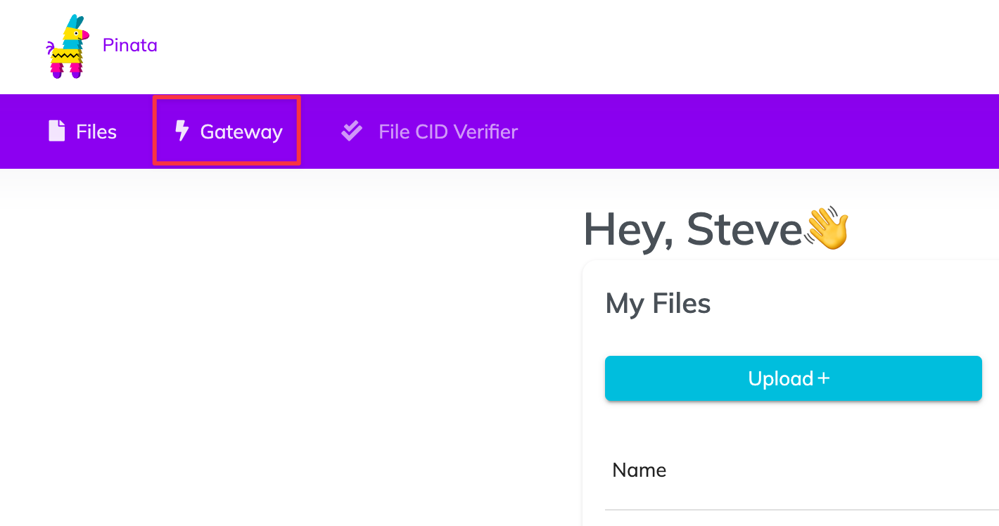
		- 接下来，您需要单击要为其添加自定义域的网关最右侧的三点菜单图标。这将打开一个包含更多选项的上下文菜单。单击“添加自定义域”选项。
	
			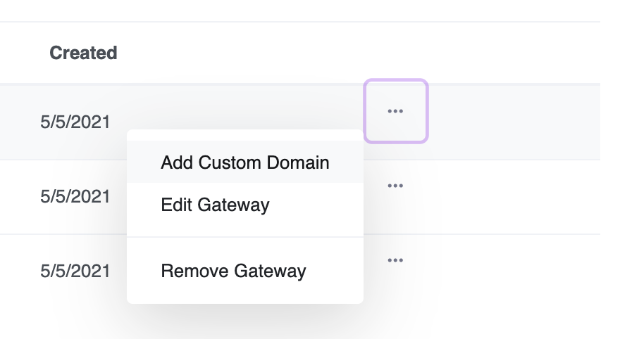
		- 这将弹出一个模式，询问您的自定义域。如果您在 [www.alice.com](http://www.alice.com/) 上设置域，您将输入该域。有关选择自定义域的更多信息，请参阅下面的部分。添加自定义域后，只需单击“添加”按钮即可。

			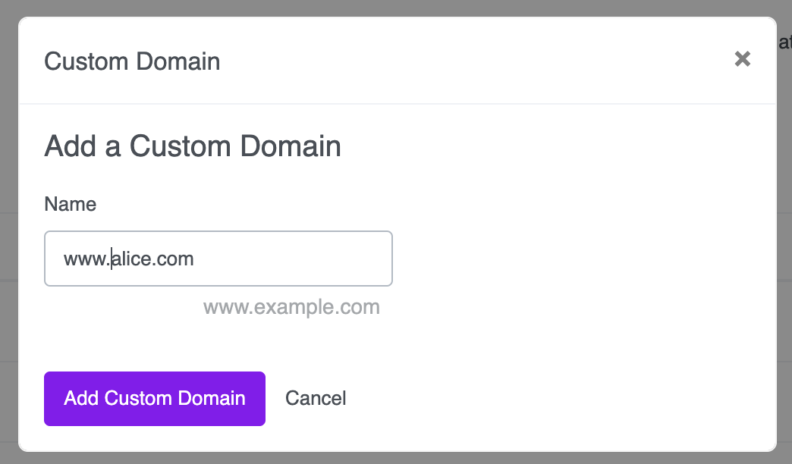
	- 第二个是通过您的域注册商配置它。	
- 子域、根域和裸子域

	当您设置自定义域时，您需要考虑您希望该域如何工作。您可能想要使用子域，例如  `ipfs.alice.com`。或者您可能想要使用您的根域（这是包含 www 的域）。为此，您需要输入 `www.alice.com`。您甚至可能想使用裸子域。这将是一个像 `alice.com` 这样的域。注意到 alice 前面没有“www”了吗？

	这些选项中的每一个都需要略有不同的 DNS 配置。幸运的是，Pinata 在下一步中使这变得很容易。
- 配置 DNS

	现在是时候通过您的域名注册商配置您的 DNS 记录了。您会看到一个黄色警告指示器，让您知道您仍然需要配置 DNS。你需要点击它。

	
	当您单击该按钮时，您将看到需要提供给注册商的配置设置。这些设置特定于您使用的域类型（根域、子域、裸子域）。

	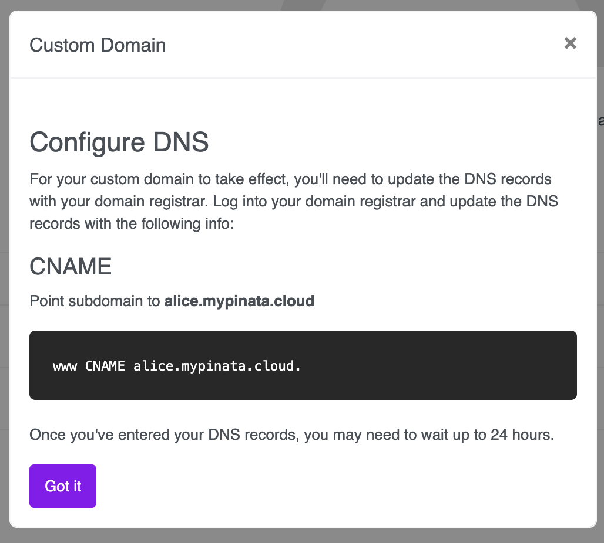
	上面的例子告诉我，如果我想让我的网关位于 `www.alice.com`，我需要通过我的域名注册商在我的 DNS 条目中创建一个 `CNAME` 记录，并将 www 值指向 `alice.mypinata.cloud`。

	每个域名注册商配置 DNS 记录的方式可能略有不同。不过，在大多数情况下，您可以选择记录类型 (CNAME)，输入主机和值。在这种情况下，主机将是 www。该值将为 `alice.mypinata.cloud`。这是 Namecheap 上的样子：

	
	这对于每个域注册商来说看起来都不一样，因此遵循他们提供的任何指南和文档非常重要。
- 整理起来

	配置 DNS 记录后，自定义域的使用过程通常很快。当一切设置正确时，Pinata 网关页面将不再显示“检查 DNS 配置”。相反，它会显示“已配置 DNS”。您将需要刷新窗口以检查网关 DNS 配置的更新。

	如果您的自定义域在 24 小时内未显示为配置，请联系我们。
	
### 视频：设置专用 IPFS 网关
在本视频中，您将学习如何通过 Pinata 设置和配置您自己的专用 IPFS 网关。 您还将学习如何使用您自己的域名设置专用网关以进行自定义品牌推广。

<iframe width="640" height="360" src="https://www.youtube.com/embed/v6lZbi12I9w" title="Learn How to Easily Create Your Own Dedicated IPFS Gateway" frameborder="0" allow="accelerometer; autoplay; clipboard-write; encrypted-media; gyroscope; picture-in-picture" allowfullscreen></iframe>
### 公共网关与专用网关
- 公共网关和专用网关之间的速度差异是多少？

	将内容上传到 Pinata 后，自然要做的第一件事就是在 IPFS 网络上查看它！但是有一个问题：IPFS 是一个单独的协议，就像常规网站的 HTTP 是一个协议一样。要访问该内容，我们需要一个网关来桥接 IPFS 和 HTTP。 IPFS 网关帮助我们做到这一点！

	对于网关，有多种选择。
	
	- 第一个是公共网关。这些网关是公开共享的，由于它们是免费的，因此可以很好地进行测试，但是由于它们是共享的，因此它们可能会非常缓慢和拥挤。这是您可以查看的示例：

			https://gateway.pinata.cloud/ipfs/QmP4eZj61tDxCmtb6aqSwQsrxRQAN2gwxTEXkTed9TujHh
		很慢吧？这就是为什么您可能永远不想将公共网关用于生产用途。
	- 另一方面，我们付费计划中的专用网关要快得多。通过专用网关查看相同的 CID！

			https://stevedsimkins.mypinata.cloud/ipfs/QmP4eZj61tDxCmtb6aqSwQsrxRQAN2gwxTEXkTed9TujHh

		超快吧？！这是 Pinata 专用网关的强大功能，它利用全球 CDN 缓存内容以进行快速检索。它们不仅速度快，而且还允许自定义域与您正在创建的品牌相匹配。

		想为自己获得专用网关吗？单击下面的按钮开始！

### Nft 项目中的Token uri
`ipfs://` 和 `https://gateway` 的区别

- 简介

	当您在进行 Nft 项目时，必须做出的一个决定是是否在元数据和/或令牌uri中使用网关URL。

	就上下文而言，Nft 只是一个标记，它指向链外驻留的元数据片段。在这种情况下，就是指规数标准。当你在制作Nft的过程中，典型的流程是:

	- 将资产上传,得到 CID
	- 将 CID 放入元数据文件中
	- 上传元数据文件以获取 CID
	- 在 NFT 中使用元数据 CID

	问题是，当你引用图像或元数据 CID 时，你应该使用:

	- 标准的 IPFS uri 
	
			IPFS://QmRAuxeMnsjPsbwW8LkKtk6Nh6MoqTvyKwP3zwuwJnB2yP
	- 一个公共IPFS网关url 

			https://gateway.pinata.cloud/ipfs/QmRAuxeMnsjPsbwW8LkKtk6Nh6MoqTvyKwP3zwuwJnB2yP
	- 专用网关url 
	
			https://pinnieblog.mypinata.cloud/ipfs/QmRAuxeMnsjPsbwW8LkKtk6Nh6MoqTvyKwP3zwuwJnB2yP

	每一种选择都有好处也有问题，所以让我们来讨论一下每一种选择!
- 标准 IPFS URL

	一个标准的 IPFS url 是这样的:

		ipfs://QmRAuxeMnsjPsbwW8LkKtk6Nh6MoqTvyKwP3zwuwJnB2yP
	如果将其复制并粘贴到浏览器中，则可能得不到任何反馈。这是因为为了使用这个节点，您必须运行一个本地 IPFS 节点来参与网络。即使你这样做，它可能会非常非常慢，因为 IPFS 仍然是一个不断增长的网络。

	为什么要使用它?有几个原因。如果你正在构建一个已经大量使用 IPFS 的区块链，比如以太坊或另一个L2链，许多市场和应用程序都习惯使用这种格式。当他们看到它时，他们使用工具将url转换为网关url，这样它就可以在网站上显示内容。这可能是好事，也可能是坏事。
	
	- 如果平台有专用/私有网关，速度将非常快(就像我们自己的专用网关一样)。
	- 但是，如果平台使用公共网关，速度将非常慢。

	最后，平台可以控制你的内容被接受的程度。此外，使用标准的IPFS url可能有助于未来证明你的资产，因为公共网关可能会在路上被停止(然而在这些情况下CID仍然在url中，所以如果平台知道怎么做，他们仍然可以在固定的情况下获得内容)。

	如果您在不同的L1链上，您可能想在进行完整收集之前先对其进行测试。在其他区块链上有一些平台期望“https”代替，如果你使用这个，什么也不会加载。
- 公共 IPFS 网关 URL

	公共网关URL看起来像这样:

		https://gateway.pinata.cloud/ipfs/QmRAuxeMnsjPsbwW8LkKtk6Nh6MoqTvyKwP3zwuwJnB2yP
	这将在浏览器中交付内容，而不需要本地 IPFS 节点。但是，由于此网关是公共网关，您的速度可能会因交通拥挤而有所不同。有些平台会看到这种类型的 url，并切换到他们自己更快的网关选择，但并不总是这样。一般来说，如果你走这条路，资产会变慢。
- 专用 IPFS 网关 URL

	专用网关URL看起来像这样:

		https://pinnieblog.mypinata.cloud/ipfs/QmRAuxeMnsjPsbwW8LkKtk6Nh6MoqTvyKwP3zwuwJnB2yP

	[专用网关](https://www.pinata.cloud/dedicated-gateways)比任何其他方法都要快得多，当试图在自己的平台上显示内容时，理想情况下应该使用专用网关。然而，在Nft项目中使用它们应该谨慎。如果你在你的Nft项目元数据和图像链接中使用专用网关，你的速度将会非常快，但是当其他市场或稀有bot向区块链请求IPFS数据时，你的网关将会被击中。由于大多数专用网关都是付费服务，这可能会大大提高您的成本和使用量。使用这种方法，您将获得最佳的性能、控制和灵活性，但是您可能要付出比其他方法更多的代价。
- TL;DR

	- 如果您在区块链上使用良好的 IPFS 基础设施，那么使用标准的 IPFS URL 是首选选项，但是您将无法控制上下文在市场和其他第三方上的显示速度(您总是控制它在您自己的站点上的显示速度)。
	- 使用公共IPFS网关很便宜，但是您的内容可能很慢。
	- 使用专用IPFS网关可能会更昂贵，但将为您提供最大的控制、速度和灵活性。
	
	如果您有任何问题，请随时在我们的网站或电子邮件team@pinata.cloud上给我们留言!

## Submarining 潜水隐藏
### 如何隐藏你的文件
- 创建可以通过特殊链接访问的私有文件的指南

	使用 Pinata，您可以上传文件并将其设置为私有，同时仍然保持 IPFS 内容的可寻址性。我们称之为潜水艇。当您在 Pinata 上潜水艇一个文件时，该文件不会添加到公共 IPFS网络，而是由IPFS协议生成一个内容标识符(CID)。

	注意:此功能仅对 Pro Plan 客户可用，需要[创建专用网关](https://knowledge.pinata.cloud/en/articles/5455525-how-to-set-up-a-dedicated-ipfs-gateway)。

	由于文件是私有的，您可以控制谁以及何时访问该文件。通过单击 more 链接，然后选择共享选项，可以从用户界面生成访问令牌。让我们看看整个流程。

- 隐藏文件
	- 首先，像往常一样点击上传按钮:

		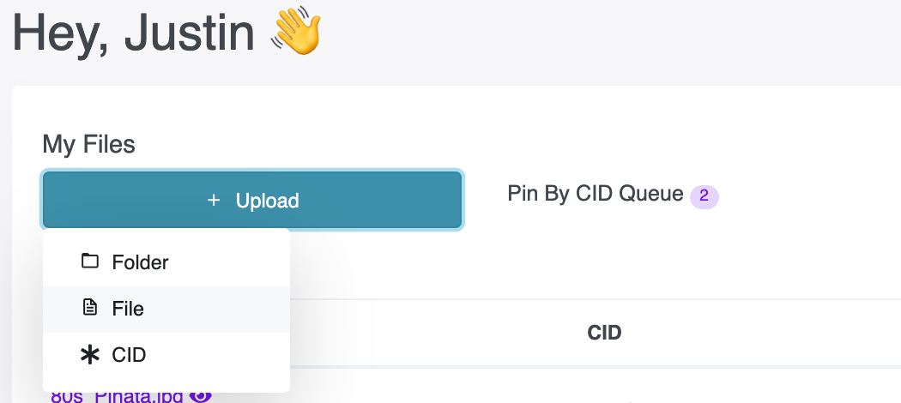
	- 接下来，选择您的文件，然后为其命名。你会在页面上看到你可以给你的文件命名一个新特性。要隐藏一个文件，只需拨动开关:

		
	- 就是这样。完成上传，你就在皮纳塔上潜下了一个文件!
- 如何共享文件

	上传并隐藏文件后，您可以通过生成访问链接与任何人共享该文件。访问链接有效期为一小时。

	- 在您的Pin管理器中找到该文件，并单击更多按钮:

		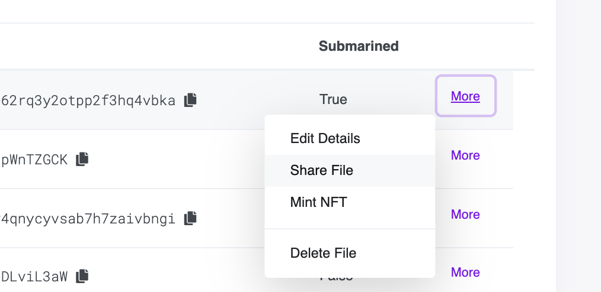
	- 点击“共享文件”按钮，系统会提示你生成一个访问链接:

		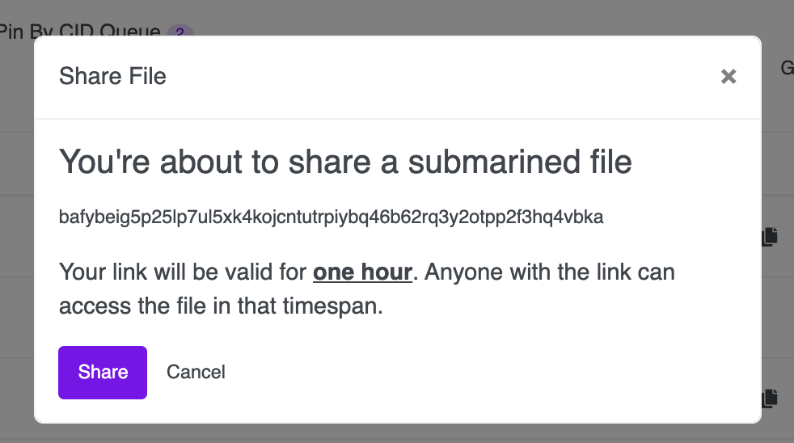
	- 当您单击“共享”按钮时，将创建访问链接。它将使用您的专用网关URL和一个定时令牌来创建一个完整的共享链接。只需点击URL复制它，然后你可以与任何人分享它，你想:

		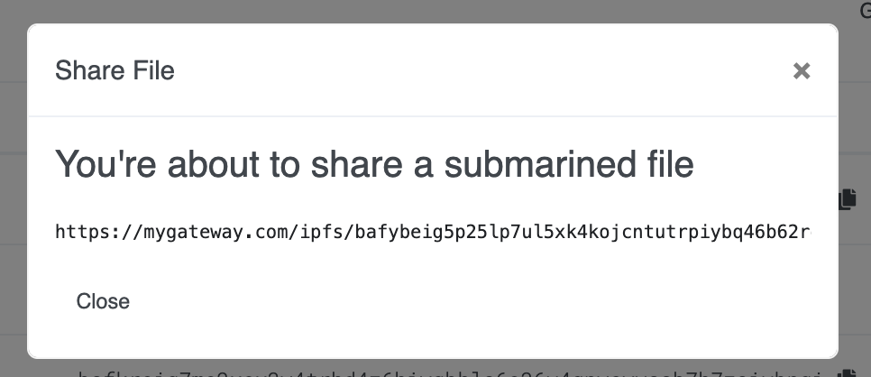

## 参考
[Advice and answers from the Pinata Team](https://knowledge.pinata.cloud/en/)
