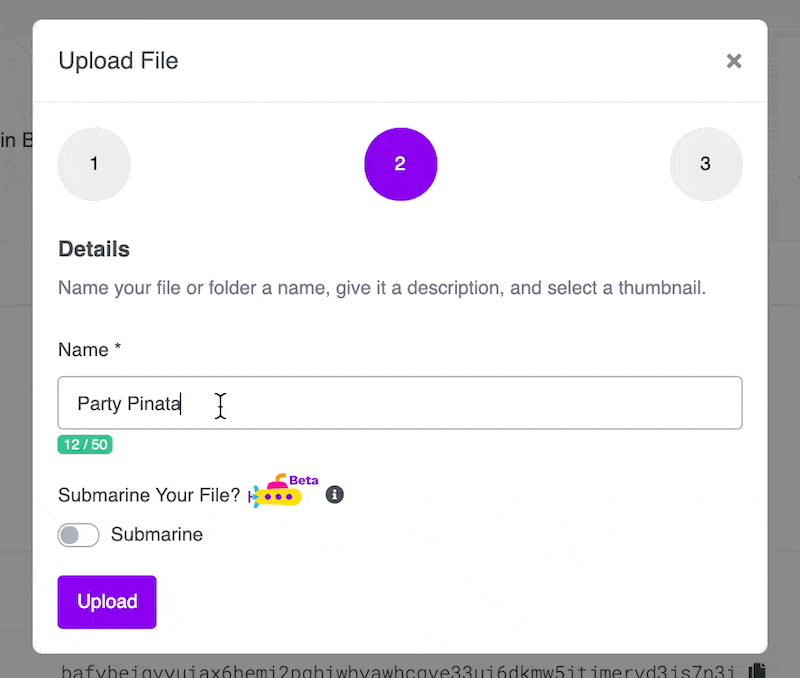

# Pinata 简介
## 什么是 Pinata?
Pinata 是一种 NFT 媒体管理服务，允许用户在他们选择的区块链上托管、管理和共享任何类型的文件。作为 IPFS 固定服务，我们专注于为技术和非技术创作者提供一种快速、简单和可靠的方式来无限制地共享内容。

对于开发人员而言，Pinata 是将内容固定到 IPFS 并构建 web3 应用程序的最简单方法，而无需构建和管理您自己的 IPFS 节点。我们为您完成所有繁重的工作。

对于创作者，Pinata 可以轻松地大规模提供内容，而无需任何技术经验。我们为任何人提供了开始创作的能力，而不必立即担心 web3 或 IPFS 的技术方面。

也就是说，这里是 IPFS 的快速细分和“固定”，以及一些有用的博客文章的链接，以备你想了解更多。
## 什么是 IPFS?
InterPlanetary file system，也称为 IPFS，是一种非常强大的协议，允许创建者在去中心化的对等网络上托管对于区块链来说太大的内容，利用密码学确保内容无法更改。

IPFS 网络非常适合希望去中心化（将控制权从集中式实体转移到分布式网络）其 NFT 媒体并确保它不会随时间变化的 NFT 项目。IPFS 还允许创作者拥有他们的内容的所有权以及他们分享内容的方式。

### 补充阅读
- [The IPFS Cloud](https://medium.com/pinata/the-ipfs-cloud-352ecaa3ba76)
- [The Power of Dedicated Gateways](https://www.pinata.cloud/blog/the-power-of-dedicated-gateways)

## 什么是 pin
当您在 IPFS 节点上“固定”数据时，您是在告诉该节点数据很重要并且应该保存。节点是将您连接到 IPFS 并存储文件的程序。

固定可防止重要数据从您的节点中删除。您且只有您可以控制和固定节点上的数据——您不能强迫 IPFS 网络上的其他节点为您固定您的内容。因此，为了保证您的内容保持固定状态，您必须运行自己的 IPFS 节点。

一旦你的文件被固定到 IPFS，你就可以完全控制以你喜欢的方式共享、分发、货币化和共享你的文件。
### 补充阅读
- [What is an IPFS Pinning Service?](https://medium.com/pinata/what-is-an-ipfs-pinning-service-f6ed4cd7e475)

## 用 Pinata 固定你的第一个文件
- 要开始，请继续并登陆到您的 Pinata 帐户，您将在其中看到您的帐户仪表板
- 进入仪表板后，您可以选择上传文件、文件夹或 CID（内容标识符）。
	- 文件: Pinata 允许您上传任何类型的文件，包括图像文件、视频文件、音乐文件、文本文件、应用程序——任何您能想到的。
	- 文件夹：您可以上传要存储和管理的整个文件夹内容，包括视频、图像或应用程序文件等市场资产的集合。
	- CID：Content Identifier（也称为 CID）是一串独特的字母和数字，代表一段数据，在 NFT 的情况下，证明 NFT 确实是你的。如果不更改附加到 CID 的内容，则不能在 IPFS 网络中更改一次 CID。了解有关固定 CID 的更多信息。
- 选择您要上传的内容，为其命名，然后按上传。（注意：您稍后可以编辑名称）
- 成功上传文件后，您将在屏幕顶部收到此消息。

瞧！您的文件现已上传到 IPFS。它将直接存储在您的 Pinata 仪表板上，以便于访问。
固定文件后，您可以从仪表板中选择下一步的操作。让我们来看看一些。

## 设置您自己的专用网关
如果您要从 IPFS 为您的观众获取内容，您需要快速获取。但是，如果您使用的是公共网关，则获取的内容越多，响应时间就越慢。专用网关解决了这个问题！不再有速率限制，您可以为您的专用网关打上烙印，打造更具凝聚力的体验。

要设置您的专用网关，请单击仪表板中的“网关”，然后选择“创建网关”。（注意：专用网关仅适用于付费用户）
### 补充阅读
- [专用网关](https://medium.com/pinata/announcing-dedicated-ipfs-gateways-60f599949ce)

## Submarining
Submarining 是 Pinata 的一项高级功能，允许用户与他们的社区共享可解锁的内容。[创作者可以通过 NFT 所有权、转让和通过 API 地理位置，使用 https://www.submarine.me/ ](https://www.submarine.me/)的无代码解决方案，让粉丝访问独家门禁内容。

对于开发人员而言，Submarining 提供了为应用程序和市场存储文件的安全性，而没有暴露其数据的风险。同样，使用 NFT 将其创意作品货币化的创作者现在可以与客户共享内容，而无需将数据留在公共 IPFS 上，这降低了内容和 NFT 媒体被盗的风险。

这可以从您的 Pinata 帐户的仪表板完成，只需上传您的文件、文件夹或 CID，然后选择潜入您的内容！

### 补充阅读
- [Submarining](https://www.pinata.cloud/blog/introducing-submarining-what-it-is-why-you-need-it)

## 工具与功能
	轻松构建所需的所有工具。
如果您是更高级的用户或具有技术背景，我们的 Medium 博客有详细的教程，例如如何使用 IPFS 共享 3D 模型、通过 IPFS 网关流式传输视频或使用 Pinata 的优化工具调整图像大小。

在您探索之前，让我们看看 Pinata 用户可以使用的其余工具和功能。

- NFT媒体管理

	Pinata 使创建、存储和共享 web3 内容变得快速、简单和安全。
- 快速安全的 IPFS 上传

	将您的内容上传到 IPFS 时，Pinata 旨在为我们的用户提供最快、最安全的上传项目和内容的过程。
- 内置 CDN

	Pinata 的内置 CDN（内容分发网络）在全球拥有 200 多个服务器位置，可让您在比加载 YouTube 视频所需的时间更短的时间内提供内容。
- 高效支持

	我们拥有一支令人难以置信的支持团队，随时准备帮助您解决您可能遇到的任何问题。联系我们的支持团队。
- 专用网关

	专用网关允许您更快地从 IPFS 节点请求您的内容，从而节省带宽和时间。您可以使用自己的品牌域自定义您的网关，这样您的品牌在所有共享媒体中保持一致。想要建立自己的专用网关？在这里学习如何。
- Submarining（可解锁内容）

	通过 Submarining ，您可以随时随地与您的社区分享可解锁的内容。Pinata 上的每个付费计划都附带潜艇。您可以通过两种方式进行设置，使用面向开发人员的 API 或用于非技术创意人员的 submarine.me。想了解如何潜入您自己的内容吗？阅读更多关于 Submarining 的信息。
- 丰富的预览

	通过捕捉预览分享内容，充分利用您的社交动态。针对单个文件的内置丰富预览功能使您可以在 Twitter、Discord、Telegram 或您的社区喜欢聚会的任何地方标记和分享您的 NFT。有兴趣了解有关 Rich Previews 的更多信息？查看此博客文章。
- 短链接

	我们知道有些链接有时会变得很长。使用内置的 URL 缩短器，您可以缩短链接并更轻松地在各种不同平台上共享。阅读有关短链接及其用途的更多信息。
- 视频优化

	让您的观众欣赏您的视频内容，完全按照您希望他们观看的方式来欣赏。内置视频优化使您能够为您的内容提供最佳视频格式和大小。因此您的内容不再需要符合 Web2 平台的格式。
- 图像优化 

	永远不要再牺牲图像质量！通过 Pinata 的图像优化，您可以保证始终拥有最高质量的图像以供即时共享和查看。在此处查看有关的更多信息！
- 成长中的社区

	在 Pinata，我们知道大多数项目需要一个村庄才能完成。我们专注于发展一个由志同道合的人组成的社区，他们希望与我们一起学习和成长。查看我们的 Discord和参 Twitter 与我们今天的一些对话！
- 学习资源

	根据您在学习旅程中所处的阶段，Pinata 提供可用于扩展您的知识并回答您可能遇到的任何问题的资源。从我们的 Pinata Docs 开始是伟大的第一步！查看[Pinata 技术博客](https://medium.com/pinata)和 [公司博客](https://www.pinata.cloud/blog)我们也可以进一步学习。
	
## 入门
### 免责声明
请注意 IPFS 是公共网络！这意味着网络上的任何人都可以访问通过 Pinata 上传的任何内容，除非它是 Submarining.

如果您想存储私有媒体，请考虑使用 Pinata Submarine 功能。
### 您的 API 密钥
Pinata 为各种场景提供开发者密钥。最常见的场景是正常的 IPFS 操作（固定内容、取消固定、列出内容等）。这些操作通过核心 Pinata API 发生，并记录在 Pinata API 部分。您可以在此处访问和创建您的 Pinata API 密钥

[API 密钥页面](https://app.pinata.cloud/keys)

如果您正在使用 Pinata 的 Submarine 功能，则需要生成 Submarine Keys。你可以在这里做：

[Submarine API 密钥页面](https://app.pinata.cloud/v2)

## 常问问题
	我们的目标是让您像一群在山间嬉戏的 pinata 一样快乐。
### 将内容固定在 IPFS 上是什么意思？
在 IPFS 中，节点经常缓存通过它们路由的内容。这意味着流行内容经常同时出现在网络的许多地方。

然而，最终节点缓存变满，然后垃圾收集发生。这意味着该节点清空其缓存以为更多内容腾出空间。

发生这种情况时，所有未“固定”的内容都会被删除。

当一个节点“固定”一段内容时，只要该节点连接到 IPFS 网络，它就会确保该内容始终可用。
### 那么我为什么要用 Pinata 固定我的内容呢？
我们明白了，构建分布式软件很困难。您不必担心的每一件事都可以节省宝贵的工程时间和金钱。

当您使用 Pinata 将您的内容固定到 IPFS 时，您会高枕无忧，因为您知道您的内容将始终在线。

我们的客户不必担心维护和监控自己的 IPFS 节点。我们为他们做。

除了让您的内容保持在线之外，我们还提供各种简单的工具，让您更好地了解您在 IPFS 上固定的内容。
### 我在 Pinata 上存储的内容是私有的吗？
虽然 Pinata 不与任何人共享我们系统上存储的内容，但 IPFS 本身就是一个公共网络。

这意味着添加到公共 IPFS 网络的任何内容都可以被使用该网络的任何人发现。

幸运的是，Pinata 已经建成对于私人数据。Submarine 让您可以完全控制谁可以访问文件以及何时访问文件，而不会影响 IPFS 的内容可寻址性。
## 限制
Pinata 平台目前有以下速率限制：

- API 速率限制

	Pinata API 目前对我们的 API 的请求速率限制为每分钟 180 个请求。
- 例外情况

	以下 API 调用提高了速率限制：
	
	- 路由下的端点 `/data/` 的速率限制为每分钟 30 个请求
	- 这用于[列出内容的固定服务 API 端点](https://ipfs.github.io/pinning-services-api-spec/#tag/pins/paths/~1pins/get)有每分钟 30 个请求的速率限制
- 建议

	对于流量可能会突然增加的用户，我们建议使用任务调度程序或基于队列的上传方法，将请求限制在允许的数量内。

	特别是对于 NodeJS 用户，我们推荐[瓶颈图书馆](https://www.npmjs.com/package/bottleneck)帮助解决这个问题。
- 公共网关速率限制

	Pinata 公共 IPFS 网关 (gateway.pinata.cloud) 用于测试目的或非常低容量的检索，不应在生产场景中使用。它目前有以下速率限制：

	- 每个 CID 的全局速率限制为每分钟 15 个请求（这是跨所有 IP 地址）
	- 每个 IP 地址的速率限制为每分钟 200 个请求
- 专用网关速率限制

	目前，用户从专用网关检索内容目前没有速率限制。
- 上传大小限制
	- 上传没有总量限制，但每个单独的上传（无论是文件还是文件夹）限制为25 GB 。
	- pinJSONToIPFS API 端点的文件大小也有 10MB 的限制。

