# STORJ 白皮书
## 内容摘要
分散的云存储代表着大规模存储的效率和经济性的根本转变。 消除中央控制，使用户无需依赖第三方存储提供商即可存储和共享数据。 分散化可减轻数据故障和中断的风险，同时提高对象存储的安全性和私密性。 它还能提供的更高的价格优化成本空间。 尽管有很多方法可以构建这样的系统，但是任何给定的实现都应该解决一些特定的问题。 我们基于在 PB 级存储系统方面的经验引入了一个模块化框架来考虑这些问题并构建我们的分布式存储网络。 另外，还描述了整个框架的初始具体实现。
## 介绍
互联网是一个庞大的分散式分布式网络，由数十亿个不受控制的单个组或实体设备组成。但当前可通过 Internet 获得的许多数据都是相当集中的，并由少数具有丰富经验和资金来建立能够处理大量信息的数据中心的技术公司存储。数据中心面临的一些挑战是：

- 数据泄露
- 大规模的不可用期
- 存储成本以及足够快的扩展和升级以满足用户对更快数据和更大格式的需求。

分散存储已成为对提供高性能、安全、私有和经济的云存储解决方案。与大型集中式数据中心相比，分散式存储更容易实现这些目标，因为架构与整个Internet的分散式架构更自然地契合。

过去几年中有关数据泄露的新闻报道显示，从2005年到2017年，此类数据泄露的频率增加了10倍之多[1]。分散存储的数据保护过程使数据泄露比数据中心当前使用的方法更加困难，同时成本也比当前存储方法低。

该模型可以解决当前面临快速增长的数据量问题。预计到2020年将存在 44 ZB的数据，并且在同一时间段内市场规模将增长到920亿美元[2]，我们已经确定了分散云存储有潜力解决的几个关键市场领域。随着分散式云存储功能的发展，它将能够处理从基本对象存储到内容交付网络（CDN）的更多用例。

分散式云存储的成熟度正在迅速提高，但是其发展受到一组特定的设计约束条件的约束，这些约束条件定义了网络的总体要求和实施。在设计分布式存储系统时，有许多参数需要优化，例如速度，容量，不信任度，拜占庭容错能力，成本，带宽和等待时间。

我们提出了一个可在全球范围内横向扩展至 EB 级数据存储的框架。Storj Network 是一个健壮的对象存储，可以对数据进行加密，分片并将其分发到世界各地的节点以进行存储。数据的存储和提供方式旨在防止数据泄露。为了完成此任务，我们将系统设计为模块化的，由具有任务特定任务的独立组件组成。我们已经集成了这些组件，以实现分散的对象存储系统，该系统不仅安全，高效且可靠，而且比本地或传统的集中式云存储更加经济。

## 设计约束
在设计系统之前，首先定义其要求很重要。 设计分散式存储系统有很多不同的方法。 但是，随着一些要求的增加，潜在的设计空间将大大缩小。 产品和市场适应目标极大地影响了我们的设计约束。 通过仔细考虑每个需求，我们确保在有限制的情况下我们选择的框架尽可能通用。
### 安全与隐私
任何对象存储平台都必须确保所存储数据的隐私性和安全性，无论是集中式还是分散式。分散存储平台必须减轻与固有不可信节点上的数据存储相关的另一层复杂性和风险。由于分散式存储平台不能采用许多基于数据中心的方法可以使用的相同快捷方式（例如防火墙，DMZ等），因此分散式存储必须从头开始进行设计，以不仅支持端到端加密，而且还应增强安全性和系统各个级别的隐私。

某些类别的数据也需要遵守特定的法规。例如，

- 美国的《健康保险可移植性和责任法案》（HIPAA）立法对数据中心的兼容性提出了具体要求。
- 欧洲国家必须考虑有关如何保护和保护个人信息的通用数据保护条例（GDPR）。
- 美国境外的许多客户可能会认为，他们有很大的地缘政治理由考虑以限制美国实体影响其隐私的能力的方式来存储数据[3]。
- 其他行业还有许多其他有关用户数据隐私的法规。

客户应该能够评估我们的软件是否正确实施，是否能够抵抗（已知或未知的）攻击媒介，安全性以及以其他方式满足客户的所有要求。开源软件提供了必要的透明性和保证级别，以证明系统的行为如所宣传的那样。

### 去中心化
分散式应用程序是没有单一运营商的服务。此外，任何单个实体都不应独自承担与运行服务，因为可能导致其用户的服务中断。

首选分散化的主要动机之一是降低维护，公用事业和带宽的基础架构成本。我们认为，对于许多规模较小的运营商而言，网络边缘存在大量未充分利用的资源。在我们的经验丰富的分散式存储网络建设中，我们发现了目前尚未使用或未充分利用的资源尾巴，这些资源可以提供合理的，地理上分散的云存储。可以想象，与标准数据中心相比，某些小型运营商可能会使用便宜的电，或者另一小型运营商可能会使用便宜的制冷。这些小型运营商环境中的许多环境都不足以运行整个类似数据中心的存储系统。例如，一家小型企业或家庭网络附加存储（NAS）运营商可能有足够的电量来运行十个硬盘驱动器，但没有更多。我们发现，总体而言，存在足够的小型运营商环境，因此它们在互联网上的结合为廉价，快速的存储带来了巨大的机遇和优势。

我们对基本基础设施（例如存储）的分散化目标也受到渴望为目前主导市场的少数主要集中式存储实体提供可行替代方案。我们认为，信任具有全球大量数据的单个实体，公司或组织存在固有的风险。实际上，我们认为，隐含成本与信任任何第三方保管个人数据的风险有关。可能会产生一些代价高昂的结果，包括

- 更改公司路线图（可能会导致产品使用率降低）
- 更改公司在数据收集中的位置（可能导致其将客户元数据出售给广告商）
- 甚至公司倒闭或其他情况

无法确保客户数据的安全。通过创建等效或更好的分散系统，许多关注单一实体风险的用户将拥有可行的替代方案。使用分散式架构的 Storj 单点可能会停止运行但数据依然可用。

我们决定采用分散式架构，因为尽管有交易者，但我们认为分散式可以更好地满足云存储的需求，并解决了集中化带来的许多核心局限性，风险和成本因素。在这种情况下，分散化将产生一个全球分布的网络，该网络可以为从归档到 CDN 的各种存储用例提供服务。但是，集中式存储系统需要不同的体系结构，实现和基础结构来解决这些相同的用例。

### 市场与经济学
对于大型集中式云提供商而言，公共云计算（尤其是公共云存储）已被证明是一种有吸引力的业务模型。据估计，2018年云计算的市场规模为1864亿美元，到2021年预计将达到3025亿美元[4]。

公共云存储模型为最终用户提供了引人注目的经济模型。它不仅使最终用户能够按需扩展，而且还使他们避免了设施、电力和数据中心人员的大量固定费用。与本地解决方案相比，对于许多最终用户而言，公共云存储通常被证明是一种经济，持久和高性能的选择。

但公共云存储模型从其本质上导致高度集中。固定成本由网络运营商承担，网络运营商投资数十亿美元建立数据中心网络，然后享受巨大的规模经济。高昂的前期成本和规模经济相结合，意味着公共云存储的可行供应商数量非常有限（可以说，全球少于五家主要运营商）。这几个供应商也是经济回报的主要受益者。

我们认为，分散式存储可以为集中式云提供可行的替代方案。但是，为了鼓励合作伙伴或客户将数据带到网络，与竞争性存储解决方案相比，存储和带宽结合使用的价格以及分散式存储的其他优点必须更具吸引力且在经济上是有利的。在Storj的设计中，我们试图为四个不同的群体创造一种经济上有利的局面：

- 最终用户

	我们必须提供与公共云存储相同的，经济上令人信服的特性，并且没有前期成本和按需扩展。此外，对于给定的容量，耐用性，安全性和性能水平，最终用户必须体验有意义的更好的价值。
- 存储节点提供者

	存储节点运营商帮助构建网络必须在经济上具有吸引力。他们必须公平，透明地得到报酬，并能够相对于所产生的任何边际成本做出合理的利润。不仅通过利用未充分利用的容量，而且还通过创建新的容量，成为存储节点运营商在经济上应该是有利的，这样我们就可以使网络增长到超过现有容量。
	
	由于节点的可用性和可靠性对网络可用性、成本和耐用性有很大影响，因此要求存储节点运营商有足够的动力来维持与网络的可靠且连续的连接。
- 需求提供者

	将开发者和企业吸引到 Storj 网络上的客户和数据在经济上必须具有吸引力。我们必须设计该系统保持公平、透明地向合作伙伴提供利润。提供开源软件（OSS）公司和项目的机会非常独特，这些公司和项目驱动当今超过三分之二的公共云工作负载，而没有获得直接收入（可持续收入来源）。
- Storj 网络运营商

	为了维持对代码，功能，网络维护和需求生成的持续投资，网络运营商（当前为 Storj Labs，Inc.）必须能够保留合理的利润。运营商必须维持这一利润，不仅要向最终用户收取比公共云提供商更低的费用，而且还要与存储节点运营商和需求提供商分享利润。
	
此外，网络必须能够确保有效，及时的计费和付款流程以及税收和其他报告的法规遵从性。 为了使付款在全球范围内具有尽可能多的通用性，我们的网络必须强大以适应多种类型的交易（例如，加密货币，银行付款和其他形式的易货交易）。

最后，Storj 路线图必须与网络的经济驱动因素保持一致。 框架组件的具体实现的新功能和更改必须由特定对象存储用例的适用性以及相对于这些用例的功能，性能与存储价格和带宽之间的关系来驱动。

### Amazon S3兼容性
部署最广泛的公共云是Amazon Web Services [5]。 Amazon Web Services 不仅是最大的云服务生态系统，而且具有先发优势。 Amazon的第一个云服务产品是Amazon Simple Storage Service，或简称为Amazon S3。很难获得公开数字，但Amazon S3可能是现有部署最广泛的云存储协议。大多数云存储产品都提供与Amazon S3应用程序接口（API）架构的某种形式的兼容性。

我们的目标是在更广泛的云存储行业中积极竞争，并将分散式云存储成为主流。在分散式云存储协议被广泛采用之前，Amazon S3的兼容性通过减轻用户的许多转换成本，从集中式提供商创建了一条优美的过渡路径。为了实现这一目标，Storj实施允许以前针对Amazon S3构建的应用程序可以与Storj一起使用，而不会产生任何摩擦或更改。 S3兼容性增加了对功能集，性能和耐用性的苛刻要求。至少需要实下面中描述的方法。

	// Bucket operations 
	CreateBucket(bucketName) 
	DeleteBucket(bucketName) 
	ListBuckets ()
	
	// Object operations 
	GetObject(bucketName , objectPath , offset , length) 
	PutObject(bucketName , objectPath , data , metadata) 
	DeleteObject(bucketName , objectPath) 
	ListObjects(bucketName , prefix , startKey , limit , delimiter)

### 耐用性，设备故障和抖动
除非存储平台还可以用作检索平台，否则它是无用的。为了使任何存储平台都有价值，即使系统中存在各种可能的故障，也必须小心不要丢失给出的数据。我们的系统必须存储具有高耐久性的数据，并且数据丢失的风险可以忽略不计。

对于所有设备，组件故障都是可以保证的。在足够磨损之后，所有硬盘驱动器都将发生故障[6]，并且这些硬盘驱动器的网络访问的服务器最终也会失败。网络链接可能会消失，电源故障可能会偶发性地造成破坏，并且随着时间的流逝，存储介质将变得不可靠。必须以足够的冗余度存储数据，以从单个组件故障中恢复。也许更重要的是，不能将任何数据无限期地留在单个位置。在这种环境中，必须考虑冗余，数据维护，修复和替换丢失的冗余，并且系统必须解决这些问题。

此外，分散式系统容易遭受高流失率的影响，参与者在加入网络后由于各种原因而离开。例如，

- Rhea等研究发现，在许多现实世界的点对点系统中，参与者在网络中持续的中位时间从几小时到只有几分钟[7]。 
- Maymounkov等发现节点继续连接到分散网络一小时的可能性是正常运行时间的增加函数（图2.2 [8]）。换句话说，长时间在线的节点不太可能对整个节点流失做出贡献。

流失可能是由多种因素引起的。由于硬件或软件故障，间歇性的Internet连接，断电，磁盘完全故障或软件关闭或删除，存储节点可能会正常运行。存在的网络抖动越多，就需要更多的冗余来弥补更大的节点丢失率。所需的冗余越多，系统正确操作所需的带宽就越多。实际上，网络用户流失，额外的冗余和带宽可用性之间存在紧密的关系[9]。为了保持较低的背景带宽使用率和冗余度，我们的网络必须具有较低的网络流失率，并且必须有强烈的动机来支持寿命长且稳定的节点。

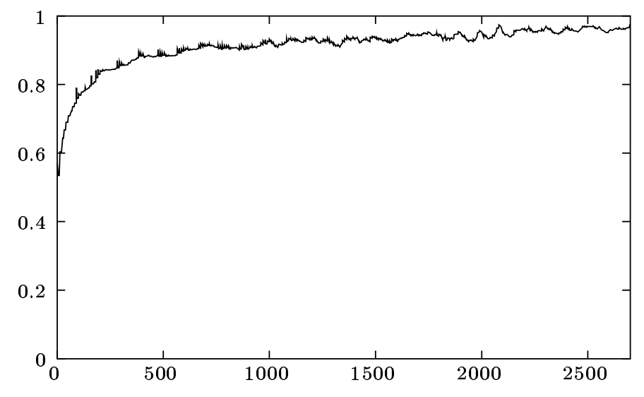	
根据正常运行时间延长在线一小时的可能性。 

- x 轴表示分钟
- y 轴显示了至少在线停留了x分钟的节点，也在线至少停留了x + 60分钟的节点所占的比例。

### 延迟
分散存储系统可以潜在地利用大量的并行机会。 其中一些机会包括增加的传输速率，处理能力和整体吞吐量，即使单个网络链接速度较慢时也是如此。 但是，并行性本身不能改善延迟。 如果将单个网络链接用作操作的一部分，则其等待时间将是整个操作的下限。 因此，任何用于高性能应用程序的分布式系统都必须持续且积极地针对低延迟进行优化，不仅要在单个过程规模上，而且还要在系统的整个体系结构上。

### 带宽
全球带宽可用性逐年增加。不幸的是，在世界范围内，对高带宽 Internet 连接的访问​​分布不均。尽管某些用户可以轻松访问对称，高速，无限制带宽的连接，但其他用户则很难获得相同类型的访问。

在美国和其他国家/地区，许多住宅互联网服务提供商（ISP）的运行方式给分散网络协议的设计人员带来了两个特殊挑战。

- 第一个挑战是许多ISP提供的不对称Internet连接。客户根据广告下载的速度订阅Internet服务，但是上传速度可能会慢一个数量级或两个数量级。
- 第二个挑战是带宽有时会被ISP每月“固定”固定的允许流量。例如，在美国许多市场中，ISP Comcast规定了每月1 TB的带宽上限，并为超过此限制的客户设置了上限[10]。即使ISP公布的速度为 10 MB/s或更高，但每月上限为 1TB 的 Internet 连接在一个月内平均不能超过 385KB/s，而不会超出每月的带宽限额。这样的上限在任何给定时刻都会对网络可用带宽施加重大限制。

在保证设备故障和抖动的情况下，任何分散式系统都将具有相应的维修流量。结果，重要的是不仅要考虑数据存储和检索所需的带宽，还要考虑数据维护和修复所需要的带宽[9]。设计一个不关心带宽使用情况的存储系统，不仅会给存储节点运营商带来过多的优先权，使其可以访问无限的高速带宽，而且还会在某种程度上将系统集中化。为了使存储系统尽可能分散，并在尽可能多的环境中工作，必须积极减少带宽使用。

### 对象大小
可以根据平均对象大小将大型存储系统大致分为两类。为了区分这两个组，

- 将“大”文件分类为几兆字节或更大。
- 数据库是用于存储许多小信息的首选解决方案

而对象存储或文件系统是存储许多大文件的理想选择。

Storj Labs 提供的初始产品主要用于大型文件的分散对象存储。尽管将来的改进可能会启用类似数据库的用例，但对象存储是本文所述的主要初始用例。我们在假设大多数存储对象将为4MB或更大的前提下做出协议设计决策。虽然支持较小的文件，但它们的存储成本可能更高。

值得注意的是，这不会对需要读取很多小于兆字节文件的用例产生负面影响。用户可以通过将许多小文件聚合并存储为一个大文件来采用打包策略来解决此问题。该协议支持搜索和流传输，这将允许用户下载小型文件，而无需完全检索聚合的对象。

### 拜占庭容错
与像 Amazon S3 这样的集中式解决方案不同，Storj 在不受信任的环境中运行，在该环境中不一定要假设单个存储提供商是可信赖的。 Storj 通过公共互联网运营，任何人都可以注册成为存储提供商。

我们采用拜占庭式，无私，理性（BAR）模型[11]来讨论网络中的参与者。

- 拜占庭节点(`Byzantine nodes`)可能出于任何原因任意偏离建议的协议。一些示例包括损坏的节点或正在积极尝试破坏协议的节点。通常，拜占庭节点是一个不好的角色，或者是一个针对实用程序功能进行优化的角色，该实用程序功能与为建议的协议提供的功能无关。
- 除了不可避免的硬件故障外，无私的节点(`Altruistic nodes`)是好的参与者，即使合理的选择是偏离，它们也可以参与提议的协议。
- 理性节点(`Rational nodes`)是中立的行为者，只有在符合其最终的最大利益时才参与或偏离。

一些分布式存储系统

- 例如，基于数据中心的云对象存储系统）在所有节点都被认为是无私的环境中运行。
- 例如，由于没有硬件故障或安全漏洞，Amazon 的存储节点除了明确编程要执行的操作外不会做任何事情，因为 Amazon 拥有并运行所有这些存储节点。

相反，Storj 在每个节点都由其自己的独立运营商管理的环境中运行。在这种环境下可以预期大多数存储节点都是有理性的，拜占庭式占少数，而 Storj 不假定任何无私性节点。

我们必须包括鼓励网络的激励措施，以确保网络上的理性节点（大多数运营商）的行为与无私性节点的预期行为尽可能相似。同样，拜占庭行为的影响必须最小化或消除。

请注意，在面对拜占庭行为的情况下创建一个健壮的系统不需要拜占庭容错共识协议，我们就避免了拜占庭共识。

### 避免协作(Coordination)
越来越多的分布式数据库研究表明，与子组件被迫协作以达到正确性的系统相比，尽可能避免协作的系统的吞吐量要好得多[12-19]。使用 Bailis 等人的非正式定义，即协作是并发执行操作同步通信或为了完成而停顿的要求[16]。这种观察发生在各个方面，不仅适用于分布式网络，而且适用于在同一计算机内协作的并发执行线程。一旦需要协作，系统中的参与者将需要等待其他参与者，而由于协作的问题是这种等待可能会产生巨大的成本。

虽然网络中的许多类型的操作可能需要协作（例如，要求线性化1 [15，20，21]的操作），但是选择避免协作的策略（例如高可用性事务[15]）可以使性能提高2倍。而在广域网上提高三个数量级。实际上，通过尽可能地避免协作，Anna database [17]在相应的环境中可以比 Cassandra 和 Redis 快10倍，并且比以性能为中心的内存数据库（例如Masstree 或 Intel 的TBB [22]）要快 700 到 800 倍 。并不是所有的协作都是可以避免的，但是新的框架（例如不变融合[16]或CALM原理[18，19]）使系统架构师可以理解何时需要协作才能确保一致性和正确性。正如 anna db 上的成功所证明的那样，最有效的方法是尽可能避免协作。

最小化协作的系统在从小型工作负载到大型工作负载的扩展方面要好得多。 向避免协作的系统添加更多资源将直接提高吞吐量和性能。 但是，将更多资源添加到依赖于协作的系统（例如比特币等）将不会导致大量额外的吞吐量或整体性能。

为了达到 EB 级，将热路径协作域限制在每个用户完全可控制的小范围内是一个基本要求，最小化协作是我们策略的关键组成部分之一。 而这个策略限制了使用类似区块链的解决方案在我们的用例中。 而出人意料的是，许多分散式存储平台都在为需要大量协作的架构而努力，其中大多数操作必须由单个全球分类帐(区块链)来解决。
## 框架
在考虑了我们的设计约束之后，本章概述了仅由最基本的组件组成的框架的设计。 该框架描述了满足我们的约束所必须存在的所有组件。 只要设计约束条件保持不变，那么这个框架将尽可能切实地描述 Storj 现在和未来十年。 尽管框架内会有一些设计自由度，但此框架将完全避免将来对体系结构的需求，因为可以在不影响其他组件的情况下更换独立的组件。
### 框架概述
框架内的所有设计都将执行以下操作：

- 存储数据

	当数据存储在网络中时，客户端会加密并将其分解为多个部分。这些片段分布到整个网络的对等点、生成元数据，其中包含有关在何处再次查找数据的信息。
- 检索数据

	从网络中检索数据时，客户端将首先引用元数据以标识先前存储的片段的位置。然后，将取回这些碎片，并将原始数据重新组装到客户的本地计算机上。
- 维护数据

	当冗余量降至某个阈值以下时，将重新生成并替换丢失的数据所需的数据。
- 付费使用

	应该发送价值单位以换取所提供的服务。

为了提高可理解性，我们将设计分解为八个独立组件的集合，然后将它们组合以形成所需的框架。各个组件是：

1. 存储节点

	存储节点的作用是存储和返回数据。 除了可靠地存储数据外，节点还应提供网络带宽和适当的响应能力。 可以根据条件需要选择存储节点：
	
	- 查验时间
	- 延迟
	- 吞吐量
	- 带宽上限
	- 足够的磁盘空间
	- 地理位置
	- 正常运行时间
	- 对审查进行准确响应的历史记录等 

	作为对服务的回报，节点将被支付费用。由于通过更改协议外部的变量来选择存储节点，因此在我们的框架中，节点选择是一个明确的，不确定的过程。 这意味着必须通过少量的元数据来跟踪每次上传选择的节点。 我们无法像 Dynamo [25] 这样的系统选择用于隐式或确定性地存储数据的节点。 与 GFS [26]，HDFS [27]或Lustre [28] 一样，此决定意味着需要元数据存储系统来跟踪选定的节点（请参阅第3.5节）。
2. 点对点通信和发现

	网络上的所有对等方均通过标准协议进行通信。框架要求该协议：

	- 即使在可能的情况下面对防火墙和NAT，也可以提供同级可达性。这可能需要诸如 STUN [29]，UPnP [30]，NAT-PMP [31]等隧道穿透技术。
	- 提供与 S/Kademlia [32] 中相同的身份验证，其中每个参与者都以密码方式证明与之交谈的对等方的身份，以避免中间人攻击。
	- 提供完整的隐私。在带宽测量之类的情况下（请参阅“4.17），客户端和存储节点必须能够进行通信，而不会遭受任何窃听者的风险。该协议应确保默认情况下所有通信都是私有的。

	此外，该框架还要求一种通过唯一标识符查找对等网络地址的方法，以便在给定对等方的唯一标识符的情况下，任何其他对等方都可以连接到该网络。此职责类似于互联网的标准域名系统（DNS）[33]，后者是将标识符映射到临时连接地址的映射，但是与DNS不同，它无法进行集中式注册。为此，可以在选择的对等通信协议的基础上构建网络覆盖，例如 Chord [34]，Pastry [35]或Kademlia [8]。有关实现的详细信息，请参见第4.6节。
3. 冗余

	我们假设在任何时候，任何存储节点都可以永久存在。即使任何给定数量的单个节点可能处于正常状态，我们的冗余策略也必须以​​一种高概率访问数据的方式来存储数据。为了达到特定的耐用性（定义为面对故障时数据仍然可用的可能性），该领域中的许多产品都使用简单的复制。不幸的是，这将耐久性与网络扩展因子联系在一起，网络扩展因子是可靠存储数据的存储开销。相对于存储的数据来说这显着增加了总成本。

	例如，某个所需的耐久性水平需要一种复制策略，该策略可以复制八份数据。这将产生8倍的膨胀系数，即800％。然后，需要在此过程中使用带宽将这些数据存储在网络上。因此，更多的复制会导致固定数量的数据占用更多带宽。如协议设计约束（第2.7节）和 Blake等人所述。 [9]，高带宽使用会阻止扩展，因此这是确保高度文件耐久性的不受欢迎策略。

	作为简单复制的替代方法，纠删码提(EC)供了一种更有效的方法来实现冗余。EC 在分布式存储和点对点存储系统中都得到了很好的使用[36-42]。EC 是一种用于处理数据耐久性而不将其与带宽使用联系在一起的编码方案，并且发现它可以大大提高复制的修复效率[9]。重要的是，它们允许在不改变膨胀系数的情况下改变耐用性。

	EC 通常用两个数字 k 和 n 来描述。如果使用（k，n）EC 对数据块进行编码，则总共将生成 n 个纠删份额，其中仅需要其中 k 个即可恢复原始数据块。如果数据块为 s 字节则 n 个纠删份额中的每一个大约为 s/k 字节。除了 k=1（复制）时，所有纠删份额都是唯一的。有趣的是，即使扩展因子（2x）相同，（k = 20，n = 40）EC 的耐久性也要优于（k = 10，n = 20）EC。这是因为在（k = 20，n = 40）情况下，风险分散在更多节点上。这些考虑因素使 EC 成为我们总体框架的重要组成部分。

	为了更好地理解 EC 如何在不增加扩展因子的情况下增加耐用性，下表显示了k和n的各种选择，以及扩展因子和相关的耐用性：
	
	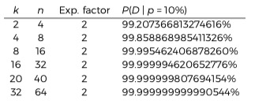
	
	相反，对于相同的耐久性，复制需要显着更高的膨胀系数。 下表显示了复制方案的耐久性：
	
	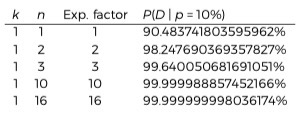

	为了查看这些表格的计算方式，我们从简化的假设开始，假设 p 是每月节点流失率（即平均一个月内将成为完整节点的比例）。 在数学上，根据泊松分布对时间相关的过程进行建模，其中假设在给定的时间单位内观察到 λ 事件。 结果，我们将耐久性建模为泊松分布的累积分布函数（CDF），平均值为 λ= pn，我们预计 λ 个文件每月都会丢失。 为了评估耐用性，我们考虑 CDF 最高为 nk，以查看一个月内最多 n-k 个文件丢失并且仍然可以重建文件的可能性。 CDF由下式给出：
	
	
	
	下表显示了膨胀系数在耐久性方面的重要作用：
	
	
	
	通过能够独立于扩展因子来调整耐久性，EC 允许以惊人的低扩展因子实现非常高的耐久性。 由于带宽是一种有限的资源，因此完全避免将复制作为一种策略，而仅将 EC 用于冗余会导致带宽占用量的急剧减少。

	EC 还导致存储节点获得更多报酬。 高扩展因子稀释了更多存储节点上每字节的收入。 因此，低扩展因子（例如 EC 提供的扩展因子）允许将收入直接更直接地传递给存储节点运营商。
	
	- EC 对流媒体的影响

		EC 用于许多流式传输上下文中，例如音频CD和卫星通信[38]，通常使用 EC 并不能满足我们对流式传输的设计要求（Amazon S3兼容性要求，请参阅第2.4节）。无论为 CD 选择哪种 EC ，对于框架都可以通过一次编码一小部分而将流添加到顶部，而不是尝试一次编码全部文件。有关更多详细信息，请参见第4.8节。 
	- 长尾响应擦除码效果

		EC 可带来巨大的性能收益，这是避免等待“长尾”响应时间的能力[43]。如果由于不可预测因素的影响，所需服务器的运行时间异常缓慢，就会出现长尾响应。长尾响应之所以这么称呼，是因为它们的平均发生率极少，但具有高度可变的性质，在概率密度图中，它看起来像“长尾巴”。总的来说，长尾响应是分布式系统设计中的一个大问题。

		在 MapReduce 中，长尾响应被称为“散乱者(stragglers)”。 MapReduce 执行称为“备份任务”的冗余请求，以确保如果特定散乱者花费的时间太长，整个操作仍可以继续进行而无需等待。如果在 MapReduce 中禁用了备份任务机制，则即使备份任务机制导致重复的工作，基本操作也可能花费 44％ 的时间才能完成[44]。

		通过使用 EC 可以创建类似于 MapReduce 的存储备份任务[39,40]。
		
		- 对于上传

			将文件编码为比所需耐久性保证更高比。在上载期间，在上载足够多的片段以获取所需的冗余之后，可以取消其余的其他上载。此取消允许上载以与集合中最快的节点一样快的速度继续，而不是等待最慢的节点。
		- 对于下载

			下载也得到了类似的改进。由于存在比所需更多的冗余，因此可以从最快的对等方提供下载服务，从而避免了等待暂时慢速或正常的对等方。

		结果是，参与任何给定事务的最快节点可以满足每个请求，而无需等待较慢的子集。专注于结果仅取决于随机子种群的最快节点的操作，这可能将潜在的责任（各个参与者的性能变化很大）变成了分布式存储网络的强大力量，同时仍提供了出色的负载平衡特征。

		对文件进行过度编码的能力极大地帮助了网络上流行内容的动态负载平衡。请参阅第6.1节，以获取有关我们计划如何解决非常活跃的文件的负载平衡的讨论。
		
		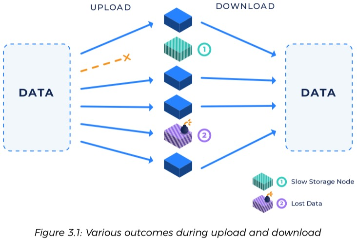
4. 元数据

	一旦用 EC 将对象分割并选择要在其中存储节点存储新片段就需要跟踪选择的存储节点。系统允许用户根据不同情况(地理位置，性能特征，可用空间等)选择存储。因此，必须使用显式节点选择方案，例如基于目录的查找[45]，而不是像使用 Dynamo [25] 那样使用一致性哈希这种隐式节点选择。此外，为了维持 S3 的兼容性，用户必须能够选择一个通常被视为路径的任意密钥以识别数据到节点的映射。这些功能暗示了元数据存储系统的必要性。

	S3 的兼容性再次提出了一些严格的要求。应该支持：
	
	- 分层对象（带有前缀的路径)
	- 每个对象的键/值存储
	- 任意大的文件
	- 任意数量的文件
	- 等等

	对象应该能够通过任意键进行存储和检索；此外，将需要对这些键进行确定性迭代以允许分页列出。每次添加、编辑或删除对象时，都需要调整此元数据存储系统中的一个或多个条目。结果，该元数据系统可能会大量流失，并且在整个用户群中，元数据本身最终可能会变大。

	例如，网络在几年内存储了一个总 EB 的数据，其中平均对象大小为 50MB，并且我们选择的 EC 为 n=40。50MB 对象的 1 EB 为 200 亿个对象。该元数据系统将需要跟踪为每个对象选择了哪个 40 个节点。如果每个元数据元素大约为 `40*64+192` 字节（每个选定节点的信息以及路径和一些常规开销），则需要跟踪超过55 TB 的元数据。

	幸运的是，用户可以对元数据进行大量分区。存储 100 TB 50兆对象的用户只会产生 5.5 GB 的元数据开销。值得指出的是，这些数字随对象大小的不同而有很大差异：平均对象大小越大，元数据开销就越少。

	框架的另一个重点是使该组件（元数据存储）可以互换。具体来说，希望该平台能够整合元数据存储的多种实现方式，并允许用户在其中进行选择。这极大地帮助了实现避免用户之间协调的设计目标（请参阅第2.10节）。

	除了规模要求之外，要实现 S3 兼容性，所需的 API 也是简单明了的：
	
	- 放置（将元数据存储在给定路径中）
	- 获取（在给定路径中检索元数据）
	- 列表（对现有路径进行分页，确定性列表） 
	- 然后删除（删除路径）
5. 加密

	无论存储系统如何，我们的设计约束都要求完全的安全性和私密性。所有数据或元数据将被加密。必须在数据存储管道中尽早对数据进行加密，最好是在数据离开源计算机之前对其进行加密。这意味着，与用户应用程序位于同一台计算机上的 S3 兼容客户端库应同时运行。

	加密应使用可插拔机制，该机制允许用户选择所需的加密方案。它还应存储有关该加密方案的元数据，以允许用户在更改、升级其加密选择时，使用适当的解密机制来恢复其数据。

	为了支持丰富的访问管理功能，不应对每个文件使用相同的加密密钥，因为访问一个文件将导致所有文件都访问解密密钥。相反，每个文件都应该使用唯一的密钥进行加密。这应该允许用户共享对某些选定文件的访问权限，而不必为其他文件放弃加密详细信息。

	因为应该使用不同的密钥和可能不同的算法对每个文件进行不同的加密，所以关于加密的元数据必须以安全可靠的方式存储在某处。该元数据以及有关文件的其他元数据（包括其路径）将存储在先前讨论的元数据存储系统中，并通过确定性的分层加密方案进行加密。基于 BIP32 [46] 的分层加密方案将允许在不共享其父节点的情况下共享子树，并且将允许在不共享其他文件的情况下共享某些文件。有关我们基于路径的分层确定性加密方案的讨论，请参见第4.11节。
6. 审查和声誉

	激励存储节点准确存储数据对于整个系统的生存至关重要。能够验证和验证存储节点是否正确存储了他们要求存储的内容,则是重中之重

	许多存储系统使用概率性文件审查（称为可恢复性证明）来确定何时以及在何处修复文件[47，48]。我们正在扩展常见的基于文件的可检索性的概率性质，使其涵盖特定节点存储的所有可能文件。在这种情况下审查是一个概率性挑战，挑战具有高度的确定性和较低的开销，存储挑战确保了存储节点的行为规范，保留了其声明的数据并且不易受到硬件故障或故障的影响。审查充当“现场检查” [49]，以帮助计算给定存储节点的未来用处。

	在我们的存储系统中，审查只是一种用于确定节点的稳定性的机制。审查失败将导致存储节点被标记为不良，这将导致数据会重新分配给新节点，并在将来屏蔽该节点。存储节点的正常运行时间和整体运行状况是用于确定哪些文件需要维修的主要指标。

	就像可恢复性证据[47，48]一样，这种审查机制并不审查所有文件中的所有字节。这可能会留出误报的余地，验证者会认为存储节点在实际修改或部分删除数据后会，依然保留完整的数据。幸运的是，对单个部分审查的误报概率很容易计算（请参见第7.2节）。当整体上迭代地应用于存储节点时，对丢失或更改的数据的检测将确定在已知且可修改的错误阈值之内。

	需要信誉系统来保留给定节点身份的审查结果的历史记录。总体框架对使用这种系统有严格的要求，但请参见第4.15节，以讨论我们的初始方法。
7. 数据修复

	在任何分布式存储系统中，数据丢失都是一个永远存在的风险。尽管有很多潜在的文件丢失原因，但与其他原因相比，存储节点波动（存储节点加入和离开网络）是最大的最大风险。如2.5节所述，在许多实际系统中，网络会话时间从数小时到数分钟不等[7]。尽管还有许多其他方式可能会丢失数据，例如损坏，恶意行为，不良硬件，软件错误或用户启动的空间回收，但这些问题并不像完整节点波动那样严重。我们预计节点流失是我们网络中数据丢失的主要原因。

	因为审查正在验证是否合格的节点正确存储了数据，所以剩下的一切就是检测存储节点何时停止正确存储数据或恢复正常运行，然后将其必须的数据修复到新节点。为了修复数据，我们将通过 EC 重构从剩余的数据块中恢复原始数据，然后重新生成丢失的数据块，并将其存储回网络中的新存储节点上。

	系统中至关重要的是激励存储节点参与者保持在线状态的时间。为了鼓励这种行为，支付策略将涉及奖励存储节点运营商，使他们的节点每次参与数月和数年。
8. 付款

	分散网络中的付款，价值归因和计费是维持健康的供需生态系统的关键部分。当然，去中心化支付系统仍在许多方面处于起步阶段。

	为了使我们的框架实现低延迟和高吞吐量，我们不得对区块链具有交易依赖性（请参阅第2.10节）。这意味着性能足够的存储系统无法等待区块链操作。当应该以毫秒为单位来衡量操作时，等待节点集群概率性地达成共享全局分类帐的协议并不是一件容易的事。

	相反，我们的框架着重于博弈论模型，以确保网络中的参与者被适当激励以留在网络中，并表现得合理以获取报酬。我们的许多决策都是根据现实世界的财务关系建模的。付款将在后台结算过程中进行转移，在该过程中，网络内行为良好的参与者将进行合作。在我们的框架中，存储节点应将其暴露于不受信任的付款方，直到人们确信这些付款方可能会为所提供的服务付款。

	此外，该框架还跟踪并汇总拥有网络上存储的数据的人的服务使用价值。通过收取使用费，该框架能够支持存储市场生态系统的端到端经济。

	尽管 Storj 网络与支付无关，并且该协议不需要特定的支付类型，但该网络将基于以太坊的 STORJ 令牌作为默认的支付机制。虽然我们打算将 STORJ 令牌作为主要付款方式，但将来可能会采用其他替代付款方式，包括比特币，以太币，信用卡或借记卡，ACH 转移，甚至是活山羊的实物转移，哈哈哈。

## 具体实施	
我们认为，鉴于我们的设计约束，我们描述的框架相对来说是基础性的。 但是，在框架内，仍然可以自由选择如何实现每个组件。

在本节中，我们列出了最初的实施策略。 我们希望本节中包含的详细信息会随着时间的推移而逐渐变化。 但是，我们认为这里概述的细节是可行的，并支持我们的框架的有效实施，该框架能够提供高度安全，高性能和持久的生产级云存储。

与先前的版本[37]一样，我们将通过Storj改进提案过程[50]发布对此具体架构的更改。
### 定义
在下面的具体实现的描述中，使用以下定义的术语：

- 角色
	- 客户端

		将从网络上载或下载数据的用户或应用程序
	- P22 对等网络

		服务和职责的内聚性集合。代表网络中服务的三个对等类分别为：
		
		- 存储节点
		- 卫星
		- 上行链路
	- 存储节点

		将参与节点的发现系统，为其他类节点存储数据，并为存储和带宽收费。
	- 上行链路

		表示实现 libuplink 并希望存储和或检索数据的任何应用程序或服务。此类同级类预计不会像其他两个类那样保持在线状态，并且相对较轻。它将执行加密、EC、并与其他对等类进行协调。
		
		- libuplink(SDK)

			一个库，提供所有必需的功能以直接与存储节点和卫星节点交互。该库将以多种不同的编程语言提供。
		- 网关(API)

			一项服务，提供其他对象存储服务（例如S3）和 libuplink 之间的兼容性层，并公开 S3 兼容的API。
		- Uplink CLI

			命令行界面，用于上载、下载文件，管理权限和共享以及管理帐户
	- 卫星

		参与节点是发现系统，提供
		
		- 缓存节点地址信息
		- 存储每个对象的元数据
		- 维护存储节点信誉
		- 汇总账单数据
		- 支付存储节点费用
		- 执行审查和维修
		- 管理授权和用户帐户

		用户在特定的卫星上拥有帐户并信任它们。 任何用户都可以运行自己的卫星，但是我们希望许多用户选择避免操作的复杂性，并在受信任的第三方（例如Storj Labs，朋友，团体或工作场所）托管的另一个卫星上创建帐户。
		
		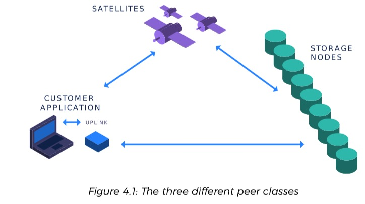
- 数据

	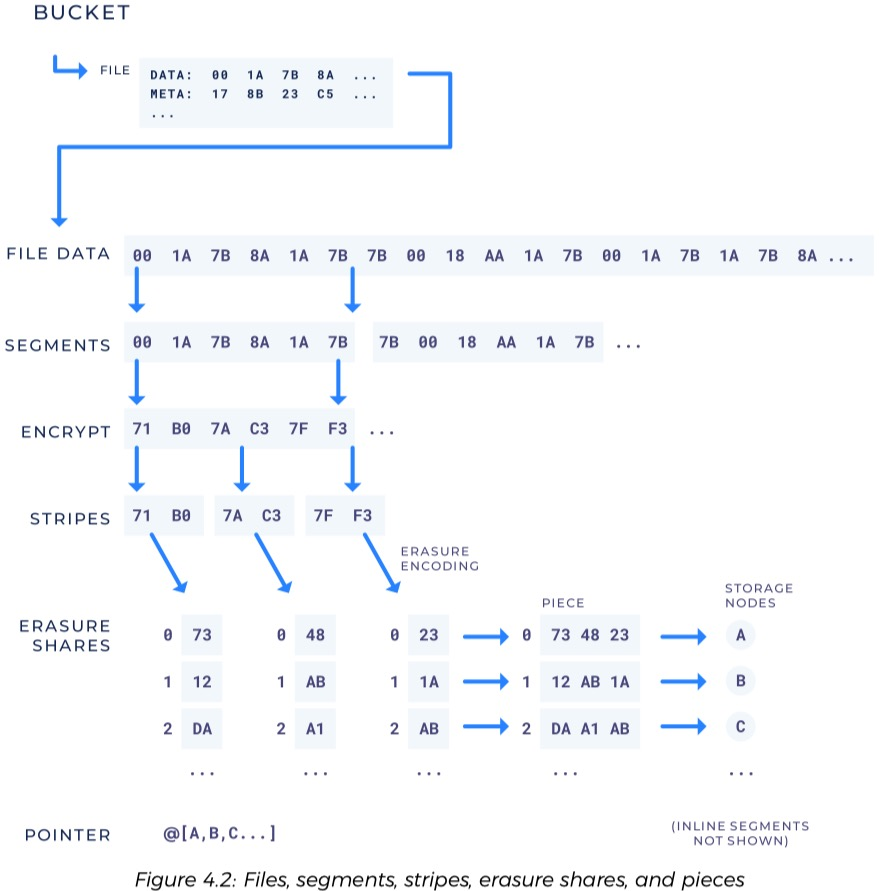	
	
	- 桶(Bucket)
	
		S3 中桶是通过路径标识的方法创建文件命名的边界集合。每个文件在存储桶中都有唯一的路径。
	- 路径(Path)

		路径是存储桶中文件的唯一标识符。路径是任意字节串。路径在访问控制边界处包含正斜杠。正斜杠（称为路径分隔符）分隔路径组件。示例路径  `video/carlsagan/gloriousdawn.mp4`，其中路径是 video，carlsagan 和 gloriousdawn.mp4。
		
		除非另有要求，否则在路径离开客户应用程序的计算机之前对其进行加密。
	- 文件或对象(File or Object)
		
		文件（或对象）是系统中的主要数据类型。文件由路径引用，包含任意数量的字节，并没有最小或最大大小。文件可以用一个或多个数据分片的有序集合表示。数据分片具有固定的最大大小。文件还支持用户定义的数量有限的键/值字段(标签)，称为扩展属性。像路径一样，文件中包含的数据在离开客户端计算机之前就已加密。
	- 扩展属性(Extended attribute)

		扩展属性是与文件关联的用户定义的键/值字段(标签)。像其他文件元数据一样，扩展属性也以加密方式存储。
	- 数据分片(Segment)

		数据分片代表单个字节数组，介于0和用户可配置的最大段大小之间。一个文件可能被切割成多个有序的数据分片。有关更多详细信息，请参见第4.8.2节。
	- 远程数据分片 (Remote Segment)

		远程数据分片是网络上分散的 EC 数据。远程数据分片大于所需的元数据，因为包含存储了其他信息，如网络位置信息:存储数据的节点的 ID 之类的信息。
	- 内联数据分片(Inline Segment)

		内联数据分片是一个足够小的数据分片，它表示的数据比远程数据分片规定所需的数据大小要小。需要跟踪那些节点具有相应的数据。这种情况下数据存储在 “内联” 的卫星上，而不是存储在节点上。
	- 条带(stripe)
		
		条带是数据分片的进一步细分。 条带是固定数量的字节，用作为加密和 EC 的大小边界。 EC 分别在条带上进行，而加密一次可以在条带的一小部分上进行。 所有数据分片均已加密，但只有远程数据分片会擦除条带。 条带是执行审查的单位。 有关更多详细信息，请参见第4.8.3节。
	- EC 片段(Erasure Share )

		当对条带进行 EC 时，它将生成多个片段，称为 EC 片段。 只需要一部分 EC 片段即可恢复原始条带。 每个 EC 片段都有一个索引来标识它是哪个 EC 片段（例如，第一个，第二个等）。
	- 片(Piece)

		当一个远程数据分片的条带被 EC 为片段时，具有相同索引的 EC 片段被串联在一起，并将该串联的 EC 片段组被称为一块。 如果 EC 条带后有 n 个 EC 片段，则在处理远程数据分片后有 n 个片。 第 i 个片是该文件中所有的 i 索引 EC 片段的串联。 有关更多详细信息，请参见第4.8.5节。
	- 指针(pointer)
	
		指针是一种数据结构，它包含内联数据分片或者跟踪远程数据分片存储在哪个存储节点上以及其他文件的元数据。
		
### P2P 网络 peer 类
总体策略是从先前的版本[37]扩展而来的，并且大量镜像了分布式存储系统，例如 Google File System [26]（以及其他类似GFS的系统[27,51,52]）和 Lustre 分布式文件系统[28]。 ]。在每种情况下，网络中都有三个主要参与者：

- 元数据服务器

	元数据服务器跟踪每个对象的元数据以及对象在对象存储服务器上的位置。
- 对象存储服务器

	对象存储服务器保存系统中存储的大量数据。
- 客户端

	客户端通过与元数据服务器和对象存储服务器进行通信，可以提供一致的视图并轻松访问文件。

Lustre 的架构已被证明具有高性能。最快的前100名超级计算机中的大多数都使用 Luster 提供高性能、可扩展的存储[28]。虽然我们不期望在广域网上实现相同的性能，但希望性能比其他体系结构好。在性能方面遇到的任何限制（如果有的话）都将归因于总体架构之外的因素。

以前的版本为每个组件使用不同的名称，现在简称为存储节点。以前集中的单个 Bridge 实例现在可以由任何人运行，被称为卫星。我们的 libstorj 库将在可能的情况下向后兼容，但现在将客户端软件称为上行链路。

### 储存节点
存储节点的主要职责是可靠地存储和返回数据。节点运营商是个人或实体，它们具有过多的硬盘驱动器空间，并希望通过将其空间租给他人来赚取收入。这些运营商将在本地下载，安装和配置 Storj 软件，而无需任何地方的帐户。 然后，它们将配置磁盘空间和每个卫星的带宽余量。在节点发现期间，存储节点将公布可用的带宽和硬盘空间以及它们指定的 STORJ 令牌钱包地址。

为了简化临时文件的生命周期管理，存储节点还跟踪每个可选的“生存时间”或 TTL 名称。可能会以特定的 TTL 到期时间存储段，预期在到期日期之后删除数据。如果未提供 TTL，则预期将无限期的存储数据。这意味着存储节点必须具有到期时间数据库，并且必须定期清除旧数据。

存储节点还必须跟踪已签名的带宽分配（请参阅第4.17节），以发送给卫星便以后进行结算和付款。这也需要一个小的数据库。 TTL和带宽分配都存储在 SQLite [53]数据库中。

存储节点可以选择与哪个卫星一起工作。如果它们与多个卫星配合使用（默认行为），则付款可能来自多个来源，且时间表不同。存储节点由特定的卫星支付费用，用于

- 以出口带宽支付的形式请求时返回数据
- 存储静态数据

期望存储节点存储和发送它们的所有数据，并假定它们忠实存储所有数据的情况下向存储节点付款。未通过随机审查的存储节点将被从池中删除，可能会丢失托管资金以支付额外费用，并且收到的款项仅限于将来没有付款。初次传输要存储的数据（入口带宽）无需支付存储节点的费用。这是为了阻止存储节点删除数据，而只是为了支付更多的存储空间而付费，这在我们以前的版本中是一个问题[37]。在为存储节点支付出口带宽使用费时，某些卫星可能会选择支付比正常的检索出口带宽使用率低的费用。不为存储节点的发现或任何其他维护流量付费。

存储节点将支持三种方法：

- get

	put操作检索字节的任何范围
- put

	put 操作将获取字节流和可选的 TTL，并存储字节，以便可以通过 get 操作再次检索字节的任何范围
- del

	直到 TTL 过期（如果提供了 TTL）或直到收到删除操作（以先到者为准），获取操作都将一直有效

每种方法都拥有分片ID、卫星ID，关联的卫星实例的签名以及带宽分配（请参阅第4.17节）。卫星 ID 形成独立的命名空间。具有不同卫星 ID 的相同件 ID 数据是不同的。

存储节点将允许管理员配置最近30天内允许的最大磁盘空间和每个卫星的带宽使用情况。 节点将根据这2个余额设置来适当拒绝卫星的没有有效签名的操作。

### 授权
存储节点、卫星和上行链路(客户端)均会生成自己的身份和证书以供在网络中使用。 节点 ID 用于节点发现和路由。每个节点将运行其自己的证书，该证书签发需要一个公钥/私钥对和一个自签证书。 理想情况下，证书签名的私钥应保存在冷存储中防止泄露。 私钥需要用户妥善保管，因为证书签名密钥的更换将需要全新的节点 ID，也就是之前的信誉累计无效。

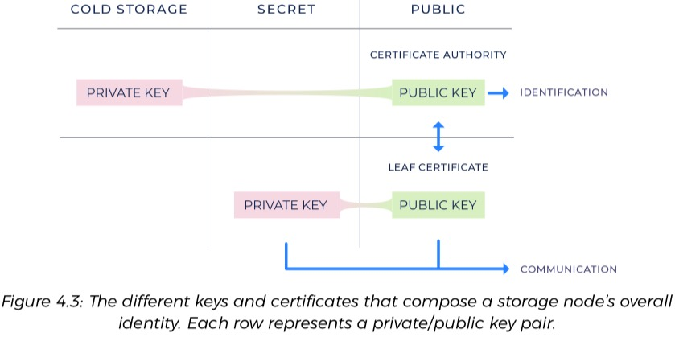

节点证书签名的公钥是节点 ID。像在S/Kademlia [32]中一样，节点 ID 将是公钥的哈希，并将用作加入网络的工作证明。与比特币的工作量证明[23]不同，工作量证明将取决于哈希输出中可以找到多少个尾随零位。这意味着节点 ID（可能以尾随零位结尾）将在平衡的 Kademlia [8] 树中仍然可用。这笔费用意味着使 Sybil 攻击非常昂贵和耗时。

每个节点将具有一个可撤销的叶子证书和密钥对，并由该节点的私钥签名。节点使用叶子密钥对进行通信。每个叶子都有一个签名的时间戳，卫星会跟踪每个节点。如果叶子受到威胁，则节点可以发出带有更高时间戳的新叶子。有兴趣的节点会记下新叶子时间戳，并拒绝来自具有较旧叶子证书的节点的连接。作为一种优化的特殊情况，当叶证书和证书颁发机构共享相同的时间戳时，对等方将无需记录。		 	
		
### P2P 通信
最初在µ TP [56]传输协议之上建立的传输层安全协议（TLS）[55]，在传输层安全协议之上使用的 gRPC [54] 协议，并添加了用于 NAT（STUN）功能的会话遍历实用程序[29] 。 

- µTP具有 LEDBAT [57] 功能，可提供可靠的有序交付(如TCP);
- TLS 提供隐私和身份验证； 
- gRPC 提供了多路复用和便利的编程器界面;
- LEDBAT 使互联网流量具有较高的 Qos 优先级，从而为家庭运营商提供了更优雅的用户体验，同时减少了网络使用干扰。
- STUN 提供 NAT 遍历，NAT 穿透； 	 	

未来将使用考虑更加灵活的安全传输框架（例如，Noise 协议框架[58]）来代替TLS，以减少在数据已被加密且不需要前向保密的情况下由于连接握手而导致的往返行程。

当使用诸如 TLS 或 Noise 之类的经过身份验证的通信时，每个对等方都可以通过验证证书链并计算对等方的公钥来确定节点的 ID的合法性。然后可以通过考虑 ID 末尾的零位末尾的数目来估计构建节点 ID 所需的工作量。卫星可以配置通过审查所需的最低工作量证明（第4.13节），这样，随着时间的流逝，由于用户的自然干预，网络将需要更大的工作量证明。

对于少数无法通过 NAT 或防火墙成功连接的情况（通过STUN [29]，uPnP [30]，NATPmP [31]或类似技术），将需要人工干预和端口转发。将来，无法通过防火墙创建连接的节点可能依赖于来自其他可用节点的流量代理，这需要付费。节点还可以为其他节点提供协助，以进行初始 STUN 设置，公共地址验证等。

### 节点之间的发现
有了存储节点并且知道它们的地址，就可以识别它们并与之通信。我们必须考虑到这样一个事实，即存储节点通常位于消费者 Internet 连接上，并且位于 IP 地址不断变化的路由器之后。因此，节点发现系统的目标是提供一种通过节点 ID 查找节点最新地址的方法，这有点类似于 DNS 为公共互联网提供的角色。

-  Kademlia 分布式哈希表（DHT）
	
	节点发现系统的目标是提供一种通过节点 ID 查找节点的方法，类似于 DNS，解决消费网络动态 IP 的问题。通过 Kademlia 分布式哈希表（DHT）是具有内置节点查找协议的键/值存储。 将 Kademlia 用作类似 DNS 的用于节点查找的功能的主要事实来源。通过在适当的地方使用 S/Kademlia [32] 扩展，来避免了许多其他已知的攻击，例如，

	- 基于所有者的密钥重新发布
	- 基于邻居的密钥重新发布
	- 值的存储和检索等等
- 缓存服务	
	
	Kademlia 之类的 DHT 需要多次网络往返来进行许多操作，这使其难以获得毫秒级的响应时间。为了解决这个问题，我们在 Kademlia 的基础上添加了基本的分散式缓存服务。
	
	- 缓存服务将独立存在于每个卫星中并尝试与网络中的每个存储节点持续进行通信，默认每小时一次
	- 然后，缓存服务将为每个节点缓存最后一个已知的正确地址，并驱逐一段时间后未与之通信的节点。
	- 无需扩展存储节点使用这些缓存服务即可。

	由于 ping 操作成本很低，我们希望此方法可以在合理的将来扩展，但是承认最终可能需要新的解决方案。幸运的是，空间需求可以忽略不计。例如，仅 5MB 内存就可以为 80k 个节点的网络缓存地址。

	假设有序的内存列表包含
	
	- 节点ID（256 bit/32个字节）
	- IP地址（对于IPv6为16个字节）
	- 端口（2个字节)
	- 时间戳（4个字节）
	
	那么 8w 个节点内存占用为
	
		80000*(32+16+2+4)≈4.12MB
	基于这种设计，不会期望每个卫星的缓存都是真实的主要来源，并且缓存中的结果可能是陈旧的。但由于我们采用了冗余存储策略，因此存储网络将能够抵御预期的节点波动和陈旧程度。因此，即使高速缓存中的某些查找失败或返回不正确的地址，系统也将很健壮。此外，由于对等通信系统已经提供了对等身份验证，因此有时会返回错误的或故意误导性的地址查找响应的节点发现缓存仅会导致性能下降，而不会导致正确性。

	尽管从属缓存无法作为精准查询的主要来源，但是由于修复（第4.14节）需要快速确定节点是是联机还是非联机，系统中的查询将以缓存查询为主并且不会尝试使用 Kademlia 进行其他查询。仅在审查请求失败的情况下，才进行回退在 Kademlia 中进行非并行查找以更正潜在的陈旧缓存信息。

	除了包含在每个卫星中，还计划托管并帮助设置一些众所周知的社区运行的节点发现缓存。如果节点最近在线，则这些缓存将执行快速返回给定节点 ID 的地址信息的职责。

	Kademlia 消息将使用对等通信协议（第4.5节），其中包括机密性和对等身份标识。 由于这需要加密设置，因此将尽可能缓存与 Kademlia 邻居和经常联系的连接。

	在 Kademlia 网络上共享每条消息后，存储节点将包括其可用磁盘空间、每卫星带宽可用性、STORJ 钱包地址以及网络所需的任何其他元数据。 节点发现将其缓存将收集节点提供的此信息，从而可以更快地对其进行查找。
	
### 缓解 Sybil 攻击
虽然我们采用了 S/Kademlia 提出的部分解决 Sybil 攻击的工作量证明方案，但我们仍将 Kademlia 扩展为具有特定于应用程序的集成，以进一步保护我们的网络

- 两个存储节点 A 和 B ，不允许未经审查存储节点 B 进入存储节点 A 的路由表
- 直到存储节点 B 可以显示来自卫星 C 的签名消息为止
- 存储节点 A 信任该消息， B 声称已通过了 C 信任的足够审查它（第4.13和4.15节）

这样可以确保只有具有经过验证的磁盘空间的节点才有机会参与路由层。允许输入路由表的节点被视为经过审查，并且仅在经过审查的节点上进行查找。为了确保仍然可以找到未经审查的节点
	
- 如果到所有未经审查的邻居的 XOR 距离不超过 k 个最近审查的邻居的最远距离，则经过审查的节点会保留其未经审查的邻居的不受限制的列表
- 未经审查的节点保持其 k 最近审查的节点为最新

### 冗余
使用 Reed-Solomon EC [59]，为了实现减少长尾效应的解决方案（请参阅第3.4.2节），我们为存储的每个对象选择4个数字，即k，m，o和n，标准的 Reed-Solomon 为k和n。使 k≤m≤o≤n。
	
- k

	重建所需的最小片段数
- n
	
	在创建过程中生成的片段总数
- m
	
	最小安全值，选择 m 值是为了使如果卫星注意到可用片段的数量已降至 m 以下，它将立即触发数据修复，以确保系统始终保持 k 或更多片段，保证数据耐用性
- o
	
	最佳值，为了实现的长尾性能改进，选择值 o 使得在上载和修复期间，一旦 o 件完成上载，将取消剩余的 n 件。此外，选择 o 使得存储 o 件即可达到所需的耐用性目标。如果选择 n 使得存储 n 件将具有过度的耐用性。
			
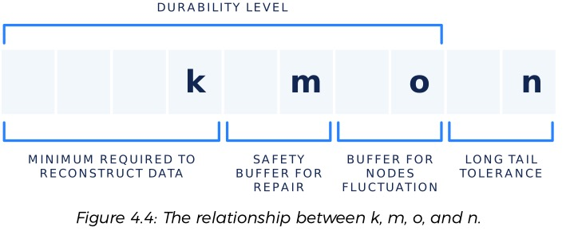

我们可以忍受的长尾上传数量为 n–o，因此可以不受其影响的慢节点数量。 在不触发修复的情况下可以同时临时进入的节点数为 o–m。 为了避免在我们认识到数据需要维修和实际维修之间的时间内丢失数据，安全间隔为 m–k。

有关如何选择 Reed-Solomon 数字的信息，请参见7.3节。 另请参阅第4.14节，以获取有关如何随着数据的耐用性随时间下降而修复数据的讨论。	
### 结构化文件存储
- 具有扩展属性的文件

	许多应用程序受益于能够将元数据保存在文件中。 S3支持“对象元数据” [60]来满足这一需求。 在许多 POSIX 兼容系统中，此功能称为“扩展属性”，我们将继续在系统中使用该名称。 每个文件都将包含一组有限的用户指定键值对（扩展属性），这些对将与该文件的其他元数据一起存储。
-  文件分片(Segments)	
			
	
	
	在以前的版本[37]中，分片是指存储节点上的片段，现在分片是指将文件分成较小的块以便于处理。 因为增加了 EC 术语变得有些混乱，因此我们决定用新词来区分每种含义。
	
	分片过程现在称为分片，文件数据流的最高级别细分称为分段。不幸的是，在文献中使用这些术语存在普遍的矛盾。 
	
	- GFS 将段称为块(chunk)[26]。
	- Lustre 将片段称为条纹(stripes)[28]

	但我们将术语“条纹”用于另一个领域的子描述。

	- 小文件
	
		一个文件可能足够小，只包含一个分片。如果该分片小于将其存储在网络上所需的元数据，则数据将与元数据内联存储(和元数据一起存储在卫星上)。我们称其为内联数据分片。
	- 大文件
	
		对于较大的文件，数据将分为一个或多个大的远程数据分片。以这种方式进行分片的安全性，隐私性，性能和耐用性提供众多优势。
	
	与在其他分布式存储系统中[26-28、51、52]一样，对大文件（例如视频）进行分段并在整个网络上进行分配可以减少内容传递对任何给定节点的影响，因为带宽需求会在整个网络上更均匀地分配。与我们以前的版本[37]一样，标准化大小有助于阻止尝试确定给定段的内容，并有助于掩盖通过网络的数据流。此外，最终用户可以利用并行传输的优势，类似于 BitTorrent [62] 或其他对等网络。最后，限制分片的大小可以实现更均匀的存储节点填充。因此，一个节点仅需要足够的空间来存储一个分片即可参与网络，而客户端也不需要找到具有足够存储大型文件空间的节点。
- 细分条带（Segments as Stripes）

	在许多情况下，访问较大数据的子部分很重要。 某些文件格式（例如视频文件或磁盘映像）支持查找，其中读取操作仅需要数据的一部分。 正如音频 CD 的创建者所发现的，能够解码段的一小部分以支持这些操作很有用[38]。

	为此，条带定义段的子集，并且其大小不应超过几千字节。 加密发生在很小的多个条带上，而 EC 一次发生在单个条带上。 因为我们使用经过身份验证的加密，所以每个加密批处理都有一点点开销，因此首选稍大的加密大小。 但是，审查是在条带上进行的，我们希望审查带宽的使用量较小。
	
	对于熟悉 zfec 库的读者来说，在 flefec 模式下，zfec 将条带称为块-chunk[42]。
- EC 条带（Stripes as Erasure Shares）

	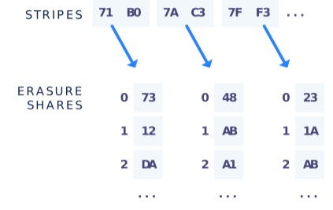
	
	正如在3.4和4.7节中讨论的那样，EC 为我们提供了在存储节点不可靠的情况下控制网络耐久性的机会。条带是执行 EC 的边界。 在（k，n）EC 方案中，为每个条带生成 n 个擦除份额[59]。 例如，一个条带可能被分成40个擦除份额（n = 40），而重建该条带则需要20个（k = 20）。 40 个擦除份额中的每个份额都将是原始条带大小的1/20。

	一次对单个条带进行 EC 使我们能够读取大段的一小部分，而无需首先检索整个段[38]。 它还使我们无需预先分级就可以将数据流传输到网络中，并且还启用了许多其他有用的功能。

	有关更改 EC 参数如何影响可用性和冗余的详细信息，请参见第7.3.3节。
- EC 片段 (Erasure Shares as Pieces)

	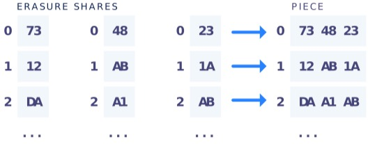
	
	由于条带已经很小，因此 EC 片段通常要小得多，并且分别跟踪所有条带的元数据相对于其大小而言将是巨大的。所有 n 个 EC 片段都具有与之相关的定义明确的索引。更具体地说，对于固定的条带和任何给定的n，EC 的第i个份额将始终相同。就像 zfec 库的 filefec 模式[42]一样，将所有具有相同索引的擦除份额打包在一起，而不是分别跟踪所有 EC 片段。在（k，n）方案中，有 n 个片段，其中每个片段i是索引为i的所有擦除份额的有序串联。结果，在每个 EC 片段为条带的 1/k 的情况下，每条 EC 片段 1/k，因此仅需要 k 条就可以恢复整个段。一块就是存储在存储节点上的东西。

	每当新的上传开始时，卫星就会生成一个随机选择的全新根分片 ID。上行链路将保持根分片 ID 的机密性，并向每个存储节点发送特定于节点的分片 ID，该存储 ID 是通过获取根分片 ID、节点ID的基于哈希的消息验证码（HMAC）形成的。这用于掩盖存储节点中的哪些部分。根分片 ID 存储在指针中。

	存储节点按卫星 ID 命名空间分片。如果一个卫星使用的分片 ID被另一颗卫星重用，则卫星可以安全地假定该共享分片号是指与另一个卫星不同的分片，并且具有不同的内容和生命周期
- 指针

	数据所有者将需要了解如何拆分远程数据分片以及这些数据分片位于网络中的何处，并进行使用。 这包含在指针数据结构中。
	
	指针包括：
	
	- 哪些节点正在存储碎片
	- 加密信息
	- EC 详细信息
	- 确定阈值的片段数

		该阈值确定在触发修复之前,段必须丢失的冗余度，必须存储的片段数量才能考虑进行修复成功等细节。 如果该段是一个内联段，则指针将包含整个段的二进制数据，而不是由哪些节点来存储这些段。
	
	在我们以前的版本[37]中，使用了两种数据结构来跟踪上述类型的信息：帧和指针。 新版中将这些数据结构组合为单个数据结构，并选择将新的组合数据结构称为指针
- 元数据

	Storj 网络中的元数据存储系统主要存储指针。 Storj 网络的其他各个组件与指针数据库进行通信，以按路径存储和检索指针以执行操作。

	我们所需的元数据存储功能最简单的实现是让每个用户简单地使用其首选的受信任数据库，例如MongoDB，MariaDB，Couchbase，PostgreSQL，SQLite [53]，Cassandra [63]，Spanner [64]或 CockroachDB，仅举几例。 在许多情况下，只要特定用户正在管理其元数据的适当备份，这对于特定用户是可以接受的。 如果要存储 PB 级数据的用户类型最有可能管理仅存储元数据的单个关系数据库的可靠备份。

	让客户端管理传统数据库系统中的元数据有好处和一些弊端
	
	- 好处
		- 控制
	
			用户完全控制所有数据。没有组织上的单点故障。用户可以自由选择任何元数据存储，并选择自己喜欢的折衷方案，甚至可以自己运行。像 Mastodon [65]一样，这种解决方案仍然是分散的。此外，在灾难性的情况下，此设计并不比大多数其他技术或应用程序开发人员经常使用的技术（数据库）差。
		- 简便性
	
			其他项目花了多年时间在不稳定的拜占庭式容错共识元数据存储的实现上，并以预期的性能和复杂性为代价（请参阅附录A）。我们根本不需要做任何工作就可以将有用的产品推向市场。这是一个相当大的优势。
		- 避免协调
	
			用户仅需要与其 Satellite 上的其他用户进行协做。如果用户对吞吐量有很高的要求，可以设置自己的 Satellite，并避免其他任何用户的协调开销。通过允许Satellite 运营商选择他们自己的数据库，这将允许用户选择具有较弱一致性语义的 Satellite，例如 Highly Available Transactions [15]，这将减少他们自己 Satellite中的协调开销并进一步提高性能。
	- 弊端
		- 可用性
		
			用户数据的可用性完全取决于其元数据服务器的可用性。相对的问题是，假设在维护操作中投入了适当的精力，可以使用现有的受信任的分布式解决方案（例如Cassandra，Spanner或CockroachDB）任意提高可用性。此外，任何单独的元数据服务停机时间都不会影响网络的其余部分。实际上，整个网络永远都不会崩溃。
		- 耐用性
		
			元数据服务器在没有备份的情况下发生灾难性故障，则所有用户数据都将丢失，对于加密的数据，这个是正确的。但传统的数据库解决方案极大地增加了使用加密密钥的风险范围。幸运的是，元数据本身可以定期备份到 Storj 网络中。反过来，这又使我们只能跟踪此元数据的备份数据，从而进一步减少了必须存储在其他位置的关键信息量。
		- 信任
		
			用户必须信任元数据服务器
		
我们的目标是允许客户将其元数据存储在他们选择的数据库中，并期待在框架的这一部分中具体实现新的系统和改进。

### 卫星(Satellite)
拥有此元数据的服务的集合称为“卫星”。网络用户将在特定的卫星实例上拥有帐户，该实例将：

- 存储其文件元数据
- 管理对数据的授权
- 跟踪存储节点的可靠性
- 在减少冗余时修复和维护数据
- 向存储节点上的存储节点支付费用。

值得注意的是，特定的卫星实例不一定构成一台服务器也可以作为服务器的集群运行，并由水平可扩展的受信任数据库支持，以实现更高的正常运行时间。

Storj 实施了瘦客户端模型，该模型将管理文件位置元数据的信任委托给管理数据所有权的卫星服务。因此，上行链路能够支持尽可能广泛的客户端应用程序，而卫星则需要较长的正常运行时间和潜在的重要基础结构，尤其是对于一组活动的文件。任何个人或组织都可以运行自己的卫星来促进网络访问。

从本质上讲，卫星是我们最初版本中最复杂，最直接的组成部分之一，可满足我们的框架要求。尽管将来会发布符合框架要求的版本，但最初的卫星是一个标准的应用程序服务器，它包装了受信任的数据库，例如 PostgreSQL，Cassandra 或元数据系统选择的任何解决方案（第4.9节）。用户使用帐户凭据登录到特定的卫星。尽管计划了各种级别的导出和导入，模型规定但同一时刻，通过一个卫星实例获得的数据将无法通过另一个卫星实例获得（6.2节），否则就是双倍支付。

关于客户数据，从不向卫星提供未加密的数据，并且不持有加密密钥。卫星支持与第三方共享的对象的唯一标示，粗略大小以及其他元数据（例如访问模式）。该系统保护客户的隐私，并赋予客户对数据访问的完全控制权，同时将保持网络上可用文件的职责委派给卫星。

客户可以使用由第三方运行的卫星。由于卫星几乎不存储任何数据并且无法访问密钥，因此与传统的数据中心模型相比，这是一个很大的改进。卫星提供的许多功能（例如存储节点选择和信誉）都利用了相当大的网络效应。信誉数据集随着大小的增加而变得越来越有用，表明在共享卫星中的基础设施和信息方面存在强大的经济动力。

提供商可以选择将公共卫星作为服务来运营。然后，应用程序开发人员将关于数据在网络上的位置的信任委托给特定的卫星，就像对传统对象存储的信任一样，但程度较小。未来的更新将允许客户应用程序和卫星之间的职责分配以及信任级别的各种分配。

卫星实例由以下组件组成：

- 完整的节点发现缓存（第4.6节）
- 按加密路径索引的按对象元数据数据库（第4.9节）
- 帐户管理和授权系统（第4.12节）
- 存储节点信誉，统计和审查系统（第4.13节）
- 数据修复服务（第4.14节）
- 存储节点付款服务（第4.16节）

虽然我们的许多卫星发射目标比我们先前系统的 Bridge 实施要先进[37]，但这仍然只是分散过程中的一点，我们希望继续寻找进一步分散组件的方法。

### 加密
我们的加密选择是经过身份验证的加密，同时支持 AES-GCM 密码以及支持 NaCl 的 Salsa20 和 Poly1305 组合，称为“ Secretbox” [66]。使用经过身份验证的加密，以便用户可以知道是否有任何数据被篡改。

- 数据加密

	数据以小批条纹的块进行加密，建议为 4KB 或更小[67]。虽然分片中的每个加密批次都使用相同的加密密钥，但也可能具有不同的加密密钥。每个加密批次的随机数必须在整个段中从前一个批次单调递增。如果计数器达到最大可表示的随机数，则随机数回绕为0。为了防止重新排序攻击，将根据分片号确定性地选择每个段的起始随机数。当多个分片并行上传时（例如，S3的分片上传功能），可以从文件的起始随机数和段号计算每个段的起始随机数。该方案保护来自容纳数据的存储节点的数据内容。数据拥有者保留对加密密钥的完全控制权，因此也保留对数据访问的完全控制权。

- 路径加密

	路径也被加密。像 BIP32 [46]一样，加密是分层的和确定性的，并且每个路径组件都单独加密。例

	- 假设未加密路径 p ，路径分量p1-pn,想要得到的是加密路径 e，路径分量为 e1-en 。
	- 假设一个预定的根秘密 S0。该根秘密由用户选择，并且像所有其他加密秘密一样，永远不会离开客户端计算机。
	- 从 Si 确定性生成密钥 K(Si)，递归定义 `Si=HMAC(Si–1,Pi)`
	- 然后定义加密路径分量 `Ei=enc(K(Si–1)，Pi)`，以使新路径 e 为 e1-en。 

	HMAC-SHA256 或 HMACSHA512 用于密钥派生。这种构造允许客户端共享对路径的某些子树的访问，而无需访问其父级或相同深度的其他路径。

	例如
	
	- 假设一个客户端希望与另一个客户端共享对具有相同前缀 p1，p2，p3 的所有路径的访问。
	- 客户将给另一个客户e1，e2，e3 和 S3
	- 这允许客户端解密和访问任何任意 e4，因为他们知道K(S3)，而不允许客户端解密 e3 或更早版本。
	- 在这种情况下，更普遍的是，客户端可以解密和访问任何任意 ei，只要且仅当 i> 3 时。

	默认情况下，路径加密是启用的，但在其他情况下则是可选的，因为加密的路径使有效排序的路径列表具有挑战性。当使用路径加密（perbucket 功能）时，对象通过其加密的路径名进行排序，这是确定性的，但如果客户端应用程序对排序的未加密路径感兴趣，则相对而言无济于事。因此，用户可以选择退出路径加密。禁用路径加密后，未加密的路径只会显示给用户选择的卫星，而不会显示给存储节点。存储节点继续没有关于其存储的片段的路径和元数据的信息。
	
### 授权
加密可在识别篡改的同时保护数据的私密性，但授权可通过禁止客户端进行未经授权的编辑来防止篡改。被授权的用户可以对元数据进行添加、删除和编辑操作，而未被授权的用户将不具有这些功能。用户将通过其卫星进行身份验证，这将使他们可以根据其授权配置访问各种操作。

最初的元数据授权方案使用蛋白杏仁饼干(macaroons) [68]。macaroons 是一种承载令牌，可以授权承载使用某些受限制的资源。macaroons 特别有趣，因为它们允许进行丰富的上下文分散授权。换句话说，它们提供了这样的属性：任何人都可以添加限制，而这些限制以后将无法删除，而无需与中央部门进行协调。

使用 macaroons 来限制可以应用哪些操作以及可以将其应用到哪些加密路径。通过这种方式，macaroons 提供了一种机制，可以限制对特定加密路径前缀，特定文件和特定操作（例如只读访问或仅附加访问）的委派访问。每个帐户都有一个根 macaroons ，并且根据提供的 macaroons 的警告对操作进行了验证。我们的macaroons 还添加了可选的到期和吊销令牌，可让用户以编程方式撤销 macaroons。

因为我们要限制卫星操作，并且卫星只能访问加密路径，所以我们的授权方案必须在加密路径上起作用。为了将访问委派给特定的路径前缀，路径组件之间的路径分隔边界必须在整个加密过程中保持不变。这意味着除正斜杠外，路径分隔符的功能和/或性能降低。

卫星授权了上行链路后，卫星将批准并签署对存储节点的操作，包括带宽分配（第4.17节）。在对存储节点进行操作之前，上行链路必须从卫星检索有效签名。存储节点上的所有操作都需要特定的卫星ID 和相关的签名。存储节点会拒绝未使用适当的卫星签名的操作。存储节点也不允许由一个卫星签名的操作应用于由另一个卫星拥有的对象，除非拥有它的那个卫星明确授权。

我们最初的实现方式不会检测到或试图减轻因卫星异常而导致的意外文件删除或回滚。我们的信任模型期望用户的卫星行为良好，并可靠地存储和修复数据。

如果无法信任卫星，则无论如何都不太可能代表客户修复数据。但是，未来的实现可能会通过类似 SUNDR，SiRiUS 或 Plutus 等系统中的方案来增加对基于卫星的文件系统篡改的更彻底的检测[69-71]。
### 审查
在具有不受信任的节点的网络中，验证那些节点正在准确地返回数据并以其他方式表现出预期的行为对于确保系统正常运行至关重要。审查是一种确认节点是否拥有其声称拥有的数据的方法。审查员（例如，卫星）将向存储节点发送质询，并期望有效的响应。一个挑战是对存储节点的请求，以证明它具有预期的数据。

一些分布式存储系统，包括 Storj 的先前版本[37]，讨论了 Merkle 树证明，其中存储时会生成审查挑战和预期响应，作为可检索性证明的一种形式[47]。通过使用 Merkle 树[72]，存储这些挑战和响应所需的元数据量可以忽略不计。

可检索性的证明可以大致分为有限方案和无限方案[49]。先前版本中使用的 Merkle 树变种就是这样一种有限方案。不幸的是，在这样的方案中，必须预先产生挑战和预期的响应。正如我们从以前的版本中学到的那样，无需定期重新生成这些挑战，存储节点就可以通过跟踪存在的挑战然后仅保存预期的响应来开始通过大多数审查，而无需存储所有请求的数据。在之前的版本中，我们开始考虑使用 Reed-Solomon EC 来帮助解决此问题。

我们的存储系统中的一个假设是，大多数存储节点行为合理，并且激励措施是一致的，从而可以忠实地存储大多数数据。只要这个假设成立，Reed-Solomon 就能通过 Berlekamp-Welch 错误校正算法[39，73]来检测错误甚至纠正错误。我们已经在小范围（条带）上使用 Reed-Solomon EC [59]，因此如在 HAIL 系统[41]中所讨论的，使用 EC 一次读取单个条带作为挑战，然后验证 EC 分享回应。这可以进行任意审查，而不会产生预先产生的挑战。

- 要执行审查，首先选择一个条带
- 我们要求所有存储节点对应这段共享条带的 EC 分段
- 然后，在所有 EC 分段运行 Berlekamp-Welch 算法[39,73]
- 当足够多的存储节点返回正确的信息时，可以轻松地识别出任何错误或缺失的响应

卫星从缓存中给定特定的存储节点，审查可能会发现其完整或不正确，原因可能是缓存地址陈旧

- 因此将尝试从 Kademlia 查找最新地址。
- 如果该节点仍然看起来是正常的，则卫星会将节点置于遏制模式
	- 遏制模式下卫星将暂停该节点响应，然后对节点进行相同审查，直到该节点成功响应，主动使审查失败或由于响应时间过长都会被取消服务资格
	- 如果节点成功响应后，它将退出遏制模式

所有审查失败都将被存储并保存在信誉系统中。审查还提供了测试存储节点延迟，吞吐量，响应能力和正常运行时间的机会，此数据也将保存在信誉系统中。

重要的是，每个存储节点都要进行频繁的随机审查，以获取有关该存储节点运行状况的统计能力。但是，如第3.7节所述，不要求对每个字节甚至每个文件都执行审查。此外，重要的是要检查系统中存储的每个字节是否与系统中的每个其他字节相同，以备将来审查。有关正确存储信心数据需要进行多少次审查的讨论，请参见第7.2节。

### 数据修复
随着存储节点的正常运行，一旦每个分片的 EC 条带数量降到预定阈值 m 以下就必须重建丢失的条带。(如果节点完好而数据异常，卫星则会标记文件在该节点丢失)

卫星节点发现系统的高速缓存具有相当准确和最新的信息，会确定哪些存储节点最近联机。当存储节点的状态从最近在线更改为在线时(最新刷新)，可能会触发用户元数据数据库中反向索引的查找，从而确定该节点上存储的所有 EC 片段指针。

对于每个下降到低于最小安全阈值 m 时触发下载整个数据分片的对应 EC 分段来重建该段，丢失的片段将重新生成并上传到新节点，并将卫星的指针更新。

用户将通过卫星选择所需的耐用性，这可能会影响价格和其他考虑因素。理想的耐用性（连同正在进行的审查的统计数据）将直接告知将为新文件和已修复文件选择哪种 Reed-Solomon EC 参数指标，以及将在成功上传和何时需要修复时设置的阈值。有关如何在给定用户输入的情况下计算这些值的信息，请参见第3.4和7.3节。

这种设计的直接含义是人造卫星必须一直保持运行状态。如果用户的卫星停止运行、将停止维修节点的波动引起的故障，最终导致数据最终将从网络中消失。(这类似于数据存储和发布在 Kademlia [8] 中的工作方式，Kademlia 要求所有数据存储节点保持在线)

标准配置下卫星的审查和修复系统出流量(出站)带宽的需求较小，但进流量(入站)带宽需求很大。大量数据会进入卫星系统进行审查和维修，但只有丢失的数据会被发回网络。尽管维修和审查系统可以在任何地方运行，但是带宽使用是不对称的，免费进流量的托管服务提供商为建立该系统的用户提供了一个特别有吸引力的托管位置。

- HASH

	数据修复是一项持续，昂贵的操作，将占用大量带宽、内存和 CPU 处理能力。通常会影响单个运营商。因此，应尽可能积极地减少维修资源的使用。

	为了使分段有效地最小化带宽使用，应仅下载重建所需的部分。不幸的是 Reed-Solomon 在仅提供少量冗余分段数据时无法纠正错误。相反散列 HASH 提供了一种更好的方法来确认正确地修复了数据。

	为了解决此问题，EC 分段数据将与 HASH 值一起存储在每个存储节点上。HASH 集的验证的 HASH 将存储在卫星的指针中。在维修过程中，可以通过检索并验证每块 HASH 值和卫星存储的指针验证 HASH 值来确定数据正确性，这样可以对每块 EC 分段 HASH 进行完整的验证。这使维修系统可以正确评估维修是否已成功完成，而无需使用额外的冗余恢复任务。
	
### 存储节点信誉
去中心化网络上的信誉度量标准是实现节点之间合作的关键部分。信誉度量标准用于确保消除网络中的拜占庭节点的作为参与者，从而提高安全性，可靠性和耐久性。

存储节点信誉可以分为四个子系统

- 工作证明系统

	第一个系统的目标是要求提供简短的证明，证明存储节点运营商已通过时间、股份或资源进行了投资。当前使用的工作量证明。如第4.3节所述，存储节点需要生成一部分工作量证明。这有助于网络避免某些 Sybil 攻击[74]，但和比特币不同，Storj 并不告知工作量证明难度如何设置的机制。我们将让卫星运营商为新数据存储节点设置每个卫星所需的最低难度。如果存储节点的工作量证明难度小于卫星设置的难度，卫星节点将不会选择其为存储数据的对象。随着时间的推移，整体期望运营商会自然增加最低工作证明要求，直到找到合理的平衡。在工作量证明难度配置发生变化的时，卫星将在可能会将现有数据保留在现有节点上。当然其他投资证明计划也是可能的，例如先前工作中提出的股权证明形式[75]。
- 初始审查过程

	第二个子系统将缓慢地允许节点加入网络。我们提出了以下方法来收集有关新节点的数据，而不会影响网络的完整性。

	- 每次上传文件时，卫星都会选择少量其他未经审查的存储节点，以包括在目标节点列表中。选择 Reed-Solomon EC 参数，使这些未经审查的存储节点不会影响文件的耐久性，但将允许网络使用一小部分数据测试该节点，直到系统确定该节点是可靠的为止。
	- 在存储节点成功存储了足够长的时间段（至少一个付款周期）的数据之后，卫星随后将开始将该存储节点包括在用于常规上传的标准选择过程中。它还将向该节点发送一条已签名的消息，声称已完成审查过程，并且该存储节点现在可以输入其他节点的路由表（第4.6.1节）。重要的是，存储节点在此审查期间获得付款，但没有收到太多数据。
- 过滤系统

	过滤系统是第三个子系统。它阻止了不良的存储节点参与。除了根本没有做充分的工作证明外，存储节点可以采取的某些行动是取消比赛资格。无论节点处于审查过程中的哪个位置，都会使用信誉系统从以后的上传文件中过滤掉这些节点。取消资格的动作包括：
	
	- 审查失败太多；
	- 未能以合理的速度返回数据；
	- 没有大量运行正常时间检查
	- 客户端尝试从该节点应已存储的存储节点下载片段，而该节点未能将其退还，则该节点将被取消资格。

	如果某个存储节点不合格，则该节点将不再被选择用于将来的数据存储，并且该节点存储的数据将被移至新的存储节点。重要的是，存储节点被允许选择要使用的卫星运营商以及要存储的数据，将被允许拒绝和取消某个卫星操作。

	值得重申的是，过多的正常运行时间检查是不合格将可以设置该存储节点以进行维护，但是如果该卫星存储节点过多出现这样的问题，则会导致会对网络正常使用造成不利影响。如果节点在审查期间处于正常状态，则应重试该特定审查，直到该节点成功响应或被取消资格为止，以防止该节点选择性地对该卫星审查无法响应。

	在取消存储节点的资格后，该节点必须再次返回整个审查过程。如果节点决定以全新的身份重新开始，则该节点必须从头重新启动审查过程（除了通过工作量证明系统生成新的节点ID外）。这极大地抑制了存储节点因其声誉而变得无所适从。
- 偏好系统

	最后一个子系统是首偏好系统。筛选出不合格的存储节点后，将使用在审查期间收集的剩余统计信息来确定上载期间对更好的存储节点的偏好。这些统计信息包括性能特征，例如
	
	- 吞吐量
	- 延迟
	- 可靠性
	- 正常运行时间的历史记录
	- 地理位置
	- 及其他所需的数据

它们将被合并到一个负载均衡选择过程中，从而所有上载都被发送到合格节点，上载到偏好节点的可能性更高，但任何合格节点的机会都不为零。最初通过随机化方案（例如“两个选择的力量” [76]）与这些偏好项进行负载均衡，但该方案会完全随机选择两个选项，然后在这两个选项之间选择更为合格的选项。

在 Storj 网络上与取消资格的事件不同，存储节点信誉优先算法仅用于选择将新数据存储路由(修复和上传新文件阶段)。如果存储节点的优先信誉降低，则其存储的文件将不会移动或修复到其他节点。

在系统中没有计划让存储节点与信誉得分竞争的过程。而是让拥有良好的正常运行时间、通过审查和正常返回数据的存储节点的利益最大化。不执行这些操作的存储节点对网络没有用。被卫星不公平对待的存储节点将不接受来自这些卫星的数据。关于质量控制的信息，请参阅第4.21节，我们计划如何确保激励卫星公平对待存储节点。

最初，存储节点信誉将由每个卫星分别确定。如果一个节点被一个卫星取消资格，它可能仍会存储其他卫星的数据。信誉最初不会在卫星之间共享。但随着时间的流逝信誉将在全局范围内使用。

### 付款方式
在 Storj 网络中，付款是由客户将数据存储到选择卫星上传时进行。客户可以通过任何机制（STORJ，信用卡，发票等）对卫星进行支付，但最终卫星需要通过基于以太坊的 ERC20 [77] 的 STORJ 对存储节点进行支付。卫星需要向存储节点支付它们在网络上提供的存储量和带宽费用。

以前的分布式系统将付款处理为硬编码合同。例如，以前的 Storj 网络使用90天合同来维护网络上的数据。在这段时间之后，该文件被删除。其他分布式存储平台使用 15 天的可续约合同，如果用户每 15 天未登录一次，则该合同将删除数据。其他人则使用 30 天的合同。我们认为最常见的用例是无限存储。为了最好地解决此用例，我们的网络将不再使用合同来管理付款和文件存储期限。默认的假设是数据将无限期地持续下去。

卫星将向存储节点支付其存储的数据和分段下载的费用。卫星数据传输费用将不会实时结算给存储节点，而是按照月周期来结算。如果没有取消存储节点的资格，则根据卫星的记录，卫星将向该存储节点支付其在一个月中数据的存储和传输费用。在付款期结束时，卫星将为其每个存储节点计算收入。

卫星有强烈的动机选择长期使用的正常的存储节点。在至少半年的时间内保持良好的参与度和正常运行时间（大约半年以上）。如果存储节点离开网络，则卫星将收回向其托管款项。

如果某个存储节点由于处于联机状态而错过了数据删除命令，则该存储节点将存储的数据量超过卫星为其分配的数据量。卫星无需为存储此类文件付费，但存储节点最终将通过 GC 回收过程清理脏数据。（请参阅第4.19节）。这意味着保持较高可用性的存储节点可以通过按需删除文件来最大程度地提高利润，从而最大程度地减少了存储的脏数据量。

卫星维护着它负责的所有文件以及它认为正在存储这些文件的存储节点的数据库。对于卫星认为合法的文件，文件卫星都会在每个存储节点上增加一天的费用来奖励。卫星将跟踪已利用的带宽（请参阅第4.17节）。每月月底将给存储节点支付累计费用。

卫星会从账户持有人哪里收费，用于支付存储节点数据存储、下载，卫星节点检索、审查、修复和存储元数据的费用，(元数据按分片收费，下载按字节收收费)。

每分片费用涵盖指针的元数据存储费用，而按字节收费则覆盖了网络上的数据维护成本。每天每个卫星都会对其网络上所有存储节点执行许多审查。一旦跌至维修所需的门槛以下，卫星将负责完成审查和维修。

当检测到存储节点恶意操作且未正确存储文件或无法维持足够的可用性时，将不提供付费给该节点，而是将分配给它的资金用于修复任何丢失的文件并支付用于存储数据的新存储节点。

为了尽可能减少交易费用和其他开销，付款将由收件人发起，并且至少必须具有一定的最低价值。某些卫星可能会选择使用部分存储节点的付款来部分或全部支付交易费用。

有关存储节点如何知道如何信任卫星的详细信息，请参见“卫星信誉”部分（第4.18节）。

### 带宽分配
我们的系统核心组件需要知道两个对等组件之间使用了多少带宽。在以前的版本[37,78]中，使用交换报告来收集有关两个组件之间发生的信息。在操作结束时，两个对等组件都会将报告发送到中央收集服务以进行结算。当双方都同意时，就可以直接确定已使用了多少带宽。但是，当他们不同意时，我们求助于数据分析和回归，以确定哪个对等方更有可能进行 "欺诈”（或理性节点）。使用我们的新版本，我们希望在协议级别上避免作弊。

为了解决这个问题，我们转向基于 Neuman 的基于代理的授权和对分布式系统的计费[79]。此记帐协议以委派和分散的方式更正确地测量资源使用情况。

根据 Neuman 的会计协议，如果帐户持有人有足够的资金来支付该操作，则帐户服务器将创建一个经过签名的数字支票并将其转移给该帐户持有人。协议将此检查称为代理，但我们将其称为带宽分配。该支票包含以下信息：

- 帐号服务器
- 付款人
- 收款人
- 可用于操作的最大资源量
- 防止任何双重支出问题的支票号码[80]以及到期日期。

例子中

- 帐户服务器是卫星
- 付款人是上行链路
- 收款人是存储节点
- 所讨论的资源是带宽

仅在请求授权上行链路的情况下卫星才会创建带宽分配。在存储操作开始时，

- 上行链路可以将带宽分配传输到存储节点
- 存储节点可以验证卫星的签名并执行请求的操作，直到达到允许的带宽限制
- 然后将带宽分配发送给卫星以进行支付。

Filecoin 的 o-chain 检索市场进一步激发了我们的灵感，在该市场中，一次仅传输少量数据[81]。我们不让存储节点在不执行所请求的操作的情况下保存带宽分配，而是将每个操作分成较小的请求，这样，如果存储节点或上行链路过早地停止协议，则双方都不会暴露给过多的利益而失利。这类似于乐观，逐步释放，公平交换的协议[80]。

为了用 Neuman 的记帐协议和较少的卫星开销支持这一点，我们使用了受限的带宽分配（在[79]中称为受限代理）。Neuman 的受限代理的工作方式与 Macaroons[68]相似，在其中可以添加无法消除的设置而限制了代理的功能。代理可以使用公钥/私钥加密，这意味着任何人都可以验证代理，而不仅仅是原始发行者。因为每个上行链路已经有一个密钥对作为其身份的一部分（第4.4节），所以使用现有的密钥对，而不是为每个限制都创建一个新的密钥对。

例子中，

- 受限带宽分配受上行链路的限制
- 以将带宽分配的值限制为仅传输到目前为止的值
- 通过这种方式，存储节点将一直保持到该点为止已接收的最大带宽分配
- 并且上行链路将仅发送略大于的带宽分配的已接收的带宽。
- 存储节点没有动力保持最大分配，因为它们都共享相同的“支票号”，且只能兑现一次。

在进行 Get 操作的情况下，

- 假定卫星签名的带宽分配最多允许总共x个字节。
- 上行链路将首先发送少量（y个字节）（可能只有几千字节）的受限分配给存储节点，以便存储节点可以验证上行链路的授权。
- 如果存储节点验证分配已正确签名，则存储节点将在等待另一个分配之前最多传输受限分配中列出的数量（y个字节)。
- 然后，上行链路将发送另一个y较大的分配，继续发送数据分配，直到y增长到完整的x值为止。
- 对于每个事务，存储节点仅发送以前未发送的数据，因此存储节点仅发送总计x个字节。

如图4.6所示，对这些请求进行了流水处理，以避免流水线停止性能的损失。

如果请求在计划的或意外的任何时间终止，则存储节点将保留已收到的最大受限带宽分配。最大的受限带宽分配是上行链路的签名确认，即上行链路同意使用最多y字节的带宽，以及卫星对上行链路的带宽余量x的确认。存储节点将定期发送最大的受限带宽分配

- 上传

	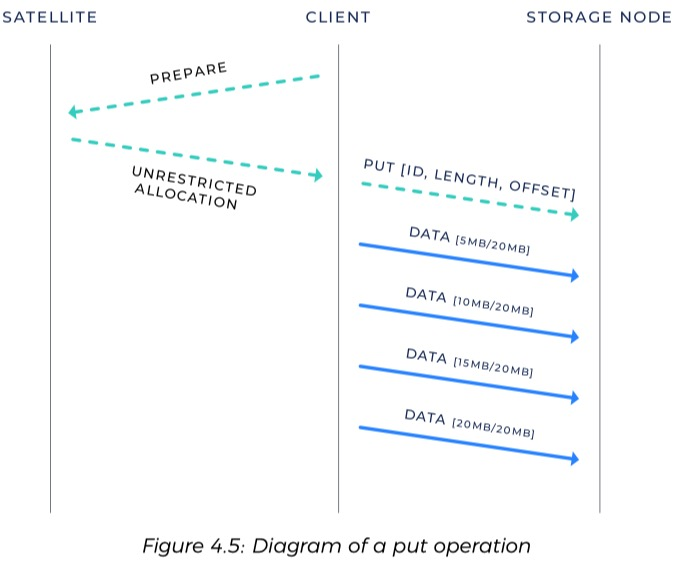
- 下载

	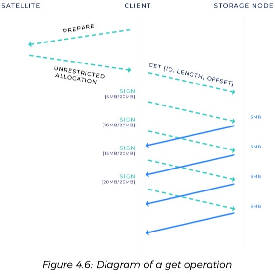
	
如果带宽超出分配的范围，则存储节点将拒绝该请求。存储节点只能以客户同意的最大金额获得付款，否则它将没有有效的带宽分配来返回支付。我们不会衡量所有的点对点流量。该带宽流量测量系统仅跟踪存储操作（存储和检索件）期间使用的带宽。 但是，它不适用于节点发现流量（Kademlia DHT）或其他常规维护开销。

### 卫星信誉
用户只要为 Storj 网络上的卫星的付款，当卫星异常或性能历史记录不佳被网络记录后，网络就会强烈鼓励存储节点避免接受其数据。

当新的卫星加入网络时，参与的存储节点将开始自己的审查过程。此过程将限制他们接触新的未知信誉卫星。存储节点将能够为不信任的卫星配置最大存储的数据量，并将建立有关将来是否会进一步信任该卫星的历史数据。存储节点运营商还将保留对其将信任或不信任哪些卫星的手动控制。同时随着时间的推移建立信任关系，以突出显示哪个卫星具有最好的付款记录。

存储节点运营商可以选择自动信任 Storj Labs 提供的推荐卫星集合，这些集合遵循一组严格的质量控制和支付服务水平协议（SLA）。为了保护存储节点运营商，如果希望将卫星运营商包括在“Tardigrade” 批准的列表中，则可能要求卫星运营商遵守一组运营、付款和定价参数，并与 Storj Labs 签署业务协议。有关更多详细信息，请参见第4.21节。

### 垃圾收集(GC)
当客户端移动、替换或删除数据时，卫星或代表卫星的客户端将通知存储节点不再需要它们来存储该数据。在客户端发出删除消息的配置中，元数据系统（具有信誉的卫星）将要求证明已将删除发布到可配置的最小数量的存储节点。这意味着每次删除数据时，在线且可访问的存储节点将立即收到通知。

存储节点有时会暂时不可用，并且会丢失删除消息。在这些情况下，因为卫星只为他们希望存储的数据付费，所以声明删除的数据将被视为垃圾。除非使用垃圾收集系统，否则大量垃圾将会影响存储节点的收益。因此，我们引入了垃圾回收来释放存储节点上的空间。

- 主动 GC 系统
	当客户端移动、替换或删除数据时，卫星或代表卫星的客户端将通知存储节点不再需要它们来存储该数据。
	
	- 在客户端发出删除消息的配置中
	- 卫星元数据系统将需要将删除证明发布到可配置的最小数量的存储节点。
	- 这意味着每次删除数据时，在线且可访问的存储节点都将立即收到通知。
- 被动 GC 系统

	垃圾收集算法是一种释放不再使用的资源的方法，一般分两种方案

	- 精确的垃圾收集器，会准确地收集所有垃圾，并且不会留下任何额外的垃圾。
	- 保守的垃圾收集器，可能会给其他一些折衷方案留下一小部分垃圾，通常目的是提高性能。

	对于错过初始删除消息的节点，被动 GC 系统将使用保守垃圾回收策略，尽管我们预计不久的将来将有一个精确的策略。当卫星节点"亏空"存储费用以摊销存储垃圾的成本时启动。
	
	- 存储节点将定期(每个结算周期)请求一个数据结构来检测差异。以最简单的形式，它可以是存储密钥的散列，从而可以有效地检测不同步状态。
	- 在检测到不同步状态后，收集可以使用其他结构（例如 Bloom 过滤器[82]）来找出尚未删除的数据。
	- 通过定期返回针对每个节点量身定制的数据结构，卫星可以使存储节点能够以可配置的容忍度清理垃圾数据。
	- 卫星将拒绝对这些数据结构的过于频繁的请求
	
### 上行链路
上行链路是用来识别调用的libuplink ，以便与卫星和存储节点进行交互的任何软件或服务的术语。它有几种形式：

- Libuplink

	libuplink 是一个库，提供对 Storj 网络中存储和检索数据的访问。
- 网关

	网关充当服务或应用程序与 Storj 网络之间的兼容性层。它们作为与生成数据的位置共存的服务运行，并且将直接与存储节点通信，从而避免了中心带宽成本。网关是 libuplink 之上的一个简单服务层。我们的第一个网关是 S3 网关。它为需要存储数据但不想直接打扰分布式存储复杂性的用户和应用程序提供了一个与 S3 兼容的插入式界面。 
- Uplink CLI

	Uplink CLI 是一个命令行应用程序，它调用 libuplink，允许其用户上载和下载文件，创建和删除存储桶，管理文件权限以及其他相关任务。它旨在提供与使用 Linux/UNIX 工具（如scp或rsync）时可能期望的熟悉的体验。

### 质量控制和品牌
Storj 网络有两个主要产品重点，分别服务于两个不同的目标市场。这些重点是：

1. 通过招募存储节点运营商来为网络创建存储供应商
2. 通过付费用户创造对云存储的需求

Storj 将通过两个品牌 Storj 和 Tardigrade 将我们的业务的供应方与需求方分开，从而区分每个市场细分的重点和经验设计。

市场的供应方将由 Storj 品牌提供。我们将保留 storj.io 作为学习如何为 Storj 网络贡献额外的存储和带宽的地方。这包括存储节点设置、文档、常见问题解答（FAQ）和教程。这两个品牌的用户也可以通过 storj.io 访问我们的源代码和社区。

我们业务的需求方将由 Tardigrade 品牌提供服务，并将通过 tardigrade.io 进行指导。这种经验将集中于我们的合作伙伴和客户，这些客户和伙伴从网络购买了分散存储和带宽，并期望在行业领先的服务水平协议（SLA）的支持下具有较高的耐用性，弹性和可靠性。这包括所有人员，免费试用版，卫星选择，文档，常见问题解答，教程等。

“ Tardigrade” 品牌还将用作卫星质量认证系统。任何人都可以通过 storj.io 设置人造卫星，但是要将该人造卫星列为官方 “Tardigrade人造卫星”，被视为“Tardigrade质量”，并直接受益于 Storj Labs 的需求生成活动，则运营商必须通过某些合规性和质量要求。这些质量控制将不断对 Satellite 的行为、耐用性、合规性和性能进行审查和排名。此外，卫星运营商将必须遵守有关定价，存储节点招募，SLA，存储节点付款等方面的特定业务策略。

Tardigrade 网络中的卫星运营商将与 Storj Labs 建立业务关系，该业务关系除其他外将定义实体之间的特许权费和收益共享。 Storj Labs 还将承担职责，包括需求生成，品牌执行，卫星运营商支持，最终用户支持，美国1099表纳税申报合规性，4保险以及维护整个网络质量。

将执行这些合规性和质量控制，以确保公平地支付存储节点的费用，并且 Satellite 能够连续满足 Tardigrade 产品的所有 SLA。	
## DEMO
以下是通过系统处理数据的不同类型的常见用例示例的集合
### 上载
当用户想要上传文件时，用户首先开始将数据传输到上行链路实例

- 上行链路为第一个片段选择一个加密密钥和起始随机数，并在发布到网络前开始使用经过身份验证的加密来发布数据。
- 上行链路会增加数据缓冲，直到知道发布的网络中的片段足够多以成为嵌入式网段还是远程网段为止。(内联段足够小将存储在卫星元数据中)

本 DEMO 的其余部分将假定一个远程片段，因为远程片段涉及整个技术堆栈。

- 上行链路向卫星发送请求，以准备存储此第一片段。请求对象包含 API 凭据(例如 macaroons )和身份证书。
- 收到请求后，卫星将：
	- 确认上行链路具有适当的授权和资金来处理请求。(上行链路必须已经拥有该特定卫星的帐户)
	- 选择具有足够资源的节点，以符合用户存储桶配置偏好设置，如耐用性，性能，地理和信誉要求
	- 返回节点列表，以及它们的联系信息和不受限制的带宽分配，以及所选的根部件ID
- 接下来，上行链路将获取此信息，并开始并行连接到所有选定的存储节点，同时测量带宽（第4.17节）
	- 将开始将分段分成条带，然后 EC 条带按照规则组成片段
	- 片段并行传输到每个存储节点(EC 将被配置为过度编码超过所需数量的片段。通过允许上行链路取消最慢的上传，这将消除长尾效应，并显着改善可见性能)
	- 数据将继续传输，直到达到最大片段阈值或流结束
	- 每段的所有 HASH 将被写入每段流的末尾
- 之后，存储节点
	- 分配最大的受限带宽
	- 设置片段的TTL（如果存在)
	- 数据将通过存储节点特定的片段 ID和委派的卫星 ID 进行标识
- 上传结果
	- 失败

		如果由于某种原因中止了上传，则存储节点将保留它代表卫星从客户端上行链路接收到的最大受限带宽分配，但会丢弃所有其他相关请求数据。
	- 成功
		- 上行链路使用确定性的分层密钥来加密文件选择的随机加密密钥
		- 上行链路会将指针对象上传回卫星，其中包含以下信息
			- 哪些存储节点最终成功
			- 为片段选择了哪种加密路径
			- 使用 EC 算法的参数
			- 片段 ID
			- 加密的数据随机密钥和其他元数据
			- HASH
			- 一个签名
- 最后，上行链路将继续进行下一个片段，继续处理片段，直到整个流都已完成。每个网段都有一个新的加密密钥，但是该网段的开始随机数比前一个网段单调增加。

	流中存储的最后一个片段将包含其他元数据
	
	- 流包含多少段
	- 段的大小（以字节为单位）
	- 第一段的开始随机数
	- 扩展属性和其他元数据
- 存储节点将作为上载的一部分，将收到的最大受限带宽分配发送到对应的卫星进行消费凭证 

如果通过 S3 multipart-upload 界面进行上传，则每个部分都作为分段单独上传。

### 下载
- 上行链路
	- 首先用户向上行链路发送数据请求
	- 然后，上行链路通过推测性地向卫星请求除最后一个片段的指针外的前几个片段的指针，来尝试减少到​​卫星的往返次数
	- 上行链路需要最后一个片段指针来了解对象的大小、片段的大小和数量以及如何解密数据
- 卫星对于请求的每个分段指针
	- 确认上行链路有权下载片段指针，并且有足够的资金来支付下载费用
	- 为组成该片段的每个片段生成不受限制的带宽分配
	- 查找指针中列出的存储节点的联系信息
	- 返回每个片段的请求的段指针，带宽分配和节点联系信息
- 上行链路将确定对于接收到的数据请求是否需要更多的片段，并在需要时请求其余的片段指针。
	- 一旦返回了所有必需的片段指针，如果请求的片段不是内联的，则上行链路将启动并行请求，同时测量每个存储片段内适当 EC 范围内所有适当存储节点的带宽(由于并非所有 EC 片段都是恢复所必需的。因此，通过允许上行链路取消最慢的下载，可以消除长尾巴，并显着提高性能。)
	- 上行链路会将检索到的 EC 片段合并为加密条带并解密数据获取数据分片
- 结果	
	- 成功	
		- 最终获取所有数据分片，组合所有分片还原数据
	- 失败
		- 如果由于某种原因中止下载，则每个存储节点将保留其收到的最大受限带宽分配，但会丢弃所有其他相关请求数据。无论哪种方式，存储节点都将在以后将它们作为下载的一部分收到的最大受限带宽分配发送到卫星，以供以后付款。

### 删除
- 上行链路
	- 当用户想要删除文件时，删除操作首先由上行链路接收。
	- 然后，上行链路请求文件的所有片段指针。
- 卫星对于每个片段指针
	- 验证上行链路有权删除片段指针
	- 生成删除片段的已签署协议(因此存储节点知道卫星期望删除继续进行)
	- 查找指针中列出的存储节点的联系信息
	- 返回上行链路细分，协议和联系信息			- 上行链路
	- 对于所有远程片段，上行链路将向所有适当的存储节点发起并行请求，以信号指示已删除这些文件。
- 存储节点
	- 将返回签名消息，表明存储节点已接收到删除操作，并且将删除文件及其簿记信息或已将其删除
- 上行链路
	- 会将从工作存储节点收到的所有签名消息上载回卫星。
- 卫星
	- 将需要占总存储节点的百分比可调才能成功签署消息，以确保上行链路在通知存储节点该对象已删除时发挥了作用
	- 卫星将删除片段指针，并停止向客户收费并停止为支付对应存储节点费用
- 上行链路
	- 将返回成功状态
	
存储节点将定期向卫星询问生成的垃圾收集消息，这些消息将更新在主要删除事件期间处于正常状态的存储节点。卫星将拒绝过于频繁发生的垃圾收集消息请求。有关更多详细信息，请参见第4.19节。

### 移动
- 上行链路
		
	当用户要移动文件时，上行链路会收到将文件移动到新路径的请求。 然后，上行链路请求该文件的所有片段指针
- 卫星对于每个分段指针
	- 验证上行链路有权下载它
	- 返回请求的细分元数据
- 上行链路对于每个片段指针
	- 使用从路径派生的加密密钥解密元数据
	- 计算新目的地的路径
	- 使用从新路径派生的新加密密钥重新加密元数据
	- 上行链路要求卫星在原子比较和交换操作中添加所有修改后的段指针，并删除所有旧的段指针。
- 卫星将验证
	- 上行链路具有适当的授权，可以删除旧路径并创建新路径
	- 自从整体操作开始以来，旧路径的内容没有改变
	- 如果验证成功
		-  卫星将执行该操作。 

任何存储节点都不会收到与文件移动相关的任何请求。由于原子指针批处理修改的复杂性，在此网络的第一个版本中可能无法实现有效的移动操作

### 复制
- 上行链路
	- 当用户要复制文件时，上行链路会收到将文件复制到新路径的请求。
	- 然后，上行链路请求文件的所有片段指针。
- 卫星对于每个分段指针
	- 验证上行链路有权下载它
	- 查找指针中列出的存储节点的联系信息
	- 返回请求的片段元数据，新的根ID和联系信息
- 上行链路对于每个段指针
	- 使用从路径派生的加密密钥解密元数据
	- 将路径更改为新目的地
	- 从指针在每个存储节点上调用复制操作，以使用新的片段 ID 复制该片段
	- 等待存储节点响应它们已复制了数据，并删除了不成功的节点
	- 使用新的片段 ID 和从新路径派生的新加密密钥重新加密元数据
	- 最后，上行链路将所有修改后的片段指针上传到卫星
- 存储节点

	对存储进行重复数据删除或仅存储数据的一个实际副本，则可以。重要的是，存储节点可以通过新旧分段 ID 识别数据。如果其中一个分段 ID 收到删除操作，则另一个分段 ID 将继续工作。只有删除了这两个部分，节点才会释放空间。

### 列表
- 上行链路
	- 当用户想要列出文件时，首先，上行链路接收到列出对象页面的请求
	- 然后，上行链路会将未加密路径上的请求转换为加密路径
	- 接下来，上行链路将向卫星请求适当的加密路径页面
- 卫星
	- 卫星将验证上行链路具有适当的访问权限，然后返回请求的列表页面
- 上行链路
	- 将解密结果并将其返回

### 审查
- 生产审查队列
		
	每个卫星都有一个分段条带队列，将在一组存储节点之间进行审查。队列通过两种机制填充。
	
	- 第一种
		
		卫星通过随机选择片段来定期填充队列，然后在这些片段内也随机分布条纹。由于片段具有最大大小，因此这完全接近于选择随机进行统一审查的字节的目标
	- 第二种机制
		
		卫星通过标识最近审查少于其他存储节点的存储节点来选择要审查的条带。将从存储节点包含的数据中随机选择一个条带
	- 卫星将随后消费队列并报告错误
	- 对于每个条带请求，卫星将在该小条带范围内执行整个下载操作，筛选出处于包含模式的节点。与标准下载不同，条带请求不需要高效。卫星将尝试下载该条带的所有EC分片，并等待所有存储节点返回。
	- 在慷慨的超时时间内，接收到尽可能多的份额后，将对 EC 分片进行分析，以发现错误（如果有）。
	- 卫星服务器会记录返回无效数据的存储节点，如果存储节点返回过多的无效数据，卫星将取消存储节点的资格，无法进行以后的交换。在取消资格的情况下，卫星不会支付以后的存储节点，也不会选择用于新数据的存储节点。
	- 对于没有响应的存储节点，将创建并存储预期审查结果的加密校验和，并将无响应的节点置于密闭状态。在收容期间，将继续仅对节点无响应的审查进行审查，直到该节点通过或被取消资格
	
### 数据恢复
维修过程分为两个部分。第一部分检测不健康的文件，第二部分修复它们。检测很简单。
	
- 第一部分审查
	- 通过标准节点发现 ping 操作，每个卫星将定期对其已知的每个存储节点执行 ping 操作
	- 卫星将跟踪无法响应的节点并将其标记为已关闭
	- 当节点通过审查过程被标记为向下或标记为不良时，指向该存储节点的指针将被视为需要维修。指针跟踪其最小的允许冗余。如果指针没有存储在足够好的在线存储节点上，它将被添加到修复队列中。
- 第二部分修复
	- 卫星的辅助进程将采用修复队列中的分片段指针。在修复队列中使用段指针时：
		- 卫星将下载足够的片段以重建整个分片，以及与这些片段一起存储的片段 HASH（请参阅第4.14.1节）
			- 与审查不同，仅需要足够的分片即可进行准确的维修
			- 与流下载不同，修复系统可以在启动之前等待整个片段
		- 根据指针中的签名验证 hash
		- 然后根据经过验证的 hash 对下载的数据进行验证。不正确的部分将被丢弃，并作为存储节点失败的审查计入来源
		- 一旦恢复了足够的正确片段，就会重新生成丢失的片段
		- 卫星将选择一些新节点，然后通过正常的上载过程将新片段上载到这些新节点
		- 卫星更新指针的元数据
	
整个修复过程不需要上行链路参与

### 支付
- 卫星 
	- 首先，卫星将选择累计期限。 这是一段时间（默认为一天），用于计算静态数据的费用。 这纯粹是为会计选择的时间段； 实际付款的频率会降低。
	- 在每个汇总期间，卫星将考虑其当前认为存储在每个存储节点上的所有文件。
	- 卫星将根据每个存储节点上保存的数据，跟踪每个汇总周期内为每个存储节点欠费付款。
- 存储节点
	- 将定期（默认为每月）在带宽分配报告中发送给卫星。
- 卫星
	- 接收到带宽分配报告后，它将计算欠款以及剩余的未处理数据。 
	- 然后，它将资金发送到存储节点的请求钱包地址

## 未来工作
Storj尚在开发中，许多功能计划在将来的版本中使用。在本章中，我们讨论了几个特别有趣的领域，在这些领域中，我们要考虑对我们的具体实现进行改进。
### 热点文件和内容交付
有时，我们系统的用户最终可能会交付比预期更受欢迎的文件。尽管存储节点运营商可能会欢迎有机会为他们已经拥有的数据支付更多的带宽使用费用，但对这些流行文件的需求可能超过了可用的带宽容量，因此需要一种动态扩展形式。

幸运的是，卫星已经授权所有对作品的访问，因此可以对流行文件进行访问并对其进行计量和速率限制。如果文件的需求开始增长到无法满足当前资源的需求，那么 Satellite 就有机会在必要时暂时暂停访问，增加文件在更多存储节点上的冗余度，然后继续允许访问。

Reed-Solomon EC 具有非常有用的特性。假设（k，n）编码，其中总共需要k个，总共n个。对于任何非负整数x，（k，n + x）编码的前n个片段与（k，n）编码完全相同。这意味着可以很容易地以很少的开销扩展冗余。

举一个实际的例子，假设一个文件是通过（k = 20，n = 40）方案编码的，并且 Satellite 发现它需要将带宽资源加倍才能满足需求。卫星可以下载 40 个方案中的任何 20 个，仅生成新方案（k = 20，n = 80）的最后40个方案，将新方案存储在40个新节点上，并且-无需更改原始40个节点上的任何数据节点-将文件存储为（k = 20，n = 80）方案，其中80件中的任何20件都需要。这样，所有请求都可以在80个请求之间充分平衡负载。如果需求再次超过供应，则仅需要20件就可以产生更多的冗余。通过这种方式，Satellite 可以暂时将冗余增加到（20，250），其中请求在250个节点之间进行负载平衡，这样，所有250个节点中的每个部分都是唯一的，而这些碎片中的任何20个都是重新生成该节点所需的全部原始文件。

一方面，卫星将需要为增加的冗余度支付存储节点，因此，除了带宽成本之外，以这种方式进行的内容交付在高需求期间还增加了静态成本。另一方面，常常期望内容传递在地理上是高度冗余的，这是该方案自然提供的。
### 改善元数据的用户体验
在我们最初的具体实施中，我们给卫星运营商带来了沉重的负担，以维持高可用性，高耐用性，定期付款和定期备份的良好服务水平。我们期望卫星质量有很大的不同，这导致我们实施了质量控制程序（请参阅第4.21节）。

随着时间的推移，除了手动下载和上传数据外，卫星的客户将希望减少对卫星运营商的依赖，并享受在卫星之间更有效的数据可移植性。我们计划花费大量时间来以多种方式改善这种用户体验。

在短期内，我们计划构建元数据导入/导出系统，以便用户可以自己备份元数据并在卫星之间传输元数据。

从中期来看，我们计划大幅减少这些出口的规模，并尽可能多地自动和无缝地执行此备份过程。我们希望建立一个系统，以定期将元数据的主要部分直接备份到网络。

从长远来看，我们计划在平台之外构建卫星。我们希望在可能的情况下，通过可行的拜占庭式容错共识算法完全消除对元数据的卫星控制。最大的挑战是要在避免协调和拜占庭容错共识之间找到适当的平衡，即存储节点可以彼此交互并共享编码的文件，同时仍在用户期望与之竞争的平台所能达到的性能水平内运行。我们的团队将继续研究可行的方法来实现这一目标。

有关为什么我们不立即解决拜占庭容错共识问题的讨论，请参见第2.10节和附录A。
## 选定的计算
### 对象维修费用
系统中的一个基本挑战是如何不仅选择能够将扩展因子和维修带宽保持在最低水平的系统参数，而且还要提供可接受的耐久性水平。

幸运的是，我们并不是唯一一个对此感到奇怪的人，对此问题已有大量的先前研究。 “P2P存储系统：懒惰的实用指南” [36]是很好的指南，我们的许多工作都是基于他们的结论。 最终结果是一个数学框架，该框架根据给定的 Reed-Solomon 参数，平均节点寿命和重建速率来确定网络耐久性和修复带宽。

以下是结果摘要及其含义的解释。

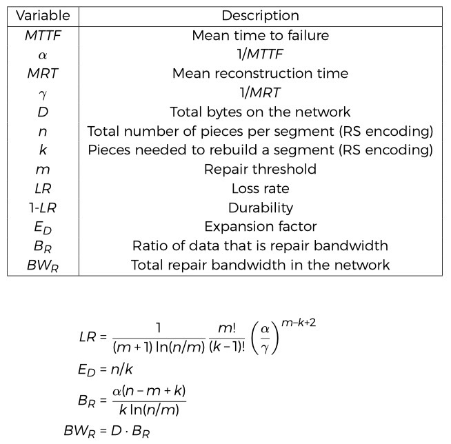
这些方程式表明，修复带宽受到节点波动线性影响可以预期。 较低的平均节点故障时间会触发更频繁的重建，因此会占用更多带宽。 丢失率对高节点波动更为敏感，因为它随 α 呈指数增长。 这需要非常稳定的节点（具有几个月的生命周期），以实现可接受的网络耐久性。 关于节点波动如何影响 EC 参数的更深入讨论，请参见第7.3节。

### 带宽限制了可用空间
修复会影响存储节点的带宽使用量之外的参与；它还限制了可用磁盘空间量。考虑一个具有 1 TB 可用空间的存储节点，其中规定的每月带宽限制为 500 GB。如果（通过上述框架）知道某个存储节点可以在给定的月份中修复其 50％ 的数据，并且假设每个存储的对象至少被服务了一次，那么在该节点上最多可以存储 333 GB 。因为除此以外的所有带宽都会导致带宽超出允许范围。换句话说，付费带宽加上修复带宽必须始终小于或等于带宽限制。

较高的修复率等于较低的有效存储大小，但是更频繁地提供付费数据的节点对此效果更敏感。实际上，付费带宽速率将随每个节点上存储的数据类型而变化。随着网络的不断发展，必须严格监控这些比率，以确定适当的可用空间限制。

### 审查误报风险
我们依靠贝叶斯方法来确定存储节点忠实地维护存储块的概率。从高层次上讲，我们试图回答以下问题：连续成功的审查如何改变我们对节点将继续返回成功审查的概率的估计？

我们将审查过程建模为具有未知成功概率 `p∈[0，1]` 的二项式随机变量，而每次审查都是独立的伯努利试验。众所周知，二项式分布的共轭先验是 β 分布 `β（a，b）`，后验也遵循 β 分布。与[83]一样，使用后验分布的均值作为贝叶斯估计量，它由 `P =（a + x）/（a + b + n）` 给出，其中 a，b 是先验分布的参数， x 是在 n 次审查中观察到的成功次数。在每次审查成功的假设下，我们得出成功概率的贝叶斯估计值 `P =（a + n）/（a + b + n）`。

我们选择一个先验，以根据执行的审查次数得出审查成功概率的数值估计。 贝叶斯先验有许多合理的选择，但我们将注意力集中在两个流行的选择上：

- 杰里·先验[84]。 

	使用均匀先验β（1，1）通过为所有可能的结果分配相等的概率来初始化实验； 也就是说，成功的概率来自于（0，1）的均匀分布。 
- Je ff rey 先验β（0.5，0.5）

	假设成功的概率朝着任一极端下降，因此节点将以概率接近0或概率接近1的方式返回成功的审查。

	
	
	在表7.1中，介绍了使用两种先验方法获得的结果。 我们注意到，完善的贝叶斯方法使我们能够迅速提高节点返回成功审查的能力的信心，因为每次连续审查成功，成功概率估计都趋于接近1。
	
### 选择删除参数
在将 EC 的段存储在分散的网络中的情况下，从两个不同的角度考虑丢失一个段。

- 直接件丢失

对于直接件丢失我们假设对于特定段，其擦除件会按一定速率丢失。我们指出，建模很简单：如果碎片以 `0 
t  形式的指数衰减模式，其中 t 为根据费率所用的单位经过的时间。(因此，如果假设每月损失 p=0.1 件的比例，则t以月为单位。) 为了说明每月要进行多次检查，可以在处将其扩展为 `n(1–p/a)at`。如果 m 是控制阈值何时重建的重建阈值，可以将 t=m 处的 `n(1 – p/a)` 求解为t（必要时采用上限），以确定 n 个 a 片段将花费多长时间。片段衰减到小于 m 个片段。得出最小的t，其中 。 因此，在给定参数 `n，m，a, p` 的情况下，可以清楚地看到段在维修之间要持续多长时间。

- 间接件损失

	在对间接件损失进行建模时，假设固定的节点每月(尽管可以在任何所需的时间间隔内获取费率)退出网络的数量为2，无论它们是否持有考虑中的段。为了描述丢掉的节点 d 分别存储 n 个特定段之一的概率，转向超几何概率分布。假设每月从网络上的 C 个总节点中替换 c 个节点。然后，d 个节点每个都存储一个段的概率由下式给出：

其平均值为 `nc/C`。然后通过迭代，固定总波动固定但通过每次迭代的分布均值减少现有工件的数量并计算所需的迭代次数，来确定要减少到所需阈值 m 以下的件数所需的时间 。例如，经过一轮迭代，现有件数减少了 `nc/C`，因此，网络上有`n-nc/C`件，而不是网络上的 n 件（作为（7.1）中的参数），同时更改了两个参数以及迭代2中（7.1）的平均值。

可以通过考虑每月进行多次检查来扩展该模型（如在直接件丢失情况下），假设 `c/a` 节点每月丢失 `1/a` ，而不是假设 `c/a` 节点每月丢失，其中 a 是每月支票的数量。这样就产生了具有平均 `nc/aC` 的初始超几何概率分布。	
在这两种情况下（每月进行一次或多次分段完整性检查），都会跟踪迭代次数，直到可用件数低于修复阈值为止。 然后，可以使用该数字来确定任何给定段每月的预期重建数量。

### 间接件损失的数值模拟
生成决策表（表7.2），该表显示了通过模拟使用变化的 Reed-Solomon 参数编码的片段的片段损失来显示最坏情况下的平均片段重建结果。假设一个（k，n）RS编码方案，其中使用 n 的三个不同值生成 n 个片段，其中 k 个需要重建。还假设当网络上剩余少于 m 个片段时，对一个网段进行修复，每个 n 使用三个不同的 m 值。对于初始表，使用简化的假设，即网络上的碎片每月以固定速率丢失(可能是由于节点流失，数据损坏或其他问题所致。)

为了得出每月平均重建的值，考虑用 n 个片段编码的单个段，该段均匀地随机分布到网络上的节点。为了模拟导致重建的条件，从总数量中统一随机选择节点的子集，并将其指定为失败。每个（模拟）月多次执行此操作，根据每月分段完整性检查的次数线性地降低件丢失率。 

一旦有足够多的节点未能使碎片数超过维修阈值 m，便会重建该段，并且我们会跟踪 24个月内的重建次数。重复此仿真过程 1000 次迭代，在单个段中仿真 1000 个为期两年的周期。然后，以在这 1000 次迭代中发生的重建数量的第 99 个百分点（或更高）得出重建数量。换句话说，我们选择一个值作为观察到的累积分布函数（CDF）的值（至少是0.99），该值描述了两年期间的重建数量。然后，将该值除以月份数，得出平均重建数/月值。该方法的一个示例如图7.3所示。我们在 10,000个节点的网络上进行了实验，观察到在每月固定损失率的工作假设下，网络规模不会直接影响单个网段的平均重建/每月价值。 

在形成决策表时，将k，n，m和平均失效时间的不同选择作为影响计算的一部分，以影响耐用性和维修带宽。

- 该恒定速率可以看作是每月泊松分布建模件损失的平均值。
- 例如，如果假设每月的网络碎片丢失率是网络规模的0.1（或10％），并且如果每月执行10次网段完整性检查，则假设平均丢失1％的碎片在检查之间。
- 将件损失表示为从整个网络中均匀随机选择的节点的比例。 比例直接与网络大小成比例，因此对于不同大小的网络，丢失的总块数保持不变。

正在寻找的是最低的维修带宽，也能满足耐用性要求

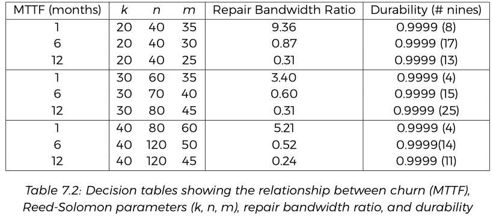

### 结论
通过观察可以得出结论，这些模型可以针对特定的网络方案和需求进行调整。 一个网络可能需要一组 Reed-Solomon 参数，而另一个网络可能需要另一组。 通常，m/n 越接近1，则在固定的流失率下，每月应该进行的重建越多。 对于任何给定的客户流失率而言，较大的 m/n 比率都会提高文件的耐用性，但这样做的代价是要使用更多的带宽，因为维修的触发频率更高。 为了保持较低的每月平均重建成本，同时又保持较高的文件耐用性，目标应该是在给定其他网络条件（延迟，下载速度等）的情况下，将 n 的值尽可能地增加，这可以降低 m 的相对值，同时仍然不会损害文件的耐用性。

在非正式情况下，在给定的固定网络规模和客户流失率下，丢失更多作品所花费的时间更长。因此，为了在最大程度地提高耐用性的同时最大程度地减少维修带宽的使用，n 应该与现有网络条件允许的大小一样大。这允许 m 的值相对更接近 k，从而减少了平均重建/月值，进而降低了所使用的维修带宽量。

例如，假设有一个平均故障时间为六个月的网络。假设考虑用两个不同的 RS 参数编码的同一文件：

- 一个在（20，40）模式下
- 另一个在（30，80）模式下。

如果我们在两种情况下都将 m 设置为 `m=k+10` ，则从上表中观察到

- 在（20，40）情况下带宽修复率为0.87
- 在（40，80）情况下带宽修复率为0.60。

两种编码方案具有相似的耐用性，因为当剩余 `k + 10` 件时，两种情况下都会触发修复。即使在使用 `m = k + 10` 的（40，80）情况下，根据经验和理论，每月重建的平均值在理论上也较低。

## 去中心化共识
为了解释为什么我们不尝试解决拜占庭式分布式共识，值得对分布式共识的历史进行简短的讨论。
### 非拜占庭式分布式共识
计算机化数据存储系统从一开始就必须由一台计算机自行存储和检索数据。不幸的是，在系统必须一直持续运行的环境中，单台计算机故障可能会使服务陷入停顿。结果，研究人员经常寻求使计算机组能够管理数据而无需操作任何特定计算机的方法。在多台计算机之间分散数据所有权可能会在出现故障时延长正常运行时间，通过将工作分散到更多处理器上来增加吞吐量，等等。这个研究领域是漫长而富有挑战性的。但幸运的是，它带来了一些非常令人兴奋的技术。

使一组计算机达成一致的最大问题是消息可能会丢失。 “两位将军的问题” [85]简要地描述了这如何影响决策。在其中，两军试图面对可能丢失的信息进行交流。两军已经同意攻击一个共同的敌人，但尚未决定时间。两军必须同时进攻，否则将确保失败。两军都可以派遣使者，但使者往往被敌人俘虏。两军都必须知道什么时间发动进攻，另一支军队也已经同意了这一时间。

最终，用有限的信息来解决两个将军问题的通用解决方案是不可能的，因此工程方法必须必须包含不确定性。许多分布式系统都采取交易的方式来应对这种不确定性。某些系统具有一致性，这意味着系统将选择停机时间而不是不一致的答案。其他系统包含可用性，这意味着系统会在停机期间选择可能不一致的答案。广泛引用的 CAP 定理[12,13]指出，每个系统都只能选择一致性、可用性和分区容忍度中的两个。由于网络故障的必然性，分区容忍度是不可协商的，因此，发生分区时，每个系统都必须选择牺牲一致性或可用性。许多系统都牺牲了这两者（有时是偶然的）。

在CAP定理中，一致性（特别是线性化）意味着每次读取都会接收到最新的写入或错误，因此不一致的答案意味着系统除了返回最近的写入外还返回了其他内容而没有发生明显的故障。更一般而言，通过进行各种折衷，可以接受许多其他一致性模型。

- 线性化
- 顺序一致性
- 因果一致性
- PRAM一致性
- 最终一致性
- 写后读一致性等

都是用于讨论事件历史如何显示给分布式系统中的各个参与者的模型。 

S3 通常提供写入后读取的一致性，尽管在某些情况下会提供最终的一致性[89]。默认情况下，许多分布式数据库都会提供最终的一致性，例如 Dynamo [25]和Cassandra [63]。

分布式系统中的线性化通常比一致性较弱的模型更为可取，因为它可作为许多更高级别数据结构和操作（例如分布式锁和其他协调技术）的构建块。最初，建立线性化的分布式共识的早期努力集中在两阶段提交，然后是三阶段提交，由于与两位将军的问题类似的问题，两者都失败了。 1985年，FLP不可能论文[90]证明没有算法可以在有限时间内达成线性化共识。然后在1988年，Barbara Liskov和Brian Oki发布了Viewstamped复制算法[91]，这是第一个线性化的分布式共识算法。 Leslie Lamport不了解VR出版物，开始证明不可能进行线性化的分布式共识[92]，但在1989年证明可以通过发布自己的Paxos算法来实现[93]，尽管该算法没有被广泛采用，但它变得更为流行。直到1998年才正式发表在期刊上。最终，这两种算法都有很多共同点。

尽管 Lamport 声称 Paxos 很简单[94]，但此后却发表了许多论文，对这一主张提出了挑战。 Google 对他们实施 Paxos 的尝试的描述在 Paxos Made Live [95]中进行了描述，而 Paxos Made 中度复杂[96]是对协议所有细节的尝试。 Raft 算法的整个基础植根于试图纠缠并简化 Paxos 的复杂性[24]。最终，经过几十年的苦恼，现在已经存在 Paxos，Raft，Viewstamped Replication [97]，Chain Replication [98] 和 Zab [99] 的可靠实现，并且正在进行进一步的工作以进一步改善这种情况[100，101]。可以说，谷歌早期成功的一部分是花费时间来构建其内部 Paxos 即服务分布式锁系统 Chubby [102]。 Google 大多数著名的早期内部数据存储工具，例如 Bigtable [103]，都依靠 Chubby 来确保正确性。 Spanner [64]-也许是世界上最不可思议的分布式数据库之一，基本上只是两个 Paxos 组之上的两阶段提交。

### 拜占庭分布式共识
正如我们在设计约束中提到的那样，我们希望大多数节点是有理数的，有些是拜占庭式的，但很少是无私的。不幸的是，我们讨论的所有以前的算法都假设一个无私性节点的集合。对于许多需要容错存储的应用程序来说，可靠的分布式共识算法已经改变了游戏规则。但是，在拜占庭容错世界中，情况则更复杂。

已经进行了许多尝试来解决拜占庭容错的分布式共识问题。比特币发行后，该领域爆发了[23]，并且仍处于早期阶段。值得注意的是，我们对 PBFT [104]（再次使用第一个解决方案的 Barbara Liskov），Q / U [105]，FaB [106]（但请参阅[107]），比特币，Zyzzyva [108]特别感兴趣。另请参阅[107]），RBFT [109]，Tangaroa [110]，Tendermint [111]，Aliph [112]，Hashgraph [113]，HoneybadgerBFT [114]，Algorand [115]，Casper [116]，Tangle [117] ]，Avalanche [118]，PARSEC [119]和其他[120]。

这些算法中的每一个都产生了额外的折衷，这是非拜占庭式分布式共识算法所不需要的，以应对潜在的不合作节点。例如，PBFT [104] 导致大量的网络开销。在PBFT 中，每个客户都必须尝试与大多数参与者交谈，而所有参与者都必须分别回复该客户。比特币[23]会随着工作量证明难度的变化有意地限制交易速率。许多其他的后比特币协议要求所有参与者保留所有变更历史的完整副本。
### 为什么要避免拜占庭式的分布式共识
最终，所有现有解决方案均达不到我们将协调最小化的目标（请参阅第2.10节）。 柔性 Paxos [101] 在稳态下比普通 Paxos 显着好于避免协调，但在拜占庭环境中完全不可用。 分布式分类帐或“类似缠结”的方法将无法修剪历史记录并保留大量的全局协调开销。

我们期待快速、可扩展的拜占庭容错解决方案。 在前面的讨论中可能已经列出了一个构建基块。 直到很明显已经出现问题为止，我们通过完全避免该问题来降低风险。

与任何分布式系统一样，存在多种攻击媒介。 其中许多是所有分布式系统共有的。 有些是特定于存储的，将适用于任何分布式存储系统。

- 斯巴达克斯攻击(Spartacus)

	在未经修改的 Kademlia 上可能发生斯巴达克斯攻击或身份劫持[8]。 任何节点都可以假定另一个节点的身份，并通过简单地复制其节点ID来接收打算发送给该节点的部分消息。 这样就可以针对特定的节点和数据进行有针对性的攻击。 S/Kademlia [32] 通过将节点ID实施为公钥散列并要求对消息进行签名来解决 Spartacus 攻击缓解问题。 此系统中的 Spartacus 攻击者将无法生成相应的私钥，因此无法签名消息并参与网络。
- 西比尔攻击(Sybil)

	Sybil攻击[74]涉及创建大量节点，以试图通过劫持或丢弃消息来破坏网络运行。 尽管 Kademlia [8] 容易受到 Sybil 攻击，但是我们采用 S/Kademlia [32] 生成工作身份证明（第4.4节）在一定程度上降低了该漏洞。

	此外，我们的存储节点信誉系统涉及到延长的初始审查期，节点必须先完成才能在 Kademlia 路由表中获得大量数据或成员身份的信任。 在第4.6.1和4.15节中将详细讨论该审查系统，以防止大量新节点在未首先证明其使用寿命的情况下从现有信誉良好的存储节点获取传入数据。
- 日蚀\日食攻击(Eclipse)

	Eclipse 攻击试图通过确保所有出站连接均到达恶意节点来隔离网络图中的一个节点或一组节点。 Eclipse 攻击很难识别，因为在大多数情况下，可以使恶意节点正常运行，而这只会使某些重要的消息或信息黯然失色。 Storj 通过使用公钥哈希作为节点 ID，基于这些公钥的签名以及 S/Kademlia [32] 规定的多个不相交的网络查找来解决 Eclipse 攻击。

	网络越大，防止节点发现不受攻击者控制的网络部分的难度就越大。只要将存储节点或 Satellite 引入了不受攻击者任何时候控制的网络部分，公钥哈希和签名就可以确保中间人攻击是不可能的，并且多个不相交网络查询可确保对 Kademlia 路由的偏爱成本过高。

	为了避免 Eclipse 攻击，剩下的就是确保在引导过程中将新节点适当地引入到网络上至少一个运行良好的节点上。为此，Storj Labs 将运行一些知名的，经过验证的引导节点。
- 诚实的吉普托(Honest Geppetto)

	在这种攻击中，攻击者在网络上运行大量 `木偶` 存储节点，随着时间的推移积累信誉和数据。 一旦达到某个阈值，攻击者就劫持所有木偶上的数据，以对所涉及的数据进行人质攻击，或者简单地从网络中删除每个存储节点。 应对这种攻击的最佳防御方法是创建一个足够规模的网络，以证明这种攻击是无效的。 同时，可以通过存储节点的相关性分析部分地防止这种情况。 跨停机时间、延迟、网络路由和其他属性的贝叶斯推断可用于评估两个存储节点由同一组织操作的可能性。 卫星可以而且应该尝试在尽可能多的不相关的存储节点上分配碎片。
- 作弊的存储节点、上行链路或卫星

	使用签名测量带宽可最大程度地降低上行链路和存储节点的风险。 上行链路只能通过发送签名的受限分配来与存储节点进行交互。 限制将风险限制在非常低的水平。 存储节点必须符合预期的协议，才能获得更多受限制的分配。 存储节点和卫星将开始审查过程，以限制其暴露范围。 允许存储节点拒绝来自不受信任的 Satellite 的请求
- 不忠实的存储节点和卫星

	虽然存储节点和 Satellite 被构建为在请求下载请求之前需要通过签名进行身份验证，但可以想象对存储节点或 Satellite 的修改将为任何付费请求者提供下载。 即使在具有不可靠卫星的网络中，数据隐私也不会受到显着损害。 强大的客户端加密可保护文件内容免遭检查。 Storj 并非旨在防止受到侵害的客户端。
- 失败的审查攻击

	典型的 Merkle 证明验证需要预先生成的挑战和响应。 如果没有这些挑战的定期再生，则存储节点可以开始通过大多数审查，而无需存储所有请求的数据。 相反，我们要求所有存储节点随机分配擦除份额。 我们在所有擦除份额上运行 Berlekamp-Welch 算法[73]。 当足够多的存储节点返回正确的信息时，可以轻松地识别出任何错误或丢失的响应。 新的存储节点将进入审查过程，直到通过足够的审查为止。 有关更多详细信息，请参见第4.15节。

## 主要用户的利益
与本地存储解决方案或传统的集中式云存储相比，Storj 网络的目的是在各种使用案例中为用户提供更好的安全性、可用性、性能和经济性。 虽然本文的大部分内容描述了克服高度分散的系统所面临的挑战的设计注意事项，但本附录描述了为什么最终结果应该比传统方法有显着改进。
### 安全
我们设计的系统等效于在加密的海滩上散布加密的沙子。所有数据在到达系统之前都是在客户端加密的。数据在大量独立运行的磁盘驱动器中进行分片和分发，而这些磁盘驱动器是独立运行的存储节点的更大网络的一部分。

在典型情况下（使用 20/40 Reed-Solomon设置），每个文件分布在由 100,000 个独立操作的节点组成的全球网络中的 40 个不同的磁盘驱动器中。 （Storj 网络的先前版本有超过 150,000 个独立运行的节点。）要破坏单个文件，一个可能会成为坏蛋的行为者必须在以下网络中找到并破坏大约 40 个不同的驱动器，每个驱动器均由不同的提供商进行操作超过 100,000 个驱动器。即使 actor 能够以某种方式破坏这些驱动器以重建文件，潜在的坏 actor 也将不得不使用仅由最终用户持有的密钥来解密 256 位 AES 加密数据。而且，可能会成为非法用户的他们将不得不为他们希望获得的下一个文件使用一组完全不同的潜在驱动力来重复此过程。

根据设计，Storj、Satellite 运营商、存储节点运营商或不良行为者不可能挖掘或破坏最终用户数据。网络上的分散级别对恶意行为者产生了强大的抑制作用，因为没有针对性的集中数据宝库。
### 可用性
尽管大多数集中式云提供商采用各种策略来提供针对单个驱动器故障的保护，但它们并不能不受系统范围内事件的影响。暴风雨，停电，洪水，地震，运营商错误，设计漏洞，网络过载或攻击可能会损害整个数据中心。

尽管集中式提供程序可以计算并发布理论上的高可用性编号，但这些计算取决于不相关的驱动器故障。实际上，在任何数据中心中，单个驱动器发生故障的机率与另一个驱动器发生故障的机率高度相关。

相比之下，在分散式系统中，每个节点都是由不同的人在不同的位置操作的，他们的人员，权力，网络访问权限等等都是分开的。因此，单个节点发生故障的机会与其他驱动器发生故障的机会几乎完全无关。结果，我们获得的可用性不会受到暴风雨，断电或其他“黑天鹅”事件的影响。即使 Storj 网络中单个驱动器发生故障的机会高于集中式云中出现故障的机会，集体出现故障的可能性（例如，丢失40个独立驱动器中的20个）的可能性也很小。此外，丢失一个文件的机会与丢失第二个文件的机会无关。
### 性能
对于需要大量读取的用例，Storj 网络可以利用并行性来提供卓越的性能。 存储节点位于“边缘”附近，从而减少了当数据接收方物理上远离容纳数据的数据中心时所经历的等待时间。 读取性能受益于并行性。 我们使用的特定 EC 方案可确保慢速驱动器，慢速网络或暂时承受高负载的网络和驱动器不会限制吞吐量。 我们可以调整 k/n 比率，以便在不增加与CDN网络相关的高昂成本的情况下，大大提高下载和流式传输的速度。
### 经济性
尽管全球创建的数据量每年都在增加一倍，但在过去三年中，云存储的价格每年仅下降了约 10％。在供应和需求方面都有许多潜在的解释。

公共云存储运营商必须在建立数据中心网络上进行大量资本投资，并且必须承担大量的电力，人员，安全，火力抑制等费用。他们的定价结构必须允许他们收回这些费用。而该行业的结构本质上是寡头垄断的：只有少数的公共云公司，并且按市值计算，它们构成了全球最大的公司（微软，谷歌，亚马逊，阿里巴巴）。由于一个提供者的任何价格下降都能很快与其他提供者相提并论，因此，提供者降低价格以获得市场份额的动机很少。

相反，在分散网络中，成为存储节点运营商的边际成本很小。根据我们的经验，绝大多数运营商正在使用具有大量备用能力的现有带电设备。就资金或人员而言，存储节点运营商没有任何额外成本。全容量运行驱动器不涉及第C章。

与运行具有过多空间的驱动器相比，其功耗要大得多。而且，通过对封顶进行仔细的管理，大多数运营商都不会经历带宽成本的增加。因此，操作节点几乎代表了纯利润，这些节省的供应成本可以转嫁给最终用户。

我们还设计了需求方面的市场机制，以防止任何卫星运营商垄断市场。即使为农民，需求合作伙伴和卫星运营商提供了可观的利润，我们相信我们也应该能够以相当于同等集中式云存储提供商的一小部分成本提供可盈利的存储服务。
## 参考
1.  [身份盗用资源中心和 Cyber​​Scout。从2005年到2018年，美国每年的数据泄露和公开记录数量（百万）](https://www.statista.com/statistics/273550/data-breaches-recorded-in-the-unitedstates-by-number-of-breaches-and-records-exposed/) - 2018
-  [知识库智能 LLP。云存储市场-从2017年到2022年的预测](https://www.researchandmarkets.com/research/lf8wbx/cloud_storage) - 2017年
- [丹·希勒（Dan Shearer）欧盟-美国云隐私崩溃](https://kopano.com/kopano-documents/EU-US-Cloud-Privacy.pdf) - 2017年
- [Gartner Inc. Gartner 预测，2018年全球公共云收入将增长21.4％。](https://www.gartner.com/en/newsroom/press-releases/2018-0412-gartner-forecasts-worldwide-public-cloud-revenue-to-grow-21-percent-in-2018) -2018年
- [协同研究小组。第一季度云增长率再次提高；亚马逊保持市场份额的主导地位。](https://www.srgresearch.com/articles/cloudgrowth-rate-increased-again-q1-amazon-maintains-market-share-dominance)-2018年
- [Backblaze Inc.硬盘驱动器能持续多久：2018年硬盘驱动器统计。](https://www.backblaze.com/blog/hard-drive-stats-for-q1-2018/)-2018
- 肖恩·李（Sean Rhea），丹尼斯·盖尔斯（Dennis Geels），蒂莫西·罗斯科（Timothy Roscoe）和约翰·库比亚托维奇（John Kubiatowicz）。在DHT中处理客户流失。在USENIX年度技术会议的年度会议记录中，ATEC ’04，第10页，美国加利福尼亚州伯克利，2004年。USENIX协会。
- Petar Maymounkov和DavidMazières。 Kademlia：基于XOR指标的对等信息系统。在第一届国际对等系统国际研讨会的修订文件中，IPTPS ’01，第53-65页，英国伦敦，2002年。Springer-Verlag。
- 查尔斯·布莱克（Charles Blake）和罗德里戈·罗德里格斯（Rodrigo Rodrigues）。高可用性，可扩展的存储，动态对等网络：选择两个。在“第9届操作系统热门主题会议论文集-第9卷，HOTOS’03，第1页，美国加利福尼亚州伯克利，2003年”。USENIX协会。
- [Comcast Inc. XFINITY数据使用中心-常见问题解答。]( https://dataplan.xfinity.com/faq/)-2018年
- Amitanand S. Aiyer，Lorenzo Alvisi，Allen Clement，Mike Dahlin，Jean-Philippe Martin和Carl Porth。 BAR协作服务的容错能力。在《第二十届ACM操作系统原理研讨会论文集》中，SOSP ’05，第45-58页，纽约，纽约，美国，2005年。ACM。
- 塞思·吉尔伯特（Seth Gilbert）和南希·林奇（Nancy Lynch）。 Brewer的猜想以及一致，可用，可容忍分区的Web服务的可行性。 SIGACT新闻，33（2）：51-59，2002年6月。
- 塞思·吉尔伯特（Seth Gilbert）和南希·林奇（Nancy Lynch）。关于CAP定理的观点。计算机，45（2）：30-36，2012年2月。
- 丹尼尔·阿巴迪（Daniel Abadi）。现代分布式数据库系统设计中的一致性交易：CAP只是故事的一部分。计算机，45（2）：37-42，2012年2月。
- 彼得·贝利斯（Peter Bailis），亚伦·戴维森（Aaron Davidson），艾伦·费克特（Alan Fekete），阿里·戈德西（Ali Ghodsi），约瑟夫·M·赫勒斯坦（Joseph M. Hellerstein）和伊恩·斯托伊卡（Ion Stoica）。高度可用的交易：美德和局限。程序。 VLDB Endow。，7（3）：181–192，2013年11月。
- 彼得·贝利斯（Peter Bailis），艾伦·费克特（Alan Fekete），迈克尔·弗兰克林（Michael J. Franklin），阿里·戈德西（Ali Ghodsi），约瑟夫·M·赫勒斯坦（Joseph M. Hellerstein）和伊恩·斯托伊卡（Ion Stoica）。数据库系统中的协调避免。程序。 VLDB Endow。，8（3）：185–196，2014年11月。
- 吴承刚，何塞·法莱罗，林依汉和约瑟夫·海勒斯坦。安娜：任何规模的KVS。 ICDE，2018年。
- 约瑟夫·海勒斯坦。声明式命令：分布式逻辑中的经验和猜想。 SIGMOD建议，39（1）：5-19，2010年9月
- 彼得·阿尔瓦罗（Peter Alvaro），尼尔·康威（Neil Conway），约瑟夫·M·赫勒斯坦（Joseph M. Hellerstein）和威廉·R·马尔恰克（William R. Marczak）Bloom中的一致性分析：一种CALM和汇总方法。 CIDR，2011年
- [凯尔·金斯伯里（Kyle Kingsbury）。一致性模型可点击的地图。]( https://jepsen.io/consistency) - 2018年
- Paolo Viotti和MarkoVukolić。非事务性分布式存储系统中的一致性。 ACM计算。 Surv。，2016年6月，49（1）：19：1–19：34
- [约瑟夫·海勒斯坦。安娜：疯狂的快速，可扩展，极其一致的KVS。](https://rise.cs.berkeley.edu/blog/anna-kvs/)-2018
- [中本聪。比特币：点对点的电子现金系统](https://bitcoin.org/bitcoin.pdf)2008年。
- Diego Ongaro和John Ousterhout。寻找一种可以理解的共识算法。在USENIX年度技术会议的2014 USENIX会议记录中，USENIX ATC’14，第305-320页，美国加利福尼亚州伯克利，2014年。USENIX协会。
- 朱塞佩·德坎迪亚（Giuseppe DeCandia），德尼兹·哈斯托伦（Deniz Hastorun），马丹·詹帕尼（Madan Jampani），古纳瓦汉·卡库拉帕蒂（Gunavardhan Kakulapati），阿维纳什·拉克什曼（Avinash Lakshman），亚历克斯·皮尔钦（Alex Pilchin），斯瓦米纳坦·西瓦苏布拉曼尼亚人，彼得·沃索尔（Peter Vosshall）和维尔纳·沃格斯（Werner Vogels）。 Dynamo：亚马逊的高可用键值存储。在《 ACM第二十届ACM SIGOPS操作系统原则研讨会论文集》中，SOSP '07，第205-220页，纽约，纽约，美国，2007年。ACM。
- Sanjay Ghemawat，Howard Gobio ff和Shun-Tak Leung。 Google文件系统。在第十九届ACM操作系统原则研讨会论文集中，SOSP ’03，第29-43页，纽约，纽约，美国，2003年。ACM
- Konstantin Shvachko，Hairong Kuang，Sanjay Radia和Robert Chansler。 Hadoop分布式文件系统。在2010年IEEE第26届大容量存储系统和技术研讨会（MSST）的会议记录中，MSST ’10，第1-10页，华盛顿特区，美国，​​2010年。IEEE计算机协会。
- [Lustre。 Lustre体系结构简介](http://wiki.lustre.org/images/6/64/LustreArchitecture-v4.pdf)-2017年。
- [J. Rosenberg，R。Mahy，P。Matthews和D. Wing。 NAT的会话遍历实用程序（STUN）。 RFC 5389，RFC编辑器](http：//www.rfc-editor.org/rfc/rfc5389.txt)-2008年10月
-  ISO / IEC 29341-1：2011：信息技术-UPnP设备架构，2011年。
- [S. Cheshire和M. Krochmal。 NAT端口映射协议（NAT-PMP）。 RFC 6886，RFC编辑器](http：//www.rfc-editor.org/rfc/rfc6886.txt)-2013年4月
- 英格玛·鲍姆加特（Ingmar Baumgart）和塞巴斯蒂安·密斯（Sebastian Mies）。 S/Kademlia：一种可行的方法来实现基于密钥的安全路由。在ICPADS中，第1-8页。 IEEE计算机协会，2007年。
- [P. Mockapetris。域名-实现和规范。 STD 13，RFC编辑器](http：//www.rfc-editor.org/rfc/rfc1035.txt)-1987年11月
- Ion Stoica，Robert Morris，David Karger，M。Frans Kaashoek和Hari Balakrishnan。Chord：针对Internet应用程序的可扩展对等查找服务。在2001年计算机通信的应用程序，技术，体系结构和协议会议上，SIGCOMM ’01，第149-160页，美国纽约，2001年。ACM。
- 安东尼·T·罗斯特隆和彼得·德鲁舍尔。糕点：可扩展，分散的对象位置，以及用于大型对等系统的路由。在IFIP / ACM国际分布式系统平台会议上的会议记录，海德堡，中间件’01，第329-350页，英国伦敦，2001年。Springer-Verlag。
- FrédéricGiroire，朱利安·蒙泰罗（Julian Monteiro）和斯特凡·佩伦斯（StéphanePérennes）。对等存储系统：懒惰的实用指南。 IEEE全球通信会议（GlobeCom），2010年12月
-  [肖恩·威尔金森（Shawn Wilkinson），多美·波谢夫斯基（Tome Boshevski），乔什·布兰多（Josh Brando ff），詹姆斯·普雷斯特维奇（James Prestwich），戈登·霍尔（Gordon Hall），帕特里克·格贝斯（Patrick Gerbes），菲利普·哈钦斯（Philip Hutchins）和克里斯·波拉德（Chris Pollard）。 Storj：点对点云存储网络v2.0。](https://storj.io/storjv2.pdf)-2016年
- Vijay K. Bhargava，Stephen B. Wicker，IEEE通信学会和IEEE信息理论学会。 Reed-Solomon代码及其应用程序/ Stephen B. Wicker，Vijay K. Bhargava编辑； IEEE通信协会和IEEE信息理论协会，共同发起人。 IEEE Press Piscataway，新泽西州，1994年。
- [Je ff Wendling和JT Olds。里德-所罗门介绍。](https://innovation.vivint.com/introduction-to-reed-solomon-bc264d0794f8)- 2017
- 内塔内尔·拉维夫（Netanel Raviv），尤瓦尔·卡苏托（Yuval Cassuto），拉米·科恩（Rami Cohen）和莫西·施瓦兹（Moshe Schwartz）在存在散乱的情况下对标量代码的擦除校正。 CoRR，abs / 1802.02265，2018年。
- 凯文·鲍尔斯（Kevin D. Bowers），阿里·尤尔斯（Ari Juels）和阿丽娜·奥普里亚（Alina Oprea）。冰雹：云存储的高可用性和完整性层。在第16届ACM计算机和通信安全会议论文集中，CCS ’09，第187–198页，美国纽约，2009年。ACM。
- [Zooko Wilcox。 zfec：filefec.py的encode_file。](https://github.com/tahoe-lafs/zfec/commit/2594d395923dd945cd62)-2007年。
- 杰里·迪安（Je ff rey Dean）和路易斯·安德烈·巴罗佐（LuizAndréBarroso）。规模化的尾巴。 ACM通讯，56：74-80，2013年。
- Je ff rey Dean和Sanjay Ghemawat。 MapReduce：简化大型集群上的数据处理。公社ACM，51（1）：107-113，2008年1月。
- J. Paiva和L. Rodrigues。 P2P系统中有效数据复制的策略。在2013年并行和分布式系统国际会议上，第404-411页，2013年12月。
- [彼得·乌耶（Peter Wuille）。 BIP32：分层确定性钱包](https://github.com/bitcoin/bips/blob/master/bip-0032.mediawiki)-2012年。
- Ari Juels和Burton S. Kaliski，小POR：大文件的可检索性证明。在第14届ACM计算机和通信安全会议论文集中，CCS ’07，第584-597页，美国纽约，2007年。ACM。
- 霍瓦夫·沙坎（Hovav Shacham）和布伦特·沃特斯（Brent Waters）。可检索性的紧凑证明。在第14届国际密码学和信息安全理论与应用国际会议论文集：ASIACRYPT ’08，第90-107页，柏林，海德堡，2008年。Springer-Verlag。
- Kevin D. Bowers，Ari Juels和Alina Oprea。可检索性证明：理论和实施。在2009年ACM关于云计算安全性的研讨会论文集中，CCSW ′09，第43–54页，美国纽约，纽约，2009年。ACM。
- [肖恩·威尔金森（Shawn Wilkinson）。 SIP01：SIP目的和指南（2016）]( https://github.com/storj/sips/blob/master/sip-0001.md)。
- Michael Ovsiannikov，Silvius Rus，Damian Reeves，Paul Sutter，Sriram Rao和Jim Kelly。 Quantcast文件系统。程序。 VLDB Endow。，6（11）：1092-1110，2013年8月。
- Salman Niazi，Mahmoud Ismail，Seif Haridi，Jim Dowling，Ste ff en Grohsschmiedt和MikaelRonström。 HopsFS：使用 newSQL 数据库扩展分层文件系统元数据。在第15届Usenix文件和存储技术会议论文集中，FAST’17，第89–103页，美国加利福尼亚州伯克利，2017年。USENIX协会。
- [D.理查德·希普（Richard Hipp）等。 SQLite]( https://www.sqlite.org/)-2000年
- [Google Inc.什么是gRPC？](https://grpc.io/docs/guides/index.html)-2018年访问
-  [T. Dierks和E. Rescorla。传输层安全性（TLS）协议版本1.2。RFC 5246，RFC编辑器](http：//www.rfc-editor.org/rfc/rfc5246.txt)-2008年8月。
- [Arvid Norberg。 uTorrent传输协议](http://www.bittorrent.org/beps/bep_0029.html)-2009年
- [S. Shalunov，G。Hazel，J。Iyengar和M. Kuehlewind。低额外延迟背景传输（LEDBAT）。 RFC 6817，RFC编辑器](http：//www.rfc-editor.org/rfc/rfc6817.txt)-2012年12月。
- [特雷弗·佩林（Trevor Perrin）。噪声协议框架](https://noiseprotocol.org/noise.pdf)-2018年。
- 欧文·S·里德和古斯塔夫·所罗门。某些有限域上的多项式代码。工业和应用数学协会学报，8（2）：300–304，1960年。
- [Amazon Inc. Amazon简单存储服务-对象元数据]。(https://docs.aws.amazon.com/AmazonS3/latest/dev/UsingMetadata.html)- 2018。
- [陶马。 ext4：添加内联数据支持]( https://lwn.net/Articles/468678/)-2011年
- [布拉姆·科恩（Bram Cohen）。 BitTorrent协议规范。](http://www.bittorrent.org/beps/bep_0003.html)-2008年。
- Avinash Lakshman和Prashant Malik。 Cassandra：分散的结构化存储系统。 SIGOPS歌剧。 Syst。修订版，44（2）：35-40，2010年4月。
- 詹姆斯·C·科贝特（James C. Corbett），杰里·迪安（Je ff rey Dean），迈克尔·爱泼斯坦（Michael Epstein），安德鲁·菲克斯（Andrew Fikes），克里斯托弗·弗罗斯特（Christopher Frost），约翰·弗曼（JJ Furman），桑杰·格玛瓦（Sanjay Ghemawat），安德烈·古巴列夫（Christopher Heiser），彼得·霍奇希尔德（Peter Hochschild），谢伟森，塞巴斯蒂安·坎塔克（Sebastian Kanthak），尤金·科根（Eugene Kogan），李洪一， Sergey Melnik，David Mwaura，David Nagle，Sean Quinlan，Rajesh Rao，Lindsay Rolig，Dale Woodford，Yasushi Saito，Christopher Taylor，Michal Szymaniak和Ruth Wang。扳手：Google的全球分布数据库。在OSDI中，2012年。
- [Eugen Rochko等人。 Mastodon：您的自托管，全球互连的微博社区。]( https://github.com/tootsuite/mastodon)-2016年。
- [丹尼尔·伯恩斯坦（Daniel J. Bernstein）。 NaCl 中的密码学。](https://cr.yp.to/highspeed/naclcrypto-20090310.pdf)-2009年。
- [丹尼尔·伯恩斯坦（Daniel J. Bernstein）。 NaCl 验证和验证。]( https://nacl.cr.yp.to/valid.html)，2016年。
- Arnar Birgisson，Joe Gibbs Politz，ÚlfarErlingsson，Ankur Taly，Michael Vrable和Mark Lentczner。蛋白杏仁饼干：具有上下文警告的Cookie，可在云中进行分散授权。在网络和分布式系统安全研讨会上，2014年。
- 李金元，Maxwell Krohn，DavidMazières和Dennis Shasha。安全不受信任的数据存储库（SUNDR）。在第六届“光学系统设计与实现研讨会”会议论文集，第6卷，OSDI’04，第9–9页，美国加利福尼亚州伯克利，2004年。USENIX协会。
- 欧恩·金（Eu-Jin Goh），霍瓦夫·沙汉（Hovav Shacham），纳根德拉·莫达杜古（Nagendra Modadugu）和丹·博内（Dan Boneh）。 SiRiUS：保护远程不受信任的存储。在NDSS中，第3卷，第131-145页，2003年。
- Mahesh Kallahalla，Erik Riedel，Ram Swaminathan，Qian Wang和Kevin Fu。Plutus：在不受信任的存储上可扩展的安全文件共享。在2003年第2届美国USENIX文件和存储技术会议论文集中，FAST ’03，第29-42页，美国加利福尼亚州伯克利。USENIX协会。
- 拉尔夫·默克尔（Ralph C. Merkle）。基于常规加密功能的数字签名。在Carl Pomerance中，《密码学进展— CRYPTO ’87》的编辑，第369–378页，柏林，海德堡，1988年。Springer。
- 劳埃德·韦尔奇（Lloyd R. Welch）和埃尔温·R·贝勒坎普（Elwyn R. Berlekamp）。代数分组码的纠错。美国专利US4633470A，1986。
- 约翰·杜塞（John R. Douceur）。 Sybil攻击。在第一届国际对等系统国际研讨会的修订文件中，IPTPS ’01，第251-260页，英国伦敦，2002年。Springer-Verlag。
- [肖恩·威尔金森（Shawn Wilkinson）和詹姆斯·普雷斯蒂奇（James Prestwich）。 SIP02：以身份成本限制Sybil攻击（2016）。]( https://github.com/Storj/sips/blob/master/sip-0002.md)。
- Michael Mitzenmacher。随机负载平衡中两种选择的力量。 IEEE Trans。并行分配。 Syst。，12（10）：1094-1104，2001年10月。
- [ Fabian Vogelsteller和Vitalik Buterin。 ERC-20令牌标准](https://github.com/ethereum/EIPs/blob/master/EIPS/eip-20.md)-2015年
- [布赖登·富勒。 SIP09：带宽信誉和计费（2017）](https://github.com/Storj/sips/blob/master/sip-0009.md)。
-  B. C. Neuman。分布式系统的基于代理的授权和计费。1993年5月，在第13届国际分布式计算系统会议上，第283-291页。
- 布鲁斯·施耐尔。 《应用密码学》（第二版）：C。John Wiley＆Sons，Inc.（美国纽约州），1995年的协议，算法和源代码。
- [协议实验室。 Filecoin：去中心化的存储网络。](https://flecoin.io/filecoin.pdf)-2017年。
-  Burton H. Bloom。散列编码中的时空折衷，并允许错误。公社ACM，13（7）：422-426，1970年7月。
- Asit P. Basu，David W. Gaylor和James J. Chen。估计样本中零发生的罕见癌症的肿瘤发生概率。法规毒理学和药理学，23（2）：139 – 144，1996年。
- 哈罗德·杰里斯（Harold Je ff reys）。估计问题中先验概率的不变形式。伦敦皇家学会的议事录。系列A，数学和物理科学，186（1007）：453-461，1946年。
- 吉姆·格雷。有关数据库操作系统的说明。操作系统，高级课程，第393-481页，英国伦敦，1978年。Springer-Verlag。
- E. A. Akkoyunlu，K。Ekanadham和R. V. Huber。网络通信设计中的一些限制和折衷。在第五届ACM操作系统原则研讨会论文集中，SOSP ’75，第67-74页，美国纽约，纽约，1975年。ACM。
- [凯尔·金斯伯里（Kyle Kingsbury）。强一致性模型](https://aphyr.com/posts/313-strong-consistency-models)-2014年。
- 贾斯汀·谢伊（Justin Sheehy）。现在没有了。列，13（3）：20：20–20：27，2015年3月。
- [Amazon Inc. Amazon简单存储服务-数据一致性模型](https://docs.aws.amazon.com/AmazonS3/latest/dev/Introduction.html＃ConsistencyModel)-2018。
- 迈克尔·菲舍尔（Michael J. Fischer），南希·林奇（Nancy A. Lynch）和迈克尔·帕特森（Michael S. Paterson）。不可能通过一个错误的过程来达成分布式共识。 J. ACM，32（2）：374-382，1985年4月。
- Brian M. Oki和Barbara H. Liskov。带时间戳的复制：一种新的主​​复制方法，用于支持高度可用的分布式系统。在第七届ACM年度分布式计算原理研讨会论文集中，PODC ’88，第8-17页，纽约，纽约，美国，1988年。ACM。
- [莱斯利·兰伯特（Leslie Lamport）。兼职议会网站说明](https://www.microsoft.com/zh-cn/research/publication/part-time-parliament/)- 2018年访问。
- 莱斯利·兰伯特（Leslie Lamport）。兼职议会。 ACM Trans。计算Syst。，16（2）：133-169，1998年5月。
- [莱斯利·兰伯特（Leslie Lamport）。 Paxos变得简单](https://www.microsoft.com/zh-cn/research/publication/paxos-made-simple/)-2001年。
- Tushar Deepak Chandra，Robert Griesemer和Joshua Redstone。 Paxos进行了现场直播-一种工程学的观点（2006年邀请演讲）。在2007年第26届ACM分布式计算原理研讨会上的论文集。
- Robbert Van Renesse和Deniz Altinbuken。 Paxos变得较为复杂。ACM计算。 Surv。，47（3）：42：1–42：36，2015年2月。
- 芭芭拉·里斯科夫（Barbara Liskov）和詹姆斯·考林（James Cowling）。重新查看已盖章的复制。 MIT-CSAIL-TR-2012-021技术报告，麻省理工学院，2012年7月。
- Robbert van Renesse和Fred B. Schneider。链复制可支持高吞吐量和可用性。在第六届操作系统设计和实现研讨会会议记录中，第6卷，OSDI’04，第7页，美国加利福尼亚州伯克利，2004年。USENIX协会。
- Flavio Paiva Junqueira，本杰明·里德（Benjamin C. Reed）和马可·塞拉菲尼（Marco Serafini）。 Zab：用于主备份系统的高性能广播。 IEEE / IFIP第41届可靠系统和网络国际会议（DSN），第245-256页，2011年。
- 尤利安·莫拉鲁（Iulian Moraru），大卫·安德森（David G. Andersen）和迈克尔·卡明斯基（Michael Kaminsky）。在平等的议会中有更多的共识。在《第二十四届ACM操作系统原则研讨会论文集》中，SOSP ’13，第358–372页，纽约，纽约，美国，2013年。ACM。
- H. Howard，D。Malkhi和A. Spiegelman。灵活的Paxos：重新讨论了Quorum交集。 ArXiv电子版，2016年8月。
- Mike Burrows。松耦合分布式系统的胖锁服务。在USDIIX协会的“第七届操作系统设计和实现研讨会论文集”中，OSDI ’06，第335-350页，美国加利福尼亚州伯克利。
- Fay Chang，Je ff rey Dean，Sanjay Ghemawat，Wilson C. Hsieh，Deborah A. Wallach，Mike Burrows，Tushar Chandra，Andrew Fikes和Robert E. Gruber。 Bigtable：用于结构化数据的分布式存储系统。在第七届USENIX操作系统设计和实现（OSDI）研讨会上，第205-218页，2006年。
- Miguel Castro和Barbara Liskov。实用的拜占庭容错能力。在第三届操作系统设计和实现研讨会论文集中，OSDI ’99，第173-186页，美国加利福尼亚州伯克利，1999年。USENIX协会。
- Michael Abd-El-Malek，Gregory R. Ganger，Garth R. Goodson，Michael K. Reiter和Jay J. Wylie。可故障扩展的拜占庭式容错服务。在《第二十届ACM操作系统原理研讨会论文集》中，SOSP ’05，第59-74页，美国纽约，纽约，2005年。ACM。
- Jean-Philippe Martin和Lorenzo Alvisi。快速的拜占庭共识。 IEEE Trans。可靠的安全性。计算，3（3）：202-215，2006年7月。
- I. Abraham，G。Gueta，D。Malkhi，L。Alvisi，R。Kotla和J.-P.。马丁回顾快速实用的拜占庭容错。 ArXiv电子版，2017年12月。
- Ramakrishna Kotla。 Zyzzyva：投机拜占庭式容错。 ACM Transactions on Computer Systems（TOCS），第27期，第4期，第7条，2009年12月。
- P. L. Aublin，S。B. Mokhtar和V.Quéma。 RBFT：冗余拜占庭容错。在2013年IEEE第33届国际分布式计算系统会议上，第297-306页，2013年7月。
- Christopher N. Copeland和钟红霞。 Tangaroa：拜占庭式容错筏，2014年
- [宰权。嫩薄荷：无需挖掘即可达成共识。](https://tendermint.com/docs/tendermint.pdf)，2014年。
- Pierre-Louis Aublin，Rachid Guerraoui，NikolaKnežević，VivienQuéma和MarkoVukolić。下一个700 BFT协议。 ACM Trans。计算Syst。，32（4）：12：1–12：45，2015年1月。
- 里蒙·贝尔德。 Swirlds哈希图共识算法：公平，快速，拜占庭式容错，2016年。
- [安德鲁·米勒（Andrew Miller），于霞，凯尔·克罗曼（Kyle Croman），史莱恩（Elaine Shi）和黎明歌（Dawn Song）。 BFT协议的Honey Badger。 Cryptology ePrint Archive，Report 2016/199](https：//eprint.iacr.org/2016/199)-2016.。
- Yossi Gilad，Rotem Hemo，Silvio Micali，Georgios Vlachos和Nickolai Zeldovich。阿尔戈兰德（Algorand）：扩展拜占庭协议以开发加密货币。在第26届操作系统原理研讨会论文集中，SOSP ’17，第51-68页，美国纽约，美国，2017年。ACM。
- Vitalik Buterin和Virgil Gri ffi th。卡斯珀友好的小工具。 CoRR，abs / 1710.09437，2017年。
- [Serguei Popov。纠结]( https://iota.org/IOTA_Whitepaper.pdf)-2018年。
- [火箭队。 《从雪崩到雪崩》：针对加密货币的新型亚稳共识协议系列。](https://ipfs.io/ipfs/QmUy4jh5mGNZvLkjies1RWM4YuvJh5o2FYopNPVYwrRVGV)，2018年。
- [Pierre Chevalier，BartłomiejKamiński，Fraser Hutchison，Qi Ma和Spandan Sharma。异步，可靠，安全和有效的共识协议（PARSEC）]( http://docs.maidsafe.net/Whitepapers/pdf/PARSEC.pdf)-2018年。
- [詹姆斯·米肯斯（James Mickens）。最悲伤的时刻。 ; login：登出](https://scholar.harvard.edu/fils/mickens/files/thesaddestmoment.pdf)，2013年5月。
			