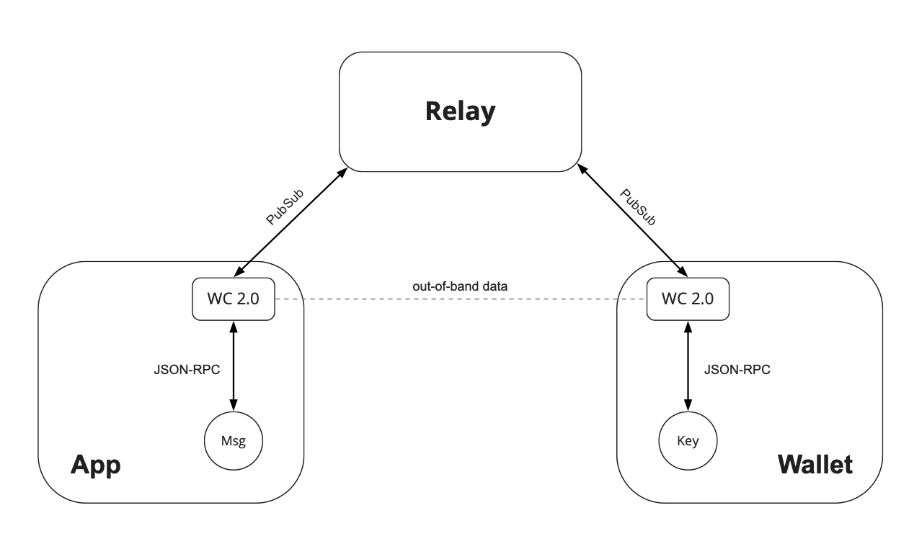
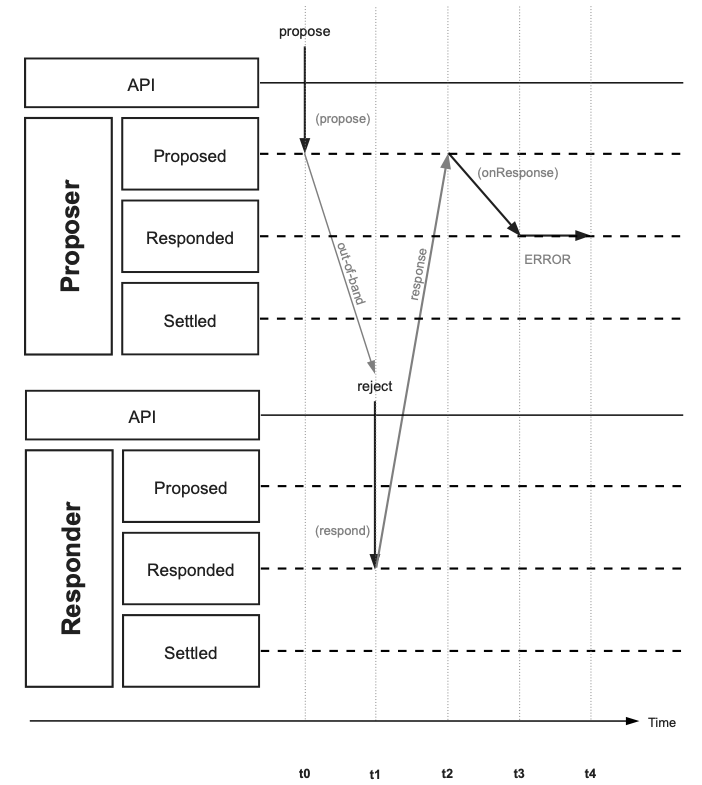

655555555q2## 技术规格
### 概述
WalletConnect 协议在区块链应用程序和控制用户私钥身份验证的钱包之间提供安全的远程签名通信
### 目标
WalletConnect 协议的目标是在两个单独的平台之间提供可互操作的安全远程签名体验，其中需要公钥身份验证才能与区块链交互。WalletConnect 协议的目标包括：

- 减少最终用户安全连接两个平台的步骤
- 保护中继基础设施中的最终用户活动
- 允许任何区块链应用程序连接到任何区块链钱包

### 架构
在高层次上，WalletConnect 为两个应用程序之间的安全通信通道提供服务，这些应用程序为 WalletConnect 运行等效客户端，这些客户端连接到通过发布-订阅模式进行通信的中继基础设施。

当共享一些带外数据以定义中继基础设施和用于加密有效负载的加密密钥时，两个客户端将连接。

通常我们有一个区块链应用程序将被标记为`提议者-proposer `和一个区块链钱包将被标记为`响应者-responder `。连接后，`提议者` 将以 JSON-RPC 有效负载的形式向`响应者`发出签名请求，以远程与其签名者进行签名。在接下来的部分中，我们将描述实现客户端的协议要求以及如何将会话从提案推进到结算。
### 要求
该协议旨在服务于主要但不完全是移动区块链钱包，这些钱包旨在作为最终用户管理其私钥以验证区块链交互的主要签名平台。

因此，使用以下核心组件来确保应用程序和钱包之间的安全和低延迟通信：

- JSON-RPC 协议
- X25519 共享密钥派生
- AEAD 加密方案
- 发布订阅模式

最后，在连接应用程序和钱包时，使用以下标准确保对任何区块链接口的协议不可知性：

- CAIP-2 区块链标识符
- CAIP-10 帐户标识符
- CAIP-25 提供者握手
- CAIP-27 提供者请求

### 向后兼容
与其前身相比，WalletConnect 2.0 协议引入了新概念，它将故意破坏兼容性，以便在与请求访问不同区块链帐户的不同应用程序接口的不同钱包之间提供更一致的最终用户体验。不仅 WalletConnect 2.0 协议变得对链不可知，失去了与以太坊区块链状态的强耦合，而且还将会话与配对分离。最后，它还根据生命周期和持续时间在会话管理方面引入了一组更强大的规则。

在接下来的部分中，我们将逐步讨论有关中继协议、带外序列、JSON-RPC 有效负载、会话管理、持久存储和客户端同步的核心概念。
### 中继协议 API
与其前身相反，WalletConnect 2.0 协议对其中继基础设施是不可知的。虽然仍然可以使用 Bridge Server 中继区块链应用程序和钱包之间的通信，但现在将其定义为遵循标准协议的自己的中继协议。

中继协议必须遵循 `发布-订阅` 模式，并且必须具有 JSON-RPC API 接口，其中包括以下方法和与中继网络基础设施的相应行为：

- `publish` — 向网络广播带有主题的消息
- `subscribe` — 订阅网络上匹配主题的消息
- `unsubscribe` — 取消订阅网络上匹配主题的消息
- `subscription` — 来自网络的具有匹配主题的传入消息

不同的协议必须具有唯一的方法前缀，以防止在处理来自 JSON-RPC API 接口的网络交互时发生冲突。例如，Bridge 服务器基础架构将包括诸如 `waku_subscribe` 和 `waku_publish` 之类的方法。

一些中继协议可能需要一些初始化参数，这些参数需要通过带外通信与另一个 WalletConnect 客户端共享。例如，Bridge 服务器基础设施将包含服务器的 url 作为参数：

	interface RelayProtocolOptions {
	  protocol: string;
	  params: any;
	}
	
	const protocolOptions: RelayProtocolOptions = {
	  protocol: "waku", <- 这里
	  params: {},
	};
这与 WalletConnect 1.0 协议有一些相似之处，该协议选项通过扫描 QR 码或深度链接时使用的 URI 共享。使用 WalletConnect 2.0 协议，任何中继协议都可用，因此这些协议选项对应用程序和钱包都可用的其他潜在中继基础设施开放，以共享带外(out-of-band)，这导致我们使用带外(out-of-band)序列。

### 外带(out-of-band)序列
就像它的前身一样，它的核心是一个`提议者-Proposer` 和 `响应者-Responder` 的概念，它们共享一些中继协议不可用的带外(out-of-band)信息，以便中继加密的有效负载。这现在使用 WalletConnect 2.0 协议定义为带外 (out-of-band) 序列。WalletConnect 2.0 协议中有两种不同的顺序：`配对`和`会话`。它们都遵循相同的程序来解决带外 (out-of-band)  序列。

我们先来描述一下“批准-approve”流程：

- `t0` - `提议者` 生成一个序列提议，其中包括一个带外 (out-of-band) 数据信号(比如二维码)并与 `响应者` 共享(扫码)
- `t1` - `响应者` 使用接收到的信号(扫码)构造 `提案` 并批准它且在内部发送响应
- `t2` - `响应者` 在确认之前,`响应者` 乐观地解决 `会话`，同时 `提议者` 接收响应
- `t3` - `提议者` 处理和验证响应并向 `响应者` 发送响应确认
- `t4` - `提议者` 能够解决它自己的序列，同时  `响应者`  接收到确认
- `t5` - `响应者`处理并验证确认是成功还是失败

此时，`提议者` 和 `响应者` 都已经确定了一个序列，现在可以使用同意的序列权限安全地交换有效负载。

现在让我们描述一个“拒绝”流程：

- `t0` - 提议者生成一个序列提议，其中包括一个带外数据信号并与响应者共享
- `t1` - 响应者使用接收到的信号构造提案并拒绝它且在内部发送响应
- `t2` - 响应者丢弃提案并且未订阅任何主题，同时提案者接收响应
- `t3` - 提议者处理和验证响应，并在客户端上抛出错误，原因是响应中收到的原因

### 配对流程
#### 配对信号(提议者)
当一个配对序列被提议时，它将使用一个 URI 作为信号，这将是 `提议者` 和 `响应者` 之间共享的带外信息以构建提议。在 URI 中，我们将包含以下参数：

	interface UriParameters {
	  protocol: string;
	  version: number;
	  topic: string;
	  publicKey: string;
	  controller: boolean;
	  relay: RelayProtocolOptions;
	}
	
	interface PairingSignal {
	  type: "uri"; <- 这里
	  params: {
	    uri: string;
	  };
	}
#### 配对建议(响应者)
当响应者收到这个 URI 时，它将能够构建配对序列提议。

	interface PairingProposer {
	  publicKey: string;
	  controller: boolean;
	}
	
	interface PairingProposedPermissions {
	  jsonrpc: {
	    methods: string[];
	  };
	  notifications: {
	    types: string[];
	  };
	}
	
	interface PairingProposal {
	  topic: string;
	  relay: RelayProtocolOptions;
	  proposer: PairingProposer;
	  signal: PairingSignal;
	  permissions: PairingProposedPermissions;
	  ttl: number;
	}

在构建的提案中，我们能够断言以下信息：

- `topic` - 由网络上的提议者订阅以接收响应
- `relay` - 用于连接网络的中继协议和参数
- `proposer` - 提议者在结算后用于加密有效负载的公钥
- `signal` - 描述提议者共享的信号参数
- `permissions` - 提议者请求的权限（`default = ["wc_sessionPropose"]`）
- `ttl` - 预计完成配对序列的时间（`default = 30 days`）

如果您注意到提议者由控制器布尔值标识。当为 false 时，表示提议者将不会控制已结算的配对，这意味着它不会更新状态，升级权限，也不受权限限制。

#### 配对相应(响应者)
配对提议的响应有两种可能的结果：成功或失败

- 成功

	如果配对响应成功，则响应者还必须生成一个 X25519 密钥对，并在解决后派生用于加密有效负载的共享密钥。此外，主题生成为派生共享密钥的 SHA256 哈希，这样下一个主题只有双方知道。因此，成功的结果响应应如下所示：

		interface AppMetadata {
		  name: string;
		  description: string;
		  url: string;
		  icons: string[];
		}
		
		interface PairingState {
		  metadata?: AppMetadata;
		}
		
		interface PairingParticipant {
		  publicKey: string;
		}
		
		interface PairingSuccessResponse {
		  topic: string;
		  relay: RelayProtocolOptions;
		  responder: PairingParticipant;
		  expiry: number;
		  state: PairingState;
		}
	注意：到期时间是使用响应者结算时间的时间戳和提议者提出的ttl之和计算的	
- 失败

	如果配对不成功，无论是因为响应者拒绝还是在结算过程中发生任何客户端错误，那么失败结果响应应如下所示：

		interface PairingFailureResponse {
		  reason: string;
		}
	注意：实际上不应该有任何理由拒绝配对提议，因为它仅用于信令会话
			
#### 配对结算(提议者)
响应后，提议者应该能够通过共享细节来解决自己的序列。响应者公钥用于派生共享密钥，派生主题应与响应主题匹配。最后，它包括响应者计算的到期时间，并且两个客户端都认为配对已结算。两个客户端上已结算的配对结构如下：

	interface PairingPermissions extends PairingProposedPermissions {
	  controller: {
	    publicKey: string;
	  };
	}
	
	interface PairingSettled {
	  topic: string;
	  relay: RelayProtocolOptions;
	  sharedKey: string;
	  self: PairingParticipant;
	  peer: PairingParticipant;
	  permissions: PairingPermissions;
	  expiry: number;
	  state: PairingState;
	}
到目前为止，您应该已经注意到我们已经指定了权限，但默认情况下我们只 `wc_sessionPropose` 允许使用一种方法。这将带我们了解配对和会话如何相互关联。

- 在 WalletConnect 1.0 协议中，每个会话都建立了一个配对，这使得会话的带宽要求过高。
- 现在使用 WalletConnect 2.0 协议配对独立于会话来解决。使用固定配对作为安全通道，可以在两个平台之间启动会话。

	一旦两个参与者配对，他们的通信就会通过配对加密。参与者可以使用配对主题导出共享密钥，通过中继网络发送具有指定权限的详细会话提议。

因此，下一个序列，会话，将遵循相同的结算程序，但它将通过加密的结算配对中继其带外会话建议

### 会话流程
#### 会话信号
当通过已解决的配对提议会话时，它将使用具有与用于中继提议的配对主题匹配的主题字段的信号。

	interface SessionSignal {
	  method: "pairing";
	  params: {
	    topic: string;
	  };
	}
#### 会议提案
该提案将作为通过配对结算的中继参数的一部分被听取，`wc_sessionPropose` 其结构如下

	interface AppMetadata {
	  name: string;
	  description: string;
	  url: string;
	  icons: string[];
	}
	
	interface SessionProposer {
	  publicKey: string;
	  controller: boolean;
	  metadata: AppMetadata;
	}
	
	interface SessionProposedPermissions {
	  blockchain: {
	    chains: string[];
	  };
	  jsonrpc: {
	    methods: string[];
	  };
	  notifications: {
	    types: string[];
	  };
	}
	
	interface SessionProposal {
	  topic: string;
	  relay: RelayProtocolOptions;
	  proposer: SessionProposer;
	  signal: SessionSignal;
	  permissions: SessionProposedPermissions;
	  ttl: number;
	}	
在构建的提案中，我们能够断言以下信息：

- `topic` - 由网络上的提议者订阅以接收响应
- `relay` - 用于连接网络的中继协议和参数
- `proposer ` - 提议者在结算后用于加密有效负载的公钥
- `signal` - 描述提议者共享的信号参数
- `permissions` - 提议者请求的权限
- `ttl` - 预计完成配对序列的时间(default = 7 days)

如果您注意到提议者由控制器布尔值标识。当为 false 时，表示提议者将不会控制已结算的会话，这意味着它不会更新状态、升级权限并受权限限制。

- 参与者

	此处的元数据类似于 v1.0 协议，并显示给用户以识别提案来自尝试远程连接的应用程序。它还用于识别批准后的已结算会话
- 区块链

	区块链权限以及并行描述的 JSON-RPC 方法与 CAIP-25 提供者握手参数相冲突，这些参数用于规定将用于会话的规则。链是应用程序从钱包请求公开的 CAIP-2 区块链标识符，JSON-RPC 方法是应用程序需要钱包完全支持以建立成功的会话序列的一组方法。

#### 会话响应
就像配对序列一样，会话的响应可以有两种结果：成功或失败

- 成功

	当用户批准会话提议并且钱包验证它支持请求的区块链和 JSON-RPC 权限时，会话响应将成功。
	
	鉴于满足这些条件，钱包将公开与请求的区块链相对应的 CAIP-10 区块链账户，并将派生一个共享密钥以在会话结算后使用。
	
		interface SessionState {
		  accounts: string[];
		}
		
		interface SessionParticipant {
		  publicKey: string;
		  metadata: AppMetadata;
		}
		
		interface SessionSuccessResponse {
		  topic: string;
		  relay: RelayProtocolOptions;
		  responder: SessionParticipant;
		  expiry: number;
		  state: SessionState;
		}
- 失败

	如果会话不成功，或者是因为用户没有批准，钱包不完全支持请求的权限，或者在结算过程中发生错误，那么响应的结构应该如下：

		interface SessionFailureResponse {
		  reason: string;
		}

#### 会话结算
响应后，提议者应该能够通过共享细节来解决自己的序列。响应者公钥用于派生共享密钥，派生主题应与响应主题匹配。最后，它包括响应者计算的到期时间，并且会话被两个客户端视为已解决。两个客户端的已结算会话结构如下：

	interface SessionPermissions extends SessionProposedPermissions {
	  controller: {
	    publicKey: string;
	  };
	}
	
	interface SessionSettled {
	  topic: string;
	  relay: RelayProtocolOptions;
	  sharedKey: string;
	  self: SessionParticipant;
	  peer: SessionParticipant;
	  permissions: SessionPermissions;
	  expiry: number;
	  state: SessionState;
	}
在这个阶段，我们可以考虑两个应用程序完全连接。会话已在两个客户端上建立，并且已在两个客户端上建立了交换 JSON-RPC 有效负载的权限。

### JSON-RPC 负载
既然 WalletConnect 2.0 协议与区块链接口无关，重要的是在会话结算之前预先规定规则，以确保跨多个区块链应用程序与多个区块链钱包可互操作的最终用户体验一致。

因此，我们将添加对 CAIP-27 提供程序请求的支持，这将允许 JSON-RPC 请求伴随着 chainId 目标，这在 WalletConnect 中被翻译为两个客户端之间的 JSON-RPC 请求，如下所示：

	interface CAIP27Request {
	  id: number;
	  jsonrpc: string;
	  method: "caip_request";
	  params: {
	    request: {
	      method: string;
	      params: any;
	    };
	    chainId?: string;
	  };
	}
这允许区块链应用程序同时连接到多个链上的区块链钱包，并分别针对请求。虽然 chainId 是可选的，但强烈建议所有基于 WalletConnect 2.0 协议构建的提供商使用它。
### 会话管理
与其前身相反，WalletConnect 2.0 协议在两个方面对会话管理持意见：生命周期和持续时间。

您可以在[会话管理](https://docs.walletconnect.com/2.0/protocol/session-management)下阅读有关如何在应用程序中管理它的更多信息
### 控制器客户端
在描述如何提出配对和会话时，我们简要地谈到了作为控制器的含义。这意味着非控制器客户端无法更新状态、升级权限并受已确定权限的限制。控制器客户端几乎总是将账户访问权限暴露给 dapp 的钱包。另一种情况可能是当混合应用程序管理 DAO 或代理 dapp 和钱包之间的 WalletConnect 会话的多重签名时，这意味着它将能够管理两个客户端：控制器客户端和非控制器客户端。

这与 v1.0 协议不同，因为它假定响应者始终是控制器客户端，但现在它独立于每个客户端提议或响应序列。相反，客户端始终充当控制器或非控制器，因此控制器客户端不能充当作为控制器的会话的非控制器客户端。我们建议为每个职责管理两个单独的客户端。

- 生命周期

	正如已经在描述配对如何发出会话提议的信号的带外序列中所解释的那样。现在需要注意的是，会话生命周期与之前耦合到每个会话的 URI 扫描或深度链接分离。

	仅通过可以在多个应用程序上显示给用户的配对来提出会话。因此，钱包设计会话以并行存在并允许用户同时批准来自不同会话的请求是必要的。

	来自会话的 JSON-RPC 请求永远不应从“活动”会话中显示，因为多个会话可以同时处于活动状态。
- 期间

	此外，不仅可以同时解决多个会话，会话必须在整个持续时间内持续存在，直到到期。
	
	只有用户可以在到期之前故意终止会话，因此这些会话应该在会话管理器上并行显示，用户可以在其中控制哪些应用程序仍然连接并可以发出请求。
	
	因此，会话存储由客户端控制，以确保尊重生命周期和持续时间。这将我们带到客户端如何处理持久存储

### 持久存储
WalletConnect 2.0 客户端现在还可以控制持久性存储，以确保在双方都正确管理会话，因此通过提供基本键值存储接口以及获取、设置和设置的异步方法，客户端在所有平台上兼容的最低要求删除
### 客户沟通
WalletConnect 2.0 客户端将通过专门用于在两个连接的客户端之间进行通信的 JSON-RPC 方法为带外序列（会话和配对）传达状态和事件。这些将在结算前后的相应主题下发布和订阅。这可以在包含两个序列的这两种状态的单个矩阵下进行描述。

x|结算前|结算后
---|---|---
配对|wc_pairingApprove|wc_pairingUpdate
||wc_pairingReject|wc_pairingUpgrade
|||wc_pairingDelete
|||wc_pairingPayload
|||wc_pairingPing
|||wc_pairingNotification
会话|wc_sessionApprove|wc_sessionUpdate
||wc_sessionReject|wc_sessionUpgrade
||wc_sessionPropose|wc_sessionDelete
|||wc_sessionPayload
|||wc_sessionPing
|||wc_sessionNotification

[此处](https://docs.walletconnect.com/2.0/json-rpc/ethereum)列出了客户端之间用于通信状态和事件的所有 JSON-RPC 方法
