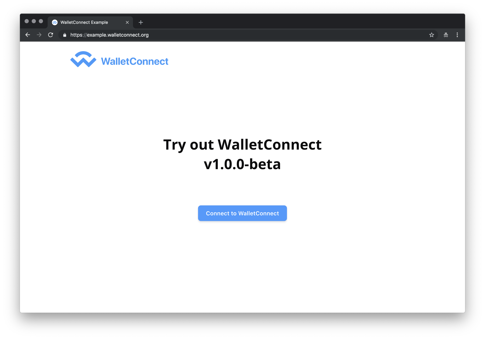
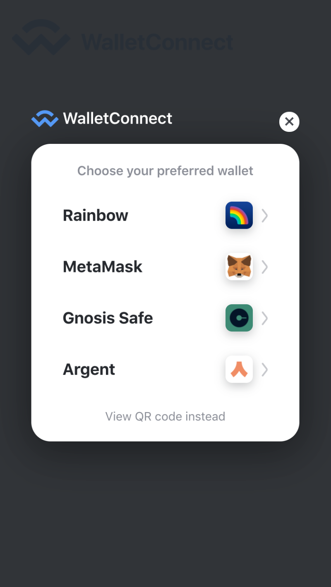

# walletconnect v1.0
## 钱包连接 
WalletConnect 是一种开放协议，用于在钱包和 Dapps （Web3 应用程序）之间进行安全通信。该协议使用桥接服务器在两个应用程序或设备之间建立远程连接，以中继有效负载。这些有效载荷通过两个对等方之间的共享密钥进行对称加密。连接由一个显示二维码或带有标准 WalletConnect URI 的deep links的对等方发起，并在对方批准此连接请求时建立。它还包括一个可选的推送服务器，以允许本地应用程序通知用户传入的有效负载以建立连接。
### 使用
目前，WalletConnect 协议具有用 Typescript 为客户端、桥接服务器和推送服务器编写的参考实现。

要快速设置您的 Dapp 或钱包，请转到[快速开始](https://github.com/WalletConnect/walletconnect-docs/tree/4665484efb48d649211b3afa7e6a38eac4f3d104/quick-start/README.md)以获取代码示例。

要详细了解 WalletConnect 协议，请转到[技术规范](https://docs.walletconnect.com/tech-spec)

此外，您还可以查阅 [Client](https://docs.walletconnect.com/client-api)、[Bridge Server](https://docs.walletconnect.com/bridge-server)和 [Push Server](https://docs.walletconnect.com/push-server)的 API 参考
### 有用的
- 测试钱包
	- test.walletconnect.org ([源码](https://github.com/WalletConnect/walletconnect-test-wallet))

	
- 示例 Dapp

	example.walletconnect.org ([源代码](https://github.com/WalletConnect/walletconnect-example-dapp))
	
	

## 技术规格
### 介绍
WalletConnect 是一种用于将 Dapps 连接到钱包的开放协议。其背后的动机来自于缺乏可供用户使用的用户友好的钱包，尤其是不需要安装浏览器扩展的解决方案。为了解决这个问题，它被设计为不需要任何额外的软件或硬件来将钱包连接到 Dapp。该设计主要是为移动钱包量身定制的，但它也绝对可以支持桌面钱包。依赖 Dapp 和 Wallet 的协议使用 WalletConnect 客户端并连接到中继通信的 Bridge 服务器。通信以包含连接请求topic的标准 URI 格式启动，然后使用对称密钥解密有效负载和桥接服务器 url。
### 核心架构
该架构本质上由使用客户端的两个对等点（Dapp 和 Wallet ）和之间的 websocket 服务器（桥接器）组成。

- 第一步-请求连接(Dapp操作)

	请求连接发起者节点是 Dapp 。Dapp 将由一次性topic（仅用于握手）和连接请求详细信息组成的加密有效负载发布到桥服务器。然后使用 WalletConnect 标准 URI 格式( [EIP-1328](https://eips.ethereum.org/EIPS/eip-1328) ) Dapp 将建立连接所需的参数组合在一起。
	
	- (握手)topic
	- 桥接(url)
	- (对称)密钥。

	定义		
			
		wc:{topic...}@{version...}?bridge={url...}&key={key...}
	
	参数说明
	
	- wc		\\钱包定义的链接协议
	- topic		\\字符串
	- version	\\ 数字(例如 1.9.0)
	- bridge		\\ 网桥 url
	- key		\\对称的16进制字符串

	其他查询字符串参数都是可选的
	
	例
	
		// Example URL
		wc:8a5e5bdc-a0e4-4702-ba63-8f1a5655744f@1?bridge=https%3A%2F%2Fbridge.walletconnect.org&key=41791102999c339c844880b23950704cc43aa840f3739e365323cda4dfa89e7a
- 第二步-建立(钱包操作)

		
	
	- 对等点( Wallet )将使用 QR (二维码)码或deep links读取 URI。
	- 读取 URI 后，对等方将立即接收并解密连接请求有效负载。
	- 然后，钱包将向用户显示 Dapp 提供的请求详细信息。(？？什么详细信息)
	- 然后用户将批准或拒绝连接。
		- 如果被拒绝，Dapp 将立即断开与 Bridge Server 的连接，并在 Wallet 提供时抛出错误消息。
		- 如果获得批准，Dapp 将从钱包中接收提供的帐户和链 ID。
	- 一旦建立连接，Dapp 将能够发送任何 JSON-RPC 调用请求以由钱包处理，以从其 peer 读取数据或对交易或消息进行签名请求。

		
	
	此外，钱包方面还有一个选项可以使用推送服务器订阅推送通知。只有在连接请求得到用户批准后，才会注册此推送通知订阅。此订阅可以定制不同程度的隐私。它可以显示通用消息，包括发出请求的对等方的名称，甚至显示本地化消息。（阅读推送通知部分了解更多详情）
			
### 事件和有效负载
内部和跨 peer 之间都会发生各种事件。这些事件都伴随着相应的有效载荷。内部事件是特定于客户端的，但所有跨 peer 事件都是 JSON-RPC 2.0 事件。内部
#### 内部事件
内部事件包括：`connect`、`disconnect`、`session_update`、`call_request`。内部事件的结构如下

	interface InternalEvent {
	  event: string;
	  params: any[];
	}
#### 跨 peer 事件
跨 peer 事件包括：`wc_sessionRequest`、`wc_sessionUpdate` 、所有以太坊 [JSON-RPC](https://github.com/ethereum/wiki/wiki/JSON-RPC) 请求和 `eth_signTypedData` （[EIP-712](https://eips.ethereum.org/EIPS/eip-712)等）

这些事件的结构为 JSON-RPC 2.0 请求和响应，如下所示：

	interface JsonRpcRequest {
	  id: number;
	  jsonrpc: "2.0";
	  method: string;
	  params: any[];
	}
	
	interface JsonRpcResponse {
	  id: number;
	  jsonrpc: "2.0";
	  result: any;
	}
	
### WalletConnect 方法
- Session Request
	- Dpp 发送
		
		第一个分派的 JSON RPC 请求是连接请求，包括请求节点的详细信息，参数如下：
	
			interface WCSessionRequestRequest {
				  id: number;
				  jsonrpc: "2.0";
				  method: "wc_sessionRequest";
				  params: [
				    {
				      peerId: string; \\ 发件人的 peerId 客户端 ID
				      peerMeta: ClientMeta; \\ 发件人的客户端元数据
				      chainId?: number | null; \\ chainid
				    }
				  ];
				}
				
		- 客户端元数据的结构
		
			在浏览器应用程序中，这是从加载的网页的头部元标记中抓取的。在本机应用程序中，这是由Dapp应用程序开发人员提供的。
		
				interface ClientMeta {
				  description: string; \\ 详情
				  url: string; \\  dapp 的 url
				  icons: string[]; \\ dapp 图标
				  name: string; \\ dapp 名称
				}
	- 钱包响应？

		结果是将 `wc_sessionRequest` 期望具有以下参数的

			interface WCSessionRequestResponse {
			  id: number;
			  jsonrpc: "2.0";
			  result: {
			    peerId: string;  \\ 发件人的 peerId 客户端 ID
			    peerMeta: ClientMeta; \\ 发件人的客户端元数据
			    approved: boolean; \\ 是否授权
			    chainId: number; \\ chainid
			    accounts: string[]; \\ 账户
			  };
			}		
- Session Update(钱包发送)

	此 JSON RPC 请求由 Wallet 在更新会话时分派。这可能发生在会话被钱包终止、提供新帐户或更改活动链 ID 时。它具有以下参数：
	
		interface WCSessionUpdateRequest {
			  id: number;
			  jsonrpc: "2.0";
			  method: "wc_sessionUpdate";
			  params: [
			    {
			      approved: boolean; \\授权？
			      chainId: number; \\ chainid
			      accounts: string[]; \\ 账户
			    }
			  ];
			}

### 密码学
因此，所有有效负载都使用活动对称密钥进行加密，并在它们作为消息发布到 Bridge 服务器之前进行签名。

使用的加密和签名算法分别是 AES-256-CBC 和 HMAC-SHA256。加密有效载荷的结构如下

	interface EncryptionPayload {
	  data: string; \\加密数据
	  hmac: string; \\ hmac 
	  iv: string; \\ iv 向量
	}
所有字段（data、hmac 和 iv ）都是十六进制字符串,因此，接收对等方将在使用活动密钥解密数据字段之前验证 hmac 并提供 iv

### WebSocket 消息
通信都使用具有以下结构的 WebSockets “字符串化” 有效负载进行中继，

	interface SocketMessage {
	  topic: string; \\topic
	  type: string;
	  payload: string; \\ 加密负载数据，包含 vi 和 hmac
	}	
桥接服务器充当 发布/订阅 控制器，保证发布的消息总是被订阅者接收。

- 订阅

	一个示例订阅套接字消息如下所示
	
		{
		    topic: 'da437bf0-2783-4b64-904a-622147c895b0',
		    type: 'sub',
		    payload: ''
		}
- 发布

	发布的套接字消息示例如下所示：
	
		{
		    topic: '4d83acea-ff18-4409-8b0c-0ad2e56846ca',
		    type: 'pub',
		    payload: '{"data":"821d513e79c0d5d20ca5763a7c9c9ef90399acdcc696d2057641e3fcd140db08f78bfc58f943a94af3c63d8049b42ce41d43557e0326d391e921fc90339876824ceda8793b6f673e91c20ce4d1beca79f5ebe969baddef885c15e393b7ed734b234ff291d1e2ed18cb3e3a4bef3b44a51986fcfd78f34e15db69e83ab0fcc18bb41c9dbf3d5444afa9dff7795fb709698981102bd58fc534bf4cb61167bc38477a6ff02908f3292e84cf782c8f367ae4c54dd3304403e459d56cdecadeadb84781f358d0c33862bd9df573bc5908247a","hmac":"78b397e3503175891e00da8708ab35104f0838e4910e7db5979f3c1710f98e40","iv":"12a0fbda5d7cdca8a7eaacf34055c106"}'
		}
	Bridge Server 将触发任何现有的推送通知订阅，这些订阅会侦听具有匹配topic的任何传入负载

### 推送通知
推送通知订阅仅适用于本机应用程序(当前库仅支持移动应用程序)。推送服务器将需要 topic、桥接 URL、通知类型和通知令牌。

- topic 

	将匹配将接收呼叫请求的客户端 ID
- 桥 url 

	是要订阅的
- 通知类型

	因移动平台而异 token 用于针对特定移动设备。

此外，还可以提供其他对等点的 peerName 来自定义通知消息和语言代码( ISO-639-1 )的选项，以便本地化推送通知消息内容。

注册推送通知订阅时，Push Server 将向 Bridge Server 发布订阅请求，以侦听与提供的 topic 匹配的任何传入有效负载。它还将共享一个 webhook 来触发推送通知。

							
## 智能合约钱包
WalletConnect 协议完全支持像 [Argent](https://argent.gitbook.io/argent/wallet-connect-and-argent) 这样的智能合约钱包。

然而，在您的 dapp 中集成 WalletConnect 时，需要考虑一些关于智能合约钱包的注意事项，包括账户如何在会话中公开、返回消息签名和广播交易。
### 账户
每当您将 dapp 连接到智能合约钱包时，您实际上都会收到钱包的智能账户地址。不要将这与用于签署消息和交易的委托密钥混淆。

如果暴露的帐户地址部署了任何相关代码，您可以通过验证链上来检测智能合约钱包。

- ether.js

		import { providers, utils } from "ethers";
		
		const provider = new providers.JsonRpcProvider(rpcUrl);
		
		const bytecode = await provider.getCode(address);
		
		const isSmartContract = bytecode && utils.hexStripZeros(bytecode) !== "0x";
- web3.js

		import Web3 from "web3";
		
		const web3 = new Web3(rpcUrl);
		
		const bytecode = await web3.eth.getCode(address);
		
		const isSmartContract = bytecode && utils.hexStripZeros(bytecode) !== "0x";

智能合约钱包本质上是多重签名钱包，它使用多个密钥来代表这些智能合约账户授权操作，因此你必须考虑你的 dapp 如何处理消息和交易。

### 消息
通常，在验证来自外部拥有帐户( EOA )的“普通”帐户签名的消息时，您将使用一种名为 ECDSA 的方法  `ecrecover()`，该方法将返回相应的公钥，然后映射到一个地址。

在智能合约钱包的情况下，您无法使用智能合约账户签署消息，因此标准 [EIP-1271](https://eips.ethereum.org/EIPS/eip-1271) 被定义为概述一种可以称为链上标记的验证方法 `isValidSignature()`。

	contract ERC1271 {
	  bytes4 constant internal MAGICVALUE = 0x1626ba7e;
	
	  function isValidSignature(
	    bytes32 _hash,
	    bytes memory _signature
	  )
	    public
	    view
	    returns (bytes4 magicValue);
	}
此方法有一个参数_hash，该参数应符合 [EIP-191](https://eips.ethereum.org/EIPS/eip-191)，并且可以使用以下方法计算：

- ether.js

		import { utils } from "ethers";
		
		const hash = utils.hashMessage(message);
- web3.js

		import Web3 from "web3";
		
		const web3 = new Web3(rpcUrl);
		
		const hash = web3.eth.accounts.hashMessage(message);

像 [Argent](https://argent.gitbook.io/argent/wallet-connect-and-argent) 这样的智能合约钱包通常使用元交易的概念。这些是一种特殊类型的交易，由一个或多个密钥对签名，但由中继器提交给以太坊网络。

中继者支付汽油费（以 ETH为单位），钱包将退还中继者（以 ETH 或 ERC20 代币），最高金额为钱包所有者签署的金额。

从您的 dapp 的角度来看，这是由移动钱包应用程序管理的。您的 dapp 将向 web3 提供商提交常规 `{ to, value, data }` 交易。该交易将通过 WalletConnect 传输到移动钱包应用程序。

移动钱包会将数据转换为元交易：

- `to` 将是 `RelayerManager` 合约地址
- `data` 将是使用相关参数调用 `execute ( )` 方法的编码数据

您的 dapp 将接收交易哈希以监控交易的状态，并且事件将照常发出。

由于网络条件的波动，中继器有能力以更高的汽油价格重播交易。交易哈希被修改，Dapp 将不知道新的交易哈希。

一种解决方案可能是让您的 Dapp 观察正在发出的特定事件而不是事务状态。目前正在对最近使用 [EIP-2831](https://eips.ethereum.org/EIPS/eip-2831) 提出的交易回复事件进行标准化。我们希望在未来改进我们的 SDK 以将这个标准考虑在内。
		
## 移动链接
长期以来，WalletConnect 仅用作移动钱包和桌面应用程序之间的安全远程通信。

然而，通过设计连接移动钱包和移动应用程序始终是可能的。

使用 QRCode 中通常显示的 URI，可以通过在 Android 和 iOS 上通过deep links或通用链接共享此 URI 来建立连接。

尽管移动链接遇到了多个 UX 警告，但我们已经能够使用我们自己的 QR Code Modal 包简化这种模式。

我们为建立连接而选择的跨平台用户体验一致的模式如下

- Dapp 提示用户连接：
	- a ) Android 单键
	- b ) iOS 钱包列表
- 用户按下按钮进行连接并被重定向到选择的钱包
- 钱包提示用户批准或拒绝会话
- 钱包提示用户手动返回 Dapp
- 用户按下返回/返回按钮返回 Dapp

当需要用户签名请求时会发生类似的模式：

- Dapp 自动将用户重定向到之前选择的钱包
- 钱包提示用户批准或拒绝请求
- 钱包提示用户手动返回 Dapp
- 用户按下返回/返回按钮返回 Dapp

在接下来的部分中，我们将描述 Wallet 和 Dapps 如何支持其 WalletConnect 集成的移动链接模式。

### 钱包支持
为了在您的钱包中添加对移动链接的支持，您只需在您的移动应用程序中注册以下deep links或通用链接订阅。

- 对于 Android

	Android 具有最简单的集成，因为它的操作系统旨在处理订阅相同深度链接架构的多个应用程序。因此，您只需注册到根据 `wc:WalletConnect URI` 标准定义的架构。
	
		# Example
		wc:00e46b69-d0cc-4b3e-b6a2-cee442f97188@1?bridge=https%3A%2F%2Fbridge.walletconnect.org&key=91303dedf64285cbbaf9120f6e9d160a5c8aa3deb67017a3874cd272323f48ae
	此外，当 dapp 触发签名请求时，它将使用不完整的 URI 命中 deep links，这应该被忽略且不应被视为无效，因为它仅用于自动重定向用户以批准或拒绝签名请求。
	
		# Example
		wc:00e46b69-d0cc-4b3e-b6a2-cee442f97188@1
- 对于 IOS

	iOS 对集成有更多警告，但我们确保使其尽可能简单。由于其操作系统并非旨在处理订阅相同深度链接模式的多个应用程序，因此我们设计了 QRCode 模式以在我们的[开源 registry](https://github.com/WalletConnect/walletconnect-registry/)中列出支持的钱包，并针对每个钱包的特定深度链接或通用链接。

	要将您自己的钱包添加到 registry，您必须在 [Github](https://github.com/walletconnect/walletconnect-registry) 上的 registry 上提交问题。
	
	我们建议使用通用链接而不是 iOS 的 deep links，因为它们提供更流畅的用户体验和更少的提示。当 dapp 在 iOS 上触发移动连接时，您应该期待以下链接
	
		# For deep links
		examplewallet://wc?uri=wc:00e46b69-d0cc-4b3e-b6a2-cee442f97188@1?bridge=https%3A%2F%2Fbridge.walletconnect.org&key=91303dedf64285cbbaf9120f6e9d160a5c8aa3deb67017a3874cd272323f48ae
	
		# For universal links
		https://example.wallet/wc?uri=wc:00e46b69-d0cc-4b3e-b6a2-cee442f97188@1?bridge=https%3A%2F%2Fbridge.walletconnect.org&key=91303dedf64285cbbaf9120f6e9d160a5c8aa3deb67017a3874cd272323f48ae
	此外，当 dapp 触发签名请求时，它将使用不完整的 URI 命中 deep links，这应该被忽略且不应被视为无效，因为它仅用于自动重定向用户以批准或拒绝签名请求。
	
		# For deep links
		examplewallet://wc?uri=wc:00e46b69-d0cc-4b3e-b6a2-cee442f97188@1
		
		# For universal links
		https://example.wallet/wc?uri=wc:00e46b69-d0cc-4b3e-b6a2-cee442f97188@1

### Dapp 支持
如果您正在构建 Dapp，您只需安装我们分发的提供的 `qrcode-modal` 包即可支持此模式。这个包已经通过 `web3-provider `包提供，我们建议你使用它。

- npm
	
		npm install --save @walletconnect/qrcode-modal
- yarn

		yarn add @walletconnect/qrcode-modal
如果您想为移动链接构建自己的 UI，您可以使用我们的 [registry API](https://github.com/walletconnect/walletconnect-registry) 来获取应用程序条目和徽标，但是我们强烈建议您使用我们提供的 qrcode-modal 包来在 WalletConnect 集成中保持一致的用户体验，但是我们模块化了我们的软件包以提供权力下放精神的选择。

					
## 参考
- [walletconnect](https://docs.walletconnect.com/)