# 《区块链技术与应用》公开课笔记
## eth 智能合约
智能合约

- 不支持多线程，因为状态必须是确定的，多线程无法确定状态，所以不支持
- 不支持生成随机数，而是伪随机数

### 合约状态包含
- balance 当前余额
- nonce 交易次数
- code 合约代码
- storage 存储，数据结构是一个课 mpt 

### 代码格式
solidity 哈希表不支持遍历，需要遍历的话需要自己记录和实现

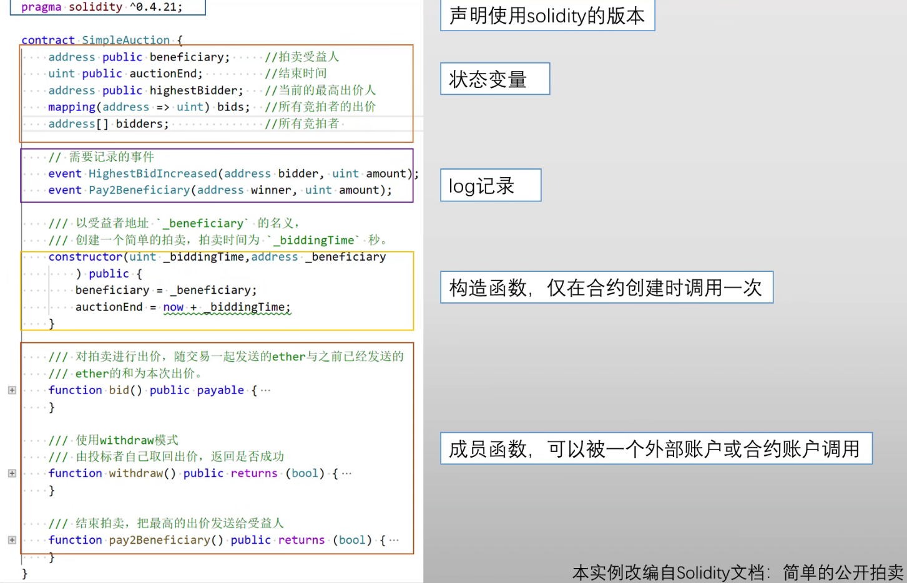

### 合约调用
规定只有外部账户才能发起，合约账户不能主动发起调用
#### 外部账户调用合约
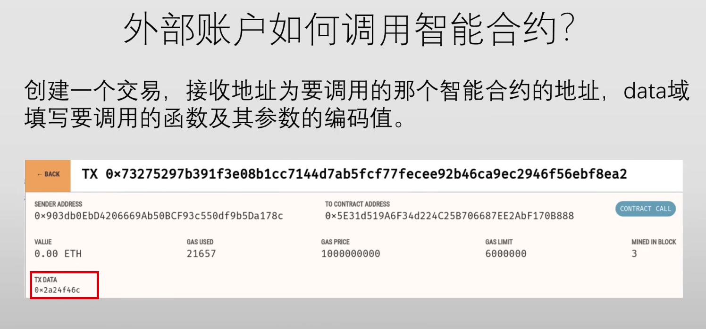
	
与交易不同的地方在于，与合约互动除了 `from` 谁调用 、`to` 合约地址等交易参数外是多了一个 `txdata` 交易数据，里面包含与合约的所有交互信息
#### 合约调用合约
- 直接调用

	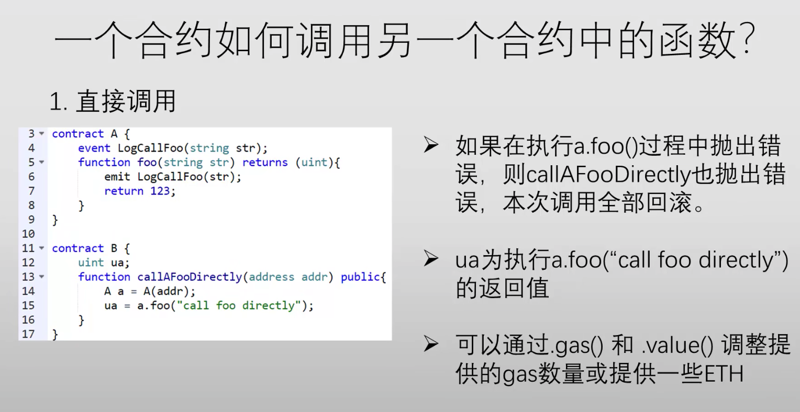
	
	遇到错误，如果被调用的合约出错，会导致发起合约一起回滚
- 地址类型 `call()` 函数调用

	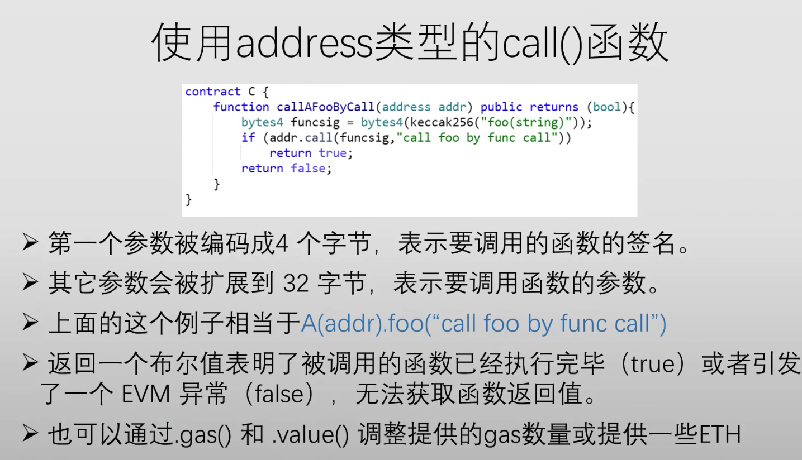
	
	遇到错误，如果被调用的合约出错，发起合约只会接收到调用合约错误，但是本身并不出错和一起回滚，而可以继续执行 
 - 代理调用 `delegatecall()` 

 	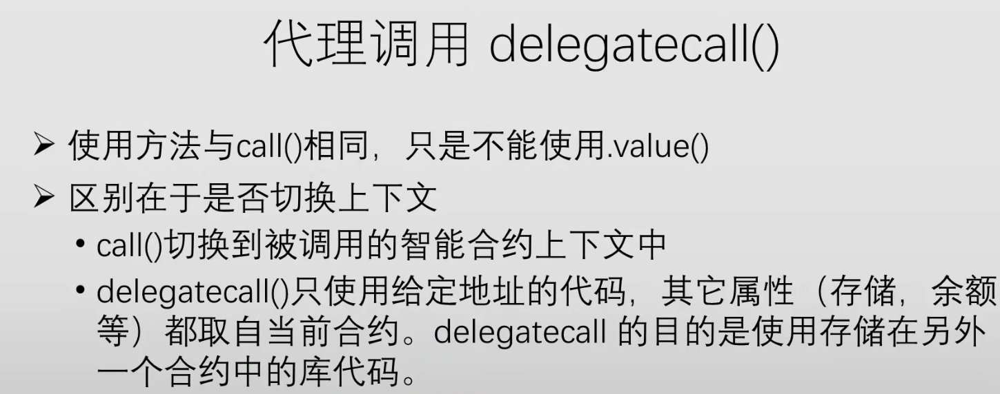
 	
 	与 `call()` 不同的地方在于，不需要切换被调用的合约环境去执行，可以在当前合约环境执行，比如使用当前合约的账户和存储。
 
### 创建合约

###  拍卖合约
- `bid()` 函数

	调用它并且包含拍卖的出价一起发送，然后合约会锁定出价金额到拍卖结束,所以这个函数必须有能够接收外部转账的能力，所以必须有 `payable` 函数
- `withdraw()` 函数	
	
	可以在拍卖结束后，取回没有中拍的币，不需要接收外部转账，所以没必要用 `payable` 函数
- `fallback()` 函数
 
 	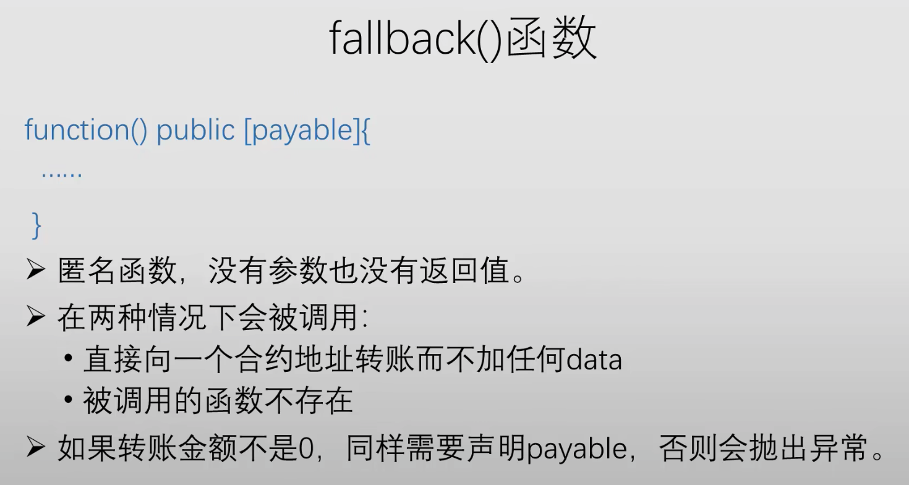
 	
 	如果给合约转账没有写调用任何函数，会自动调用这个 `fallback` 函数，但必须同时存在 `fallback` 和 `payable` 函数才能接受外部地址不写调用方法的转账，否则直接报错。
 	
 注意这里的转账只限于原生币 eth

### 拍卖规则
- 在拍卖结束前，每个人都可以出价
- 每个竞拍的人，就要把自己对应的出价 eth 发过去
- 竞拍人可以连续出价，高出自己之前出价的部分，进行补差价就可以
- 出价有效判断需要比最高价格还要高
- 出价最高的人的出价会给受益人
- 竞拍失败的人需要等有人调用 `actionEnd` 将自己的钱取回,可以是任何人，比如自己或者受益人

如果拍卖没有结束，调用结算方法会抛出异常

- 攻击合约

	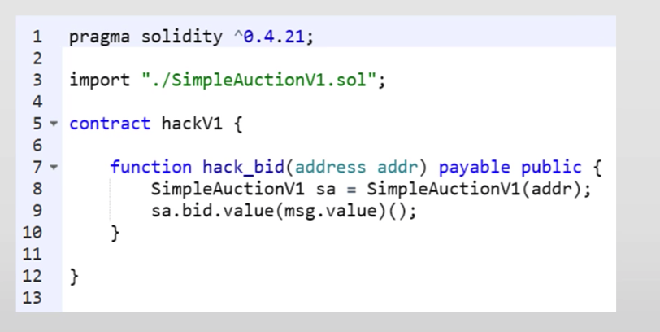
	
	黑客通过调用攻击合约调用拍卖合约竞拍，竞拍结束后，因为退款的方法调用的是 `transfer` 函数返回给竞拍人，但黑客攻击合约没有接收退款能力，导致整体出错回滚，竞拍失败人的钱被锁定在竞拍合约中无法取出。
- 解决方案
	- 升级合约第二版本

		每个竞拍人只能取回自己的金额，不用循环成

		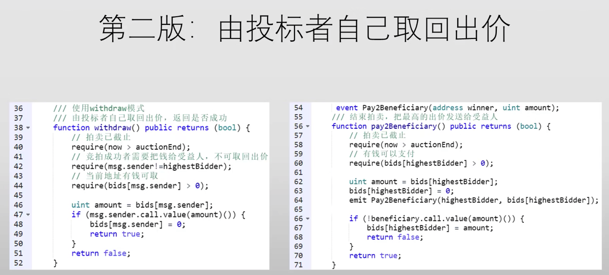
	- [第二版问题，重入攻击 2:11:57](https://www.bilibili.com/video/BV1Vt411X7JF?p=22)
	 
	 	使用 fallback 函数，重入获取两次费用，因为是拍卖合约回调黑客地址给钱，拍卖合约 `withdraw()` 函数直接进入递归操作，无法到清零操作，直到将拍卖合约剩余的钱全部取光为止。
	 	
	 	
	 
	- 升级合约第三个版本
		- `withdraw` 函数现清零，再转账。
		- 更换 `send` 或者 `transfer` ,这样不足以让攻击合约回调有足够的gas，因为只有2300个gas 
		
		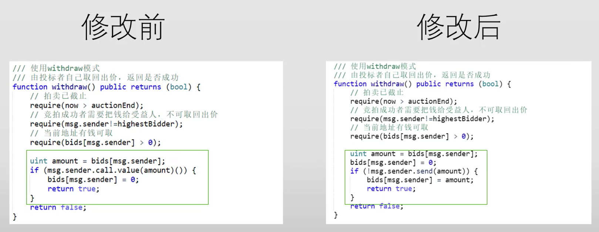	
	- 注意：对于所有可能和第三方地址(合约)交互时的经典操作逻辑，来保证恶意合约调用，每次向第三方转账或者调用第三方地址时，都要想，被调用的合约可能会反过来调用当前合约和修改状态。按这个思路进行检查 
		- 先要判断条件
		- 再改变条件
		- 最后再和其他地址发生交互	
	
### gas费
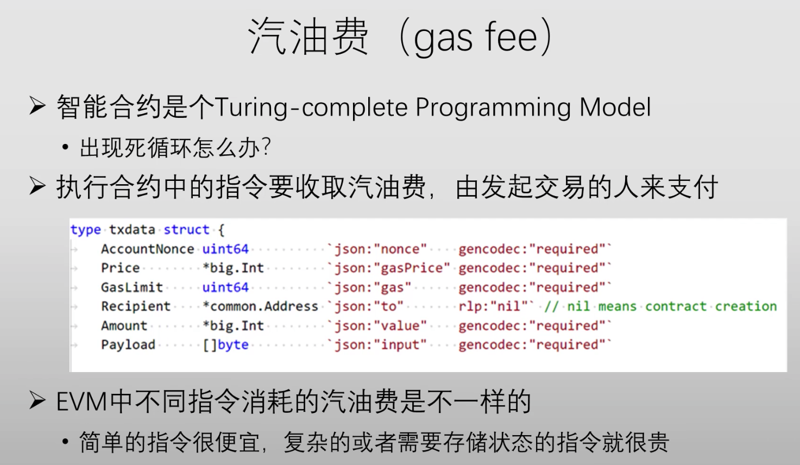	
### 错误处理
	
### 嵌套调用
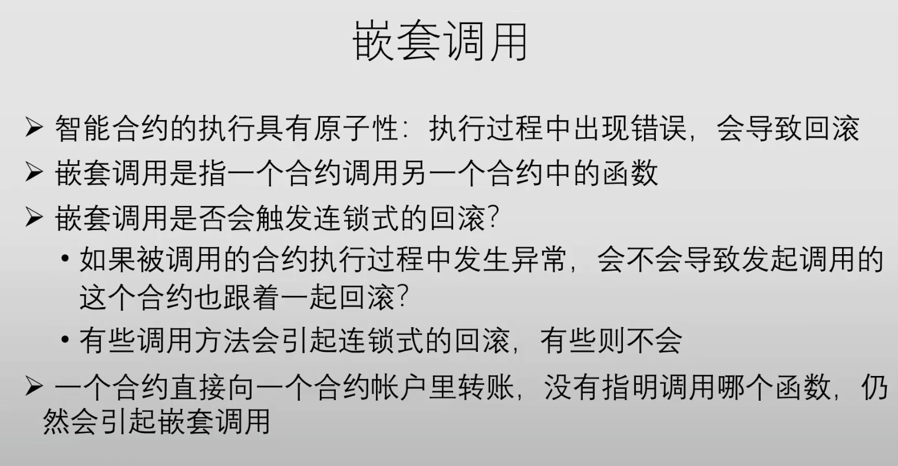
### 收据结构
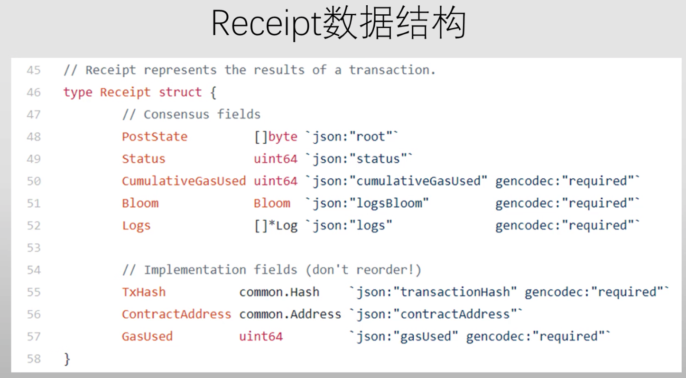	
### 智能合约可以获得的区块信息
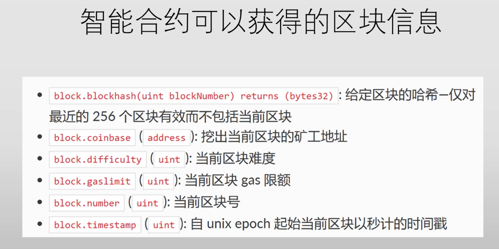
### 智能合约可以获得的调用信息
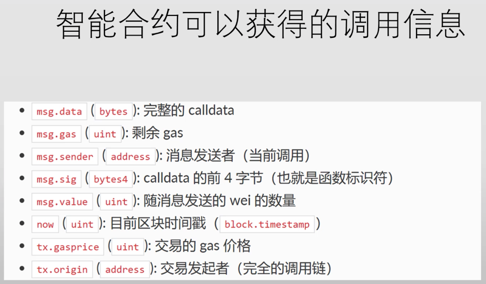
### 地址类型
- 第一个是成员变量

		address.balance 余额 
- 剩下的都是成员函数

		address.transfer(1000) 合约将1000 wei 转入 address 
		address.call 当前合约发起调用 address 地址

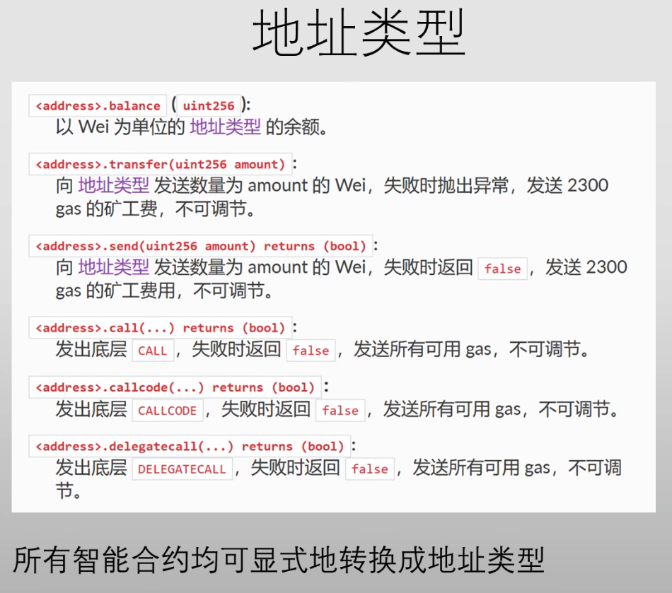	

 发送 eth 的三种方法

	<address>.transfer(uint256 amount)
		调用合约和被调用合约连锁回滚，只发送 2300 gas
	<address>.send(uint256 amount) returns(bool)
		调用合约不会异常，但被调用合约会返回 false，只发送 2300 gas
	<address>.call.value(uint256 amount)()
		调用合约不会异常，但被调用合约会返回 false，发送剩余所有 gas
		
## THE DAO 基础了解
### 投资步骤
用智能合约来维护一个全球加密货币的去中心化基金，想购买基金的用户需要通过原生代币购买对应份额的基金，比如使用以太坊就用 eth

1. 投资人通过原生代币购买基金
- 购买的基金占有总基金的一定份额
- 基金对其他区块链项目进行投资的决定权通过份额进行投票决定

### 赎回(split dao)和子基金(child dao)操作
通过拆分的方法赎回，当然拆分方法不光只对赎回操作，而且也是对应建立子基金的方法.

- 子基金定义

	大基金里面有一部分投资者与绝大部份投资者的意见不一样，想投资被大多数投资者不看好的项目，这部分投资者就可以用拆分的方法从大基金独立出来，成立自己的子基金。
	
	- 拆分逻辑是将自己的基金代币还回去 eth 
	- 用 eth 购买子基金的代币
	- 拆分之前，有7天的辩论期讨论拆分
		- 所有投资人讨论拆分的好坏
		- 或者是否要有新的投资人要加入
	- 拆分之后有 28 天的锁定期  
- 赎回

	拆分的极端例子就是单个投资者成立一个自己的子基金，然后就可以选择将所有的钱投给自己，这个是投资者投资和取回的唯一途径

### 重入漏洞攻击
- 问题，导致重入攻击
	- 先转账
	- 再账户减少
	- 再账户清零
- 正确的做法是先清零

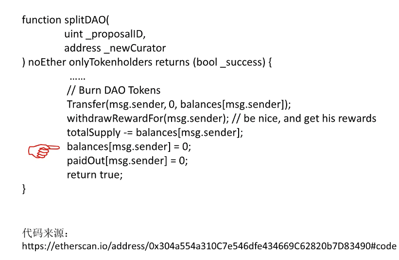

### 关于攻击的讨论
- 一部分人认为应该回滚交易
	- 攻击金额占用了 eth 当时发行量的 1/3 
	- 支持的人是开发团队 
- 另一部分人认为不应该回滚，因为代码即法律，既然是代码实现的，那么漏洞也是法律的一部分
	- 如果出bug就回滚，那么那么多合约都要回滚，如何证明 eth 是不可篡改的去中心化账本 

最终，套用2008年美国金融危机的说法

	too big to fail
换做中文说法

	大到不能倒

### 补救措施
补救措施的原则是，精确定位黑客攻击的交易，其他交易不能受到影响，指定两步走方案

- 锁定黑客账户（软分叉）
	- 发布 eth 升级，和 the dao 基金账户相关的不允许做任何交易
	
	软分叉实现
	
	- 当升级节点接受到交易后，增加了一条新的交易规则就是上面的定义
		- 规则增加后，升级的矿工挖出的区块旧矿工是认可的
		- 旧矿工挖出的区块，如果和冲突新规则，新矿工不认可
		- 新矿工人数越多，链越长，所以旧矿工必须升级
	
	升级软件又出现了bug
	
	- 原因是因为新的检查没有收集 gas 费用，所以导致网络上充斥着大量的异常交易的 ddos 攻击
	
	新 bug 导致矿工回滚老版本，最终导致软分叉方案失败 
	   
- 盗取的 eth 退回合约（硬分叉）

	通过 eth 升级，设定不管 dao 合约上面的用户是否同意，都将所有 dao 智能合约的 eth 转移到新的智能合约上，新的智能合约只有一个功能，就是清退所有 dao 的基金代币到 eth
	
	升级包规定强制执行的日期为 192w 个区块，自动执行转账交易
	
	硬分叉实现
	
	- 升级后，到192w个区块
		- 新矿工执行新的客户端逻辑
		- 旧矿工因为没有签名，不执行该交易
- 为了解决硬分叉分歧，实现了一个用智能合约投票的功能

	将自己手里的 eth 发到合约中投票，投票结果是大部分人(持有更多 eth 的)支持硬分叉
	
	实现方法
	
	- 实现两个智能合约，支持和反对的
	- 投票的人将自己的 eth 投入到支持或者反对的智能合约中
	- 等投票结束后，再将 eth 退还到该账户

	问题
	
	- 很多人不知道，所以没有参加投票
	- 投票能说明问题麽，大多数人一定是对的麽？

	硬分叉结果
	
	- eth 分成2个链，还有部分矿工决定在原客户端继续挖
		- eth 新规则
		- etc 旧链 
		
		但是带来了新的问题，就是重放攻击， eth执行的，在 etc 也可以执行
		
		- 解决方法是增加 chainid 来区分
 
 最后问题是为什么不直接封掉黑客账户，而其他账户可用
 
 - 因为当时的智能合约没有升级能力，所以导致出现问题无法进行合约层修复
 - 基于上点，所以智能合约出现问题后，非黑客的账户也可以通过该漏洞进行操作
 - 最终只能通过硬分叉的方案，升级 eth 代码废除 the dao 基金合约，将所有 eth 退回投资人	
### 解决问题的其他手段 
- 通知链团队
- 通知合约团队
- 将钱转走
	- 用常规逻辑转移
	- 用黑客相同方法转移 

### 反思
- 去中心化 
	- 好处
		- 开源，透明性好
			- 对比中心化不开源的，开源的好处就是增加合约的公信力 
			- 开源安全性好？？开源软件的漏洞不光智能合约领域有
				
				many eyeball fallacy 虽然开源，但是看的眼睛都是瞎的，大家都认为别人看过， 比如
				
				- the dao 代码
				- 钱包代码
		- 去中心化
			- the dao 为例
				- 开发团队对这次事件进行了投票
				- 开发团队推出升级包，但无法强迫矿工升级，升级成功完全是整个矿工体系来决定 
				- 并且还有矿工维持原有的链进行挖矿，得到硬分叉
			- 分叉
				- 分叉是去中心化的体现 
				- 去中心化世界是用挖矿来投票的 
	- 坏处
		-  开源，透明性好

			透明攻击性强
	- 去中心化不等于分布式
		- 一个去中心化系统必然是分布式的
			- 以太坊系统是一个状态机系统，设计目的是为了容错，而非提升计算效率，所有机器做一样的事情来保证正确性
			- 状态机系统
				- 都有哪些系统是按状态机设计的
					- 航空控制系统
					- 股票交易系统
					- 航天系统  
				- 特点
					- 不间断的对外提供服务，只要间断就会造成重大损失
				- 代价
					- 效率低，机器越多，效率越慢
			- 综上所述，区块链的智能合约是用来编写控制逻辑的
				- 代价昂贵
				- 在互不信任的前提下，才需要写智能合约操作，对冲昂贵的价格      
		- 一个分布式系统不一定是去中心化系统
			- 分布式系统一般是非状态机系统，经常是每个节点做不同的事情，然后计算汇总得到结果，这样的目的是为了计算效率提升。   
- 从区块链层面看
	- 去中心化并不是全自动化，不能有人为干预
		- 恰恰相反，在得到大多数人共识的前提下，人为干预是必然发生的  
	- 不可篡改是双刃剑
		- 不方便修复 bug，导致攻击者攻击成功率大幅提高
	- 软件层面没有什么是真正意义不可修改的，区块链只是增加了普通人的修改成本
		- 可以通过修改合约进行修改
		- 可以通过修改共识程序修改 
- 从合约看
	- 智能合约并不智能，只是一个自动合约或者叫代码合同
- 从漏洞看
	- 盗币的解决方案是
		- 原生币
			- 通过更改挖矿软件的交易判断来进行软分叉
		- 合约
			- 可以通过黑白名单进行处理
			- 也需要升级合约补救防止合法用户再次利用合约
- 从合约语言上来讲
	- 交易本身虽然没做任何事情，但是底层逻辑就是调用了 fallback 函数，然后反过来还可以调用调用方，导致容易忽视安全漏洞
	- 函数式语言来代替对麽？
		- 优点
			- 代码非常直观
			- 证明正确性语言
		- 缺点
			- 性能很差
			- 语法不直观  	 
	- 比特币脚本的安全性保证
		- 矿工只执行脚本白名单脚本，限制执行边界
	- 减少合约漏洞的方法
		- 通过安全模版来制作,类似于现实中的合同，而非冲头开始写
		- 并且会出现智能合约专门编写的机构 

## beauty chain
它是一个在以太坊部署合约，自发代币

- 没有自己的区块链，所有发行转账全部通过调用智能合约实现。
- 可以自己定义发行规则，每个账户的代币数量保存在智能合约中
- erc 20 是代币发行标准
- 美链有一个函数叫 batch transfer ，功能是想多个接收者发送代币，然后把这些代币从调用者的账户扣除。

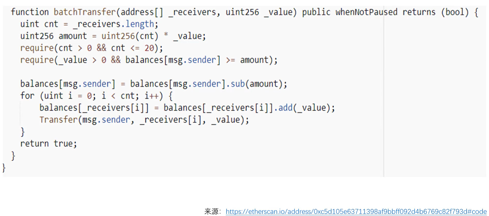	

### bug 分析
- 在第三行

		uint256 amount = unint256(cnt) * _value;  <- 这里很大值可能溢出，而导致 amount 很小
- 第八行

		balances[_receivers[i] ] = balance[_receivers[i]].add(_value); <- 这里的 value 会保持原数据

这个错误会导致系统中评估发行很多代币

### 攻击细节
- 攻击分析

		
- 链交易

	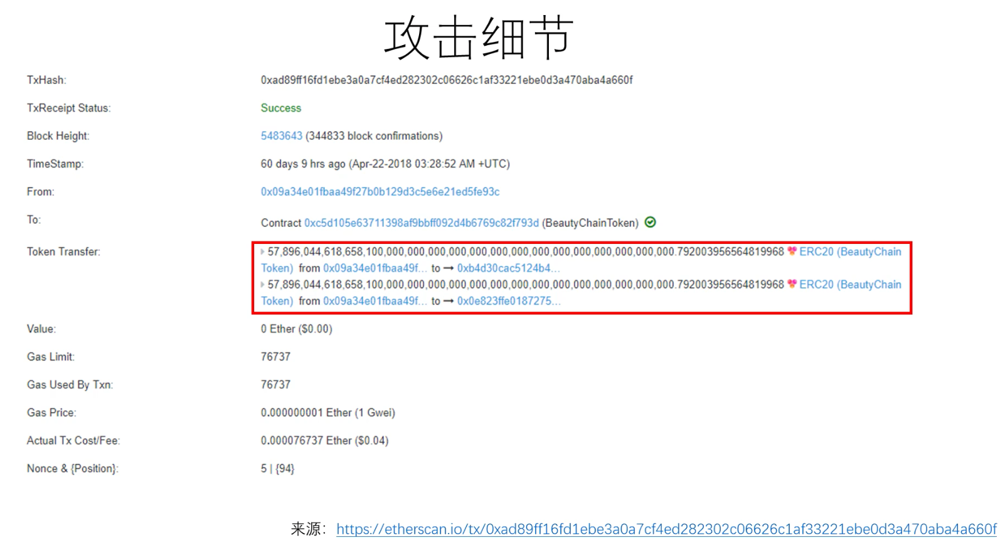	
- 攻击结果

	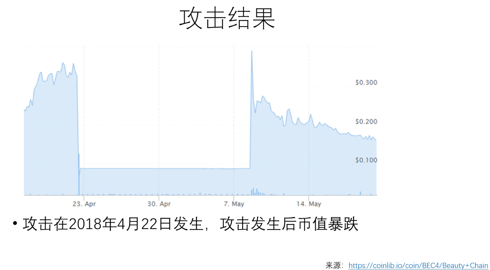
- 交易所补救，暂停提币，两天后交易回滚

		

### 预防措施
写合约的时候首先要考虑的是计算是不是会有溢出，检查使用 SafeMath 库

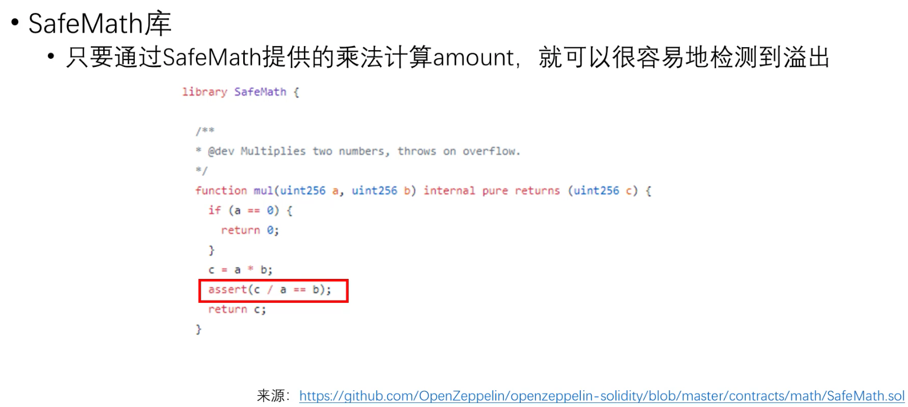				
			 
## 对于场景想法
加密货币的优势

- 通过和信息流通的方式进行融合来做全球支付
	- 当前的支付渠道和信息流通的渠道相互分离，且有国界
	- 下一代互联网是价值交换网络
		- 信息传播和交互很方便
		- 信息的价值交换很复杂 

与现有支付方式的对比
  
- 不和已有的支付方式进行竞争，能用传统方式可以使用传统方式支付
- 随着技术的改进，支付效率已经在提高
- 低效和高效是在当时的情况下进行对比
- 智能合约的问题随着发展将会逐步改善

###  去中心化思考
- 去中心化一定是好的事情麽？
- 去中心化能解决所有问题？
- 投票就是最好的制度麽？	 
- 去中心化商业模式就一定是好的？

## 参考 
- [北京大学肖臻老师《区块链技术与应用》公开课](https://www.bilibili.com/video/BV1Vt411X7JF)